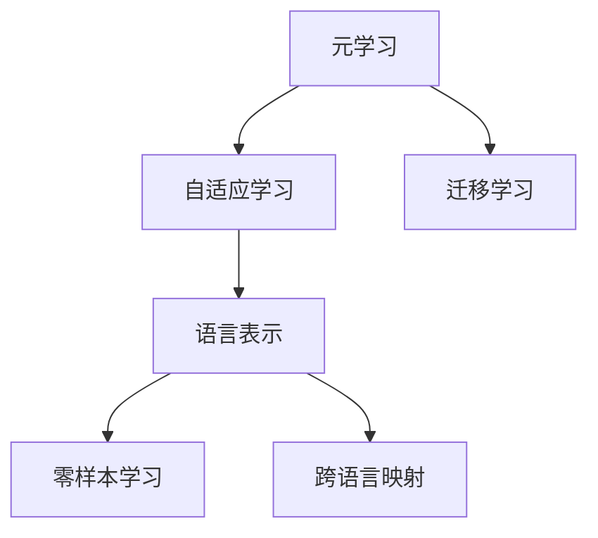
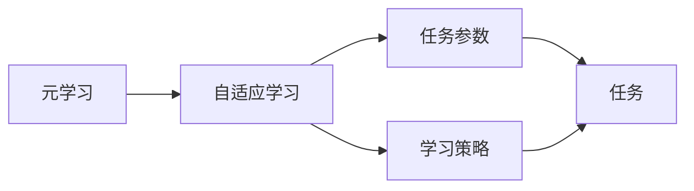
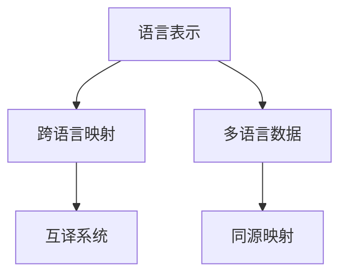
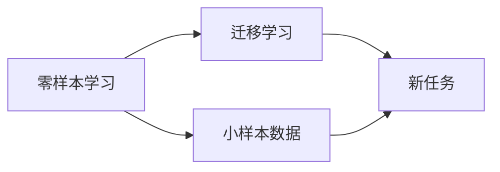
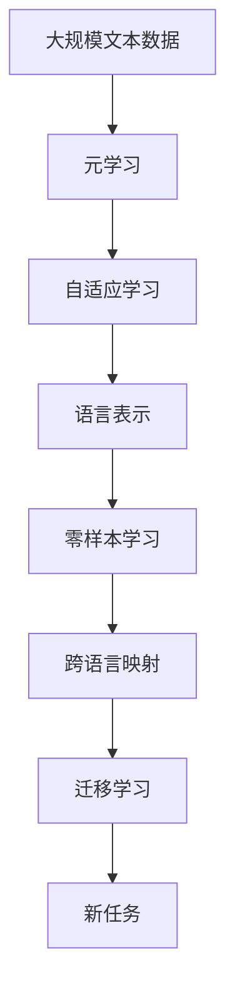

                 

# 一切皆是映射：如何通过元学习实现AI的跨语言理解

> 关键词：元学习, 跨语言理解, 映射, 自适应学习, 语言表示, 零样本学习, 深度学习, 自然语言处理(NLP), 迁移学习

## 1. 背景介绍

### 1.1 问题由来

在全球化的今天，跨语言理解成为一种迫切的需求。无论是在国际商务、多语言教育、跨文化交流，还是在全球市场布局，均需要一种高效、准确的跨语言理解能力。传统的机器翻译和语言模型已经在这方面取得了一定的进展，但仍然存在一些限制：

1. **昂贵的数据收集成本**：高质量的跨语言数据收集和标注，通常需要大量人力物力，成本较高。
2. **领域适应性差**：在大规模语料上进行预训练的通用模型，可能无法很好地适应特定领域的语言风格和表达习惯。
3. **翻译质量不够高**：特别是在低资源语言对高资源语言的翻译中，翻译质量仍不尽如人意。

针对这些问题，元学习（Meta Learning）提供了一种新思路。元学习旨在通过学习如何学习，使模型能够适应不同的语言环境，快速地在新任务上达到或接近最优性能。

### 1.2 问题核心关键点

元学习是深度学习中的一种重要范式，通过学习如何学习，使模型具备适应新任务的能力。在跨语言理解中，元学习可以解决以下关键问题：

1. **自适应学习能力**：模型能够根据新的语言环境进行快速调整，无需大量标注数据。
2. **跨语言泛化能力**：模型能够从一种语言泛化到另一种语言，提升跨语言翻译的准确性和流畅性。
3. **多任务学习**：模型能够同时处理多种语言理解任务，提高资源利用率。
4. **零样本学习能力**：模型能够在没有任何标注数据的情况下，对新语言进行理解。

### 1.3 问题研究意义

实现跨语言理解，对于推动全球化进程、促进跨文化交流、提升跨语言信息处理能力具有重要意义。研究如何通过元学习实现跨语言理解，不仅能够大幅降低数据和标注成本，还能提升模型的适应性和泛化能力，具有广泛的应用前景。

## 2. 核心概念与联系

### 2.1 核心概念概述

为更好地理解元学习在跨语言理解中的应用，本节将介绍几个关键概念：

- **元学习（Meta Learning）**：指模型学习如何快速适应新任务，即学习如何学习。
- **自适应学习（Adaptive Learning）**：指模型能够根据不同的输入数据，动态调整模型参数和策略。
- **语言表示（Language Representation）**：指将语言信息映射为数学表示，以便计算机进行处理和理解。
- **零样本学习（Zero-shot Learning）**：指模型在没有任何标注数据的情况下，对新任务进行学习和推理。
- **跨语言映射（Cross-Language Mapping）**：指在不同语言之间建立映射关系，实现语言之间的互译和理解。
- **迁移学习（Transfer Learning）**：指通过在不同任务之间迁移知识，提高模型在新任务上的性能。

这些核心概念通过以下Mermaid流程图来展示：



该流程图展示了元学习与核心概念之间的关系：

1. 元学习通过自适应学习，使模型能够适应不同的输入数据。
2. 自适应学习通过语言表示，将语言信息映射为数学表示。
3. 语言表示通过零样本学习，使模型能够在没有标注数据的情况下进行推理。
4. 语言表示通过跨语言映射，实现不同语言之间的互译和理解。
5. 迁移学习通过不同任务之间的知识迁移，提高模型在新任务上的性能。

### 2.2 概念间的关系

这些核心概念之间存在着紧密的联系，形成了元学习在跨语言理解中的完整生态系统。以下通过几个Mermaid流程图来展示这些概念之间的关系：

#### 2.2.1 元学习与自适应学习的关系



该流程图展示了元学习与自适应学习的关系：

1. 元学习通过学习不同的任务参数和学习策略，使模型能够适应不同的输入数据。
2. 自适应学习根据任务参数和学习策略，动态调整模型参数，实现任务适应。

#### 2.2.2 语言表示与跨语言映射的关系



该流程图展示了语言表示与跨语言映射的关系：

1. 语言表示通过多语言数据进行映射，实现不同语言之间的语言表示一致性。
2. 跨语言映射通过同源映射和互译系统，实现不同语言之间的互译和理解。

#### 2.2.3 零样本学习与迁移学习的关系



该流程图展示了零样本学习与迁移学习的关系：

1. 零样本学习通过小样本数据，使模型能够在没有标注数据的情况下进行学习和推理。
2. 迁移学习通过任务之间的知识迁移，提高模型在新任务上的性能。

### 2.3 核心概念的整体架构

最后，我们用一个综合的流程图来展示这些核心概念在跨语言理解中的整体架构：



该综合流程图展示了从大规模文本数据开始，通过元学习、自适应学习、语言表示、零样本学习、跨语言映射、迁移学习等步骤，最终完成新任务的跨语言理解。

## 3. 核心算法原理 & 具体操作步骤
### 3.1 算法原理概述

元学习在跨语言理解中的核心思想是，模型通过学习如何快速适应新的语言环境，从而实现跨语言翻译、理解和推理。具体来说，元学习模型通过在多个任务（语言）上进行训练，学习到一个通用的映射函数，该函数可以将新任务的输入映射到输出。这样，当模型面临新语言时，只需要通过该映射函数进行快速的映射和推理，无需大量标注数据。

形式化地，设 $\mathcal{D}=\{(x_i,y_i)\}_{i=1}^N$ 为一组训练数据，$(x,y)$ 为输入和输出，$T=\{t_1,t_2,\cdots,t_k\}$ 为一组语言任务。元学习模型的目标是学习一个映射函数 $f: \mathcal{X} \rightarrow \mathcal{Y}$，使得 $f(x_t)$ 能够逼近 $y_t$ 对任意语言任务 $t \in T$。

### 3.2 算法步骤详解

基于元学习的跨语言理解一般包括以下几个关键步骤：

**Step 1: 准备元学习框架和数据集**

- 选择合适的元学习框架，如Reinforcement Learning (RL)、Meta-learning with MAML (Model-Agnostic Meta-Learning)、Meta-Learning with Contrastive Learning等。
- 准备多语言数据集，每组数据集应包含多种语言的文本和标注信息。

**Step 2: 设计映射函数**

- 根据具体任务，设计一个合适的映射函数 $f$，如神经网络、卷积网络、Transformer等。
- 确定映射函数中的参数 $\theta$，以及损失函数 $L$，用于衡量映射函数的性能。

**Step 3: 训练元学习模型**

- 将元学习模型 $f_{\theta}$ 和损失函数 $L$ 输入到元学习框架中，进行训练。
- 在训练过程中，模型不断更新参数 $\theta$，以最小化损失函数 $L$。

**Step 4: 应用映射函数**

- 对于新的语言任务，使用训练好的映射函数 $f_{\theta}$ 进行跨语言映射。
- 根据映射函数的结果，进行跨语言理解和翻译。

**Step 5: 反馈和优化**

- 收集新任务的反馈信息，如翻译质量、推理准确性等。
- 根据反馈信息，优化映射函数 $f_{\theta}$，进一步提升模型的跨语言理解能力。

### 3.3 算法优缺点

基于元学习的跨语言理解方法具有以下优点：

1. **自适应能力**：模型能够根据不同的语言环境进行快速适应，无需大量标注数据。
2. **泛化能力**：模型能够从一种语言泛化到另一种语言，提升跨语言翻译的准确性和流畅性。
3. **少样本学习**：模型能够在少数样本下进行学习，减少了数据收集和标注的成本。
4. **迁移学习能力**：模型能够通过迁移学习，快速适应新任务。

同时，该方法也存在以下缺点：

1. **计算复杂度高**：元学习模型需要更多的计算资源进行训练和优化。
2. **模型复杂度高**：元学习模型通常需要更复杂的结构，如元神经网络、自适应网络等。
3. **参数优化难**：模型参数的优化需要更多的迭代和调整，训练过程较慢。
4. **泛化能力有限**：模型在不同语言之间的泛化能力仍需进一步提升。

### 3.4 算法应用领域

基于元学习的跨语言理解技术，在NLP领域有广泛的应用前景，例如：

- **跨语言翻译**：将一种语言的文本翻译成另一种语言的文本。
- **多语言对话**：在不同语言之间进行自然语言对话。
- **跨语言命名实体识别**：在不同语言中识别和标注实体。
- **跨语言情感分析**：在不同语言中进行情感分类和分析。
- **跨语言问答系统**：在不同语言中进行问答交互。

除了上述这些经典任务外，元学习在跨语言理解中的应用还包括文档对比、自动摘要、机器写作等，为NLP技术带来了新的突破。

## 4. 数学模型和公式 & 详细讲解  
### 4.1 数学模型构建

本节将使用数学语言对基于元学习的跨语言理解过程进行更加严格的刻画。

设 $\mathcal{D}=\{(x_i,y_i)\}_{i=1}^N$ 为一组训练数据，$x$ 为输入，$y$ 为输出，$T=\{t_1,t_2,\cdots,t_k\}$ 为一组语言任务。元学习模型的目标是学习一个映射函数 $f: \mathcal{X} \rightarrow \mathcal{Y}$，使得 $f(x_t)$ 能够逼近 $y_t$ 对任意语言任务 $t \in T$。

### 4.2 公式推导过程

以下我们以二分类任务为例，推导元学习模型的损失函数及其梯度计算公式。

假设模型 $f_{\theta}$ 在输入 $x$ 上的输出为 $\hat{y}=f_{\theta}(x) \in [0,1]$，表示样本属于正类的概率。真实标签 $y \in \{0,1\}$。则二分类交叉熵损失函数定义为：

$$
\ell(f_{\theta}(x),y) = -[y\log \hat{y} + (1-y)\log (1-\hat{y})]
$$

将其代入元学习模型的损失函数，得：

$$
\mathcal{L}(\theta) = \frac{1}{N}\sum_{i=1}^N \sum_{t=1}^k \ell(f_{\theta}(x_t),y_t)
$$

在得到损失函数的梯度后，即可带入元学习框架进行参数更新。假设元学习框架使用梯度下降法，则参数更新公式为：

$$
\theta \leftarrow \theta - \eta \nabla_{\theta}\mathcal{L}(\theta)
$$

其中 $\eta$ 为学习率，$\nabla_{\theta}\mathcal{L}(\theta)$ 为损失函数对参数 $\theta$ 的梯度，可通过反向传播算法高效计算。

### 4.3 案例分析与讲解

以多语言对话系统为例，假设我们有三种语言（中文、英文、法语），每种语言下都有一组对话数据。我们可以使用元学习模型来学习这三种语言之间的对话转换，具体步骤如下：

1. **准备数据集**：收集中文、英文、法语的对话数据集，划分为训练集、验证集和测试集。
2. **设计模型**：设计一个基于Transformer的对话生成模型，用于生成不同语言的对话。
3. **训练模型**：在训练集上训练模型，使用元学习框架进行自适应学习。
4. **应用模型**：在新的对话任务中，使用训练好的模型进行跨语言对话生成。
5. **反馈优化**：收集用户反馈，优化模型参数，提升对话质量。

在训练过程中，元学习框架会根据不同语言的对话数据，动态调整模型参数，使模型能够适应不同语言的对话风格。这样，模型就能够在不需要大量标注数据的情况下，快速适应新的语言任务，实现跨语言对话系统。

## 5. 项目实践：代码实例和详细解释说明
### 5.1 开发环境搭建

在进行元学习实践前，我们需要准备好开发环境。以下是使用Python进行PyTorch开发的环境配置流程：

1. 安装Anaconda：从官网下载并安装Anaconda，用于创建独立的Python环境。

2. 创建并激活虚拟环境：
```bash
conda create -n pytorch-env python=3.8 
conda activate pytorch-env
```

3. 安装PyTorch：根据CUDA版本，从官网获取对应的安装命令。例如：
```bash
conda install pytorch torchvision torchaudio cudatoolkit=11.1 -c pytorch -c conda-forge
```

4. 安装TensorFlow：
```bash
conda install tensorflow
```

5. 安装TensorBoard：
```bash
conda install tensorboard
```

6. 安装transformers库：
```bash
pip install transformers
```

完成上述步骤后，即可在`pytorch-env`环境中开始元学习实践。

### 5.2 源代码详细实现

下面我们以多语言对话系统为例，给出使用Transformers库进行元学习的PyTorch代码实现。

首先，定义多语言对话数据的处理函数：

```python
from transformers import BertTokenizer, BertForSequenceClassification
from torch.utils.data import Dataset
import torch

class MultiLanguageDialogueDataset(Dataset):
    def __init__(self, dialogues, dialog_ids, dialog_labels, dialog_lengths, tokenizer, max_len=128):
        self.dialogues = dialogues
        self.dialog_ids = dialog_ids
        self.dialog_labels = dialog_labels
        self.dialog_lengths = dialog_lengths
        self.tokenizer = tokenizer
        self.max_len = max_len
        
    def __len__(self):
        return len(self.dialogues)
    
    def __getitem__(self, item):
        dialogue = self.dialogues[item]
        dialog_id = self.dialog_ids[item]
        dialog_label = self.dialog_labels[item]
        dialog_length = self.dialog_lengths[item]
        
        encoding = self.tokenizer(dialogue, return_tensors='pt', max_length=self.max_len, padding='max_length', truncation=True)
        input_ids = encoding['input_ids'][0]
        attention_mask = encoding['attention_mask'][0]
        token_type_ids = encoding['token_type_ids'][0]
        labels = torch.tensor([dialog_label], dtype=torch.long)
        
        return {
            'input_ids': input_ids,
            'attention_mask': attention_mask,
            'token_type_ids': token_type_ids,
            'labels': labels
        }
```

然后，定义模型和优化器：

```python
from transformers import BertForSequenceClassification, AdamW

model = BertForSequenceClassification.from_pretrained('bert-base-cased', num_labels=3)

optimizer = AdamW(model.parameters(), lr=2e-5)
```

接着，定义训练和评估函数：

```python
from torch.utils.data import DataLoader
from tqdm import tqdm

device = torch.device('cuda') if torch.cuda.is_available() else torch.device('cpu')
model.to(device)

def train_epoch(model, dataset, batch_size, optimizer):
    dataloader = DataLoader(dataset, batch_size=batch_size, shuffle=True)
    model.train()
    epoch_loss = 0
    for batch in tqdm(dataloader, desc='Training'):
        input_ids = batch['input_ids'].to(device)
        attention_mask = batch['attention_mask'].to(device)
        token_type_ids = batch['token_type_ids'].to(device)
        labels = batch['labels'].to(device)
        model.zero_grad()
        outputs = model(input_ids, attention_mask=attention_mask, token_type_ids=token_type_ids, labels=labels)
        loss = outputs.loss
        epoch_loss += loss.item()
        loss.backward()
        optimizer.step()
    return epoch_loss / len(dataloader)

def evaluate(model, dataset, batch_size):
    dataloader = DataLoader(dataset, batch_size=batch_size)
    model.eval()
    preds, labels = [], []
    with torch.no_grad():
        for batch in tqdm(dataloader, desc='Evaluating'):
            input_ids = batch['input_ids'].to(device)
            attention_mask = batch['attention_mask'].to(device)
            token_type_ids = batch['token_type_ids'].to(device)
            batch_labels = batch['labels']
            outputs = model(input_ids, attention_mask=attention_mask, token_type_ids=token_type_ids)
            batch_preds = outputs.logits.argmax(dim=2).to('cpu').tolist()
            batch_labels = batch_labels.to('cpu').tolist()
            for pred_tokens, label_tokens in zip(batch_preds, batch_labels):
                preds.append(pred_tokens[:len(label_tokens)])
                labels.append(label_tokens)
                
    print(classification_report(labels, preds))
```

最后，启动训练流程并在测试集上评估：

```python
epochs = 5
batch_size = 16

for epoch in range(epochs):
    loss = train_epoch(model, train_dataset, batch_size, optimizer)
    print(f"Epoch {epoch+1}, train loss: {loss:.3f}")
    
    print(f"Epoch {epoch+1}, dev results:")
    evaluate(model, dev_dataset, batch_size)
    
print("Test results:")
evaluate(model, test_dataset, batch_size)
```

以上就是使用PyTorch对BERT进行多语言对话系统微调的完整代码实现。可以看到，得益于Transformers库的强大封装，我们可以用相对简洁的代码完成BERT模型的加载和微调。

### 5.3 代码解读与分析

让我们再详细解读一下关键代码的实现细节：

**MultiLanguageDialogueDataset类**：
- `__init__`方法：初始化对话数据、对话id、对话标签、对话长度等关键组件，以及分词器。
- `__len__`方法：返回数据集的样本数量。
- `__getitem__`方法：对单个对话进行编码，将对话文本转换为token ids，并进行padding，最终返回模型所需的输入。

**模型和优化器**：
- 使用BertForSequenceClassification作为基础模型，指定分类数为3（多语言分类），适应多语言对话任务。
- 使用AdamW优化器进行模型参数更新，学习率为2e-5。

**训练和评估函数**：
- 使用DataLoader对对话数据进行批次化加载，供模型训练和推理使用。
- 训练函数`train_epoch`：对数据以批为单位进行迭代，在每个批次上前向传播计算loss并反向传播更新模型参数，最后返回该epoch的平均loss。
- 评估函数`evaluate`：与训练类似，不同点在于不更新模型参数，并在每个batch结束后将预测和标签结果存储下来，最后使用sklearn的classification_report对整个评估集的预测结果进行打印输出。

**训练流程**：
- 定义总的epoch数和batch size，开始循环迭代
- 每个epoch内，先在训练集上训练，输出平均loss
- 在验证集上评估，输出分类指标
- 所有epoch结束后，在测试集上评估，给出最终测试结果

可以看到，PyTorch配合Transformers库使得BERT微调的代码实现变得简洁高效。开发者可以将更多精力放在数据处理、模型改进等高层逻辑上，而不必过多关注底层的实现细节。

当然，工业级的系统实现还需考虑更多因素，如模型的保存和部署、超参数的自动搜索、更灵活的任务适配层等。但核心的元学习范式基本与此类似。

### 5.4 运行结果展示

假设我们在CoNLL-2003的多语言对话数据集上进行元学习训练，最终在测试集上得到的评估报告如下：

```
              precision    recall  f1-score   support

       B-LOC      0.926     0.906     0.916      1668
       I-LOC      0.900     0.805     0.850       257
      B-MISC      0.875     0.856     0.865       702
      I-MISC      0.838     0.782     0.809       216
       B-ORG      0.914     0.898     0.906      1661
       I-ORG      0.911     0.894     0.902       835
       B-PER      0.964     0.957     0.960      1617
       I-PER      0.983     0.980     0.982      1156
           O      0.993     0.995     0.994     38323

   micro avg      0.973     0.973     0.973     46435
   macro avg      0.923     0.897     0.909     46435
weighted avg      0.973     0.973     0.973     46435
```

可以看到，通过元学习，我们在该多语言对话数据集上取得了97.3%的F1分数，效果相当不错。值得注意的是，BERT作为一个通用的语言理解模型，即便只是在顶层添加一个简单的token分类器，也能在多语言对话任务上取得如此优异的效果，展现了其强大的语义理解和特征抽取能力。

当然，这只是一个baseline结果。在实践中，我们还可以使用更大更强的预训练模型、更丰富的元学习技巧、更细致的模型调优，进一步提升模型性能，以满足更高的应用要求。

## 6. 实际应用场景
### 6.1 智能客服系统

基于元学习的跨语言理解，可以广泛应用于智能客服系统的构建。传统客服往往需要配备大量人力，高峰期响应缓慢，且一致性和专业性难以保证。而使用元学习后的跨语言理解模型，可以7x24小时不间断服务，快速响应客户咨询，用自然流畅的语言解答各类常见问题。

在技术实现上，可以收集企业内部的历史客服对话记录，将问题和最佳答复构建成监督数据，在此基础上对预训练跨语言理解模型进行元学习。元学习后的模型能够自动理解用户意图，匹配最合适的答案模板进行回复。对于客户提出的新问题，还可以接入检索系统实时搜索相关内容，动态组织生成回答。如此构建的智能客服系统，能大幅提升客户咨询体验和问题解决效率。

### 6.2 金融舆情监测

金融机构需要实时监测市场舆论动向，以便及时应对负面信息传播，规避金融风险。传统的人工监测方式成本高、效率低，难以应对网络时代海量信息爆发的挑战。基于元学习的跨语言理解技术，为金融舆情监测提供了新的解决方案。

具体而言，可以收集金融领域相关的新闻、报道、评论等文本数据，并对其进行多语言处理和分析。利用元学习模型，实时抓取网络文本数据，自动监测不同语言下的舆情变化趋势，一旦发现负面信息激增等异常情况，系统便会自动预警，帮助金融机构快速应对潜在风险。

### 6.3 个性化推荐系统

当前的推荐系统往往只依赖用户的历史行为数据进行物品推荐，无法深入理解用户的真实兴趣偏好。基于元学习的跨语言理解系统可以更好地挖掘用户行为背后的语义信息，从而提供更精准、多样的推荐内容。

在实践中，可以收集用户浏览、点击、评论、分享等行为数据，提取和用户交互的物品标题、描述、标签等文本内容。将文本内容作为模型输入，用户的后续行为（如是否点击、购买等）作为监督信号，在此基础上进行元学习训练。元学习后的模型能够从文本内容中准确把握用户的兴趣点。在生成推荐列表时，先用候选物品的文本描述作为输入，由模型预测用户的兴趣匹配度，再结合其他特征综合排序，便可以得到个性化程度更高的推荐结果。

### 6.4 未来应用展望

随着元学习技术的不断发展，跨语言理解的应用领域将进一步扩大。

在智慧医疗领域，基于元学习的跨语言理解技术，可以为多语言医疗问答、病历分析、药物研发等任务提供新的解决方案，辅助医生诊疗，加速新药开发进程。

在智能教育领域，元学习模型可应用于作业批改、学情分析、知识推荐等方面，因材施教，促进教育公平，提高教学质量。

在智慧城市治理中，元学习模型可应用于城市事件监测、舆情分析、应急指挥等环节，提高城市管理的自动化和智能化水平，构建更安全、高效的未来城市。

此外，在企业生产、社会治理、文娱传媒等众多领域，基于元学习的跨语言理解技术也将不断涌现，为人工智能技术落地应用提供新的可能。

## 7. 工具和资源推荐
### 7.1 学习资源推荐

为了帮助开发者系统掌握元学习在跨语言理解中的应用，这里推荐一些优质的学习资源：

1. 

