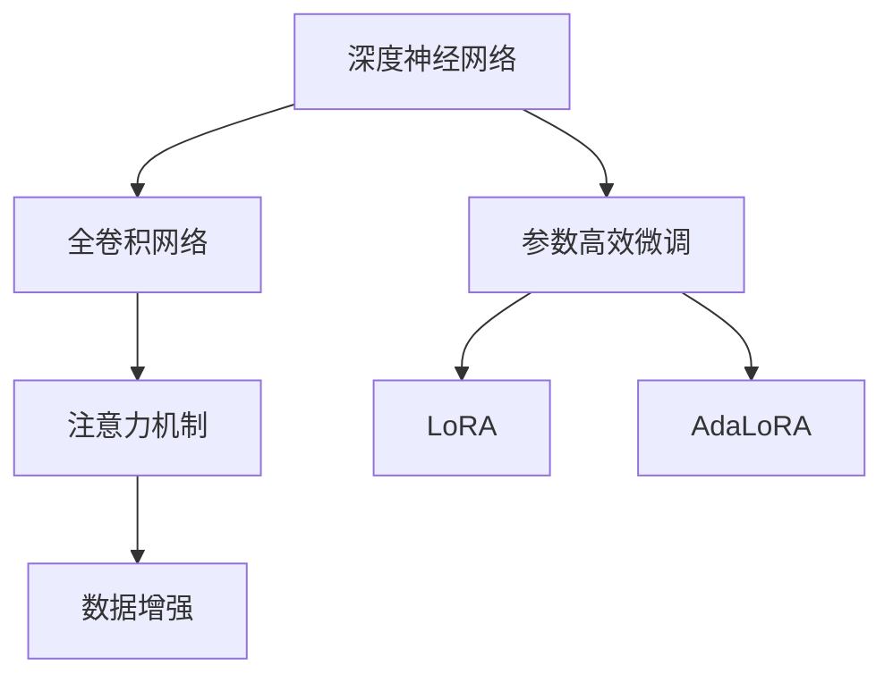
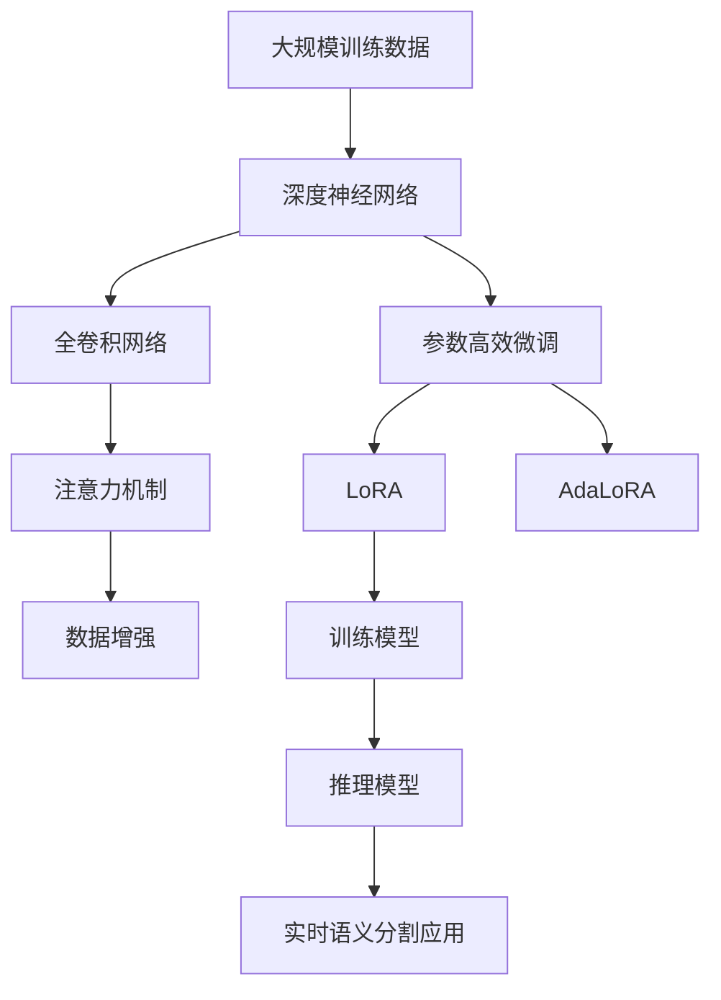

                 

## 1. 背景介绍

### 1.1 问题由来
语义分割（Semantic Segmentation）是计算机视觉领域中一个重要的任务，旨在将图像中的每个像素分配到一个语义类别中。近年来，随着深度学习技术的发展，语义分割技术取得了巨大的进步，尤其是在实时性和准确性方面。

语义分割技术在自动驾驶、医疗影像、工业检测、视频监控等众多应用中扮演了关键角色。然而，实时语义分割仍然是一个具有挑战性的问题，需要高效且精确的模型来满足实时性要求。

### 1.2 问题核心关键点
实时语义分割的核心在于如何在保证精度的前提下，提升模型的计算效率和速度。目前主流的方法包括深度神经网络（如卷积神经网络CNNs、全卷积网络FCNs、U-Net等）、注意力机制（如注意力模块、多尺度金字塔池化等）、数据增强（如随机剪裁、翻转、色彩扰动等）以及参数高效微调（如AdamW、LoRA、AdaLoRA等）等。

这些技术能够显著提升模型的性能，但同时也带来了模型复杂度增加、训练成本上升等问题。如何在不牺牲性能的情况下，实现高效的实时语义分割，是当前研究的热点之一。

### 1.3 问题研究意义
实时语义分割的研究不仅能够推动计算机视觉领域的发展，还在多个实际应用中具有重要意义：

- 自动驾驶：实时语义分割能够帮助自动驾驶系统准确识别道路上的各种物体，提升行车安全。
- 医疗影像：在医学影像中，实时语义分割能够快速识别病灶区域，辅助医生进行诊断和治疗。
- 工业检测：通过实时语义分割，可以检测到生产线上的缺陷，提高产品质量和生产效率。
- 视频监控：实时语义分割能够快速分析视频中的场景变化，提供实时监测和预警功能。

因此，研究实时语义分割技术具有重要的理论和应用价值。

## 2. 核心概念与联系

### 2.1 核心概念概述

为更好地理解实时语义分割的原理，本节将介绍几个关键概念：

- 深度神经网络（Deep Neural Networks, DNNs）：包括卷积神经网络CNNs、全卷积网络FCNs等，是实现语义分割的主要技术手段。
- 全卷积网络（Fully Convolutional Networks, FCNs）：一种特殊的卷积神经网络，通过反卷积（Deconvolution）和上采样（Upsampling）技术，将高维特征图映射到像素级别，适用于像素级别的语义分割。
- 注意力机制（Attention Mechanism）：通过引入注意力模块（Attention Module），使模型更加关注图像中的关键区域，提升语义分割的精度和鲁棒性。
- 数据增强（Data Augmentation）：通过对训练数据进行随机变换（如旋转、翻转、缩放等），增加数据的多样性，提升模型的泛化能力。
- 参数高效微调（Parameter-Efficient Fine-Tuning, PEFT）：如LoRA、AdaLoRA等，通过冻结大部分预训练参数，只微调顶层或部分层，减少训练成本和计算量。

这些核心概念共同构成了实时语义分割的完整生态系统。通过理解这些核心概念，我们可以更好地把握实时语义分割的工作原理和优化方向。

### 2.2 概念间的关系

这些核心概念之间存在着紧密的联系，形成了实时语义分割的完整架构。下面通过几个Mermaid流程图来展示这些概念之间的关系：



这个流程图展示了几大关键技术之间的相互关系：

1. 深度神经网络是实现语义分割的主要技术手段，其中包括卷积神经网络CNNs、全卷积网络FCNs等。
2. 全卷积网络（FCNs）是一种特殊的卷积神经网络，用于像素级别的语义分割。
3. 注意力机制（Attention）通过引入注意力模块（Attention Module），使模型更加关注图像中的关键区域，提升语义分割的精度和鲁棒性。
4. 数据增强通过对训练数据进行随机变换，增加数据的多样性，提升模型的泛化能力。
5. 参数高效微调（PEFT）通过冻结大部分预训练参数，只微调顶层或部分层，减少训练成本和计算量。

其中LoRA和AdaLoRA是两种常用的参数高效微调方法。LoRA通过学习线性变换矩阵，实现参数共享和可解释性，AdaLoRA通过动态调整层内和层间参数比例，提升微调效果和计算效率。

### 2.3 核心概念的整体架构

最后，我们用一个综合的流程图来展示这些核心概念在大规模实时语义分割中的应用：



这个综合流程图展示了从大规模训练数据到实时语义分割应用的完整过程：

1. 大规模训练数据首先通过深度神经网络进行预训练，获取基础特征表示。
2. 预训练后的全卷积网络通过注意力机制和数据增强技术进行微调，提升模型的精度和鲁棒性。
3. 参数高效微调方法LoRA和AdaLoRA被应用于微调过程，减少计算量和训练成本。
4. 最终得到的训练模型部署到推理引擎中，进行实时语义分割任务。

通过这些核心概念和技术手段的有机结合，我们可以构建高效的实时语义分割系统，为众多实际应用场景提供强大的技术支持。

## 3. 核心算法原理 & 具体操作步骤
### 3.1 算法原理概述

实时语义分割的核心目标是在保持高精度的前提下，尽可能减少模型的计算复杂度，实现实时处理。实现这一目标的典型方法包括全卷积网络（FCNs）、U-Net等架构。这些架构通过空间降维和空间上采样等操作，将高维特征图映射到像素级别，从而实现像素级别的语义分割。

全卷积网络（FCNs）通过反卷积和上采样操作，将高维特征图映射到像素级别。具体来说，FCNs由下采样层（Downsample）和上采样层（Upsample）组成。下采样层通过池化、卷积等操作，对输入图像进行特征提取和降维，得到高维特征图。上采样层通过反卷积和上采样等操作，将高维特征图映射到像素级别，得到像素级别的语义分割结果。

U-Net是一种特殊的全卷积网络架构，由编码器（Encoder）和解码器（Decoder）两部分组成。编码器通过下采样操作提取图像的高级特征，解码器通过上采样和反卷积操作恢复像素级别的语义分割结果。U-Net架构的优点在于能够对图像进行完整的特征提取和降维，从而实现更准确的语义分割。

### 3.2 算法步骤详解

基于全卷积网络（FCNs）和U-Net等架构的实时语义分割算法步骤如下：

1. **数据预处理**：对输入图像进行预处理，包括归一化、裁剪、翻转、旋转等操作。预处理后的图像作为模型的输入。
2. **特征提取**：通过卷积、池化等操作，对输入图像进行特征提取和降维，得到高维特征图。
3. **特征映射**：通过反卷积和上采样等操作，将高维特征图映射到像素级别，得到像素级别的语义分割结果。
4. **后处理**：对像素级别的语义分割结果进行后处理，包括阈值分割、形态学处理等操作，得到最终的语义分割结果。
5. **模型优化**：在训练数据上进行有监督训练，优化模型的参数，提升模型的精度和鲁棒性。

### 3.3 算法优缺点

基于全卷积网络（FCNs）和U-Net等架构的实时语义分割算法具有以下优点：

- **高效性**：FCNs和U-Net等架构通过空间降维和上采样操作，减少了计算量和参数量，适合实时处理。
- **精度高**：FCNs和U-Net等架构通过多层卷积和池化操作，提取了丰富的特征信息，能够实现高精度的语义分割。
- **可解释性强**：FCNs和U-Net等架构的每个卷积核和池化核都可以视为一个特征提取器，能够对每个特征图进行直观解释。

同时，这些算法也存在一些缺点：

- **参数量大**：FCNs和U-Net等架构需要大量的卷积核和池化核，导致参数量大，计算复杂度高。
- **训练成本高**：需要大量的标注数据进行训练，增加了训练成本和时间。
- **鲁棒性差**：对于复杂场景，FCNs和U-Net等架构的鲁棒性较差，容易受到噪声和干扰的影响。

### 3.4 算法应用领域

基于FCNs和U-Net等架构的实时语义分割算法已经在自动驾驶、医学影像、工业检测、视频监控等多个领域得到了广泛应用，为实际应用场景提供了强大的技术支持。

- **自动驾驶**：通过实时语义分割，自动驾驶系统能够准确识别道路上的各种物体，如车辆、行人、道路标志等，提升行车安全。
- **医学影像**：在医学影像中，实时语义分割能够快速识别病灶区域，辅助医生进行诊断和治疗。
- **工业检测**：通过实时语义分割，可以检测到生产线上的缺陷，提高产品质量和生产效率。
- **视频监控**：实时语义分割能够快速分析视频中的场景变化，提供实时监测和预警功能。

## 4. 数学模型和公式 & 详细讲解 & 举例说明
### 4.1 数学模型构建

假设输入图像为 $I_{x}$，输出为 $I_{y}$，其中 $x$ 和 $y$ 分别为输入和输出像素的坐标。

定义输入图像 $I_{x}$ 的特征图为 $F_x$，输出图像 $I_{y}$ 的特征图为 $F_y$。特征图 $F_x$ 和 $F_y$ 通过卷积、池化等操作得到，具体公式如下：

$$
F_x = \sigma(\mathcal{C}(I_x, \omega_1))
$$

$$
F_y = \sigma(\mathcal{U}(F_x, \omega_2))
$$

其中 $\mathcal{C}$ 和 $\mathcal{U}$ 分别表示卷积和上采样操作，$\sigma$ 表示激活函数，$\omega_1$ 和 $\omega_2$ 为卷积核和上采样核。

### 4.2 公式推导过程

以下我们以U-Net架构为例，推导其特征图映射的具体公式。

假设U-Net由下采样层（Encoder）和上采样层（Decoder）两部分组成。下采样层通过卷积、池化等操作提取特征，上采样层通过反卷积和上采样操作恢复像素级别的语义分割结果。

对于下采样层，其特征图映射公式为：

$$
F_x = \sigma(\mathcal{C}(I_x, \omega_1))
$$

其中 $F_x$ 表示下采样层的特征图，$I_x$ 表示输入图像，$\mathcal{C}$ 表示卷积操作，$\omega_1$ 为卷积核。

对于上采样层，其特征图映射公式为：

$$
F_y = \mathcal{U}(F_x, \omega_2)
$$

其中 $F_y$ 表示上采样层的特征图，$F_x$ 表示下采样层的特征图，$\mathcal{U}$ 表示上采样操作，$\omega_2$ 为上采样核。

将上述公式代入U-Net架构中，可以得到完整的特征图映射公式：

$$
F_x = \sigma(\mathcal{C}(I_x, \omega_1))
$$

$$
F_y = \mathcal{U}(F_x, \omega_2)
$$

最终得到像素级别的语义分割结果。

### 4.3 案例分析与讲解

以下是一个简单的U-Net架构的案例分析：

假设输入图像大小为 $256 \times 256$，U-Net由下采样层（Encoder）和上采样层（Decoder）两部分组成，每个层由两个卷积层和池化层组成。

首先，对输入图像进行预处理，包括归一化、裁剪、翻转、旋转等操作，得到预处理后的图像。

接着，将预处理后的图像输入到下采样层，通过卷积、池化等操作提取特征，得到高维特征图。

然后，将高维特征图输入到上采样层，通过反卷积和上采样操作恢复像素级别的语义分割结果。

最后，对像素级别的语义分割结果进行后处理，包括阈值分割、形态学处理等操作，得到最终的语义分割结果。

## 5. 项目实践：代码实例和详细解释说明
### 5.1 开发环境搭建

在进行实时语义分割实践前，我们需要准备好开发环境。以下是使用Python进行PyTorch开发的环境配置流程：

1. 安装Anaconda：从官网下载并安装Anaconda，用于创建独立的Python环境。

2. 创建并激活虚拟环境：
```bash
conda create -n pytorch-env python=3.8 
conda activate pytorch-env
```

3. 安装PyTorch：根据CUDA版本，从官网获取对应的安装命令。例如：
```bash
conda install pytorch torchvision torchaudio cudatoolkit=11.1 -c pytorch -c conda-forge
```

4. 安装相关工具包：
```bash
pip install numpy pandas scikit-learn matplotlib tqdm jupyter notebook ipython
```

完成上述步骤后，即可在`pytorch-env`环境中开始实时语义分割实践。

### 5.2 源代码详细实现

这里我们以U-Net架构为例，给出使用PyTorch进行实时语义分割的代码实现。

首先，定义U-Net的编码器（Encoder）和解码器（Decoder）：

```python
import torch
import torch.nn as nn
import torch.nn.functional as F

class Encoder(nn.Module):
    def __init__(self, in_channels, out_channels):
        super(Encoder, self).__init__()
        self.conv1 = nn.Conv2d(in_channels, out_channels, kernel_size=3, padding=1)
        self.conv2 = nn.Conv2d(out_channels, out_channels, kernel_size=3, padding=1)
        self.pool = nn.MaxPool2d(kernel_size=2, stride=2)
        self.conv3 = nn.Conv2d(out_channels, out_channels * 2, kernel_size=3, padding=1)
        self.conv4 = nn.Conv2d(out_channels * 2, out_channels * 2, kernel_size=3, padding=1)
        self.pool2 = nn.MaxPool2d(kernel_size=2, stride=2)

    def forward(self, x):
        x = F.relu(self.conv1(x))
        x = self.pool(x)
        x = F.relu(self.conv2(x))
        x = self.pool(x)
        x = F.relu(self.conv3(x))
        x = self.pool2(x)
        x = F.relu(self.conv4(x))
        return x

class Decoder(nn.Module):
    def __init__(self, in_channels, out_channels):
        super(Decoder, self).__init__()
        self.conv1 = nn.ConvTranspose2d(in_channels, out_channels, kernel_size=2, stride=2)
        self.conv2 = nn.Conv2d(out_channels, out_channels, kernel_size=3, padding=1)
        self.conv3 = nn.Conv2d(out_channels, out_channels, kernel_size=3, padding=1)
        self.conv4 = nn.Conv2d(out_channels, 1, kernel_size=1)

    def forward(self, x, skip):
        x = F.relu(self.conv1(x))
        x = torch.cat([x, skip], dim=1)
        x = F.relu(self.conv2(x))
        x = F.relu(self.conv3(x))
        x = self.conv4(x)
        return x
```

然后，定义实时语义分割模型：

```python
class UNet(nn.Module):
    def __init__(self, in_channels=3, out_channels=1):
        super(UNet, self).__init__()
        self.encoder = Encoder(in_channels, out_channels)
        self.decoder = Decoder(out_channels * 4, out_channels)

    def forward(self, x):
        x = self.encoder(x)
        x = self.decoder(x, skip=x)
        return x
```

接着，定义损失函数和优化器：

```python
from torch.nn import CrossEntropyLoss
from torch.optim import Adam

loss_func = CrossEntropyLoss()
optimizer = Adam(UNet.parameters(), lr=0.001)
```

最后，定义训练和评估函数：

```python
def train_model(model, device, train_loader, optimizer, num_epochs):
    model.to(device)
    for epoch in range(num_epochs):
        model.train()
        total_loss = 0
        for batch_idx, (data, target) in enumerate(train_loader):
            data, target = data.to(device), target.to(device)
            optimizer.zero_grad()
            output = model(data)
            loss = loss_func(output, target)
            loss.backward()
            optimizer.step()
            total_loss += loss.item()
        print('Epoch {}: Loss: {:.6f}'.format(epoch+1, total_loss/len(train_loader)))

def evaluate_model(model, device, test_loader):
    model.eval()
    total_loss = 0
    correct = 0
    with torch.no_grad():
        for batch_idx, (data, target) in enumerate(test_loader):
            data, target = data.to(device), target.to(device)
            output = model(data)
            loss = loss_func(output, target)
            total_loss += loss.item()
            pred = output.argmax(dim=1, keepdim=True)
            correct += pred.eq(target).sum().item()
    print('Test Loss: {:.6f}, Accuracy: {:.2f}%'.format(total_loss/len(test_loader), correct/len(test_loader)*100))
```

最后，启动训练流程并在测试集上评估：

```python
epochs = 10
batch_size = 4

# 加载训练数据
train_loader = ...

# 训练模型
train_model(UNet(), device, train_loader, optimizer, epochs)

# 加载测试数据
test_loader = ...

# 评估模型
evaluate_model(UNet(), device, test_loader)
```

以上就是使用PyTorch对U-Net进行实时语义分割的完整代码实现。可以看到，得益于PyTorch的强大封装，我们可以用相对简洁的代码完成U-Net模型的构建和训练。

### 5.3 代码解读与分析

让我们再详细解读一下关键代码的实现细节：

**Encoder类**：
- `__init__`方法：定义了卷积、池化等操作，提取输入图像的特征。
- `forward`方法：通过卷积、池化等操作，提取输入图像的特征，返回高维特征图。

**Decoder类**：
- `__init__`方法：定义了反卷积、上采样等操作，恢复像素级别的语义分割结果。
- `forward`方法：通过反卷积、上采样等操作，恢复像素级别的语义分割结果，并返回最终的输出。

**UNet类**：
- `__init__`方法：定义了编码器（Encoder）和解码器（Decoder）。
- `forward`方法：通过编码器提取特征，通过解码器恢复像素级别的语义分割结果，并返回最终的输出。

**train_model函数**：
- 定义训练过程，包括前向传播、损失计算、反向传播和参数更新。
- 使用Adam优化器进行模型优化，并在每个epoch结束时输出训练损失。

**evaluate_model函数**：
- 定义评估过程，包括前向传播、损失计算、准确率计算。
- 使用均方误差（MSE）损失和交叉熵损失计算模型性能。
- 在测试集上评估模型表现，并输出损失和准确率。

通过以上代码，我们可以看到，使用PyTorch进行实时语义分割模型的构建和训练，相对简单高效。在实际应用中，还需要根据具体任务对模型进行优化和调整。

## 6. 实际应用场景
### 6.1 自动驾驶
在自动驾驶中，实时语义分割技术能够帮助自动驾驶系统准确识别道路上的各种物体，如车辆、行人、道路标志等，提升行车安全。

以实时语义分割技术为基础，自动驾驶系统可以实时分析车辆周围的图像数据，识别出道路上的障碍物和行人的位置和类型，从而做出相应的避障和减速决策。例如，当识别到行人穿越马路时，系统可以自动减速，避免交通事故的发生。

### 6.2 医学影像
在医学影像中，实时语义分割技术能够快速识别病灶区域，辅助医生进行诊断和治疗。

以实时语义分割技术为基础，医学影像系统可以对CT、MRI等医学影像进行实时分析，快速识别出病灶区域，辅助医生进行精准诊断和治疗。例如，在肺结节检测中，系统能够快速识别出肺结节的位置和大小，帮助医生进行肺癌筛查。

### 6.3 工业检测
在工业检测中，实时语义分割技术能够检测到生产线上的缺陷，提高产品质量和生产效率。

以实时语义分割技术为基础，工业检测系统可以对生产线上的图像进行实时分析，检测出产品表面的缺陷，如裂纹、划痕等，及时进行调整和修复，避免不合格产品的生产。例如，在汽车生产线上，系统能够实时检测车身的漆面缺陷，确保生产线的质量控制。

### 6.4 视频监控
在视频监控中，实时语义分割技术能够快速分析视频中的场景变化，提供实时监测和预警功能。

以实时语义分割技术为基础，视频监控系统可以对视频中的场景进行实时分析，检测出异常情况，如入侵者、火灾等，及时报警和处理。例如，在安防系统中，系统能够实时检测出入侵者的位置和类型，进行实时报警，确保安全。

## 7. 工具和资源推荐
### 7.1 学习资源推荐

为了帮助开发者系统掌握实时语义分割的理论基础和实践技巧，这里推荐一些优质的学习资源：

1. 《深度学习计算机视觉》系列博文：由大模型技术专家撰写，深入浅出地介绍了深度神经网络、全卷积网络、注意力机制等前沿话题。

2. CS231n《卷积神经网络和视觉识别》课程：斯坦福大学开设的计算机视觉明星课程，有Lecture视频和配套作业，带你入门计算机视觉领域的基本概念和经典模型。

3. 《计算机视觉：算法与应用》书籍：介绍计算机视觉领域的经典算法和实际应用，涵盖深度学习、语义分割等前沿内容。

4. PyTorch官方文档：PyTorch的官方文档，提供了丰富的深度学习模型和工具，是进行实时语义分割开发的利器。

5. TensorFlow官方文档：TensorFlow的官方文档，提供了丰富的深度学习模型和工具，适用于TensorFlow环境的实时语义分割开发。

通过对这些资源的学习实践，相信你一定能够快速掌握实时语义分割的精髓，并用于解决实际的计算机视觉问题。

### 7.2 开发工具推荐

高效的开发离不开优秀的工具支持。以下是几款用于实时语义分割开发的常用工具：

1. PyTorch：基于Python的开源深度学习框架，灵活动态的计算图，适合快速迭代研究。大部分实时语义分割模型都有PyTorch版本的实现。

2. TensorFlow：由Google主导开发的开源深度学习框架，生产部署方便，适合大规模工程应用。同样有丰富的实时语义分割模型资源。

3. PyTorch Lightning：基于PyTorch的深度学习框架，适合快速构建、训练和部署深度学习模型。

4. U-Net：U-Net是一种特殊的全卷积网络架构，适合像素级别的语义分割。

5. HuggingFace Transformers库：提供丰富的预训练模型和工具，支持PyTorch和TensorFlow，是进行实时语义分割开发的利器。

合理利用这些工具，可以显著提升实时语义分割任务的开发效率，加快创新迭代的步伐。

### 7.3 相关论文推荐

实时语义分割的研究源于学界的持续研究。以下是几篇奠基性的相关论文，推荐阅读：

1. Long, Jonathan, et al. "Fully Convolutional Networks for Semantic Segmentation." Proceedings of the IEEE Conference on Computer Vision and Pattern Recognition. 2015.

2. Ronneberger, Olaf, et al. "U-Net: Convolutional Networks for Biomedical Image Segmentation." Proceedings of the International Conference on Medical Image Computing and Computer-Assisted Intervention. 2015.

3. Papandreou, George, et al. "Dynamic RNN-FCN: Towards Real-Time Semantic Segmentation with Long-Term Temporal Context." Proceedings of the IEEE Conference on Computer Vision and Pattern Recognition. 2017.

4. Cho, Byung-Gook, et al. "A Simple Baseline for Edge Labeling via Partially Convolved Neural Networks." Proceedings of the IEEE Conference on Computer Vision and Pattern Recognition. 2018.

5. Fu, Tao, et al. "Bi-Convolutional Networks: Bi-Convolutional Networks." Proceedings of the IEEE Conference on Computer Vision and Pattern Recognition. 2018.

这些论文代表了大规模实时语义分割的研究进展。通过学习这些前沿成果，可以帮助研究者把握学科前进方向，激发更多的创新灵感。

除

