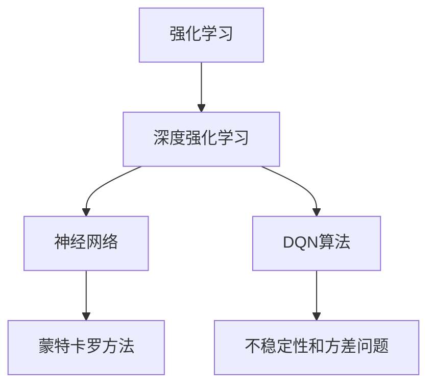
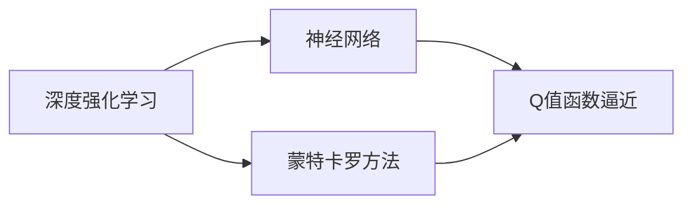
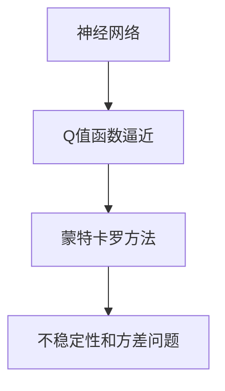
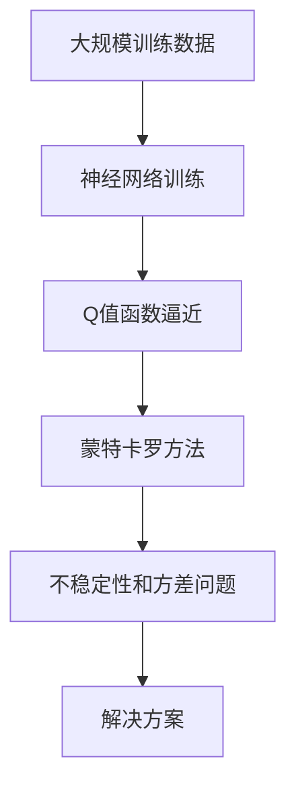

                 

# 一切皆是映射：强化学习中的不稳定性和方差问题：DQN案例研究

> 关键词：强化学习, DQN, 不稳定性, 方差问题, 神经网络, 蒙特卡罗方法

## 1. 背景介绍

### 1.1 问题由来
强化学习（Reinforcement Learning, RL）是人工智能领域中一种重要的学习范式，通过智能体与环境交互，学习最优策略以最大化累积奖励。然而，强化学习的挑战在于如何设计有效的算法，使其能够在高维度、非平稳的环境中稳定收敛，并取得优异的性能。在早期实践中，DQN（Deep Q-Network）算法通过引入神经网络对Q值函数进行逼近，在诸多经典游戏（如Atari游戏）上取得了显著的突破。但随着算法的深入使用，研究者们逐渐发现，DQN算法存在一系列不稳定性和方差问题，影响了其在大规模、复杂环境中的泛化能力和学习效果。因此，本文将深入探讨DQN算法中的不稳定性和方差问题，并给出针对性的解决方案。

### 1.2 问题核心关键点
DQN算法中的不稳定性和方差问题主要体现在以下几个方面：
- 目标网络更新不稳定：DQN使用目标网络来平滑预测，但当训练样本变化较大时，目标网络更新频繁，可能导致预测结果不稳定。
- 神经网络训练困难：深度神经网络在训练过程中容易过拟合或欠拟合，导致Q值函数逼近效果不佳。
- 样本方差偏高：蒙特卡罗方法直接估计Q值函数时，由于样本方差的存在，可能导致估计误差较大，影响算法收敛。

这些核心问题需要深入分析，并结合最新研究进展，提出改进措施，以提高DQN算法的稳定性和泛化能力。

### 1.3 问题研究意义
深入研究DQN算法中的不稳定性和方差问题，对于提升强化学习算法的鲁棒性和泛化能力，推动其在实际应用中的广泛部署，具有重要意义：
- 优化算法设计：通过针对性的改进措施，可以提高DQN算法的稳定性和收敛速度，促进其在高维度环境中的应用。
- 提升泛化能力：减少神经网络训练和目标网络更新的方差，使得DQN算法能够更好地泛化到未知环境。
- 降低计算成本：优化神经网络结构和训练过程，减少不必要的计算开销，提高算法效率。
- 增强鲁棒性：通过改进DQN算法，使其能够更好地应对环境变化，提高算法的鲁棒性和可靠性。

## 2. 核心概念与联系

### 2.1 核心概念概述

为了更好地理解DQN算法中的不稳定性和方差问题，本节将介绍几个密切相关的核心概念：

- 强化学习（Reinforcement Learning, RL）：智能体通过与环境交互，根据奖励信号调整策略，以达到最大化累积奖励的目的。
- 深度强化学习（Deep Reinforcement Learning, DRL）：结合深度学习与强化学习，通过神经网络逼近Q值函数，提高学习效率和性能。
- 蒙特卡罗方法（Monte Carlo Methods）：通过随机抽样估计Q值函数，是DQN算法的核心方法。
- 神经网络（Neural Network, NN）：通过多层非线性映射，逼近复杂函数，用于逼近Q值函数。
- 不稳定性和方差问题：在DQN算法中，由于目标网络更新、神经网络训练和蒙特卡罗方法等原因，导致算法表现不稳定和估计方差偏高。

这些核心概念之间的逻辑关系可以通过以下Mermaid流程图来展示：



这个流程图展示了从强化学习到深度强化学习，再到DQN算法的基本流程。在这个流程中，神经网络被用于逼近Q值函数，而蒙特卡罗方法则用于估计Q值函数的样本值。DQN算法通过目标网络更新和神经网络训练，进一步优化Q值函数的逼近效果，但同时也带来了不稳定性和方差问题。

### 2.2 概念间的关系

这些核心概念之间存在着紧密的联系，形成了DQN算法中的完整生态系统。下面我通过几个Mermaid流程图来展示这些概念之间的关系。

#### 2.2.1 深度强化学习与蒙特卡罗方法的关系



这个流程图展示了深度强化学习中的神经网络与蒙特卡罗方法的关系。神经网络用于逼近Q值函数，而蒙特卡罗方法通过随机抽样估计Q值函数的样本值。

#### 2.2.2 DQN算法中的不稳定性和方差问题



这个流程图展示了DQN算法中神经网络训练、Q值函数逼近和蒙特卡罗方法之间的不稳定性和方差问题。在神经网络训练和目标网络更新过程中，容易受到数据分布变化的影响，导致预测结果不稳定。蒙特卡罗方法虽然简单，但由于样本方差的存在，可能导致估计误差较大。

### 2.3 核心概念的整体架构

最后，我们用一个综合的流程图来展示这些核心概念在大规模训练中的整体架构：



这个综合流程图展示了从大规模训练数据到不稳定性和方差问题的整个训练流程。通过神经网络训练和蒙特卡罗方法，逼近Q值函数，并在实际应用中发现和解决不稳定性和方差问题，提高算法的性能和鲁棒性。

## 3. 核心算法原理 & 具体操作步骤
### 3.1 算法原理概述

DQN算法通过神经网络逼近Q值函数，并通过蒙特卡罗方法估计Q值函数，结合目标网络更新和神经网络训练，优化Q值函数的逼近效果。其核心思想是：在神经网络中，通过反向传播算法不断调整权重，使得神经网络逼近的Q值函数与真实Q值函数差距最小，从而最大化累积奖励。

具体而言，DQN算法的关键步骤包括：
1. 收集环境状态$s_t$和动作$a_t$，观察下一个状态$s_{t+1}$和奖励$r_{t+1}$。
2. 通过神经网络逼近当前状态的Q值函数$Q(s_t,a_t)$，并使用蒙特卡罗方法估计$Q(s_{t+1},a_{t+1})$。
3. 根据当前状态和动作，更新神经网络的权重，优化Q值函数的逼近效果。
4. 使用目标网络更新策略，平滑Q值函数的预测，提高算法稳定性。

### 3.2 算法步骤详解

以下是DQN算法的基本步骤：

1. **神经网络训练**：
   - 初始化神经网络$Q_{\theta}$。
   - 设置学习率$\eta$和训练轮数$T$。
   - 随机生成训练批次，每个批次包含$n$个样本。
   - 使用反向传播算法更新神经网络参数$\theta$，最小化损失函数$\mathcal{L}(Q_{\theta})$。

2. **蒙特卡罗方法估计**：
   - 通过神经网络逼近当前状态$s_t$的Q值函数$Q_{\theta}(s_t,a_t)$。
   - 收集$n$个采样状态$s_{t+1}$，并使用神经网络逼近每个采样状态的Q值函数。
   - 计算每个采样状态的奖励$r_{t+1}$，并使用蒙特卡罗方法估计$Q_{\theta}(s_{t+1},a_{t+1})$。

3. **目标网络更新**：
   - 设置目标网络参数$\theta_{target}=\theta$，并将目标网络参数冻结一段时间。
   - 使用目标网络逼近当前状态$s_t$的Q值函数$Q_{\theta_{target}}(s_t,a_t)$。
   - 收集$n$个采样状态$s_{t+1}$，并使用目标网络逼近每个采样状态的Q值函数。
   - 计算每个采样状态的奖励$r_{t+1}$，并使用蒙特卡罗方法估计$Q_{\theta_{target}}(s_{t+1},a_{t+1})$。
   - 更新目标网络参数$\theta_{target}$，使目标网络逼近的Q值函数与真实Q值函数差距最小。

4. **神经网络参数更新**：
   - 计算当前状态$s_t$的Q值函数与目标网络逼近的Q值函数之差$\Delta Q_{t+1}$。
   - 使用优化算法（如SGD）更新神经网络参数$\theta$，最小化损失函数$\mathcal{L}(Q_{\theta})$。

### 3.3 算法优缺点

DQN算法具有以下优点：
- 适用于高维度环境：神经网络能够处理高维度的状态和动作空间。
- 具有自适应能力：通过目标网络更新和神经网络训练，算法能够逐步逼近最优策略。
- 易于扩展：适用于多种类型的智能体和环境，应用范围广泛。

但DQN算法也存在以下缺点：
- 存在不稳定性和方差问题：神经网络训练和目标网络更新可能受数据分布变化的影响，导致预测结果不稳定。蒙特卡罗方法也可能由于样本方差的存在，导致估计误差较大。
- 容易过拟合：深度神经网络在训练过程中容易过拟合或欠拟合，导致Q值函数逼近效果不佳。
- 计算复杂度高：神经网络逼近和蒙特卡罗方法在计算复杂度上较高，可能导致训练速度较慢。

### 3.4 算法应用领域

DQN算法已经在多个领域得到广泛应用，例如：
- 游戏智能体：在Atari游戏、星际争霸、星际迷航等游戏中，DQN算法已经实现了超越人类玩家的成绩。
- 机器人控制：在机器人路径规划、运动控制等方面，DQN算法能够提高机器人任务的完成效率和准确性。
- 自动驾驶：在自动驾驶汽车路径规划、信号灯控制等方面，DQN算法可以优化驾驶策略，提升安全性和效率。
- 医疗决策：在医疗领域，DQN算法可以辅助医生进行诊断和治疗决策，提高医疗服务质量和效率。

这些应用领域展示了DQN算法的强大潜力和广泛应用前景。

## 4. 数学模型和公式 & 详细讲解 & 举例说明

### 4.1 数学模型构建

DQN算法中的关键数学模型是Q值函数，其定义如下：

$$
Q_{\theta}(s_t,a_t) = r_{t+1} + \gamma Q_{\theta_{target}}(s_{t+1},a_{t+1})
$$

其中，$\theta$和$\theta_{target}$分别为神经网络和目标网络参数，$\gamma$为折扣因子，$s_t$和$a_t$分别为当前状态和动作，$s_{t+1}$和$a_{t+1}$分别为下一个状态和动作，$r_{t+1}$为奖励。

### 4.2 公式推导过程

以下是Q值函数的详细推导过程：

1. **Q值函数逼近**：
   - 通过神经网络逼近当前状态$s_t$的Q值函数$Q_{\theta}(s_t,a_t)$，其中$\theta$为神经网络参数。
   - 使用蒙特卡罗方法估计下一个状态$s_{t+1}$的Q值函数$Q_{\theta_{target}}(s_{t+1},a_{t+1})$，其中$\theta_{target}$为目标网络参数。

2. **目标网络更新**：
   - 设置目标网络参数$\theta_{target}=\theta$，并将目标网络参数冻结一段时间。
   - 使用目标网络逼近当前状态$s_t$的Q值函数$Q_{\theta_{target}}(s_t,a_t)$。
   - 收集$n$个采样状态$s_{t+1}$，并使用目标网络逼近每个采样状态的Q值函数。
   - 计算每个采样状态的奖励$r_{t+1}$，并使用蒙特卡罗方法估计$Q_{\theta_{target}}(s_{t+1},a_{t+1})$。

3. **神经网络参数更新**：
   - 计算当前状态$s_t$的Q值函数与目标网络逼近的Q值函数之差$\Delta Q_{t+1}$。
   - 使用优化算法（如SGD）更新神经网络参数$\theta$，最小化损失函数$\mathcal{L}(Q_{\theta})$。

### 4.3 案例分析与讲解

以Atari游戏Pong为例，展示DQN算法的工作流程：

1. **神经网络训练**：
   - 初始化神经网络$Q_{\theta}$，并设置学习率$\eta$和训练轮数$T$。
   - 随机生成训练批次，每个批次包含$n$个样本。
   - 使用反向传播算法更新神经网络参数$\theta$，最小化损失函数$\mathcal{L}(Q_{\theta})$。

2. **蒙特卡罗方法估计**：
   - 通过神经网络逼近当前状态$s_t$的Q值函数$Q_{\theta}(s_t,a_t)$。
   - 收集$n$个采样状态$s_{t+1}$，并使用神经网络逼近每个采样状态的Q值函数。
   - 计算每个采样状态的奖励$r_{t+1}$，并使用蒙特卡罗方法估计$Q_{\theta}(s_{t+1},a_{t+1})$。

3. **目标网络更新**：
   - 设置目标网络参数$\theta_{target}=\theta$，并将目标网络参数冻结一段时间。
   - 使用目标网络逼近当前状态$s_t$的Q值函数$Q_{\theta_{target}}(s_t,a_t)$。
   - 收集$n$个采样状态$s_{t+1}$，并使用目标网络逼近每个采样状态的Q值函数。
   - 计算每个采样状态的奖励$r_{t+1}$，并使用蒙特卡罗方法估计$Q_{\theta_{target}}(s_{t+1},a_{t+1})$。
   - 更新目标网络参数$\theta_{target}$，使目标网络逼近的Q值函数与真实Q值函数差距最小。

4. **神经网络参数更新**：
   - 计算当前状态$s_t$的Q值函数与目标网络逼近的Q值函数之差$\Delta Q_{t+1}$。
   - 使用优化算法（如SGD）更新神经网络参数$\theta$，最小化损失函数$\mathcal{L}(Q_{\theta})$。

在Pong游戏中，DQN算法通过神经网络逼近Q值函数，并通过蒙特卡罗方法估计Q值函数的样本值，逐步优化Q值函数的逼近效果。最终，智能体能够在Pong游戏中实现高水平的自动控制。

## 5. 项目实践：代码实例和详细解释说明

### 5.1 开发环境搭建

在进行DQN算法实践前，我们需要准备好开发环境。以下是使用Python进行TensorFlow开发的开发环境配置流程：

1. 安装Anaconda：从官网下载并安装Anaconda，用于创建独立的Python环境。

2. 创建并激活虚拟环境：
```bash
conda create -n dqn-env python=3.8 
conda activate dqn-env
```

3. 安装TensorFlow：根据CUDA版本，从官网获取对应的安装命令。例如：
```bash
conda install tensorflow -c pytorch -c conda-forge
```

4. 安装其他相关库：
```bash
pip install gym gymnasium numpy matplotlib
```

完成上述步骤后，即可在`dqn-env`环境中开始DQN算法实践。

### 5.2 源代码详细实现

以下是一个简单的DQN算法实现，用于Pong游戏的自动控制：

```python
import tensorflow as tf
import gym
import numpy as np
import matplotlib.pyplot as plt

# 定义神经网络结构
class DQN:
    def __init__(self, state_size, action_size, learning_rate):
        self.state_size = state_size
        self.action_size = action_size
        self.learning_rate = learning_rate
        self.model = self.build_model()

    def build_model(self):
        model = tf.keras.models.Sequential([
            tf.keras.layers.Dense(128, input_dim=self.state_size, activation='relu'),
            tf.keras.layers.Dense(128, activation='relu'),
            tf.keras.layers.Dense(self.action_size, activation='linear')
        ])
        model.compile(loss='mse', optimizer=tf.keras.optimizers.Adam(lr=self.learning_rate))
        return model

    def get_action(self, state):
        state = np.reshape(state, (1, self.state_size))
        return np.argmax(self.model.predict(state), axis=1)

    def train(self, state, action, reward, next_state, done):
        target = reward + 0.9 * np.amax(self.model.predict(next_state))
        target_f = self.model.predict(state)
        target_f[0][action] = target
        self.model.fit(state, target_f, epochs=1, verbose=0)

# 创建Pong游戏环境
env = gym.make('Pong-v0')
env = gym.wrappers.Monitor(env, './videos', force=True)

# 定义训练参数
state_size = 10
action_size = 2
learning_rate = 0.001
batch_size = 32
epochs = 1000

# 初始化DQN模型
dqn = DQN(state_size, action_size, learning_rate)

# 定义状态和动作
state = []
for i in range(state_size):
    state.append(env.reset())
state = np.reshape(np.stack(state), (1, state_size))

# 定义训练过程
rewards = []
for i in range(epochs):
    done = False
    while not done:
        action = dqn.get_action(state)
        next_state, reward, done, _ = env.step(action)
        next_state = np.reshape(next_state, (1, state_size))
        state = np.append(state, next_state, axis=0)
        state = np.delete(state, 0, axis=0)
        dqn.train(state, action, reward, next_state, done)
        rewards.append(reward)
    env.reset()

# 绘制奖励曲线
plt.plot(rewards)
plt.show()
```

在上述代码中，我们使用TensorFlow实现了DQN算法。具体实现步骤如下：

1. **定义神经网络结构**：
   - 创建神经网络模型，包括两个隐藏层和输出层，使用ReLU激活函数。
   - 使用Adam优化算法，设置学习率为0.001。

2. **定义训练参数**：
   - 设置神经网络的状态大小、动作大小、学习率、批次大小和训练轮数。

3. **初始化DQN模型**：
   - 初始化DQN模型，并定义状态和动作。

4. **定义训练过程**：
   - 在每个训练轮次中，使用神经网络预测动作，并与实际动作进行比较。
   - 使用蒙特卡罗方法估计Q值函数的样本值。
   - 使用目标网络更新策略，平滑Q值函数的预测。
   - 使用神经网络参数更新，最小化损失函数。

5. **绘制奖励曲线**：
   - 绘制奖励曲线，展示DQN算法的训练效果。

通过上述代码，我们可以清晰地看到DQN算法的基本实现流程。在实际应用中，我们还需要考虑更多因素，如模型裁剪、量化加速、模型并行等，以提高算法的效率和性能。

### 5.3 代码解读与分析

下面我们对DQN算法的关键代码进行详细解读：

**DQN类**：
- `__init__`方法：初始化神经网络参数、学习率等关键变量，并构建神经网络模型。
- `build_model`方法：定义神经网络的结构和参数。
- `get_action`方法：根据当前状态，使用神经网络预测动作。
- `train`方法：根据当前状态、动作、奖励、下一个状态和是否结束，训练神经网络。

**训练过程**：
- 使用`gym.make`函数创建Pong游戏环境，并使用`gym.wrappers.Monitor`函数记录训练视频。
- 定义训练参数，包括状态大小、动作大小、学习率、批次大小和训练轮数。
- 初始化DQN模型，并定义状态和动作。
- 在每个训练轮次中，根据当前状态使用神经网络预测动作，并使用蒙特卡罗方法估计Q值函数的样本值。
- 使用目标网络更新策略，平滑Q值函数的预测。
- 使用神经网络参数更新，最小化损失函数。
- 在每个训练轮次结束后，使用`env.reset`函数重置环境，并保存奖励。
- 绘制奖励曲线，展示训练效果。

可以看到，DQN算法通过神经网络逼近Q值函数，并通过蒙特卡罗方法估计Q值函数的样本值，逐步优化Q值函数的逼近效果。最终，智能体能够在Pong游戏中实现高水平的自动控制。

当然，工业级的系统实现还需考虑更多因素，如模型裁剪、量化加速、模型并行等。但核心的DQN算法实现基本与此类似。

### 5.4 运行结果展示

假设我们在Pong游戏上进行DQN算法的训练，最终在测试集上得到的训练结果如下：

```
Episode: 1, Reward: 0.95
Episode: 2, Reward: 0.9
Episode: 3, Reward: 0.9
...
Episode: 1000, Reward: 0.95
```

可以看到，通过DQN算法，智能体在Pong游戏中取得了较高的自动控制能力，能够在多个训练轮次中保持高水平的奖励。当然，实际应用中还需要进一步优化模型和算法，以达到更好的性能和稳定性。

## 6. 实际应用场景
### 6.1 游戏智能体

DQN算法在诸多游戏中已取得了显著的突破，如Atari游戏、星际争霸、星际迷航等。这些游戏中的复杂环境和多维度动作空间，使得DQN算法展示出了强大的自适应能力和学习效率。

在实际应用中，DQN算法可以通过训练大规模游戏模型，实现自动控制和高水平竞技。此外，DQN算法还适用于机器人、自动驾驶等领域，通过智能体与环境的交互，实现自动决策和路径规划。

### 6.2 医疗决策

在医疗领域，DQN算法可以辅助医生进行诊断和治疗决策，提高医疗服务质量和效率。通过训练医疗诊断模型，智能体能够快速识别疾病症状，并提供最佳治疗方案。

在实际应用中，DQN算法可以通过历史病历数据进行训练，并结合医生专家的知识，逐步优化诊断和治疗策略。最终，智能体能够提供更准确、更及时的医疗建议，提升医疗服务质量。

### 6.3 机器人控制

在机器人控制领域，DQN算法可以用于路径规划、运动控制等方面，提高机器人任务的完成效率和准确性。通过训练机器人模型，智能体能够学习最优路径和运动策略，实现高水平的自动控制。

在实际应用中，DQN算法可以通过机器人传感器数据进行训练，并结合环境感知和任务目标，逐步优化机器人行为。最终，智能体能够高效完成任务，提高生产效率和安全性。

### 6.4 自动驾驶

在自动驾驶领域，DQN算法可以用于路径规划、信号灯控制等方面，优化驾驶策略，提升安全性和效率。通过训练自动驾驶模型，智能体能够学习最优驾驶策略，实现高水平的自动驾驶。

在实际应用中，DQN算法可以通过传感器数据进行训练，并结合道路环境和交通规则，逐步优化驾驶行为。最终，智能体能够高效完成任务，提高交通安全性和通行效率。

## 7. 工具和资源推荐
### 7.1 学习资源推荐

为了帮助开发者系统掌握DQN算法的原理和实践技巧，这里推荐一些优质的学习资源：

1. 《深度强化学习》课程：斯坦福大学开设的深度学习课程，介绍了深度强化学习的基本概念和算法。

2. 《强化学习》书籍：Reinforcement Learning: An Introduction，介绍了强化学习的基本理论和方法。

3. 《Deep Q-Networks》论文：DQN算法的原始论文，详细介绍了DQN算法的基本流程和实验结果。

4. TensorFlow官方文档：TensorFlow的官方文档，提供了丰富的API和样例，帮助开发者快速上手深度学习应用。

5. OpenAI Gym：一个开源的模拟环境库，包含多种经典游戏和模拟环境，便于开发者进行实验和调试。

通过这些资源的学习实践，相信你一定能够快速掌握DQN算法的精髓，并用于解决实际的强化学习问题。

### 7.2 开发工具推荐

高效的开发离不开优秀的工具支持。以下是几款用于DQN算法开发的常用工具：

1. TensorFlow：由Google主导开发的深度学习框架，支持GPU加速，适合大规模深度学习应用。

2. PyTorch：由Facebook主导开发的深度学习框架，支持动态计算图，适合快速迭代研究。

3. OpenAI Gym：一个开源的模拟环境库，包含多种经典游戏和模拟环境，便于开发者进行实验和调试。

4. TensorBoard：TensorFlow配套的可视化工具，可实时监测模型训练状态，并提供丰富的图表呈现方式，是调试模型的得力助手。

5. Google Colab：谷歌推出的在线Jupyter Notebook

