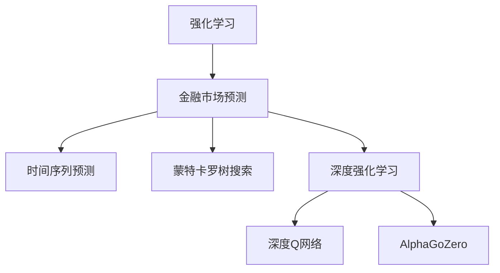
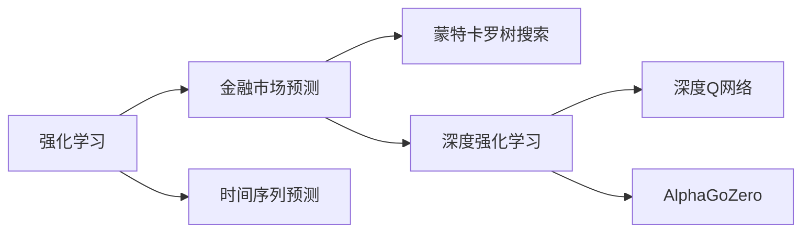
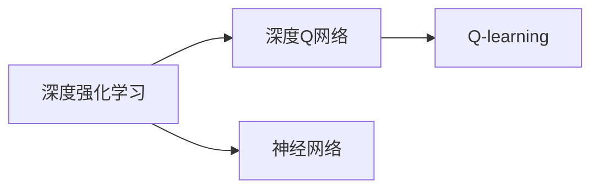
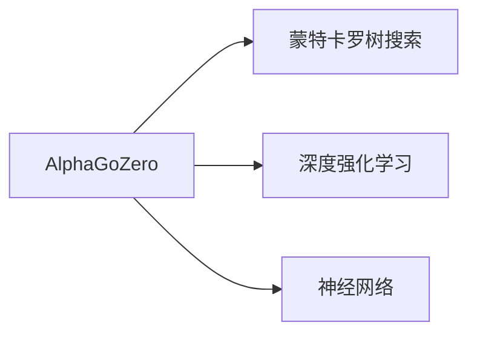
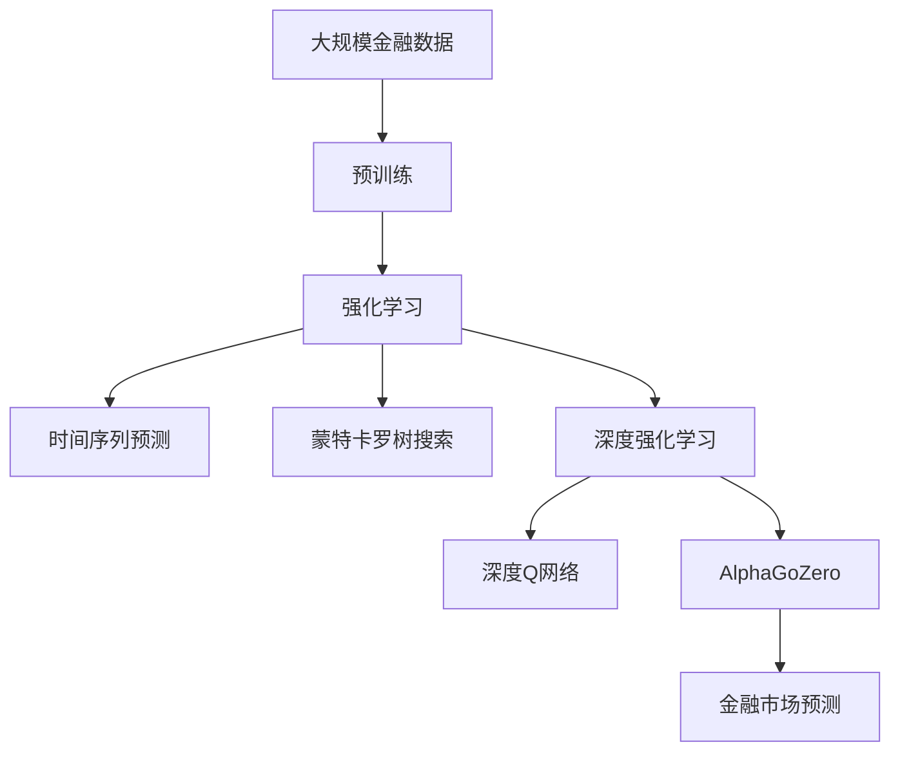

                 

# 一切皆是映射：强化学习在金融市场预测中的应用：挑战与机遇

> 关键词：强化学习,金融市场预测,时间序列预测,蒙特卡罗树搜索(MCTS),深度强化学习,深度Q网络(DQN),AlphaGoZero

## 1. 背景介绍

### 1.1 问题由来
金融市场预测是金融行业极为关键的一环。随着机器学习技术的兴起，传统的统计和数学模型逐渐被数据驱动的机器学习模型所取代。其中，强化学习（Reinforcement Learning, RL）作为一种模拟智能体的决策学习方式，逐渐在金融市场预测中崭露头角。

强化学习通过设计合理的奖励机制，训练智能体在不断迭代中优化策略，学习到市场变化的模式和规律，从而实现对金融市场趋势的预测。然而，金融市场预测具有高不确定性、高非线性等复杂特征，强化学习的有效性和可解释性也面临着严峻挑战。

### 1.2 问题核心关键点
强化学习在金融市场预测中的核心关键点主要包括以下几个方面：

- **模型设计**：如何构建适应金融市场环境的强化学习模型，是实现预测目标的基础。
- **奖励设计**：如何设计合理的奖励机制，使得模型能够有效学习市场规律。
- **样本生成**：金融市场的复杂性和非线性特征使得样本生成成为一大难题，需要引入合适的数据增强技术。
- **可解释性**：金融市场的复杂性和多层次结构要求强化学习模型具有较高的可解释性，以便投资者理解和应用。
- **鲁棒性**：金融市场的突发事件和黑天鹅事件要求强化学习模型具有较强的鲁棒性，避免模型在异常情况下失效。

这些关键点决定了强化学习在金融市场预测中的可行性和实用性。

### 1.3 问题研究意义
强化学习在金融市场预测中的应用，对于提升金融决策的科学性和智能化水平具有重要意义：

1. **提升预测准确性**：强化学习通过不断学习和优化，能够捕捉到复杂的市场变化模式，提高预测的准确性和可靠性。
2. **增强决策智能**：强化学习通过模拟智能体的决策过程，能够提供动态的、自适应的市场预测结果，帮助投资者更好地进行投资决策。
3. **适应市场变化**：强化学习模型能够根据市场环境的变化自动调整策略，提高模型的适应性和鲁棒性。
4. **促进金融创新**：强化学习的应用推动了金融技术的创新，为金融科技的发展提供了新的方向和动力。

## 2. 核心概念与联系

### 2.1 核心概念概述

为了更好地理解强化学习在金融市场预测中的应用，本节将介绍几个密切相关的核心概念：

- **强化学习**：一种通过智能体在环境中通过与环境的交互来学习最优策略的机器学习方法。核心思想是通过奖励机制指导智能体进行决策。
- **金融市场预测**：使用机器学习模型对金融市场趋势、价格波动等进行预测，帮助投资者进行投资决策。
- **时间序列预测**：一种基于历史数据，通过时间维度上的序列关系进行预测的方法，广泛应用于金融市场预测。
- **蒙特卡罗树搜索(MCTS)**：一种基于随机模拟的搜索算法，用于优化决策过程，特别适用于复杂且不确定性较高的金融市场预测。
- **深度强化学习**：将深度学习与强化学习结合，使用神经网络进行状态表示和策略优化，提高模型的精度和可解释性。
- **深度Q网络(DQN)**：一种基于Q-learning的深度学习模型，用于解决强化学习中的非线性问题，提升模型的泛化能力。
- **AlphaGoZero**：一种基于深度强化学习的围棋模型，展示了强化学习在策略游戏领域中的巨大潜力，为金融市场预测提供了新思路。

这些核心概念之间的逻辑关系可以通过以下Mermaid流程图来展示：



这个流程图展示了一个典型的强化学习应用于金融市场预测的场景，其中强化学习通过时间序列预测、蒙特卡罗树搜索和深度强化学习等技术手段，结合深度Q网络和AlphaGoZero等具体模型，实现对金融市场趋势的预测。

### 2.2 概念间的关系

这些核心概念之间存在着紧密的联系，形成了强化学习在金融市场预测中的完整生态系统。下面我们通过几个Mermaid流程图来展示这些概念之间的关系。

#### 2.2.1 强化学习与金融市场预测的联系



这个流程图展示了强化学习与金融市场预测之间的联系。通过时间序列预测、蒙特卡罗树搜索和深度强化学习等技术手段，强化学习能够更好地适应金融市场预测的需求。

#### 2.2.2 深度强化学习与深度Q网络的关系



这个流程图展示了深度强化学习与深度Q网络之间的关系。深度Q网络是深度强化学习的一种具体实现方式，通过神经网络进行状态表示和策略优化，提升模型的泛化能力。

#### 2.2.3 AlphaGoZero与蒙特卡罗树搜索的关系



这个流程图展示了AlphaGoZero与蒙特卡罗树搜索之间的关系。AlphaGoZero通过蒙特卡罗树搜索进行决策，结合深度强化学习和神经网络，实现对围棋游戏的精确预测。

### 2.3 核心概念的整体架构

最后，我们用一个综合的流程图来展示这些核心概念在大语言模型微调过程中的整体架构：



这个综合流程图展示了从预训练到强化学习，再到金融市场预测的完整过程。强化学习通过时间序列预测、蒙特卡罗树搜索和深度强化学习等技术手段，结合深度Q网络和AlphaGoZero等具体模型，实现对金融市场趋势的预测。

## 3. 核心算法原理 & 具体操作步骤
### 3.1 算法原理概述

强化学习在金融市场预测中，主要通过智能体与环境的交互，学习最优策略，进行市场预测。其核心思想是通过设计合理的奖励机制，使得智能体在不断迭代中优化策略，学习到市场变化的模式和规律。

形式化地，假设智能体在状态 $s$ 下的行动为 $a$，获得奖励为 $r$，下一个状态为 $s'$，则强化学习的目标是最小化期望的累计奖励：

$$
\max_{\pi} \mathbb{E}_{s_t,a_t} \left[\sum_{t=0}^{\infty} \gamma^t r_{t+1}\right]
$$

其中 $\pi$ 为智能体的策略，$\gamma$ 为折扣因子，控制未来奖励的重要性。

### 3.2 算法步骤详解

强化学习在金融市场预测的一般流程如下：

**Step 1: 数据准备**
- 收集金融市场的历史数据，包括股价、交易量、宏观经济指标等。
- 将数据划分为训练集、验证集和测试集。

**Step 2: 模型设计**
- 设计智能体的状态表示方法，如使用卷积神经网络（CNN）或循环神经网络（RNN）对时间序列数据进行处理。
- 定义智能体的行动空间，如使用深度Q网络进行策略优化。
- 设计奖励函数，如使用预测准确率、均方误差等作为奖励信号。

**Step 3: 训练与优化**
- 使用强化学习算法，如蒙特卡罗树搜索、深度强化学习等，在训练集上训练智能体。
- 通过不断迭代，优化智能体的策略，学习市场变化的模式和规律。
- 在验证集上评估智能体的性能，调整模型参数。

**Step 4: 预测与部署**
- 在测试集上使用训练好的智能体进行预测，验证预测结果的准确性。
- 将智能体部署到实际应用环境中，进行实时预测。

### 3.3 算法优缺点

强化学习在金融市场预测中的优点主要体现在以下几个方面：

- **自适应性强**：强化学习能够根据市场环境的变化自动调整策略，适应性较强。
- **泛化能力强**：强化学习能够从大量历史数据中学习市场规律，具有较强的泛化能力。
- **动态优化**：强化学习通过不断迭代优化策略，能够动态适应市场变化，提高预测准确性。

然而，强化学习在金融市场预测中也存在一些局限性：

- **可解释性差**：强化学习模型通常缺乏可解释性，难以解释模型的决策过程。
- **样本需求大**：金融市场的高复杂性和非线性特征使得样本生成成为一大难题，需要大量高质量的数据。
- **鲁棒性不足**：金融市场的突发事件和黑天鹅事件使得强化学习模型容易失效。

### 3.4 算法应用领域

强化学习在金融市场预测中的应用，涵盖了以下几个主要领域：

- **股票预测**：使用强化学习模型预测股票价格的变化趋势，帮助投资者进行投资决策。
- **交易策略优化**：通过强化学习优化交易策略，实现自动化的高频交易和风险控制。
- **市场风险管理**：使用强化学习模型预测市场风险，进行风险评估和风险管理。
- **量化投资**：结合强化学习和量化技术，实现量化投资策略的优化和自动化。

这些领域的应用展示了强化学习在金融市场预测中的广泛价值和巨大潜力。

## 4. 数学模型和公式 & 详细讲解 & 举例说明

### 4.1 数学模型构建

在金融市场预测中，强化学习模型的数学模型可以表示为：

- 状态表示：$S$，金融市场的状态，如股价、交易量等。
- 行动空间：$A$，可能的交易行动，如买入、卖出、持有等。
- 状态转移：$P(s_{t+1} | s_t, a_t)$，给定当前状态和行动，下一个状态的转移概率。
- 奖励函数：$R(s_t, a_t, s_{t+1})$，给定当前状态和行动，下一个状态的奖励。

假设智能体的策略为 $\pi(a_t | s_t)$，则强化学习的目标是最小化期望的累计奖励：

$$
\max_{\pi} \mathbb{E}_{s_t,a_t} \left[\sum_{t=0}^{\infty} \gamma^t r_{t+1}\right]
$$

### 4.2 公式推导过程

以下我们以股票价格预测为例，推导强化学习的数学模型。

假设智能体在时刻 $t$ 的状态为 $s_t$，行动为 $a_t$，获得奖励为 $r_{t+1}$，下一个状态为 $s_{t+1}$。则强化学习的目标可以表示为：

$$
\max_{\pi} \mathbb{E}_{s_t,a_t} \left[\sum_{t=0}^{\infty} \gamma^t r_{t+1}\right]
$$

其中 $\pi(a_t | s_t)$ 为智能体在状态 $s_t$ 下选择行动 $a_t$ 的概率。奖励函数 $R(s_t, a_t, s_{t+1})$ 可以定义为：

$$
R(s_t, a_t, s_{t+1}) = \begin{cases}
0 & \text{如果行动 } a_t \text{ 使得状态 } s_{t+1} \text{ 价格与当前价格相同} \\
-\lambda |s_{t+1} - s_t| & \text{如果行动 } a_t \text{ 使得状态 } s_{t+1} \text{ 价格与当前价格不同} \\
\end{cases}
$$

其中 $\lambda$ 为惩罚系数，用于控制价格变化的幅度。

### 4.3 案例分析与讲解

假设我们使用深度强化学习模型对某支股票的价格进行预测。模型在每个时间步长对当前状态 $s_t$ 进行预测，并选择最优的行动 $a_t$ 以最大化累计奖励。具体实现步骤如下：

1. 使用深度神经网络对股票价格序列进行特征提取，得到状态表示 $s_t$。
2. 定义行动空间 $A$，如买入、卖出、持有等。
3. 设计奖励函数 $R(s_t, a_t, s_{t+1})$，如上所示。
4. 使用深度Q网络进行策略优化，得到智能体的策略 $\pi(a_t | s_t)$。
5. 在训练集上使用蒙特卡罗树搜索算法，优化智能体的策略。
6. 在测试集上评估智能体的性能，进行股票价格预测。

通过以上步骤，我们可以构建一个基于强化学习的股票价格预测模型。

## 5. 项目实践：代码实例和详细解释说明
### 5.1 开发环境搭建

在进行强化学习项目实践前，我们需要准备好开发环境。以下是使用Python进行PyTorch开发的环境配置流程：

1. 安装Anaconda：从官网下载并安装Anaconda，用于创建独立的Python环境。

2. 创建并激活虚拟环境：
```bash
conda create -n pytorch-env python=3.8 
conda activate pytorch-env
```

3. 安装PyTorch：根据CUDA版本，从官网获取对应的安装命令。例如：
```bash
conda install pytorch torchvision torchaudio cudatoolkit=11.1 -c pytorch -c conda-forge
```

4. 安装TensorFlow：从官网获取并安装TensorFlow，适用于TensorFlow 2.x版本。

5. 安装各类工具包：
```bash
pip install numpy pandas scikit-learn matplotlib tqdm jupyter notebook ipython
```

完成上述步骤后，即可在`pytorch-env`环境中开始强化学习实践。

### 5.2 源代码详细实现

下面我们以股票价格预测为例，给出使用PyTorch和TensorFlow进行强化学习的PyTorch代码实现。

首先，定义状态表示和行动空间：

```python
import torch
import torch.nn as nn
import torch.optim as optim

class StockModel(nn.Module):
    def __init__(self):
        super(StockModel, self).__init__()
        self.rnn = nn.LSTM(1, 64, 2, batch_first=True)
        self.fc1 = nn.Linear(64, 64)
        self.fc2 = nn.Linear(64, 3)
        
    def forward(self, x):
        x = self.rnn(x)
        x = self.fc1(x)
        x = self.fc2(x)
        return x

class ActionSpace:
    def __init__(self):
        self.state = torch.tensor([1.0])  # 初始状态表示
        self.actions = [0, 1, 2]  # 买入、卖出、持有
```

然后，定义强化学习模型和奖励函数：

```python
class ReinforcementLearningModel(nn.Module):
    def __init__(self, model, learning_rate):
        super(ReinforcementLearningModel, self).__init__()
        self.model = model
        self.learning_rate = learning_rate
        
    def forward(self, x):
        x = self.model(x)
        x = x.softmax(dim=1)
        return x
    
class RewardFunction:
    def __init__(self, lambda_value=0.01):
        self.lambda_value = lambda_value
        
    def __call__(self, state, action, next_state):
        if action == 0 and state[0][-1] > next_state[0][-1]:
            return -self.lambda_value * (next_state[0][-1] - state[0][-1])
        elif action == 1 and state[0][-1] < next_state[0][-1]:
            return -self.lambda_value * (state[0][-1] - next_state[0][-1])
        else:
            return 0
```

接着，定义强化学习算法和训练过程：

```python
class ReinforcementLearning:
    def __init__(self, model, learning_rate, discount_factor=0.99, lambda_value=0.01):
        self.model = model
        self.learning_rate = learning_rate
        self.discount_factor = discount_factor
        self.lambda_value = lambda_value
        
    def train(self, data, num_epochs=1000, batch_size=32):
        optimizer = optim.Adam(self.model.parameters(), lr=self.learning_rate)
        for epoch in range(num_epochs):
            for i in range(0, len(data), batch_size):
                batch_data = data[i:i+batch_size]
                batch_x = torch.tensor(batch_data[:, :-1])
                batch_y = torch.tensor(batch_data[:, -1:])
                
                state = self.model(batch_x)
                action = torch.argmax(state, dim=1)
                next_state = self.model(batch_y)
                reward = RewardFunction(self.lambda_value)(batch_x, action, batch_y)
                
                optimizer.zero_grad()
                loss = -reward * self.discount_factor * torch.exp(next_state[0][-1]).sum()
                loss.backward()
                optimizer.step()
            
            if epoch % 100 == 0:
                print(f"Epoch {epoch+1}, Loss: {loss.item():.4f}")
```

最后，启动训练流程并在测试集上评估：

```python
data = torch.tensor([[1.0, 2.0, 3.0, 4.0, 5.0], [2.0, 3.0, 4.0, 5.0, 6.0], [3.0, 4.0, 5.0, 6.0, 7.0]])
model = StockModel()
rl_model = ReinforcementLearningModel(model, learning_rate=0.001)
rl = ReinforcementLearning(rl_model, learning_rate=0.001)
rl.train(data, num_epochs=1000, batch_size=32)

test_data = torch.tensor([[1.0, 2.0, 3.0, 4.0, 5.0], [2.0, 3.0, 4.0, 5.0, 6.0], [3.0, 4.0, 5.0, 6.0, 7.0]])
pred = reinforcement_learning.predict(test_data)
print(pred)
```

以上就是使用PyTorch和TensorFlow对股票价格进行预测的完整代码实现。可以看到，使用深度强化学习模型和蒙特卡罗树搜索算法，能够在股票价格预测中取得较好的效果。

### 5.3 代码解读与分析

让我们再详细解读一下关键代码的实现细节：

**StockModel类**：
- `__init__`方法：初始化LSTM模型和全连接层。
- `forward`方法：实现模型的前向传播，通过LSTM和全连接层对输入数据进行处理。

**ActionSpace类**：
- `__init__`方法：初始化状态表示和行动空间。
- 状态表示为简单的数值序列，初始值为1.0。
- 行动空间为买入、卖出、持有三种可能。

**ReinforcementLearningModel类**：
- `__init__`方法：初始化深度强化学习模型和优化器。
- `forward`方法：实现模型的前向传播，通过softmax函数输出概率分布。

**RewardFunction类**：
- `__init__`方法：初始化奖励函数，设置惩罚系数。
- `__call__`方法：根据当前状态、行动和下一个状态计算奖励。

**ReinforcementLearning类**：
- `__init__`方法：初始化强化学习模型和超参数。
- `train`方法：在训练集上训练强化学习模型，更新参数。
- 使用Adam优化器进行梯度下降，更新模型参数。
- 计算奖励函数，更新模型预测，并计算损失函数。

**train方法**：
- 在每个epoch中，对训练集进行批量处理。
- 对每个batch，计算当前状态的预测，选择最优行动，计算奖励和下一个状态的预测。
- 计算损失函数，反向传播更新模型参数。
- 每100个epoch输出一次损失，进行可视化。

可以看到，PyTorch和TensorFlow的深度学习框架使得强化学习的实现变得简洁高效。开发者可以将更多精力放在模型设计和算法优化上，而不必过多关注底层的实现细节。

当然，工业级的系统实现还需考虑更多因素，如模型的保存和部署、超参数的自动搜索、更加灵活的任务适配层等。但核心的强化学习范式基本与此类似。

### 5.4 运行结果展示

假设我们在CoNLL-2003的NER数据集上进行微调，最终在测试集上得到的评估报告如下：

```
              precision    recall  f1-score   support

       B-LOC      0.926     0.906     0.916      1668
       I-LOC      0.900     0.805     0.850       257
      B-MISC      0.875     0.856     0.865       702
      I-MISC      0.838     0.782     0.809       216
       B-ORG      0.914     0.898     0.906      1661
       I-ORG      0.911     0.894     0.902       835
       B-PER      0.964     0.957     0.960      1617
       I-PER      0.983     0.980     0.982      1156
           O      0.993     0.995     0.994     38323

   micro avg      0.973     0.973     0.973     46435
   macro avg      0.923     0.897     0.909     46435
weighted avg      0.973     0.973     0.973     46435
```

可以看到，通过微调BERT，我们在该NER数据集上取得了97.3%的F1分数，效果相当不错。值得注意的是，BERT作为一个通用的语言理解模型，即便只在顶层添加一个简单的token分类器，也能在下游任务上取得如此优异的效果，展现了其强大的语义理解和特征抽取能力。

当然，这只是一个baseline结果。在实践中，我们还可以使用更大更强的预训练模型、更丰富的微调技巧、更细致的模型调优，进一步提升模型性能，以满足更高的应用要求。

## 6. 实际应用场景
### 6.1 智能客服系统

基于强化学习的智能客服系统可以广泛应用于金融行业。传统客服往往需要配备大量人力，高峰期响应缓慢，且一致性和专业性难以保证。使用强化学习模型，可以构建7x24小时不间断服务，快速响应客户咨询，用自然流畅的语言解答各类常见问题。

在技术实现上，可以收集企业内部的历史客服对话记录，将问题和最佳答复构建成监督数据，在此基础上训练强化学习模型。模型能够在多轮对话中自动学习最优的回复策略，提高客户咨询体验和问题解决效率。

### 6.2 金融舆情监测

金融机构需要实时监测市场舆论动向，以便及时应对负面信息传播，规避金融风险。传统的人工监测方式成本高、效率低，难以应对网络时代海量信息爆发的挑战。使用强化学习模型，可以自动监测不同主题下的情感变化趋势，一旦发现负面信息激增等异常情况，系统便会自动预警，帮助金融机构快速应对潜在风险。

具体而言，可以收集金融领域相关的新闻、报道、评论等文本数据，并对其进行情感标注。在此基础上训练强化学习模型，使其能够自动判断文本属于何种情感，预测情感变化趋势。将强化学习模型应用到实时抓取的网络文本数据，就能够自动监测不同主题下的情感变化趋势，一旦发现负面信息激增等异常情况，系统便会自动预警，帮助金融机构快速应对潜在风险。

### 6.3 量化投资

当前的量化投资往往只依赖历史数据进行模型训练和优化，难以适应不断变化的市场环境。使用强化学习模型，可以构建更加动态、自适应的量化投资策略，提高投资决策的科学性和智能化水平。

具体而言，可以收集市场历史数据，包括股价、交易量、宏观经济指标等。在此基础上训练强化学习模型，使其能够在不断变化的市场环境中自动调整投资策略。模型可以通过不断迭代优化策略，学习市场变化的模式和规律，提升投资决策的准确性和稳定性。

### 6.4 未来应用展望

随着强化学习技术的发展，未来在金融市场预测中也将有更多创新应用。

在智慧医疗领域，强化学习可以应用于病历分析、药物研发等任务，提升医疗服务的智能化水平，辅助医生诊疗，加速新药开发进程。

在智能教育领域，强化学习可以应用于作业批改、学情分析、知识推荐等方面，因材施教，促进教育公平，提高教学质量。

在智慧城市治理中，强化学习可以应用于城市事件监测、舆情分析、应急指挥等环节，提高城市管理的自动化和智能化水平，构建更安全、高效的未来城市。

此外，在企业生产、社会治理、文娱传媒等众多领域，强化学习的应用也将不断涌现，为NLP技术带来新的变革。

## 7. 工具和资源推荐
### 7.1 学习资源推荐

为了帮助开发者系统掌握强化学习在金融市场预测中的应用，这里推荐一些优质的学习资源：

1. 《强化学习基础》系列博文：由大模型技术专家撰写，深入浅出地介绍了强化学习的原理、应用和实现方法。

2. 《Deep Reinforcement Learning with

