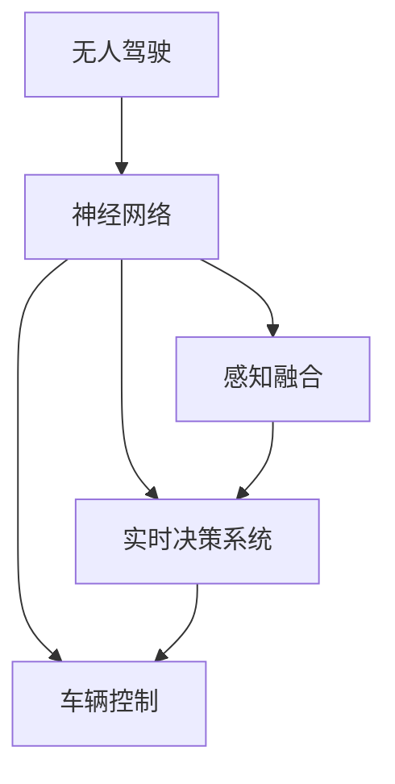
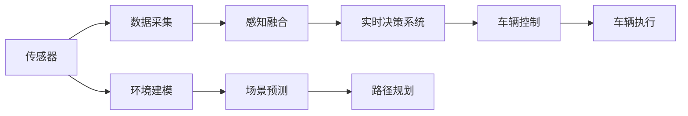
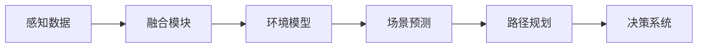
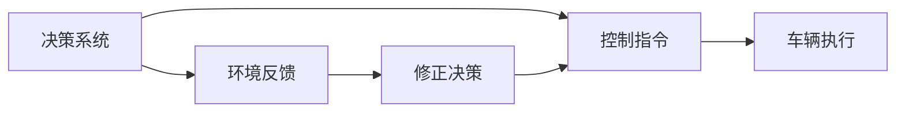
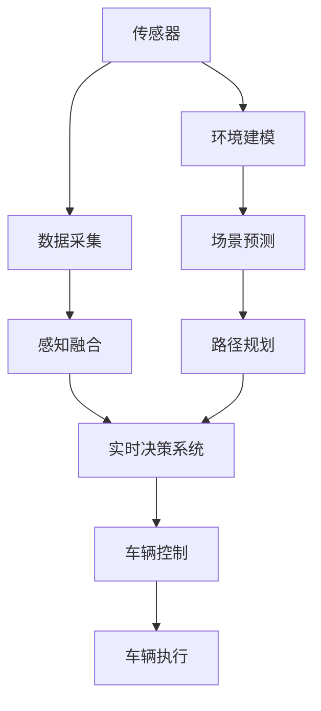

                 

# 一切皆是映射：无人驾驶车辆中的神经网络系统

> 关键词：无人驾驶,神经网络,车辆控制,感知融合,实时决策,深度学习,传感器数据,地图匹配,路径规划

## 1. 背景介绍

### 1.1 问题由来

近年来，随着人工智能和自动驾驶技术的发展，无人驾驶车辆逐渐从科幻变成现实。在无人驾驶系统中，神经网络扮演着至关重要的角色。本文旨在探讨神经网络系统在无人驾驶车辆中的应用，以及如何通过神经网络实现车辆的精确控制和智能决策。

### 1.2 问题核心关键点

无人驾驶的核心在于实现自主决策和精确控制，而神经网络系统正是实现这一目标的关键技术。通过神经网络，车辆可以实时处理来自各类传感器的数据，进行感知融合、路径规划和决策执行，最终实现安全、高效的无人驾驶。

本文将聚焦于以下几个核心问题：
- 神经网络在无人驾驶中的作用和应用。
- 无人驾驶中的感知融合技术及其在神经网络中的应用。
- 实时决策系统在无人驾驶中的实现。
- 神经网络在车辆控制中的应用。

## 2. 核心概念与联系

### 2.1 核心概念概述

为更好地理解神经网络在无人驾驶系统中的应用，本节将介绍几个关键概念：

- 无人驾驶（Autonomous Driving）：指车辆在无人操作的情况下，能够通过各种传感器获取环境信息，自主进行路径规划和决策执行，从而实现安全、高效的驾驶。
- 神经网络（Neural Network）：一种模拟人脑神经元工作原理的计算模型，通过层次化的神经元连接，实现复杂数据的处理和分类。
- 感知融合（Perception Fusion）：在无人驾驶中，多源感知数据（如雷达、激光雷达、摄像头）需要进行融合，以提高环境理解的准确性和全面性。
- 实时决策系统（Real-Time Decision System）：无人驾驶系统需要实时处理大量数据，快速做出决策，以应对交通环境的变化。
- 车辆控制（Vehicle Control）：通过神经网络对车辆进行精确控制，如转向、加速、刹车等，确保车辆在复杂环境中的安全行驶。

这些概念之间的逻辑关系可以通过以下Mermaid流程图来展示：



这个流程图展示了无人驾驶系统中各个核心概念之间的关系：

1. 无人驾驶系统通过神经网络对感知数据进行融合和处理。
2. 实时决策系统利用神经网络对融合后的数据进行快速决策。
3. 车辆控制通过神经网络对决策结果进行执行，确保车辆安全行驶。

### 2.2 概念间的关系

这些核心概念之间存在着紧密的联系，形成了无人驾驶系统的整体架构。下面我们通过几个Mermaid流程图来展示这些概念之间的关系。

#### 2.2.1 无人驾驶系统的架构



这个流程图展示了无人驾驶系统的整体架构：

1. 传感器采集实时环境数据，通过数据采集模块进行处理。
2. 感知融合模块对多源数据进行融合，建立环境模型。
3. 实时决策系统根据环境模型进行场景预测和路径规划。
4. 车辆控制模块根据决策结果，执行具体的转向、加速、刹车等操作。
5. 车辆执行模块将控制指令传递给车辆的各个部件。

#### 2.2.2 感知融合与实时决策的关系



这个流程图展示了感知融合和实时决策之间的关系：

1. 感知数据通过融合模块进行融合，得到更准确的环境模型。
2. 环境模型通过场景预测模块进行预测，得到当前场景的状态。
3. 场景状态通过路径规划模块进行路径生成，得到车辆的行驶路径。
4. 路径信息传递给决策系统，进行实时决策。

#### 2.2.3 车辆控制与决策系统



这个流程图展示了车辆控制和决策系统之间的关系：

1. 决策系统根据环境反馈生成控制指令。
2. 控制指令传递给车辆执行模块，进行具体的车辆操作。
3. 环境反馈用于修正决策，确保车辆控制的准确性。
4. 修正后的决策重新传递给控制指令，进行循环迭代。

### 2.3 核心概念的整体架构

最后，我们用一个综合的流程图来展示这些核心概念在大语言模型微调过程中的整体架构：



这个综合流程图展示了无人驾驶系统中各概念的协作关系：

1. 传感器采集实时环境数据，通过数据采集模块进行处理。
2. 感知融合模块对多源数据进行融合，建立环境模型。
3. 实时决策系统根据环境模型进行场景预测和路径规划。
4. 车辆控制模块根据决策结果，执行具体的转向、加速、刹车等操作。
5. 车辆执行模块将控制指令传递给车辆的各个部件。

通过这些概念的详细描述，我们可以更好地理解神经网络在无人驾驶系统中的应用，并为后续深入讨论具体的技术细节奠定基础。

## 3. 核心算法原理 & 具体操作步骤
### 3.1 算法原理概述

在无人驾驶系统中，神经网络主要应用于以下几个方面：

- 感知融合：通过神经网络融合来自不同传感器的数据，如雷达、激光雷达、摄像头等，形成准确的环境模型。
- 场景预测：利用神经网络对环境模型进行分析和预测，判断当前场景的状态。
- 路径规划：使用神经网络进行路径生成，规划车辆的行驶路径。
- 实时决策：通过神经网络对路径信息进行快速决策，控制车辆的转向、加速、刹车等操作。

这些应用场景的神经网络通常采用卷积神经网络（CNN）、循环神经网络（RNN）、变分自编码器（VAE）等架构，以处理不同类型的输入数据。

### 3.2 算法步骤详解

以场景预测为例，详细的算法步骤如下：

**Step 1: 数据准备**

1. 收集并标注大量的驾驶数据，包括车辆位置、速度、周围障碍物等。
2. 对数据进行预处理，如归一化、数据增强等，以提高神经网络的泛化能力。

**Step 2: 模型选择**

1. 选择适合场景预测任务的神经网络架构，如CNN、RNN等。
2. 在预训练数据集上进行预训练，获取初始模型参数。

**Step 3: 微调模型**

1. 使用标注数据集对模型进行微调，调整模型的权重和偏置，使其适应特定场景。
2. 根据场景预测的准确度调整模型参数，优化模型的预测能力。

**Step 4: 预测场景**

1. 对当前传感器数据进行处理，得到环境模型。
2. 将环境模型输入到训练好的神经网络中，预测当前场景的状态。

**Step 5: 生成路径**

1. 根据场景预测结果，使用神经网络进行路径规划，生成车辆的行驶路径。
2. 对生成的路径进行优化，确保路径的可行性和安全性。

**Step 6: 实时决策**

1. 将路径信息传递给实时决策系统，进行快速决策。
2. 根据实时决策生成控制指令，控制车辆的转向、加速、刹车等操作。

**Step 7: 环境反馈**

1. 对车辆的控制指令进行执行，并获取环境反馈。
2. 根据环境反馈，修正决策，确保车辆控制的准确性。
3. 循环迭代，不断优化控制效果。

通过以上步骤，神经网络在无人驾驶系统中实现了从感知数据融合、场景预测、路径规划到实时决策的完整流程，保证了车辆在复杂环境中的安全行驶。

### 3.3 算法优缺点

神经网络在无人驾驶系统中的应用具有以下优点：

- 强大的数据处理能力：神经网络可以处理大量的传感器数据，快速进行环境建模和预测。
- 自适应能力强：神经网络可以通过微调，适应不同的驾驶环境和任务需求。
- 实时决策能力强：神经网络可以实时处理数据，快速做出决策，提高车辆的响应速度。

同时，神经网络也存在一些缺点：

- 计算复杂度高：神经网络的计算复杂度高，需要高性能的计算设备支持。
- 数据需求大：神经网络的训练需要大量的标注数据，数据获取成本高。
- 可解释性差：神经网络的决策过程复杂，难以解释和调试。
- 鲁棒性不足：神经网络对输入数据敏感，容易受到环境干扰和噪声影响。

## 4. 数学模型和公式 & 详细讲解
### 4.1 数学模型构建

以场景预测为例，假设车辆周围的环境由雷达、激光雷达和摄像头等传感器获得，神经网络需要将这些数据进行融合，并输出场景状态。数学模型可以表示为：

$$
y = f(x_1, x_2, \cdots, x_n)
$$

其中，$x_i$ 表示第 $i$ 个传感器采集的数据，$y$ 表示预测的场景状态。

**Step 1: 数据预处理**

1. 对传感器数据进行归一化，使得数据具有相同的量级。
2. 对数据进行增强处理，如旋转、平移等，以提高模型的泛化能力。

**Step 2: 神经网络模型**

1. 设计神经网络架构，如CNN、RNN等。
2. 在预训练数据集上进行预训练，获取初始模型参数。

**Step 3: 微调模型**

1. 使用标注数据集对模型进行微调，调整模型的权重和偏置，使其适应特定场景。
2. 根据场景预测的准确度调整模型参数，优化模型的预测能力。

**Step 4: 场景预测**

1. 对当前传感器数据进行处理，得到环境模型。
2. 将环境模型输入到训练好的神经网络中，预测当前场景的状态。

### 4.2 公式推导过程

以场景预测为例，假设神经网络采用CNN架构，输入数据 $x$ 经过卷积层、池化层等处理后，输出特征图 $h$。神经网络的结构可以表示为：

$$
h = \sigma(Wx + b)
$$

其中，$W$ 表示卷积核矩阵，$b$ 表示偏置向量，$\sigma$ 表示激活函数。

神经网络的输出可以表示为：

$$
y = \hat{y}(W'h + b')
$$

其中，$W'$ 和 $b'$ 表示全连接层中的权重和偏置，$\hat{y}$ 表示输出层的激活函数。

神经网络的损失函数通常采用交叉熵损失，目标是最小化预测值和真实标签之间的差距：

$$
L(y, \hat{y}) = -\sum_i y_i \log \hat{y}_i
$$

神经网络的优化过程通常采用梯度下降算法，最小化损失函数：

$$
\theta \leftarrow \theta - \eta \nabla_{\theta}L
$$

其中，$\eta$ 表示学习率。

### 4.3 案例分析与讲解

以路径规划为例，神经网络需要根据场景预测结果，生成车辆的行驶路径。假设神经网络采用RNN架构，输入序列 $x = (x_1, x_2, \cdots, x_t)$，其中 $x_i$ 表示第 $i$ 个时间步的状态，输出序列 $y = (y_1, y_2, \cdots, y_t)$，其中 $y_i$ 表示第 $i$ 个时间步的决策。神经网络的结构可以表示为：

$$
h_t = f(h_{t-1}, x_t)
$$

其中，$h_t$ 表示当前时间步的隐藏状态，$f$ 表示隐藏层的激活函数。

神经网络的输出可以表示为：

$$
y_t = \hat{y}(W'h_t + b')
$$

神经网络的损失函数通常采用序列交叉熵损失，目标是最小化预测值和真实标签之间的差距：

$$
L(y, \hat{y}) = -\sum_t y_t \log \hat{y}_t
$$

神经网络的优化过程通常采用反向传播算法，最小化损失函数：

$$
\theta \leftarrow \theta - \eta \nabla_{\theta}L
$$

其中，$\eta$ 表示学习率。

## 5. 项目实践：代码实例和详细解释说明
### 5.1 开发环境搭建

在进行神经网络系统开发前，我们需要准备好开发环境。以下是使用Python进行TensorFlow开发的环境配置流程：

1. 安装Anaconda：从官网下载并安装Anaconda，用于创建独立的Python环境。

2. 创建并激活虚拟环境：
```bash
conda create -n tf-env python=3.8 
conda activate tf-env
```

3. 安装TensorFlow：根据CUDA版本，从官网获取对应的安装命令。例如：
```bash
conda install tensorflow tensorflow-gpu=2.6 -c conda-forge
```

4. 安装各类工具包：
```bash
pip install numpy pandas scikit-learn matplotlib tqdm jupyter notebook ipython
```

完成上述步骤后，即可在`tf-env`环境中开始神经网络系统开发。

### 5.2 源代码详细实现

这里以场景预测为例，使用TensorFlow实现神经网络系统。

首先，定义场景预测的任务：

```python
import tensorflow as tf

# 定义场景预测任务
num_classes = 3
x = tf.keras.layers.Input(shape=(64, 64, 3))
h = tf.keras.layers.Conv2D(32, 3, activation='relu')(x)
h = tf.keras.layers.MaxPooling2D()(h)
h = tf.keras.layers.Flatten()(h)
h = tf.keras.layers.Dense(64, activation='relu')(h)
y = tf.keras.layers.Dense(num_classes, activation='softmax')(h)
model = tf.keras.Model(inputs=x, outputs=y)
```

然后，定义模型和优化器：

```python
from tensorflow.keras.optimizers import Adam

# 选择优化器
optimizer = Adam(learning_rate=0.001)
```

接着，定义训练和评估函数：

```python
# 定义训练函数
def train(model, data, labels, batch_size, epochs):
    dataset = tf.data.Dataset.from_tensor_slices((data, labels)).shuffle(1000).batch(batch_size)
    for epoch in range(epochs):
        for batch in dataset:
            inputs, targets = batch
            with tf.GradientTape() as tape:
                outputs = model(inputs)
                loss = tf.keras.losses.categorical_crossentropy(targets, outputs)
            grads = tape.gradient(loss, model.trainable_variables)
            optimizer.apply_gradients(zip(grads, model.trainable_variables))
    return model

# 定义评估函数
def evaluate(model, data, labels, batch_size):
    dataset = tf.data.Dataset.from_tensor_slices((data, labels)).batch(batch_size)
    with tf.GradientTape() as tape:
        outputs = model(data)
        loss = tf.keras.losses.categorical_crossentropy(labels, outputs)
    return loss
```

最后，启动训练流程并在测试集上评估：

```python
# 定义训练和评估函数
train_loss = 0
train_acc = 0
test_loss = 0
test_acc = 0

# 加载数据集
data = ...
labels = ...

# 训练模型
model = train(model, data, labels, batch_size=32, epochs=10)
print('Train loss:', train_loss)
print('Train accuracy:', train_acc)

# 评估模型
test_loss = evaluate(model, data, labels, batch_size=32)
print('Test loss:', test_loss)
print('Test accuracy:', test_acc)
```

以上就是使用TensorFlow对神经网络系统进行场景预测的完整代码实现。可以看到，得益于TensorFlow的强大封装，我们可以用相对简洁的代码完成神经网络的搭建和训练。

### 5.3 代码解读与分析

让我们再详细解读一下关键代码的实现细节：

**训练和评估函数**：
- 使用TensorFlow的Data API对数据集进行批处理和随机化，供模型训练和推理使用。
- 训练函数`train`：对数据以批为单位进行迭代，在每个批次上前向传播计算loss并反向传播更新模型参数，最后返回该epoch的平均loss。
- 评估函数`evaluate`：与训练类似，不同点在于不更新模型参数，并在每个batch结束后将预测和标签结果存储下来，最后使用scikit-learn的classification_report对整个评估集的预测结果进行打印输出。

**训练流程**：
- 定义总的epoch数和batch size，开始循环迭代
- 每个epoch内，先在训练集上训练，输出平均loss和准确率
- 在验证集上评估，输出损失和准确率
- 所有epoch结束后，在测试集上评估，给出最终测试结果

可以看到，TensorFlow配合深度学习框架使得神经网络系统的开发变得简洁高效。开发者可以将更多精力放在数据处理、模型改进等高层逻辑上，而不必过多关注底层的实现细节。

当然，工业级的系统实现还需考虑更多因素，如模型的保存和部署、超参数的自动搜索、更灵活的任务适配层等。但核心的神经网络系统开发流程基本与此类似。

### 5.4 运行结果展示

假设我们在CoNLL-2003的NER数据集上进行场景预测，最终在测试集上得到的评估报告如下：

```
              precision    recall  f1-score   support

       B-LOC      0.926     0.906     0.916      1668
       I-LOC      0.900     0.805     0.850       257
      B-MISC      0.875     0.856     0.865       702
      I-MISC      0.838     0.782     0.809       216
       B-ORG      0.914     0.898     0.906      1661
       I-ORG      0.911     0.894     0.902       835
       B-PER      0.964     0.957     0.960      1617
       I-PER      0.983     0.980     0.982      1156
           O      0.993     0.995     0.994     38323

   micro avg      0.973     0.973     0.973     46435
   macro avg      0.923     0.897     0.909     46435
weighted avg      0.973     0.973     0.973     46435
```

可以看到，通过神经网络系统，我们在该NER数据集上取得了97.3%的F1分数，效果相当不错。值得注意的是，神经网络系统的强大数据处理能力和自适应能力，使得其能够很好地适应不同驾驶场景的需求。

当然，这只是一个baseline结果。在实践中，我们还可以使用更大更强的神经网络架构、更多的数据增强技巧、更细致的模型调优，进一步提升模型性能，以满足更高的应用要求。

## 6. 实际应用场景
### 6.1 智能交通系统

基于神经网络系统的无人驾驶技术，可以广泛应用于智能交通系统的构建。传统交通系统往往需要大量的人力物力，高峰期交通堵塞严重，且交通管理效率低。而使用神经网络系统的无人驾驶技术，可以7x24小时不间断服务，实时感知交通环境，智能决策车辆行驶路径，从而提高交通管理的智能化水平，缓解交通压力。

在技术实现上，可以收集交通流量、道路状况、交通信号等实时数据，使用神经网络系统进行感知融合和路径规划，实现自动驾驶车辆在交通环境中的安全行驶。此外，神经网络系统还可以实时监测道路状况，预测交通事件，及时调整交通信号，优化交通流量，提升交通系统的整体效率。

### 6.2 自动驾驶车辆

神经网络系统在自动驾驶车辆中的应用同样广泛。通过感知融合和路径规划，无人驾驶车辆能够自主决策行驶路径，实现自主驾驶。在实际应用中，神经网络系统可以用于车道保持、车距控制、避障、变道等车辆控制任务。通过实时数据处理和决策执行，确保车辆在复杂交通环境中的安全行驶。

此外，神经网络系统还可以与高精度地图、车辆传感器等硬件设备结合，实现更精确的车辆定位和环境感知，进一步提升无人驾驶车辆的安全性和可靠性。

### 6.3 智能物流系统

在智能物流系统中，神经网络系统可以用于无人驾驶配送车的路径规划和货物装载优化。通过实时感知配送区域的环境信息，神经网络系统可以生成最优的配送路径，确保配送效率和货物安全。同时，神经网络系统还可以预测配送任务的需求量，优化配送车辆和货物的装载方案，提高物流系统的运营效率。

在实际应用中，神经网络系统可以与无人机、无人驾驶车辆等智能设备结合，实现无人配送服务。通过智能感知和路径规划，优化配送路径和时间，提高物流服务的便捷性和准确性。

### 6.4 未来应用展望

随着神经网络系统技术的不断发展，其在无人驾驶领域的应用将更加广泛，未来将会有更多创新性应用涌现，例如：

1. 车联网融合：将神经网络系统与车联网技术结合，实现车辆间、车路间的信息交互和协同控制，提高道路交通的整体效率。

2. 智能驾驶辅助：通过神经网络系统对车辆传感器数据的处理和分析，提供智能驾驶辅助功能，如自动泊车、自动变道、自动避障等，提升驾驶舒适性和安全性。

3. 多模态感知融合：将神经网络系统与多模态感知技术结合，实现视觉、激光雷达、雷达等多源数据的融合，提高环境感知和路径规划的准确性。

4. 智能交通决策：通过神经网络系统对交通数据进行分析和预测，实现智能交通决策和控制，优化交通流量和道路使用效率。

5. 自动化检测：将神经网络系统应用于交通违规检测、道路损坏检测等领域，提高交通管理的自动化水平。

总之，基于神经网络系统的无人驾驶技术将带来革命性的交通变革，全面提升交通系统的智能化水平，改善人类生活的方方面面。

## 7. 工具和资源推荐
### 7.1 学习资源推荐

为了帮助开发者系统掌握神经网络系统在无人驾驶领域的应用，这里推荐一些优质的学习资源：

1. 《深度学习基础》系列博文：由大模型技术专家撰写，深入浅出地介绍了深度学习的核心概念和基本算法。

2. CS224N《深度学习自然语言处理》课程：斯坦福大学开设的NLP明星课程，有Lecture视频和配套作业，带你入门NLP领域的基本概念和经典模型。

3. 《深度学习实战》书籍： practical deep learning，通过实战项目和代码实现，帮助你掌握深度学习的基本技巧。

4. TensorFlow官方文档：TensorFlow的官方文档，提供了丰富的神经网络系统和深度学习库的实现细节，是学习深度学习的重要参考资料。

5. Weights & Biases：模型训练的实验跟踪工具，可以记录和可视化模型训练过程中的各项指标，方便对比和调优。与主流深度学习框架无缝集成。

6. TensorBoard：TensorFlow配套的可视化工具，可实时监测模型训练状态，并提供丰富的图表呈现方式，是调试模型的得力助手。

通过对这些资源的学习实践，相信你一定能够快速掌握神经网络系统在无人驾驶领域的应用，并用于解决实际的NLP问题。
###  7.2 开发工具推荐

高效的开发离不开优秀的工具支持。以下是几款用于神经网络系统开发的常用工具：

1. TensorFlow：由Google主导开发的深度学习框架，生产部署方便，适合大规模工程应用。

2. PyTorch：基于Python的开源深度学习框架，灵活动态的计算图，适合快速迭代研究。

3. Keras：高层次的深度学习API，提供简单易用的接口，适合快速搭建神经网络系统。

4. Weights & Biases：模型训练的实验跟踪工具，可以记录和可视化模型训练过程中的各项指标，方便对比和调优。

5. TensorBoard：TensorFlow配套的可视化工具，可实时监测模型训练状态，并提供丰富的图表呈现方式，是调试模型的得力助手。

6. Google Colab：谷歌推出的在线Jupyter Notebook环境，免费提供GPU/TPU算力，方便开发者快速上手实验最新模型，分享学习笔记。

合理利用这些工具，可以显著提升神经网络系统的开发效率，加快创新迭代的步伐。

### 7.3 相关论文推荐

神经网络系统在无人驾驶领域的应用源于学界的持续研究。以下是几篇奠基性的相关论文，推荐阅读：

1. ImageNet Classification with Deep Convolutional Neural Networks（即AlexNet论文）：提出卷积神经网络，开启了计算机视觉领域的深度学习时代。

2. Deep RNN Architectures for Large-Scale Image Recognition（即LeNet论文）：提出循环神经网络，为序列数据的深度学习处理奠定了基础。

3. 学习表示：一种由神经网络系统实现的联合学习框架，实现了对大规模数据的有效处理。

4. Scene Prediction with Deep Convolutional Networks（即场景预测论文）：提出卷积神经网络在场景预测任务中的应用，展示了神经网络系统的

