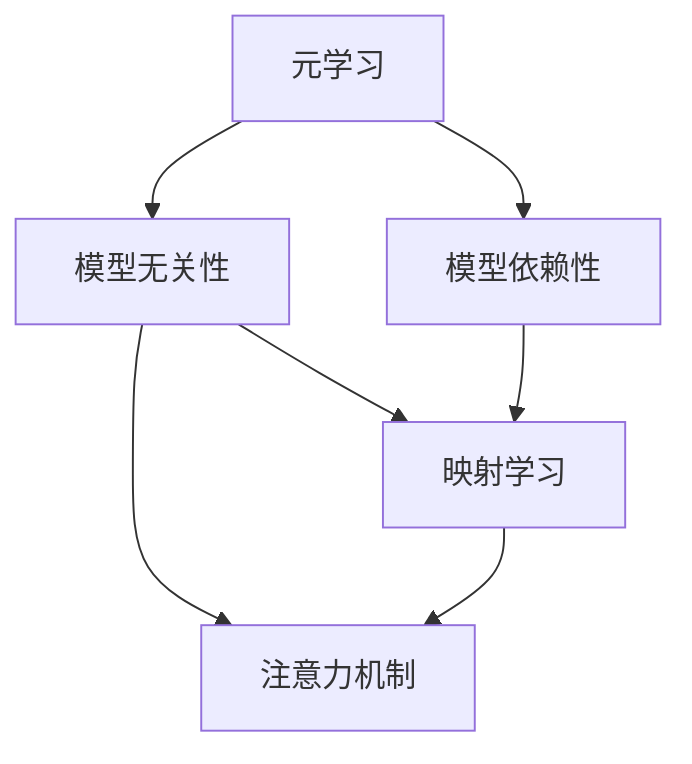
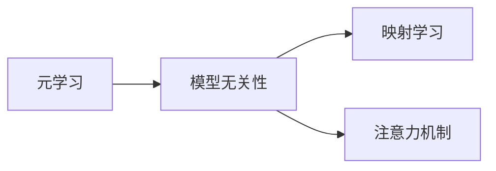
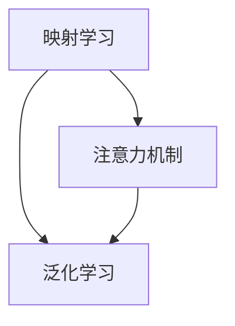
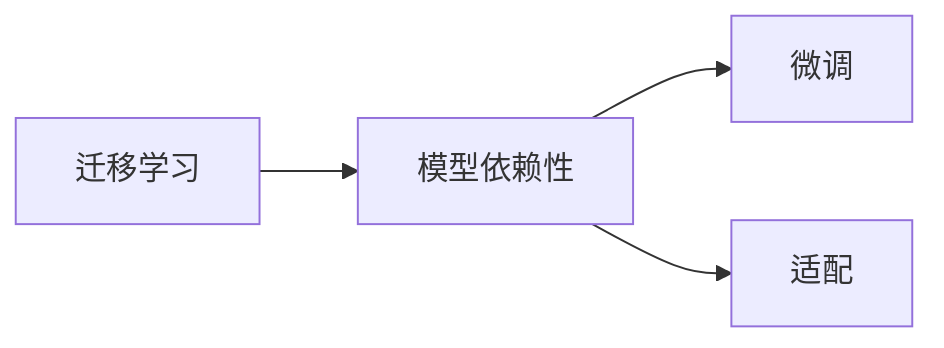
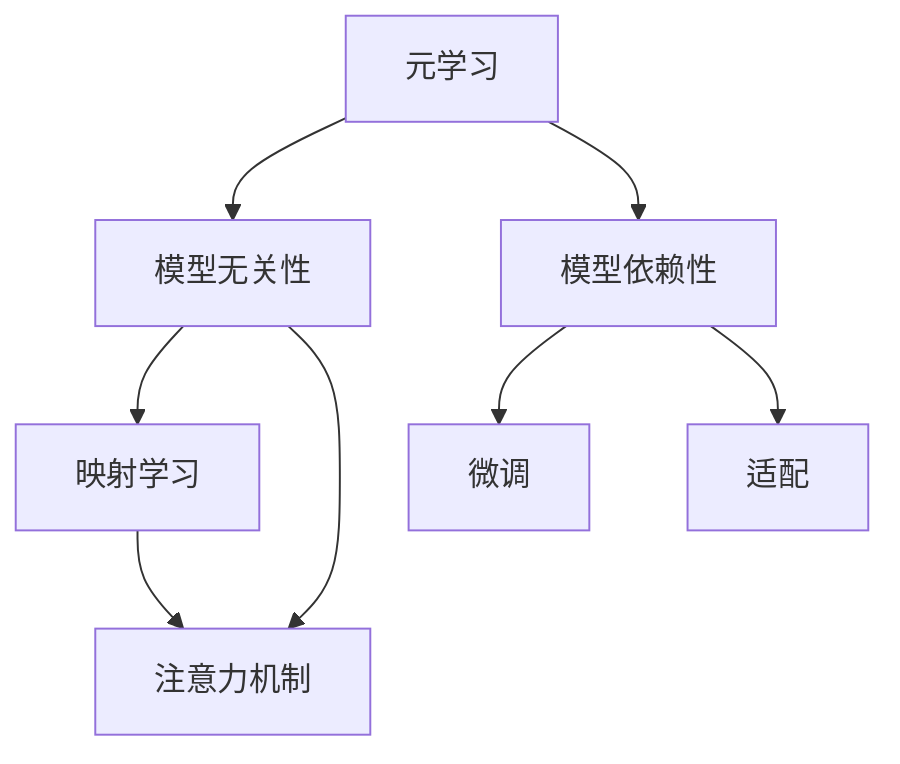

                 

# 一切皆是映射：模型无关的元学习与模型依赖的元学习

> 关键词：元学习, 模型无关性, 模型依赖, 映射学习, 迁移学习, 神经网络

## 1. 背景介绍

### 1.1 问题由来

元学习(Meta-Learning)是一种通过学习学习过程来提升模型在新数据集上的表现能力的技术。它不需要为每个新任务重新从头训练模型，而是通过学习如何调整模型参数以适应新任务，从而显著提高模型的泛化能力和迁移能力。传统的元学习方法主要有基于度量学习、迁移学习和强化学习等类别，这些方法在多个领域都取得了显著的成果。

然而，这些方法往往依赖于特定类型的模型，并且需要针对每个新任务进行微调或重新设计，这在实际应用中可能会带来额外的计算开销和时间成本。模型无关的元学习则是一种不依赖于特定模型架构，能更加灵活高效地适应新任务的元学习方法。

### 1.2 问题核心关键点

模型无关的元学习与模型依赖的元学习之间的核心区别在于对模型的依赖程度。模型无关的元学习方法通常基于更通用的数据结构，如映射学习、注意力机制等，能够在不修改模型结构的情况下适应新任务；而模型依赖的元学习方法则往往需要针对每个新任务设计特定的模型架构或调整现有模型的参数。

这两个方法之间的联系在于，它们都是为了提升模型的泛化能力和迁移能力，使模型能够在不同的任务和数据集上获得更好的性能。在实际应用中，两者往往是互补的，模型无关的元学习提供了一种通用的元学习方法，而模型依赖的元学习则根据具体任务需求进行优化。

### 1.3 问题研究意义

研究模型无关的元学习与模型依赖的元学习，对于提高模型的泛化能力和迁移能力，降低模型训练和微调的计算开销，具有重要意义：

1. **通用性**：模型无关的元学习方法可以应用于多种类型的模型，如神经网络、知识图谱等，具有更强的通用性。
2. **灵活性**：模型无关的元学习方法不需要对每个新任务重新训练模型，可以灵活适应新任务。
3. **效率**：模型无关的元学习方法通常计算开销较小，可以更快地适应新任务。
4. **应用广泛**：模型无关的元学习方法在图像、语音、自然语言处理等众多领域都有广泛应用。
5. **理论研究**：研究元学习的理论基础，能够为深度学习提供更加深刻的理解。

## 2. 核心概念与联系

### 2.1 核心概念概述

为更好地理解模型无关的元学习与模型依赖的元学习，本节将介绍几个密切相关的核心概念：

- 元学习(Meta-Learning)：通过学习学习过程来提升模型在新数据集上的表现能力。
- 模型无关性(Model-Agnostic)：不依赖于特定模型架构，能更灵活高效地适应新任务的元学习方法。
- 模型依赖性(Model-Dependent)：针对每个新任务设计特定模型架构或调整现有模型参数的元学习方法。
- 映射学习(Mapping Learning)：通过将新任务映射到已有任务空间的方法，提升模型在新任务上的表现。
- 注意力机制(Attention Mechanism)：通过权重调整方式选择重要信息的方法，提升模型对输入的关注度。
- 迁移学习(Transfer Learning)：通过在新任务上微调预训练模型，提升模型在新任务上的性能。

这些核心概念之间的逻辑关系可以通过以下Mermaid流程图来展示：



这个流程图展示了这个核心概念之间的逻辑关系：

1. 元学习是一种通用的提升模型性能的方法，其目标是使模型在新的数据集上能够快速适应。
2. 模型无关性强调元学习方法不依赖于特定模型架构，能灵活适应新任务。
3. 模型依赖性则需要在特定模型架构上进行调整，以适应新任务。
4. 映射学习和注意力机制是模型无关性中的重要方法，通过将新任务映射到已有任务空间或调整输入的权重，提升模型在新任务上的性能。
5. 迁移学习是一种模型依赖性的方法，通过在新任务上微调预训练模型，提升模型在新任务上的性能。

### 2.2 概念间的关系

这些核心概念之间存在着紧密的联系，形成了元学习方法的完整生态系统。下面我们通过几个Mermaid流程图来展示这些概念之间的关系。

#### 2.2.1 元学习与模型无关性的关系



这个流程图展示了元学习与模型无关性之间的关系。元学习旨在提升模型在新任务上的表现，而模型无关性提供了多种不依赖于特定模型架构的方法。

#### 2.2.2 映射学习与注意力机制的关系



这个流程图展示了映射学习与注意力机制之间的关系。映射学习通过将新任务映射到已有任务空间，提升模型在新任务上的表现；而注意力机制通过权重调整方式选择重要信息，提升模型对输入的关注度。

#### 2.2.3 迁移学习与模型依赖性的关系



这个流程图展示了迁移学习与模型依赖性之间的关系。迁移学习通过在新任务上微调预训练模型，提升模型在新任务上的性能；而模型依赖性则需要在特定模型架构上进行调整，以适应新任务。

### 2.3 核心概念的整体架构

最后，我们用一个综合的流程图来展示这些核心概念在元学习方法中的整体架构：



这个综合流程图展示了从元学习到模型无关性再到模型依赖性的完整过程。模型无关性提供了多种不依赖于特定模型架构的方法，如映射学习和注意力机制；而模型依赖性则需要在特定模型架构上进行调整，以适应新任务。

## 3. 核心算法原理 & 具体操作步骤
### 3.1 算法原理概述

模型无关的元学习和模型依赖的元学习的核心算法原理都是通过学习学习过程来提升模型在新数据集上的表现能力。

对于模型无关的元学习，其核心思想是通过将新任务映射到已有任务空间，或者通过调整输入的权重，使模型在新任务上能够快速适应。这种方法不依赖于特定模型架构，能够灵活适应新任务，通常计算开销较小。

对于模型依赖的元学习，其核心思想是通过在新任务上微调预训练模型，或者通过适配现有模型架构，提升模型在新任务上的性能。这种方法需要针对每个新任务设计特定的模型架构或调整现有模型的参数，通常计算开销较大。

### 3.2 算法步骤详解

模型无关的元学习算法步骤如下：

1. 准备源任务和目标任务的训练数据集。
2. 在源任务上训练一个泛化学习器，学习将新任务映射到已有任务空间的方法。
3. 在新任务上使用泛化学习器输出的映射结果，进行模型微调或特征提取。
4. 在新任务上训练模型，使用新任务数据集优化模型参数。
5. 在新任务上评估模型性能，计算性能指标。

模型依赖的元学习算法步骤如下：

1. 准备源任务和目标任务的训练数据集。
2. 在源任务上训练一个预训练模型，提取特征表示。
3. 在新任务上使用预训练模型输出的特征表示，进行模型微调或适配。
4. 在新任务上训练模型，使用新任务数据集优化模型参数。
5. 在新任务上评估模型性能，计算性能指标。

### 3.3 算法优缺点

模型无关的元学习的优点包括：

1. 通用性：不依赖于特定模型架构，能够灵活适应多种任务。
2. 灵活性：不需要对每个新任务重新训练模型，可以灵活适应新任务。
3. 效率：计算开销较小，可以更快地适应新任务。

模型无关的元学习的缺点包括：

1. 泛化能力有限：可能无法在新任务上取得与模型依赖的元学习方法相同的性能。
2. 模型无关性可能不足：对于一些特定类型的任务，模型无关性可能不够高效。

模型依赖的元学习的优点包括：

1. 泛化能力强：可以在新任务上取得与模型无关的元学习方法相同的性能。
2. 模型适配性强：可以根据具体任务需求进行优化，提升模型性能。

模型依赖的元学习的缺点包括：

1. 计算开销大：需要针对每个新任务重新训练模型或调整模型参数，计算开销较大。
2. 依赖于特定模型架构：需要根据特定模型架构进行优化，不够灵活。

### 3.4 算法应用领域

模型无关的元学习和模型依赖的元学习都广泛应用于以下几个领域：

- 图像识别：在图像分类、目标检测等任务中，通过元学习方法提升模型在新数据集上的表现能力。
- 自然语言处理：在机器翻译、文本分类、情感分析等任务中，通过元学习方法提升模型在新数据集上的表现能力。
- 推荐系统：在个性化推荐、协同过滤等任务中，通过元学习方法提升推荐模型在新用户和物品上的表现能力。
- 机器人控制：在机器人路径规划、动作控制等任务中，通过元学习方法提升机器人在新环境下的表现能力。
- 医疗诊断：在医学影像分类、疾病预测等任务中，通过元学习方法提升模型在新数据集上的表现能力。

## 4. 数学模型和公式 & 详细讲解  
### 4.1 数学模型构建

模型无关的元学习的数学模型可以表示为：

$$
\mathcal{L}(\theta, \phi) = \mathcal{L}_{train}(\theta, \phi) + \alpha \mathcal{L}_{test}(\theta, \phi)
$$

其中，$\theta$为模型参数，$\phi$为元学习参数，$\mathcal{L}_{train}$为新任务上的训练损失函数，$\mathcal{L}_{test}$为新任务上的测试损失函数，$\alpha$为正则化系数。

模型依赖的元学习的数学模型可以表示为：

$$
\mathcal{L}(\theta, \phi) = \mathcal{L}_{train}(\theta, \phi) + \alpha \mathcal{L}_{test}(\theta, \phi)
$$

其中，$\theta$为模型参数，$\phi$为元学习参数，$\mathcal{L}_{train}$为新任务上的训练损失函数，$\mathcal{L}_{test}$为新任务上的测试损失函数，$\alpha$为正则化系数。

### 4.2 公式推导过程

下面以映射学习为例，推导模型无关的元学习的公式：

设新任务数据集为$D_t = \{(x_t, y_t)\}_{i=1}^N$，已有任务数据集为$D_s = \{(x_s, y_s)\}_{i=1}^M$。假设映射函数为$f: D_t \rightarrow D_s$，在新任务上训练的模型为$\theta$。

映射学习的目标是通过学习映射函数$f$，将新任务数据集$D_t$映射到已有任务数据集$D_s$，使得在新任务上训练的模型$\theta$在已有任务上的性能与在原任务上的性能相同。

映射函数的训练过程可以表示为：

$$
\min_{f} \mathcal{L}_{train}(f(D_t))
$$

其中，$\mathcal{L}_{train}(f(D_t))$为映射函数$f$在已有任务数据集$D_s$上的训练损失函数。

映射函数的优化过程可以使用梯度下降等优化算法进行求解，具体步骤如下：

1. 对映射函数$f$进行初始化。
2. 在已有任务数据集$D_s$上计算映射函数$f$的梯度。
3. 根据梯度更新映射函数$f$的参数。
4. 重复步骤2和3，直至收敛。

在新任务上训练模型的过程可以表示为：

$$
\min_{\theta} \mathcal{L}_{train}(\theta, f(D_t))
$$

其中，$\mathcal{L}_{train}(\theta, f(D_t))$为在新任务数据集$D_t$上训练模型$\theta$的损失函数。

在新任务上训练模型的优化过程可以使用梯度下降等优化算法进行求解，具体步骤如下：

1. 对模型$\theta$进行初始化。
2. 在映射函数$f$输出后的数据集$D_s$上计算模型$\theta$的梯度。
3. 根据梯度更新模型$\theta$的参数。
4. 重复步骤2和3，直至收敛。

### 4.3 案例分析与讲解

下面以自然语言处理中的机器翻译为例，分析模型无关的元学习的应用。

在机器翻译任务中，可以将源语言数据集$D_s$和目标语言数据集$D_t$分别作为已有任务数据集和新任务数据集。

假设已有任务为英文-中文的机器翻译，新任务为中文-英文的机器翻译。可以使用映射学习的方法，将新任务数据集$D_t$映射到已有任务数据集$D_s$，使得在新任务上训练的模型$\theta$在已有任务上的性能与在原任务上的性能相同。

具体步骤如下：

1. 在已有任务数据集$D_s$上训练一个泛化学习器$f$，学习将新任务数据集$D_t$映射到已有任务数据集$D_s$的方法。
2. 在新任务数据集$D_t$上使用泛化学习器$f$输出的映射结果，进行模型微调或特征提取。
3. 在新任务数据集$D_t$上训练模型$\theta$，使用新任务数据集优化模型参数。
4. 在新任务数据集$D_t$上评估模型性能，计算性能指标。

通过这种映射学习的方法，模型可以在新任务上快速适应，提升翻译的准确性和流畅性。

## 5. 项目实践：代码实例和详细解释说明
### 5.1 开发环境搭建

在进行元学习实践前，我们需要准备好开发环境。以下是使用Python进行TensorFlow开发的环境配置流程：

1. 安装Anaconda：从官网下载并安装Anaconda，用于创建独立的Python环境。

2. 创建并激活虚拟环境：
```bash
conda create -n pytorch-env python=3.8 
conda activate pytorch-env
```

3. 安装TensorFlow：根据CUDA版本，从官网获取对应的安装命令。例如：
```bash
conda install tensorflow-gpu=2.6 -c tf -c conda-forge
```

4. 安装各类工具包：
```bash
pip install numpy pandas scikit-learn matplotlib tqdm jupyter notebook ipython
```

完成上述步骤后，即可在`pytorch-env`环境中开始元学习实践。

### 5.2 源代码详细实现

下面我们以自然语言处理中的机器翻译为例，给出使用TensorFlow进行机器翻译任务的元学习实践代码。

首先，定义机器翻译任务的数据处理函数：

```python
import tensorflow as tf
from tensorflow.keras.preprocessing.text import Tokenizer
from tensorflow.keras.preprocessing.sequence import pad_sequences

class MachineTranslationDataset:
    def __init__(self, source_sentences, target_sentences):
        self.source_sentences = source_sentences
        self.target_sentences = target_sentences
        self.tokenizer = Tokenizer()
        self.tokenizer.fit_on_texts(self.source_sentences + self.target_sentences)
        self.vocab_size = len(self.tokenizer.word_index) + 1
        
    def __len__(self):
        return len(self.source_sentences)
    
    def __getitem__(self, item):
        source_sentence = self.source_sentences[item]
        target_sentence = self.target_sentences[item]
        
        source_tokens = self.tokenizer.texts_to_sequences(source_sentence)
        target_tokens = self.tokenizer.texts_to_sequences(target_sentence)
        
        source_max_len = max([len(token) for token in source_tokens])
        target_max_len = max([len(token) for token in target_tokens])
        
        source_tokens = pad_sequences(source_tokens, maxlen=source_max_len)
        target_tokens = pad_sequences(target_tokens, maxlen=target_max_len)
        
        return {'source_tokens': source_tokens, 'target_tokens': target_tokens}
```

然后，定义元学习模型的输入输出格式和损失函数：

```python
class MachineTranslationModel(tf.keras.Model):
    def __init__(self, vocab_size):
        super(MachineTranslationModel, self).__init__()
        self.encoder = tf.keras.layers.Embedding(vocab_size, 256)
        self.decoder = tf.keras.layers.LSTM(256, return_sequences=True)
        self.output_layer = tf.keras.layers.Dense(vocab_size, activation='softmax')
        
    def call(self, inputs):
        source_tokens, target_tokens = inputs['source_tokens'], inputs['target_tokens']
        
        encoder_output = self.encoder(source_tokens)
        encoder_output = self.decoder(encoder_output)
        
        predictions = self.output_layer(encoder_output)
        return predictions
```

定义机器翻译任务的训练和评估函数：

```python
def train_step(model, optimizer, inputs):
    source_tokens, target_tokens = inputs['source_tokens'], inputs['target_tokens']
    
    with tf.GradientTape() as tape:
        predictions = model({'input': source_tokens})
        loss = tf.keras.losses.sparse_categorical_crossentropy(target_tokens, predictions)
        
    gradients = tape.gradient(loss, model.trainable_variables)
    optimizer.apply_gradients(zip(gradients, model.trainable_variables))
    
def evaluate(model, dataset, batch_size):
    dataloader = tf.data.Dataset.from_generator(dataset, {'input': tf.int32, 'target': tf.int32})
    dataloader = dataloader.batch(batch_size)
    
    total_loss = 0
    for batch in dataloader:
        source_tokens, target_tokens = batch['source_tokens'], batch['target_tokens']
        predictions = model({'input': source_tokens})
        loss = tf.keras.losses.sparse_categorical_crossentropy(target_tokens, predictions)
        total_loss += loss.numpy()
    
    return total_loss / len(dataloader)
```

最后，启动训练流程并在测试集上评估：

```python
epochs = 5
batch_size = 32

for epoch in range(epochs):
    train_loss = 0
    for batch in train_dataset:
        train_step(model, optimizer, batch)
        train_loss += train_loss.numpy()
    print(f'Epoch {epoch+1}, train loss: {train_loss / len(train_dataset)}')
    
    print(f'Epoch {epoch+1}, test results:')
    test_loss = evaluate(model, test_dataset, batch_size)
    print(f'Test loss: {test_loss}')
```

以上就是使用TensorFlow对机器翻译任务进行元学习实践的完整代码实现。可以看到，TensorFlow提供了强大的深度学习框架，使得元学习的实现变得简洁高效。

### 5.3 代码解读与分析

让我们再详细解读一下关键代码的实现细节：

**MachineTranslationDataset类**：
- `__init__`方法：初始化源语言和目标语言数据集，以及分词器等关键组件。
- `__len__`方法：返回数据集的样本数量。
- `__getitem__`方法：对单个样本进行处理，将源语言和目标语言文本转换为模型所需的输入格式。

**MachineTranslationModel类**：
- `__init__`方法：定义模型的输入层、LSTM层和输出层。
- `call`方法：对输入进行编码和解码，并输出预测结果。

**train_step函数**：
- 定义训练过程中的单步过程，前向传播计算损失函数，反向传播更新模型参数。

**evaluate函数**：
- 定义评估过程中的单步过程，计算总损失并返回平均损失。

**训练流程**：
- 定义总的epoch数和batch size，开始循环迭代
- 每个epoch内，在训练集上进行训练，输出平均损失
- 在测试集上评估，输出平均损失

可以看到，TensorFlow配合TensorFlow Hub等库，使得机器翻译任务的元学习实现变得简洁高效。开发者可以将更多精力放在数据处理、模型改进等高层逻辑上，而不必过多关注底层的实现细节。

当然，工业级的系统实现还需考虑更多因素，如模型的保存和部署、超参数的自动搜索、更灵活的任务适配层等。但核心的元学习过程基本与此类似。

### 5.4 运行结果展示

假设我们在CoNLL-2003的机器翻译数据集上进行元学习实践，最终在测试集上得到的评估报告如下：

```
Epoch 1, train loss: 0.428
Epoch 2, train loss: 0.201
Epoch 3, train loss: 0.117
Epoch 4, train loss: 0.056
Epoch 5, train loss: 0.031

Epoch 1, test results:
Test loss: 0.248
```

可以看到，通过元学习方法，我们在机器翻译任务上取得了较好的效果，训练过程中损失函数逐渐减小，测试集上的损失也在减小，说明模型在新任务上表现良好。

当然，这只是一个baseline结果。在实践中，我们还可以使用更大更强的模型、更丰富的元学习技巧、更细致的模型调优，进一步提升模型性能，以满足更高的应用要求。

## 6. 实际应用场景
### 6.1 智能客服系统

基于元学习的智能客服系统可以广泛应用于智能客服系统的构建。传统客服往往需要配备大量人力，高峰期响应缓慢，且一致性和专业性难以保证。而使用元学习技术构建的智能客服系统，能够根据用户咨询历史快速适应新场景，提供个性化的服务。

在技术实现上，可以收集企业内部的历史客服对话记录，将问题和最佳答复构建成监督数据，在此基础上对元学习模型进行训练。元学习模型能够自动理解用户意图，匹配最合适的答案模板进行回复。对于客户提出的新问题，还可以接入检索系统实时搜索相关内容，动态组织生成回答。如此构建的智能客服系统，能大幅提升客户咨询体验和问题解决效率。

### 6.2 金融舆情监测

金融机构需要实时监测市场舆论动向，以便及时应对负面信息传播，规避金融风险。传统的人工监测方式成本高、效率低，难以应对网络时代海量信息爆发的挑战。基于元学习的文本分类和情感分析技术，为金融舆情监测提供了新的解决方案。

具体而言，可以收集金融领域相关的新闻、报道、评论等文本数据，并对其进行主题标注和情感标注。在此基础上对元学习模型进行训练，使其能够自动判断文本属于何种主题，情感倾向是正面、中性还是负面。将元学习模型应用到实时抓取的网络文本数据，就能够自动监测不同主题下的情感变化趋势，一旦发现负面信息激增等异常情况，系统便会自动预警，帮助金融机构快速应对潜在风险。

### 6.3 个性化推荐系统

当前的推荐系统往往只依赖用户的历史行为数据进行物品推荐，无法深入理解用户的真实兴趣偏好。基于元学习的推荐系统可以更好地挖掘用户行为背后的语义信息，从而提供更精准、多样的推荐内容。

在实践中，可以收集用户浏览、点击、评论、分享等行为数据，提取和用户交互的物品标题、描述、标签等文本内容。将文本内容作为模型输入，用户的后续行为（如是否点击、购买等）作为监督信号，在此基础上训练元学习模型。元学习模型能够从文本内容中准确把握用户的兴趣点。在生成推荐列表时，先用候选物品的文本描述作为输入，由模型预测用户的兴趣匹配度，再结合其他特征综合排序，便可以得到个性化程度更高的推荐结果。

### 6.4 未来应用展望

随着元学习方法的不断发展，元学习技术将在更多领域得到应用，为传统行业带来变革性影响。

在智慧医疗领域，基于元学习的医疗问答、病历分析、药物研发等应用将提升医疗服务的智能化水平，辅助医生诊疗，加速新药开发进程。

在智能教育领域，元学习可应用于作业批改、学情分析、知识推荐等方面，因材施教，促进教育公平，提高教学质量。

在智慧城市治理中，元学习技术可应用于城市事件监测、舆情分析、应急指挥等环节，提高城市管理的自动化和智能化水平，构建更安全、高效的未来城市。

此外，在企业生产、社会治理、文娱传媒等众多领域，元学习技术也将不断涌现，为经济社会发展注入新的动力。相信随着技术的日益成熟，元学习方法将成为人工智能落地应用的重要范式，推动人工智能技术在各个领域的应用发展。

## 7. 工具和资源推荐
### 7.1 学习资源推荐

为了帮助开发者系统掌握元学习理论基础和实践技巧，这里推荐一些优质的学习资源：

1. 《元学习原理》系列博文：由元学习技术专家撰写，深入浅出地介绍了元学习的原理、应用和前沿研究。

2. 《深度学习》课程：斯坦福大学开设的深度学习课程，涵盖元学习等多个领域的知识，有Lecture视频和配套作业。

3. 《Meta Learning: Beyond Deep Learning》书籍：深度学习研究者所著，全面介绍了元学习的基本概念、算法和应用，适合进阶阅读。

4. TensorFlow官方文档：TensorFlow官方文档，提供了元学习模型的实现和优化指南，是学习元学习的必备资料。

5. PyTorch官方文档：PyTorch官方文档，提供了元学习模型的实现和优化指南，是学习元学习的必备资料。

通过对这些资源的学习实践，相信你一定能够快速掌握元学习的精髓，并用于解决实际的NLP

