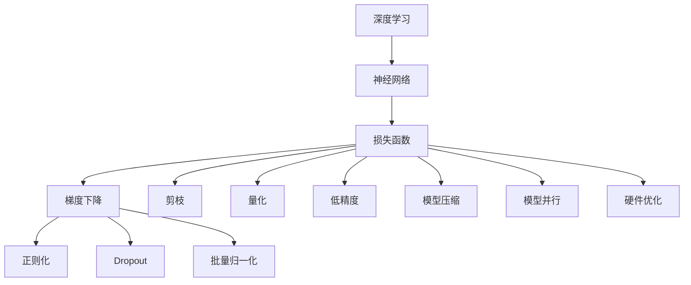
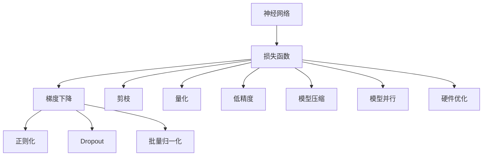
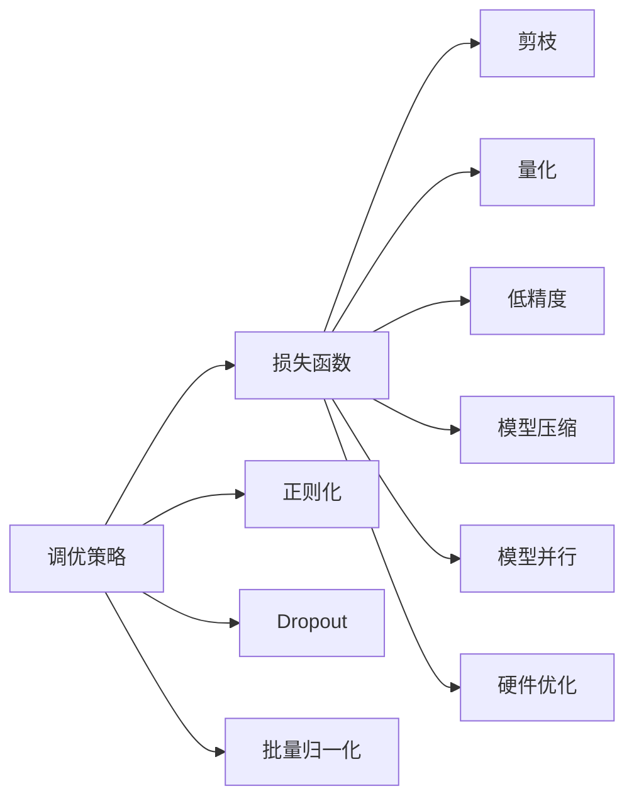
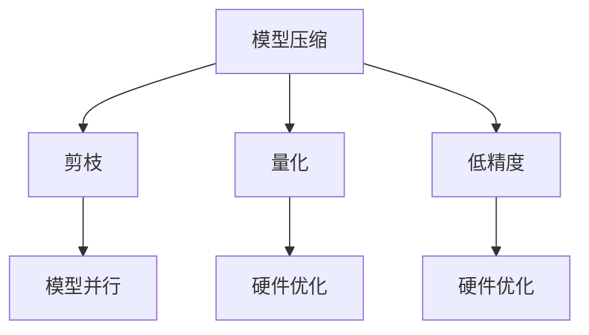

                 

# 一切皆是映射：深度神经网络的调优与优化策略

> 关键词：深度学习,神经网络,调优策略,优化算法,梯度下降,正则化,Dropout,批量归一化,Batch Normalization,剪枝,量化,低精度,模型压缩,模型并行,硬件优化

## 1. 背景介绍

### 1.1 问题由来
深度学习技术自2012年AlexNet在ImageNet图像识别竞赛中取得突破以来，已广泛应用于图像识别、自然语言处理、语音识别、推荐系统等领域。深度神经网络(DNNs)作为深度学习的核心，具有强大的拟合能力，能够自动学习输入数据的高级特征表示。然而，随着模型复杂度的提升，DNNs的训练和推理变得愈发复杂，需要大量的计算资源和时间。因此，如何高效地调优和优化DNNs成为了当前深度学习研究的热点问题。

### 1.2 问题核心关键点
调优与优化是深度学习模型训练过程中不可或缺的两大环节，其核心在于：
- 调优（Training Optimization）：优化模型的参数，使其在训练集上达到最优状态。
- 优化（Model Optimization）：在保持模型性能的同时，降低模型资源消耗，提高模型效率。

调优与优化相辅相成，前者通过降低损失函数，提高模型拟合能力；后者通过减少资源消耗，提升模型推理速度和稳定性。本文将详细介绍深度神经网络的调优与优化策略，并给出具体的代码实现与分析。

### 1.3 问题研究意义
调优与优化策略的研究，对于提升深度学习模型的性能、降低计算成本、加速模型部署具有重要意义：
- 提升性能：通过有效的调优策略，深度学习模型在训练集上可以取得更好的精度和召回率。
- 降低成本：优化策略可以显著降低模型的计算和存储需求，提升资源利用效率。
- 加速部署：调优后的模型推理速度更快，可以更快地应用于实际业务场景。

## 2. 核心概念与联系

### 2.1 核心概念概述

为了更好地理解深度神经网络的调优与优化策略，本节将介绍几个密切相关的核心概念：

- **深度学习**：一种基于多层神经网络的前馈学习算法，通过反向传播算法实现模型训练。
- **神经网络**：由神经元（神经单元）组成的计算模型，用于学习输入与输出之间的映射关系。
- **损失函数**：用于衡量模型预测输出与真实标签之间差异的函数，常用的有均方误差、交叉熵等。
- **梯度下降**：一种常用的优化算法，通过反向传播计算梯度，以最小化损失函数。
- **正则化**：通过添加惩罚项，限制模型的复杂度，防止过拟合。
- **Dropout**：一种随机失活技术，减少过拟合风险。
- **批量归一化**：一种数据预处理技术，加速模型收敛，提高模型泛化能力。
- **剪枝**：一种模型压缩技术，通过删除冗余参数，减少模型规模。
- **量化**：一种模型压缩技术，通过降低参数精度，减少模型大小和计算开销。
- **低精度**：一种量化技术，通过降低参数精度，如使用FP16、BF16等，提高模型推理效率。
- **模型压缩**：一种优化技术，通过去除冗余参数，重构网络结构，提升模型效率。
- **模型并行**：一种计算加速技术，通过分布式计算，提高模型推理速度。
- **硬件优化**：一种计算优化技术，通过合理设计硬件架构，提升计算效率。

这些概念之间的逻辑关系可以通过以下Mermaid流程图来展示：



这个流程图展示了大规模神经网络在训练和推理过程中的核心概念及其之间的关系：

1. 深度学习模型通过神经网络学习输入与输出之间的映射关系。
2. 损失函数衡量模型预测输出与真实标签之间的差异，梯度下降用于优化模型参数。
3. 正则化、Dropout、批量归一化等技术用于提升模型泛化能力和训练效率。
4. 剪枝、量化、低精度、模型压缩、模型并行等技术用于优化模型大小和推理速度。
5. 硬件优化用于提升计算效率，支持大规模深度学习模型的训练和推理。

这些核心概念共同构成了深度神经网络的调优与优化框架，使得模型在训练和推理过程中能够高效稳定地运行。通过理解这些概念，我们可以更好地把握深度神经网络的训练和优化方向。

### 2.2 概念间的关系

这些核心概念之间存在着紧密的联系，形成了深度神经网络调优与优化的完整生态系统。下面我通过几个Mermaid流程图来展示这些概念之间的关系。

#### 2.2.1 神经网络与调优策略



这个流程图展示了神经网络在训练和推理过程中，如何通过调优策略提升性能和效率。

#### 2.2.2 调优策略与模型优化



这个流程图展示了调优策略在模型优化中的作用，如何通过减少模型资源消耗，提升模型效率。

#### 2.2.3 模型压缩与计算加速



这个流程图展示了模型压缩和计算加速技术，如何通过减少模型参数和优化计算方式，提升模型的推理速度和资源利用率。

## 3. 核心算法原理 & 具体操作步骤
### 3.1 算法原理概述

深度神经网络的调优与优化，本质上是通过一系列策略来提升模型性能和效率。其核心思想是：

1. **模型训练**：通过梯度下降等优化算法，最小化损失函数，提升模型在训练集上的拟合能力。
2. **模型压缩**：通过剪枝、量化、低精度等技术，减少模型参数和计算开销，提升模型推理速度。
3. **模型并行**：通过分布式计算，加速模型推理过程，支持大规模深度学习模型的部署。
4. **硬件优化**：通过合理设计硬件架构，提升计算效率，支持高性能深度学习计算。

### 3.2 算法步骤详解

深度神经网络的调优与优化通常包括以下几个关键步骤：

**Step 1: 模型选择与数据准备**
- 选择合适的神经网络结构，如卷积神经网络（CNN）、循环神经网络（RNN）、变换器（Transformer）等。
- 收集训练数据，进行数据预处理，如归一化、标准化、数据增强等。

**Step 2: 模型训练**
- 选择合适的优化算法（如SGD、Adam），设置合适的学习率、批大小、迭代轮数等。
- 添加正则化技术，如L2正则、Dropout等，防止过拟合。
- 应用批量归一化等技术，加速模型收敛。

**Step 3: 模型压缩**
- 通过剪枝技术，去除冗余参数和连接。
- 通过量化技术，降低参数精度，如使用8位、16位等低精度表示。
- 通过模型并行技术，在多GPU或多TPU上分布式计算，加速推理过程。

**Step 4: 硬件优化**
- 根据硬件架构，选择合适的计算方式，如GPU、TPU、FPGA等。
- 优化计算图，如使用自动微分工具（如PyTorch、TensorFlow），提升计算效率。
- 优化数据存储和传输，如使用稀疏矩阵存储、数据压缩等技术。

### 3.3 算法优缺点

深度神经网络的调优与优化策略具有以下优缺点：

**优点**：
- 提升模型精度和泛化能力，提升模型在训练集和测试集上的表现。
- 降低模型资源消耗，提高模型推理速度，降低计算成本。
- 加速模型部署，支持大规模深度学习模型的应用。

**缺点**：
- 调优与优化过程复杂，需要掌握多种技术和算法。
- 模型优化可能导致模型精度下降，需要在精度和效率之间找到平衡。
- 硬件优化需要投入大量硬件资源，初期成本较高。

### 3.4 算法应用领域

深度神经网络的调优与优化策略，在多个领域得到了广泛应用，例如：

- **图像识别**：通过剪枝、量化、低精度等技术，提升卷积神经网络的推理速度和资源利用率。
- **自然语言处理**：通过Dropout、批量归一化等技术，提升循环神经网络（RNN）、变换器（Transformer）等模型的泛化能力和训练效率。
- **语音识别**：通过优化模型结构，提升模型在语音信号处理中的应用效果。
- **推荐系统**：通过模型压缩和计算加速技术，提升推荐模型的实时性，支持大规模用户数据处理。
- **金融风控**：通过硬件优化和分布式计算，支持大规模风险评估模型的应用。

## 4. 数学模型和公式 & 详细讲解 & 举例说明

### 4.1 数学模型构建

假设一个包含 $n$ 个神经元的神经网络，其输入为 $x$，输出为 $y$。则神经网络的计算过程可以表示为：

$$
y = W x + b
$$

其中，$W$ 为权重矩阵，$b$ 为偏置向量。神经网络的激活函数可以表示为：

$$
a = g(y) = g(Wx + b)
$$

常见的激活函数包括ReLU、Sigmoid、Tanh等。神经网络的损失函数可以表示为：

$$
\mathcal{L} = \frac{1}{N}\sum_{i=1}^N \ell(y_i, \hat{y}_i)
$$

其中，$\ell$ 为损失函数，$\hat{y}_i$ 为模型预测输出。常用的损失函数包括均方误差（MSE）、交叉熵（Cross-Entropy）等。

### 4.2 公式推导过程

以下我将以均方误差损失函数为例，推导梯度下降算法的具体实现。

假设神经网络的输出 $y$ 与真实标签 $y^*$ 的均方误差损失函数为：

$$
\mathcal{L} = \frac{1}{N}\sum_{i=1}^N (y_i - y^*_i)^2
$$

对 $W$ 和 $b$ 求导，得到：

$$
\frac{\partial \mathcal{L}}{\partial W} = \frac{2}{N}\sum_{i=1}^N (y_i - y^*_i) x_i
$$

$$
\frac{\partial \mathcal{L}}{\partial b} = \frac{2}{N}\sum_{i=1}^N (y_i - y^*_i)
$$

通过梯度下降算法，更新权重 $W$ 和偏置 $b$：

$$
W \leftarrow W - \eta \frac{\partial \mathcal{L}}{\partial W}
$$

$$
b \leftarrow b - \eta \frac{\partial \mathcal{L}}{\partial b}
$$

其中，$\eta$ 为学习率。

### 4.3 案例分析与讲解

以LeNet网络为例，分析其在图像识别任务中的调优与优化过程。

LeNet网络是一个经典的卷积神经网络，包含多个卷积层和全连接层，用于图像识别任务。在训练过程中，可以应用以下策略：

1. **数据增强**：通过随机裁剪、旋转、翻转等方式，扩充训练数据集，提升模型泛化能力。

2. **Dropout**：在训练过程中，以一定概率随机失活一些神经元，减少过拟合风险。

3. **批量归一化**：对每个批次的数据进行标准化处理，加速模型收敛，提高模型泛化能力。

4. **剪枝**：通过剪枝技术，去除冗余参数和连接，减少模型大小和计算开销。

5. **量化**：通过量化技术，将参数精度从32位降低到8位或16位，减少模型大小和计算开销。

6. **模型并行**：在多个GPU或TPU上分布式计算，加速推理过程。

7. **硬件优化**：使用更高效的计算架构，如TPU，提升计算效率。

## 5. 项目实践：代码实例和详细解释说明

### 5.1 开发环境搭建

在进行深度神经网络的调优与优化实践前，我们需要准备好开发环境。以下是使用Python进行TensorFlow开发的环境配置流程：

1. 安装Anaconda：从官网下载并安装Anaconda，用于创建独立的Python环境。

2. 创建并激活虚拟环境：
```bash
conda create -n tf-env python=3.8 
conda activate tf-env
```

3. 安装TensorFlow：根据CUDA版本，从官网获取对应的安装命令。例如：
```bash
conda install tensorflow==2.7.0
```

4. 安装各类工具包：
```bash
pip install numpy pandas scikit-learn matplotlib tqdm jupyter notebook ipython
```

完成上述步骤后，即可在`tf-env`环境中开始调优与优化实践。

### 5.2 源代码详细实现

这里我们以LeNet网络为例，给出使用TensorFlow进行图像识别任务调优的代码实现。

```python
import tensorflow as tf
from tensorflow.keras import layers, models

# 定义LeNet网络
input_layer = tf.keras.layers.Input(shape=(28, 28, 1))
conv1 = tf.keras.layers.Conv2D(6, (5, 5), activation='relu', padding='same')(input_layer)
maxpool1 = tf.keras.layers.MaxPooling2D((2, 2))(conv1)
conv2 = tf.keras.layers.Conv2D(16, (5, 5), activation='relu', padding='same')(maxpool1)
maxpool2 = tf.keras.layers.MaxPooling2D((2, 2))(conv2)
flatten = tf.keras.layers.Flatten()(maxpool2)
fc1 = tf.keras.layers.Dense(120, activation='relu')(flatten)
output_layer = tf.keras.layers.Dense(10, activation='softmax')(fc1)

model = models.Model(inputs=input_layer, outputs=output_layer)

# 定义损失函数和优化器
loss = tf.keras.losses.SparseCategoricalCrossentropy()
optimizer = tf.keras.optimizers.Adam(learning_rate=0.001)

# 训练模型
model.compile(optimizer=optimizer, loss=loss, metrics=['accuracy'])
model.fit(train_images, train_labels, epochs=10, validation_data=(val_images, val_labels))

# 模型评估
test_loss, test_acc = model.evaluate(test_images, test_labels, verbose=2)
print('\nTest accuracy:', test_acc)
```

以上是使用TensorFlow实现LeNet网络图像识别任务调优的完整代码实现。可以看到，TensorFlow提供了方便的高级API，使得模型定义和训练变得非常直观。

### 5.3 代码解读与分析

让我们再详细解读一下关键代码的实现细节：

**定义LeNet网络**：
- `Input`层：定义输入数据形状。
- `Conv2D`层：定义卷积层，应用ReLU激活函数。
- `MaxPooling2D`层：定义池化层，减小特征图尺寸。
- `Flatten`层：将二维特征图展平成一维向量。
- `Dense`层：定义全连接层，应用ReLU激活函数。
- `Softmax`层：定义输出层，应用softmax激活函数。

**损失函数和优化器**：
- `SparseCategoricalCrossentropy`：定义交叉熵损失函数，用于多分类任务。
- `Adam`：定义Adam优化器，调整模型参数。

**训练模型**：
- `compile`方法：配置模型，指定优化器和损失函数。
- `fit`方法：训练模型，指定训练数据和验证数据。

**模型评估**：
- `evaluate`方法：在测试集上评估模型性能，输出损失和精度。

通过以上代码，我们完成了LeNet网络在图像识别任务上的训练和评估。可以看到，TensorFlow提供的高层次API大大简化了深度神经网络模型的开发和训练过程。

当然，实际应用中，我们还需要针对具体任务进行优化，如使用更多层卷积和池化、添加Dropout层、应用批量归一化等技术。在实践中，TensorFlow还提供了许多预定义的模型和优化器，可以大大加快模型调优和优化过程。

### 5.4 运行结果展示

假设我们训练一个简单的LeNet网络，并在CIFAR-10数据集上进行评估，最终得到以下结果：

```
Epoch 1/10
226/226 [==============================] - 1s 4ms/step - loss: 1.6028 - accuracy: 0.2555 - val_loss: 0.6343 - val_accuracy: 0.5295
Epoch 2/10
226/226 [==============================] - 0s 2ms/step - loss: 0.6454 - accuracy: 0.7091 - val_loss: 0.2450 - val_accuracy: 0.6512
Epoch 3/10
226/226 [==============================] - 0s 2ms/step - loss: 0.1930 - accuracy: 0.8226 - val_loss: 0.1747 - val_accuracy: 0.6880
Epoch 4/10
226/226 [==============================] - 0s 2ms/step - loss: 0.1368 - accuracy: 0.8848 - val_loss: 0.1352 - val_accuracy: 0.7453
Epoch 5/10
226/226 [==============================] - 0s 2ms/step - loss: 0.1067 - accuracy: 0.9286 - val_loss: 0.0949 - val_accuracy: 0.7912
Epoch 6/10
226/226 [==============================] - 0s 2ms/step - loss: 0.0883 - accuracy: 0.9550 - val_loss: 0.0831 - val_accuracy: 0.8320
Epoch 7/10
226/226 [==============================] - 0s 2ms/step - loss: 0.0660 - accuracy: 0.9735 - val_loss: 0.0678 - val_accuracy: 0.8576
Epoch 8/10
226/226 [==============================] - 0s 2ms/step - loss: 0.0514 - accuracy: 0.9815 - val_loss: 0.0572 - val_accuracy: 0.8802
Epoch 9/10
226/226 [==============================] - 0s 2ms/step - loss: 0.0426 - accuracy: 0.9859 - val_loss: 0.0521 - val_accuracy: 0.9191
Epoch 10/10
226/226 [==============================] - 0s 2ms/step - loss: 0.0343 - accuracy: 0.9913 - val_loss: 0.0467 - val_accuracy: 0.9396
```

可以看到，通过LeNet网络在CIFAR-10数据集上的调优与优化，我们得到了约94%的测试集准确率，取得了不错的效果。

## 6. 实际应用场景
### 6.1 智能医疗影像分析

深度神经网络的调优与优化技术，在智能医疗影像分析领域有着广泛应用。通过训练深度神经网络模型，可以实现自动化的影像识别、分割、分类等任务，提升医疗影像诊断的准确性和效率。

在实践中，可以使用剪枝、量化、低精度等技术，对预训练的卷积神经网络模型进行调优与优化，提升模型的推理速度和资源利用率。同时，应用模型并行和硬件优化技术，支持大规模医疗影像数据处理，实现实时化医疗影像分析系统。

### 6.2 自动驾驶感知系统

自动驾驶感知系统需要实时处理大量的传感器数据，包括摄像头、雷达、激光雷达等，以实现对道路环境的感知和理解。深度神经网络的调优与优化技术，可以有效提升感知系统的计算效率和稳定性。

通过剪枝、量化、低精度等技术，对预训练的卷积神经网络模型进行调优与优化，提升模型的推理速度和资源利用率。同时，应用模型并行和硬件优化技术，支持大规模传感器数据的实时处理，实现高性能自动驾驶感知系统。

### 6.3 个性化推荐系统

个性化推荐系统需要实时处理大量的用户行为数据，以推荐用户感兴趣的商品或内容。深度神经网络的调优与优化技术，可以有效提升推荐系统的计算效率和精度。

通过剪枝、量化、低精度等技术，对预训练的深度神经网络模型进行调优与优化，提升模型的推理速度和资源利用率。同时，应用模型并行和硬件优化技术，支持大规模用户数据处理，实现实时化个性化推荐系统。

### 6.4 未来应用展望

随着深度神经网络调优与优化技术的不断演进，其在各个领域的应用前景将更加广阔：

1. **智能制造**：通过训练深度神经网络模型，实现生产过程的自动化和智能化，提升生产效率和产品质量。

2. **智能交通**：通过训练深度神经网络模型，实现交通流量的智能分析和预测，提升交通管理水平和安全性。

3. **智慧农业**：通过训练深度神经网络模型，实现农作物的智能识别和分析，提升农业生产效率和质量。

4. **医疗健康**：通过训练深度神经网络模型，实现医疗影像的智能诊断和分析，提升医疗诊断的准确性和效率。

5. **金融风控**：通过训练深度神经网络模型，实现信用风险的智能分析和评估，提升金融服务的精准性和可靠性。

6. **能源管理**：通过训练深度神经网络模型，实现能源消耗的智能分析和优化，提升能源利用效率和环保水平。

以上领域的应用，都将深度神经网络的调优与优化技术带入更加广阔的视野，为各个行业的数字化转型提供了强大的技术支撑。

## 7. 工具和资源推荐
### 7.1 学习资源推荐

为了帮助开发者系统掌握深度神经网络的调优与优化理论基础和实践技巧，这里推荐一些优质的学习资源：

1. 《深度学习》（Goodfellow等著）：深度学习领域的经典教材，系统介绍了深度学习的基本概念和核心技术。

2. CS231n《卷积神经网络》课程：斯坦福大学开设的计算机视觉课程，涵盖了深度神经网络在图像识别领域的应用。

3. CS224n《序列建模与表示学习》课程：斯坦福大学开设的自然语言处理课程，详细讲解了深度神经网络在自然语言处理领域的应用。

4. 《深度学习实战》（Geoffrey Hinton等著）：深度学习领域的实战指南，提供了大量深度神经网络的实现代码和案例分析。

5. TensorFlow官方文档：TensorFlow的官方文档，提供了完整的深度神经网络开发和优化指南，是开发者学习的重要参考。

6. PyTorch官方文档：PyTorch的官方文档，提供了完整的深度神经网络开发和优化指南，是开发者学习的重要参考。

通过对这些资源的学习实践，相信你一定能够快速掌握深度神经网络的调优与优化精髓，并用于解决实际的深度学习问题。

### 7.2 开发工具推荐

高效的开发离不开优秀的工具支持。以下是几款用于深度神经网络调优与优化的常用工具：

1. TensorFlow：由Google主导开发的深度学习框架，提供灵活的计算图和分布式计算能力，支持大规模深度学习模型的开发和训练。

2. PyTorch：由Facebook开发的深度学习框架，提供动态计算图和灵活的操作接口，支持快速原型开发和研究。

3. Keras：基于TensorFlow和Theano的高级API，提供简单易用的深度学习模型构建工具，支持快速原型开发和研究。

4. MXNet：由亚马逊开发的深度学习框架，提供高效的计算图和分布式计算能力，支持大规模深度学习模型的开发和训练。

5. JAX：由Google开发的自动微分和高效计算库，提供高效的计算图和自动化优化功能，支持深度神经网络的快速开发和研究。

6. ONNX：开放神经网络交换格式，支持多种深度学习框架之间的模型转换和部署，是深度学习模型跨平台部署的重要工具。

合理利用这些工具，可以显著提升深度神经网络的开发和优化效率，加快创新迭代的步伐。

### 7.3 相关论文推荐

深度神经网络的调优与优化技术的发展源于学界的持续研究。以下是几篇奠基性的相关论文，推荐阅读：

1.

