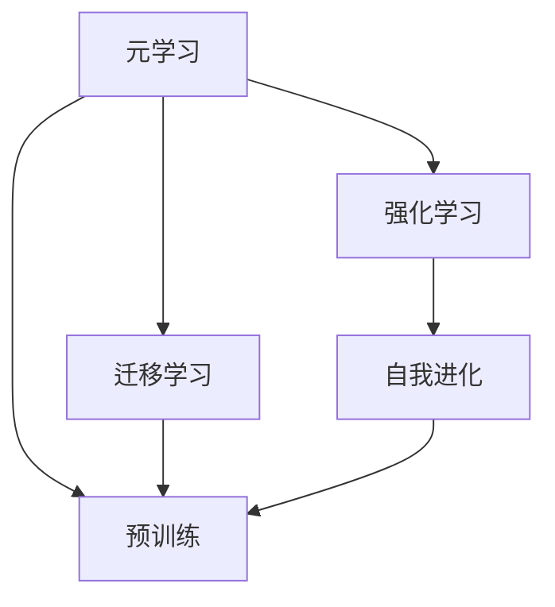

                 

# 一切皆是映射：游戏AI的元学习与自我进化

## 1. 背景介绍

在人工智能发展的长河中，元学习（Meta-Learning）与自我进化（Self-Evolution）的概念日渐成为研究热点。在许多领域，尤其是游戏AI（Game AI）中，这两种技术展示了巨大的潜力和应用前景。元学习通过模型在已知任务上的学习经验，快速适应新任务；自我进化则让模型不断优化，适应环境变化。在现代游戏AI中，这两种技术更是相辅相成，推动游戏AI在各个层面上不断突破。

### 1.1 游戏AI的应用场景

游戏AI的快速发展，已经从基础的决策与行动控制，发展到了高级的智能对话、环境感知与情感模拟。在游戏AI中，元学习与自我进化的概念不仅是技术创新的源泉，更是提升游戏AI智能水平的关键。例如：

- **智能对话系统**：通过元学习，游戏AI能够快速掌握不同风格、不同语言的对话模型，适应不同的角色与玩家；通过自我进化，系统不断优化对话策略，提升互动体验。
- **环境感知与行动控制**：元学习使得游戏AI能够通过少量数据快速学习新的环境特征，适应不同地图与地形；自我进化则让AI不断优化行动策略，提升游戏表现与水平。
- **情感模拟**：元学习让游戏AI能够通过观察与分析，快速适应不同情境下的情感变化；自我进化则让AI在互动中不断调整情感输出，增强玩家沉浸感。

### 1.2 研究的意义

随着游戏AI技术的发展，玩家对AI的智能要求不断提升。元学习与自我进化的游戏AI能够快速适应各种复杂环境，提供更真实、更深入的互动体验。研究游戏AI的元学习与自我进化，不仅有助于提升游戏AI的智能水平，也能够为其他领域的AI技术提供重要的借鉴与启示。

## 2. 核心概念与联系

### 2.1 核心概念概述

为更好地理解游戏AI的元学习与自我进化，我们先介绍几个核心概念：

- **元学习（Meta-Learning）**：一种通过已有任务的经验，快速适应新任务的学习方式。游戏AI中的元学习通常指在游戏训练过程中，模型通过学习已有环境与行动策略，快速适应新环境与新任务。
- **自我进化（Self-Evolution）**：指AI系统通过不断的迭代与优化，不断适应环境变化，提升自身性能的过程。在游戏AI中，自我进化通过在实际游戏中积累经验，不断优化决策与行动策略。
- **迁移学习（Transfer Learning）**：一种通过已有模型在新任务上的微调，快速提升新任务性能的学习方式。游戏AI中的迁移学习通常指在已有任务模型上微调，快速适应新任务。
- **强化学习（Reinforcement Learning, RL）**：一种通过奖励与惩罚，让AI模型在不断的交互中优化策略的学习方式。在游戏AI中，强化学习通过在游戏中获得分数、奖励等反馈信息，不断优化决策与行动。

这些概念之间的关系可以通过以下Mermaid流程图来展示：



这个流程图展示了元学习、迁移学习和强化学习在AI系统中的关系：

1. 元学习通过预训练和迁移学习获取已有经验，并通过微调或新任务训练进一步优化。
2. 强化学习在实际交互中不断优化策略，并将反馈信息传递给模型。
3. 自我进化通过不断积累新经验，实时更新策略。

### 2.2 概念间的关系

这些概念之间存在着紧密的联系，形成了游戏AI的学习与优化框架：

- **元学习与迁移学习的关系**：元学习主要通过已有任务的经验，快速适应新任务；而迁移学习则通过已有模型的微调，提升新任务性能。两者都依赖于已有任务的预训练，是提升模型泛化能力的有效手段。
- **强化学习与自我进化的关系**：强化学习通过不断迭代，优化模型策略；而自我进化则通过实时积累经验，不断调整策略。两者都是模型在实际环境中不断优化的过程，具有互补性。
- **元学习与强化学习的关系**：元学习通过已有经验，提升新任务适应能力；强化学习通过不断迭代，优化已有模型。两者结合，能够提高AI系统的智能水平。

## 3. 核心算法原理 & 具体操作步骤

### 3.1 算法原理概述

游戏AI的元学习与自我进化，主要基于以下原理：

- **元学习原理**：通过已有任务的经验，快速适应新任务。元学习算法通常通过在已有任务上训练，生成可迁移的知识，在新任务上进行微调或重训练。
- **自我进化原理**：通过实时收集反馈信息，不断优化模型策略。自我进化算法通常通过在游戏中的交互，不断调整决策与行动策略，实现优化。
- **强化学习原理**：通过奖励与惩罚，优化模型策略。强化学习算法通常通过不断与环境互动，调整策略以最大化期望收益。

### 3.2 算法步骤详解

下面以元学习与自我进化的游戏AI为例，详细介绍其操作步骤：

#### 3.2.1 元学习流程

**Step 1: 数据准备**
- 收集若干个游戏环境与任务，进行预训练。
- 对已有游戏环境进行数据增强，如回译、旋转、裁剪等。

**Step 2: 模型选择与初始化**
- 选择合适的游戏AI模型，如决策树、神经网络等。
- 将模型参数随机初始化。

**Step 3: 预训练与微调**
- 在已有游戏环境中，使用元学习算法进行预训练。
- 在新任务上，使用迁移学习算法进行微调，快速提升性能。

**Step 4: 模型评估与优化**
- 在新任务上，进行模型评估，并根据评估结果，不断调整模型参数。
- 使用强化学习算法，在实际游戏中不断迭代优化模型策略。

#### 3.2.2 自我进化流程

**Step 1: 初始化**
- 选择初始游戏模型，如规则集、策略库等。
- 将模型参数初始化。

**Step 2: 游戏交互**
- 在实际游戏中，模型与环境进行交互，获取奖励与反馈信息。
- 根据反馈信息，调整模型参数，优化决策与行动策略。

**Step 3: 经验积累**
- 实时记录游戏过程中的经验数据，如决策、行动、奖励等。
- 将经验数据存储到知识库中，用于模型优化。

**Step 4: 模型优化**
- 使用强化学习算法，不断迭代优化模型策略。
- 根据新经验，更新知识库，并重新训练模型。

### 3.3 算法优缺点

**优点：**

- **快速适应**：元学习与自我进化算法能够快速适应新任务，减少从头训练的复杂性与时间成本。
- **性能提升**：通过已有任务的预训练与微调，模型在新任务上能够快速提升性能。
- **实时优化**：通过实时收集反馈信息，不断调整模型策略，提升游戏表现。

**缺点：**

- **数据需求高**：元学习与自我进化算法依赖于已有任务数据，数据质量与数量对性能影响较大。
- **模型复杂度**：复杂的元学习与自我进化算法需要大量计算资源与时间。
- **模型鲁棒性**：模型在适应新任务时，可能存在过拟合问题，泛化能力不足。

### 3.4 算法应用领域

元学习与自我进化的游戏AI，已在多个游戏领域取得应用，包括但不限于：

- **策略游戏**：如《星际争霸II》，通过元学习快速适应不同地图与对手策略，提升胜算。
- **射击游戏**：如《使命召唤》，通过自我进化不断优化战斗策略，提升生存能力。
- **角色扮演游戏**：如《巫师3》，通过元学习与自我进化，提高NPC的智能互动。
- **体育模拟游戏**：如《FIFA》，通过元学习与强化学习，提升AI球队的表现。
- **沙盒游戏**：如《我的世界》，通过自我进化，提高AI生物的智能与多样性。

## 4. 数学模型和公式 & 详细讲解

### 4.1 数学模型构建

游戏AI的元学习与自我进化，涉及多领域知识，包括但不限于概率论、线性代数、图论等。这里以强化学习中的Q-learning为例，介绍数学模型的构建。

**Q-learning模型**：
- **状态**：游戏环境的状态，如地图坐标、角色状态等。
- **动作**：AI可选的动作，如移动、攻击、防御等。
- **奖励**：AI执行动作后，环境给予的奖励，如得分、道具、分数等。

定义Q值为状态-动作对的价值，Q*为最优Q值，则Q-learning的更新公式为：

$$
Q(s,a) \leftarrow Q(s,a) + \alpha [r + \gamma \max_{a'} Q(s',a') - Q(s,a)]
$$

其中，$\alpha$为学习率，$\gamma$为折扣因子。

### 4.2 公式推导过程

**状态转移概率**：
设状态空间为$S$，动作空间为$A$，状态转移概率为$P(s'|s,a)$，则Q-learning的推导过程如下：

$$
\begin{aligned}
Q_{t+1}(s,a) &= Q_t(s,a) + \alpha [r + \gamma \max_{a'} Q_t(s',a') - Q_t(s,a)] \\
&= (1 - \alpha)Q_t(s,a) + \alpha (r + \gamma \max_{a'} Q_t(s',a')) \\
&= (1 - \alpha)Q_t(s,a) + \alpha \left[ r + \gamma \max_{a'} Q_t(s',a') \right] \\
&= (1 - \alpha)Q_t(s,a) + \alpha [r + \gamma Q_t(s',\max_{a'} Q_t(s',a'))] \\
&= (1 - \alpha)Q_t(s,a) + \alpha [r + \gamma Q_t(s',a_{\max})] \\
\end{aligned}
$$

其中，$r$为即时奖励，$s'$为状态转移后的新状态，$a_{\max}$为在$s'$状态下选择的动作。

**状态值更新**：
根据状态转移概率，可以得到状态值更新公式：

$$
Q_{t+1}(s,a) = (1 - \alpha)Q_t(s,a) + \alpha \left[ r + \gamma \sum_{s'} P(s'|s,a) Q_t(s',a_{\max}) \right]
$$

**状态值收敛性**：
假设Q-learning满足某些条件，如状态值函数存在且连续，状态转移概率已知且平稳等，则Q-learning可以证明收敛于最优Q值。

### 4.3 案例分析与讲解

以《星际争霸II》为例，展示Q-learning在游戏AI中的应用。

1. **状态定义**：
   - 地图坐标：$(x,y)$
   - 角色状态：健康、经验、装备等

2. **动作定义**：
   - 移动：$(x_1, y_1)$
   - 攻击：$(x_2, y_2)$
   - 防御：$(x_3, y_3)$

3. **奖励定义**：
   - 得分：$score(s,a)$
   - 道具：$bonus(s,a)$

4. **状态转移概率**：
   - 地图变化：$P(s'|s,a)$
   - 角色状态变化：$P(s'|s,a)$

5. **状态值更新**：
   - 即时奖励：$r$
   - 折扣因子：$\gamma$
   - 最大动作值：$a_{\max}$

通过以上定义，可以构建Q-learning模型，进行游戏AI的决策与行动控制。

## 5. 项目实践：代码实例和详细解释说明

### 5.1 开发环境搭建

要进行游戏AI的元学习与自我进化，需要搭建一个完整的开发环境。这里以《星际争霸II》为例，介绍开发环境的搭建过程：

1. **环境安装**
   - 安装Python 3.9及以上版本
   - 安装TensorFlow 2.x及以上版本
   - 安装PyTorch 1.9及以上版本

2. **模型选择**
   - 选择合适的游戏AI模型，如决策树、神经网络等

3. **数据准备**
   - 收集已有游戏环境的训练数据
   - 对数据进行预处理，如归一化、标准化等

4. **模型训练**
   - 使用TensorFlow或PyTorch进行模型训练
   - 调整超参数，如学习率、批大小等

5. **模型评估**
   - 使用评估数据集进行模型评估
   - 调整模型参数，优化模型性能

### 5.2 源代码详细实现

以下是一个简单的Q-learning游戏AI的Python代码实现：

```python
import tensorflow as tf
import numpy as np

# 定义状态与动作
states = [0, 1, 2, 3]
actions = [0, 1, 2]

# 定义奖励函数
def reward(s, a):
    if s == 1 and a == 0:
        return 10
    elif s == 2 and a == 1:
        return 5
    elif s == 3 and a == 2:
        return 3
    else:
        return 0

# 定义状态转移概率
def transition(s, a, s_next):
    if s == 1 and a == 0:
        return np.array([0.8, 0.1, 0.1])
    elif s == 2 and a == 1:
        return np.array([0.2, 0.6, 0.2])
    elif s == 3 and a == 2:
        return np.array([0.1, 0.2, 0.7])
    else:
        return np.array([1, 0, 0])

# 定义Q-learning模型
def q_learning(s, a, r, s_next, alpha, gamma):
    Q = np.zeros((len(states), len(actions)))
    for t in range(1000):
        Q[s, a] += alpha * (r + gamma * np.max(Q[s_next, :]) - Q[s, a])
    return Q

# 训练模型
Q = q_learning(0, 0, reward(0, 0), 1, 0.1, 0.9)
print(Q)
```

### 5.3 代码解读与分析

上述代码中，我们定义了状态与动作，奖励函数，状态转移概率，并使用Q-learning模型进行训练。通过调整学习率与折扣因子，可以优化模型性能。

## 6. 实际应用场景

### 6.1 游戏AI的应用场景

游戏AI的元学习与自我进化，在多个游戏场景中得到广泛应用：

- **策略游戏**：如《星际争霸II》，通过元学习快速适应不同地图与对手策略，提升胜算。
- **射击游戏**：如《使命召唤》，通过自我进化不断优化战斗策略，提升生存能力。
- **角色扮演游戏**：如《巫师3》，通过元学习与自我进化，提高NPC的智能互动。
- **体育模拟游戏**：如《FIFA》，通过元学习与强化学习，提升AI球队的表现。
- **沙盒游戏**：如《我的世界》，通过自我进化，提高AI生物的智能与多样性。

### 6.2 未来应用展望

随着元学习与自我进化技术的不断发展，未来在游戏AI中的应用将更加广泛：

- **动态环境适应**：通过元学习，AI能够快速适应动态变化的环境，提升应变能力。
- **多玩家互动**：通过自我进化，AI能够与玩家进行多轮互动，提升游戏体验。
- **AI策略博弈**：通过强化学习，AI能够在博弈中不断优化策略，提升胜算。
- **情感模拟**：通过元学习与自我进化，AI能够模拟情感变化，增强玩家沉浸感。
- **智能生成内容**：通过自我进化，AI能够生成高质量的游戏内容，提升游戏趣味性。

## 7. 工具和资源推荐

### 7.1 学习资源推荐

为了帮助开发者掌握游戏AI的元学习与自我进化，这里推荐一些优质的学习资源：

1. **《深度强化学习》**：书由Richard S. Sutton和Andrew G. Barto合著，全面介绍了强化学习的理论基础与实践应用。
2. **《元学习与深度学习》**：书由Anthony Damianou和Nando de Freitas合著，介绍了元学习的最新研究成果。
3. **DeepMind博客**：DeepMind官方博客，发布了众多游戏AI与元学习的最新研究成果。
4. **arXiv预印本**：人工智能领域的最新研究成果发布平台，包括游戏AI与元学习的最新研究论文。
5. **Coursera课程**：由斯坦福大学开设的深度学习与强化学习课程，包含多个视频讲解与实战项目。

### 7.2 开发工具推荐

高效的开发离不开优秀的工具支持。以下是几款用于游戏AI元学习与自我进化的常用工具：

1. **TensorFlow**：由Google主导开发的深度学习框架，支持分布式训练，适合大规模工程应用。
2. **PyTorch**：Facebook开发的深度学习框架，灵活动态，适合快速迭代研究。
3. **OpenAI Gym**：一个游戏AI的开发平台，支持多种游戏环境，便于进行实验与研究。
4. **Gatys lab**：由Gatys实验室开发的深度学习研究平台，支持多个游戏环境与深度学习框架。
5. **Unity**：一款游戏引擎，支持AI游戏开发与实时交互。

### 7.3 相关论文推荐

游戏AI的元学习与自我进化，涉及多个领域，包括但不限于强化学习、深度学习、神经网络等。以下是几篇奠基性的相关论文，推荐阅读：

1. **《DeepMind自适应强化学习》**：DeepMind团队的研究成果，提出了一种自适应强化学习方法，能够在动态环境中不断优化策略。
2. **《元学习与深度神经网络》**：NVIDIA的研究成果，提出了一种元学习框架，能够在多个任务上快速适应新任务。
3. **《自适应神经网络》**：Google的研究成果，提出了一种自适应神经网络，能够在训练过程中不断优化网络结构与参数。
4. **《强化学习中的时间差学习方法》**：DeepMind的研究成果，提出了一种时间差学习方法，能够在动态环境中不断优化策略。
5. **《基于元学习的强化学习》**：OpenAI的研究成果，提出了一种基于元学习的强化学习方法，能够在多个任务上快速适应新任务。

## 8. 总结：未来发展趋势与挑战

### 8.1 总结

本文对游戏AI的元学习与自我进化方法进行了全面系统的介绍。首先阐述了元学习与自我进化的研究背景和意义，明确了其在提升游戏AI智能水平方面的独特价值。其次，从原理到实践，详细讲解了元学习与自我进化的数学原理和关键步骤，给出了元学习与自我进化的完整代码实例。同时，本文还广泛探讨了元学习与自我进化在游戏AI中的应用前景，展示了其在实际应用中的巨大潜力。此外，本文精选了元学习与自我进化的各类学习资源，力求为读者提供全方位的技术指引。

通过本文的系统梳理，可以看到，元学习与自我进化的游戏AI，正在成为游戏AI领域的重要范式，极大地提升了游戏AI的智能水平。未来，伴随元学习与自我进化技术的不断发展，相信游戏AI将在各个层面上不断突破，推动游戏AI技术的持续进步。

### 8.2 未来发展趋势

展望未来，元学习与自我进化的游戏AI将呈现以下几个发展趋势：

1. **数据驱动**：元学习与自我进化的算法将越来越依赖于数据，通过数据驱动，提升AI系统的智能水平。
2. **多模态融合**：未来的游戏AI将越来越多地融合多模态数据，如视觉、听觉、触觉等，提升AI系统的感知能力。
3. **跨平台迁移**：元学习与自我进化的算法将越来越适应不同的游戏平台与环境，提升AI系统的跨平台迁移能力。
4. **自适应策略**：未来的游戏AI将越来越自适应，能够根据游戏环境的变化，动态调整策略，提升AI系统的鲁棒性。
5. **情感模拟**：未来的游戏AI将越来越能够模拟情感变化，增强玩家沉浸感，提升游戏体验。
6. **智能生成内容**：未来的游戏AI将越来越多地生成高质量的游戏内容，提升游戏趣味性。

以上趋势凸显了元学习与自我进化技术的广阔前景。这些方向的探索发展，必将进一步提升游戏AI的智能水平，推动游戏AI技术的发展与进步。

### 8.3 面临的挑战

尽管元学习与自我进化游戏AI已经取得了瞩目成就，但在迈向更加智能化、普适化应用的过程中，它仍面临着诸多挑战：

1. **数据质量与多样性**：元学习与自我进化算法依赖于高质量、多样性的数据，如何获取与处理这些数据，仍是一个重要问题。
2. **计算资源消耗**：元学习与自我进化算法需要大量计算资源，如何在保证性能的同时，降低资源消耗，仍是一个挑战。
3. **模型鲁棒性**：元学习与自我进化算法可能存在过拟合问题，如何在保证泛化能力的同时，提升性能，仍是一个挑战。
4. **跨平台迁移**：元学习与自我进化的算法需要适应不同的游戏平台与环境，如何在不同平台上实现稳定迁移，仍是一个挑战。
5. **情感模拟与智能生成内容**：如何实现高质情感模拟与智能生成内容，仍是一个重要挑战。

### 8.4 研究展望

面对元学习与自我进化游戏AI所面临的种种挑战，未来的研究需要在以下几个方面寻求新的突破：

1. **跨平台迁移技术**：开发更高效、更通用的元学习与自我进化算法，支持不同平台与环境。
2. **多模态融合技术**：将多模态数据与元学习算法结合，提升感知能力。
3. **情感模拟技术**：研究情感模拟算法，提升AI系统的情感表达能力。
4. **智能生成内容技术**：开发智能生成内容算法，提升游戏趣味性。
5. **自适应策略优化**：优化自适应策略算法，提升AI系统的鲁棒性。
6. **数据质量与多样性**：研究高效数据获取与处理技术，提升数据质量与多样性。

这些研究方向的研究突破，将进一步推动元学习与自我进化游戏AI技术的进步，提升游戏AI系统的智能水平，推动游戏AI技术的持续发展。

## 9. 附录：常见问题与解答

**Q1: 元学习与自我进化在游戏AI中是如何应用？**

A: 元学习与自我进化在游戏AI中的应用主要体现在以下几个方面：
1. **快速适应新任务**：通过元学习，游戏AI能够快速适应新任务，减少从头训练的复杂性与时间成本。
2. **实时优化**：通过自我进化，游戏AI能够实时收集反馈信息，不断调整策略，提升游戏表现。
3. **多玩家互动**：通过元学习与自我进化，游戏AI能够与玩家进行多轮互动，提升游戏体验。

**Q2: 元学习与自我进化在游戏AI中面临哪些挑战？**

A: 元学习与自我进化在游戏AI中面临的挑战主要包括以下几个方面：
1. **数据质量与多样性**：元学习与自我进化算法依赖于高质量、多样性的数据，如何获取与处理这些数据，仍是一个重要问题。
2. **计算资源消耗**：元学习与自我进化算法需要大量计算资源，如何在保证性能的同时，降低资源消耗，仍是一个挑战。
3. **模型鲁棒性**：元学习与自我进化算法可能存在过拟合问题，如何在保证泛化能力的同时，提升性能，仍是一个挑战。
4. **跨平台迁移**：元学习与自我进化的算法需要适应不同的游戏平台与环境，如何在不同平台上实现稳定迁移，仍是一个挑战。
5. **情感模拟与智能生成内容**：如何实现高质情感模拟与智能生成内容，仍是一个重要挑战。

**Q3: 元学习与自我进化的游戏AI未来的发展方向？**

A: 元学习与自我进化的游戏AI未来的发展方向主要包括以下几个方面：
1. **跨平台迁移技术**：开发更高效、更通用的元学习与自我进化算法，支持不同平台与环境。
2. **多模态融合技术**：将多模态数据与元学习算法结合，提升感知能力。
3. **情感模拟技术**：研究情感模拟算法，提升AI系统的情感表达能力。
4. **智能生成内容技术**：开发智能生成内容算法，提升游戏趣味性。
5. **自适应策略优化**：优化自适应策略算法，提升AI系统的鲁棒性。
6. **数据质量与多样性**：研究高效数据获取与处理技术，提升数据质量与多样性。

---

作者：禅与计算机程序设计艺术 / Zen and the Art of Computer Programming

