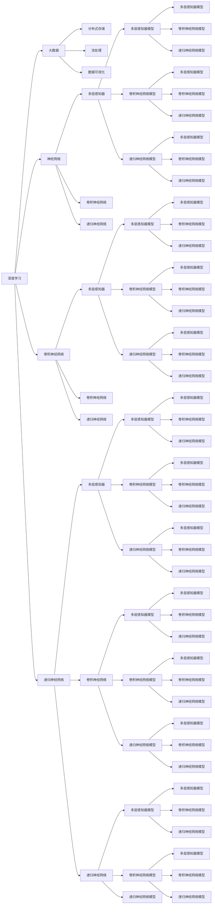
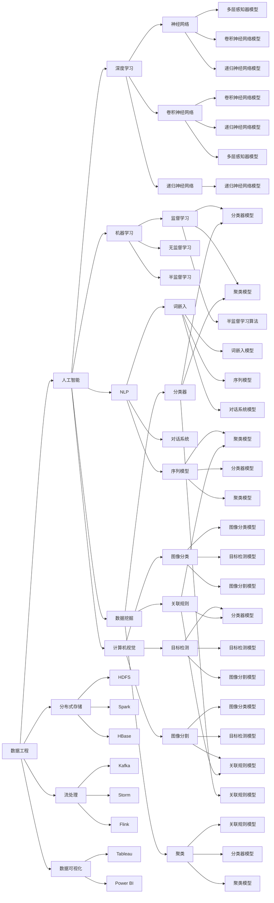

                 

# 人工智能与大数据的未来发展和应用

> 关键词：人工智能,大数据,深度学习,机器学习,自然语言处理,计算机视觉,数据挖掘,自动驾驶,工业智能

## 1. 背景介绍

### 1.1 问题由来
在过去几十年中，人工智能和大数据技术迅猛发展，极大地改变了我们的生活和工作方式。从早期的基于规则的专家系统，到后来的人工神经网络和深度学习，再到目前大数据、云计算和物联网的兴起，人工智能技术正逐步从学术界走向产业界，成为驱动社会进步的重要力量。

人工智能和大数据技术的结合，不仅极大地提高了数据处理的效率和精度，还带来了许多新的应用场景和商业模式。本文将从人工智能和大数据的基本概念入手，深入探讨其在各领域的未来发展和应用。

### 1.2 问题核心关键点
人工智能和大数据技术的主要关键点包括：
- 数据驱动：人工智能依赖大量高质量的数据进行训练和优化，从而提高其预测和决策能力。
- 模型演化：从传统的统计学习到深度学习，再到强化学习，人工智能模型在不断进步。
- 数据工程：大数据技术提供了高效的数据存储、处理和分析工具，为人工智能的训练和应用提供了坚实基础。
- 算法创新：基于大数据的算法创新，如推荐系统、自然语言处理、计算机视觉等，带来了广泛的应用。
- 应用落地：人工智能技术正在逐步应用到医疗、金融、交通、制造等多个行业，推动数字化转型。

## 2. 核心概念与联系

### 2.1 核心概念概述

为更好地理解人工智能与大数据的未来发展和应用，本节将介绍几个核心概念：

- **人工智能(AI)**：通过模拟人类智能过程，使计算机能够自主学习、推理、决策的技术。AI可以分为弱人工智能和强人工智能。
- **大数据(Big Data)**：超大规模、高速增长、多样化和真实性的数据集合，需要新型处理模式才能有效利用。
- **深度学习(Deep Learning)**：一种基于人工神经网络的机器学习方法，具有强大的特征提取能力和泛化能力。
- **机器学习(Machine Learning)**：使计算机能够通过数据自主学习和优化模型，提高预测和决策能力。
- **自然语言处理(Natural Language Processing, NLP)**：使计算机能够理解和处理人类语言的技术，包括语音识别、文本分类、机器翻译等。
- **计算机视觉(Computer Vision)**：使计算机能够理解和分析图像和视频的技术，包括目标检测、图像分割、人脸识别等。
- **数据挖掘(Data Mining)**：从大量数据中自动发现模式和知识的过程，常用于商业智能、市场营销等领域。
- **自动驾驶(Autonomous Driving)**：通过感知、决策和控制技术，使车辆能够自主驾驶。
- **工业智能(Industrial Intelligence)**：结合人工智能和物联网技术，优化生产过程和提高产品质量。

这些核心概念之间的逻辑关系可以通过以下Mermaid流程图来展示：

```mermaid
graph TB
    A[人工智能] --> B[大数据]
    A --> C[深度学习]
    A --> D[机器学习]
    A --> E[NLP]
    A --> F[计算机视觉]
    A --> G[数据挖掘]
    A --> H[自动驾驶]
    A --> I[工业智能]
    B --> J[分布式存储]
    B --> K[流处理]
    B --> L[数据可视化]
    C --> M[神经网络]
    C --> N[卷积神经网络]
    C --> O[递归神经网络]
    D --> P[监督学习]
    D --> Q[无监督学习]
    D --> R[半监督学习]
    E --> S[词嵌入]
    E --> T[序列模型]
    E --> U[对话系统]
    F --> V[图像分类]
    F --> W[目标检测]
    F --> X[图像分割]
    G --> Y[关联规则]
    G --> Z[分类器]
    G --> AA[聚类]
    H --> AB[感知]
    H --> AC[决策]
    H --> AD[控制]
    I --> AE[优化]
    I --> AF[模拟]
    I --> AG[预测]
    M --> AM[多层感知器]
    N --> AN[卷积神经网络]
    O --> AO[递归神经网络]
    P --> AP[SVM]
    Q --> AQ[随机森林]
    R --> AR[半监督学习算法]
    S --> AS[Word2Vec]
    T --> AT[循环神经网络]
    U --> AU[聊天机器人]
    V --> AV[深度学习模型]
    W --> AW[目标检测模型]
    X --> AX[图像分割模型]
    Y --> AY[Apriori算法]
    Z --> AZ[K-Means算法]
    AA --> BA[层次聚类算法]
    AB --> BB[感知算法]
    AC --> BC[决策算法]
    AD --> BD[控制算法]
    AE --> BE[优化算法]
    AF --> BF[模拟算法]
    AG --> BG[预测算法]
    AM --> BM[多层感知器模型]
    AN --> BN[卷积神经网络模型]
    AO --> BO[递归神经网络模型]
    AP --> BP[SVM模型]
    AQ --> BQ[随机森林模型]
    AR --> BR[半监督学习算法]
    AS --> BS[Word2Vec模型]
    AT --> BT[循环神经网络模型]
    AU --> BU[聊天机器人模型]
    AV --> BV[深度学习模型]
    AW --> BW[目标检测模型]
    AX --> BX[图像分割模型]
    AY --> BY[Apriori算法]
    AZ --> BZ[K-Means算法]
    AA --> BA[层次聚类算法]
    AB --> BB[感知算法]
    AC --> BC[决策算法]
    AD --> BD[控制算法]
    AE --> BE[优化算法]
    AF --> BF[模拟算法]
    AG --> BG[预测算法]
```



这个流程图展示了人工智能和大数据技术之间的密切联系和相互作用。人工智能依赖大数据进行训练和优化，而大数据技术为人工智能提供了高效的数据处理和分析工具。

### 2.2 概念间的关系

这些核心概念之间存在着紧密的联系，形成了人工智能与大数据技术的完整生态系统。下面我们通过几个Mermaid流程图来展示这些概念之间的关系。

#### 2.2.1 人工智能与大数据的关系

```mermaid
graph LR
    A[人工智能] --> B[大数据]
    A --> C[深度学习]
    A --> D[机器学习]
    B --> E[分布式存储]
    B --> F[流处理]
    B --> G[数据可视化]
    C --> H[神经网络]
    C --> I[卷积神经网络]
    C --> J[递归神经网络]
    D --> K[监督学习]
    D --> L[无监督学习]
    D --> M[半监督学习]
    H --> N[多层感知器]
    H --> O[卷积神经网络]
    H --> P[递归神经网络]
    K --> Q[SVM]
    K --> R[随机森林]
    K --> S[半监督学习算法]
    N --> T[多层感知器模型]
    N --> U[卷积神经网络模型]
    N --> V[递归神经网络模型]
    Q --> W[SVM模型]
    Q --> X[随机森林模型]
    Q --> Y[半监督学习算法]
    T --> Z[多层感知器模型]
    T --> $[A]$[卷积神经网络模型]
    T --> [B]$[递归神经网络模型]
    Q --> Q[SVM模型]
    Q --> R[随机森林模型]
    Q --> S[半监督学习算法]
    Z --> T[多层感知器模型]
    Z --> U[卷积神经网络模型]
    Z --> V[递归神经网络模型]
    W --> T[SVM模型]
    W --> X[随机森林模型]
    W --> Y[半监督学习算法]
    $[A]$ --> N[多层感知器模型]
    $[A]$ --> U[卷积神经网络模型]
    $[A]$ --> V[递归神经网络模型]
    B --> Q[SVM模型]
    B --> R[随机森林模型]
    B --> S[半监督学习算法]
    Z --> T[多层感知器模型]
    Z --> U[卷积神经网络模型]
    Z --> V[递归神经网络模型]
    W --> T[SVM模型]
    W --> X[随机森林模型]
    W --> Y[半监督学习算法]
    X --> T[SVM模型]
    X --> Q[随机森林模型]
    X --> R[半监督学习算法]
    Y --> T[SVM模型]
    Y --> Q[随机森林模型]
    Y --> R[半监督学习算法]
```

这个流程图展示了人工智能与大数据技术之间的关系。人工智能依赖大数据进行训练和优化，而大数据技术为人工智能提供了高效的数据处理和分析工具。

#### 2.2.2 深度学习与大数据的关系



这个流程图展示了深度学习与大数据技术之间的关系。深度学习依赖大数据进行训练，而大数据技术为深度学习提供了高效的数据处理和分析工具。

#### 2.2.3 数据工程与人工智能的关系



这个流程图展示了数据工程与人工智能技术之间的关系。数据工程为人工智能提供了高效的数据处理和分析工具，使得人工智能技术能够更好地利用大数据进行训练和优化。

### 2.3 核心概念的整体架构

最后，我们用一个综合的流程图来展示这些核心概念在大数据与人工智能技术中的整体架构：

```mermaid
graph TB
    A[人工智能] --> B[大数据]
    A --> C[深度学习]
    A --> D[机器学习]
    A --> E[NLP]
    A --> F[计算机视觉]
    A --> G[数据挖掘]
    A --> H[自动驾驶]
    A --> I[工业智能]
    B --> J[分布式存储]
    B --> K[流处理]
    B --> L[数据可视化]
    C --> M[神经网络]
    C --> N[卷积神经网络]
    C --> O[递归神经网络]
    D --> P[监督学习]
    D --> Q[无监督学习]
    D --> R[半监督学习]
    E --> S[词嵌入]
    E --> T[序列模型]
    E --> U[对话系统]
    F --> V[图像分类]
    F --> W[目标检测]
    F --> X[图像分割]
    G --> Y[关联规则]
    G --> Z[分类器]
    G --> AA[聚类]
    H --> AB[感知]
    H --> AC[决策]
    H --> AD[控制]
    I --> AE[优化]
    I --> AF[模拟]
    I --> AG[预测]
    M --> AM[多层感知器]
    M --> N[卷积神经网络]
    M --> O[递归神经网络]
    P --> AP[SVM]
    P --> AQ[随机森林]
    P --> AR[半监督学习算法]
    S --> AS[Word2Vec]
    S --> AT[序列模型]
    S --> AU[对话系统模型]
    T --> AV[深度学习模型]
    T --> AW[目标检测模型]
    T --> AX[图像分割模型]
    U --> AU[聊天机器人模型]
    V --> AV[深度学习模型]
    W --> AW[目标检测模型]
    X --> AX[图像分割模型]
    Y --> AY[Apriori算法]
    Z --> AZ[K-Means算法]
    AA --> BA[层次聚类算法]
    AB --> BB[感知算法]
    AC --> BC[决策算法]
    AD --> BD[控制算法]
    AE --> BE[优化算法]
    AF --> BF[模拟算法]
    AG --> BG[预测算法]
    AM --> BM[多层感知器模型]
    AN --> BN[卷积神经网络模型]
    AO --> BO[递归神经网络模型]
    AP --> BP[SVM模型]
    AQ --> BQ[随机森林模型]
    AR --> BR[半监督学习算法]
    AS --> BS[Word2Vec模型]
    AT --> BT[循环神经网络模型]
    AU --> BU[聊天机器人模型]
    AV --> BV[深度学习模型]
    AW --> BW[目标检测模型]
    AX --> BX[图像分割模型]
    AY --> BY[Apriori算法]
    AZ --> BZ[K-Means算法]
    AA --> BA[层次聚类算法]
    AB --> BB[感知算法]
    AC --> BC[决策算法]
    AD --> BD[控制算法]
    AE --> BE[优化算法]
    AF --> BF[模拟算法]
    AG --> BG[预测算法]
```



这个综合流程图展示了人工智能与大数据技术之间的紧密联系和相互作用，并为未来的研究和发展提供了清晰的方向。

## 3. 核心算法原理 & 具体操作步骤

### 3.1 算法原理概述

人工智能与大数据技术的结合，主要是通过深度学习和数据工程实现的。深度学习依赖大量的数据进行训练，从而提取高层次的特征和模式。数据工程则提供了高效的数据存储、处理和分析工具，为深度学习的训练和应用提供了坚实的基础。

具体而言，人工智能与大数据技术的结合主要包括以下几个方面：

1. **数据预处理**：对原始数据进行清洗、归一化、特征工程等预处理操作，提取有价值的数据特征。
2. **模型训练**：使用深度学习模型（如神经网络、卷积神经网络、递归神经网络等）对预处理后的数据进行训练，优化模型参数。
3. **模型评估**：使用评估指标（如准确率、召回率、F1分数等）对训练后的模型进行评估，确保模型性能符合预期。
4. **模型应用**：将训练好的模型应用于实际问题中，进行预测、分类、聚类、推荐等任务。

### 3.2 算法步骤详解

基于人工智能与大数据技术的结合，下面详细介绍深度学习的训练和应用步骤。

**Step 1: 数据预处理**

- **数据清洗**：去除噪声、异常值、缺失值等，确保数据质量。
- **数据归一化**：对数据进行标准化处理，避免不同特征之间的数值差异过大。
- **特征工程**：根据具体任务需求，对数据进行特征提取和构建，提高模型的表达能力。

**Step 2: 模型训练**

- **选择合适的模型架构**：根据任务特点选择适合的深度学习模型，如多层感知器、卷积神经网络、递归神经网络等。
- **设置训练参数**：包括学习率、批大小、迭代轮数等，调整超参数以获得最佳性能。
- **训练模型**：使用训练数据集对模型进行训练，优化模型参数，使其能够更好地拟合数据。

**Step 3: 模型评估**

- **选择评估指标**：根据任务特点选择适当的评估指标，如准确率、召回率、F1分数等。
- **评估模型**：使用验证数据集对模型进行评估，检测模型泛化能力。
- **调整模型**：根据评估结果调整模型参数，进行多次迭代训练，直至模型性能达到最优。

**Step 4: 模型应用**

- **模型部署**：将训练好的模型部署到实际应用环境中，进行预测、分类、聚类、推荐等任务。
- **数据采集**：实时采集应用数据，输入到模型中进行处理。
- **模型更新**：定期更新模型，确保模型能够适应新的数据变化。

### 3.3 算法优缺点

人工智能与大数据技术的结合具有以下优点：

1. **高效性**：深度学习模型能够自动提取高层次特征，显著提高数据处理效率。
2. **泛化能力**：深度学习模型能够学习到复杂的数据模式，具有较强的泛化能力。
3. **可解释性**：通过特征工程和可视化工具，可以更好地理解和解释模型的决策过程。
4. **实时性**：数据工程技术可以支持实时数据处理和分析，满足实时应用需求。

同时，也存在一些缺点：

1. **计算资源需求高**：深度学习模型需要大量的计算资源进行训练和优化，成本较高。
2. **数据质量要求高**：模型性能依赖于数据质量，低质量的数据可能影响模型效果。
3. **模型复杂度高**：深度学习模型结构复杂，难以解释和调试。
4. **可解释性差**：深度学习模型通常被视为"黑盒"，难以理解和解释其内部工作机制。

### 3.4 算法应用领域

人工智能与大数据技术在多个领域得到了广泛应用，包括但不限于：

- **自然语言处理**：机器翻译、语音识别、文本分类、情感分析等。
- **计算机视觉**：图像识别、目标检测、图像分割、人脸识别等。
- **医疗健康**：疾病诊断、药物研发、健康监测等。
- **金融科技**：信用评分、风险评估、智能投顾等。
- **智能制造**：质量控制、设备维护、供应链优化等。
- **智慧城市**：智能交通、安防监控、环境监测等。

## 4. 数学模型和公式 & 详细讲解 & 举例说明

### 4.1 数学模型构建

本节将使用数学语言对深度学习模型的训练过程进行更加严格的刻画。

假设输入数据为 $X=\{x_1, x_2, ..., x_m\}$，输出标签为 $Y=\{y_1, y_2, ..., y_m\}$，其中 $x_i$ 是样本 $i$ 的特征向量，$y_i$ 是样本 $i$ 的标签。定义模型 $f_{\theta}$，其中 $\theta$ 为模型参数。

目标是最小化损失函数 $L(f_{\theta})$，即：

$$
\min_{\theta} \sum_{i=1}^m L(f_{\theta}(x_i), y_i)
$$

其中 $L(f_{\theta}(x_i), y_i)$ 为样本 $i$ 的损失函数。

常用的损失函数包括交叉熵损失、均方误差损失等。以交叉熵损失为例，定义如下：

$$
L(f_{\theta}(x_i), y_i) = -\log f_{\theta}(x_i, y_i)
$$

### 4.2 公式推导过程

以下我们以二分类任务为例，推导交叉熵损失函数及其梯度的计算公式。

假设模型 $f_{\theta}$ 在输入 $x$ 上的输出为 $\hat{y}=f_{\theta}(x) \in [0,1]$，表示样本属于正类的概率。真实标签 $y \in \{0,1\}$。则二分类交叉熵损失函数定义为：

$$
L(f_{\theta}(x),y) = -[y\log \hat{y} + (1-y)\log(1-\hat{y})]
$$

将其代入经验风险公式，得：

$$
L(\theta) = -\frac{1}{m} \sum_{i=1}^m [y_i\log f_{\theta}(x_i)+(1-y_i)\log(1-f_{\theta}(x_i))]
$$

根据链式法则，损失函数对参数 $\theta_k$ 的梯度为：

$$
\frac{\partial L(\theta)}{\partial \theta_k} = -\frac{1}{m} \sum_{i=1}^m [\frac{y_i}{f_{\theta}(x_i)}-\frac{1-y_i}{1-f_{\theta}(x_i)})] \frac{\partial f_{\theta}(x_i)}{\partial \theta_k}
$$

其中 $\frac{\partial f_{\theta}(x_i)}{\partial \theta_k}$ 可进一步递归展开，利用自动微分技术完成计算。

在得到损失函数的梯度后，即可带入参数更新公式，完成模型的迭代优化。重复上述过程直至收敛，最终得到适应下游任务的最优模型参数 $\theta^*$。

## 5. 项目实践：代码实例和详细解释说明

### 5.1 开发环境搭建

在进行深度学习项目开发前，我们需要准备好开发环境。以下是使用Python进行TensorFlow开发的环境配置流程：

1. 安装Anaconda：从官网下载并安装Anaconda，用于创建独立的Python环境。

2. 创建并激活虚拟环境：
```bash
conda create -n tf-env python=3.8 


