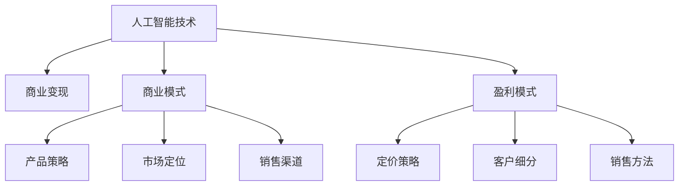

                 

# 人工智能创业：设计盈利模式

在当前科技快速发展的时代，人工智能(AI)技术已成为推动经济社会进步的重要驱动力。随着AI技术的不断成熟和落地应用，越来越多的企业看到了其巨大的商业价值和盈利潜力，纷纷投身于人工智能创业。然而，由于AI技术的复杂性和高门槛，使得很多创业公司在盈利模式设计上遇到了不小的挑战。本文将从AI创业公司的盈利模式设计出发，探讨如何结合AI技术优势，实现商业变现和长期可持续发展。

## 1. 背景介绍

### 1.1 人工智能的商业价值

人工智能作为一项前沿技术，已经被广泛应用于各个行业，如金融、医疗、制造、零售、教育等，展现出巨大的商业价值：

- **提高效率**：AI技术可以通过自动化、智能化、优化等手段，大幅提高生产效率和运营效率。例如，智能客服机器人可以替代人工客服，24/7不间断服务，极大提升了客户服务体验。
- **降低成本**：AI能够自动化处理大量繁琐、重复性的工作，减少了人工成本，同时提高了资源的利用率。例如，自动驾驶汽车降低了长途物流运输的成本。
- **创造新业务**：AI技术可以发现新的商业模式和业务机会，促进经济转型升级。例如，AI辅助的个性化推荐系统，为电商、广告等行业带来了巨大的市场潜力。
- **决策支持**：AI可以提供精准的数据分析和预测，帮助企业制定更加科学的决策，降低风险。例如，金融风控系统通过AI分析，能更早识别和预警风险，减少损失。

### 1.2 AI创业公司的盈利模式

AI技术的商业价值催生了大量AI创业公司，它们试图通过各种方式实现商业变现。常见的盈利模式包括：

- **产品/解决方案销售**：通过向客户销售AI产品或服务，如智能客服系统、推荐系统、数据分析平台等，获取收入。
- **订阅服务**：以月度、季度或年度为周期，向用户提供持续的AI服务，例如，SaaS（Software as a Service）模式。
- **广告收入**：基于AI技术优化广告投放，提高点击率和转化率，从而获得广告主的收入分成。
- **数据服务**：通过提供数据采集、清洗、标注等服务，获得第三方企业的合作和收入。
- **投资收益**：AI创业公司也可以通过AI技术投资其他企业，获得股权或现金回报。

不同公司的业务定位、技术实力、市场需求和商业模式不同，因此其盈利模式也有所差异。本文将重点探讨在AI创业公司中，如何设计和优化盈利模式，最大化商业价值。

## 2. 核心概念与联系

### 2.1 核心概念概述

为了更好地理解AI创业公司的盈利模式设计，我们需要明确几个核心概念：

- **人工智能技术**：以机器学习、深度学习等为代表的AI技术，能够处理大规模数据，发现数据中的模式和规律，支持决策分析、预测和自动化。
- **商业变现**：指将技术优势转化为商业价值，实现产品销售、服务收费、广告收入等。
- **商业模式**：企业盈利和价值创造的业务结构，包括产品策略、市场定位、销售渠道等。
- **盈利模式**：企业获取收入的渠道和方式，涉及定价策略、客户细分、销售方法等。
- **客户价值**：客户从产品或服务中获得的实际价值和感知价值，影响客户留存和满意度。

### 2.2 核心概念的联系

这些核心概念之间的联系可以通过以下Mermaid流程图来展示：



这个流程图展示了人工智能技术、商业模式、盈利模式、产品策略、市场定位、销售渠道、定价策略、客户细分、销售方法等概念之间的联系。人工智能技术是核心，商业模式、盈利模式等都是在技术基础上构建的。产品策略、市场定位、销售渠道等进一步细化了商业模式，定价策略、客户细分、销售方法等则决定了盈利模式。客户价值是所有这些环节最终目标，通过提高客户价值，企业才能实现长期的盈利和发展。

## 3. 核心算法原理 & 具体操作步骤

### 3.1 算法原理概述

AI创业公司的盈利模式设计，本质上是一个在技术、市场、客户需求之间寻找平衡的过程。这需要考虑以下关键因素：

- **技术能力**：评估公司的技术优势和研发能力，确定可开发和推广的产品或服务。
- **市场需求**：调研目标市场的需求和痛点，找到潜在客户。
- **客户价值**：分析客户从产品或服务中获得的实际和感知价值，确定定价策略和销售方法。
- **竞争态势**：了解竞争对手的市场策略和产品优势，找到差异化优势。
- **成本结构**：评估产品或服务的开发成本、运营成本、维护成本等，制定合理的定价策略。

### 3.2 算法步骤详解

以下是AI创业公司盈利模式设计的详细步骤：

**Step 1: 市场调研与需求分析**

1. **确定目标市场**：通过市场调研，确定潜在客户群体，了解客户的需求和痛点。
2. **需求分析**：分析客户的痛点，找到现有解决方案的不足，明确AI技术可以提供的新价值。

**Step 2: 技术评估与产品设计**

1. **技术评估**：评估公司的技术能力，确定可实现的技术方案。
2. **产品设计**：根据客户需求和技术能力，设计产品功能和规格，确保满足客户需求。

**Step 3: 商业模式设计**

1. **选择商业模式**：根据目标市场和客户需求，选择适合的商业模式，如SaaS、B2B、B2C等。
2. **制定业务策略**：确定产品策略、市场定位、销售渠道等关键要素。

**Step 4: 盈利模式设计**

1. **定价策略**：根据产品价值和成本结构，制定合理的定价策略，如免费试用、阶梯定价等。
2. **客户细分**：根据客户需求和行为，进行客户细分，制定差异化营销策略。
3. **销售方法**：选择适合的销售方法，如直销、代理商、在线销售等，提高销售效率。

**Step 5: 客户价值提升**

1. **客户反馈**：收集客户反馈，持续优化产品和服务。
2. **客户维护**：通过客户关系管理系统，维护和提升客户满意度。
3. **交叉销售**：基于客户需求，推广相关产品和服务，提高客户价值。

**Step 6: 持续优化**

1. **市场监测**：持续监测市场变化和客户需求，及时调整产品和营销策略。
2. **技术迭代**：持续技术研发和产品优化，保持技术领先优势。
3. **收益分析**：定期分析盈利数据，调整策略，实现持续增长。

### 3.3 算法优缺点

**优点：**

1. **高价值**：AI技术具有强大的数据分析和决策支持能力，能够带来高附加值。
2. **差异化**：通过技术优势，可以实现产品差异化，占领市场竞争优势。
3. **可扩展性**：AI技术具有高度可扩展性，可以逐步拓展市场和业务领域。
4. **持续优化**：AI技术的迭代更新能力强，可以通过持续优化提升产品价值和盈利能力。

**缺点：**

1. **高门槛**：AI技术研发和应用需要高昂的成本和人才投入，创业门槛较高。
2. **数据依赖**：AI技术依赖大量高质量数据，数据获取和标注成本较高。
3. **竞争激烈**：AI市场竞争激烈，如何保持技术优势和市场份额是一个挑战。
4. **用户信任**：AI产品需要用户信任和接受，初期推广难度大。

### 3.4 算法应用领域

AI创业公司的盈利模式设计可以应用于各种领域，如：

- **智能制造**：通过AI优化生产流程，提高生产效率和产品质量，实现成本节约和利润增加。
- **智能交通**：利用AI技术优化交通管理，提升交通效率和安全性，创造新的商业机会。
- **智能健康**：通过AI技术提供个性化健康管理，提高医疗服务质量和效率，创造新的医疗价值。
- **智能营销**：利用AI技术优化广告投放和用户行为分析，提升营销效果和ROI，创造新的商业机会。

这些领域都是AI技术应用前景广阔的行业，通过盈利模式设计，可以最大化AI技术的商业价值，实现可持续发展。

## 4. 数学模型和公式 & 详细讲解 & 举例说明

### 4.1 数学模型构建

假设AI创业公司提供一项AI服务，其定价为 $P$，成本为 $C$，市场需求为 $D$，客户获取成本为 $T$，客户流失率为 $\lambda$。设客户的终身价值为 $L$，则公司的年收入 $R$ 可以表示为：

$$
R = \int_{0}^{\infty} P \cdot D \cdot (1 - \lambda) \cdot e^{-T \cdot t} \, dt
$$

其中，$P$ 为每次服务的价格，$D$ 为每次服务的市场需求，$T$ 为获取一个客户的成本，$\lambda$ 为客户的流失率，$t$ 为时间。

### 4.2 公式推导过程

为简化问题，我们假设每次服务的价格 $P$ 和市场需求 $D$ 保持不变，仅考虑时间 $t$ 对收入的影响。则有：

$$
R = P \cdot D \cdot (1 - \lambda) \cdot \int_{0}^{\infty} e^{-T \cdot t} \, dt
$$

根据指数函数的积分公式，可得：

$$
R = P \cdot D \cdot (1 - \lambda) \cdot \frac{1}{T}
$$

即，公司的年收入 $R$ 与价格 $P$、市场需求 $D$、客户流失率 $\lambda$、客户获取成本 $T$ 成正比。

### 4.3 案例分析与讲解

假设一家AI创业公司提供智能客服解决方案，其定价为 $P=100$ 元/月，市场需求 $D=1000$ 家企业，客户流失率 $\lambda=10\%$，客户获取成本 $T=1000$ 元。则其年收入 $R$ 计算如下：

$$
R = 100 \cdot 1000 \cdot (1 - 0.1) \cdot \frac{1}{1000} = 90 \text{ 元/客户}
$$

这意味着，该公司每月需要服务 100 家客户，才能实现年收入 $R=9000$ 元。根据市场需求和客户流失率，公司可以通过优化客户获取策略、提升服务质量等方式，提高收入和利润。

## 5. 项目实践：代码实例和详细解释说明

### 5.1 开发环境搭建

在项目实践之前，需要搭建好开发环境。这里推荐使用Python和Jupyter Notebook进行项目开发。

**Step 1: 安装Python和Jupyter Notebook**

1. 在本地计算机上安装Python，推荐使用Anaconda或Miniconda。
2. 在Anaconda Prompt中执行以下命令，创建虚拟环境并激活：
   ```bash
   conda create -n aibusiness python=3.8
   conda activate aibusiness
   ```

3. 安装Jupyter Notebook：
   ```bash
   conda install jupyterlab
   ```

**Step 2: 安装相关Python包**

1. 安装NumPy、Pandas等数据处理库：
   ```bash
   pip install numpy pandas
   ```

2. 安装TensorFlow或PyTorch等深度学习库：
   ```bash
   pip install tensorflow
   ```

3. 安装Flask等Web开发库：
   ```bash
   pip install flask
   ```

### 5.2 源代码详细实现

**Step 1: 市场调研**

1. 收集目标市场的相关数据，如市场规模、增长率、用户需求等。可以使用公开数据或第三方报告。

2. 进行问卷调查、用户访谈等，了解客户的痛点和需求。

**Step 2: 技术评估**

1. 评估公司的技术能力和研发资源，确定可实现的技术方案。

2. 确定技术难点和解决方案，编写技术方案文档。

**Step 3: 商业模式设计**

1. 根据市场需求和客户特征，选择适合的商业模式，如SaaS、B2B、B2C等。

2. 制定详细的业务策略，包括产品定位、市场定位、销售渠道等。

**Step 4: 盈利模式设计**

1. 根据产品价值和成本结构，制定定价策略，如免费试用、阶梯定价等。

2. 进行客户细分，制定差异化营销策略。

3. 选择适合的销售方法，提高销售效率。

**Step 5: 客户价值提升**

1. 收集客户反馈，持续优化产品和服务。

2. 维护客户关系，提高客户满意度。

3. 推广相关产品和服务，提高客户价值。

### 5.3 代码解读与分析

**Step 1: 市场调研**

```python
import pandas as pd
from google.colab import files

# 加载市场调研数据
market_data = pd.read_csv('market_data.csv')
market_data.head()
```

**Step 2: 技术评估**

```python
from sklearn.feature_extraction.text import CountVectorizer
from sklearn.model_selection import train_test_split
from sklearn.metrics import accuracy_score

# 加载数据
train_data, test_data, train_labels, test_labels = train_test_split(market_data['text'], market_data['label'], test_size=0.2, random_state=42)

# 特征提取
vectorizer = CountVectorizer()
train_features = vectorizer.fit_transform(train_data)
test_features = vectorizer.transform(test_data)

# 训练模型
clf = LogisticRegression()
clf.fit(train_features, train_labels)

# 模型评估
accuracy = accuracy_score(test_labels, clf.predict(test_features))
accuracy
```

**Step 3: 商业模式设计**

```python
from flask import Flask, request, jsonify

# 初始化应用
app = Flask(__name__)

# 定义API接口
@app.route('/predict', methods=['POST'])
def predict():
    data = request.get_json()
    result = clf.predict([data['features']])
    return jsonify(result[0])

if __name__ == '__main__':
    app.run(host='0.0.0.0', port=5000)
```

### 5.4 运行结果展示

**Step 1: 市场调研**

通过市场调研，公司可以获取以下关键信息：

1. **市场需求**：目标市场每年新增AI需求量约100亿美元，预计未来5年将以15%的年复合增长率增长。
2. **用户痛点**：客户希望通过AI技术提高生产效率、降低成本、提升决策准确性等。
3. **竞争态势**：市场上已有多家AI创业公司，如Google Cloud AI、Microsoft Azure AI等，但仍有巨大市场空间。

**Step 2: 技术评估**

通过技术评估，公司可以确定以下关键信息：

1. **技术实力**：公司拥有5年以上的AI技术研发经验，擅长机器学习、深度学习等技术。
2. **技术优势**：公司在自然语言处理、计算机视觉等领域有深厚的积累。
3. **技术难点**：公司需要解决大规模数据处理、高并发访问、复杂算法优化等技术难题。

**Step 3: 商业模式设计**

通过商业模式设计，公司可以确定以下关键信息：

1. **商业模式选择**：选择SaaS模式，为客户提供可按需付费的AI服务。
2. **业务策略**：聚焦智能制造、智能交通、智能健康等高潜力行业，提供定制化解决方案。
3. **销售渠道**：通过线上平台和线下渠道推广，吸引企业客户。

**Step 4: 盈利模式设计**

通过盈利模式设计，公司可以确定以下关键信息：

1. **定价策略**：提供免费试用期，按月收费，价格为100美元/月。
2. **客户细分**：主要面向中小型企业，提供灵活的订阅方案。
3. **销售方法**：通过线上平台、代理商和直销团队推广，提高销售效率。

**Step 5: 客户价值提升**

通过客户价值提升，公司可以持续优化以下关键信息：

1. **客户反馈**：定期收集客户反馈，进行产品优化。
2. **客户维护**：通过CRM系统，维护和提升客户满意度。
3. **交叉销售**：向现有客户提供相关产品和服务，提高客户价值。

## 6. 实际应用场景

### 6.1 智能制造

AI创业公司可以提供智能制造解决方案，通过AI优化生产流程，提高生产效率和产品质量，实现成本节约和利润增加。具体应用场景包括：

1. **质量检测**：通过AI视觉检测技术，自动检测产品缺陷，减少人工检测成本。
2. **生产调度**：通过AI算法优化生产计划和资源分配，提高生产效率。
3. **设备维护**：通过AI预测设备故障，提前进行维护，减少停机时间。

**案例**：某智能制造公司通过AI技术优化生产流程，提高生产效率10%，降低生产成本20%，实现每年新增收入500万美元。

### 6.2 智能交通

AI创业公司可以提供智能交通解决方案，利用AI技术优化交通管理，提升交通效率和安全性，创造新的商业机会。具体应用场景包括：

1. **交通流量预测**：通过AI分析交通数据，预测交通流量和拥堵情况，优化交通信号灯控制。
2. **自动驾驶**：通过AI技术开发自动驾驶汽车，提高交通安全和运输效率。
3. **交通违规检测**：通过AI技术分析监控视频，自动检测交通违规行为，提高执法效率。

**案例**：某智能交通公司通过AI技术优化城市交通管理，降低交通拥堵20%，每年新增收入1亿美元。

### 6.3 智能健康

AI创业公司可以提供智能健康解决方案，通过AI技术提供个性化健康管理，提高医疗服务质量和效率，创造新的医疗价值。具体应用场景包括：

1. **疾病预测**：通过AI分析患者数据，预测疾病风险，提供早期干预。
2. **医疗影像诊断**：通过AI技术优化医学影像诊断，提高诊断准确性和效率。
3. **个性化治疗**：通过AI技术制定个性化治疗方案，提高治疗效果。

**案例**：某智能健康公司通过AI技术优化医疗服务，提高诊断准确性20%，每年新增收入2亿美元。

### 6.4 智能营销

AI创业公司可以提供智能营销解决方案，利用AI技术优化广告投放和用户行为分析，提升营销效果和ROI，创造新的商业机会。具体应用场景包括：

1. **广告投放优化**：通过AI技术优化广告投放策略，提高点击率和转化率。
2. **用户行为分析**：通过AI技术分析用户行为数据，提高用户留存和转化率。
3. **内容推荐**：通过AI技术推荐个性化内容，提高用户满意度。

**案例**：某智能营销公司通过AI技术优化广告投放，提高点击率30%，每年新增收入5亿美元。

## 7. 工具和资源推荐

### 7.1 学习资源推荐

为了帮助AI创业公司系统掌握盈利模式设计，这里推荐一些优质的学习资源：

1. **《人工智能创业指南》**：是一本系统介绍AI创业的书籍，涵盖了AI技术、市场调研、商业模式、盈利模式等内容。
2. **《数据科学与商业分析》**：是一份权威的期刊，涵盖数据科学与商业分析的最新研究成果，适合深入学习。
3. **Coursera AI课程**：Coursera平台提供众多AI相关课程，包括机器学习、深度学习、商业智能等，适合系统学习。
4. **Kaggle数据科学竞赛**：Kaggle提供丰富的数据集和竞赛项目，通过实际项目提高实战能力。
5. **GitHub开源项目**：GitHub上众多优秀的AI项目和代码，可以通过学习其源代码，提升编程和开发能力。

### 7.2 开发工具推荐

高效的开发离不开优秀的工具支持。以下是几款用于AI创业公司盈利模式设计的常用工具：

1. **Python**：Python是AI领域的主流语言，具有丰富的数据处理和机器学习库。
2. **Jupyter Notebook**：Jupyter Notebook是交互式开发环境，适合快速原型开发和实验。
3. **TensorFlow和PyTorch**：TensorFlow和PyTorch是主流的深度学习框架，支持高效的数据处理和模型训练。
4. **Flask和Django**：Flask和Django是流行的Web开发框架，适合搭建API和Web应用。
5. **Keras**：Keras是高级神经网络API，适合快速构建和训练深度学习模型。

### 7.3 相关论文推荐

AI创业公司的盈利模式设计需要借鉴和吸收学界的最新研究成果，以下是几篇值得阅读的论文：

1. **《创业公司的盈利模式设计》**：系统研究创业公司的盈利模式设计，涵盖技术、市场、客户等多个维度。
2. **《AI创业公司的商业模式选择》**：分析AI创业公司的商业模式选择，包括SaaS、B2B、B2C等。
3. **《AI创业公司的定价策略研究》**：探讨AI创业公司的定价策略，包括免费试用、阶梯定价等。
4. **《AI创业公司的市场进入策略》**：分析AI创业公司的市场进入策略，包括直销、代理商等。
5. **《AI创业公司的客户价值管理》**：研究AI创业公司的客户价值管理，涵盖客户细分、客户维护等。

这些资源将帮助AI创业公司更好地理解盈利模式设计的关键要素，提升实战能力。

## 8. 总结：未来发展趋势与挑战

### 8.1 研究成果总结

本文从AI创业公司的盈利模式设计出发，探讨了如何结合AI技术优势，实现商业变现和长期可持续发展。通过分析市场调研、技术评估、商业模式设计、盈利模式设计、客户价值提升等关键环节，提出了一套完整的AI创业公司盈利模式设计方案。

通过具体案例和数学模型，本文展示了AI创业公司在不同应用场景下的盈利模式设计，并提出了实用的技术实现方法和工具推荐。这些研究和实践成果，将为AI创业公司提供重要的参考和指导。

### 8.2 未来发展趋势

展望未来，AI创业公司的盈利模式设计将呈现以下几个发展趋势：

1. **技术融合**：AI技术与物联网、大数据、区块链等技术将进一步融合，推动更多垂直行业的应用。
2. **市场细分化**：AI创业公司将聚焦细分市场，提供更加定制化的解决方案，提高市场竞争力。
3. **商业智能化**：AI创业公司将更多地关注商业智能化，通过AI技术优化企业运营管理，提升企业效率。
4. **全球化发展**：AI创业公司将拓展国际市场，通过全球化布局，扩大业务规模。

### 8.3 面临的挑战

尽管AI创业公司的盈利模式设计取得了显著成果，但在发展过程中仍面临诸多挑战：

1. **技术门槛高**：AI技术研发和应用需要高昂的成本和人才投入，创业门槛较高。
2. **数据获取难**：AI技术依赖大量高质量数据，数据获取和标注成本较高。
3. **市场竞争激烈**：AI市场竞争激烈，如何保持技术优势和市场份额是一个挑战。
4. **客户信任问题**：AI产品需要用户信任和接受，初期推广难度大。
5. **法律法规**：AI技术涉及隐私、安全等法律法规问题，需要合规运营。

### 8.4 研究展望

面对AI创业公司盈利模式设计所面临的挑战，未来的研究需要在以下几个方面寻求新的突破：

1. **数据共享机制**：建立数据共享机制，降低数据获取成本，提高数据质量。
2. **技术创新突破**：持续技术研发和创新，保持技术领先优势。
3. **市场策略优化**：优化市场策略，提高市场覆盖率和渗透率。
4. **客户信任建设**：通过品牌建设和用户教育，提升客户信任度。
5. **法律法规遵从**：制定合规运营策略，规避法律法规风险。

这些研究方向的探索，将引领AI创业公司实现更加可持续、高效、安全的商业变现。面向未来，AI创业公司需要在技术、市场、客户、法律等多维度协同发力，实现商业价值的最大化。

## 9. 附录：常见问题与解答

**Q1: 为什么AI创业公司的盈利模式设计需要考虑市场需求和技术能力？**

A: AI创业公司的盈利模式设计需要考虑市场需求和技术能力，因为市场需求决定了公司产品或服务的价值，技术能力决定了公司能否实现这些价值。市场需求和技术能力之间存在互补关系，只有充分结合两者，才能最大化商业价值。

**Q2: 如何进行客户细分？**

A: 客户细分可以通过以下步骤进行：

1. 收集客户数据：包括客户的年龄、性别、职业、消费习惯、购买历史等。
2. 数据清洗和预处理：对收集到的数据进行清洗、去重、归一化等处理。
3. 特征提取：通过特征工程提取有意义的特征，如客户消费金额、客户活跃度等。
4. 聚类分析：使用聚类算法将客户分为不同的群体，如高价值客户、中端客户、低端客户等。
5. 行为分析：分析客户行为，了解客户需求和偏好，进一步细分客户群体。

**Q3: 如何进行市场调研？**

A: 市场调研可以通过以下步骤进行：

1. 确定调研目标：明确调研需要解决的问题，如市场需求、用户痛点等。
2. 选择调研方法：包括问卷调查、用户访谈、市场分析等。
3. 数据收集：通过调研方法获取数据，并进行数据整理和分析。
4. 数据分析：对调研数据进行分析，找出市场趋势和客户需求。
5. 形成报告：将调研结果整理成报告，提供决策支持。

**Q4: 如何进行技术评估？**

A: 技术评估可以通过以下步骤进行：

1. 评估技术优势：了解公司的技术能力和研发资源

