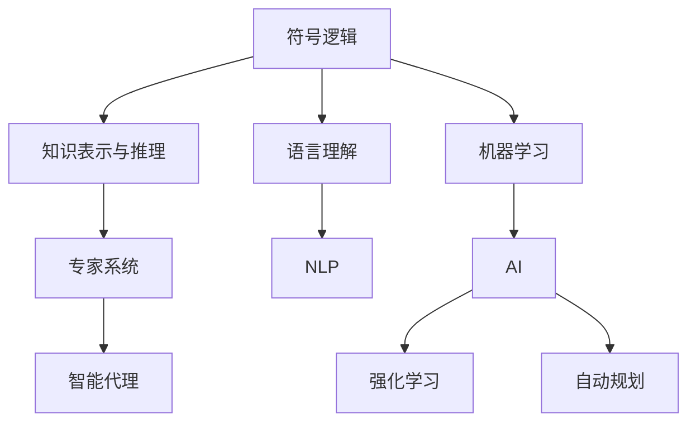

                 

# 人工智能研究的早期方向

## 1. 背景介绍

人工智能（AI）研究起源于20世纪40年代至50年代的数学、逻辑和心理学的交叉领域，以图灵机和哥德尔不完备定理为开端，奠定了AI研究的理论基础。早期研究集中于符号逻辑、语言理解和机器学习等基本问题，开启了AI技术的探索之旅。本文将从历史视角梳理AI研究的早期方向，探讨其对现代AI技术的深远影响。

## 2. 核心概念与联系

### 2.1 核心概念概述

为了更好地理解早期AI研究的方向，我们首先定义几个关键概念：

- **符号逻辑（Symbolic Logic）**：利用形式化符号系统，如布尔代数和命题逻辑，对计算机程序和知识表达进行研究。符号逻辑旨在通过逻辑推理和形式化方法，实现计算机的智能操作。
- **语言理解（Language Understanding）**：研究如何让计算机理解自然语言，包括词义消歧、句法分析和语义解析等任务。语言理解是自然语言处理（NLP）和语音识别的基础。
- **机器学习（Machine Learning）**：通过数据训练模型，让机器能够自我优化和学习新任务。机器学习包含监督学习、无监督学习和强化学习等多种方法。
- **知识表示与推理（Knowledge Representation and Reasoning）**：研究如何将知识形式化并存储于计算机中，以及如何通过推理机制自动化地解决推理问题。知识表示与推理是专家系统、智能代理和自动规划的核心。

### 2.2 核心概念间的关系

早期AI研究的一个显著特征是各个领域之间的紧密联系和交叉。以下是一些核心概念间的关系：

1. **符号逻辑与知识表示**：符号逻辑为知识表示提供了形式化的基础，使得知识可以以逻辑表达式和规则的形式进行存储和操作。
2. **语言理解与自然语言处理**：语言理解是NLP研究的基础，NLP研究包括文本处理、机器翻译、语义分析和对话系统等。
3. **机器学习与人工智能**：机器学习是AI研究的核心技术之一，通过数据驱动的训练，使机器能够自主学习和适应新环境。
4. **知识表示与推理与专家系统**：知识表示与推理研究为专家系统提供了知识库和推理引擎，使得专家系统能够根据规则和知识自动解决问题。

这些概念之间的联系和互动，构成了早期AI研究的基本框架。

### 2.3 核心概念的整体架构

通过一个综合性的流程图，我们可以更直观地理解这些核心概念间的联系：



这个架构展示了符号逻辑、语言理解、机器学习和知识表示与推理如何共同作用，推动了早期AI研究的发展。

## 3. 核心算法原理 & 具体操作步骤

### 3.1 算法原理概述

早期AI研究的核心算法原理主要包括符号逻辑、语言理解和机器学习。以下是这些原理的概述：

1. **符号逻辑原理**：通过形式化的符号系统，符号逻辑能够表达复杂的推理关系和逻辑规则。例如，布尔代数、命题逻辑和谓词逻辑等形式化的符号系统，为知识表示和推理提供了基础。
2. **语言理解原理**：语言理解研究如何通过规则和模型，解析和处理自然语言。主要方法包括词法分析、句法分析和语义解析。
3. **机器学习原理**：机器学习通过数据训练模型，使机器能够自主学习和优化。主要包括监督学习、无监督学习和强化学习等方法。

### 3.2 算法步骤详解

早期AI研究的算法步骤主要包括以下几个关键步骤：

1. **数据收集与预处理**：收集并清洗用于训练的原始数据，以便进行后续的算法训练。
2. **符号逻辑编码**：将知识以符号逻辑的形式进行编码，以便计算机能够理解和处理。
3. **模型训练与优化**：通过数据训练模型，并使用优化算法调整模型参数，以提高模型性能。
4. **知识库构建**：将通过机器学习获得的知识存储于知识库中，以便后续的推理和应用。
5. **推理与决策**：根据知识库中的知识，利用推理引擎进行问题求解和决策。

### 3.3 算法优缺点

早期AI研究的主要优点包括：

1. **逻辑严谨性**：符号逻辑和知识表示与推理方法，能够提供严谨的逻辑推理和知识管理，确保了决策的准确性和可靠性。
2. **可解释性**：符号逻辑和知识表示与推理的决策过程，通常具有较高的可解释性，便于理解和调试。
3. **通用性**：符号逻辑和语言理解方法，能够处理各种类型的数据和任务，具有较强的通用性。

但同时也存在一些缺点：

1. **数据需求高**：早期AI研究往往需要大量的标注数据进行训练，数据获取和预处理成本较高。
2. **复杂度高**：符号逻辑和知识表示与推理方法的实现复杂，需要深厚的数学和逻辑知识。
3. **可扩展性差**：早期AI研究的算法和系统设计，通常难以应对大规模和复杂的数据和任务。

### 3.4 算法应用领域

早期AI研究的算法和理论，广泛应用于以下几个领域：

1. **专家系统（Expert Systems）**：通过知识库和推理引擎，构建基于规则的专家系统，用于医疗诊断、金融分析和制造规划等任务。
2. **自然语言处理（NLP）**：研究如何通过符号逻辑和语言理解，实现文本处理、机器翻译和语义分析等NLP任务。
3. **智能代理（Intelligent Agents）**：通过机器学习算法，构建智能代理，用于游戏、金融和社交网络等复杂环境中的决策和交互。
4. **自动规划（Automated Planning）**：研究如何通过知识表示和推理，自动规划问题求解路径，用于调度、物流和机器人路径规划等任务。

## 4. 数学模型和公式 & 详细讲解 & 举例说明

### 4.1 数学模型构建

早期AI研究的数学模型主要包括布尔代数、命题逻辑和谓词逻辑。以下是这些模型的构建过程：

1. **布尔代数（Boolean Algebra）**：布尔代数是一种形式化的符号系统，通过真值表和逻辑门运算，表达复杂的逻辑关系。例如，布尔代数中的"与"、"或"和"非"运算，可用于构建简单的决策树和规则系统。
2. **命题逻辑（Propositional Logic）**：命题逻辑通过命题和逻辑联结词，表达命题之间的逻辑关系。例如，"如果P，则Q"可以表示为"P → Q"。
3. **谓词逻辑（Predicate Logic）**：谓词逻辑通过谓词和个体变量，表达更复杂的语义关系。例如，"有些S是P"可以表示为"∃x(S(x) ∧ P(x))"。

### 4.2 公式推导过程

以下以布尔代数为例，展示其基本公式的推导过程：

1. **真值表（Truth Table）**：通过列出所有可能的情况，确定逻辑表达式在不同输入下的真值。
2. **等价变换（Equivalence Transformations）**：通过逻辑等价规则，简化和转换复杂的逻辑表达式。
3. **逻辑推理（Logical Inference）**：通过推理规则，从已知真值推导出新真值。

### 4.3 案例分析与讲解

以布尔代数中的"异或门"为例，展示其逻辑推理过程：

假设输入A和B的真值为1或0，输出C为异或门。其真值表如下：

| A | B | C |
|---|---|---|
| 1 | 1 | 0 |
| 1 | 0 | 1 |
| 0 | 1 | 1 |
| 0 | 0 | 0 |

根据真值表，可以得到异或门的逻辑表达式：

$$ C = A \oplus B $$

其中，$\oplus$表示异或运算。

## 5. 项目实践：代码实例和详细解释说明

### 5.1 开发环境搭建

为了进行早期AI研究的代码实现，我们需要搭建一个Python开发环境。以下是详细的步骤：

1. 安装Python：从官网下载并安装Python 3.x版本，确保环境变量配置正确。
2. 安装Pip：使用命令行安装Pip，作为Python包管理工具。
3. 安装PyTorch：使用Pip安装PyTorch，这是一个广泛用于AI研究的深度学习框架。
4. 安装TensorFlow：使用Pip安装TensorFlow，另一个流行的深度学习框架。
5. 安装SymPy：使用Pip安装SymPy，用于符号计算和逻辑推导。

完成上述步骤后，即可在Python环境中进行早期的AI研究开发。

### 5.2 源代码详细实现

以下是一个简单的布尔代数逻辑表达式求解器，展示如何通过SymPy进行符号计算：

```python
import sympy as sp

# 定义符号变量
A, B = sp.symbols('A B')

# 定义异或门逻辑表达式
C = A ^ B

# 求解逻辑表达式
result = sp.simplify(C)

# 输出结果
print(result)
```

### 5.3 代码解读与分析

上述代码实现了布尔代数中的异或门逻辑表达式的求解。通过定义符号变量和异或门逻辑表达式，使用SymPy库进行符号计算和简化，最终得到逻辑表达式的简化形式。

## 6. 实际应用场景

### 6.1 专家系统

专家系统是早期AI研究的重要应用之一。以下是一个简单的专家系统示例，展示如何通过符号逻辑和知识表示，构建用于医疗诊断的专家系统：

1. **知识库构建**：定义医疗知识库，包括疾病症状、诊断规则和治疗方法。例如，"如果患者有头痛、发烧和咳嗽，则可能患有流感"可以表示为"if A then B"的形式，其中A为症状，B为诊断结果。
2. **推理引擎实现**：构建推理引擎，根据输入的病情描述，自动进行推理和诊断。例如，如果输入为"头痛、发烧和咳嗽"，推理引擎将输出"可能患有流感"。

### 6.2 自然语言处理

自然语言处理是早期AI研究的另一个重要方向。以下是一个简单的NLP示例，展示如何通过语言理解和符号逻辑，实现文本分类任务：

1. **文本预处理**：将文本进行分词、词性标注和语法分析。例如，"我喜欢吃苹果"可以表示为"I like to eat apple"的形式。
2. **分类器构建**：通过符号逻辑和机器学习算法，构建分类器。例如，"if I like apple then I eat apple"可以表示为文本"我喜欢吃苹果"的分类结果。
3. **分类器应用**：使用分类器对新的文本进行分类。例如，对于文本"我喜欢吃香蕉"，分类器将输出"不喜欢"。

### 6.3 智能代理

智能代理是早期AI研究的重要应用之一。以下是一个简单的智能代理示例，展示如何通过机器学习算法，构建用于金融市场的智能代理：

1. **市场数据收集**：收集金融市场的数据，如股票价格、交易量等。
2. **特征提取**：从市场数据中提取有用的特征，例如股票的涨跌幅度和交易量。
3. **模型训练**：使用机器学习算法，训练智能代理。例如，可以使用决策树、随机森林等算法，构建市场预测模型。
4. **决策应用**：根据模型预测结果，智能代理自动进行买卖操作。例如，当市场预测结果为上涨时，智能代理自动买入股票。

## 7. 工具和资源推荐

### 7.1 学习资源推荐

为了系统学习早期AI研究的理论和技术，以下是一些推荐的学习资源：

1. **《人工智能：一种现代方法》**：这本书是AI领域的经典教材，系统介绍了AI研究的历史、理论和应用。
2. **Coursera《AI for Everyone》课程**：由斯坦福大学开设的AI入门课程，涵盖了AI的基本概念和应用。
3. **Kaggle AI竞赛**：Kaggle是一个数据科学竞赛平台，提供大量的AI挑战赛，有助于学习和实践AI技术。

### 7.2 开发工具推荐

早期AI研究的开发工具主要集中在符号逻辑、机器学习和知识表示方面。以下是一些推荐的工具：

1. **SymPy**：一个Python库，用于符号计算和逻辑推导。
2. **TensorFlow**：一个深度学习框架，用于机器学习和神经网络算法。
3. **PyTorch**：另一个深度学习框架，提供灵活的动态计算图。

### 7.3 相关论文推荐

以下是一些早期AI研究的经典论文，推荐阅读：

1. **《符号逻辑的基础》**：由哥德尔和图灵合著，奠定了符号逻辑和形式化方法的理论基础。
2. **《专家系统与知识工程》**：该书介绍了专家系统的基本原理和实现方法，是AI研究的重要参考文献。
3. **《机器学习：概念、算法和系统的预测》**：该书详细介绍了机器学习的基本概念、算法和系统实现。

## 8. 总结：未来发展趋势与挑战

### 8.1 研究成果总结

早期AI研究奠定了AI技术的基础，包括符号逻辑、语言理解和机器学习等核心技术。这些技术的广泛应用，推动了AI技术的快速发展和产业化。

### 8.2 未来发展趋势

未来AI研究将面临以下几个发展趋势：

1. **多模态融合**：将图像、语音和文本等多模态数据融合，提升AI系统的综合理解和处理能力。
2. **深度学习与符号逻辑结合**：深度学习与符号逻辑的结合，将进一步提升AI系统的推理和决策能力。
3. **强化学习与复杂环境交互**：通过强化学习，构建智能代理，应对复杂环境中的决策和交互问题。
4. **大规模知识图谱构建**：构建大规模知识图谱，提供海量的知识库和语义关系，提升AI系统的知识表示和推理能力。

### 8.3 面临的挑战

尽管早期AI研究取得了显著成就，但仍面临以下挑战：

1. **数据隐私和安全**：AI系统的广泛应用带来了数据隐私和安全问题，如何保护用户数据隐私，防止数据滥用，是一个重要的研究方向。
2. **算法透明性**：AI系统的决策过程通常缺乏透明性，难以解释其内部机制，这是AI技术推广应用的一个重大障碍。
3. **伦理与法律问题**：AI系统在医疗、金融等领域的应用，引发了伦理和法律问题，如何规范AI系统的使用，是一个亟待解决的问题。
4. **计算资源消耗**：AI系统的复杂性和规模性，带来了巨大的计算资源消耗，如何优化算法，提高效率，是未来研究的重要方向。

### 8.4 研究展望

未来AI研究需要在以下几个方面进行深入探索：

1. **可解释性AI**：构建具有透明性和可解释性的AI系统，提升用户对AI系统的信任。
2. **公平与公正AI**：确保AI系统的决策过程公平公正，避免偏见和歧视。
3. **自适应AI**：构建自适应AI系统，能够动态调整算法参数，适应不同环境和数据分布。
4. **人机协同AI**：构建人机协同的AI系统，利用人类与机器的互补优势，提升系统的综合性能。

## 9. 附录：常见问题与解答

**Q1：早期AI研究的主要特点是什么？**

A: 早期AI研究的主要特点包括：
- 符号逻辑和知识表示：通过形式化符号和知识库，实现精确的逻辑推理和知识管理。
- 语言理解与NLP：研究如何让计算机理解自然语言，包括文本处理、机器翻译和语义分析。
- 机器学习：通过数据训练模型，让机器能够自主学习和优化。

**Q2：早期AI研究的主要应用领域是什么？**

A: 早期AI研究的主要应用领域包括：
- 专家系统：通过知识库和推理引擎，构建基于规则的专家系统，用于医疗诊断、金融分析和制造规划等任务。
- 自然语言处理：研究如何通过符号逻辑和语言理解，实现文本处理、机器翻译和语义分析等NLP任务。
- 智能代理：通过机器学习算法，构建智能代理，用于游戏、金融和社交网络等复杂环境中的决策和交互。

**Q3：早期AI研究面临的主要挑战是什么？**

A: 早期AI研究面临的主要挑战包括：
- 数据隐私和安全：AI系统的广泛应用带来了数据隐私和安全问题，如何保护用户数据隐私，防止数据滥用，是一个重要的研究方向。
- 算法透明性：AI系统的决策过程通常缺乏透明性，难以解释其内部机制，这是AI技术推广应用的一个重大障碍。
- 伦理与法律问题：AI系统在医疗、金融等领域的应用，引发了伦理和法律问题，如何规范AI系统的使用，是一个亟待解决的问题。
- 计算资源消耗：AI系统的复杂性和规模性，带来了巨大的计算资源消耗，如何优化算法，提高效率，是未来研究的重要方向。

---

作者：禅与计算机程序设计艺术 / Zen and the Art of Computer Programming

