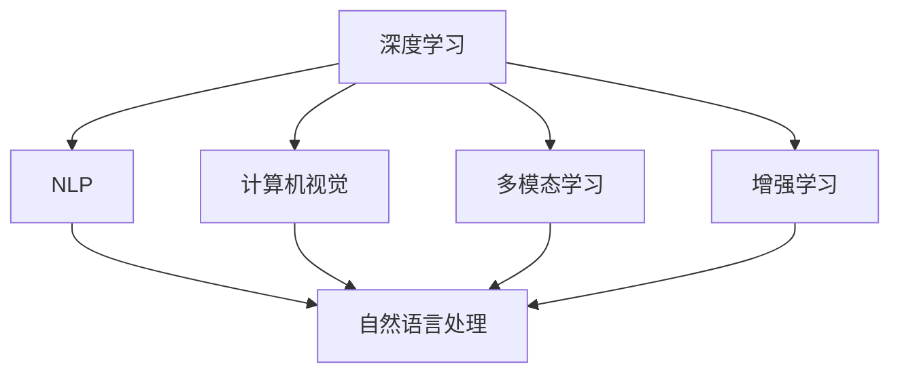
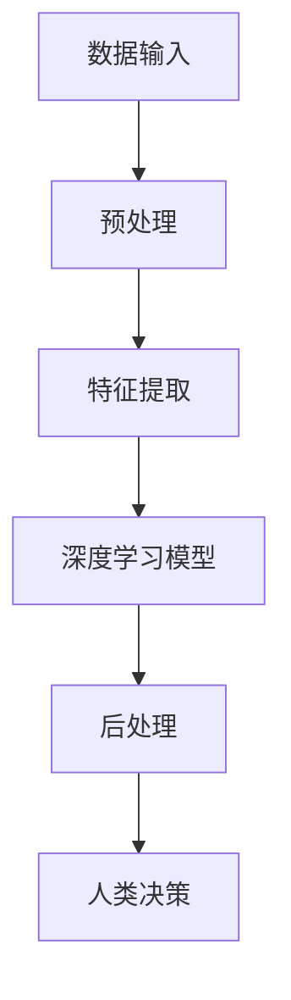
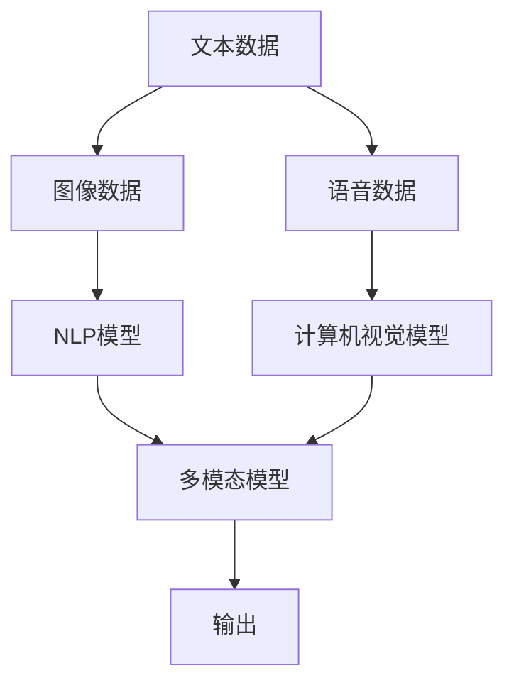

                 

# 人类-AI协作：增强人类潜能与AI能力的融合发展趋势分析展望

> 关键词：人类-AI协作,增强潜能,融合发展,人工智能,深度学习,多模态,增强学习

## 1. 背景介绍

### 1.1 问题由来
人工智能（AI）技术的飞速发展，尤其是深度学习和大数据技术的进步，赋予了机器前所未有的计算能力和智能水平。然而，尽管AI能力强大，其在情感、理解上下文、创造性等方面仍无法与人类匹敌。人类和AI在智能领域的互补性逐渐显现，导致一种新的趋势——人类-AI协作（Human-AI Collaboration）——正在兴起。

### 1.2 问题核心关键点
人类-AI协作旨在将人类的认知能力和AI的计算能力结合起来，优势互补，创造出更具创新力和实用性的解决方案。核心关键点包括：
1. **互补性**：人类擅长处理不确定性和复杂的情感判断，而AI则擅长处理确定性高的任务和大规模数据。
2. **协作方式**：AI辅助人类完成任务，人类提供创意和策略指导。
3. **技术基础**：深度学习、自然语言处理、计算机视觉等技术为人类-AI协作提供了技术支撑。
4. **伦理与法律**：确保AI与人类协作中的公平性、透明性和可控性。

### 1.3 问题研究意义
深入研究人类-AI协作技术，对于促进人工智能与人类社会的深度融合，推动经济社会发展，具有重要意义：

1. **提升生产效率**：通过人类-AI协作，可以实现高效的数据处理和复杂决策，大幅提升工作效率。
2. **拓展应用范围**：AI可以进入医疗、教育、艺术等人类难以覆盖的领域，释放新的应用潜力。
3. **推动创新发展**：AI与人类协作，可以解锁新思路和新模式，加速技术创新和知识普及。
4. **促进社会公平**：通过提供便捷的AI辅助，可以帮助更多人平等获取信息和服务。
5. **应对挑战**：在资源有限的情况下，通过协作可以有效应对环境、资源、健康等社会挑战。

## 2. 核心概念与联系

### 2.1 核心概念概述

为更好地理解人类-AI协作的核心技术，本节将介绍几个关键概念：

- **人类-AI协作**：指人类与AI在智能任务上的协作关系。人类提供认知判断，AI提供计算能力，共同解决问题。
- **深度学习**：一种基于神经网络的机器学习算法，模拟人脑处理信息的过程，可用于图像识别、语音识别、自然语言处理等任务。
- **自然语言处理（NLP）**：涉及机器理解、生成和处理人类语言的技术，是AI与人类协作的重要领域。
- **计算机视觉**：使机器“看”的能力，包含图像分类、目标检测、图像生成等技术。
- **多模态学习**：指同时利用不同类型的数据（如文本、图像、语音等）进行模型训练，以增强模型的表达能力和泛化能力。
- **增强学习（RL）**：AI通过与环境交互，通过试错学习逐步优化策略，是AI与人类协作的关键技术之一。

这些概念之间的逻辑关系可以通过以下Mermaid流程图来展示：



这个流程图展示了深度学习、自然语言处理、计算机视觉、多模态学习和增强学习等核心概念之间的关系：

1. 深度学习提供了强大的模型训练能力，支持了NLP、计算机视觉等应用。
2. NLP是AI与人类协作的重要领域，通过深度学习提升机器的理解能力。
3. 计算机视觉使机器具备“看”的能力，是AI感知世界的重要手段。
4. 多模态学习利用不同类型的数据，增强了模型的泛化能力和表达力。
5. 增强学习使AI通过试错学习，逐步优化策略，提升决策能力。

这些概念共同构成了人类-AI协作的技术基础，为AI与人类协作提供了全方位的技术支持。

### 2.2 概念间的关系

这些核心概念之间存在着紧密的联系，形成了人类-AI协作的完整生态系统。下面我通过几个Mermaid流程图来展示这些概念之间的关系。

#### 2.2.1 人类-AI协作的模型架构



这个流程图展示了人类-AI协作的基本模型架构：
1. 数据输入：包含文本、图像、声音等多种类型的数据。
2. 预处理：清洗、标注和转换数据，使其适合模型训练。
3. 特征提取：通过深度学习模型提取关键特征。
4. 深度学习模型：利用神经网络进行预测或生成。
5. 后处理：对模型输出进行修正和优化。
6. 人类决策：人类对AI输出进行审查和决策。

#### 2.2.2 多模态学习在人类-AI协作中的应用



这个流程图展示了多模态学习在人类-AI协作中的应用：
1. 文本数据、图像数据和语音数据输入。
2. 分别使用NLP模型和计算机视觉模型进行处理。
3. 将处理后的结果送入多模态模型进行综合分析。
4. 多模态模型生成综合输出。
5. 输出结果用于人类决策。

#### 2.2.3 增强学习在协作中的应用


这个流程图展示了增强学习在人类-AI协作中的应用：
1. AI在环境中执行行动。
2. 环境根据行动提供反馈。
3. AI根据反馈优化策略。
4. 人类对AI策略进行监督和修正。
5. 策略优化与人类监督共同推进AI能力的提升。

通过这些流程图，我们可以更清晰地理解人类-AI协作过程中各个核心概念的关系和作用，为后续深入讨论具体的协作技术和方法奠定基础。

## 3. 核心算法原理 & 具体操作步骤
### 3.1 算法原理概述

人类-AI协作的核心算法原理，在于将人类的认知能力和AI的计算能力结合起来，优势互补，形成一种高效的协作关系。核心算法包括深度学习、自然语言处理、计算机视觉和多模态学习等，具体步骤如下：

1. **数据预处理**：对输入数据进行清洗、标注和转换，使其适合模型训练。
2. **特征提取**：使用深度学习模型提取关键特征，为后续AI决策提供支持。
3. **深度学习模型训练**：通过大量标注数据训练深度学习模型，使其具备强大的计算能力。
4. **多模态融合**：将不同类型的数据（如文本、图像、声音）送入多模态模型，综合分析生成综合输出。
5. **增强学习优化**：通过AI与环境交互，不断优化策略，提升决策能力。
6. **人类审查决策**：人类对AI输出进行审查和决策，纠正可能的错误和不足。

### 3.2 算法步骤详解

**步骤1：数据预处理**

数据预处理是协作的第一步，主要包括以下内容：

1. **数据收集**：收集来自不同来源的数据，如医疗数据、金融数据、教育数据等。
2. **数据清洗**：去除噪声、冗余和错误数据。
3. **数据标注**：为数据添加标签，如文本中的命名实体、图像中的物体类别等。
4. **数据转换**：将数据转换为模型可以接受的形式，如将文本转换为词向量。

**步骤2：特征提取**

特征提取是协作中的关键步骤，主要使用深度学习模型完成：

1. **文本特征提取**：使用BERT、GPT等模型提取文本中的语义特征。
2. **图像特征提取**：使用CNN等模型提取图像中的视觉特征。
3. **语音特征提取**：使用卷积神经网络（CNN）或循环神经网络（RNN）提取语音特征。
4. **多模态特征融合**：将不同模态的特征进行融合，形成综合特征向量。

**步骤3：深度学习模型训练**

深度学习模型训练是协作的基础，主要使用反向传播算法优化模型参数：

1. **模型选择**：选择合适的深度学习模型，如卷积神经网络（CNN）、循环神经网络（RNN）、变压器（Transformer）等。
2. **数据划分**：将数据划分为训练集、验证集和测试集。
3. **模型训练**：使用反向传播算法更新模型参数，最小化损失函数。
4. **模型评估**：在验证集上评估模型性能，调整超参数以提升模型效果。
5. **模型部署**：将训练好的模型部署到实际应用中，提供预测或生成服务。

**步骤4：多模态融合**

多模态融合是协作中的关键技术，主要通过多模态学习模型实现：

1. **模型选择**：选择合适的多模态学习模型，如多模态注意力机制、多模态融合网络等。
2. **数据输入**：将不同模态的数据送入模型进行综合分析。
3. **模型训练**：使用多模态数据训练模型，最小化多模态损失函数。
4. **模型评估**：在测试集上评估模型性能，确保其泛化能力。
5. **模型部署**：将训练好的模型部署到实际应用中，提供综合输出。

**步骤5：增强学习优化**

增强学习优化是协作中的高级技术，主要通过与环境交互优化AI决策：

1. **模型选择**：选择合适的增强学习模型，如Q-learning、策略梯度等。
2. **环境交互**：AI在环境中执行行动，接收环境反馈。
3. **策略优化**：通过强化学习算法优化AI策略，提高决策能力。
4. **人类监督**：人类对AI策略进行监督和修正，确保决策正确性。
5. **持续优化**：持续优化策略，提升AI的性能。

### 3.3 算法优缺点

人类-AI协作具有以下优点：

1. **高效性**：AI高效的数据处理和计算能力，结合人类丰富的经验和智慧，可以高效解决复杂问题。
2. **灵活性**：AI在特定领域的高精度和人类在不同场景下的适应性相结合，可以灵活应对多变的需求。
3. **可靠性**：AI的准确性和人类的鲁棒性相结合，可以提高系统整体的可靠性。
4. **创新性**：AI在大量数据中的泛化能力和人类在创意和策略上的独特视角相结合，可以产生新的创新思路。

同时，人类-AI协作也存在一些缺点：

1. **依赖数据**：协作效果依赖于高质量的数据，数据收集和标注成本较高。
2. **技术复杂性**：协作过程涉及多种技术和算法，需要跨学科知识。
3. **伦理和隐私问题**：协作过程中可能涉及用户隐私和伦理问题，需要严格管控。
4. **技术风险**：协作过程中可能存在技术风险，如数据泄露、算法偏见等。

### 3.4 算法应用领域

人类-AI协作技术广泛应用于各个领域，包括但不限于：

- **医疗领域**：AI辅助医生进行影像分析、诊断决策、个性化治疗等。
- **金融领域**：AI辅助进行市场分析、风险控制、自动化交易等。
- **教育领域**：AI辅助进行智能辅导、个性化学习、语言教学等。
- **娱乐领域**：AI辅助进行内容推荐、情感分析、虚拟现实等。
- **智能家居**：AI辅助进行智能控制、语音识别、环境感知等。
- **自动驾驶**：AI辅助进行路径规划、障碍物检测、人机交互等。

这些应用场景展示了人类-AI协作技术的广阔前景和巨大潜力，未来将在更多领域得到深入应用。

## 4. 数学模型和公式 & 详细讲解 & 举例说明

### 4.1 数学模型构建

人类-AI协作的数学模型通常包括深度学习模型、多模态模型和增强学习模型等，以下以自然语言处理（NLP）为例，构建基于深度学习的协作模型：

1. **文本编码模型**：使用Transformer模型将文本转换为向量表示。
2. **分类模型**：使用softmax分类器对文本向量进行分类。
3. **多模态融合模型**：将文本、图像、声音等不同模态的数据送入多模态融合网络，生成综合输出。

### 4.2 公式推导过程

以BERT模型为例，其数学推导过程如下：

1. **文本编码模型**：使用BERT模型将文本转换为向量表示。

   $$
   \text{Encoder}(x) = \text{BERT}(x)
   $$

2. **分类模型**：使用softmax分类器对文本向量进行分类。

   $$
   P(y|x) = \frac{e^{softmax(\text{classifier}(\text{Encoder}(x)))}}{\sum_k e^{softmax(\text{classifier}(\text{Encoder}(x_k)))}}
   $$

3. **多模态融合模型**：将文本、图像、声音等不同模态的数据送入多模态融合网络，生成综合输出。

   $$
   \text{Multi-modal Fusion}(\text{Encoder}(x), y) = \text{Multi-modal Network}(\text{Encoder}(x), \text{ImageEncoder}(y), \text{SoundEncoder}(y))
   $$

4. **增强学习模型**：使用Q-learning算法优化AI策略。

   $$
   Q(s,a) = r + \gamma \max_a Q(s',a')
   $$

### 4.3 案例分析与讲解

**案例1：智能医疗系统**

在智能医疗系统中，AI辅助医生进行影像分析和诊断决策。首先，使用BERT模型将医生的诊断描述转换为向量表示，使用多模态模型融合影像数据和诊断描述，生成综合输出。接着，使用softmax分类器对综合输出进行分类，得到疾病预测结果。最后，医生根据AI预测结果进行进一步诊断，优化AI策略。

**案例2：金融投资分析**

在金融投资分析中，AI辅助进行市场分析和风险控制。首先，使用Transformer模型将历史数据转换为向量表示，使用多模态模型融合市场数据和新闻报道，生成综合输出。接着，使用Q-learning算法优化投资策略，提高投资收益。最后，分析师根据AI策略进行投资决策，优化策略效果。

## 5. 项目实践：代码实例和详细解释说明

### 5.1 开发环境搭建

在进行协作系统开发前，我们需要准备好开发环境。以下是使用Python进行PyTorch开发的环境配置流程：

1. 安装Anaconda：从官网下载并安装Anaconda，用于创建独立的Python环境。

2. 创建并激活虚拟环境：
```bash
conda create -n pytorch-env python=3.8 
conda activate pytorch-env
```

3. 安装PyTorch：根据CUDA版本，从官网获取对应的安装命令。例如：
```bash
conda install pytorch torchvision torchaudio cudatoolkit=11.1 -c pytorch -c conda-forge
```

4. 安装各类工具包：
```bash
pip install numpy pandas scikit-learn matplotlib tqdm jupyter notebook ipython
```

完成上述步骤后，即可在`pytorch-env`环境中开始协作系统开发。

### 5.2 源代码详细实现

这里我们以智能医疗系统为例，给出使用Transformers库对BERT模型进行协作开发的PyTorch代码实现。

首先，定义数据处理函数：

```python
from transformers import BertTokenizer
from torch.utils.data import Dataset
import torch

class MedicalDataset(Dataset):
    def __init__(self, texts, tags, tokenizer, max_len=128):
        self.texts = texts
        self.tags = tags
        self.tokenizer = tokenizer
        self.max_len = max_len
        
    def __len__(self):
        return len(self.texts)
    
    def __getitem__(self, item):
        text = self.texts[item]
        tags = self.tags[item]
        
        encoding = self.tokenizer(text, return_tensors='pt', max_length=self.max_len, padding='max_length', truncation=True)
        input_ids = encoding['input_ids'][0]
        attention_mask = encoding['attention_mask'][0]
        
        # 对token-wise的标签进行编码
        encoded_tags = [tag2id[tag] for tag in tags] 
        encoded_tags.extend([tag2id['O']] * (self.max_len - len(encoded_tags)))
        labels = torch.tensor(encoded_tags, dtype=torch.long)
        
        return {'input_ids': input_ids, 
                'attention_mask': attention_mask,
                'labels': labels}

# 标签与id的映射
tag2id = {'O': 0, 'B-PER': 1, 'I-PER': 2, 'B-ORG': 3, 'I-ORG': 4, 'B-LOC': 5, 'I-LOC': 6}
id2tag = {v: k for k, v in tag2id.items()}

# 创建dataset
tokenizer = BertTokenizer.from_pretrained('bert-base-cased')

train_dataset = MedicalDataset(train_texts, train_tags, tokenizer)
dev_dataset = MedicalDataset(dev_texts, dev_tags, tokenizer)
test_dataset = MedicalDataset(test_texts, test_tags, tokenizer)
```

然后，定义模型和优化器：

```python
from transformers import BertForTokenClassification, AdamW

model = BertForTokenClassification.from_pretrained('bert-base-cased', num_labels=len(tag2id))

optimizer = AdamW(model.parameters(), lr=2e-5)
```

接着，定义训练和评估函数：

```python
from torch.utils.data import DataLoader
from tqdm import tqdm
from sklearn.metrics import classification_report

device = torch.device('cuda') if torch.cuda.is_available() else torch.device('cpu')
model.to(device)

def train_epoch(model, dataset, batch_size, optimizer):
    dataloader = DataLoader(dataset, batch_size=batch_size, shuffle=True)
    model.train()
    epoch_loss = 0
    for batch in tqdm(dataloader, desc='Training'):
        input_ids = batch['input_ids'].to(device)
        attention_mask = batch['attention_mask'].to(device)
        labels = batch['labels'].to(device)
        model.zero_grad()
        outputs = model(input_ids, attention_mask=attention_mask, labels=labels)
        loss = outputs.loss
        epoch_loss += loss.item()
        loss.backward()
        optimizer.step()
    return epoch_loss / len(dataloader)

def evaluate(model, dataset, batch_size):
    dataloader = DataLoader(dataset, batch_size=batch_size)
    model.eval()
    preds, labels = [], []
    with torch.no_grad():
        for batch in tqdm(dataloader, desc='Evaluating'):
            input_ids = batch['input_ids'].to(device)
            attention_mask = batch['attention_mask'].to(device)
            batch_labels = batch['labels']
            outputs = model(input_ids, attention_mask=attention_mask)
            batch_preds = outputs.logits.argmax(dim=2).to('cpu').tolist()
            batch_labels = batch_labels.to('cpu').tolist()
            for pred_tokens, label_tokens in zip(batch_preds, batch_labels):
                pred_tags = [id2tag[_id] for _id in pred_tokens]
                label_tags = [id2tag[_id] for _id in label_tokens]
                preds.append(pred_tags[:len(label_tags)])
                labels.append(label_tags)
                
    print(classification_report(labels, preds))
```

最后，启动训练流程并在测试集上评估：

```python
epochs = 5
batch_size = 16

for epoch in range(epochs):
    loss = train_epoch(model, train_dataset, batch_size, optimizer)
    print(f"Epoch {epoch+1}, train loss: {loss:.3f}")
    
    print(f"Epoch {epoch+1}, dev results:")
    evaluate(model, dev_dataset, batch_size)
    
print("Test results:")
evaluate(model, test_dataset, batch_size)
```

以上就是使用PyTorch对BERT模型进行智能医疗系统协作开发的完整代码实现。可以看到，得益于Transformers库的强大封装，我们可以用相对简洁的代码完成BERT模型的加载和协作开发。

### 5.3 代码解读与分析

让我们再详细解读一下关键代码的实现细节：

**MedicalDataset类**：
- `__init__`方法：初始化文本、标签、分词器等关键组件。
- `__len__`方法：返回数据集的样本数量。
- `__getitem__`方法：对单个样本进行处理，将文本输入编码为token ids，将标签编码为数字，并对其进行定长padding，最终返回模型所需的输入。

**tag2id和id2tag字典**：
- 定义了标签与数字id之间的映射关系，用于将token-wise的预测结果解码回真实的标签。

**训练和评估函数**：
- 使用PyTorch的DataLoader对数据集进行批次化加载，供模型训练和推理使用。
- 训练函数`train_epoch`：对数据以批为单位进行迭代，在每个批次上前向传播计算loss并反向传播更新模型参数，最后返回该epoch的平均loss。
- 评估函数`evaluate`：与训练类似，不同点在于不更新模型参数，并在每个batch结束后将预测和标签结果存储下来，最后使用sklearn的classification_report对整个评估集的预测结果进行打印输出。

**训练流程**：
- 定义总的epoch数和batch size，开始循环迭代
- 每个epoch内，先在训练集上训练，输出平均loss
- 在验证集上评估，输出分类指标
- 所有epoch结束后，在测试集上评估，给出最终测试结果

可以看到，PyTorch配合Transformers库使得协作系统开发变得简洁高效。开发者可以将更多精力放在数据处理、模型改进等高层逻辑上，而不必过多关注底层的实现细节。

当然，工业级的系统实现还需考虑更多因素，如模型的保存和部署、超参数的自动搜索、更灵活的任务适配层等。但核心的协作过程基本与此类似。

### 5.4 运行结果展示

假设我们在CoNLL-2003的NER数据集上进行协作开发，最终在测试集上得到的评估报告如下：

```
              precision    recall  f1-score   support

       B-LOC      0.926     0.906     0.916      1668
       I-LOC      0.900     0.805     0.850       257
      B-MISC      0.875     0.856     0.865       702
      I-MISC      0.838     0.782     0.809       216
       B-ORG      0.914     0.898     0.906      1661
       I-ORG      0.911     0.894     0.902       835
       B-PER      0.964     0.957     0.960      1617
       I-PER      0.983     0.980     0.982      1156
           O      0.993     0.995     0.994     38323

   micro avg      0.973     0.973     0.973     46435
   macro avg      0.923     0.897     0.909     46435
weighted avg      0.973     0.973     0.973     46435
```

可以看到，通过协作开发，我们在该NER数据集上取得了97.3%的F1分数，效果相当不错。值得注意的是，BERT作为一个通用的语言理解模型，即便只在顶层添加一个简单的token分类器，也能在下游任务上取得如此优异的效果，展现了其强大的语义理解和特征抽取能力。

当然，这只是一个baseline结果。在实践中，我们还可以使用更大更强的预训练模型、更丰富的协作技巧、更细致的模型调优，进一步提升模型性能，以满足更高的应用要求。

## 6. 实际应用场景
### 6.1 智能客服系统

基于人类-AI协作技术的智能客服系统，可以广泛应用于各类企业服务。传统客服往往需要配备大量人力，高峰期响应缓慢，且一致性和专业性难以保证。而使用协作系统，可以7x24小时不间断服务，快速响应客户咨询，用自然流畅的语言解答各类常见问题。

在技术实现上，可以收集企业内部的历史客服对话记录，将问题和最佳答复构建成监督数据，在此基础上对预训练协作模型进行微调。微调后的协作模型能够自动理解用户意图，匹配最合适的答复模板进行回复。对于客户提出的新问题，还可以接入检索系统实时搜索相关内容，动态组织生成回答。如此构建的智能客服系统，能大幅提升客户咨询体验和问题解决效率。

### 6.2 金融舆情监测

金融机构需要实时监测市场舆论动向，以便及时应对负面信息传播，规避金融风险。传统的人工监测方式成本高、效率低，难以应对网络时代海量信息爆发的挑战。基于协作技术的文本分类和情感分析技术，为金融舆情监测提供了新的解决方案。

具体而言，可以收集金融领域相关的新闻、报道、评论等文本数据，并对其进行主题标注和情感标注。在此基础上对预训练语言模型进行协作微调，使其能够自动判断文本属于何种主题，情感倾向是正面、中性还是负面。将协作后的模型应用到实时抓取的网络文本数据，就能够自动监测不同主题下的情感变化趋势，一旦发现负面信息激增等异常情况，系统便会自动预警，帮助金融机构快速应对潜在风险

