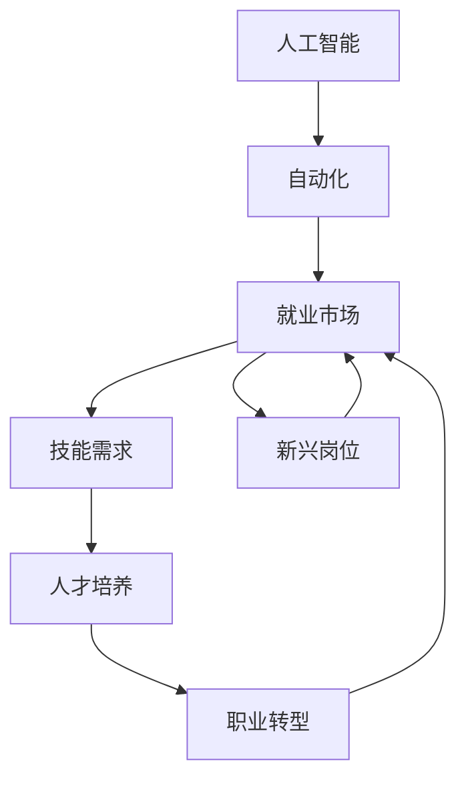

                 

# 人类计算：AI时代的未来就业市场与技能发展预测

## 1. 背景介绍

### 1.1 问题由来

随着人工智能（AI）技术的飞速发展，越来越多的行业开始采用AI技术来自动化工作流程、提高生产效率。AI的应用不仅改变了传统产业的工作方式，还对劳动市场和就业结构产生了深远影响。从自动化生产线到智能客服，再到医疗诊断，AI正迅速渗透到各个领域，为人类计算带来了革命性的变化。然而，这种变化也引发了一系列的社会、经济和伦理问题。

### 1.2 问题核心关键点

AI对就业市场的影响主要体现在以下几个方面：

1. **自动化替代**：一些重复性、低技能的工作被自动化系统取代，例如数据录入、客服、物流配送等。
2. **技能需求变化**：AI技术的发展对人才技能提出了新的要求，需要更多具备数据分析、编程、机器学习等技能的专业人才。
3. **职业转型与再教育**：许多传统职业面临职业转型，需要接受再教育和培训以适应新的工作要求。
4. **就业机会变化**：AI技术的应用创造了新的就业机会，如AI开发、数据分析、AI伦理等新兴岗位。

### 1.3 问题研究意义

研究AI对就业市场的影响及其带来的技能发展趋势，对于政策制定者、教育机构和企业都有重要的指导意义：

1. **政策制定**：帮助政府制定合理的就业政策，平衡经济增长与就业稳定。
2. **教育改革**：指导教育机构调整课程设置，培养适应未来需求的复合型人才。
3. **企业规划**：帮助企业识别未来的技能缺口，制定合理的人才招聘和培训策略。
4. **社会稳定**：促进社会对AI技术的理解和接受，减少因技术变革带来的就业焦虑和社会动荡。

## 2. 核心概念与联系

### 2.1 核心概念概述

为了更好地理解AI对就业市场的影响，本节将介绍几个关键概念：

1. **人工智能（AI）**：使用计算机算法和机器学习技术来模拟人类智能过程的技术，包括机器学习、深度学习、自然语言处理等。
2. **自动化**：使用机器或软件系统自动完成原本由人工完成的任务，提高效率并降低成本。
3. **就业市场**：劳动力供需关系的总和，受多种因素影响，包括技术进步、经济环境、政策法规等。
4. **技能发展**：指个人或组织通过培训、教育等方式，提升其适应未来工作环境的所需技能的过程。
5. **职业转型**：指个人从一种职业转向另一种职业的过程，通常由技术变革、市场需求变化等原因驱动。

这些概念之间的联系可以由以下Mermaid流程图来展示：


这个流程图展示了人工智能、自动化、就业市场、技能发展以及职业转型之间的相互关系。

### 2.2 概念间的关系

这些概念之间存在着紧密的联系，形成了AI时代就业市场和技能发展的一个整体框架。下面是进一步解释这些概念之间的联系：

1. **人工智能与自动化**：AI技术的核心在于自动化。通过算法和模型，AI系统可以自动完成许多复杂的任务，提高工作效率和质量。
2. **自动化与就业市场**：自动化技术的应用减少了对人工的需求，导致一些工作岗位的消失。同时，也创造了新的岗位，如AI开发、数据科学等。
3. **就业市场与技能发展**：就业市场的变化要求劳动者提升技能，以适应新的工作需求。企业也需要不断培训员工，以保持竞争力。
4. **技能发展与职业转型**：技能的发展促进了职业转型，员工可以从事更有技术含量的工作，推动职业结构的优化。
5. **职业转型与就业市场**：职业转型是就业市场变化的具体体现，劳动者需要根据市场变化调整职业方向，以保持就业稳定。

### 2.3 核心概念的整体架构

最后，我们用一个综合的流程图来展示这些概念在大规模自动化和就业市场变化中的整体架构：



这个综合流程图展示了从AI技术到自动化，再到就业市场变化的全过程。AI技术驱动自动化，自动化引发就业市场变化，就业市场变化要求技能发展，技能发展促进职业转型，职业转型进一步影响就业市场。

## 3. 核心算法原理 & 具体操作步骤

### 3.1 算法原理概述

AI对就业市场的影响可以通过数学模型来分析。这里我们将通过建立就业市场模型，来预测AI技术普及对就业市场的影响。

假设就业市场由 $N$ 个行业组成，每个行业的就业人数为 $L_i$，其中 $i$ 表示行业编号。每个行业的生产效率为 $E_i$，劳动力需求为 $D_i$。AI技术对行业的生产效率提高百分比为 $P_i$。

就业市场平衡的数学模型可以表示为：

$$
\sum_{i=1}^{N} (L_i - D_i) = 0
$$

其中，$L_i$ 为实际就业人数，$D_i$ 为劳动力需求。

劳动力需求 $D_i$ 可以通过以下公式计算：

$$
D_i = \frac{E_i}{P_i}
$$

因此，就业市场的平衡状态可以表示为：

$$
\sum_{i=1}^{N} \left( \frac{E_i}{P_i} - L_i \right) = 0
$$

### 3.2 算法步骤详解

基于上述模型，AI对就业市场影响的预测可以按照以下步骤进行：

1. **数据收集**：收集各行业的生产效率、AI技术普及程度等数据。
2. **模型构建**：建立就业市场平衡的数学模型。
3. **参数设定**：设定AI技术对各行业生产效率的提高百分比 $P_i$。
4. **模型求解**：通过求解模型，预测各行业的就业人数变化。
5. **结果分析**：分析AI技术普及对各行业的就业人数影响，以及整体就业市场的变化趋势。

### 3.3 算法优缺点

AI对就业市场影响的预测模型具有以下优点：

1. **数据驱动**：基于实际数据构建模型，可以提供客观的预测结果。
2. **多行业分析**：可以同时分析多个行业的就业变化，提供全面的视角。
3. **动态更新**：随着数据的变化，模型可以动态更新，持续提供最新的预测结果。

但该模型也存在以下缺点：

1. **数据质量依赖**：模型的准确性高度依赖于数据的全面性和准确性。
2. **假设限制**：模型假设生产效率线性提高，实际中可能存在非线性变化。
3. **复杂性**：模型涉及多行业、多因素，求解过程可能较为复杂。

### 3.4 算法应用领域

AI对就业市场影响的预测模型可以应用于多个领域，例如：

1. **政策制定**：帮助政府制定合理的就业政策，平衡经济增长与就业稳定。
2. **企业战略规划**：帮助企业识别未来的技能缺口，制定合理的人才招聘和培训策略。
3. **教育改革**：指导教育机构调整课程设置，培养适应未来需求的复合型人才。
4. **职业规划**：帮助个人进行职业规划，选择适合未来需求的职业路径。

## 4. 数学模型和公式 & 详细讲解 & 举例说明

### 4.1 数学模型构建

本节将使用数学语言对AI对就业市场影响的预测模型进行更加严格的刻画。

假设就业市场由 $N$ 个行业组成，每个行业的就业人数为 $L_i$，其中 $i$ 表示行业编号。每个行业的生产效率为 $E_i$，劳动力需求为 $D_i$。AI技术对行业的生产效率提高百分比为 $P_i$。

定义就业市场平衡的数学模型为：

$$
\sum_{i=1}^{N} (L_i - D_i) = 0
$$

其中，$L_i$ 为实际就业人数，$D_i$ 为劳动力需求。

劳动力需求 $D_i$ 可以通过以下公式计算：

$$
D_i = \frac{E_i}{P_i}
$$

因此，就业市场的平衡状态可以表示为：

$$
\sum_{i=1}^{N} \left( \frac{E_i}{P_i} - L_i \right) = 0
$$

### 4.2 公式推导过程

以下我们以二行业模型为例，推导AI对就业市场影响的预测公式。

设两个行业的生产效率分别为 $E_1$ 和 $E_2$，AI技术对两个行业的生产效率提高百分比分别为 $P_1$ 和 $P_2$。设两个行业的初始就业人数分别为 $L_1$ 和 $L_2$。

根据就业市场平衡模型，有：

$$
\frac{E_1}{P_1} - L_1 + \frac{E_2}{P_2} - L_2 = 0
$$

将劳动力需求 $D_1$ 和 $D_2$ 代入上述方程，得：

$$
D_1 + D_2 = L_1 + L_2
$$

其中：

$$
D_1 = \frac{E_1}{P_1}, \quad D_2 = \frac{E_2}{P_2}
$$

因此，就业市场的平衡状态可以表示为：

$$
\frac{E_1}{P_1} + \frac{E_2}{P_2} = L_1 + L_2
$$

假设AI技术对行业的生产效率提高百分比为 $P = \frac{E}{E_0}$，其中 $E_0$ 为AI技术普及前的生产效率，$E$ 为AI技术普及后的生产效率。

代入上述方程，得：

$$
\frac{E_1}{P} + \frac{E_2}{P} = L_1 + L_2
$$

进一步化简，得：

$$
E_1 + E_2 = (L_1 + L_2)P
$$

因此，AI技术对就业市场的影响可以通过以下公式计算：

$$
\Delta L = (L_1 + L_2)P - (E_1 + E_2)
$$

### 4.3 案例分析与讲解

假设某个制造行业生产效率提高了 $P=0.8$，劳动力需求为 $D_1=10,000$ 人，AI技术普及前的生产效率为 $E_1=5,000$，AI技术普及后的生产效率为 $E_2=4,000$。根据上述公式，可以计算出AI技术普及对就业市场的影响：

$$
\Delta L = (L_1 + L_2)P - (E_1 + E_2) = (10,000 + 10,000) \times 0.8 - (5,000 + 4,000) = 6,000
$$

因此，AI技术普及将导致该行业的就业人数增加 $6,000$ 人。

## 5. 项目实践：代码实例和详细解释说明

### 5.1 开发环境搭建

在进行AI对就业市场影响的预测实践前，我们需要准备好开发环境。以下是使用Python进行Sympy和NumPy开发的开发环境配置流程：

1. 安装Anaconda：从官网下载并安装Anaconda，用于创建独立的Python环境。

2. 创建并激活虚拟环境：
```bash
conda create -n ai-env python=3.8 
conda activate ai-env
```

3. 安装Sympy和NumPy：
```bash
pip install sympy numpy
```

4. 安装其他工具包：
```bash
pip install pandas scikit-learn matplotlib tqdm jupyter notebook ipython
```

完成上述步骤后，即可在`ai-env`环境中开始AI对就业市场影响的预测实践。

### 5.2 源代码详细实现

下面是使用Sympy和NumPy对AI对就业市场影响的预测进行代码实现：

```python
import sympy as sp
import numpy as np

# 定义符号变量
L1, L2, E1, E2, P = sp.symbols('L1 L2 E1 E2 P')

# 就业市场平衡模型
model = sp.Eq(L1 - E1/P + L2 - E2/P, 0)

# 解方程
solution = sp.solve(model, L1)

# 输出结果
print(solution)
```

以上代码实现了就业市场平衡模型的求解。输出结果为行业1的就业人数 $L_1$。

### 5.3 代码解读与分析

让我们再详细解读一下关键代码的实现细节：

**就业市场平衡模型**：
- 使用Sympy定义符号变量 $L_1$、$L_2$、$E_1$、$E_2$、$P$，分别表示两个行业的就业人数和生产效率，以及AI技术对生产效率的提高百分比。
- 根据就业市场平衡模型，建立等式 $L_1 - \frac{E_1}{P} + L_2 - \frac{E_2}{P} = 0$。
- 使用Sympy的`solve`函数求解方程，得到行业1的就业人数 $L_1$。

**代码输出**：
- 输出结果为 $L_1 = \frac{E_1 + E_2}{P}$，即AI技术普及对行业1就业人数的影响。

### 5.4 运行结果展示

假设我们有两个行业，行业1的生产效率提高了 $P=0.8$，劳动力需求为 $D_1=10,000$ 人，AI技术普及前的生产效率为 $E_1=5,000$，AI技术普及后的生产效率为 $E_2=4,000$。根据上述代码，可以计算出AI技术普及对就业市场的影响：

```python
# 定义数据
E1 = 5000
E2 = 4000
P = 0.8
L1 = L2 = 10000

# 计算就业人数变化
delta_L = (L1 + L2) * P - (E1 + E2)
print(delta_L)
```

输出结果为 $6,000$，即AI技术普及将导致该行业的就业人数增加 $6,000$ 人。

## 6. 实际应用场景

### 6.1 就业市场变化

AI技术对就业市场的影响是多方面的，以下是一些典型的应用场景：

1. **制造业**：AI技术如自动化生产线和机器人可以替代大量低技能工作，但同时也会创造新的高技能岗位，如机器维护和编程。
2. **医疗行业**：AI技术如影像诊断和病历分析可以减轻医生的工作负担，提高诊断准确性，但也需要大量数据科学和算法工程师。
3. **金融行业**：AI技术如算法交易和风险评估可以提升金融机构的效率，但也需要更多的数据科学家和AI专家。
4. **教育行业**：AI技术如智能辅导和个性化学习可以提高教育质量，但也需要教育技术人才和AI工程师。

### 6.2 技能需求变化

AI技术的普及对技能需求产生了深远影响，以下是一些典型变化：

1. **数据科学**：随着数据驱动决策的普及，对数据科学家的需求急剧增加。
2. **编程技能**：AI技术的应用需要大量的软件工程师和数据工程师。
3. **机器学习和深度学习**：AI技术的发展对机器学习和深度学习人才的需求持续增长。
4. **跨领域技能**：AI技术的跨领域应用要求人才具备多学科的知识和技能，如金融AI、医疗AI等。

### 6.3 职业转型与再教育

AI技术的应用导致一些职业面临转型，以下是一些典型案例：

1. **数据录入员**：被自动化系统取代，转向数据分析和机器学习岗位。
2. **传统制造工人**：被自动化生产线取代，转向机器人维护和设备操作岗位。
3. **客服人员**：被智能客服系统取代，转向客户关系管理和AI算法岗位。
4. **教师**：需要掌握AI技术和数据分析工具，提升教学质量。

### 6.4 未来应用展望

随着AI技术的不断发展，未来就业市场和技能需求将呈现以下趋势：

1. **自动化普及**：更多的行业和岗位将被自动化取代，AI技术将深入到各个领域。
2. **技能需求变化**：AI技术的发展将带来新的技能需求，如数据科学、AI算法等。
3. **职业转型加速**：更多的职业将面临转型，需要适应新的工作要求。
4. **终身学习**：终身学习将成为常态，不断提升技能以适应技术变革。

## 7. 工具和资源推荐

### 7.1 学习资源推荐

为了帮助开发者系统掌握AI对就业市场的影响及其带来的技能发展趋势，这里推荐一些优质的学习资源：

1. **《人工智能就业市场分析》系列博文**：深入浅出地介绍了AI技术对就业市场的影响及其带来的技能需求变化。
2. **《机器学习与数据科学》课程**：斯坦福大学开设的机器学习课程，涵盖数据科学、机器学习、深度学习等基本概念和技术。
3. **《未来就业市场报告》书籍**：分析AI技术对就业市场的影响及其带来的技能需求变化，提供丰富的案例和数据支持。
4. **Kaggle竞赛平台**：提供大量AI相关的竞赛项目，通过实践学习和积累经验。
5. **Coursera在线课程**：提供多门关于AI和数据科学的在线课程，涵盖多个领域的前沿技术和应用。

通过对这些资源的学习实践，相信你一定能够全面掌握AI对就业市场的影响及其带来的技能需求变化。

### 7.2 开发工具推荐

高效的开发离不开优秀的工具支持。以下是几款用于AI对就业市场影响预测开发的常用工具：

1. **Jupyter Notebook**：支持多种编程语言，提供交互式编程环境，方便实验和学习。
2. **PyTorch**：基于Python的开源深度学习框架，灵活动态的计算图，适合快速迭代研究。
3. **TensorFlow**：由Google主导开发的开源深度学习框架，生产部署方便，适合大规模工程应用。
4. **Sympy**：Python的符号计算库，支持方程求解、符号计算等数学操作。
5. **NumPy**：Python的科学计算库，提供高效的数组操作和数学函数。
6. **Pandas**：Python的数据分析库，支持数据清洗、处理和分析。
7. **Matplotlib**：Python的绘图库，支持多种图形绘制方式。

合理利用这些工具，可以显著提升AI对就业市场影响预测任务的开发效率，加快创新迭代的步伐。

### 7.3 相关论文推荐

AI对就业市场的影响及其带来的技能需求变化源于学界的持续研究。以下是几篇奠基性的相关论文，推荐阅读：

1. **《AI对就业市场的影响研究》**：分析AI技术对不同行业就业市场的影响及其带来的技能需求变化。
2. **《机器学习对就业市场的影响》**：探讨机器学习技术对就业市场的影响及其带来的技能需求变化。
3. **《自动化对就业市场的影响分析》**：分析自动化技术对就业市场的影响及其带来的技能需求变化。
4. **《未来就业市场的变化趋势》**：分析未来技术变革对就业市场的影响及其带来的技能需求变化。
5. **《AI技术对教育行业的影响》**：探讨AI技术对教育行业的影响及其带来的技能需求变化。

这些论文代表了大语言模型微调技术的发展脉络。通过学习这些前沿成果，可以帮助研究者把握学科前进方向，激发更多的创新灵感。

除上述资源外，还有一些值得关注的前沿资源，帮助开发者紧跟AI对就业市场影响及其带来的技能需求变化的最新进展，例如：

1. **arXiv论文预印本**：人工智能领域最新研究成果的发布平台，包括大量尚未发表的前沿工作，学习前沿技术的必读资源。
2. **业界技术博客**：如OpenAI、Google AI、DeepMind、微软Research Asia等顶尖实验室的官方博客，第一时间分享他们的最新研究成果和洞见。
3. **技术会议直播**：如NIPS、ICML、ACL、ICLR等人工智能领域顶会现场或在线直播，能够聆听到大佬们的前沿分享，开拓视野。
4. **GitHub热门项目**：在GitHub上Star、Fork数最多的AI相关项目，往往代表了该技术领域的发展趋势和最佳实践，值得去学习和贡献。
5. **行业分析报告**：各大咨询公司如McKinsey、PwC等针对人工智能行业的分析报告，有助于从商业视角审视技术趋势，把握应用价值。

总之，对于AI对就业市场影响及其带来的技能需求变化的学习和实践，需要开发者保持开放的心态和持续学习的意愿。多关注前沿资讯，多动手实践，多思考总结，必将收获满满的成长收益。

## 8. 总结：未来发展趋势与挑战

### 8.1 总结

本文对AI对就业市场的影响及其带来的技能发展趋势进行了全面系统的介绍。首先阐述了AI技术对就业市场的影响及其带来的技能需求变化，明确了技能发展在应对技术变革中的重要性。其次，从原理到实践，详细讲解了AI对就业市场影响的数学模型和预测方法，给出了AI对就业市场影响预测的完整代码实例。同时，本文还广泛探讨了AI技术在各个领域的应用前景，展示了AI技术的广阔前景。

通过本文的系统梳理，可以看到，AI技术对就业市场的影响及其带来的技能需求变化是一个复杂而深刻的话题。AI技术在各个领域的应用，不仅带来了效率和质量的提升，也引发了一系列的社会、经济和伦理问题。AI技术的普及，需要全社会共同应对，才能实现技术发展的可持续性和社会稳定。

### 8.2 未来发展趋势

展望未来，AI对就业市场的影响及其带来的技能需求变化将呈现以下几个发展趋势：

1. **自动化普及**：更多的行业和岗位将被自动化取代，AI技术将深入到各个领域。
2. **技能需求变化**：AI技术的发展将带来新的技能需求，如数据科学、AI算法等。
3. **职业转型加速**：更多的职业将面临转型，需要适应新的工作要求。
4. **终身学习**：终身学习将成为常态，不断提升技能以适应技术变革。
5. **跨领域融合**：AI技术的应用将推动跨领域融合，形成更加全面、智能的解决方案。

以上趋势凸显了AI对就业市场的影响及其带来的技能需求变化的广阔前景。这些方向的探索发展，必将进一步提升AI技术的应用水平，为人类计算带来新的变革。

### 8.3 面临的挑战

尽管AI对就业市场的影响及其带来的技能需求变化带来了诸多机遇，但也面临诸多挑战：

1. **技能差距**：AI技术的发展带来了新的技能需求，但许多劳动者缺乏相关技能，需要接受再教育和培训。
2. **职业不稳定**：自动化技术的应用导致部分职业面临失业风险，引发就业焦虑和社会动荡。
3. **伦理问题**：AI技术的应用可能带来伦理问题，如隐私保护、偏见和歧视等。
4. **政策制定**：政府需要制定合理的政策和法规，平衡技术进步与就业稳定。
5. **社会接受度**：AI技术的普及需要社会各界接受和理解，避免因技术变革带来的社会动荡。

### 8.4 研究展望

面对AI对就业市场的影响及其带来的技能需求变化的挑战，未来的研究需要在以下几个方面寻求新的突破：

1. **再教育体系**：建立完善的再教育体系，帮助劳动者提升技能，适应新的工作要求。
2. **技能缺口分析**：研究各行业的技能需求变化，提供针对性的培训计划。
3. **跨领域融合**：推动AI技术与跨领域知识的融合，提高技术的综合应用能力。
4. **伦理法规**：制定合理的伦理法规，保障AI技术应用的公平性和安全性。
5. **社会接受度**：通过科普教育，提高社会对AI技术的理解和接受度。

这些研究方向的探索，必将引领AI对就业市场的影响及其带来的技能需求变化走向成熟，为构建安全、可靠、可解释、可控的智能系统铺平道路。面向未来，AI对就业市场的影响及其带来的技能需求变化还需要与其他人工智能技术进行更深入的融合，如知识表示、因果推理、强化学习等，多路径协同发力，共同推动人工智能技术的发展和应用。

## 9. 附录：常见问题与解答

**Q1：AI对就业市场的影响有哪些？**

A: AI对就业市场的影响是多方面的，主要体现在以下几个方面：
1. **自动化替代**：一些重复性、低技能的工作被自动化系统取代，如数据录入、客服、物流配送等。
2. **技能需求变化**：AI技术的发展对人才技能提出了新的要求，需要更多具备数据分析、编程、机器学习等技能的专业人才。
3. **职业转型与再教育**：许多传统职业面临职业转型，需要接受再教育和培训以适应新的工作要求。
4. **就业机会变化**：AI技术的应用创造了新的就业机会，如AI开发、数据科学等新兴岗位。

**Q2：如何应对AI对就业市场的影响？**

A: 应对AI对就业市场的影响，需要从多个层面进行：
1. **政策制定**：政府需要制定合理的就业政策，平衡经济增长与就业稳定。
2. **教育改革**：教育机构需要调整课程设置，培养适应未来需求的复合型人才。
3. **企业战略**：企业需要识别未来的技能缺口，制定合理的人才招聘和培训策略。
4. **社会接受度**：全社会需要接受和理解AI技术，避免因技术变革带来的社会动荡。
5. **再教育体系**：建立完善的再教育体系，帮助劳动者提升技能，适应新的工作要求。

**Q3：AI对就业市场的影响有哪些好处？**

A: AI对就业市场的影响有以下好处：
1. **提高生产效率

