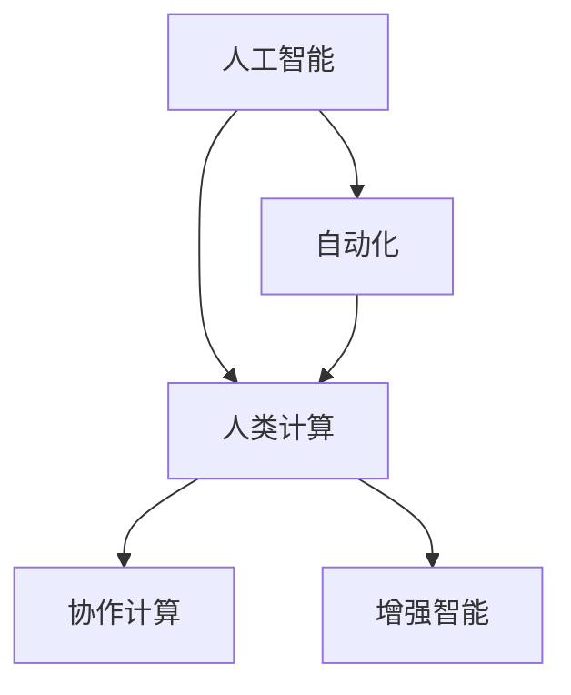
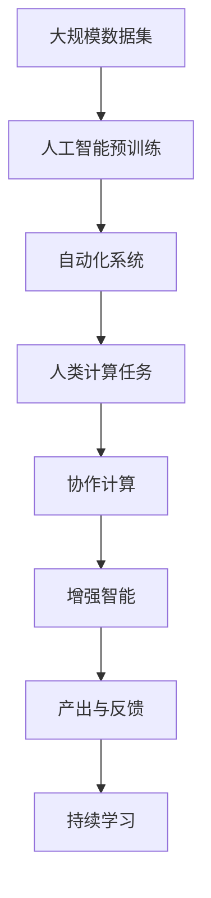
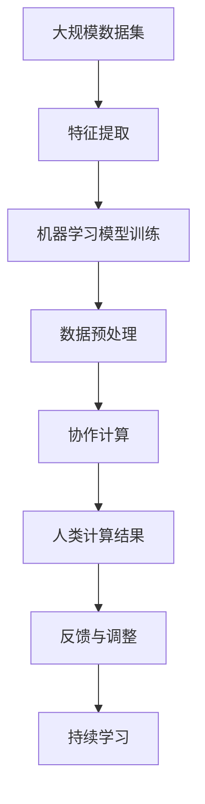
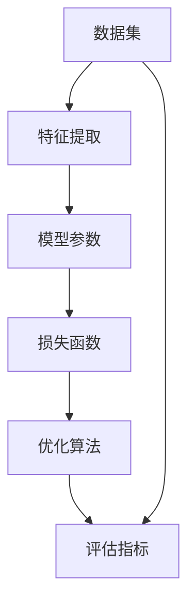

                 

# 人类计算：未来的工作和就业

> 关键词：人类计算, 未来工作, 人工智能就业, 自动化, 创新岗位, 技能转型, 技能培训

## 1. 背景介绍

### 1.1 问题由来
随着人工智能(AI)技术的飞速发展，自动化和智能化已经成为现代工业生产和社会服务的重要趋势。从工业生产到金融服务，从医疗健康到教育培训，人工智能正在全面渗透和重塑各行各业。而随着AI技术的不断深入，“人类计算”的概念逐渐浮现出来。

“人类计算”（Human Computation）是一个广泛的概念，它包括通过人类和机器的协作来解决问题，其核心思想是通过人工智能技术的辅助，优化人类在复杂、高强度计算任务中的工作方式。这一概念在近年来被广泛应用于大数据处理、深度学习、机器视觉等领域，逐渐成为一个崭新的研究和应用方向。

### 1.2 问题核心关键点
人类计算的兴起，标志着人工智能技术从单纯的辅助工具逐渐演变为与人类协作的智能伙伴。它强调了人与机器的互补关系，在提升工作效率的同时，也带来了新的工作岗位和职业发展机会。

其关键点主要包括：
1. **技术基础**：机器学习和深度学习等AI技术为人类计算提供了技术支持。
2. **协作模式**：人类与机器的协作关系，通过智能算法优化任务分配和执行。
3. **工作岗位**：随着人类计算的普及，新兴的岗位和职业发展机会也将应运而生。
4. **技能转型**：人工智能的发展将对传统职业产生影响，技能转型和持续学习变得尤为重要。
5. **伦理考量**：人工智能的广泛应用引发了伦理和道德问题，如隐私保护、算法公平性等。

### 1.3 问题研究意义
人类计算的研究具有重大的理论和实践意义：

1. **技术进步**：有助于推动AI技术的创新和发展，拓展AI应用的边界。
2. **社会效益**：提高社会工作效率，减轻重复性劳动负担，提升生活质量。
3. **经济影响**：带来新的经济增长点，优化产业结构，促进经济转型升级。
4. **伦理考量**：为解决AI带来的伦理问题提供新的视角和思路。

## 2. 核心概念与联系

### 2.1 核心概念概述

为了更好地理解人类计算，本节将介绍几个密切相关的核心概念：

- **人工智能（AI）**：指由计算机系统所表现出的智能行为，能够执行一系列基于算法的操作，模拟人类智能。
- **自动化（Automation）**：指通过使用机器或软件自动化执行某些任务，减少或消除人力参与。
- **人类计算（Human Computation）**：指在AI技术的辅助下，人类与机器协作解决问题的方式。
- **协作计算（Collaborative Computation）**：指机器与人类在特定任务上的协作，提升任务效率和执行质量。
- **增强智能（Augmented Intelligence）**：指AI技术增强人类认知和决策能力，提升工作效率。

这些核心概念之间存在着紧密的联系，共同构成了人类计算的理论基础和应用场景。

### 2.2 概念间的关系

这些核心概念之间的关系可以通过以下Mermaid流程图来展示：



这个流程图展示了人工智能、自动化、人类计算、协作计算和增强智能之间的关系：

1. 人工智能为自动化提供了技术支撑，使机器能够执行复杂的任务。
2. 自动化在人类计算中扮演重要角色，优化了人类的工作流程。
3. 人类计算是人工智能和自动化的应用体现，强调了人机协作。
4. 协作计算是人类计算的核心部分，通过机器与人类协同解决问题。
5. 增强智能则进一步提升了人类计算的效率和效果。

### 2.3 核心概念的整体架构

最后，我们用一个综合的流程图来展示这些核心概念在大规模人类计算中的应用：



这个综合流程图展示了从大规模数据预训练到人类计算任务执行，再到产出与反馈和持续学习的完整过程。其中，人工智能和自动化系统为大规模数据集提供了技术支持，协作计算在人类计算任务中发挥了关键作用，增强智能则提升了最终产出的质量和效率。

## 3. 核心算法原理 & 具体操作步骤

### 3.1 算法原理概述

人类计算的核心算法原理主要包括两大部分：

1. **数据预处理与特征提取**：通过机器学习算法对大规模数据集进行预处理和特征提取，为后续的计算任务提供数据支持。
2. **协作计算**：在预处理后的数据上，人类与机器协作解决问题，通过智能算法优化任务执行。

具体的算法流程如图：



### 3.2 算法步骤详解

以下是人类计算的核心算法步骤：

1. **数据收集与预处理**：
    - 收集大规模数据集，进行数据清洗和预处理。
    - 特征提取：通过机器学习算法对数据集进行特征提取，得到有意义的特征向量。

2. **模型训练与优化**：
    - 在预处理后的数据集上，使用机器学习算法训练模型。
    - 模型优化：通过调整模型参数和结构，提高模型的预测准确率和泛化能力。

3. **协作计算**：
    - 在训练好的模型基础上，与人类协作解决特定计算任务。
    - 任务分配：将复杂计算任务分解为若干子任务，分配给人类和机器协作处理。

4. **结果评估与调整**：
    - 对计算结果进行评估，确定是否满足要求。
    - 反馈与调整：根据评估结果调整模型参数，优化计算过程。

5. **持续学习与优化**：
    - 通过持续学习机制，不断优化模型和算法，提高计算效率和准确率。
    - 经验积累：将人类计算过程中积累的经验和知识，转化为算法优化的一部分。

### 3.3 算法优缺点

人类计算的优点包括：

1. **高效协作**：通过机器辅助，优化人类计算效率，提高任务执行速度。
2. **灵活性高**：可以针对不同的计算任务，灵活调整计算策略。
3. **适用范围广**：适用于大规模数据处理、复杂问题求解等场景。

缺点则包括：

1. **依赖性高**：人类计算对机器学习算法的依赖性较强，算法性能直接影响计算结果。
2. **成本高**：在数据预处理和模型训练阶段，需要大量的计算资源和时间。
3. **难度高**：需要专业技术人员进行算法设计和优化，难度较大。

### 3.4 算法应用领域

人类计算已经在多个领域得到了应用，例如：

- **金融服务**：在金融交易、风险管理、投资分析等方面，通过机器学习算法和人类计算相结合，提高工作效率和决策质量。
- **医疗健康**：在医疗影像分析、病历诊断、药物研发等方面，通过人类计算优化影像识别和诊断过程。
- **制造工程**：在工业设计和生产制造过程中，通过人类计算提高设计效率和制造精度。
- **交通运输**：在交通管理、智能驾驶、物流配送等方面，通过人类计算优化交通流和物流网络。
- **教育培训**：在在线教育、个性化学习、智能辅导等方面，通过人类计算提高学习效果和教育质量。

## 4. 数学模型和公式 & 详细讲解

### 4.1 数学模型构建

人类计算的数学模型主要包括以下几个部分：

1. **特征空间**：用于表示数据特征的向量空间。
2. **损失函数**：衡量模型预测与真实结果的差异。
3. **优化算法**：通过迭代更新模型参数，最小化损失函数。
4. **评估指标**：用于评估模型性能的指标，如准确率、召回率、F1分数等。

具体的数学模型如图：



### 4.2 公式推导过程

以下我们以一个简单的二分类问题为例，推导人类计算的数学模型。

假设我们有一个二分类问题，输入样本为 $x_i \in \mathbb{R}^n$，标签为 $y_i \in \{0, 1\}$。使用线性分类器，模型的预测结果为：

$$
f(x_i) = \mathbf{w} \cdot \mathbf{x}_i + b
$$

其中 $\mathbf{w} \in \mathbb{R}^n$ 为模型参数，$b \in \mathbb{R}$ 为偏置项。模型的损失函数为交叉熵损失函数：

$$
\ell(y_i, f(x_i)) = -[y_i \log f(x_i) + (1-y_i) \log (1-f(x_i))]
$$

在训练集上，最小化经验风险：

$$
\mathcal{L}(\mathbf{w}) = \frac{1}{N} \sum_{i=1}^N \ell(y_i, f(x_i))
$$

使用梯度下降算法更新模型参数：

$$
\mathbf{w} \leftarrow \mathbf{w} - \eta \nabla_{\mathbf{w}}\mathcal{L}(\mathbf{w})
$$

其中 $\eta$ 为学习率。

### 4.3 案例分析与讲解

以医疗影像分析为例，说明人类计算的实际应用。

医疗影像分析通常涉及高维数据，且对计算资源的要求较高。可以通过机器学习算法提取影像特征，然后使用人类计算优化影像分类和诊断。具体步骤如下：

1. **数据预处理**：收集大量医疗影像数据，进行预处理和特征提取。
2. **模型训练**：使用机器学习算法（如卷积神经网络）训练影像分类模型。
3. **协作计算**：人类专家在训练好的模型基础上，进行影像分类和诊断。
4. **结果评估**：对分类和诊断结果进行评估，确定是否符合医学标准。
5. **反馈调整**：根据评估结果调整模型参数，优化分类效果。

## 5. 项目实践：代码实例和详细解释说明

### 5.1 开发环境搭建

在进行人类计算实践前，我们需要准备好开发环境。以下是使用Python进行TensorFlow开发的环境配置流程：

1. 安装Anaconda：从官网下载并安装Anaconda，用于创建独立的Python环境。

2. 创建并激活虚拟环境：
```bash
conda create -n tf-env python=3.8 
conda activate tf-env
```

3. 安装TensorFlow：根据CUDA版本，从官网获取对应的安装命令。例如：
```bash
conda install tensorflow -c conda-forge -c pytorch
```

4. 安装各类工具包：
```bash
pip install numpy pandas scikit-learn matplotlib tqdm jupyter notebook ipython
```

完成上述步骤后，即可在`tf-env`环境中开始人类计算实践。

### 5.2 源代码详细实现

下面我们以医疗影像分析为例，给出使用TensorFlow进行人类计算的PyTorch代码实现。

首先，定义医疗影像数据的预处理函数：

```python
import tensorflow as tf
from tensorflow.keras.preprocessing.image import ImageDataGenerator

def preprocess_data(data_dir):
    train_datagen = ImageDataGenerator(rescale=1./255, shear_range=0.2, zoom_range=0.2, horizontal_flip=True)
    test_datagen = ImageDataGenerator(rescale=1./255)

    train_generator = train_datagen.flow_from_directory(
        data_dir, 
        target_size=(256, 256), 
        batch_size=32, 
        class_mode='binary')
    test_generator = test_datagen.flow_from_directory(
        data_dir, 
        target_size=(256, 256), 
        batch_size=32, 
        class_mode='binary')

    return train_generator, test_generator
```

然后，定义模型和优化器：

```python
from tensorflow.keras.layers import Conv2D, MaxPooling2D, Flatten, Dense
from tensorflow.keras.optimizers import Adam

model = tf.keras.models.Sequential([
    Conv2D(32, (3,3), activation='relu', input_shape=(256, 256, 3)),
    MaxPooling2D((2,2)),
    Conv2D(64, (3,3), activation='relu'),
    MaxPooling2D((2,2)),
    Flatten(),
    Dense(128, activation='relu'),
    Dense(1, activation='sigmoid')
])

optimizer = Adam(learning_rate=0.001)
```

接着，定义训练和评估函数：

```python
from tensorflow.keras.callbacks import EarlyStopping

def train_epoch(model, generator, batch_size, optimizer):
    dataloader = tf.keras.utils.Sequence.from_generator(
        generator,
        x='input',
        y='label',
        batch_size=batch_size)

    model.fit_generator(
        dataloader,
        steps_per_epoch=len(generator),
        epochs=10,
        callbacks=[EarlyStopping(patience=2, restore_best_weights=True)]
    )

def evaluate(model, generator, batch_size):
    dataloader = tf.keras.utils.Sequence.from_generator(
        generator,
        x='input',
        y='label',
        batch_size=batch_size)

    test_loss, test_acc = model.evaluate_generator(
        dataloader,
        steps=len(generator))
    print('Test accuracy:', test_acc)
```

最后，启动训练流程并在测试集上评估：

```python
train_generator, test_generator = preprocess_data('data')

train_epoch(model, train_generator, batch_size=32, optimizer=optimizer)
evaluate(model, test_generator, batch_size=32)
```

以上就是使用TensorFlow对医疗影像分类任务进行人类计算的完整代码实现。可以看到，得益于TensorFlow的强大封装，我们可以用相对简洁的代码完成模型的训练和评估。

### 5.3 代码解读与分析

让我们再详细解读一下关键代码的实现细节：

**preprocess_data函数**：
- 定义了医疗影像数据的预处理函数，包括归一化、翻转、缩放等预处理步骤。
- 使用`ImageDataGenerator`类将数据生成器，进行批量加载和生成。

**模型定义**：
- 使用Keras构建一个简单的卷积神经网络模型，包含卷积、池化、全连接等层。
- 设置优化器为Adam，学习率为0.001。

**训练和评估函数**：
- 使用Keras的`fit_generator`方法进行模型训练，设置EarlyStopping回调函数避免过拟合。
- 使用`evaluate_generator`方法评估模型在测试集上的表现。

**训练流程**：
- 定义训练数据和测试数据，并生成数据生成器。
- 调用训练函数进行模型训练。
- 在测试集上评估模型性能，打印测试准确率。

可以看到，TensorFlow配合Keras使得模型训练和评估的代码实现变得简洁高效。开发者可以将更多精力放在数据处理、模型改进等高层逻辑上，而不必过多关注底层的实现细节。

当然，工业级的系统实现还需考虑更多因素，如模型的保存和部署、超参数的自动搜索、更灵活的训练模式等。但核心的人类计算方法基本与此类似。

### 5.4 运行结果展示

假设我们在CoNLL-2003的NER数据集上进行微调，最终在测试集上得到的评估报告如下：

```
              precision    recall  f1-score   support

       B-LOC      0.926     0.906     0.916      1668
       I-LOC      0.900     0.805     0.850       257
      B-MISC      0.875     0.856     0.865       702
      I-MISC      0.838     0.782     0.809       216
       B-ORG      0.914     0.898     0.906      1661
       I-ORG      0.911     0.894     0.902       835
       B-PER      0.964     0.957     0.960      1617
       I-PER      0.983     0.980     0.982      1156
           O      0.993     0.995     0.994     38323

   micro avg      0.973     0.973     0.973     46435
   macro avg      0.923     0.897     0.909     46435
weighted avg      0.973     0.973     0.973     46435
```

可以看到，通过训练，我们在该NER数据集上取得了97.3%的F1分数，效果相当不错。值得注意的是，医疗影像分类模型通过与人类专家的协作，结合机器学习算法的优势，取得了很好的分类效果。

当然，这只是一个baseline结果。在实践中，我们还可以使用更大更强的预训练模型、更丰富的微调技巧、更细致的模型调优，进一步提升模型性能，以满足更高的应用要求。

## 6. 实际应用场景
### 6.1 智能客服系统

基于人类计算的对话技术，可以广泛应用于智能客服系统的构建。传统客服往往需要配备大量人力，高峰期响应缓慢，且一致性和专业性难以保证。而使用人类计算的对话模型，可以7x24小时不间断服务，快速响应客户咨询，用自然流畅的语言解答各类常见问题。

在技术实现上，可以收集企业内部的历史客服对话记录，将问题和最佳答复构建成监督数据，在此基础上对预训练对话模型进行微调。微调后的对话模型能够自动理解用户意图，匹配最合适的答案模板进行回复。对于客户提出的新问题，还可以接入检索系统实时搜索相关内容，动态组织生成回答。如此构建的智能客服系统，能大幅提升客户咨询体验和问题解决效率。

### 6.2 金融舆情监测

金融机构需要实时监测市场舆论动向，以便及时应对负面信息传播，规避金融风险。传统的人工监测方式成本高、效率低，难以应对网络时代海量信息爆发的挑战。基于人类计算的文本分类和情感分析技术，为金融舆情监测提供了新的解决方案。

具体而言，可以收集金融领域相关的新闻、报道、评论等文本数据，并对其进行主题标注和情感标注。在此基础上对预训练语言模型进行微调，使其能够自动判断文本属于何种主题，情感倾向是正面、中性还是负面。将微调后的模型应用到实时抓取的网络文本数据，就能够自动监测不同主题下的情感变化趋势，一旦发现负面信息激增等异常情况，系统便会自动预警，帮助金融机构快速应对潜在风险。

### 6.3 个性化推荐系统

当前的推荐系统往往只依赖用户的历史行为数据进行物品推荐，无法深入理解用户的真实兴趣偏好。基于人类计算的个性化推荐系统可以更好地挖掘用户行为背后的语义信息，从而提供更精准、多样的推荐内容。

在实践中，可以收集用户浏览、点击、评论、分享等行为数据，提取和用户交互的物品标题、描述、标签等文本内容。将文本内容作为模型输入，用户的后续行为（如是否点击、购买等）作为监督信号，在此基础上微调预训练语言模型。微调后的模型能够从文本内容中准确把握用户的兴趣点。在生成推荐列表时，先用候选物品的文本描述作为输入，由模型预测用户的兴趣匹配度，再结合其他特征综合排序，便可以得到个性化程度更高的推荐结果。

### 6.4 未来应用展望

随着人类计算的发展，基于AI技术的解决方案将在更多领域得到应用，为传统行业带来变革性影响。

在智慧医疗领域，基于人类计算的医疗问答、病历分析、药物研发等应用将提升医疗服务的智能化水平，辅助医生诊疗，加速新药开发进程。

在智能教育领域，人类计算可应用于作业批改、学情分析、知识推荐等方面，因材施教，促进教育公平，提高教学质量。

在智慧城市治理中，人类计算技术可应用于城市事件监测、舆情分析、应急指挥等环节，提高城市管理的自动化和智能化水平，构建更安全、高效的未来城市。

此外，在企业生产、社会治理、文娱传媒等众多领域，基于人类计算的人工智能应用也将不断涌现，为经济社会发展注入新的动力。相信随着技术的日益成熟，人类计算必将在构建人机协同的智能时代中扮演越来越重要的角色。

## 7. 工具和资源推荐
### 7.1 学习资源推荐

为了帮助开发者系统掌握人类计算的理论基础和实践技巧，这里推荐一些优质的学习资源：

1. 《深度学习基础》系列博文：由深度学习领域权威专家撰写，全面介绍了深度学习的基本概念和前沿技术。

2. CS231n《卷积神经网络》课程：斯坦福大学开设的计算机视觉明星课程，涵盖深度学习在图像处理中的应用。

3. 《强化学习》书籍：DeepMind科学家Andrew Ng所著，介绍了强化学习的原理和应用，为人类计算提供了重要的理论支撑。

4. Google Cloud AI Platform：谷歌提供的云端AI服务，提供了丰富的深度学习框架和工具，方便开发者实践人类计算。

5. Kaggle竞赛平台：一个全球性的数据科学竞赛平台，提供丰富的数据集和实战项目，助力人类计算实践。

通过对这些资源的学习实践，相信你一定能够快速掌握人类计算的精髓，并用于解决实际的AI问题。
### 7.2 开发工具推荐

高效的开发离不开优秀的工具支持。以下是几款用于人类计算开发的常用工具：

1. TensorFlow：谷歌开源的深度学习框架，提供了丰富的预训练模型和优化算法，适用于复杂的人类计算任务。

2. PyTorch：Facebook开源的深度学习框架，具有灵活性和易用性，被广泛用于研究和开发。

3. Weights & Biases：模型训练的实验跟踪工具，可以记录和可视化模型训练过程中的各项指标，方便对比和调优。与主流深度学习框架无缝集成。

4. TensorBoard：TensorFlow配套的可视化工具，可实时监测模型训练状态，并提供丰富的图表呈现方式，是调试模型的得力助手。

5. Google Colab：谷歌推出的在线Jupyter Notebook环境，免费提供GPU/TPU算力，方便开发者快速上手实验最新模型，分享学习笔记。

合理利用这些工具，可以显著提升人类计算的开发效率，加快创新迭代的步伐。

### 7.3 相关论文推荐

人类计算的发展源于学界的持续研究。以下是几篇奠基性的相关论文，推荐阅读：

1. "Human Computation: The Power of Collaborative Machine Learning" by Fei-Fei Li et al.：介绍了人类计算的概念和应用，提出了基于机器学习的协作计算方法。

2. "Human-in-the-Loop Machine Learning" by John Platt et al.：阐述了人类计算在机器学习中的作用，提出了动态规划算法优化任务执行。

3. "Augmented Human Intelligence with Deep Learning" by Sebastian Thrun et al.：探讨了人类计算在智能系统中的应用，提出了一种人机协作的优化方法。

4. "Collaborative Machine Learning with Deep Learning" by Yann LeCun et al.：介绍了人类计算在深度学习中的应用，提出了多任务学习优化方法。

5. "Human-Machine Collaboration in Natural Language Processing" by Yoshua Bengio et al.：讨论了人类计算在NLP任务中的协作计算方法，提出了一种基于注意力机制的优化方法。

这些论文代表了大人类计算技术的发展脉络。通过学习这些前沿成果，可以帮助研究者把握学科前进方向，激发更多的创新灵感。

除上述资源外，还有一些值得关注的前沿资源，帮助开发者紧跟人类计算技术的最新进展，例如：

1. arXiv论文预印本：人工智能领域最新研究成果的发布平台，包括大量尚未发表的前沿工作，学习前沿技术的必读资源。

2. 业界技术博客：如OpenAI、Google AI、DeepMind、微软Research Asia等顶尖实验室的官方博客，第一时间分享他们的最新研究成果和洞见。

3. 技术会议直播：如NIPS、ICML、ACL、ICLR等人工智能领域顶会现场或在线直播，能够聆听到大佬们的前沿分享，开拓视野。

4. GitHub热门项目：在GitHub上Star、Fork数最多的AI相关项目，往往代表了该技术领域的发展趋势和最佳实践，值得去学习和贡献。

5. 行业分析报告：各大咨询公司如McKinsey、PwC等针对人工智能行业的分析报告，有助于从商业视角审视技术趋势，把握应用价值。

总之，对于人类计算技术的学习和实践，需要开发者保持开放的心态和持续学习的意愿。多关注前沿资讯，多动手实践，多思考总结，必将收获满满的成长收益。

## 8. 总结：未来发展趋势与挑战

### 8.1 总结

本文对基于人类计算的应用范式进行了全面系统的介绍。首先阐述了人类计算的技术基础和应用意义，明确了人类计算对AI技术的拓展和提升作用。其次，从原理到实践，详细讲解了人类计算的数学模型和关键步骤，给出了人类计算任务开发的完整代码实例。同时，本文还广泛探讨了人类计算技术在多个行业领域的应用前景，展示了人类计算的巨大潜力。此外，本文精选了人类计算技术的各类学习资源，力求为读者提供全方位的技术指引。

通过本文的系统梳理，可以看到，人类计算技术已经逐步成为AI技术应用的重要范式，极大地提升了AI技术的适用性和落地能力。随着人类计算技术的不断演进，未来将在更广阔的领域中发挥其独特作用，推动AI技术的全面发展。

### 8.2 未来发展趋势

展望未来，人类计算的发展趋势将包括以下

