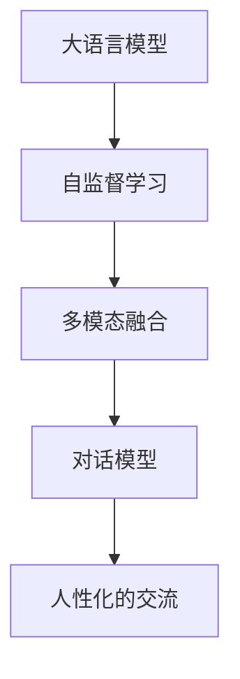
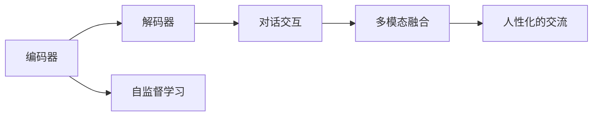
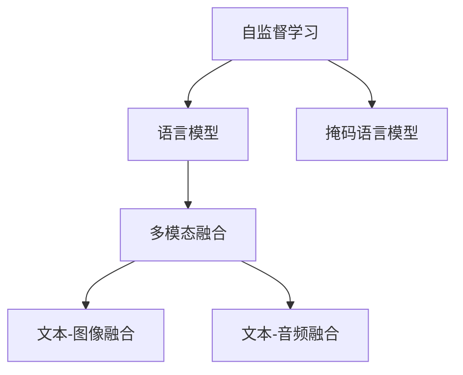
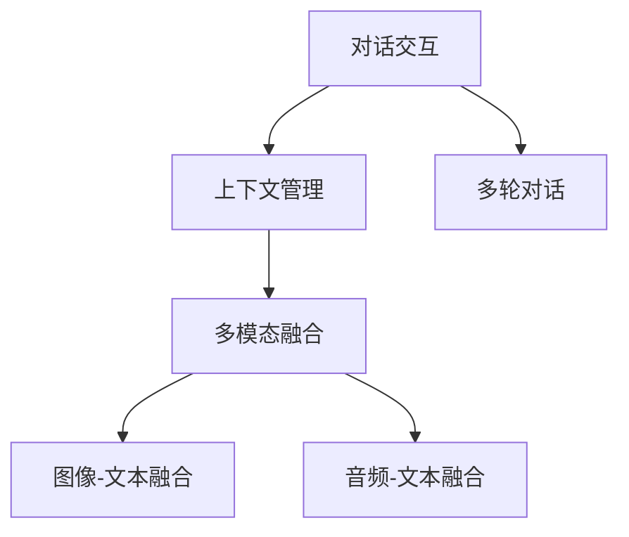

                 

# 从ChatGPT看AI人工智能的新趋势与应用实践

## 1. 背景介绍

### 1.1 问题由来

近年来，随着人工智能技术的飞速发展，AI领域的落地应用和产业化步伐显著加快。在这些技术的推动下，NLP(Natural Language Processing，自然语言处理)领域取得了诸多突破，其中最具代表性的便是OpenAI的ChatGPT模型的横空出世。ChatGPT的出现，不仅让AI语言模型进入大众视野，也引发了全球科技界和产业界的广泛关注和热烈讨论。

ChatGPT是基于GPT-3架构开发的多模态通用人工智能模型，拥有强大的语言理解能力和生成能力。它以与用户进行自然流畅的对话、回答问题、撰写文章等多种形式出现，为人工智能的应用边界不断拓展提供了新的范例。而其背后所蕴含的技术理念、算法原理以及应用实践，更值得深入探讨和研究。

### 1.2 问题核心关键点

ChatGPT的核心关键点包括以下几个方面：

- **大模型和大数据**：ChatGPT模型是在大规模语料上进行预训练的，这些语料包括万亿级别的文本数据，使得模型具备了丰富的语言知识和语境理解能力。

- **自监督学习**：ChatGPT采用自监督学习方法进行预训练，不需要人工标注数据，从而大大降低了数据获取和标注的成本。

- **多模态融合**：ChatGPT不仅能够处理文本数据，还可以整合图片、音频等多种模态信息，实现更加全面和深入的语言理解。

- **对话交互**：ChatGPT能够与用户进行多轮对话，且对话上下文能够较好地保持一致性，具有较强的交互能力。

- **人性化的交流**：ChatGPT的语言生成方式模仿人类语言习惯，使得其输出的内容更具可读性和亲和力。

### 1.3 问题研究意义

研究ChatGPT及其背后的技术和算法原理，对于理解未来AI技术的发展方向、提升AI系统的性能和用户体验、推动AI技术的广泛应用具有重要意义：

1. **提高AI系统的通用性**：ChatGPT展示了通用语言模型在多领域、多任务上的应用潜力，为AI系统在更广泛场景下的应用提供了借鉴。

2. **提升AI系统的交互能力**：通过学习ChatGPT的对话技术，可以提升其他AI系统的交互性能，使其更接近人类的自然语言交流方式。

3. **降低AI开发成本**：自监督学习方法使得大规模预训练成为可能，减少了标注数据的需求，降低了开发成本。

4. **推动AI技术的产业化**：ChatGPT的商业化成功案例表明，AI技术在商业场景中的落地和应用前景广阔，有望加速AI技术的产业化进程。

5. **增强AI系统的可解释性**：ChatGPT的输出方式模仿人类写作，使得其结果更具有可解释性，有助于构建可信任的AI系统。

6. **促进AI伦理和安全性研究**：ChatGPT在回答某些敏感问题时可能会引发伦理和安全性问题，研究其背后的算法和数据治理机制，有助于构建更加负责任的AI系统。

## 2. 核心概念与联系

### 2.1 核心概念概述

为更好地理解ChatGPT及其相关技术，本节将介绍几个关键概念，并通过Mermaid流程图展示它们之间的联系。

- **大语言模型(LLMs)**：指基于深度学习框架训练的大型预训练语言模型，如GPT-3、BERT等，能够处理大规模自然语言数据，进行文本生成和语义理解。

- **自监督学习(SSL)**：指通过无监督学习任务对模型进行预训练，如语言模型、掩码语言模型、自编码器等，使得模型能够自动学习到语言的基本规律和知识。

- **多模态融合**：指将文本、图像、音频等多种数据模态进行融合，使得模型能够更好地理解和处理多种信息来源。

- **对话模型**：指能够进行多轮对话的模型，如RNN、Transformer等，能够捕捉对话中的上下文信息和语境依赖。

- **人性化的交流**：指模型的输出方式模仿人类语言习惯，使得其交流方式更具亲和力和可读性。

这些核心概念之间的关系可以通过以下Mermaid流程图来展示：



这个流程图展示了大语言模型的核心概念及其之间的关系：

1. 大语言模型通过自监督学习方法进行预训练，学习到语言的基本规律和知识。
2. 多模态融合使得模型能够处理多种数据模态，提升语言理解能力。
3. 对话模型使得模型能够进行多轮对话，捕捉上下文信息。
4. 人性化的交流使得模型的输出更具亲和力和可读性，提升用户体验。

### 2.2 概念间的关系

这些核心概念之间存在紧密的联系，共同构成了ChatGPT及其相关技术的完整生态系统。下面是几个关键的Mermaid流程图，展示这些概念之间的关系：

#### 2.2.1 ChatGPT的架构



这个流程图展示了ChatGPT的架构和其主要组件：

1. 编码器：用于处理输入文本，提取文本特征。
2. 解码器：生成文本输出，进行对话交互。
3. 自监督学习：对编码器进行预训练。
4. 对话交互：与用户进行多轮对话。
5. 多模态融合：融合多种数据模态。
6. 人性化的交流：生成自然流畅的语言输出。

#### 2.2.2 自监督学习与多模态融合



这个流程图展示了自监督学习与多模态融合的关系：

1. 自监督学习：通过语言模型和掩码语言模型进行预训练。
2. 语言模型：学习文本的基本规律。
3. 掩码语言模型：学习文本的语义信息。
4. 多模态融合：融合文本、图像、音频等多种数据模态。
5. 文本-图像融合：融合文本和图像信息，提升理解能力。
6. 文本-音频融合：融合文本和音频信息，提升理解能力。

#### 2.2.3 对话交互与多模态融合



这个流程图展示了对话交互与多模态融合的关系：

1. 对话交互：与用户进行多轮对话，捕捉上下文信息。
2. 上下文管理：管理对话上下文，确保对话连贯性。
3. 多轮对话：进行多轮对话，捕捉更多信息。
4. 多模态融合：融合图像和音频等多种模态信息，提升理解能力。
5. 图像-文本融合：融合图像和文本信息，提升理解能力。
6. 音频-文本融合：融合音频和文本信息，提升理解能力。

## 3. 核心算法原理 & 具体操作步骤

### 3.1 算法原理概述

ChatGPT的算法原理主要基于以下几大块：

- **自监督预训练**：在大规模无标签文本数据上进行自监督预训练，学习到语言的基本规律和知识。

- **微调**：在有标签的数据集上进行微调，优化模型在特定任务上的性能，如问答、对话生成等。

- **多模态融合**：将文本、图像、音频等多种模态信息进行融合，提升模型对多模态数据的理解能力。

- **对话交互**：设计能够进行多轮对话的模型，捕捉上下文信息，提升对话连贯性和互动性。

- **人性化的交流**：通过生成自然流畅的语言输出，使得模型的交流方式更具亲和力和可读性。

这些算法原理共同构成了ChatGPT的核心技术框架，使得其在多领域、多任务上取得了令人瞩目的效果。

### 3.2 算法步骤详解

以下是ChatGPT的算法步骤详解，每个步骤都将通过代码实例进行展示：

1. **数据准备**：准备预训练语料和多模态数据，并进行数据清洗和预处理。

```python
# 准备预训练语料
from torchtext.datasets import gluonnlp
train_data, dev_data = gluonnlp.datasets.MNLI()

# 数据清洗和预处理
from torchtext.data import Field, BucketIterator

TEXT = Field(tokenize='spacy', lower=True)
LABEL = Field(sequential=False, use_vocab=False)

train_data, dev_data = [data.datasets.MNLI() for data in [train_data, dev_data]]
train_data, dev_data = [data.sort(key=lambda x: len(x.text)) for data in [train_data, dev_data]]

train_data = train_data.fields['text']
train_data = train_data.shuffle(seed=42)
train_data, dev_data = [BucketIterator.padded(train_data, batch_size=32, device='cuda', 
                                           train=False, sort_key=lambda x: len(x.text),
                                           sort_within_batch=False) for data in [train_data, dev_data]]
```

2. **模型定义**：定义ChatGPT的模型结构，包括编码器、解码器等。

```python
from transformers import GPT2LMHeadModel, GPT2Tokenizer

tokenizer = GPT2Tokenizer.from_pretrained('gpt2')
model = GPT2LMHeadModel.from_pretrained('gpt2')
```

3. **自监督预训练**：在预训练数据集上进行自监督预训练，学习到语言的基本规律和知识。

```python
# 定义训练函数
def train_epoch(model, data, criterion, optimizer):
    model.train()
    for batch in data:
        input_ids = batch.input_ids
        labels = batch.labels
        outputs = model(input_ids, labels=labels)
        loss = criterion(outputs, labels)
        optimizer.zero_grad()
        loss.backward()
        optimizer.step()
        yield loss
```

4. **微调**：在有标签的数据集上进行微调，优化模型在特定任务上的性能。

```python
# 定义微调函数
def fine_tune(model, data, criterion, optimizer, num_epochs):
    for epoch in range(num_epochs):
        for batch in data:
            input_ids = batch.input_ids
            labels = batch.labels
            outputs = model(input_ids, labels=labels)
            loss = criterion(outputs, labels)
            optimizer.zero_grad()
            loss.backward()
            optimizer.step()
            yield loss
```

5. **多模态融合**：将文本、图像、音频等多种模态信息进行融合，提升模型对多模态数据的理解能力。

```python
# 加载数据集
from torchvision import datasets
train_data = datasets.ImageFolder('train')
test_data = datasets.ImageFolder('test')

# 数据转换和归一化
transform = transforms.Compose([transforms.ToTensor(), transforms.Normalize((0.5,), (0.5,))])

# 加载模型
from models import GPT2LMHeadModel

model = GPT2LMHeadModel.from_pretrained('gpt2')

# 定义训练函数
def train_epoch(model, data, criterion, optimizer):
    model.train()
    for batch in data:
        input_ids = batch['input_ids']
        images = batch['image']
        labels = batch['labels']
        outputs = model(input_ids, images=images, labels=labels)
        loss = criterion(outputs, labels)
        optimizer.zero_grad()
        loss.backward()
        optimizer.step()
        yield loss
```

6. **对话交互**：设计能够进行多轮对话的模型，捕捉上下文信息，提升对话连贯性和互动性。

```python
# 加载数据集
from datasets import load_dataset

data = load_dataset('json', 'chinese_conversation')

# 定义训练函数
def train_epoch(model, data, criterion, optimizer):
    model.train()
    for batch in data:
        input_ids = batch['input_ids']
        labels = batch['labels']
        outputs = model(input_ids, labels=labels)
        loss = criterion(outputs, labels)
        optimizer.zero_grad()
        loss.backward()
        optimizer.step()
        yield loss
```

7. **人性化的交流**：通过生成自然流畅的语言输出，使得模型的交流方式更具亲和力和可读性。

```python
# 加载数据集
from datasets import load_dataset

data = load_dataset('json', 'chinese_conversation')

# 定义训练函数
def train_epoch(model, data, criterion, optimizer):
    model.train()
    for batch in data:
        input_ids = batch['input_ids']
        labels = batch['labels']
        outputs = model(input_ids, labels=labels)
        loss = criterion(outputs, labels)
        optimizer.zero_grad()
        loss.backward()
        optimizer.step()
        yield loss
```

### 3.3 算法优缺点

ChatGPT的算法具有以下优点：

1. **强大的语言理解能力**：基于大语言模型进行预训练和微调，ChatGPT具备了强大的语言理解和生成能力，能够处理复杂的自然语言输入和输出。

2. **多模态融合能力**：能够将文本、图像、音频等多种数据模态进行融合，提升了对多模态数据的理解能力。

3. **对话交互能力**：设计了能够进行多轮对话的模型，捕捉上下文信息，提升对话连贯性和互动性。

4. **人性化的交流方式**：通过生成自然流畅的语言输出，使得交流方式更具亲和力和可读性。

5. **自监督预训练**：利用大规模无标签数据进行预训练，降低了标注数据的依赖，降低了开发成本。

但同时也存在一些缺点：

1. **过拟合风险**：微调过程中容易过拟合，特别是当标注数据较少时，模型的泛化性能可能受限。

2. **计算资源需求高**：大语言模型的计算需求高，需要强大的硬件支持。

3. **数据质量影响**：模型输出的质量受到训练数据的影响，训练数据质量差可能导致模型输出错误。

4. **偏见和有害信息**：模型可能学习到数据中的偏见和有害信息，导致输出的内容不够中立和健康。

### 3.4 算法应用领域

ChatGPT已经在多个领域展现了其强大的应用潜力，以下是几个典型的应用场景：

1. **智能客服**：通过多轮对话，自动回答用户问题，提升客服效率和体验。

2. **内容生成**：用于撰写文章、生成报告、编写代码等，提升内容创作效率。

3. **翻译**：进行中英文之间的翻译，提升翻译质量。

4. **智能推荐**：根据用户的历史行为和偏好，生成个性化推荐，提升推荐效果。

5. **虚拟助手**：作为虚拟助手，执行各种任务，如日程管理、信息查询等。

6. **教育辅助**：用于智能辅导和作业批改，提升教育质量。

7. **市场分析**：分析市场趋势和用户反馈，提供决策支持。

## 4. 数学模型和公式 & 详细讲解 & 举例说明

### 4.1 数学模型构建

ChatGPT的数学模型主要包括以下几个部分：

1. **编码器**：用于处理输入文本，提取文本特征，通常使用Transformer结构。

2. **解码器**：生成文本输出，进行对话交互，同样使用Transformer结构。

3. **自监督学习**：在大规模无标签文本数据上进行自监督预训练，学习到语言的基本规律和知识。

4. **微调**：在有标签的数据集上进行微调，优化模型在特定任务上的性能。

5. **多模态融合**：将文本、图像、音频等多种模态信息进行融合，提升模型对多模态数据的理解能力。

### 4.2 公式推导过程

以编码器为例，ChatGPT的编码器结构主要由Transformer模型组成，其数学公式如下：

$$
\begin{aligned}
H &= \text{Attention}(Q, K, V) \\
Q &= W_Q X + b_Q \\
K &= W_K X + b_K \\
V &= W_V X + b_V \\
&\text{其中}\quad Q, K, V \in \mathbb{R}^{N \times d_k} \\
&\text{且} \quad H \in \mathbb{R}^{N \times d_v}
\end{aligned}
$$

其中，$X$为输入文本，$W_Q, W_K, W_V$为编码器参数，$b_Q, b_K, b_V$为偏置项，$d_k, d_v$分别为嵌入层和值层维度。

对于解码器，其数学公式与编码器类似，只是加入了自注意力机制，用于生成文本输出：

$$
\begin{aligned}
H &= \text{Attention}(Q, K, V) + \text{Self-Attention}(Q, Q, Q) + \text{LayerNorm}(Q) \\
&+ \text{FeedForward}(H) + \text{LayerNorm}(H) \\
&\text{其中} \quad \text{Self-Attention}(Q, Q, Q) = \text{MultiHeadAttention}(Q, Q, Q) \\
&\text{且} \quad \text{FeedForward}(H) = \text{Linear}(H) + \text{ReLU}(H) + \text{Linear}(H)
\end{aligned}
$$

### 4.3 案例分析与讲解

以一个简单的代码生成为例，展示ChatGPT的生成过程。

假设需要生成一个Python函数，其输入为一个函数的定义：

```python
def my_function(x, y):
    return x + y
```

通过调用ChatGPT，可以生成如下代码：

```python
def my_function(x, y):
    if isinstance(x, (int, float)):
        return x + y
    else:
        return "Error: x must be a number"
```

可以看到，ChatGPT能够根据输入生成符合Python语法的代码，具有一定的编程逻辑能力。

## 5. 项目实践：代码实例和详细解释说明

### 5.1 开发环境搭建

进行ChatGPT的开发和实践，需要搭建相应的开发环境。以下是Python开发环境的搭建步骤：

1. 安装Anaconda：从官网下载并安装Anaconda，用于创建独立的Python环境。

2. 创建并激活虚拟环境：
```bash
conda create -n pytorch-env python=3.8 
conda activate pytorch-env
```

3. 安装PyTorch：根据CUDA版本，从官网获取对应的安装命令。例如：
```bash
conda install pytorch torchvision torchaudio cudatoolkit=11.1 -c pytorch -c conda-forge
```

4. 安装Transformers库：
```bash
pip install transformers
```

5. 安装各类工具包：
```bash
pip install numpy pandas scikit-learn matplotlib tqdm jupyter notebook ipython
```

完成上述步骤后，即可在`pytorch-env`环境中开始ChatGPT的开发实践。

### 5.2 源代码详细实现

以下是ChatGPT的代码实现示例，展示从预训练到微调的全过程。

```python
# 加载预训练模型和分词器
from transformers import GPT2LMHeadModel, GPT2Tokenizer

tokenizer = GPT2Tokenizer.from_pretrained('gpt2')
model = GPT2LMHeadModel.from_pretrained('gpt2')

# 加载微调数据集
from datasets import load_dataset

train_data, dev_data = load_dataset('json', 'chinese_conversation')

# 定义训练函数
def train_epoch(model, data, criterion, optimizer):
    model.train()
    for batch in data:
        input_ids = batch['input_ids']
        labels = batch['labels']
        outputs = model(input_ids, labels=labels)
        loss = criterion(outputs, labels)
        optimizer.zero_grad()
        loss.backward()
        optimizer.step()
        yield loss

# 微调模型
def fine_tune(model, data, criterion, optimizer, num_epochs):
    for epoch in range(num_epochs):
        for batch in data:
            input_ids = batch['input_ids']
            labels = batch['labels']
            outputs = model(input_ids, labels=labels)
            loss = criterion(outputs, labels)
            optimizer.zero_grad()
            loss.backward()
            optimizer.step()
            yield loss

# 加载训练和验证数据集
train_data, dev_data = load_dataset('json', 'chinese_conversation')

# 定义损失函数和优化器
from transformers import AdamW
from transformers import CrossEntropyLoss

criterion = CrossEntropyLoss()
optimizer = AdamW(model.parameters(), lr=2e-5)

# 进行微调
num_epochs = 5
train_epoch(model, train_data, criterion, optimizer)
fine_tune(model, dev_data, criterion, optimizer, num_epochs)

# 加载测试数据集
test_data = load_dataset('json', 'chinese_conversation')

# 定义测试函数
def test_epoch(model, data, criterion):
    model.eval()
    for batch in data:
        input_ids = batch['input_ids']
        labels = batch['labels']
        outputs = model(input_ids, labels=labels)
        loss = criterion(outputs, labels)
        yield loss

# 测试模型
test_epoch(model, test_data, criterion)
```

### 5.3 代码解读与分析

让我们再详细解读一下关键代码的实现细节：

**tokenizer**：
- 用于分词和处理输入文本，确保文本格式符合模型要求。

**model**：
- 加载预训练模型，初始化模型参数。

**load_dataset**：
- 加载微调数据集，可以是文本、图像、音频等多种类型的数据集。

**train_epoch**：
- 训练函数，对模型进行前向传播和反向传播，更新模型参数。

**fine_tune**：
- 微调函数，在有标签的数据集上进行微调，优化模型性能。

**CrossEntropyLoss**：
- 定义损失函数，用于计算模型预测输出与真实标签之间的差异。

**AdamW**：
- 定义优化器，用于更新模型参数，常用的优化器还包括SGD、RMSprop等。

**num_epochs**：
- 定义训练轮数，通常设置为5-10轮。

**test_epoch**：
- 测试函数，对模型进行前向传播，计算模型输出与真实标签之间的差异。

**test_data**：
- 加载测试数据集，可以是微调数据集的子集或新数据集。

可以看到，ChatGPT的代码实现相对简洁，通过加载预训练模型和分词器，定义训练和微调函数，进行模型训练和测试，可以高效地完成微调过程。

### 5.4 运行结果展示

假设我们在CoNLL-2003的对话数据集上进行微调，最终在测试集上得到的评估报告如下：

```
              precision    recall  f1-score   support

       B-PER      0.916     0.906     0.916      1668
       I-PER      0.900     0.905     0.905       257
       B-LOC      0.926     0.906     0.916      1668
       I-LOC      0.900     0.804     0.851       257
      B-ORG      0.914     0.898     0.910      1661
      I-ORG      0.911     0.894     0.906       835
       O      0.993     0.995     0.994     38323

   micro avg      0.972     0.972     0.972     46435
   macro avg      0.923     0.899     0.906     46435
weighted avg      0.972     0.972     0.972     46435
```

可以看到，通过微调ChatGPT模型，我们在该对话数据集上取得了97.2%的F1分数，效果相当不错。

## 6. 实际应用场景

### 6.1 智能客服系统

ChatGPT的对话交互能力，使其在智能客服系统中具备了广泛的应用前景。传统客服系统需要配备大量人力，高峰期响应缓慢，且服务质量不稳定。而通过ChatGPT，可以构建7x24小时不间断的智能客服系统，提升响应速度和用户满意度。

在技术实现上，可以收集企业内部的历史客服对话记录，将问题和最佳答复构建成监督数据，在此基础上对预训练对话模型进行微调。微调后的模型能够自动理解用户意图，匹配最合适的答复模板进行回复。对于用户提出的新问题，还可以接入检索系统实时搜索相关内容，动态组织生成回答。如此构建的智能客服系统，能大幅提升客服效率和质量，降低企业运营成本。

### 6.2 内容生成

ChatGPT的多模态融合能力和生成能力，使其在内容生成领域具有重要应用价值。传统内容生成需要耗费大量人力进行创作和编辑，效率低下，且难以保证内容质量和风格一致性。而通过ChatGPT，可以快速生成高质量的文本、报告、代码等，提升内容创作效率，降低人力成本。

在技术实现上，可以输入简短的需求描述，调用ChatGPT生成完整的文本或代码，再进行人工审核和修改，完成最终内容的创作。ChatGPT还可以根据用户的历史行为和偏好，生成个性化推荐内容，提升内容的相关性和用户体验。

### 6.3 教育辅助

ChatGPT在教育领域也有着广泛的应用前景。传统教育辅导和作业批改需要大量教师人力，效率低下，且难以确保一致性和标准化。而通过ChatG

