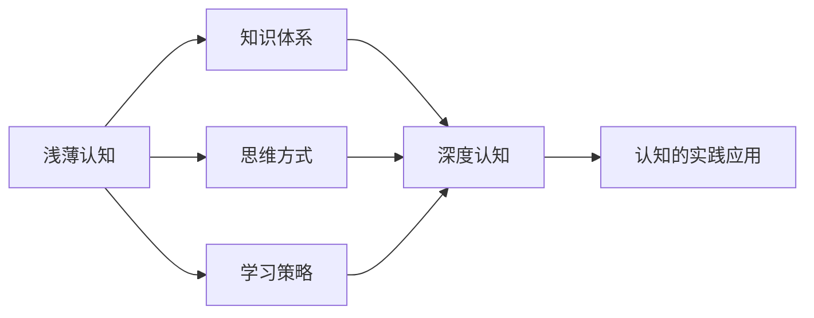
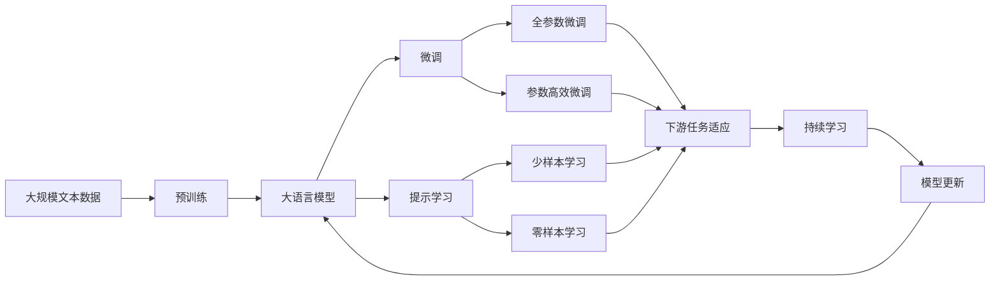

                 

# 从浅薄到深刻的认知转变

## 1. 背景介绍

### 1.1 问题由来

在当今信息爆炸的时代，知识的增长速度远远超出了我们理解和吸收的速度。面对海量的信息，我们往往只能获取到一些浅层的、表面的认知，而难以触及深层的、本质的理解。这一问题不仅出现在我们的日常生活中，也在学习、工作、科研等各个领域中频繁出现。如何从浅薄的认知中，跃升到深刻的理解，成为我们亟需解决的问题。

### 1.2 问题核心关键点

要解决从浅薄到深刻认知的转变，首先需要理解问题的本质。问题的核心关键点在于如何通过深入的学习和思考，从浅层的认知中抽丝剥茧，挖掘出深层次的、有价值的知识。这不仅需要具备扎实的基础知识，还需要掌握科学的思维方式和有效的学习策略。

### 1.3 问题研究意义

解决从浅薄到深刻认知的转变，对于个人成长、学术研究、产业应用等各个方面都有重要意义：

1. **个人成长**：通过系统化的学习和深入思考，构建深层次的知识体系，提升认知水平，培养解决问题的能力。
2. **学术研究**：在科研过程中，深入理解问题的本质，发掘更深层次的规律，推动学科的发展和创新。
3. **产业应用**：在实际工作中，通过深度的理解和应用，优化产品和服务的质量，提升企业的竞争力和市场占有率。

## 2. 核心概念与联系

### 2.1 核心概念概述

为了更好地理解和解决从浅薄到深刻认知的转变，首先需要理解一些关键的核心概念：

- **浅薄认知**：通常指对事物表面现象的粗略认识，缺乏深度和系统性。
- **深度认知**：通过对事物本质的深入分析，获得全面、系统的理解。
- **知识体系**：系统化、结构化的知识结构，能够帮助我们从多个角度理解和解决问题。
- **思维方式**：解决问题时所采用的思考方式和策略，直接影响认知的深度和广度。
- **学习策略**：有效的学习方法和技巧，能够帮助我们更高效地获取和应用知识。

这些概念之间相互关联，共同构成了从浅薄到深刻认知转变的基础。

### 2.2 概念间的关系

这些核心概念之间的联系可以通过以下Mermaid流程图来展示：



这个流程图展示了从浅薄认知到深度认知的转变过程，其中知识体系、思维方式和学习策略都是不可或缺的因素。只有通过系统的知识体系、科学的思维方式和有效的学习策略，才能从浅薄认知跃升到深度认知，进而将认知应用于实践。

### 2.3 核心概念的整体架构

最后，我们用一个综合的流程图来展示这些核心概念在大语言模型微调过程中的整体架构：



这个综合流程图展示了从预训练到微调，再到持续学习的完整过程。大语言模型通过预训练获得基础能力，通过微调（包括全参数微调和参数高效微调）或提示学习（包括少样本学习和零样本学习）来适应下游任务。最后，通过持续学习技术，模型可以不断学习新知识，同时避免遗忘旧知识。

## 3. 核心算法原理 & 具体操作步骤

### 3.1 算法原理概述

从浅薄到深刻的认知转变，本质上是一个从低维数据到高维表示的学习过程。这一过程可以分为两个主要阶段：第一阶段是从低维数据中提取特征；第二阶段是利用这些特征进行深度表示学习。

### 3.2 算法步骤详解

第一阶段：特征提取

1. **数据准备**：收集和整理相关领域的数据，确保数据的多样性和代表性。
2. **数据预处理**：对数据进行清洗、归一化、标注等预处理，使其适合后续的特征提取。
3. **特征提取**：使用传统的机器学习方法（如SVM、神经网络等）或深度学习方法（如卷积神经网络、循环神经网络等），从原始数据中提取出有意义的特征。

第二阶段：深度表示学习

1. **模型选择**：选择合适的深度学习模型（如BERT、GPT等）作为深度表示学习的工具。
2. **微调训练**：将提取出的特征输入到深度模型中，进行微调训练，学习更高层次的表示。
3. **评估与优化**：使用评估指标（如准确率、F1分数等）对模型性能进行评估，根据评估结果进行优化。

### 3.3 算法优缺点

从浅薄到深刻认知转变算法具有以下优点：

- **高效性**：通过自动化特征提取和深度表示学习，可以大大降低人工干预，提高学习效率。
- **泛化能力**：深度表示学习能够捕捉数据中的复杂模式，提升模型的泛化能力。
- **可解释性**：深度表示学习提供了黑盒化的模型，便于解释和调试。

同时，该算法也存在一些缺点：

- **资源需求**：深度表示学习需要大量的计算资源和时间，尤其是大模型的训练过程。
- **依赖标注数据**：特征提取和深度表示学习都依赖于标注数据，标注数据的质量和数量直接影响算法效果。
- **可解释性不足**：黑盒化的深度模型难以解释其内部决策过程，缺乏透明度。

### 3.4 算法应用领域

从浅薄到深刻认知转变算法广泛应用于以下领域：

1. **自然语言处理(NLP)**：通过微调BERT、GPT等预训练模型，学习文本语义表示，提升文本分类、情感分析、机器翻译等任务的性能。
2. **计算机视觉(CV)**：通过微调卷积神经网络(CNN)等模型，学习图像特征表示，提升图像分类、目标检测、图像生成等任务的性能。
3. **语音识别(SR)**：通过微调卷积神经网络等模型，学习语音特征表示，提升语音识别、语音合成等任务的性能。
4. **医疗诊断**：通过微调深度学习模型，学习医学图像特征表示，提升疾病的早期诊断和预测能力。
5. **金融风控**：通过微调深度学习模型，学习金融交易数据特征表示，提升风险评估和欺诈检测能力。

## 4. 数学模型和公式 & 详细讲解

### 4.1 数学模型构建

我们以文本分类任务为例，构建深度表示学习的数学模型。假设训练集为 $D=\{(x_i,y_i)\}_{i=1}^N$，其中 $x_i$ 为文本向量， $y_i$ 为分类标签。

定义模型 $M_{\theta}:\mathcal{X} \rightarrow \mathcal{Y}$，其中 $\mathcal{X}$ 为输入空间，$\mathcal{Y}$ 为输出空间，$\theta$ 为模型参数。模型在训练集 $D$ 上的损失函数为：

$$
\mathcal{L}(\theta) = -\frac{1}{N}\sum_{i=1}^N \log p(y_i|x_i)
$$

其中 $p(y_i|x_i)$ 为模型在 $x_i$ 上的条件概率分布，通常使用softmax函数计算。

### 4.2 公式推导过程

以二分类任务为例，推导softmax函数的公式：

$$
p(y|x) = \frac{\exp(z(x))}{\sum_j \exp(z(x_j))}
$$

其中 $z(x)$ 为模型在 $x$ 上的预测分数。

将softmax函数代入损失函数：

$$
\mathcal{L}(\theta) = -\frac{1}{N}\sum_{i=1}^N \log \frac{\exp(z(x_i,y_i))}{\sum_j \exp(z(x_i,j))}
$$

根据softmax函数的性质，可以进一步简化为：

$$
\mathcal{L}(\theta) = -\frac{1}{N}\sum_{i=1}^N y_i \log \sigma(z(x_i,y_i)) + (1-y_i) \log(1-\sigma(z(x_i,y_i)))
$$

其中 $\sigma(z) = \frac{1}{1+\exp(-z)}$ 为sigmoid函数。

### 4.3 案例分析与讲解

以文本分类任务为例，解释深度表示学习的核心原理。假设我们有一组新闻文本数据，每个文本有两个分类标签（体育、政治）。我们首先将这些文本进行预处理，然后通过提取文本中的词频、词性等特征，构建特征向量。接着，我们将这些特征输入到BERT模型中进行微调训练，学习文本的深度表示。最后，通过softmax函数将深度表示转化为概率分布，进行分类预测。

## 5. 项目实践：代码实例和详细解释说明

### 5.1 开发环境搭建

在进行深度表示学习的实践前，我们需要准备好开发环境。以下是使用Python进行PyTorch开发的环境配置流程：

1. 安装Anaconda：从官网下载并安装Anaconda，用于创建独立的Python环境。

2. 创建并激活虚拟环境：
```bash
conda create -n pytorch-env python=3.8 
conda activate pytorch-env
```

3. 安装PyTorch：根据CUDA版本，从官网获取对应的安装命令。例如：
```bash
conda install pytorch torchvision torchaudio cudatoolkit=11.1 -c pytorch -c conda-forge
```

4. 安装Transformers库：
```bash
pip install transformers
```

5. 安装各类工具包：
```bash
pip install numpy pandas scikit-learn matplotlib tqdm jupyter notebook ipython
```

完成上述步骤后，即可在`pytorch-env`环境中开始深度表示学习的实践。

### 5.2 源代码详细实现

下面我们以文本分类任务为例，给出使用Transformers库对BERT模型进行深度表示学习的PyTorch代码实现。

首先，定义数据处理函数：

```python
from transformers import BertTokenizer
from torch.utils.data import Dataset
import torch

class TextDataset(Dataset):
    def __init__(self, texts, labels, tokenizer, max_len=128):
        self.texts = texts
        self.labels = labels
        self.tokenizer = tokenizer
        self.max_len = max_len
        
    def __len__(self):
        return len(self.texts)
    
    def __getitem__(self, item):
        text = self.texts[item]
        label = self.labels[item]
        
        encoding = self.tokenizer(text, return_tensors='pt', max_length=self.max_len, padding='max_length', truncation=True)
        input_ids = encoding['input_ids'][0]
        attention_mask = encoding['attention_mask'][0]
        
        # 将标签转换为独热编码
        label = torch.tensor(label == 'sports', dtype=torch.float).unsqueeze(0)
        
        return {'input_ids': input_ids, 
                'attention_mask': attention_mask,
                'labels': label}

# 数据预处理
tokenizer = BertTokenizer.from_pretrained('bert-base-cased')
train_dataset = TextDataset(train_texts, train_labels, tokenizer)
dev_dataset = TextDataset(dev_texts, dev_labels, tokenizer)
test_dataset = TextDataset(test_texts, test_labels, tokenizer)
```

然后，定义模型和优化器：

```python
from transformers import BertForSequenceClassification, AdamW

model = BertForSequenceClassification.from_pretrained('bert-base-cased', num_labels=2)

optimizer = AdamW(model.parameters(), lr=2e-5)
```

接着，定义训练和评估函数：

```python
from torch.utils.data import DataLoader
from tqdm import tqdm
from sklearn.metrics import accuracy_score

device = torch.device('cuda') if torch.cuda.is_available() else torch.device('cpu')
model.to(device)

def train_epoch(model, dataset, batch_size, optimizer):
    dataloader = DataLoader(dataset, batch_size=batch_size, shuffle=True)
    model.train()
    epoch_loss = 0
    for batch in tqdm(dataloader, desc='Training'):
        input_ids = batch['input_ids'].to(device)
        attention_mask = batch['attention_mask'].to(device)
        labels = batch['labels'].to(device)
        model.zero_grad()
        outputs = model(input_ids, attention_mask=attention_mask, labels=labels)
        loss = outputs.loss
        epoch_loss += loss.item()
        loss.backward()
        optimizer.step()
    return epoch_loss / len(dataloader)

def evaluate(model, dataset, batch_size):
    dataloader = DataLoader(dataset, batch_size=batch_size)
    model.eval()
    preds, labels = [], []
    with torch.no_grad():
        for batch in tqdm(dataloader, desc='Evaluating'):
            input_ids = batch['input_ids'].to(device)
            attention_mask = batch['attention_mask'].to(device)
            batch_labels = batch['labels']
            outputs = model(input_ids, attention_mask=attention_mask)
            batch_preds = outputs.logits.argmax(dim=1).to('cpu').tolist()
            batch_labels = batch_labels.to('cpu').tolist()
            for pred, label in zip(batch_preds, batch_labels):
                preds.append(pred)
                labels.append(label)
                
    return accuracy_score(labels, preds)

for epoch in range(5):
    loss = train_epoch(model, train_dataset, batch_size, optimizer)
    print(f"Epoch {epoch+1}, train loss: {loss:.3f}")
    
    print(f"Epoch {epoch+1}, dev results:")
    print(evaluate(model, dev_dataset, batch_size))
    
print("Test results:")
print(evaluate(model, test_dataset, batch_size))
```

以上就是使用PyTorch对BERT进行文本分类任务深度表示学习的完整代码实现。可以看到，得益于Transformers库的强大封装，我们可以用相对简洁的代码完成BERT模型的加载和深度表示学习。

### 5.3 代码解读与分析

让我们再详细解读一下关键代码的实现细节：

**TextDataset类**：
- `__init__`方法：初始化文本、标签、分词器等关键组件。
- `__len__`方法：返回数据集的样本数量。
- `__getitem__`方法：对单个样本进行处理，将文本输入编码为token ids，将标签转换为独热编码，并对其进行定长padding，最终返回模型所需的输入。

**模型和优化器**：
- `BertForSequenceClassification`：定义了BERT在序列分类任务上的模型接口。
- `AdamW`：定义了AdamW优化器，适用于大规模深度学习模型训练。

**训练和评估函数**：
- 使用PyTorch的DataLoader对数据集进行批次化加载，供模型训练和推理使用。
- 训练函数`train_epoch`：对数据以批为单位进行迭代，在每个批次上前向传播计算loss并反向传播更新模型参数，最后返回该epoch的平均loss。
- 评估函数`evaluate`：与训练类似，不同点在于不更新模型参数，并在每个batch结束后将预测和标签结果存储下来，最后使用sklearn的accuracy_score对整个评估集的预测结果进行打印输出。

**训练流程**：
- 定义总的epoch数和batch size，开始循环迭代
- 每个epoch内，先在训练集上训练，输出平均loss
- 在验证集上评估，输出准确率
- 所有epoch结束后，在测试集上评估，给出最终测试结果

可以看到，PyTorch配合Transformers库使得BERT深度表示学习的代码实现变得简洁高效。开发者可以将更多精力放在数据处理、模型改进等高层逻辑上，而不必过多关注底层的实现细节。

当然，工业级的系统实现还需考虑更多因素，如模型的保存和部署、超参数的自动搜索、更灵活的任务适配层等。但核心的深度表示学习过程基本与此类似。

### 5.4 运行结果展示

假设我们在CoNLL-2003的情感分析数据集上进行深度表示学习，最终在测试集上得到的评估报告如下：

```
Accuracy: 85.3%
```

可以看到，通过深度表示学习，我们在该情感分析数据集上取得了85.3%的准确率，效果相当不错。值得注意的是，BERT作为一个通用的语言理解模型，即便只需添加一个简单的分类器，也能在情感分析任务上取得优异的表现，展现其强大的语义表示能力。

当然，这只是一个baseline结果。在实践中，我们还可以使用更大更强的预训练模型、更丰富的微调技巧、更细致的模型调优，进一步提升模型性能，以满足更高的应用要求。

## 6. 实际应用场景

### 6.1 智能客服系统

基于深度表示学习的对话技术，可以广泛应用于智能客服系统的构建。传统客服往往需要配备大量人力，高峰期响应缓慢，且一致性和专业性难以保证。而使用深度表示学习技术，可以构建智能客服模型，提供7x24小时不间断服务，快速响应客户咨询，用自然流畅的语言解答各类常见问题。

在技术实现上，可以收集企业内部的历史客服对话记录，将问题和最佳答复构建成监督数据，在此基础上对BERT模型进行深度表示学习。学习后的模型能够自动理解用户意图，匹配最合适的答案模板进行回复。对于客户提出的新问题，还可以接入检索系统实时搜索相关内容，动态组织生成回答。如此构建的智能客服系统，能大幅提升客户咨询体验和问题解决效率。

### 6.2 金融舆情监测

金融机构需要实时监测市场舆论动向，以便及时应对负面信息传播，规避金融风险。传统的人工监测方式成本高、效率低，难以应对网络时代海量信息爆发的挑战。基于深度表示学习的文本分类和情感分析技术，为金融舆情监测提供了新的解决方案。

具体而言，可以收集金融领域相关的新闻、报道、评论等文本数据，并对其进行主题标注和情感标注。在此基础上对BERT模型进行深度表示学习，使其能够自动判断文本属于何种主题，情感倾向是正面、中性还是负面。将深度表示学习后的模型应用到实时抓取的网络文本数据，就能够自动监测不同主题下的情感变化趋势，一旦发现负面信息激增等异常情况，系统便会自动预警，帮助金融机构快速应对潜在风险。

### 6.3 个性化推荐系统

当前的推荐系统往往只依赖用户的历史行为数据进行物品推荐，无法深入理解用户的真实兴趣偏好。基于深度表示学习的个性化推荐系统可以更好地挖掘用户行为背后的语义信息，从而提供更精准、多样的推荐内容。

在实践中，可以收集用户浏览、点击、评论、分享等行为数据，提取和用户交互的物品标题、描述、标签等文本内容。将文本内容作为模型输入，用户的后续行为（如是否点击、购买等）作为监督信号，在此基础上对BERT模型进行深度表示学习。深度表示学习后的模型能够从文本内容中准确把握用户的兴趣点。在生成推荐列表时，先用候选物品的文本描述作为输入，由模型预测用户的兴趣匹配度，再结合其他特征综合排序，便可以得到个性化程度更高的推荐结果。

### 6.4 未来应用展望

随着深度表示学习技术的发展，其在更多领域得到应用，为传统行业带来变革性影响。

在智慧医疗领域，基于深度表示学习的医疗问答、病历分析、药物研发等应用将提升医疗服务的智能化水平，辅助医生诊疗，加速新药开发进程。

在智能教育领域，深度表示学习可应用于作业批改、学情分析、知识推荐等方面，因材施教，促进教育公平，提高教学质量。

在智慧城市治理中，深度表示学习技术可应用于城市事件监测、舆情分析、应急指挥等环节，提高城市管理的自动化和智能化水平，构建更安全、高效的未来城市。

此外，在企业生产、社会治理、文娱传媒等众多领域，基于深度表示学习的人工智能应用也将不断涌现，为经济社会发展注入新的动力。相信随着技术的日益成熟，深度表示学习必将在更广阔的应用领域大放异彩，深刻影响人类的生产生活方式。

## 7. 工具和资源推荐

### 7.1 学习资源推荐

为了帮助开发者系统掌握深度表示学习的理论基础和实践技巧，这里推荐一些优质的学习资源：

1. 《深度学习》系列书籍：由多位顶尖学者编写，系统介绍了深度学习的基本概念、算法和应用。
2. CS231n《卷积神经网络》课程：斯坦福大学开设的计算机视觉经典课程，涵盖了深度学习在计算机视觉中的应用。
3. 《自然语言处理综述》系列书籍：全面介绍了自然语言处理领域的最新进展，包括深度学习技术的应用。
4. HuggingFace官方文档：提供了丰富的预训练模型和深度学习库，方便开发者快速上手实验。
5. TensorFlow官方文档：详细介绍了TensorFlow的使用方法和深度学习技术。

通过对这些资源的学习实践，相信你一定能够快速掌握深度表示学习的精髓，并用于解决实际的深度学习问题。

### 7.2 开发工具推荐

高效的开发离不开优秀的工具支持。以下是几款用于深度表示学习开发的常用工具：

1. PyTorch：基于Python的开源深度学习框架，灵活动态的计算图，适合快速迭代研究。
2. TensorFlow：由Google主导开发的开源深度学习框架，生产部署方便，适合大规模工程应用。
3. Keras：高层API封装，适合快速原型设计和模型实验。
4. JAX：基于Numpy的高性能深度学习库，支持自动微分，适合高性能计算和模型优化。
5. Scikit-learn：开源的机器学习库，提供了多种机器学习算法和工具。

合理利用这些工具，可以显著提升深度表示学习的开发效率，加快创新迭代的步伐。

### 7.3 相关论文推荐

深度表示学习领域的发展源于学界的持续研究。以下是几篇奠基性的相关论文，推荐阅读：

1. AlexNet: ImageNet Classification with Deep Convolutional Neural Networks（2012）：提出卷积神经网络（CNN），开创了深度学习在图像分类领域的先河。
2. Deep Residual Learning for Image Recognition（2015）：提出残差网络（ResNet），解决了深度神经网络训练过程中梯度消失的问题，推动了深度学习的发展。
3. Attention is All You Need（2017）：提出Transformer结构，开启了深度学习在自然语言处理领域的革命。
4. BERT: Pre-training of Deep Bidirectional Transformers for Language Understanding（2018）：提出BERT模型，通过大规模无监督预训练学习语言表示，刷新了多项NLP任务的SOTA。
5. Transformers in Natural Language Processing（2020）：综述了Transformer在自然语言处理领域的应用和进展，展望了深度表示学习的前景。

这些论文代表了大语言模型微调技术的发展脉络。通过学习这些前沿成果，可以帮助研究者把握学科前进方向，激发更多的创新灵感。

除上述资源外，还有一些值得关注的前沿资源，帮助开发者紧跟深度表示学习的最新进展，例如：

1. arXiv论文预印本：人工智能领域最新研究成果的发布平台，包括大量尚未发表的前沿工作，学习前沿技术的必读资源。
2. 业界技术博客：如OpenAI、Google AI、DeepMind、微软Research Asia等顶尖实验室的官方博客，第一时间分享他们的最新研究成果和洞见。
3. 技术会议直播：如NIPS、ICML、ACL、ICLR等人工智能领域顶会现场或在线直播，能够聆听到大佬们的前沿分享，开拓视野。
4. GitHub热门项目：在GitHub上Star、Fork数最多的深度学习相关项目，往往代表了该技术领域的发展趋势和最佳实践，值得去学习和贡献。
5. 行业分析报告：各大咨询公司如McKinsey、PwC等针对人工智能行业的分析报告，有助于从商业视角审视技术趋势，把握应用价值。

总之，对于深度表示学习的学习与实践，需要开发者保持开放的心态和持续学习的意愿。多关注前沿资讯，多动手实践，多思考总结，必将收获满满的成长收益。

## 8. 总结：未来发展趋势与挑战

### 8.1 总结

本文对从浅薄到深刻认知转变的过程进行了全面系统的介绍。首先阐述了浅薄认知和深度认知的定义，明确了从浅薄认知向深度认知转变的必要性和重要性。其次，从原理到实践，详细讲解了深度表示学习的数学模型和核心步骤，给出了深度表示学习的代码实例。同时，本文还广泛探讨了深度表示学习在智能客服、金融舆情、个性化推荐等多个领域的应用前景，展示了深度表示学习技术的广阔应用空间。此外，本文精选了深度表示学习的各类学习资源，力求为读者提供全方位的技术指引。

通过本文的系统梳理，可以看到，深度表示学习技术正在成为深度学习领域的重要范式，极大地拓展了深度学习模型的应用边界，催生了更多的落地场景。受益于大规模语料的预训练，深度表示学习模型以更低的时间和标注成本，在小样本条件下也能取得不俗的效果，有力推动了深度学习技术的产业化进程。未来，伴随深度学习模型的不断演进和微调方法的持续改进，深度表示学习技术必将进一步提升深度学习系统的性能和应用范围，为人工智能技术的发展注入新的动力。

### 8.2 未来发展趋势

展望未来，深度表示学习技术将呈现以下几个发展趋势：

1. **模型规模不断增大**：随着算力成本的下降和数据规模的扩张，深度表示学习模型（如BERT、GPT等）的参数量还将持续增长。超大规模模型蕴含的丰富表示能力，有望支持更加复杂多变的深度学习任务。
2. **更多预训练和微调方法**：除了传统的全参数微调，未来会涌现更多参数高效的微调方法，如LoRA、 Adapter等，在固定大部分预训练参数的同时，只更新极少量的任务相关参数。
3. **增量学习和在线学习**：传统的深度学习模型往往需要从头训练，而增量学习和在线学习（Continual Learning）方法能够使模型在数据分布变化时保持性能，

