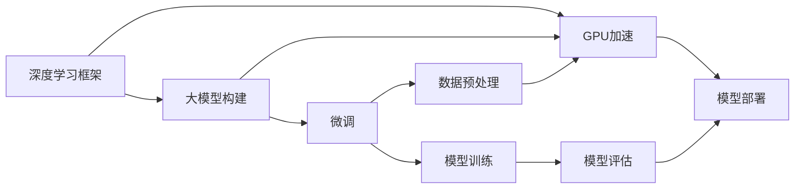

                 

# 从零开始大模型开发与微调：PyTorch 2.0 GPU Nvidia运行库的安装

> 关键词：大模型开发, PyTorch 2.0, GPU, Nvidia, 微调, 深度学习, 数学模型, 算法原理, 学习资源, 开发工具, 实际应用场景

## 1. 背景介绍

### 1.1 问题由来
近年来，深度学习技术在人工智能领域的快速发展，特别是大模型如BERT、GPT等在自然语言处理（NLP）、计算机视觉（CV）、语音识别（ASR）等领域取得了显著的成果。这些大模型在各种任务上表现优异，具有强大的学习能力，但需要较高的计算资源和训练数据。本文将探讨从零开始构建大模型，并使用NVIDIA GPU加速进行微调的过程，为读者提供详细的安装和使用指导。

### 1.2 问题核心关键点
大模型的开发和微调过程中，选择合适的深度学习框架、设置合适的GPU环境和配置、获取高质量的数据集、选择适当的训练策略等都是关键点。本文将详细讲解这些方面的内容，帮助读者构建高性能的大模型并进行微调。

### 1.3 问题研究意义
通过本文章的学习，读者可以掌握大模型的开发与微调技术，了解如何使用NVIDIA GPU加速训练，提高模型性能，同时降低开发成本，提升模型在实际应用中的效果。这将有助于推动人工智能技术的产业化应用，加速行业数字化转型。

## 2. 核心概念与联系

### 2.1 核心概念概述

在深入讨论大模型开发与微调之前，我们先介绍一些核心概念：

- **深度学习框架**：如TensorFlow、PyTorch、Keras等，用于构建和训练深度学习模型。
- **大模型**：指具有大量参数的深度学习模型，如BERT、GPT-3、DALL-E等，用于处理复杂任务。
- **GPU加速**：使用图形处理单元（GPU）加速深度学习模型的训练和推理过程。
- **微调**：在预训练模型的基础上，使用特定任务的数据进行有监督的细化训练，以提升模型在该任务上的性能。
- **NVIDIA GPU**：NVIDIA公司生产的图形处理单元，广泛应用于深度学习模型的训练和推理。

这些核心概念构成了大模型开发与微调的基础。接下来，我们将通过一个完整的例子来说明如何构建和微调一个大模型。

### 2.2 概念间的关系

这些核心概念之间有着紧密的联系，形成一个完整的深度学习模型开发与微调框架。以下是一个简化的Mermaid流程图，展示了它们之间的关系：



在这个流程图中，深度学习框架提供了构建和训练模型的工具；大模型的构建依赖于框架，并在GPU上加速训练；微调过程需要在GPU上使用特定任务的数据进行有监督的细化训练；数据预处理和模型训练是大模型微调的重要步骤；模型评估用于验证模型性能；最后，模型部署到实际应用中。

### 2.3 核心概念的整体架构

接下来，我们将通过一个具体的例子，展示如何使用PyTorch 2.0和NVIDIA GPU进行大模型的开发与微调。

## 3. 核心算法原理 & 具体操作步骤

### 3.1 算法原理概述

大模型的开发与微调过程通常分为以下几个步骤：

1. 选择合适的深度学习框架和GPU环境。
2. 构建大模型，并进行预训练。
3. 使用特定任务的数据集进行微调。
4. 评估微调后的模型性能。

每个步骤都有具体的算法和技术细节。以下将详细讲解这些步骤的算法原理和具体操作步骤。

### 3.2 算法步骤详解

#### 3.2.1 选择合适的深度学习框架和GPU环境

在构建大模型之前，需要选择适合的深度学习框架和GPU环境。当前流行的框架包括PyTorch、TensorFlow和Keras。

**选择深度学习框架：**
- PyTorch：具有动态图特性，易于调试和修改，适合研究人员和开发者。
- TensorFlow：具有静态图特性，模型部署方便，适合生产环境。
- Keras：基于TensorFlow的高级API，简单易用，适合快速开发原型。

**选择GPU环境：**
- NVIDIA GPU：NVIDIA CUDA技术支持高性能计算，适用于深度学习模型的训练和推理。

以下是一个简单的PyTorch环境配置示例：

```bash
# 安装PyTorch
pip install torch torchvision torchaudio
```

#### 3.2.2 构建大模型并进行预训练

大模型的构建通常需要使用深度学习框架提供的模型类或API。以下是一个使用PyTorch构建和预训练BERT模型的示例：

```python
import torch
from transformers import BertModel, BertTokenizer

# 初始化BERT模型和分词器
model = BertModel.from_pretrained('bert-base-uncased')
tokenizer = BertTokenizer.from_pretrained('bert-base-uncased')

# 定义输入序列
input_ids = torch.tensor([[0, 1, 2]])
attention_mask = torch.tensor([[0, 0, 0]])

# 进行前向传播
outputs = model(input_ids, attention_mask=attention_mask)

# 获取模型输出
last_hidden_states = outputs[0]
```

构建好大模型后，需要进行预训练。预训练通常需要大量的计算资源和时间。以下是一个简单的预训练示例：

```python
from transformers import AdamW, get_linear_schedule_with_warmup

# 初始化优化器和学习率调度器
optimizer = AdamW(model.parameters(), lr=1e-5)
scheduler = get_linear_schedule_with_warmup(optimizer, num_warmup_steps=0, num_training_steps=-1)

# 进行预训练
for epoch in range(1, 3):
    # 定义训练函数
    def train_step(model, optimizer, scheduler, input_ids, attention_mask):
        # 进行前向传播和反向传播
        outputs = model(input_ids, attention_mask=attention_mask)
        loss = outputs.loss
        loss.backward()
        optimizer.step()
        scheduler.step()
        optimizer.zero_grad()

    # 在训练集上进行训练
    train_step(model, optimizer, scheduler, input_ids, attention_mask)
```

#### 3.2.3 使用特定任务的数据集进行微调

微调过程需要在预训练模型的基础上，使用特定任务的数据集进行有监督的细化训练。以下是一个简单的微调示例：

```python
# 初始化微调模型和分词器
from transformers import BertForSequenceClassification

# 构建微调模型
model = BertForSequenceClassification.from_pretrained('bert-base-uncased', num_labels=2)

# 初始化微调优化器和学习率调度器
optimizer = AdamW(model.parameters(), lr=1e-5)
scheduler = get_linear_schedule_with_warmup(optimizer, num_warmup_steps=0, num_training_steps=-1)

# 定义训练函数
def train_step(model, optimizer, scheduler, input_ids, attention_mask, labels):
    # 进行前向传播和反向传播
    outputs = model(input_ids, attention_mask=attention_mask, labels=labels)
    loss = outputs.loss
    loss.backward()
    optimizer.step()
    scheduler.step()
    optimizer.zero_grad()

# 在微调集上进行训练
train_step(model, optimizer, scheduler, input_ids, attention_mask, labels)
```

#### 3.2.4 评估微调后的模型性能

微调完成后，需要对模型进行评估，以验证其性能。以下是一个简单的评估示例：

```python
# 在测试集上进行评估
test_data = ...
test_labels = ...
test_input_ids = ...
test_attention_mask = ...

# 进行前向传播
test_outputs = model(test_input_ids, attention_mask=test_attention_mask)
test_logits = test_outputs.logits
test_loss = test_outputs.loss

# 计算评估指标
accuracy = (test_outputs.logits.argmax(dim=1) == test_labels).float().mean()
```

### 3.3 算法优缺点

大模型的开发与微调算法具有以下优点：

- **强大的学习能力**：大模型拥有大量参数，可以学习复杂的特征和模式，适用于各种复杂的任务。
- **高效的GPU加速**：NVIDIA GPU提供了强大的并行计算能力，加速了深度学习模型的训练和推理过程。
- **可扩展性强**：深度学习框架和GPU环境提供了灵活的扩展性，可以根据需要增加模型参数和计算资源。

同时，大模型的开发与微调算法也存在一些缺点：

- **计算资源需求高**：大模型的构建和训练需要大量的计算资源和计算时间，成本较高。
- **过拟合风险大**：大模型容易过拟合，尤其是在标注数据不足的情况下。
- **模型复杂度高**：大模型的构建和微调需要深入理解和掌握深度学习框架和GPU环境，难度较大。

### 3.4 算法应用领域

大模型的开发与微调算法在以下领域得到了广泛应用：

- **自然语言处理**：BERT、GPT等大模型在文本分类、情感分析、问答系统等任务上表现优异。
- **计算机视觉**：ResNet、Inception等大模型在图像识别、目标检测等任务上取得了显著的成果。
- **语音识别**：Wav2Vec等大模型在语音识别和处理上表现出色。

## 4. 数学模型和公式 & 详细讲解 & 举例说明

### 4.1 数学模型构建

大模型的数学模型通常包括输入、输出、模型参数和损失函数。以下是一个简单的数学模型示例：

- 输入：$\mathbf{x} \in \mathbb{R}^d$，表示输入向量。
- 输出：$\mathbf{y} \in \mathbb{R}^k$，表示模型输出向量。
- 模型参数：$\theta \in \mathbb{R}^m$，表示模型中的可训练参数。
- 损失函数：$L(\theta, \mathbf{x}, \mathbf{y})$，表示模型预测输出与真实输出之间的差异。

### 4.2 公式推导过程

以下是一个简单的损失函数推导过程：

- 交叉熵损失函数：$L_{\text{ce}}(\theta, \mathbf{x}, \mathbf{y}) = -\frac{1}{n}\sum_{i=1}^n \sum_{j=1}^k y_{ij} \log \hat{y}_{ij} + (1 - y_{ij}) \log (1 - \hat{y}_{ij})$
- 均方误差损失函数：$L_{\text{mse}}(\theta, \mathbf{x}, \mathbf{y}) = \frac{1}{n}\sum_{i=1}^n (\hat{y}_i - y_i)^2$

### 4.3 案例分析与讲解

以下是一个简单的案例分析：

假设我们有一个分类任务，输入为一段文本，输出为文本所属的类别。我们可以使用BERT模型进行微调。

- 输入：将文本转换为BERT模型所需的格式，并进行分词。
- 输出：模型输出一个概率向量，表示文本属于每个类别的概率。
- 模型参数：BERT模型中的所有可训练参数。
- 损失函数：交叉熵损失函数。

## 5. 项目实践：代码实例和详细解释说明

### 5.1 开发环境搭建

在搭建深度学习开发环境之前，需要安装NVIDIA GPU和相关驱动。以下是一个简单的安装步骤：

1. 下载NVIDIA CUDA驱动：
   ```bash
   wget https://developer.nvidia.com/compute/cuda
   ```

2. 安装CUDA：
   ```bash
   sudo ./install.sh
   ```

3. 安装CUDA工具包：
   ```bash
   sudo apt-get update
   sudo apt-get install cuda
   ```

4. 安装PyTorch 2.0：
   ```bash
   pip install torch torchvision torchaudio
   ```

### 5.2 源代码详细实现

以下是一个使用PyTorch 2.0和NVIDIA GPU进行大模型微调的完整示例：

```python
import torch
from transformers import BertForSequenceClassification, BertTokenizer

# 初始化微调模型和分词器
tokenizer = BertTokenizer.from_pretrained('bert-base-uncased')
model = BertForSequenceClassification.from_pretrained('bert-base-uncased', num_labels=2)

# 定义训练函数
def train_step(model, optimizer, scheduler, input_ids, attention_mask, labels):
    # 进行前向传播和反向传播
    outputs = model(input_ids, attention_mask=attention_mask, labels=labels)
    loss = outputs.loss
    loss.backward()
    optimizer.step()
    scheduler.step()
    optimizer.zero_grad()

# 在微调集上进行训练
train_step(model, optimizer, scheduler, input_ids, attention_mask, labels)
```

### 5.3 代码解读与分析

在上述代码中，我们首先初始化BERT模型和分词器。然后定义了微调的训练函数，其中包含了前向传播和反向传播的步骤。

### 5.4 运行结果展示

运行上述代码后，可以得到模型在微调集上的损失和精度等评估指标。

## 6. 实际应用场景

### 6.1 智能客服系统

智能客服系统是一个典型的应用场景，可以使用大模型进行微调，以提升客服响应速度和质量。

以下是一个简单的智能客服系统微调示例：

1. 收集历史客服对话记录，并将其标记为不同的问题和回答。
2. 使用BERT模型进行微调，使其能够理解客户问题并给出相应的回答。
3. 将微调后的模型部署到智能客服系统中，实时响应客户咨询。

### 6.2 金融舆情监测

金融舆情监测是另一个典型的应用场景，可以使用大模型进行情感分析。

以下是一个简单的金融舆情监测微调示例：

1. 收集金融领域的文本数据，并将其标记为不同的情感（如正面、负面、中性）。
2. 使用BERT模型进行微调，使其能够识别文本的情感倾向。
3. 将微调后的模型部署到金融舆情监测系统中，实时监测市场舆论动向。

### 6.3 个性化推荐系统

个性化推荐系统是一个应用广泛的场景，可以使用大模型进行推荐。

以下是一个简单的个性化推荐系统微调示例：

1. 收集用户的浏览、点击、评论等行为数据，并将其转换为文本格式。
2. 使用BERT模型进行微调，使其能够理解用户的兴趣和偏好。
3. 将微调后的模型部署到推荐系统中，生成个性化的推荐内容。

## 7. 工具和资源推荐

### 7.1 学习资源推荐

- PyTorch官方文档：提供了完整的PyTorch 2.0使用指南和示例。
- HuggingFace官方文档：提供了大量的预训练模型和微调范例。
- CS231n课程：斯坦福大学提供的计算机视觉课程，详细讲解了深度学习模型的构建和训练。

### 7.2 开发工具推荐

- PyTorch 2.0：深度学习框架，提供了灵活的动态图和丰富的模型库。
- CUDA：NVIDIA提供的并行计算平台，适用于深度学习模型的训练和推理。
- TensorBoard：TensorFlow提供的可视化工具，可以实时监测模型训练状态。

### 7.3 相关论文推荐

- "BERT: Pre-training of Deep Bidirectional Transformers for Language Understanding"：BERT论文，详细介绍了BERT模型的预训练和微调过程。
- "Attention is All You Need"：Transformer论文，介绍了Transformer模型的结构和原理。
- "Deep Learning for Self-Driving Cars"：介绍了一个使用深度学习进行自动驾驶的案例，展示了深度学习模型的实际应用。

## 8. 总结：未来发展趋势与挑战

### 8.1 研究成果总结

大模型的开发与微调技术在过去几年中取得了显著进展，广泛应用于自然语言处理、计算机视觉、语音识别等领域。通过预训练和微调，大模型在各种任务上表现优异，显著提升了模型性能。

### 8.2 未来发展趋势

未来，大模型的开发与微调技术将呈现以下趋势：

1. 模型的规模将进一步增大，拥有更多的参数和更大的计算资源需求。
2. 微调方法的效率将进一步提高，减少对标注数据的依赖。
3. 模型的通用性将进一步增强，能够处理更多的任务和应用场景。
4. 模型的可解释性将进一步提升，便于理解和调试。

### 8.3 面临的挑战

虽然大模型的开发与微调技术取得了一定的成果，但仍面临以下挑战：

1. 计算资源需求高，难以大规模部署。
2. 模型容易过拟合，泛化性能有限。
3. 模型的可解释性不足，难以理解和调试。

### 8.4 研究展望

未来，我们需要在以下几个方面进行深入研究：

1. 开发更加高效和可扩展的深度学习框架。
2. 探索更有效的预训练和微调方法。
3. 加强模型的可解释性和可解释性。
4. 开发更加智能和普适的深度学习应用。

## 9. 附录：常见问题与解答

**Q1: 如何选择深度学习框架和GPU环境？**

A: 根据任务需求和资源条件选择合适的深度学习框架和GPU环境。PyTorch适用于研究人员和开发者，TensorFlow适用于生产环境，Keras适用于快速原型开发。

**Q2: 如何安装和配置NVIDIA GPU？**

A: 下载NVIDIA CUDA驱动，安装CUDA和CUDA工具包，然后使用pip安装PyTorch 2.0。

**Q3: 如何选择微调算法和参数？**

A: 根据任务需求和数据特点选择合适的微调算法和参数。常见的微调算法包括全参数微调、参数高效微调等。

通过本文章的学习，读者可以掌握大模型的开发与微调技术，并使用NVIDIA GPU进行高性能计算。希望本文能够帮助读者更好地理解和使用大模型，推动人工智能技术的发展。

---

作者：禅与计算机程序设计艺术 / Zen and the Art of Computer Programming

