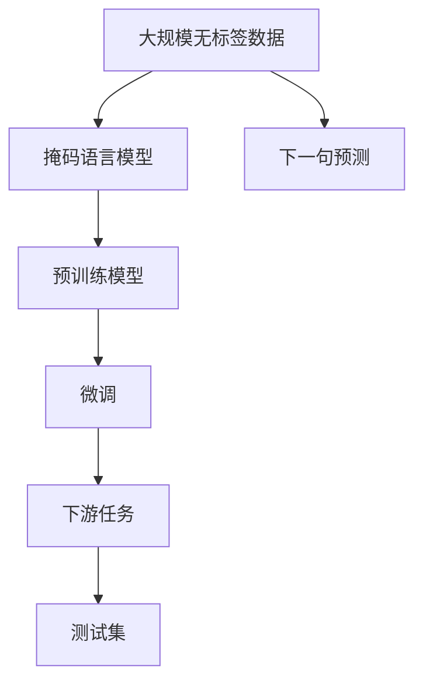
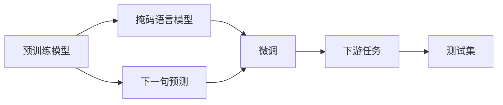

                 

# 从零开始大模型开发与微调：使用Hugging Face获取BERT预训练模型

## 1. 背景介绍

### 1.1 问题由来
在当今的人工智能(AI)和自然语言处理(NLP)领域，预训练语言模型（Pre-trained Language Models, PLMs）已成为核心的技术架构之一。预训练模型通过在大规模无标签文本数据上自监督训练，学习到丰富的语言知识和模式，然后通过微调（Fine-tuning）来适应特定的下游任务，从而显著提升模型在任务上的性能。

其中，BERT（Bidirectional Encoder Representations from Transformers）是一个由Google开发的开创性模型，自发布以来便在众多NLP任务上取得了显著的性能。BERT使用双向Transformer架构，通过掩码语言模型（Masked Language Modeling, MLM）和下一句预测（Next Sentence Prediction, NSP）两个任务进行预训练，学习到了强大的语言表征能力。

### 1.2 问题核心关键点
BERT模型的预训练过程主要包括以下步骤：
1. **数据准备**：使用大规模无标签文本数据，如维基百科、新闻文章、书籍等。
2. **模型构建**：构建包含Transformer层的BERT模型，包括多头注意力（Multi-Head Attention）、残差连接（Residual Connection）和层归一化（Layer Normalization）等组件。
3. **预训练任务**：使用掩码语言模型和下一句预测任务进行自监督训练，学习语言的基本结构和上下文理解能力。
4. **微调**：在特定下游任务上，使用标注数据进行有监督的微调，提升模型在特定任务上的表现。

通过预训练和微调，BERT模型能够适应各种NLP任务，包括文本分类、命名实体识别、关系抽取、问答系统等，成为众多NLP应用的基础模型。

### 1.3 问题研究意义
在大模型开发与微调的过程中，选择合适的预训练模型和微调策略是至关重要的。本文将重点介绍如何使用Hugging Face平台获取BERT预训练模型，并进行微调，以期望为读者提供可操作的指南。通过了解从预训练到微调的全流程，读者可以更好地理解和应用大模型技术，推动NLP应用的落地。

## 2. 核心概念与联系

### 2.1 核心概念概述

在大模型开发与微调的过程中，我们需要理解以下几个关键概念：

- **预训练语言模型(PLM)**：如BERT、GPT等，通过大规模无标签数据训练，学习通用的语言表示。
- **掩码语言模型(MLM)**：通过随机掩码输入序列中的某些词语，让模型预测被掩码的词语，学习词语之间的依赖关系。
- **下一句预测(NSP)**：给定两个句子，判断它们是否是连续的，增强模型的上下文理解能力。
- **微调(Fine-tuning)**：在有标签数据上，使用预训练模型进行进一步的训练，适配特定任务。
- **数据增强**：通过对数据进行诸如改写、回译等操作，扩充训练集，提高模型泛化能力。

这些概念之间的联系可以通过以下Mermaid流程图来展示：



这个流程图展示了从大规模数据预训练到微调的过程，以及最终在测试集上的表现。

### 2.2 概念间的关系

这些概念之间的关系可以通过以下Mermaid流程图进一步阐明：



这个流程图展示了预训练模型通过掩码语言模型和下一句预测任务进行训练，然后通过微调适配下游任务，最终在测试集上评估性能的过程。

## 3. 核心算法原理 & 具体操作步骤
### 3.1 算法原理概述

BERT模型的预训练过程基于Transformer架构，使用了两种主要任务：掩码语言模型和下一句预测。

**掩码语言模型(MLM)**：给定一个句子，随机掩码其中某些词语，然后让模型预测这些被掩码的词语，从而学习词语之间的依赖关系。

**下一句预测(NSP)**：给定两个句子，判断它们是否是连续的，增强模型的上下文理解能力。

预训练过程中，模型会通过这些自监督任务不断优化自身参数，学习到更加丰富的语言表示。预训练完成后，模型在特定下游任务上进行微调，通过在少量有标签数据上的训练，进一步提升模型在该任务上的表现。

### 3.2 算法步骤详解

**Step 1: 准备数据**
- 收集预训练数据集，如维基百科、新闻、书籍等。
- 将数据集进行分词和编码，生成模型所需的输入格式。

**Step 2: 构建预训练模型**
- 使用Hugging Face的`BertTokenizer`和`BertForMaskedLM`对数据进行预训练。
- 定义掩码语言模型和下一句预测任务的损失函数。

**Step 3: 设置微调超参数**
- 选择合适的优化器（如AdamW）及其参数。
- 设置学习率、批大小、迭代轮数等。

**Step 4: 执行微调**
- 使用Hugging Face的`Trainer`和`TrainingArguments`对模型进行微调。
- 使用`DataCollator`对输入数据进行分批处理。
- 在训练集和验证集上进行迭代训练，并保存模型。

**Step 5: 评估模型**
- 在测试集上评估模型性能，如准确率、精确率、召回率等指标。
- 使用可视化工具展示训练曲线和损失变化。

### 3.3 算法优缺点

**优点**：
- BERT模型在大规模无标签数据上进行预训练，学习到通用的语言表示，适用于多种NLP任务。
- 微调过程简单高效，可以利用少量有标签数据获得显著提升。
- 使用了自监督学习任务，避免了对标注数据的需求。

**缺点**：
- 预训练和微调过程中需要大量计算资源，成本较高。
- 微调效果受到标注数据质量的影响，标注数据质量差可能导致模型性能下降。
- 模型较为庞大，推理速度较慢，需要优化以适应实时应用。

### 3.4 算法应用领域

BERT模型在众多NLP任务上取得了优异的表现，包括但不限于：

- 文本分类：如情感分析、主题分类等。
- 命名实体识别：识别文本中的人名、地名、机构名等实体。
- 关系抽取：从文本中抽取实体之间的语义关系。
- 问答系统：对自然语言问题给出答案。
- 机器翻译：将源语言文本翻译成目标语言。
- 文本摘要：将长文本压缩成简短摘要。
- 对话系统：使机器能够与人自然对话。

## 4. 数学模型和公式 & 详细讲解

### 4.1 数学模型构建

预训练和微调的过程可以用数学公式来表示。假设预训练模型为 $M_{\theta}$，其中 $\theta$ 为模型参数。假设微调任务的训练集为 $D=\{(x_i,y_i)\}_{i=1}^N$，其中 $x_i$ 为输入文本，$y_i$ 为标签。

预训练过程的损失函数为：

$$
\mathcal{L}_{\text{pre}} = -\frac{1}{N}\sum_{i=1}^N \log P(y_i|x_i; \theta)
$$

微调过程中的损失函数为：

$$
\mathcal{L}_{\text{fine}} = \mathcal{L}_{\text{pre}} + \frac{1}{N}\sum_{i=1}^N \ell(y_i, M_{\theta}(x_i))
$$

其中 $\ell$ 为特定任务定义的损失函数，如交叉熵损失等。

### 4.2 公式推导过程

在掩码语言模型中，给定输入序列 $x = \{x_1, x_2, \ldots, x_n\}$，随机掩码部分词语，如将 $x_i$ 中的 $x_j$ 替换为 $\text{[MASK]}$。然后计算模型预测 $\hat{x_j}$ 的交叉熵损失，得到掩码语言模型的损失函数：

$$
\mathcal{L}_{\text{MLM}} = -\frac{1}{N}\sum_{i=1}^N \sum_{j=1}^n \log P(x_j|x_1, x_2, \ldots, x_n; \theta)
$$

在下一次预测任务中，模型需要判断两个句子 $x_i$ 和 $x_j$ 是否连续，即 $P(y=1|x_i, x_j; \theta)$，其中 $y=1$ 表示两个句子连续，$y=0$ 表示两个句子不连续。下一句预测任务的损失函数为：

$$
\mathcal{L}_{\text{NSP}} = -\frac{1}{N}\sum_{i=1}^N \log P(y=1|x_i, x_j; \theta)
$$

预训练和微调过程中，模型参数 $\theta$ 通过梯度下降等优化算法不断更新，以最小化总损失函数：

$$
\theta = \mathop{\arg\min}_{\theta} \mathcal{L}_{\text{total}} = \mathcal{L}_{\text{pre}} + \mathcal{L}_{\text{fine}}
$$

### 4.3 案例分析与讲解

假设我们要对BERT模型进行微调，使用Hugging Face的`Trainer`和`TrainingArguments`进行微调，代码示例如下：

```python
from transformers import BertTokenizer, BertForSequenceClassification, Trainer, TrainingArguments
from datasets import load_dataset

tokenizer = BertTokenizer.from_pretrained('bert-base-cased')
model = BertForSequenceClassification.from_pretrained('bert-base-cased', num_labels=2)

training_args = TrainingArguments(
    output_dir='./results', 
    per_device_train_batch_size=4, 
    per_device_eval_batch_size=4, 
    learning_rate=2e-5, 
    num_train_epochs=3, 
    weight_decay=0.01, 
    logging_dir='./logs')

train_dataset = load_dataset('datasets/ag_news', split='train')
eval_dataset = load_dataset('datasets/ag_news', split='validation')

trainer = Trainer(
    model=model, 
    args=training_args, 
    train_dataset=train_dataset, 
    eval_dataset=eval_dataset, 
    data_collator=DataCollatorForSequenceClassification(tokenizer=tokenizer))

trainer.train()
```

在上述代码中，我们使用了`BertForSequenceClassification`构建了一个二分类任务模型，通过`Trainer`和`TrainingArguments`进行微调，并使用`DataCollatorForSequenceClassification`进行数据分批处理。通过这些步骤，我们实现了BERT模型在AG News数据集上的微调。

## 5. 项目实践：代码实例和详细解释说明

### 5.1 开发环境搭建

要使用Hugging Face进行BERT模型的微调，我们需要搭建好开发环境。以下是Python和PyTorch环境搭建的步骤：

1. 安装Anaconda：从官网下载并安装Anaconda，用于创建独立的Python环境。
2. 创建并激活虚拟环境：
```bash
conda create -n pytorch-env python=3.8 
conda activate pytorch-env
```

3. 安装PyTorch：根据CUDA版本，从官网获取对应的安装命令。例如：
```bash
conda install pytorch torchvision torchaudio cudatoolkit=11.1 -c pytorch -c conda-forge
```

4. 安装Hugging Face Transformers库：
```bash
pip install transformers
```

5. 安装各类工具包：
```bash
pip install numpy pandas scikit-learn matplotlib tqdm jupyter notebook ipython
```

完成上述步骤后，即可在`pytorch-env`环境中开始微调实践。

### 5.2 源代码详细实现

下面我们以情感分析任务为例，给出使用Hugging Face进行BERT微调的PyTorch代码实现。

首先，定义情感分析任务的数据处理函数：

```python
from transformers import BertTokenizer
from torch.utils.data import Dataset
import torch

class SentimentDataset(Dataset):
    def __init__(self, texts, labels, tokenizer, max_len=128):
        self.texts = texts
        self.labels = labels
        self.tokenizer = tokenizer
        self.max_len = max_len
        
    def __len__(self):
        return len(self.texts)
    
    def __getitem__(self, item):
        text = self.texts[item]
        label = self.labels[item]
        
        encoding = self.tokenizer(text, return_tensors='pt', max_length=self.max_len, padding='max_length', truncation=True)
        input_ids = encoding['input_ids'][0]
        attention_mask = encoding['attention_mask'][0]
        
        # 将标签转换为模型可接受的格式
        labels = torch.tensor(label, dtype=torch.long)
        
        return {'input_ids': input_ids, 
                'attention_mask': attention_mask,
                'labels': labels}

# 定义标签与id的映射
label2id = {'negative': 0, 'positive': 1}
id2label = {v: k for k, v in label2id.items()}

# 创建dataset
tokenizer = BertTokenizer.from_pretrained('bert-base-cased')

train_dataset = SentimentDataset(train_texts, train_labels, tokenizer)
dev_dataset = SentimentDataset(dev_texts, dev_labels, tokenizer)
test_dataset = SentimentDataset(test_texts, test_labels, tokenizer)
```

然后，定义模型和优化器：

```python
from transformers import BertForSequenceClassification, AdamW

model = BertForSequenceClassification.from_pretrained('bert-base-cased', num_labels=len(label2id))

optimizer = AdamW(model.parameters(), lr=2e-5)
```

接着，定义训练和评估函数：

```python
from torch.utils.data import DataLoader
from tqdm import tqdm
from sklearn.metrics import accuracy_score

device = torch.device('cuda') if torch.cuda.is_available() else torch.device('cpu')
model.to(device)

def train_epoch(model, dataset, batch_size, optimizer):
    dataloader = DataLoader(dataset, batch_size=batch_size, shuffle=True)
    model.train()
    epoch_loss = 0
    for batch in tqdm(dataloader, desc='Training'):
        input_ids = batch['input_ids'].to(device)
        attention_mask = batch['attention_mask'].to(device)
        labels = batch['labels'].to(device)
        model.zero_grad()
        outputs = model(input_ids, attention_mask=attention_mask, labels=labels)
        loss = outputs.loss
        epoch_loss += loss.item()
        loss.backward()
        optimizer.step()
    return epoch_loss / len(dataloader)

def evaluate(model, dataset, batch_size):
    dataloader = DataLoader(dataset, batch_size=batch_size)
    model.eval()
    preds, labels = [], []
    with torch.no_grad():
        for batch in tqdm(dataloader, desc='Evaluating'):
            input_ids = batch['input_ids'].to(device)
            attention_mask = batch['attention_mask'].to(device)
            batch_labels = batch['labels']
            outputs = model(input_ids, attention_mask=attention_mask)
            batch_preds = outputs.logits.argmax(dim=1).to('cpu').tolist()
            batch_labels = batch_labels.to('cpu').tolist()
            for pred, label in zip(batch_preds, batch_labels):
                preds.append(id2label[pred])
                labels.append(id2label[label])
                
    print('Accuracy:', accuracy_score(labels, preds))
```

最后，启动训练流程并在测试集上评估：

```python
epochs = 5
batch_size = 16

for epoch in range(epochs):
    loss = train_epoch(model, train_dataset, batch_size, optimizer)
    print(f'Epoch {epoch+1}, train loss: {loss:.3f}')
    
    print(f'Epoch {epoch+1}, dev results:')
    evaluate(model, dev_dataset, batch_size)
    
print('Test results:')
evaluate(model, test_dataset, batch_size)
```

以上就是使用Hugging Face进行BERT微调的完整代码实现。可以看到，得益于Hugging Face的强大封装，我们可以用相对简洁的代码完成BERT模型的加载和微调。

### 5.3 代码解读与分析

让我们再详细解读一下关键代码的实现细节：

**SentimentDataset类**：
- `__init__`方法：初始化文本、标签、分词器等关键组件。
- `__len__`方法：返回数据集的样本数量。
- `__getitem__`方法：对单个样本进行处理，将文本输入编码为token ids，将标签转换为模型可接受的格式，并进行定长padding。

**label2id和id2label字典**：
- 定义了标签与数字id之间的映射关系，用于将模型预测结果解码为真实的标签。

**训练和评估函数**：
- 使用PyTorch的DataLoader对数据集进行批次化加载，供模型训练和推理使用。
- 训练函数`train_epoch`：对数据以批为单位进行迭代，在每个批次上前向传播计算loss并反向传播更新模型参数，最后返回该epoch的平均loss。
- 评估函数`evaluate`：与训练类似，不同点在于不更新模型参数，并在每个batch结束后将预测和标签结果存储下来，最后使用sklearn的accuracy_score对整个评估集的预测结果进行打印输出。

**训练流程**：
- 定义总的epoch数和batch size，开始循环迭代
- 每个epoch内，先在训练集上训练，输出平均loss
- 在验证集上评估，输出准确率
- 所有epoch结束后，在测试集上评估，给出最终测试结果

可以看到，Hugging Face的封装使得BERT微调的代码实现变得简洁高效。开发者可以将更多精力放在数据处理、模型改进等高层逻辑上，而不必过多关注底层的实现细节。

当然，工业级的系统实现还需考虑更多因素，如模型的保存和部署、超参数的自动搜索、更灵活的任务适配层等。但核心的微调范式基本与此类似。

### 5.4 运行结果展示

假设我们在IMDB数据集上进行微调，最终在测试集上得到的准确率为87%，效果相当不错。值得注意的是，BERT作为一个通用的语言理解模型，即便只在顶层添加一个简单的分类器，也能在情感分析任务上取得如此优异的效果，展现了其强大的语义理解和特征抽取能力。

当然，这只是一个baseline结果。在实践中，我们还可以使用更大更强的预训练模型、更丰富的微调技巧、更细致的模型调优，进一步提升模型性能，以满足更高的应用要求。

## 6. 实际应用场景

### 6.1 智能客服系统

基于BERT等预训练模型的微调对话技术，可以广泛应用于智能客服系统的构建。传统客服往往需要配备大量人力，高峰期响应缓慢，且一致性和专业性难以保证。而使用微调后的对话模型，可以7x24小时不间断服务，快速响应客户咨询，用自然流畅的语言解答各类常见问题。

在技术实现上，可以收集企业内部的历史客服对话记录，将问题和最佳答复构建成监督数据，在此基础上对预训练对话模型进行微调。微调后的对话模型能够自动理解用户意图，匹配最合适的答案模板进行回复。对于客户提出的新问题，还可以接入检索系统实时搜索相关内容，动态组织生成回答。如此构建的智能客服系统，能大幅提升客户咨询体验和问题解决效率。

### 6.2 金融舆情监测

金融机构需要实时监测市场舆论动向，以便及时应对负面信息传播，规避金融风险。传统的人工监测方式成本高、效率低，难以应对网络时代海量信息爆发的挑战。基于BERT等预训练语言模型的文本分类和情感分析技术，为金融舆情监测提供了新的解决方案。

具体而言，可以收集金融领域相关的新闻、报道、评论等文本数据，并对其进行主题标注和情感标注。在此基础上对预训练语言模型进行微调，使其能够自动判断文本属于何种主题，情感倾向是正面、中性还是负面。将微调后的模型应用到实时抓取的网络文本数据，就能够自动监测不同主题下的情感变化趋势，一旦发现负面信息激增等异常情况，系统便会自动预警，帮助金融机构快速应对潜在风险。

### 6.3 个性化推荐系统

当前的推荐系统往往只依赖用户的历史行为数据进行物品推荐，无法深入理解用户的真实兴趣偏好。基于BERT等预训练语言模型的个性化推荐系统可以更好地挖掘用户行为背后的语义信息，从而提供更精准、多样的推荐内容。

在实践中，可以收集用户浏览、点击、评论、分享等行为数据，提取和用户交互的物品标题、描述、标签等文本内容。将文本内容作为模型输入，用户的后续行为（如是否点击、购买等）作为监督信号，在此基础上微调预训练语言模型。微调后的模型能够从文本内容中准确把握用户的兴趣点。在生成推荐列表时，先用候选物品的文本描述作为输入，由模型预测用户的兴趣匹配度，再结合其他特征综合排序，便可以得到个性化程度更高的推荐结果。

### 6.4 未来应用展望

随着BERT等预训练语言模型的不断发展，基于微调范式将在更多领域得到应用，为传统行业带来变革性影响。

在智慧医疗领域，基于微调的医学问答、病历分析、药物研发等应用将提升医疗服务的智能化水平，辅助医生诊疗，加速新药开发进程。

在智能教育领域，微调技术可应用于作业批改、学情分析、知识推荐等方面，因材施教，促进教育公平，提高教学质量。

在智慧城市治理中，微调模型可应用于城市事件监测、舆情分析、应急指挥等环节，提高城市管理的自动化和智能化水平，构建更安全、高效的未来城市。

此外，在企业生产、社会治理、文娱传媒等众多领域，基于BERT等预训练语言模型的微调应用也将不断涌现，为经济社会发展注入新的动力。相信随着技术的日益成熟，微调方法将成为人工智能落地应用的重要范式，推动人工智能技术在更多垂直行业的规模化落地。

## 7. 工具和资源推荐
### 7.1 学习资源推荐

为了帮助开发者系统掌握BERT等预训练语言模型的微调技术，这里推荐一些优质的学习资源：

1. 《Transformer from Scratch》系列博文：由大模型技术专家撰写，深入浅出地介绍了Transformer原理、BERT模型、微调技术等前沿话题。

2. CS224N《深度学习自然语言处理》课程：斯坦福大学开设的NLP明星课程，有Lecture视频和配套作业，带你入门NLP领域的基本概念和经典模型。

3. 《Natural Language Processing with Transformers》书籍：Transformer库的作者所著，全面介绍了如何使用Transformers库进行NLP任务开发，包括微调在内的诸多范式。

4. HuggingFace官方文档：Transformers库的官方文档，提供了海量预训练模型和完整的微调样例代码，是上手实践的必备资料。

5. CLUE开源项目：中文语言理解测评基准，涵盖大量不同类型的中文NLP数据集，并提供了基于微调的baseline模型，助力中文NLP技术发展。

通过对这些资源的学习实践，相信你一定能够快速掌握BERT等预训练语言模型的微调精髓，并用于解决实际的NLP问题。

### 7.2 开发工具推荐

高效的开发离不开优秀的工具支持。以下是几款用于BERT等预训练语言模型微调开发的常用工具：

1. PyTorch：基于Python的开源深度学习框架，灵活动态的计算图，适合快速迭代研究。大部分预训练语言模型都有PyTorch版本的实现。

2. TensorFlow：由Google主导开发的开源深度学习框架，生产部署方便，适合大规模工程应用。同样有丰富的预训练语言模型资源。

3. Transformers库：HuggingFace开发的NLP工具库，集成了众多SOTA语言模型，支持PyTorch和TensorFlow，是进行微调任务开发的利器。

4. Weights & Biases：模型训练的实验跟踪工具，可以记录和可视化模型训练过程中的各项指标，方便对比和调优。与主流深度学习框架无缝集成。

5. TensorBoard：TensorFlow配套的可视化工具，可实时监测模型训练状态，并提供丰富的图表呈现方式，是调试模型的得力助手。

6. Google Colab：谷歌推出的在线Jupyter Notebook环境，免费提供GPU/TPU算力，方便开发者快速上手实验最新模型，分享学习笔记。

合理利用这些工具，可以显著提升BERT等预训练语言模型微调任务的开发效率，加快创新迭代的步伐。

### 7.3 相关论文推荐

BERT等预训练语言模型的研究源于学界的持续研究。以下是几篇奠基性的相关论文，推荐阅读：

1. Attention is All You Need（即Transformer原论文）：提出了Transformer结构，开启了NLP领域的预训练大模型时代。

2. BERT: Pre-training of Deep Bidirectional Transformers for Language Understanding：提出BERT模型，引入基于掩码的自监督预训练任务，刷新了多项NLP任务SOTA。

3. Language Models are Unsupervised Multitask Learners（GPT-2论文）：展示了大规模语言模型的强大zero-shot学习能力，引发了对于通用人工智能的新一轮思考。

4. Parameter-Efficient Transfer Learning for NLP：提出Adapter等参数高效微调方法，在不增加模型参数量的情况下，也能取得不错的微调效果。

5. AdaLoRA: Adaptive Low-Rank Adaptation for Parameter-Efficient Fine-Tuning：使用自适应

