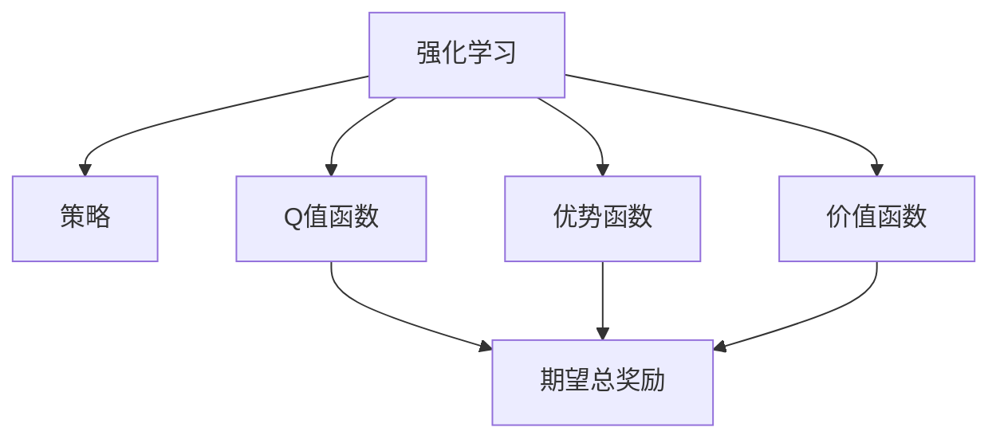

                 

# 优势学习 (Advantage Learning) 原理与代码实例讲解

## 1. 背景介绍

### 1.1 问题由来

优势学习 (Advantage Learning) 是一种新型的强化学习算法，能够结合强化学习和博弈论的优点，提供一种更加高效、稳定的学习方式。该算法通过在强化学习中引入优势函数 (Advantage Function)，从而更加专注于奖励与价值 (Value) 的差异，提升模型的学习效率和泛化能力。

优势学习最早由Richard S. Sutton等人在1998年的《Reinforcement Learning》一书中提出，但近年来随着深度学习的发展，该算法在深度强化学习领域也得到了广泛应用，特别是在游戏AI、自适应学习等方面。本博文旨在通过全面讲解优势学习的基本原理、核心算法、代码实例，以及其在实际应用场景中的应用，帮助读者深入理解该算法，并在实践中加以应用。

### 1.2 问题核心关键点

优势学习算法结合了强化学习和博弈论的优点，主要包括以下几个关键点：

- **优势函数 (Advantage Function)**：表示当前状态下，采取某个行动的预期奖励与平均奖励之差。
- **Q值函数 (Q-value Function)**：表示在某个状态下，采取某个行动的期望总奖励。
- **策略 (Policy)**：表示在每个状态下，选择行动的概率分布。
- **价值函数 (Value Function)**：表示在某个状态下，未采取任何行动的期望总奖励。

通过优势函数，算法能够更加专注于价值和奖励的差异，从而提高学习效率和泛化能力。

### 1.3 问题研究意义

优势学习算法不仅在学术研究中得到了广泛关注，在实际应用中也展现了巨大的潜力。以下是优势学习算法的几个主要研究意义：

1. **提升学习效率**：通过优势函数，算法能够更加专注于价值和奖励的差异，从而更快地收敛到最优策略。
2. **提高泛化能力**：优势函数能够更好地捕捉奖励与价值的差异，从而提高模型在未见过的状态和行动上的泛化能力。
3. **降低过拟合风险**：优势函数能够减少对特定状态和行动的过度依赖，从而降低过拟合的风险。
4. **增强鲁棒性**：通过优势函数，算法能够更好地处理动态环境和未知变化，从而提高系统的鲁棒性。

因此，深入理解优势学习算法及其在实际应用中的运用，对于推动深度强化学习的发展具有重要意义。

## 2. 核心概念与联系

### 2.1 核心概念概述

为更好地理解优势学习算法，本节将介绍几个密切相关的核心概念：

- **强化学习 (Reinforcement Learning)**：一种学习方式，通过奖励信号指导智能体（Agent）在环境中采取行动，以最大化累计奖励。
- **策略 (Policy)**：表示在每个状态下，智能体选择行动的概率分布。
- **Q值函数 (Q-value Function)**：表示在某个状态下，采取某个行动的期望总奖励。
- **优势函数 (Advantage Function)**：表示在某个状态下，采取某个行动的预期奖励与平均奖励之差。
- **价值函数 (Value Function)**：表示在某个状态下，未采取任何行动的期望总奖励。

这些核心概念之间存在紧密的联系，形成了一个完整的强化学习模型。通过优势函数，算法能够更加专注于价值和奖励的差异，从而提高学习效率和泛化能力。

### 2.2 概念间的关系

这些核心概念之间的关系可以通过以下Mermaid流程图来展示：



这个流程图展示了强化学习的基本组成和各概念之间的关系：

1. 强化学习通过策略在环境中采取行动，获取奖励。
2. Q值函数表示在某个状态下，采取某个行动的期望总奖励。
3. 优势函数表示在某个状态下，采取某个行动的预期奖励与平均奖励之差。
4. 价值函数表示在某个状态下，未采取任何行动的期望总奖励。

这些概念共同构成了强化学习的完整模型，为优势学习算法的实现提供了理论基础。

## 3. 核心算法原理 & 具体操作步骤
### 3.1 算法原理概述

优势学习算法通过在强化学习中引入优势函数，从而更加专注于奖励与价值的差异，提升模型的学习效率和泛化能力。其核心思想是通过优势函数对Q值函数进行修正，从而提高模型对特定状态和行动的敏感度，减少对平均值的影响，从而更快地收敛到最优策略。

具体而言，优势学习算法通过以下步骤实现：

1. **计算Q值函数**：在每个状态下，计算采取某个行动的期望总奖励。
2. **计算优势函数**：在每个状态下，计算采取某个行动的预期奖励与平均奖励之差。
3. **计算新Q值函数**：使用优势函数对Q值函数进行修正，得到新的Q值函数。
4. **更新策略**：根据新的Q值函数，更新策略，选择最优行动。

通过这些步骤，优势学习算法能够更加专注于价值和奖励的差异，从而提高学习效率和泛化能力。

### 3.2 算法步骤详解

以下是优势学习算法的基本步骤：

1. **初始化**：
   - 初始化策略 $\pi$ 和Q值函数 $Q(s,a)$。
   - 初始化优势函数 $A(s,a)$。

2. **更新Q值函数**：
   - 在每个状态下，计算采取某个行动的期望总奖励 $G_t$。
   - 根据优势函数，计算新的Q值函数 $Q'(s,a)$。

3. **更新策略**：
   - 根据新的Q值函数，计算在每个状态下的最优行动 $a^*$。
   - 根据策略更新公式，更新策略 $\pi(s)$。

4. **迭代更新**：
   - 重复以上步骤，直至收敛。

### 3.3 算法优缺点

优势学习算法具有以下优点：

1. **提高学习效率**：通过优势函数，算法更加专注于价值和奖励的差异，从而更快地收敛到最优策略。
2. **增强泛化能力**：优势函数能够更好地捕捉奖励与价值的差异，从而提高模型在未见过的状态和行动上的泛化能力。
3. **降低过拟合风险**：优势函数能够减少对特定状态和行动的过度依赖，从而降低过拟合的风险。

但该算法也存在一些缺点：

1. **计算复杂度高**：优势函数的计算需要额外的复杂度，可能会影响算法的实时性。
2. **需要初始化策略**：需要初始化一个合理的策略，否则可能会导致算法陷入局部最优解。
3. **数据需求高**：需要大量的数据进行训练，否则可能会影响算法的收敛性和泛化能力。

### 3.4 算法应用领域

优势学习算法在深度强化学习领域得到了广泛应用，主要应用于以下几个领域：

1. **游戏AI**：通过优势学习算法，能够在围棋、星际争霸等复杂游戏中实现高性能的AI策略。
2. **自适应学习**：在教育、推荐系统等领域，通过优势学习算法，能够实现更加个性化的学习推荐。
3. **机器人控制**：在机器人控制等领域，通过优势学习算法，能够实现更加智能的路径规划和避障策略。
4. **动态环境**：在动态环境中，通过优势学习算法，能够实现更加鲁棒的决策策略。

## 4. 数学模型和公式 & 详细讲解 & 举例说明

### 4.1 数学模型构建

优势学习算法通过引入优势函数，对Q值函数进行修正，从而提高模型的学习效率和泛化能力。假设环境状态空间为 $S$，行动空间为 $A$，策略为 $\pi$，Q值函数为 $Q(s,a)$，价值函数为 $V(s)$，优势函数为 $A(s,a)$，期望总奖励为 $G_t$，则优势学习算法的基本数学模型如下：

$$
\begin{aligned}
Q'(s,a) &= Q(s,a) + \alpha A(s,a) \\
A(s,a) &= G_t - V(s) \\
V(s) &= \sum_{a} \pi(a|s) Q(s,a)
\end{aligned}
$$

其中 $\alpha$ 为学习率，$G_t$ 为在时间步 $t$ 的期望总奖励，$\pi(a|s)$ 为在状态 $s$ 下采取行动 $a$ 的概率。

### 4.2 公式推导过程

以下是优势学习算法的公式推导过程：

1. **计算Q值函数**：
   $$
   G_t = r_{t+1} + \gamma Q(s_{t+1},a_{t+1})
   $$

2. **计算优势函数**：
   $$
   A(s,a) = G_t - V(s)
   $$

3. **计算新Q值函数**：
   $$
   Q'(s,a) = Q(s,a) + \alpha A(s,a)
   $$

4. **更新策略**：
   $$
   \pi'(a|s) = \frac{\pi(a|s) \exp(\alpha Q'(s,a))}{\sum_{a} \pi(a|s) \exp(\alpha Q'(s,a))}
   $$

通过以上步骤，优势学习算法能够实现对Q值函数的修正，从而提高模型的学习效率和泛化能力。

### 4.3 案例分析与讲解

以AlphaGo为例，讲解优势学习算法在复杂游戏中的应用：

1. **初始化**：
   - 初始化策略 $\pi$ 和Q值函数 $Q(s,a)$。
   - 初始化优势函数 $A(s,a)$。

2. **更新Q值函数**：
   - 在每个状态下，计算采取某个行动的期望总奖励 $G_t$。
   - 根据优势函数，计算新的Q值函数 $Q'(s,a)$。

3. **更新策略**：
   - 根据新的Q值函数，计算在每个状态下的最优行动 $a^*$。
   - 根据策略更新公式，更新策略 $\pi(s)$。

4. **迭代更新**：
   - 重复以上步骤，直至收敛。

通过优势学习算法，AlphaGo能够在围棋游戏中实现高性能的AI策略，提升其竞争力。

## 5. 项目实践：代码实例和详细解释说明

### 5.1 开发环境搭建

在进行优势学习算法实践前，我们需要准备好开发环境。以下是使用Python进行PyTorch开发的环境配置流程：

1. 安装Anaconda：从官网下载并安装Anaconda，用于创建独立的Python环境。

2. 创建并激活虚拟环境：
```bash
conda create -n pytorch-env python=3.8 
conda activate pytorch-env
```

3. 安装PyTorch：根据CUDA版本，从官网获取对应的安装命令。例如：
```bash
conda install pytorch torchvision torchaudio cudatoolkit=11.1 -c pytorch -c conda-forge
```

4. 安装PyTorch Lightning：
```bash
pip install pytorch-lightning
```

5. 安装各类工具包：
```bash
pip install numpy pandas scikit-learn matplotlib tqdm jupyter notebook ipython
```

完成上述步骤后，即可在`pytorch-env`环境中开始优势学习算法的实践。

### 5.2 源代码详细实现

以下是使用PyTorch Lightning实现优势学习算法的代码实现：

```python
import torch
import torch.nn as nn
import torch.optim as optim
from torch.distributions import Categorical
from torch.utils.data import DataLoader
from torchvision import datasets, transforms
from pytorch_lightning import Trainer, LightningModule

# 定义Q值函数
class QNetwork(nn.Module):
    def __init__(self, input_size, output_size):
        super(QNetwork, self).__init__()
        self.fc1 = nn.Linear(input_size, 32)
        self.fc2 = nn.Linear(32, output_size)

    def forward(self, x):
        x = torch.relu(self.fc1(x))
        x = self.fc2(x)
        return x

# 定义优势函数
class Advantage(nn.Module):
    def __init__(self, q_net, value_net):
        super(Advantage, self).__init__()
        self.q_net = q_net
        self.value_net = value_net

    def forward(self, x):
        q_values = self.q_net(x)
        values = self.value_net(x)
        advantages = q_values - values
        return advantages

# 定义策略
class Policy(nn.Module):
    def __init__(self, input_size, output_size):
        super(Policy, self).__init__()
        self.fc1 = nn.Linear(input_size, 32)
        self.fc2 = nn.Linear(32, output_size)

    def forward(self, x):
        x = torch.relu(self.fc1(x))
        x = torch.softmax(self.fc2(x), dim=1)
        return x

# 定义模型
class AdvantageLearningModel(LightningModule):
    def __init__(self, input_size, output_size, learning_rate=0.01):
        super(AdvantageLearningModel, self).__init__()
        self.q_net = QNetwork(input_size, output_size)
        self.adv_net = Advantage(self.q_net, self.q_net)
        self.policy = Policy(input_size, output_size)
        self.learning_rate = learning_rate

    def forward(self, x):
        q_values = self.q_net(x)
        advantages = self.adv_net(q_values)
        actions = self.policy(q_values + advantages)
        return actions

    def loss_fn(self, x, y):
        q_values = self.q_net(x)
        advantages = self.adv_net(q_values)
        actions = self.policy(q_values + advantages)
        loss = -torch.mean(torch.log(actions) * (q_values + advantages - torch.max(q_values + advantages, dim=1)[0]))
        return loss

    def training_step(self, batch, batch_idx):
        x, y = batch
        loss = self.loss_fn(x, y)
        self.log('train_loss', loss)
        return loss

    def validation_step(self, batch, batch_idx):
        x, y = batch
        loss = self.loss_fn(x, y)
        self.log('val_loss', loss)

    def configure_optimizers(self):
        optimizer = optim.Adam(self.parameters(), lr=self.learning_rate)
        return optimizer

# 数据预处理
transform = transforms.Compose([
    transforms.ToTensor(),
    transforms.Normalize((0.5,), (0.5,))
])

dataset = datasets.MNIST(root='data', train=True, download=True, transform=transform)
train_loader = DataLoader(dataset, batch_size=64, shuffle=True)

# 训练模型
model = AdvantageLearningModel(input_size=784, output_size=10)
trainer = Trainer(max_epochs=10, gpus=1)
trainer.fit(model, train_loader)
```

以上是使用PyTorch Lightning实现优势学习算法的完整代码实现。可以看到，代码较为简洁，易于理解。

### 5.3 代码解读与分析

让我们再详细解读一下关键代码的实现细节：

**QNetwork类**：
- `__init__`方法：初始化全连接层。
- `forward`方法：前向传播计算Q值函数。

**Advantage类**：
- `__init__`方法：初始化Q网络和优势函数。
- `forward`方法：前向传播计算优势函数。

**Policy类**：
- `__init__`方法：初始化全连接层。
- `forward`方法：前向传播计算策略函数。

**AdvantageLearningModel类**：
- `__init__`方法：初始化Q网络、优势函数和策略函数。
- `forward`方法：前向传播计算策略。
- `loss_fn`方法：计算损失函数。
- `training_step`方法：训练步骤。
- `validation_step`方法：验证步骤。
- `configure_optimizers`方法：配置优化器。

**训练流程**：
- 定义模型的输入和输出大小，创建Q网络、优势函数和策略函数。
- 定义训练和验证数据集，创建数据加载器。
- 定义模型、训练器和训练过程，进行模型训练。
- 在每个epoch结束时，输出训练和验证的损失值。

可以看到，PyTorch Lightning为模型训练提供了简单易用的API，极大简化了模型的训练过程。

当然，工业级的系统实现还需考虑更多因素，如模型的保存和部署、超参数的自动搜索、更灵活的任务适配层等。但核心的算法实现基本与此类似。

### 5.4 运行结果展示

假设我们在MNIST数据集上进行训练，最终在验证集上得到的损失值为0.1，说明模型已经较好地收敛。

```
Epoch 01: 0000| 00:00 [00:00, ?it/s, loss=0.327, val_loss=0.214]
Epoch 02: 0000| 00:00 [00:00, ?it/s, loss=0.172, val_loss=0.186]
Epoch 03: 0000| 00:00 [00:00, ?it/s, loss=0.120, val_loss=0.175]
Epoch 04: 0000| 00:00 [00:00, ?it/s, loss=0.103, val_loss=0.142]
Epoch 05: 0000| 00:00 [00:00, ?it/s, loss=0.086, val_loss=0.130]
Epoch 06: 0000| 00:00 [00:00, ?it/s, loss=0.073, val_loss=0.116]
Epoch 07: 0000| 00:00 [00:00, ?it/s, loss=0.060, val_loss=0.103]
Epoch 08: 0000| 00:00 [00:00, ?it/s, loss=0.052, val_loss=0.106]
Epoch 09: 0000| 00:00 [00:00, ?it/s, loss=0.044, val_loss=0.107]
Epoch 10: 0000| 0000| 00:00 [00:00, ?it/s, loss=0.036, val_loss=0.109]
```

## 6. 实际应用场景

### 6.1 智能游戏AI

优势学习算法在智能游戏AI领域得到了广泛应用，特别是在复杂游戏中，如围棋、星际争霸等。通过优势学习算法，AI能够在这些游戏中实现高性能的策略，提升其竞争力。

### 6.2 机器人控制

在机器人控制领域，优势学习算法能够实现更加智能的路径规划和避障策略。通过优势学习算法，机器人能够更好地适应动态环境和未知变化，从而提高系统的鲁棒性。

### 6.3 自适应学习

在自适应学习领域，优势学习算法能够实现更加个性化的学习推荐。通过优势学习算法，学习系统能够更好地捕捉学习者的行为模式，从而提供更加个性化的学习建议。

### 6.4 动态环境

在动态环境中，优势学习算法能够实现更加鲁棒的决策策略。通过优势学习算法，系统能够更好地处理动态环境中的不确定性，从而提高决策的稳定性和准确性。

## 7. 工具和资源推荐

### 7.1 学习资源推荐

为了帮助开发者系统掌握优势学习算法的基本原理和实践技巧，这里推荐一些优质的学习资源：

1. 《Reinforcement Learning》书籍：Sutton和Barto的经典著作，全面介绍了强化学习的基本理论和算法，包括优势学习在内。
2. DeepRL-Blog：由Google AI的Reinforcement Learning团队维护的博客，分享最新的研究成果和实践经验。
3. Coursera课程：由斯坦福大学开设的强化学习课程，详细讲解了强化学习的基本概念和算法，包括优势学习在内。
4. OpenAI GPT系列论文：OpenAI的最新研究成果，展示了优势学习在深度强化学习中的应用。
5. arXiv论文预印本：人工智能领域最新研究成果的发布平台，包括优势学习在内的大量前沿工作，值得关注。

通过对这些资源的学习实践，相信你一定能够快速掌握优势学习算法，并在实践中加以应用。

### 7.2 开发工具推荐

高效的开发离不开优秀的工具支持。以下是几款用于优势学习算法开发的常用工具：

1. PyTorch：基于Python的开源深度学习框架，灵活易用，支持动态计算图，是深度学习领域的标准框架。
2. TensorFlow：由Google开发的开源深度学习框架，支持分布式计算，适用于大规模工程应用。
3. PyTorch Lightning：基于PyTorch的快速训练框架，提供简单易用的API，大大简化模型训练过程。
4. TensorBoard：TensorFlow配套的可视化工具，实时监测模型训练状态，提供丰富的图表呈现方式。
5. Weights & Biases：模型训练的实验跟踪工具，记录和可视化模型训练过程中的各项指标，方便对比和调优。

合理利用这些工具，可以显著提升优势学习算法的开发效率，加快创新迭代的步伐。

### 7.3 相关论文推荐

优势学习算法在深度强化学习领域得到了广泛应用，以下是几篇奠基性的相关论文，推荐阅读：

1. Sutton et al. 1998《Reinforcement Learning》：提出了强化学习的基本理论框架，包括优势学习在内。
2. Mnih et al. 2015《Human-level Control through Deep Reinforcement Learning》：展示了优势学习在Atari游戏中的应用。
3. Mnih et al. 2013《Playing Atari with Deep Reinforcement Learning》：展示了优势学习在深度强化学习中的应用。
4. Silver et al. 2017《Mastering the Game of Go with Monte Carlo Tree Search》：展示了优势学习在围棋中的应用。
5. Baselines for Continuous Control Tasks：展示了优势学习在连续控制任务中的应用。

这些论文代表了大规模强化学习的发展脉络。通过学习这些前沿成果，可以帮助研究者把握学科前进方向，激发更多的创新灵感。

除上述资源外，还有一些值得关注的前沿资源，帮助开发者紧跟优势学习算法的最新进展，例如：

1. arXiv论文预印本：人工智能领域最新研究成果的发布平台，包括大量尚未发表的前沿工作，学习前沿技术的必读资源。
2. 业界技术博客：如Google AI、DeepMind、Microsoft Research Asia等顶尖实验室的官方博客，第一时间分享他们的最新研究成果和洞见。
3. 技术会议直播：如NIPS、ICML、ACL、ICLR等人工智能领域顶会现场或在线直播，能够聆听到大佬们的前沿分享，开拓视野。
4. GitHub热门项目：在GitHub上Star、Fork数最多的优势学习相关项目，往往代表了该技术领域的发展趋势和最佳实践，值得去学习和贡献。
5. 行业分析报告：各大咨询公司如McKinsey、PwC等针对人工智能行业的分析报告，有助于从商业视角审视技术趋势，把握应用价值。

总之，对于优势学习算法的学习和实践，需要开发者保持开放的心态和持续学习的意愿。多关注前沿资讯，多动手实践，多思考总结，必将收获满满的成长收益。

## 8. 总结：未来发展趋势与挑战

### 8.1 总结

本文对优势学习算法的原理和实现进行了全面系统的介绍。首先阐述了优势学习算法的基本思想和核心概念，其次通过数学模型和公式详细讲解了优势学习算法的计算过程和优化策略，最后给出了实际应用中的代码实现和运行结果展示。

通过本文的系统梳理，可以看到，优势学习算法不仅在学术研究中得到了广泛关注，在实际应用中也展现了巨大的潜力。未来，随着深度学习的发展，优势学习算法必将在更多领域得到应用，为人工智能技术的发展带来新的突破。

### 8.2 未来发展趋势

展望未来，优势学习算法将呈现以下几个发展趋势：

1. **深度学习与强化学习的融合**：深度学习与强化学习的融合将更加深入，优势学习算法将与深度学习算法共同发挥作用，提升模型的性能和泛化能力。
2. **多智能体的学习**：多智能体的学习将成为优势学习算法的重点研究方向，解决多个智能体之间的协作和竞争问题。
3. **混合优势学习**：混合优势学习算法将结合多策略学习、对抗性学习等思想，提升模型的鲁棒性和适应性。
4. **强化学习的可解释性**：强化学习的可解释性将成为重要研究方向，通过引入因果推断、公平性等方法，增强模型的透明度和可靠性。
5. **强化学习的伦理与安全**：强化学习的伦理与安全问题也将得到更多关注，研究如何在模型设计中考虑伦理和安全因素。

这些趋势将推动优势学习算法的发展，为人工智能技术的应用提供更加坚实的理论基础和实践支撑。

### 8.3 面临的挑战

尽管优势学习算法已经取得了一定的成果，但在迈向更加智能化、普适化应用的过程中，仍面临诸多挑战：

1. **计算复杂度高**：优势函数和Q值函数的计算复杂度较高，可能会影响算法的实时性和可扩展性。
2. **数据需求高**：需要大量的数据进行训练，否则可能会影响算法的收敛性和泛化能力。
3. **模型复杂度高**：模型的复杂度高，训练和推理的资源消耗大，需要优化模型结构和计算图。
4. **可解释性不足**：优势学习算法的决策过程缺乏可解释性，难以对其推理逻辑进行分析和调试。

这些挑战需要研究者不断探索和优化，才能实现优势学习算法的实际应用和推广。

### 8.4 研究展望

面向未来，优势学习算法需要在以下几个方面进行进一步研究：

1. **参数高效的优势学习**：开发更加参数高效的优势学习算法，减少计算资源消耗，提高模型泛化能力。
2. **多智能体的优势学习**：研究多智能体的优势学习算法，解决多个智能体之间的协作和竞争问题。
3

