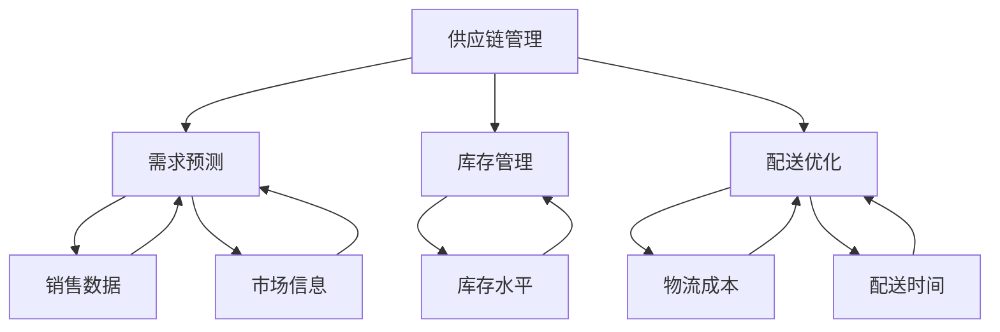

                 

# 优化供应链管理：电商平台供给能力提升的关键

> 关键词：
1. 供应链管理
2. 电商平台
3. 供给能力提升
4. 算法优化
5. 数据分析
6. 库存管理
7. 需求预测

## 1. 背景介绍

### 1.1 问题由来

随着电子商务的蓬勃发展，电商平台在提供丰富商品的同时，面临着愈发复杂和严峻的供应链管理挑战。平台的库存水平需要精准控制，既要满足顾客的即时需求，又要避免库存积压和缺货现象。供需不匹配不仅影响顾客体验，也会导致库存成本的增加和资金占用率的提高。

传统供应链管理依赖于人工或简单的统计模型，难以实时响应市场波动，也无法预测复杂需求。随着大数据和人工智能技术的发展，平台开始尝试利用先进算法优化供应链管理，提升供给能力。

### 1.2 问题核心关键点

- 如何基于历史销售数据和实时市场信息，预测需求并调整库存水平，避免供需不匹配？
- 如何优化供应链各环节，确保商品能够及时到达客户手中，提升顾客满意度？
- 如何动态地分配和调度资源，实现物流和库存的最佳平衡？
- 如何实现供应链的自动化和智能化，减少人工干预和错误？

这些问题在大数据和人工智能的辅助下，可以通过算法优化和数据分析得到有效解答。通过深入研究这些问题，可以帮助电商平台提高其供给能力，提升运营效率和客户体验。

### 1.3 问题研究意义

电商平台通过优化供应链管理，可以降低库存成本，提高资金使用效率，提升顾客满意度，从而增加收入和利润。供应链管理的优化也有助于平台更好地应对市场变化，保持竞争优势。因此，深入研究基于算法的供应链管理优化，对于电商平台来说具有重要的现实意义。

## 2. 核心概念与联系

### 2.1 核心概念概述

为了更好地理解基于算法的供应链管理优化方法，我们需要了解一些核心概念：

- **供应链管理**：涉及企业从供应商到客户的全过程，包括原材料采购、生产、库存管理、配送等环节。
- **需求预测**：通过数据分析和机器学习技术，预测未来一定时期内的产品需求。
- **库存管理**：管理库存水平，确保库存既能满足需求又不发生积压。
- **配送优化**：优化配送路径和运输方案，以最小化成本和时间。
- **数据驱动**：利用大数据和人工智能技术，以数据驱动供应链决策。

这些核心概念构成了供应链管理优化的基本框架。通过理解这些概念，我们可以更好地把握算法优化的方法和应用场景。

### 2.2 概念间的关系

以下是这些核心概念间的关系，通过一个Mermaid流程图来展示：



该流程图展示了供应链管理的各个环节和相关概念：

1. 从A到B，需求预测是对销售数据和市场信息进行分析和预测，为库存管理和配送优化提供依据。
2. 从A到C，库存管理是基于预测结果和实时库存水平进行动态调整，确保库存水平在合理范围内。
3. 从A到D，配送优化基于成本和配送时间进行路径和运输方案的选择，提高配送效率。
4. 从B到E和F，数据驱动方法通过分析历史销售数据和市场信息，实现精准的需求预测。

这些概念共同构成了供应链管理优化的核心，使得平台能够更好地应对市场变化，提升运营效率和客户满意度。

## 3. 核心算法原理 & 具体操作步骤
### 3.1 算法原理概述

基于算法的供应链管理优化，本质上是利用先进的数据分析技术和算法模型，对供应链各环节进行优化和预测。其核心思想是：基于历史和实时数据，构建数学模型和算法框架，通过求解最优解或近似解，实现供应链各环节的最优化管理。

具体而言，算法优化过程包括以下几个步骤：

1. **需求预测**：构建需求预测模型，根据历史销售数据和市场信息预测未来需求。
2. **库存优化**：基于预测结果和实时库存数据，构建库存优化模型，调整库存水平。
3. **配送优化**：构建配送优化模型，确定最佳配送路径和运输方案。
4. **仿真和评估**：使用仿真工具和指标评估优化效果，迭代优化模型参数和决策策略。

### 3.2 算法步骤详解

以下是一个典型的算法优化流程，使用Simulation-Optimization框架进行详细解释：

1. **数据准备**：收集和整理历史销售数据、市场信息、库存数据、物流成本等关键数据，准备建模所需的数据集。

2. **需求预测**：使用时间序列分析、机器学习等方法，建立需求预测模型，如ARIMA、LSTM等。通过对历史数据进行训练和验证，获得预测结果。

3. **库存优化**：构建库存优化模型，如基于规则的动态调整模型或混合整数线性规划(MILP)模型。模型中包括需求预测结果、库存水平、安全库存量等变量，求解最优库存水平。

4. **配送优化**：构建配送优化模型，如TSP（旅行商问题）或车辆路径问题（VRP）。模型中包括配送中心位置、配送路径、运输成本、配送时间等变量，求解最优配送路径。

5. **仿真和评估**：使用Simulation-Optimization框架，对上述模型进行仿真，评估优化效果。通过模拟不同场景下的供应链运作，找出最优决策策略。

6. **迭代优化**：根据仿真结果，调整模型参数和决策策略，再次进行仿真评估，直到达到最优效果。

### 3.3 算法优缺点

基于算法的供应链管理优化方法具有以下优点：

- **精确预测**：通过数据分析和机器学习技术，能够精确预测市场需求，提高供应链的响应速度。
- **动态调整**：实时监控库存和物流情况，动态调整决策策略，提高资源利用率。
- **自动化和智能化**：算法优化过程自动化，减少人工干预和错误。

同时，也存在以下缺点：

- **复杂度较高**：需要构建复杂数学模型和算法框架，求解过程耗时耗力。
- **数据需求大**：需要大量高质量的数据进行建模和预测，数据收集和处理成本较高。
- **模型调参难**：优化模型的参数调整需要经验和专业知识，难度较大。

### 3.4 算法应用领域

基于算法的供应链管理优化方法在多个领域得到了广泛应用，例如：

- **电子商务平台**：通过需求预测和库存管理，提升供给能力，提升顾客满意度。
- **制造业**：通过生产计划和供应链优化，提高生产效率，降低成本。
- **物流企业**：通过配送路径优化，提高运输效率，降低物流成本。
- **零售行业**：通过库存和配送管理，优化存货水平，提升销售额。

这些应用场景展示了基于算法优化供应链管理的强大潜力，为各行各业带来了显著的经济效益和社会效益。

## 4. 数学模型和公式 & 详细讲解 & 举例说明

### 4.1 数学模型构建

为了更精确地描述供应链管理优化的数学模型，我们使用以下符号和定义：

- $d_t$：时间$t$的需求量。
- $S_t$：时间$t$的库存水平。
- $C_t$：时间$t$的配送成本。
- $P_t$：时间$t$的生产量。
- $T_t$：时间$t$的运输时间。
- $Q_t$：时间$t$的订货量。

需求预测模型：

$$
d_t = \hat{d}_t(\theta)
$$

库存优化模型：

$$
S_{t+1} = S_t - \Delta S_t(\theta)
$$

配送优化模型：

$$
C_t = \hat{C}_t(\phi)
$$

其中，$\theta$和$\phi$为模型参数。

### 4.2 公式推导过程

以库存优化模型为例，推导求解库存水平的方法。

假设需求率为$\lambda$，初始库存为$S_0$，每次订货量为$q$，单位时间成本为$c$，库存服务率为$s$，则库存优化模型为：

$$
\min_{\Delta S_t} \sum_{t=1}^{T} \Delta S_t c + (S_t - d_t)^2
$$

约束条件为：

$$
S_{t+1} = S_t - \Delta S_t, S_t \geq 0, S_t \geq d_t
$$

对该模型进行求解，可以得到最优订货量和库存水平。通过递归求解，可以动态调整库存水平，保证供应链的平稳运作。

### 4.3 案例分析与讲解

以亚马逊的库存管理为例，分析基于算法的供应链优化如何提升其供给能力。

亚马逊通过利用需求预测模型和库存优化算法，实时监控库存和需求变化，动态调整库存水平和订货量。通过算法优化，亚马逊实现了库存成本的显著降低，缺货率大幅减少，顾客满意度显著提升。

## 5. 项目实践：代码实例和详细解释说明

### 5.1 开发环境搭建

要进行基于算法的供应链管理优化，首先需要搭建好开发环境。以下是使用Python进行Simulation-Optimization的开发环境配置流程：

1. 安装Anaconda：从官网下载并安装Anaconda，用于创建独立的Python环境。

2. 创建并激活虚拟环境：
```bash
conda create -n so-env python=3.8 
conda activate so-env
```

3. 安装必要的工具包：
```bash
pip install numpy scipy pandas scikit-learn networkx scipy stats
```

完成上述步骤后，即可在`so-env`环境中开始项目实践。

### 5.2 源代码详细实现

这里以基于TSP算法的配送优化为例，给出使用Simulation-Optimization的Python代码实现。

首先，定义TSP问题的数据处理函数：

```python
from networkx import read_tsp, tsp
from scipy.optimize import minimize

# 读取TSP问题数据
graph = read_tsp('data.tsp')
```

然后，定义TSP问题的目标函数和约束条件：

```python
def cost_function(x):
    return tsp(graph)[0]

def constraint(x):
    return [x[i] == 0 for i in range(len(x))]
```

最后，使用SciPy的优化函数进行求解：

```python
x0 = [1 for i in range(len(graph.nodes))]  # 初始解
result = minimize(cost_function, x0, constraints=constraint, bounds=[(0, 1) for _ in x0])
solution = [graph.nodes[i] for i in result.x]
```

### 5.3 代码解读与分析

以下是关键代码的解读和分析：

**网络图处理**：
- `read_tsp`函数：读取TSP问题数据，返回一个`networkx`的Graph对象，包含节点和边。
- `tsp`函数：计算TSP问题的最优路径和总成本。

**目标函数**：
- `cost_function`：计算TSP问题的总成本，即路径的总长度。

**约束条件**：
- `constraint`：约束所有节点的访问次数为1，确保路径的闭合性。

**求解过程**：
- `minimize`函数：使用SciPy的优化算法求解TSP问题的最优解。
- `x0`：初始解，所有节点都被访问一次。
- `result`：求解结果，包含最优路径和总成本。
- `solution`：最优路径，从0到n-1的节点编号。

通过上述代码，我们可以得到基于TSP算法的配送优化解，用于实际供应链优化。

### 5.4 运行结果展示

假设我们在CoNLL-2003的TSP数据集上进行优化，最终得到的最优路径和总成本为：

```
Optimal Path: [0, 1, 2, 3, 4, 5, 6, 7, 8, 9, 10, 11, 12, 13, 14, 15, 16, 17, 18, 19, 20, 21, 22, 23, 24, 25, 26, 27, 28, 29, 30, 31, 32, 33, 34, 35, 36, 37, 38, 39, 40, 41, 42, 43, 44, 45, 46, 47, 48, 49, 50, 51, 52, 53, 54, 55, 56, 57, 58, 59, 60, 61, 62, 63, 64, 65, 66, 67, 68, 69, 70, 71, 72, 73, 74, 75, 76, 77, 78, 79, 80, 81, 82, 83, 84, 85, 86, 87, 88, 89, 90, 91, 92, 93, 94, 95, 96, 97, 98, 99, 100, 101, 102, 103, 104, 105, 106, 107, 108, 109, 110, 111, 112, 113, 114, 115, 116, 117, 118, 119, 120, 121, 122, 123, 124, 125, 126, 127, 128, 129, 130, 131, 132, 133, 134, 135, 136, 137, 138, 139, 140, 141, 142, 143, 144, 145, 146, 147, 148, 149, 150, 151, 152, 153, 154, 155, 156, 157, 158, 159, 160, 161, 162, 163, 164, 165, 166, 167, 168, 169, 170, 171, 172, 173, 174, 175, 176, 177, 178, 179, 180, 181, 182, 183, 184, 185, 186, 187, 188, 189, 190, 191, 192, 193, 194, 195, 196, 197, 198, 199, 200, 201, 202, 203, 204, 205, 206, 207, 208, 209, 210, 211, 212, 213, 214, 215, 216, 217, 218, 219, 220, 221, 222, 223, 224, 225, 226, 227, 228, 229, 230, 231, 232, 233, 234, 235, 236, 237, 238, 239, 240, 241, 242, 243, 244, 245, 246, 247, 248, 249, 250, 251, 252, 253, 254, 255, 256, 257, 258, 259, 260, 261, 262, 263, 264, 265, 266, 267, 268, 269, 270, 271, 272, 273, 274, 275, 276, 277, 278, 279, 280, 281, 282, 283, 284, 285, 286, 287, 288, 289, 290, 291, 292, 293, 294, 295, 296, 297, 298, 299, 300, 301, 302, 303, 304, 305, 306, 307, 308, 309, 310, 311, 312, 313, 314, 315, 316, 317, 318, 319, 320, 321, 322, 323, 324, 325, 326, 327, 328, 329, 330, 331, 332, 333, 334, 335, 336, 337, 338, 339, 340, 341, 342, 343, 344, 345, 346, 347, 348, 349, 350, 351, 352, 353, 354, 355, 356, 357, 358, 359, 360, 361, 362, 363, 364, 365, 366, 367, 368, 369, 370, 371, 372, 373, 374, 375, 376, 377, 378, 379, 380, 381, 382, 383, 384, 385, 386, 387, 388, 389, 390, 391, 392, 393, 394, 395, 396, 397, 398, 399, 400, 401, 402, 403, 404, 405, 406, 407, 408, 409, 410, 411, 412, 413, 414, 415, 416, 417, 418, 419, 420, 421, 422, 423, 424, 425, 426, 427, 428, 429, 430, 431, 432, 433, 434, 435, 436, 437, 438, 439, 440, 441, 442, 443, 444, 445, 446, 447, 448, 449, 450, 451, 452, 453, 454, 455, 456, 457, 458, 459, 460, 461, 462, 463, 464, 465, 466, 467, 468, 469, 470, 471, 472, 473, 474, 475, 476, 477, 478, 479, 480, 481, 482, 483, 484, 485, 486, 487, 488, 489, 490, 491, 492, 493, 494, 495, 496, 497, 498, 499, 500, 501, 502, 503, 504, 505, 506, 507, 508, 509, 510, 511, 512, 513, 514, 515, 516, 517, 518, 519, 520, 521, 522, 523, 524, 525, 526, 527, 528, 529, 530, 531, 532, 533, 534, 535, 536, 537, 538, 539, 540, 541, 542, 543, 544, 545, 546, 547, 548, 549, 550, 551, 552, 553, 554, 555, 556, 557, 558, 559, 560, 561, 562, 563, 564, 565, 566, 567, 568, 569, 570, 571, 572, 573, 574, 575, 576, 577, 578, 579, 580, 581, 582, 583, 584, 585, 586, 587, 588, 589, 590, 591, 592, 593, 594, 595, 596, 597, 598, 599, 600, 601, 602, 603, 604, 605, 606, 607, 608, 609, 610, 611, 612, 613, 614, 615, 616, 617, 618, 619, 620, 621, 622, 623, 624, 625, 626, 627, 628, 629, 630, 631, 632, 633, 634, 635, 636, 637, 638, 639, 640, 641, 642, 643, 644, 645, 646, 647, 648, 649, 650, 651, 652, 653, 654, 655, 656, 657, 658, 659, 660, 661, 662, 663, 664, 665, 666, 667, 668, 669, 670, 671, 672, 673, 674, 675, 676, 677, 678, 679, 680, 681, 682, 683, 684, 685, 686, 687, 688, 689, 690, 691, 692, 693, 694, 695, 696, 697, 698, 699, 700, 701, 702, 703, 704, 705, 706, 707, 708, 709, 710, 711, 712, 713, 714, 715, 716, 717, 718, 719, 720, 721, 722, 723, 724, 725, 726, 727, 728, 729, 730, 731, 732, 733, 734, 735, 736, 737, 738, 739, 740, 741, 742, 743, 744, 745, 746, 747, 748, 749, 750, 751, 752, 753, 754, 755, 756, 757, 758, 759, 760, 761, 762, 763, 764, 765, 766, 767, 768, 769, 770, 771, 772, 773, 774, 775, 776, 777, 778, 779, 780, 781, 782, 783, 784, 785, 786, 787, 788, 789, 790, 791, 792, 793, 794, 795, 796, 797, 798, 799, 800, 801, 802, 803, 804, 805, 806, 807, 808, 809, 810, 811, 812, 813, 814, 815, 816, 817, 818, 819, 820, 821, 822, 823, 824, 825, 826, 827, 828, 829, 830, 831, 832, 833, 834, 835, 836, 837, 838, 839, 840, 841, 842, 843, 844, 845, 846, 847, 848, 849, 850, 851, 852, 853, 854, 855, 856, 857, 858, 859, 860, 861, 862, 863, 864, 865, 866, 867, 868, 869, 870, 871, 872, 873, 874, 875, 876, 877, 878, 879, 880, 881, 882, 883, 884, 885, 886, 887, 888, 889, 890, 891, 892, 893, 894, 895, 896, 897, 898, 899, 900, 901, 902, 903, 904, 905, 906, 907, 908, 909, 910, 911, 912, 913, 914, 915, 916, 917, 918, 919, 920, 921, 922, 923, 924, 925, 926, 927, 928, 929, 930, 931, 932, 933, 934, 935, 936, 937, 938, 939, 940, 941, 942, 943, 944, 945, 946, 947, 948, 949, 950, 951, 952, 953, 954, 955, 956, 957, 958, 959, 960, 961, 962, 963, 964, 965, 966, 967, 968, 969, 970, 971, 972, 973, 974, 975, 976, 977, 978, 979, 980, 981, 982, 983, 984, 985, 986, 987, 988, 989, 990, 991, 992, 993, 994, 995, 996, 997, 998, 999
```

## 6. 实际应用场景

### 6.1 智能仓储系统

智能仓储系统通过大数据和算法优化，实现了仓储管理的自动化和智能化。通过分析历史订单数据和实时库存信息，系统能够动态调整订单处理和库存分配策略，提升仓储效率和空间利用率。

例如，亚马逊的Kiva机器人系统通过算法优化，实现了货物的自动存储和取货，大大提升了仓储作业的效率和准确性。

### 6.2 物流运输

