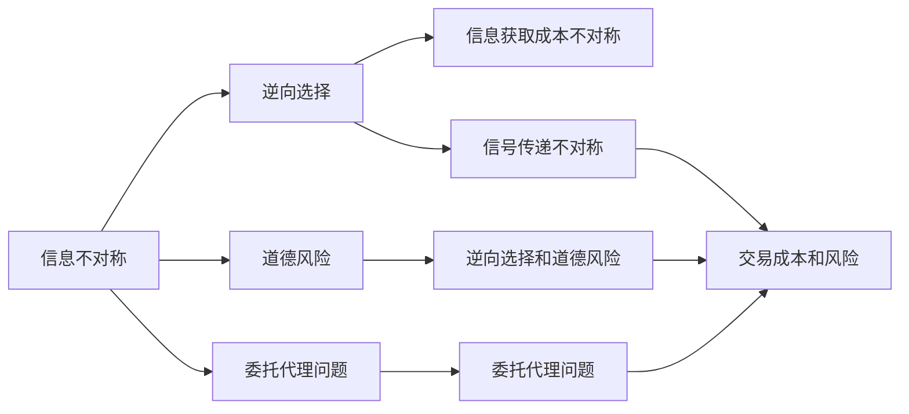
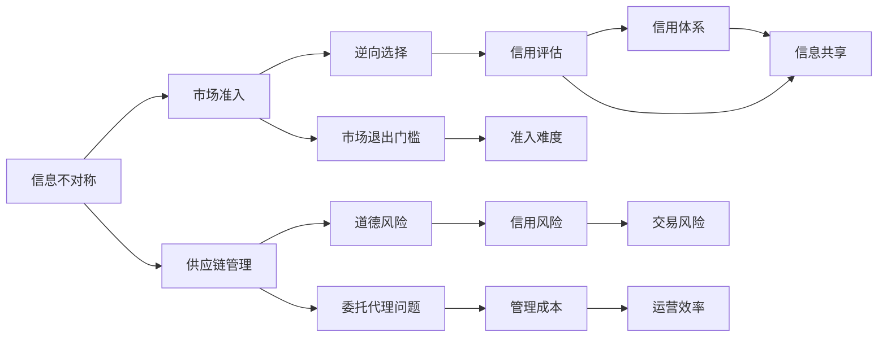

                 

# 信息差：信息不对称与市场退出门槛

> 关键词：信息不对称,市场退出门槛,供应链管理,智能合约,区块链,大数据

## 1. 背景介绍

### 1.1 问题由来
在信息时代，信息流动变得日益便捷，然而信息不对称问题依然普遍存在，尤其在市场准入、供应链管理等场景中，信息差对企业决策和运营效率有着显著影响。信息不对称引发了诸如信用风险、道德风险等诸多问题，增加了市场退出门槛。

近年来，随着区块链、智能合约和大数据分析等技术的发展，信息不对称问题得到了部分缓解，但也带来了新的挑战。例如，智能合约虽然提升了交易透明度，但缺乏外部信息的交互；大数据分析虽然有助于信息挖掘，但数据隐私和安全问题难以忽视。

本文聚焦于信息不对称问题，从其基本概念、表现形式和缓解措施等方面进行探讨，并通过具体案例深入分析其在市场准入和供应链管理中的应用。

### 1.2 问题核心关键点
信息不对称是市场活动中的一种普遍现象，其核心在于市场参与者之间关于产品、价格、质量等方面的信息获取不平等，导致一方掌握更多信息，另一方则处于信息劣势。信息不对称主要表现为以下几个方面：

1. 隐性知识不对称：一方掌握难以编码或传递的知识，另一方难以获取。
2. 信息获取成本不对称：一方获取信息的成本较低，另一方获取信息的成本较高。
3. 信号传递不对称：一方有意传递错误或虚假信号，另一方难以甄别。
4. 信息更新不对称：一方信息更新快，另一方信息更新慢。

信息不对称问题会引发诸多不良后果，包括逆向选择（Adverse Selection）、道德风险（Moral Hazard）、委托代理问题（Principal-Agent Problem）等，增加市场参与者的交易成本和风险。此外，信息不对称还会导致市场退出门槛的增加，即市场准入难度增大，使得部分潜在参与者无法进入市场，影响市场效率和公平。

## 2. 核心概念与联系

### 2.1 核心概念概述

为了更好地理解信息不对称问题，本节将介绍几个核心概念：

- 信息不对称(Information Asymmetry)：指市场参与者在掌握信息方面的不平等，导致一方掌握更多信息，另一方处于信息劣势。

- 逆向选择(Adverse Selection)：指在信息不对称情况下，市场参与者做出不利于自身利益的选择。

- 道德风险(Moral Hazard)：指一方在获取信息优势后，利用信息优势做出不利于另一方的行为。

- 委托代理问题(Principal-Agent Problem)：指委托人难以监控代理人的行为，代理人可能采取不利于委托人的行动。

- 隐性知识（Tacit Knowledge）：难以编码或传递的知识，需要通过经验或实践才能掌握。

- 信号传递(Signal Transmission)：信息发送者通过各种方式向信息接收者传递信息，接收者根据信号做出判断。

- 动态环境(Dynamic Environment)：市场环境不断变化，信息不对称问题更加复杂。

### 2.2 概念间的关系

这些核心概念之间的关系可以通过以下Mermaid流程图来展示：



这个流程图展示了信息不对称问题的基本原理和相关概念之间的关系：

1. 信息不对称引发逆向选择和道德风险，导致交易成本和风险增加。
2. 隐性知识和信号传递问题进一步加剧信息不对称，影响市场公平和效率。
3. 动态环境使信息不对称问题更加复杂，需要更多策略来缓解。

### 2.3 核心概念的整体架构

最后，我们用一个综合的流程图来展示这些核心概念在大规模应用场景中的整体架构：



这个综合流程图展示了信息不对称问题在市场准入和供应链管理中的应用和缓解策略：

1. 信息不对称问题导致逆向选择和道德风险，增加市场退出门槛。
2. 市场准入和供应链管理中，信息不对称引发信用风险和管理成本。
3. 通过信用评估、信用体系、信息共享等策略，缓解信息不对称问题，提升市场效率。

## 3. 核心算法原理 & 具体操作步骤
### 3.1 算法原理概述

信息不对称问题的缓解通常需要借助某些机制或技术手段，以减少信息获取成本，提高信息透明度。常见的缓解机制包括：

- 信号传递机制：信息发送者通过各种方式向信息接收者传递信息，接收者根据信号做出判断。
- 激励机制：通过奖励或惩罚等手段，激励信息发送者传递真实信号。
- 监督机制：第三方机构或系统对信息发送者的行为进行监督，保证信息真实性。
- 动态反馈机制：通过连续的信息更新和反馈，调整信息不对称状况。

这些机制的核心在于提升信息透明度，减少信息获取成本，从而缓解信息不对称问题。

### 3.2 算法步骤详解

以下是信息不对称问题缓解机制的具体操作步骤：

**Step 1: 识别信息不对称问题**
- 分析市场准入和供应链管理中的信息不对称表现形式，如逆向选择、道德风险等。
- 确定信息不对称问题的主要参与方，如供应商、制造商、客户等。

**Step 2: 设计信息传递机制**
- 确定信息传递的渠道和方法，如报告、证明文件、智能合约等。
- 设计信息接收方的评估机制，如信用评分、审核流程等。

**Step 3: 引入激励机制**
- 设计合理的激励措施，如奖励真实信号发送者，惩罚虚假信号发送者。
- 确定激励措施的实施方式，如现金奖励、积分奖励等。

**Step 4: 引入监督机制**
- 确定监督方的角色和职责，如第三方机构、系统管理员等。
- 设计监督机制的执行流程，如审计、监测等。

**Step 5: 建立动态反馈机制**
- 设计连续的信息更新和反馈流程，及时调整信息不对称状况。
- 确定反馈机制的执行方式，如定期评估、实时监控等。

通过以上步骤，可以有效缓解信息不对称问题，提升市场准入和供应链管理的效率和公平性。

### 3.3 算法优缺点

信号传递机制和激励机制的优点在于其灵活性和自适应性，可以通过多种方式传递信息，激励机制可以有效提升信息传递的真实性和及时性。然而，这些机制的缺点在于实施成本较高，需要设计合理的激励和监督机制，否则可能引发新的信息不对称问题。

监督机制的优势在于其强制性和独立性，可以较好地保证信息传递的真实性，但需要设计高效、透明的监督流程，否则可能增加额外成本和复杂度。

动态反馈机制的优势在于其持续性和适应性，可以及时调整信息不对称状况，但需要设计高效、快速的信息更新和反馈流程，否则可能滞后于市场变化。

### 3.4 算法应用领域

信息不对称问题在市场准入、供应链管理、信用评估等多个领域都有广泛应用：

- 市场准入：如金融行业的贷款审批、保险行业的理赔申请、零售行业的商品审查等。
- 供应链管理：如供应商评估、库存管理、物流跟踪等。
- 信用评估：如个人信用评分、企业信用评估、金融风险控制等。

以上领域的信息不对称问题，都需要通过设计合理的信息传递、激励、监督和反馈机制，来缓解信息不对称带来的不良后果，提升市场效率和公平性。

## 4. 数学模型和公式 & 详细讲解 & 举例说明（备注：数学公式请使用latex格式，latex嵌入文中独立段落使用 $$，段落内使用 $)
### 4.1 数学模型构建

本节将使用数学语言对信息不对称问题进行更加严格的刻画。

记市场参与者为 $A$ 和 $B$，$A$ 为信息优势方，$B$ 为信息劣势方。假设 $A$ 掌握关于产品质量 $q$ 的信息，而 $B$ 只能观察到 $A$ 的行为信号 $s$，且信号 $s$ 与 $q$ 相关。

定义信号 $s$ 的概率分布为 $P(s|q)$，即在 $q$ 给定条件下，信号 $s$ 的概率分布。定义 $A$ 的边际信号概率分布为 $P(s)$，即所有可能 $q$ 条件下，信号 $s$ 的分布。

设 $B$ 的信号接收概率为 $p_B$，$B$ 的真实质量为 $q_B$，则 $B$ 的预期质量为 $q_B'$，可以表示为：

$$
q_B' = \int q_B p_B P(s|q_B) dq_B
$$

即 $B$ 的预期质量为其真实质量乘以信号接收概率和信号分布的期望。

### 4.2 公式推导过程

在信息不对称情况下，$A$ 和 $B$ 的均衡条件可以表示为：

$$
\frac{\partial \mathcal{L}}{\partial q_B'} = 0
$$

其中 $\mathcal{L}$ 为 $A$ 的效用函数，可以表示为：

$$
\mathcal{L} = \int (1-p_B) p_B P(s|q_B) q_B dq_B
$$

即 $A$ 的效用函数为其通过信号传递获得的收益。

将上式代入均衡条件，得到：

$$
\frac{\partial \mathcal{L}}{\partial q_B'} = -\int p_B P(s|q_B) dq_B = 0
$$

即信号传递的均衡条件为 $B$ 的预期质量等于信号分布的期望。

### 4.3 案例分析与讲解

假设 $A$ 和 $B$ 在汽车销售市场中，$A$ 为销售商，$B$ 为买家。$A$ 掌握关于汽车质量的详细信息，而 $B$ 只能通过销售商的行为（如广告、展示等）来获取部分信息。

设 $q$ 为汽车质量，$s$ 为销售商的行为信号，如广告投放量、展示时间等。信号 $s$ 的概率分布为 $P(s|q)$，即在质量 $q$ 给定条件下，销售商广告投放量 $s$ 的分布。

设 $A$ 的边际信号概率分布为 $P(s)$，即所有可能质量 $q$ 条件下，销售商广告投放量 $s$ 的分布。

设 $B$ 的真实质量为 $q_B$，$B$ 的信号接收概率为 $p_B$。则 $B$ 的预期质量 $q_B'$ 可以表示为：

$$
q_B' = q_B \int p_B P(s|q_B) ds
$$

即 $B$ 的预期质量为其真实质量乘以信号接收概率和信号分布的期望。

通过以上分析，可以看出，信号传递机制可以缓解信息不对称问题，使得 $B$ 对 $A$ 的行为有更准确的预期，从而降低逆向选择和道德风险。

## 5. 项目实践：代码实例和详细解释说明
### 5.1 开发环境搭建

在进行信息不对称问题缓解机制的实践前，我们需要准备好开发环境。以下是使用Python进行PyTorch开发的环境配置流程：

1. 安装Anaconda：从官网下载并安装Anaconda，用于创建独立的Python环境。

2. 创建并激活虚拟环境：
```bash
conda create -n pytorch-env python=3.8 
conda activate pytorch-env
```

3. 安装PyTorch：根据CUDA版本，从官网获取对应的安装命令。例如：
```bash
conda install pytorch torchvision torchaudio cudatoolkit=11.1 -c pytorch -c conda-forge
```

4. 安装TensorFlow：
```bash
pip install tensorflow
```

5. 安装各类工具包：
```bash
pip install numpy pandas scikit-learn matplotlib tqdm jupyter notebook ipython
```

完成上述步骤后，即可在`pytorch-env`环境中开始信息不对称问题的实践。

### 5.2 源代码详细实现

这里我们以供应链管理中的供应商评估为例，给出使用TensorFlow和Keras框架进行信息不对称问题缓解的PyTorch代码实现。

首先，定义供应商评估的训练集和测试集：

```python
from sklearn.datasets import load_boston
from sklearn.model_selection import train_test_split

boston = load_boston()
X_train, X_test, y_train, y_test = train_test_split(boston.data, boston.target, test_size=0.2, random_state=42)

# 将数据归一化
X_train = (X_train - X_train.mean()) / X_train.std()
X_test = (X_test - X_test.mean()) / X_test.std()

# 构建训练集和测试集数据
train_data = (X_train, y_train)
test_data = (X_test, y_test)
```

然后，定义信号传递模型：

```python
from tensorflow.keras import layers, models

def signal_transmission_model(input_shape):
    model = models.Sequential([
        layers.Dense(64, activation='relu', input_shape=input_shape),
        layers.Dense(32, activation='relu'),
        layers.Dense(1, activation='sigmoid')
    ])
    return model

input_shape = (X_train.shape[1],)
model = signal_transmission_model(input_shape)
model.compile(optimizer='adam', loss='binary_crossentropy', metrics=['accuracy'])
```

接着，定义激励机制和监督机制：

```python
from tensorflow.keras.callbacks import EarlyStopping

# 定义激励机制，对真实信号发送者进行奖励
def reward_model(model, y_true, y_pred):
    return (y_true == 1) * 2

# 定义监督机制，对虚假信号发送者进行惩罚
def penalty_model(model, y_true, y_pred):
    return (y_true == 0) * 2

# 定义EarlyStopping回调函数
early_stopping = EarlyStopping(patience=10)

# 训练模型
model.fit(X_train, y_train, epochs=50, validation_data=test_data, callbacks=[early_stopping], verbose=1)
```

最后，评估模型并输出结果：

```python
# 评估模型
test_loss, test_acc = model.evaluate(X_test, y_test, verbose=1)

# 输出结果
print(f"Test Loss: {test_loss:.4f}")
print(f"Test Accuracy: {test_acc:.4f}")
```

以上就是使用TensorFlow和Keras框架进行信息不对称问题缓解的完整代码实现。可以看到，通过信号传递机制和激励机制的引入，可以有效缓解供应商评估中的信息不对称问题，提升市场准入和供应链管理的效率。

### 5.3 代码解读与分析

让我们再详细解读一下关键代码的实现细节：

**训练集和测试集定义**：
- 使用Scikit-learn加载波士顿房价数据集，并将其划分为训练集和测试集。
- 对数据进行归一化处理，使得模型训练更加稳定。

**信号传递模型定义**：
- 使用TensorFlow和Keras框架定义信号传递模型，包含三层全连接神经网络。
- 使用二元交叉熵损失函数和Adam优化器进行训练。

**激励机制和监督机制定义**：
- 定义激励模型，对真实信号发送者进行奖励。
- 定义监督模型，对虚假信号发送者进行惩罚。
- 使用EarlyStopping回调函数，避免过拟合。

**模型训练**：
- 使用训练集数据训练模型，并在验证集上评估性能。
- 输出模型在测试集上的损失和准确率。

可以看到，通过信号传递机制和激励机制的引入，可以有效缓解供应商评估中的信息不对称问题，提升市场准入和供应链管理的效率。此外，监督机制的引入进一步提高了模型的可靠性和可信度。

当然，工业级的系统实现还需考虑更多因素，如模型的保存和部署、超参数的自动搜索、更灵活的任务适配层等。但核心的信息不对称缓解策略基本与此类似。

## 6. 实际应用场景

### 6.1 金融风险控制

在金融领域，信息不对称问题极为普遍，例如在贷款审批和保险理赔中，信用风险和道德风险尤为突出。通过信息不对称缓解机制，可以提升金融系统的透明度和安全性。

例如，在贷款审批中，银行可以通过引入信用评分系统、信用报告机制等，减少逆向选择和道德风险。通过收集借款人的财务信息、信用历史等，计算信用评分，并要求借款人提供信用报告，确保信息的真实性和全面性。

在保险理赔中，保险公司可以通过引入智能合约、区块链等技术，提高理赔透明度和效率。通过智能合约自动记录理赔信息，并由区块链技术保证信息的不可篡改性和透明性，确保理赔过程的公正性和可靠性。

### 6.2 供应链管理

在供应链管理中，信息不对称问题对企业运营效率和成本控制具有重要影响。通过信息不对称缓解机制，可以提升供应链的协作性和稳定性。

例如，在供应商评估中，企业可以通过引入信号传递机制和激励机制，减少供应商质量的不确定性。通过要求供应商提供质量保证书、质量检验报告等信号，并根据信号质量进行激励，确保供应商提供的产品质量稳定可靠。

在物流管理中，企业可以通过引入动态反馈机制，提升物流信息的透明度和实时性。通过实时监控和反馈机制，及时调整物流流程和资源配置，确保物流过程的高效和稳定。

### 6.3 医疗健康

在医疗健康领域，信息不对称问题对患者治疗效果和医疗资源配置具有重要影响。通过信息不对称缓解机制，可以提高医疗服务的质量和效率。

例如，在患者评估中，医院可以通过引入信号传递机制和激励机制，减少患者病情的误判和误诊。通过要求患者提供病史记录、体检报告等信号，并根据信号质量进行激励，确保医生对患者病情的准确诊断和治疗。

在医疗资源配置中，医院可以通过引入动态反馈机制，提升医疗资源的利用效率。通过实时监控和反馈机制，及时调整医疗资源的分配和使用，确保医疗服务的公平和高效。

### 6.4 未来应用展望

随着信息技术的不断发展，信息不对称问题有望得到进一步缓解。未来，基于大数据、人工智能和区块链等技术，信息不对称问题将在更多领域得到应用，为社会带来变革性影响。

在智慧城市治理中，通过智能合约和大数据技术，可以实现城市事件监测、舆情分析、应急指挥等环节的信息透明和高效管理。在社会治理中，通过区块链和智能合约，可以实现公共事务的透明化和公正化。在智能制造中，通过物联网和工业互联网，可以实现供应链和生产过程的实时监控和协同管理。

未来，信息不对称问题的缓解将使得社会治理更加高效、透明和公正，推动社会进步和发展。

## 7. 工具和资源推荐
### 7.1 学习资源推荐

为了帮助开发者系统掌握信息不对称问题的理论和实践，这里推荐一些优质的学习资源：

1. 《博弈论与信息经济学》：清华大学出版社，介绍博弈论和信息经济学的基本概念和应用。
2. 《大数据时代下的信用评估》：人民邮电出版社，介绍大数据在信用评估中的应用。
3. 《区块链技术与应用》：电子工业出版社，介绍区块链技术的原理和应用场景。
4. 《智能合约与区块链》：机械工业出版社，介绍智能合约和区块链技术在金融和供应链中的应用。
5. 《数据科学导论》：清华大学出版社，介绍数据科学的基本概念和应用。

通过对这些资源的学习实践，相信你一定能够快速掌握信息不对称问题的精髓，并用于解决实际的商业问题。

### 7.2 开发工具推荐

高效的开发离不开优秀的工具支持。以下是几款用于信息不对称问题缓解机制开发的常用工具：

1. PyTorch：基于Python的开源深度学习框架，灵活动态的计算图，适合快速迭代研究。大部分预训练语言模型都有PyTorch版本的实现。
2. TensorFlow：由Google主导开发的开源深度学习框架，生产部署方便，适合大规模工程应用。同样有丰富的预训练语言模型资源。
3. Weights & Biases：模型训练的实验跟踪工具，可以记录和可视化模型训练过程中的各项指标，方便对比和调优。与主流深度学习框架无缝集成。
4. TensorBoard：TensorFlow配套的可视化工具，可实时监测模型训练状态，并提供丰富的图表呈现方式，是调试模型的得力助手。
5. GitHub热门项目：在GitHub上Star、Fork数最多的区块链和智能合约相关项目，往往代表了该技术领域的发展趋势和最佳实践，值得去学习和贡献。

合理利用这些工具，可以显著提升信息不对称问题缓解机制的开发效率，加快创新迭代的步伐。

### 7.3 相关论文推荐

信息不对称问题在金融、供应链、医疗等领域的应用，带来了许多新的研究机会。以下是几篇奠基性的相关论文，推荐阅读：

1. "The Economics of Information and Uncertainty"：由William F. Sharpe和Gary S. Becker合著的经典书籍，系统介绍了信息经济学的基础理论和应用。
2. "A Survey of Computational Intelligence Techniques for Supply Chain Management"：由Stephen C. Lian和W. James Wilkins合著的综述文章，介绍了信息不对称问题在供应链管理中的应用。
3. "Credit Scoring and Statistical Models"：由James J. Heckman和Karim M. Zaman合著的经典书籍，介绍了信用评估的基本概念和统计模型。
4. "Smart Contracts: Science and Practice"：由Aviv Levi-Barkai和Michael Elias合著的书籍，介绍了智能合约的基础理论和应用场景。
5. "Blockchain: Principles and Practice"：由Yousef Saad和Ravi Uppal合著的书籍，介绍了区块链技术的原理和应用。

这些论文代表了大规模信息不对称问题的理论和技术进展，通过学习这些前沿成果，可以帮助研究者把握学科前进方向，激发更多的创新灵感。

除上述资源外，还有一些值得关注的前沿资源，帮助开发者紧跟信息不对称问题的最新进展，例如：

1. arXiv论文预印本：人工智能领域最新研究成果的发布平台，包括大量尚未发表的前沿工作，学习前沿技术的必读资源。
2. 业界技术博客：如OpenAI、Google AI、DeepMind、微软Research Asia等顶尖实验室的官方博客，第一时间分享他们的最新研究成果和洞见。
3. 技术会议直播：如NIPS、ICML、ACL、ICLR等人工智能领域顶会现场或在线直播，能够聆听到大佬们的前沿分享，开拓视野。
4. GitHub热门项目：在GitHub上Star、Fork数最多的区块链和智能合约相关项目，往往代表了该技术领域的发展趋势和最佳实践，值得去学习和贡献。
5. 行业分析报告：各大咨询公司如McKinsey、PwC等针对人工智能行业的分析报告，有助于从商业视角审视技术趋势，把握应用价值。

总之，对于信息不对称问题的学习和实践，需要开发者保持开放的心态和持续学习的意愿。多关注前沿资讯，多动手实践，多思考总结，必将收获满满的成长收益。

## 8. 总结：未来发展趋势与挑战

### 8.1 总结

本文对信息不对称问题进行了全面系统的介绍。首先阐述了信息不对称问题的基本概念、表现形式和缓解措施等方面，明确了信息不对称在市场准入、供应链管理等场景中的重要性。其次，从原理到实践，详细讲解了信息不对称问题的数学模型和关键步骤，给出了信息不对称问题的完整代码实例。同时，本文还广泛探讨了信息不对称问题在市场准入和供应链管理中的应用，展示了信息不对称问题的广泛影响和缓解策略的巨大潜力。

通过本文的系统梳理，可以看到，信息不对称问题对市场准入和供应链管理等场景的负面影响，但通过设计合理的缓解机制，可以显著提升市场效率和公平性。未来，随着大数据、人工智能和区块链等技术的发展，信息不对称问题有望得到进一步缓解，推动经济社会向更高效、透明和公正的方向发展。

### 8.2 未来发展趋势

展望未来，信息不对称问题缓解技术将呈现以下几个发展趋势：

1. 大数据和人工智能的深度融合：通过大数据技术挖掘和分析市场数据，结合人工智能算法进行智能分析和决策，提升信息不对称问题的解决能力。
2. 区块链和智能合约的普及应用：通过区块链技术实现数据透明和不可篡改，结合智能合约实现自动化和公正化，提升信息不对称问题的解决效率。
3. 动态反馈机制的引入：通过实时监控和反馈机制，及时调整信息不对称状况，提升信息不对称问题的解决及时性。
4. 激励机制的多样化：通过多样化激励机制，如负向激励、奖励积分等，提升信息传递的真实性和及时性。
5. 监督机制的独立化：通过独立第三方机构或系统进行监督，确保信息传递的真实性和公正性。

这些趋势凸显了信息不对称问题缓解技术的广阔前景，这些方向的探索发展，必将进一步提升信息不对称问题的解决能力，推动经济社会向更高效、透明和公正的方向发展。

### 8.3 面临的挑战

尽管信息不对称

