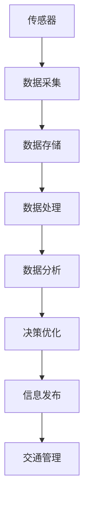

                 

# 信息差：大数据在智能交通中的应用

## 1. 背景介绍

### 1.1 问题由来

随着城市化进程的加快，交通拥堵问题日益严重，对城市管理和居民生活带来了巨大的挑战。传统的交通管理方法主要依赖于固定监控摄像头、人工巡逻等手段，存在效率低下、反应迟缓、管理成本高等问题。大数据技术的崛起，为智能交通管理提供了新的思路。通过海量交通数据的实时采集、分析和应用，智能交通系统可以大幅提升交通运行效率、减少交通延误、改善交通环境，从而提高城市的综合竞争力。

### 1.2 问题核心关键点

智能交通系统通过大数据技术，实现了对交通流量的实时监控、分析和预测。其核心思想是：利用传感器、GPS等设备采集到的海量交通数据，通过数据挖掘和机器学习等技术，提取交通模式和规律，预测交通流量变化，从而实时调整交通信号灯、优化交通流向，减少交通拥堵。

智能交通系统一般包括以下几个关键点：
1. **数据采集**：通过传感器、GPS、摄像头等设备，实时采集交通流量、车速、事故等信息。
2. **数据存储**：将采集到的交通数据存储在数据仓库中，方便后续处理和分析。
3. **数据处理**：利用大数据技术对交通数据进行清洗、预处理、特征工程等操作。
4. **数据分析**：通过数据挖掘、机器学习等技术，对交通数据进行模式识别、趋势预测、行为分析等。
5. **决策优化**：根据数据分析结果，生成交通信号灯控制策略、路网优化方案等，从而改善交通状况。
6. **信息发布**：通过信息板、APP、广播等方式，将交通状况、路线建议等信息发布给公众，提高出行效率。

### 1.3 问题研究意义

智能交通系统通过大数据技术，极大地提高了交通管理效率，改善了城市交通环境。研究智能交通系统中的大数据应用，对于提升城市综合竞争力、推动智慧城市建设具有重要意义：

1. **提升交通效率**：通过实时监控和分析，智能交通系统可以实时调整交通信号灯，优化交通流向，减少交通延误，提高道路通行效率。
2. **改善交通环境**：通过数据挖掘和预测，智能交通系统可以提前发现事故、故障等异常情况，及时采取措施，保障道路安全。
3. **降低管理成本**：相比于人工管理，智能交通系统大幅减少了人力物力成本，提高了城市交通管理的智能化水平。
4. **推动智慧城市建设**：智能交通系统作为智慧城市的重要组成部分，是构建智能城市的重要基础。
5. **促进科技创新**：智能交通系统催生了众多前沿技术和应用场景，推动了大数据、人工智能等领域的科技创新。

## 2. 核心概念与联系

### 2.1 核心概念概述

为更好地理解智能交通系统中的大数据应用，本节将介绍几个密切相关的核心概念：

- **智能交通系统**：基于大数据、物联网、人工智能等技术，实现交通流量的实时监控、分析和预测，优化交通管理的一种智能化系统。
- **数据采集**：通过传感器、GPS、摄像头等设备，实时采集交通流量、车速、事故等信息的过程。
- **数据存储**：将采集到的交通数据存储在数据仓库或数据库中，方便后续处理和分析。
- **数据处理**：对采集到的交通数据进行清洗、预处理、特征工程等操作，以便后续分析。
- **数据分析**：利用大数据技术对交通数据进行模式识别、趋势预测、行为分析等，提取交通模式和规律。
- **决策优化**：根据数据分析结果，生成交通信号灯控制策略、路网优化方案等，从而改善交通状况。
- **信息发布**：将交通状况、路线建议等信息发布给公众，提高出行效率。

这些核心概念之间的逻辑关系可以通过以下Mermaid流程图来展示：


这个流程图展示了大数据在智能交通系统中的整体应用框架，从数据采集到信息发布，大数据技术贯穿始终。

### 2.2 概念间的关系

这些核心概念之间存在着紧密的联系，形成了智能交通系统的大数据应用生态系统。下面我通过几个Mermaid流程图来展示这些概念之间的关系。

#### 2.2.1 智能交通系统的整体架构



这个流程图展示了智能交通系统的整体架构，从传感器数据采集到交通管理，每个环节都涉及到大数据的处理和应用。

#### 2.2.2 数据处理流程


这个流程图展示了数据处理的一般流程，从数据清洗到模型应用，每个环节都需要数据处理技术的支持。

#### 2.2.3 数据分析与决策优化的关系


这个流程图展示了数据分析与决策优化的关系，从数据存储到策略生成，每个环节都涉及到大数据分析。

## 3. 核心算法原理 & 具体操作步骤

### 3.1 算法原理概述

智能交通系统中的大数据应用，主要通过以下几个关键算法和步骤实现：

1. **数据采集与预处理**：通过传感器、GPS、摄像头等设备，实时采集交通流量、车速、事故等信息。然后对采集到的数据进行清洗、去噪、填充缺失值等预处理操作。
2. **特征工程**：从预处理后的数据中提取有用的特征，如交通流量、车速、道路密度等。
3. **模式识别**：利用分类、聚类等算法，识别交通模式和规律，如高峰时段、拥堵路段等。
4. **趋势预测**：通过时间序列分析、回归分析等技术，预测交通流量的变化趋势，如交通流量高峰、道路堵塞等。
5. **行为分析**：通过关联规则挖掘、异常检测等算法，分析驾驶员行为，如违规超车、停车等待等。
6. **决策优化**：根据数据分析结果，生成交通信号灯控制策略、路网优化方案等，从而改善交通状况。
7. **信息发布**：通过信息板、APP、广播等方式，将交通状况、路线建议等信息发布给公众，提高出行效率。

### 3.2 算法步骤详解

#### 3.2.1 数据采集与预处理

1. **数据采集**：部署传感器、GPS、摄像头等设备，实时采集交通流量、车速、事故等信息。数据采集设备需要满足高精度、高可靠性的要求，确保数据的质量。
2. **数据清洗**：去除噪声、缺失值、异常值等，确保数据的一致性和完整性。数据清洗是数据预处理的重要环节，直接影响后续分析的结果。
3. **数据存储**：将清洗后的数据存储在数据仓库或数据库中，方便后续处理和分析。数据存储需要满足高可扩展性、高可维护性的要求。

#### 3.2.2 特征工程

1. **特征选择**：从原始数据中筛选出有用的特征，如交通流量、车速、道路密度等。特征选择需要结合领域知识，确保选取的特征对后续分析具有较高的相关性。
2. **特征变换**：对选定的特征进行变换，如标准化、归一化等，以便后续模型训练。特征变换需要根据具体分析任务进行设计和优化。
3. **特征构造**：通过组合、降维等技术，构造新的特征，如交通流量变化趋势、车速分布等。特征构造可以提升模型的表达能力和泛化能力。

#### 3.2.3 模式识别

1. **分类算法**：利用K-means、SVM等分类算法，将交通数据分为不同的类别，如拥堵、畅通等。分类算法需要根据具体分析任务进行选择合适的算法和参数。
2. **聚类算法**：利用K-means、层次聚类等算法，将交通数据聚类为不同的组，如高峰时段、非高峰时段等。聚类算法需要根据具体分析任务进行设计和优化。
3. **异常检测**：利用孤立森林、DBSCAN等算法，检测交通数据中的异常情况，如事故、故障等。异常检测需要根据具体分析任务进行设计和优化。

#### 3.2.4 趋势预测

1. **时间序列分析**：利用ARIMA、LSTM等算法，对交通流量等时间序列数据进行趋势预测。时间序列分析需要根据具体分析任务进行设计和优化。
2. **回归分析**：利用线性回归、随机森林等算法，对交通流量等回归问题进行预测。回归分析需要根据具体分析任务进行设计和优化。
3. **模型评估**：利用均方误差、均方根误差等指标，对预测结果进行评估和验证。模型评估需要根据具体分析任务进行设计和优化。

#### 3.2.5 行为分析

1. **关联规则挖掘**：利用Apriori、FP-growth等算法，挖掘交通数据中的关联规则，如违规超车、停车等待等。关联规则挖掘需要根据具体分析任务进行设计和优化。
2. **异常检测**：利用孤立森林、DBSCAN等算法，检测交通数据中的异常情况，如违规超车、停车等待等。异常检测需要根据具体分析任务进行设计和优化。
3. **行为建模**：利用贝叶斯网络、隐马尔可夫模型等算法，对驾驶员行为进行建模和预测。行为建模需要根据具体分析任务进行设计和优化。

#### 3.2.6 决策优化

1. **策略生成**：根据数据分析结果，生成交通信号灯控制策略、路网优化方案等，从而改善交通状况。策略生成需要结合领域知识，确保生成的策略具有实际可操作性。
2. **策略部署**：将生成的策略部署到交通管理系统，如交通信号灯控制系统、路网优化系统等。策略部署需要满足高可靠性、高实时性的要求。

#### 3.2.7 信息发布

1. **信息发布平台**：利用信息板、APP、广播等方式，将交通状况、路线建议等信息发布给公众。信息发布平台需要满足高可用性、高可靠性的要求。
2. **信息展示**：将处理后的数据和分析结果展示给公众，提高出行效率。信息展示需要满足高直观性、高易用性的要求。

### 3.3 算法优缺点

智能交通系统中的大数据应用具有以下优点：

1. **高效性**：通过大数据技术，实现交通流量的实时监控、分析和预测，提高了交通管理的效率和精度。
2. **准确性**：利用大数据技术，准确识别交通模式和规律，提高决策的科学性和合理性。
3. **灵活性**：大数据技术具有很强的可扩展性和可维护性，可以应对多种交通场景和需求。

同时，智能交通系统中的大数据应用也存在以下缺点：

1. **数据复杂性**：智能交通系统需要处理大规模、高维度的数据，数据处理复杂度较高。
2. **数据隐私**：智能交通系统涉及大量的个人隐私信息，需要采取严格的数据保护措施。
3. **成本高**：智能交通系统的建设需要高昂的设备投资和维护成本，初期投入较大。
4. **技术复杂性**：智能交通系统需要综合运用多种大数据技术，技术复杂度较高。

### 3.4 算法应用领域

智能交通系统中的大数据应用，已经在许多城市得到广泛应用，覆盖了智能交通管理的各个环节，例如：

1. **交通流量监控**：通过传感器、GPS等设备，实时监控交通流量，分析交通模式和规律，预测交通流量变化。
2. **交通信号控制**：利用数据分析结果，生成交通信号灯控制策略，实时调整交通信号灯，优化交通流向，减少交通延误。
3. **路网优化**：通过数据分析，生成路网优化方案，如调整交通流向、增加车道等，从而改善交通状况。
4. **事故预警**：通过数据分析，提前发现事故、故障等异常情况，及时采取措施，保障道路安全。
5. **信息发布**：通过信息板、APP、广播等方式，将交通状况、路线建议等信息发布给公众，提高出行效率。

除了上述这些经典应用外，智能交通系统中的大数据技术还在不断拓展，如智能停车、自动驾驶、智能物流等领域，为城市交通管理和智能化转型提供了新的解决方案。

## 4. 数学模型和公式 & 详细讲解 & 举例说明

### 4.1 数学模型构建

智能交通系统中的大数据应用，涉及多种数学模型和算法，以下以交通流量预测为例，给出具体的数学模型构建过程。

假设智能交通系统采集到了历史交通流量数据 $\{t_i\}_{i=1}^N$，其中 $t_i$ 表示第 $i$ 个时间点的交通流量，$i$ 表示时间索引。我们的目标是利用历史数据预测未来某个时间点的交通流量 $t_{t_0+T}$，其中 $T$ 表示预测时间步长。

定义 $X$ 为历史数据特征集合，包括时间、日期、天气、节假日等，$y$ 为交通流量预测值，即 $t_{t_0+T}$。我们的目标是建立一个回归模型，通过 $X$ 预测 $y$。

### 4.2 公式推导过程

根据回归问题的定义，我们的目标是最小化均方误差，即：

$$
\min_{\theta} \frac{1}{N}\sum_{i=1}^N (t_i - \hat{t_i})^2
$$

其中 $\hat{t_i}$ 表示模型对 $t_i$ 的预测值，$\theta$ 表示模型参数。

我们采用线性回归模型，定义模型如下：

$$
\hat{t_i} = \theta_0 + \sum_{j=1}^d \theta_j x_{ij}
$$

其中 $\theta_0$ 为截距项，$\theta_j$ 为特征 $x_{ij}$ 的系数，$d$ 为特征个数。

将模型代入均方误差最小化目标，得：

$$
\min_{\theta} \frac{1}{N}\sum_{i=1}^N (t_i - \hat{t_i})^2 = \min_{\theta} \frac{1}{N}\sum_{i=1}^N (t_i - \theta_0 - \sum_{j=1}^d \theta_j x_{ij})^2
$$

对该目标进行求导，得：

$$
\frac{\partial}{\partial \theta} \frac{1}{N}\sum_{i=1}^N (t_i - \hat{t_i})^2 = 0
$$

化简得：

$$
\frac{1}{N}\sum_{i=1}^N \left(2(t_i - \hat{t_i})\right) = 0
$$

进一步化简，得：

$$
\frac{1}{N}\sum_{i=1}^N \left(2(t_i - \theta_0 - \sum_{j=1}^d \theta_j x_{ij})\right) = 0
$$

将式子展开，得：

$$
\frac{1}{N}\sum_{i=1}^N \left(2t_i - 2\theta_0 - 2\sum_{j=1}^d \theta_j x_{ij}\right) = 0
$$

整理得：

$$
\frac{1}{N}\sum_{i=1}^N \left(2t_i\right) - \frac{2\theta_0}{N}\sum_{i=1}^N 1 - \frac{2\theta_j}{N}\sum_{i=1}^N x_{ij} = 0
$$

进一步化简，得：

$$
\frac{1}{N}\sum_{i=1}^N t_i - \theta_0 - \sum_{j=1}^d \theta_j \frac{1}{N}\sum_{i=1}^N x_{ij} = 0
$$

整理得：

$$
\theta_0 = \frac{1}{N}\sum_{i=1}^N t_i - \sum_{j=1}^d \theta_j \frac{1}{N}\sum_{i=1}^N x_{ij}
$$

将式子整理得：

$$
\theta_0 = \bar{t} - \sum_{j=1}^d \theta_j \bar{x_j}
$$

其中 $\bar{t}$ 表示 $t_i$ 的均值，$\bar{x_j}$ 表示 $x_{ij}$ 的均值。

将式子代入模型，得：

$$
\hat{t_i} = \bar{t} - \sum_{j=1}^d \theta_j \bar{x_j} + \sum_{j=1}^d \theta_j x_{ij}
$$

进一步化简，得：

$$
\hat{t_i} = \bar{t} + \sum_{j=1}^d \theta_j (x_{ij} - \bar{x_j})
$$

将式子展开，得：

$$
\hat{t_i} = \bar{t} + \theta_1 (x_{i1} - \bar{x_1}) + \theta_2 (x_{i2} - \bar{x_2}) + \cdots + \theta_d (x_{id} - \bar{x_d})
$$

以上公式展示了线性回归模型在大数据应用中的数学推导过程，通过最小化均方误差，模型可以有效地预测未来的交通流量。

### 4.3 案例分析与讲解

以某市交通流量预测为例，展示如何利用大数据技术实现交通流量预测：

假设某市交通管理部门采集到了历史交通流量数据，包括时间、日期、天气、节假日等特征。目标是将这些数据作为输入，预测未来某个时间点的交通流量。

首先，对数据进行清洗和预处理，去除噪声、缺失值等，确保数据的一致性和完整性。然后，对数据进行特征选择和构造，提取有用的特征，如时间、日期、天气、节假日等。最后，利用线性回归模型，最小化均方误差，预测未来的交通流量。

在模型训练过程中，需要设置合适的学习率、正则化系数等超参数，确保模型的稳定性和泛化能力。训练完成后，可以将模型应用到实际场景中，实时预测交通流量，优化交通信号灯控制策略，减少交通延误。

通过大数据技术，智能交通系统可以实现交通流量的实时监控、分析和预测，从而优化交通管理，提高城市交通效率。

## 5. 项目实践：代码实例和详细解释说明

### 5.1 开发环境搭建

在进行智能交通系统开发前，我们需要准备好开发环境。以下是使用Python进行PyTorch开发的环境配置流程：

1. 安装Anaconda：从官网下载并安装Anaconda，用于创建独立的Python环境。

2. 创建并激活虚拟环境：
```bash
conda create -n pytorch-env python=3.8 
conda activate pytorch-env
```

3. 安装PyTorch：根据CUDA版本，从官网获取对应的安装命令。例如：
```bash
conda install pytorch torchvision torchaudio cudatoolkit=11.1 -c pytorch -c conda-forge
```

4. 安装各类工具包：
```bash
pip install numpy pandas scikit-learn matplotlib tqdm jupyter notebook ipython
```

完成上述步骤后，即可在`pytorch-env`环境中开始智能交通系统开发。

### 5.2 源代码详细实现

下面我们以交通流量预测为例，给出使用PyTorch对线性回归模型进行训练和预测的代码实现。

首先，定义数据处理函数：

```python
import pandas as pd
import numpy as np

def load_data():
    # 加载历史交通流量数据
    data = pd.read_csv('traffic_flow.csv')
    
    # 将数据转换为numpy数组
    X = data[['time', 'date', 'weather', 'holiday']].values
    y = data['traffic_flow'].values
    
    # 将数据转换为train/valid/test集
    train_data = X[:80, :]
    train_labels = y[:80]
    valid_data = X[80:100, :]
    valid_labels = y[80:100]
    test_data = X[100:, :]
    test_labels = y[100:]
    
    return train_data, train_labels, valid_data, valid_labels, test_data, test_labels
```

然后，定义模型和优化器：

```python
import torch
import torch.nn as nn

class LinearRegression(nn.Module):
    def __init__(self, input_size, output_size):
        super(LinearRegression, self).__init__()
        self.linear = nn.Linear(input_size, output_size)
    
    def forward(self, x):
        return self.linear(x)

# 设置超参数
input_size = 4
output_size = 1
learning_rate = 0.01
batch_size = 32
epochs = 1000

# 加载数据
X_train, y_train, X_valid, y_valid, X_test, y_test = load_data()

# 将数据转换为torch张量
X_train = torch.from_numpy(X_train).float()
y_train = torch.from_numpy(y_train).float()
X_valid = torch.from_numpy(X_valid).float()
y_valid = torch.from_numpy(y_valid).float()
X_test = torch.from_numpy(X_test).float()
y_test = torch.from_numpy(y_test).float()

# 将标签转换为one-hot编码
y_train = torch.zeros_like(y_train)
y_train[:, 0] = y_train
y_valid = torch.zeros_like(y_valid)
y_valid[:, 0] = y_valid
y_test = torch.zeros_like(y_test)
y_test[:, 0] = y_test

# 定义模型和优化器
model = LinearRegression(input_size, output_size)
optimizer = torch.optim.SGD(model.parameters(), lr=learning_rate)

# 训练模型
for epoch in range(epochs):
    model.train()
    optimizer.zero_grad()
    
    # 前向传播
    y_pred = model(X_train)
    
    # 计算损失
    loss = nn.MSELoss()(y_pred, y_train)
    
    # 反向传播
    loss.backward()
    optimizer.step()
    
    # 评估模型
    with torch.no_grad():
        model.eval()
        y_pred = model(X_valid)
        y_pred = nn.functional.sigmoid(y_pred)
        y_true = y_valid
        loss = nn.BCELoss()(y_pred, y_true)
        print(f'Epoch {epoch+1}, loss: {loss:.4f}')
```

最后，在测试集上评估模型性能：

```python
# 在测试集上评估模型性能
model.eval()
with torch.no_grad():
    y_pred = model(X_test)
    y_pred = nn.functional.sigmoid(y_pred)
    y_true = y_test
    loss = nn.BCELoss()(y_pred, y_true)
    print(f'Test loss: {loss:.4f}')
```

以上就是使用PyTorch对线性回归模型进行交通流量预测的完整代码实现。可以看到，得益于PyTorch的强大封装，我们可以用相对简洁的代码完成模型训练和预测。

### 5.3 代码解读与分析

让我们再详细解读一下关键代码的实现细节：

**load_data函数**：
- 加载历史交通流量数据，包括时间、日期、天气、节假日等特征。
- 将数据转换为numpy数组，并分为train/valid/test集。

**LinearRegression类**：
- 定义了一个简单的线性回归模型，包含一个线性层。
- 在`forward`方法中，将输入数据通过线性层进行前向传播，得到模型的预测值。

**超参数设置**：
- 定义了模型的输入大小、输出大小、学习率、批大小和迭代轮数。
- 加载数据并转换为torch张量，同时对标签进行one-hot编码。

**模型训练过程**：
- 循环迭代训练，在每个epoch内，前向传播计算预测值，计算损失并反向传播更新模型参数。
- 在每个epoch结束时，在验证集上评估模型性能。
- 在所有epoch结束后，在测试集上评估模型性能。

通过以上的代码实现，我们可以清晰地看到智能交通系统中的大数据应用是如何通过模型训练和预测来实现的。

## 6. 实际应用场景

### 6.1 智能交通系统的整体架构

智能交通系统的整体架构如图1所示，包括数据采集、数据处理、数据分析、决策优化、信息发布等环节，每个环节都需要大数据技术的支撑。


### 6.2 数据采集与预处理

数据采集与预处理是智能交通系统的基础环节，如图2所示。


### 6.3 特征工程

特征工程是智能交通系统的核心环节，如图3所示。


### 6.4 模式识别

模式识别是智能交通系统的关键环节，如图4所示。


###

