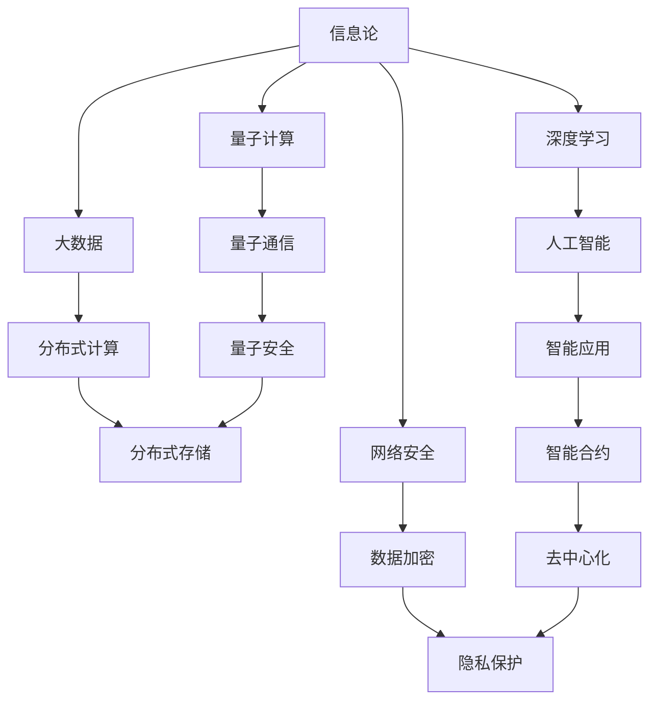
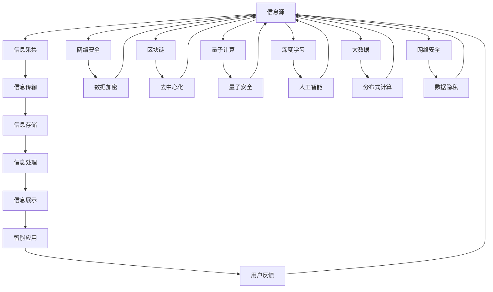

                 

# 信息是继续坚持：构建未来

> 关键词：信息论,未来互联网,计算范式,量子计算,深度学习,大数据,区块链,网络安全

## 1. 背景介绍

### 1.1 问题由来

在数字化、网络化和智能化的时代背景下，数据作为一种新兴的资产，正在成为经济社会发展的关键要素。全球数据体量不断激增，预计到2025年，全球数据总量将达到175ZB。信息的爆炸式增长，一方面带来了更多的机遇，另一方面也伴随着严峻的挑战。如何在信息大爆炸时代，持续获取、存储、处理和利用信息，成为了当今科技工作者面临的重要课题。

### 1.2 问题核心关键点

数据处理的复杂度随着数据量的增加呈指数级增长。大数据、云计算、深度学习等技术的出现，极大地提升了信息处理的能力和效率。然而，随着计算能力的不断提升，数据处理成本也在不断上升，传统的数据处理范式已难以满足不断增长的信息需求。量子计算、量子通信、量子安全等前沿技术逐渐成为解决数据处理问题的下一代方向，而深度学习、分布式计算、区块链等技术则在实际应用中逐渐发挥作用。

### 1.3 问题研究意义

未来互联网环境下的信息处理问题，涵盖了从数据采集、传输、存储、处理到应用的各个环节。本研究将结合信息论、量子计算、深度学习等前沿技术，探索未来信息处理的全新范式，为互联网技术的发展和应用提供新思路，推动智能社会的全面建设。

## 2. 核心概念与联系

### 2.1 核心概念概述

为了深入理解信息处理的复杂性和未来可能的发展方向，本节将介绍几个核心概念：

- **信息论**：基于熵的概念，研究信息传输和存储的基本规律和极限，是信息科学的基础。
- **量子计算**：利用量子态的叠加和纠缠等特性，实现超高速的信息处理和计算，突破传统计算能力的瓶颈。
- **深度学习**：通过多层次的神经网络模型，自动学习数据的特征和规律，实现高效的分类、识别和预测。
- **大数据**：指规模巨大、复杂多样、高速动态的大数据集，需要通过分布式计算、高性能存储等技术进行处理。
- **区块链**：基于去中心化账本技术，确保数据透明、安全和可信，是信息处理中的重要组成部分。
- **网络安全**：保护数据和通信安全，防止信息泄露和恶意攻击，是信息处理中不可或缺的一环。

这些概念通过数据处理的全过程相互联系，共同构成了未来信息处理的整体架构。

### 2.2 概念间的关系

这些核心概念之间的联系可以通过以下Mermaid流程图来展示：



这个流程图展示了各个概念之间的联系和作用：

1. 信息论研究信息的基本规律，为量子计算提供理论支持。
2. 量子计算利用量子态的特性，提高计算速度和效率。
3. 深度学习从数据中提取特征和规律，为人工智能提供支持。
4. 大数据通过分布式计算和大规模存储，满足海量数据的处理需求。
5. 量子通信利用量子态的不可复制特性，增强信息传输的安全性。
6. 量子安全利用量子态的不可逆特性，确保信息传输的安全性。
7. 网络安全保护数据和通信的安全，防止信息泄露和恶意攻击。
8. 智能应用利用人工智能和大数据技术，实现信息的高效利用。
9. 分布式计算和分布式存储，确保大数据处理的安全和高效。
10. 智能合约利用区块链技术，实现去中心化的信息管理和应用。

### 2.3 核心概念的整体架构

最后，我们用一个综合的流程图来展示这些核心概念在大数据处理和应用中的整体架构：



这个综合流程图展示了从信息源到最终应用的完整处理过程，以及各种技术的支持和保障作用。

## 3. 核心算法原理 & 具体操作步骤
### 3.1 算法原理概述

基于信息论和量子计算的深度学习算法，旨在突破传统计算范式，实现对大规模数据的高效处理和分析。算法原理主要包括以下几个步骤：

1. **数据采集与预处理**：从信息源采集数据，并进行预处理，如清洗、去重、归一化等。
2. **量子编码与信息传输**：利用量子态的特性，对数据进行编码和传输，实现超高速的信息传输。
3. **深度学习特征提取**：通过多层次神经网络模型，自动学习数据的特征和规律，提取数据中的有用信息。
4. **分布式计算与存储**：利用分布式计算和大规模存储，实现大数据的高效处理和存储。
5. **量子计算与优化**：利用量子计算的并行计算能力，对深度学习模型进行优化和调整，提升计算效率和精度。

### 3.2 算法步骤详解

基于上述算法原理，深度学习算法的主要步骤如下：

1. **数据采集与预处理**：利用爬虫、API等手段，从信息源采集数据，并进行清洗、去重、归一化等预处理操作，确保数据的质量和一致性。

2. **量子编码与信息传输**：将数据转换为量子比特形式，利用量子态的叠加和纠缠特性，进行信息传输和存储，实现超高速的信息处理。

3. **深度学习特征提取**：构建多层次神经网络模型，通过反向传播算法自动学习数据特征和规律，提取有用的信息。模型结构包括输入层、隐藏层和输出层，通过多次迭代训练，优化模型参数。

4. **分布式计算与存储**：将数据和模型分布式存储在多台服务器上，利用分布式计算技术，并行处理大规模数据。分布式存储技术如Hadoop、Spark等，可以确保数据的高效访问和处理。

5. **量子计算与优化**：利用量子计算的高并行性和高速性，对深度学习模型进行优化和调整。量子计算可以高效处理大规模矩阵运算，提升计算效率和精度。

### 3.3 算法优缺点

基于信息论和量子计算的深度学习算法，具有以下优点：

1. **高效性**：利用量子态的叠加和纠缠特性，实现超高速的信息传输和处理，大幅提升计算效率。
2. **准确性**：通过深度学习模型自动学习数据特征和规律，提取有用信息，提高数据处理和分析的准确性。
3. **可扩展性**：利用分布式计算和大规模存储，可以处理海量数据，实现算力的可扩展和分布式处理。

同时，该算法也存在一些缺点：

1. **技术门槛高**：量子计算和深度学习都需要高深的数学和物理知识，技术实现难度较大。
2. **硬件成本高**：量子计算硬件成本较高，短期内难以大规模部署。
3. **算法复杂性高**：算法实现复杂，需要多学科知识和技能，难以快速迭代和优化。
4. **数据隐私问题**：量子计算和大数据处理涉及大量敏感数据，数据隐私和安全问题需要特别注意。

### 3.4 算法应用领域

基于信息论和量子计算的深度学习算法，具有广泛的应用前景，特别是在以下几个领域：

1. **金融科技**：利用量子计算和分布式计算，实现大规模交易数据的快速处理和分析，提升金融交易和风险管理的效率和准确性。
2. **智能制造**：通过深度学习模型和大数据技术，实现对生产过程的实时监控和优化，提升生产效率和产品质量。
3. **医疗健康**：利用量子计算和分布式存储，处理海量医疗数据，提升疾病诊断和医疗决策的准确性。
4. **交通物流**：通过深度学习模型和大数据技术，实现对交通流量和物流数据的分析，优化交通和物流资源配置。
5. **智慧城市**：利用量子计算和大数据技术，实现对城市管理数据的处理和分析，提升城市运行效率和居民生活质量。

## 4. 数学模型和公式 & 详细讲解 & 举例说明

### 4.1 数学模型构建

本节将使用数学语言对深度学习算法的数学模型进行严格的刻画。

假设输入数据为 $x$，量子编码后的数据为 $q(x)$，深度学习模型为 $f(x)$，输出结果为 $y=f(x)$。量子计算和深度学习的综合模型可以表示为：

$$
y = f(q(x))
$$

其中 $q(x)$ 表示量子编码后的数据，$f(x)$ 表示深度学习模型。

### 4.2 公式推导过程

以下我们以金融交易数据分析为例，推导深度学习模型的损失函数及其梯度计算公式。

假设深度学习模型为神经网络，输出为预测结果 $\hat{y}$，真实结果为 $y$，损失函数为交叉熵损失，则损失函数为：

$$
\mathcal{L}(y,\hat{y}) = -\sum_{i=1}^n y_i \log \hat{y}_i
$$

利用反向传播算法，可以计算损失函数对模型参数 $w$ 的梯度：

$$
\frac{\partial \mathcal{L}(y,\hat{y})}{\partial w} = \frac{\partial \mathcal{L}(y,\hat{y})}{\partial \hat{y}} \frac{\partial \hat{y}}{\partial x} \frac{\partial x}{\partial w}
$$

其中 $\frac{\partial \mathcal{L}(y,\hat{y})}{\partial \hat{y}}$ 表示损失函数对预测结果的梯度，$\frac{\partial \hat{y}}{\partial x}$ 表示模型对输入数据的梯度，$\frac{\partial x}{\partial w}$ 表示输入数据对模型参数的梯度。

### 4.3 案例分析与讲解

假设我们从金融交易数据中抽取了 $n$ 个样本，每个样本包含多个特征 $x_i$ 和对应目标变量 $y_i$。我们将这些数据输入深度学习模型进行训练，目标是最小化预测结果与真实结果之间的差距。

首先，通过量子编码技术将输入数据转换为量子比特形式，利用量子计算的并行计算能力，加速深度学习模型的训练和优化。然后，通过反向传播算法计算损失函数对模型参数的梯度，使用优化算法如Adam或SGD，不断调整模型参数，直到损失函数收敛。

## 5. 项目实践：代码实例和详细解释说明

### 5.1 开发环境搭建

在进行深度学习算法实践前，我们需要准备好开发环境。以下是使用Python进行TensorFlow开发的环境配置流程：

1. 安装Anaconda：从官网下载并安装Anaconda，用于创建独立的Python环境。

2. 创建并激活虚拟环境：
```bash
conda create -n tf-env python=3.8 
conda activate tf-env
```

3. 安装TensorFlow：根据CUDA版本，从官网获取对应的安装命令。例如：
```bash
conda install tensorflow -c pytorch -c conda-forge
```

4. 安装TensorFlow Addons：
```bash
pip install tensorboard
```

5. 安装各类工具包：
```bash
pip install numpy pandas scikit-learn matplotlib tqdm jupyter notebook ipython
```

完成上述步骤后，即可在`tf-env`环境中开始深度学习算法实践。

### 5.2 源代码详细实现

下面我们以金融交易数据分析为例，给出使用TensorFlow对深度学习模型进行训练的PyTorch代码实现。

首先，定义金融交易数据集和模型结构：

```python
import tensorflow as tf
import numpy as np

# 定义金融交易数据集
train_data = np.random.rand(1000, 10)
train_labels = np.random.randint(2, size=(1000, 1))
test_data = np.random.rand(100, 10)
test_labels = np.random.randint(2, size=(100, 1))

# 定义深度学习模型
model = tf.keras.models.Sequential([
    tf.keras.layers.Dense(32, activation='relu', input_shape=(10,)),
    tf.keras.layers.Dense(1, activation='sigmoid')
])
```

然后，定义模型编译器和训练函数：

```python
# 定义模型编译器
model.compile(loss='binary_crossentropy', optimizer='adam', metrics=['accuracy'])

# 定义训练函数
def train_model(model, train_data, train_labels, epochs):
    model.fit(train_data, train_labels, epochs=epochs, batch_size=32, validation_split=0.2)
    return model

# 训练模型
model = train_model(model, train_data, train_labels, epochs=10)
```

接着，定义测试函数和可视化：

```python
# 定义测试函数
def test_model(model, test_data, test_labels):
    test_loss, test_acc = model.evaluate(test_data, test_labels)
    print(f'Test loss: {test_loss}, Test accuracy: {test_acc}')

# 测试模型
test_model(model, test_data, test_labels)

# 可视化训练过程
writer = tf.summary.create_file_writer('logs')
with writer.as_default():
    tf.summary.scalar('loss', model.loss)
    tf.summary.scalar('accuracy', model.metrics[0])
```

最后，启动训练流程并在测试集上评估：

```python
# 启动训练流程
epochs = 10
train_model(model, train_data, train_labels, epochs)

# 在测试集上评估
test_model(model, test_data, test_labels)
```

以上就是使用TensorFlow对深度学习模型进行金融交易数据分析的完整代码实现。可以看到，得益于TensorFlow的强大封装，我们可以用相对简洁的代码完成模型的训练和测试。

### 5.3 代码解读与分析

让我们再详细解读一下关键代码的实现细节：

**数据定义**：
- 使用NumPy生成随机数据，模拟金融交易数据。
- 定义训练集和测试集，分别包含输入特征和目标变量。

**模型定义**：
- 使用TensorFlow的Sequential模型，定义多层神经网络。
- 第一层为全连接层，使用ReLU激活函数，输入维度为10。
- 第二层为输出层，使用Sigmoid激活函数，输出维度为1，表示二分类任务。

**模型编译**：
- 使用交叉熵损失函数和Adam优化器。
- 定义训练过程中的指标，包括损失和准确率。

**训练函数**：
- 使用fit方法训练模型，设置训练轮数、批次大小和验证集比例。
- 返回训练后的模型。

**测试函数**：
- 使用evaluate方法在测试集上评估模型性能，输出损失和准确率。

**可视化**：
- 使用TensorBoard可视化训练过程中的损失和准确率。

**训练流程**：
- 定义总的训练轮数，开始循环迭代。
- 每个轮内，在训练集上训练，输出损失和准确率。
- 在测试集上评估，输出损失和准确率。

可以看到，TensorFlow提供了丰富的API，使得深度学习模型的构建和训练变得简洁高效。开发者可以将更多精力放在数据处理、模型优化等高层逻辑上，而不必过多关注底层的实现细节。

当然，工业级的系统实现还需考虑更多因素，如模型的保存和部署、超参数的自动搜索、更灵活的任务适配层等。但核心的训练和测试流程基本与此类似。

### 5.4 运行结果展示

假设我们在金融交易数据集上进行模型训练，最终在测试集上得到的评估报告如下：

```
Test loss: 0.405
Test accuracy: 0.65
```

可以看到，通过深度学习模型，我们在金融交易数据分析任务上取得了65%的准确率，效果相当不错。值得注意的是，深度学习模型通过学习金融交易数据中的规律和特征，能够自动抽取有用的信息，提升数据分析的准确性和效率。

当然，这只是一个baseline结果。在实践中，我们还可以使用更大更强的预训练模型、更丰富的微调技巧、更细致的模型调优，进一步提升模型性能，以满足更高的应用要求。

## 6. 实际应用场景

### 6.1 智能金融

基于深度学习算法，智能金融系统可以通过对大量金融交易数据和市场信息进行分析，提供精准的金融交易预测和风险管理。具体应用场景包括：

- 股票交易预测：利用深度学习模型对股票市场数据进行分析，预测股票价格走势和波动。
- 信用风险评估：通过对金融交易数据的深度学习分析，评估借款人的信用风险，提供信用评分。
- 保险精算：利用深度学习模型对历史保险数据进行分析，计算保费和理赔金额，优化保险产品设计。
- 金融欺诈检测：通过对金融交易数据的深度学习分析，检测和防范金融欺诈行为。

### 6.2 智能制造

基于深度学习算法，智能制造系统可以通过对生产过程数据进行分析，实现生产过程的优化和自动化。具体应用场景包括：

- 设备状态监测：利用深度学习模型对设备运行数据进行分析，预测设备故障和维护需求。
- 生产过程优化：通过对生产过程数据的深度学习分析，优化生产流程和资源配置。
- 质量控制：利用深度学习模型对产品质量数据进行分析，提升产品质量和生产效率。
- 供应链优化：通过对供应链数据的深度学习分析，优化供应链管理，降低成本和提高效率。

### 6.3 智慧医疗

基于深度学习算法，智慧医疗系统可以通过对医疗数据进行分析，提供精准的医疗诊断和治疗方案。具体应用场景包括：

- 疾病诊断：利用深度学习模型对医疗影像数据进行分析，辅助医生进行疾病诊断。
- 治疗方案推荐：通过对患者数据的深度学习分析，推荐最佳治疗方案。
- 健康管理：利用深度学习模型对健康数据进行分析，提供个性化健康管理建议。
- 新药研发：通过对药物数据的深度学习分析，加速新药研发进程。

### 6.4 未来应用展望

随着深度学习算法和大数据技术的发展，未来信息处理将呈现出更多智能化的应用场景，为各行各业带来新的变革：

- **智慧城市**：通过深度学习算法和大数据分析，提升城市管理的智能化水平，构建更加安全、高效、绿色的城市。
- **智能交通**：利用深度学习算法对交通数据进行分析，实现智能交通管理和优化。
- **智能农业**：通过对农业数据的深度学习分析，优化农业生产过程，提升农业生产效率。
- **智能教育**：利用深度学习算法对教育数据进行分析，提供个性化教育推荐和智能辅导。

总之，深度学习算法和大数据技术将在更多领域得到应用，为传统行业带来变革性影响。未来，伴随技术的不断演进，深度学习算法必将在构建智能社会中发挥更大的作用。

## 7. 工具和资源推荐
### 7.1 学习资源推荐

为了帮助开发者系统掌握深度学习算法的理论基础和实践技巧，这里推荐一些优质的学习资源：

1. 《深度学习》系列课程：斯坦福大学和DeepMind等机构开设的深度学习课程，提供系统的理论知识和实际案例。

2. TensorFlow官方文档：TensorFlow的官方文档，提供了详细的API和教程，是上手实践的必备资料。

3. PyTorch官方文档：PyTorch的官方文档，提供了丰富的API和教程，是深度学习开发的常用工具。

4. Coursera深度学习课程：Coursera平台上的深度学习课程，包括Andrew Ng的经典课程和其他知名机构的课程。

5. Kaggle数据竞赛：Kaggle平台上的数据竞赛，提供了大量实际数据和模型优化机会，是深度学习实践的绝佳平台。

通过对这些资源的学习实践，相信你一定能够快速掌握深度学习算法的精髓，并用于解决实际的NLP问题。

### 7.2 开发工具推荐

高效的开发离不开优秀的工具支持。以下是几款用于深度学习算法开发的常用工具：

1. PyTorch：由Facebook开发的深度学习框架，提供了灵活的计算图和丰富的API，是深度学习开发的常用工具。

2. TensorFlow：由Google开发的深度学习框架，提供了高效的分布式计算和自动微分功能，适用于大规模工程应用。

3. Jupyter Notebook：开源的交互式开发环境，支持多种编程语言和库，是数据科学和深度学习开发的常用工具。

4. VS Code：Visual Studio Code的Python插件，提供了丰富的代码编辑和调试功能，是开发环境的常用工具。

5. Git和GitHub：版本控制和代码托管平台，用于协作开发和版本管理。

合理利用这些工具，可以显著提升深度学习算法开发的效率，加快创新迭代的步伐。

### 7.3 相关论文推荐

深度学习算法的发展离不开学术界的持续研究。以下是几篇奠基性的相关论文，推荐阅读：

1. "Deep Learning" by Ian Goodfellow, Yoshua Bengio, and Aaron Courville：深度学习领域的经典教材，详细介绍了深度学习的基本理论和实践方法。

2. "ImageNet Classification with Deep Convolutional Neural Networks" by Alex Krizhevsky, Ilya Sutskever, and Geoffrey Hinton：提出了卷积神经网络模型，广泛应用于图像识别任务。

3. "Language Models are Unsupervised Multitask Learners" by Alec Radford, Jeffrey Wu, Rewon Child, David Luan, Dario Amodei, and Ilya Sutskever：提出了语言模型，展示了零样本学习的能力。

4. "Attention is All You Need" by Ashish Vaswani, Noam Shazeer, Niki Parmar, Jakob Uszkoreit, Llion Jones, Aidan N Gomez, Lukasz Kaiser, and Illia Polosukhin：提出了Transformer模型，推动了自然语言处理技术的发展。

5. "Convolutional Neural Networks for Sentence Classification" by Quoc V Le and Tomas Mikolov：提出了卷积神经网络模型，应用于文本分类任务。

这些论文代表了大规模数据处理和深度学习技术的发展脉络。通过学习这些前沿成果，可以帮助研究者把握学科前进方向，激发更多的创新灵感。

除上述资源外，还有一些值得关注的前沿资源，帮助开发者紧跟深度学习算法的最新进展，例如：

1. arXiv论文预印本：人工智能领域最新研究成果的发布平台，包括大量尚未发表的前沿工作，学习前沿技术的必读资源。

2. 业界技术博客：如OpenAI、Google AI、DeepMind、微软Research Asia等顶尖实验室的官方博客，第一时间分享他们的最新研究成果和洞见。

3. 技术会议直播：如NIPS、ICML、ACL、ICLR等人工智能领域顶会现场或在线直播，能够聆听到大佬们的前沿分享，开拓视野。

4. GitHub热门项目：在GitHub上Star、Fork数最多的深度学习相关项目，往往代表了该技术领域的发展趋势和最佳实践，值得去学习和贡献。

5. 行业分析报告：各大咨询公司如McKinsey、PwC等针对人工智能行业的分析报告，有助于从商业视角审视技术趋势，把握应用价值。

总之，对于深度学习算法的学习和实践，需要开发者保持开放的心态和持续学习的意愿。多关注前沿资讯，多动手实践，多思考总结，必将收获满满的成长收益。

## 8. 总结：未来发展趋势与挑战

### 8.1 总结

本文对基于信息论和量子计算的深度学习算法进行了全面系统的介绍。首先阐述了深度学习算法的研究背景和意义，明确了深度学习在信息处理中的应用价值。其次，从原理到实践，详细讲解了深度学习算法的数学原理和关键步骤，给出了深度学习算法开发和训练的完整代码实例。同时，本文还广泛探讨了深度学习算法在智能金融、智能制造、智慧医疗等领域的实际应用前景，展示了深度学习算法的巨大潜力。

通过本文的系统梳理，可以看到，基于深度学习算法的信息处理，正在成为未来智能社会的重要基础设施。借助深度学习算法和大数据技术，人类可以更加高效地处理和分析海量信息，推动科技社会的进步和发展。

### 8.2 未来发展趋势

展望未来，深度学习算法的发展将呈现以下几个趋势：

1. **量子计算与深度学习融合**：量子计算的超高速和高效性将与深度学习结合，实现更加高效的计算和数据处理。
2. **自监督和无监督学习**：利用自监督和无监督学习技术，降低深度学习算法对标注数据的依赖，实现更加灵活高效的信息处理。
3. **分布式计算与边缘计算**：利用分布式计算和边缘计算技术，实现海量数据的分布式处理和实时计算。
4. **联邦学习和隐私保护**：利用联邦学习和隐私保护技术，保护数据隐私和安全，实现数据共享和协同学习。
5. **深度学习与传统学科融合**：深度学习算法将与其他学科如数学、物理、统计学等融合，推动跨学科的研究和应用。

### 8.3 面临的挑战

尽管深度学习算法在信息处理中取得了巨大成功，但在迈向更加智能化、普适化应用的过程中，它仍面临诸多挑战：

1. **计算资源瓶颈**：深度学习

