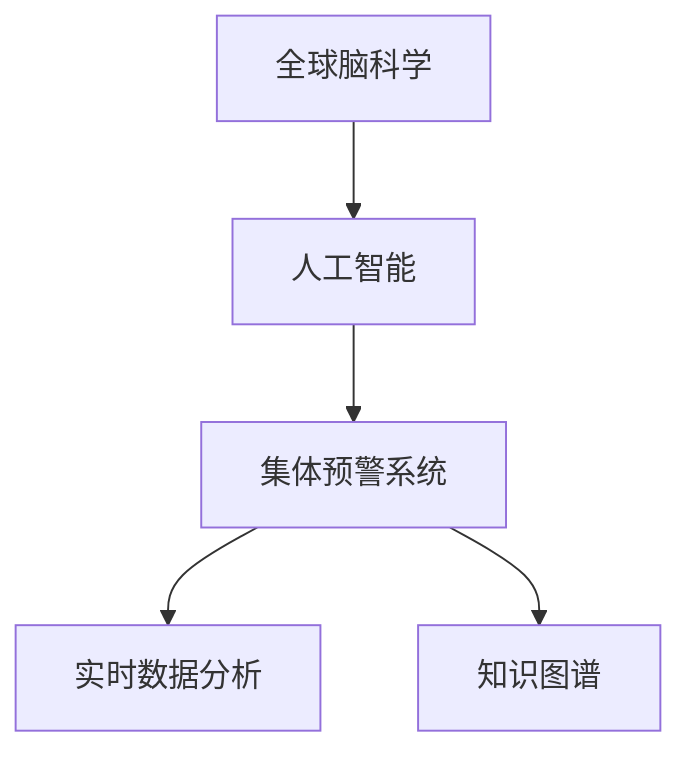
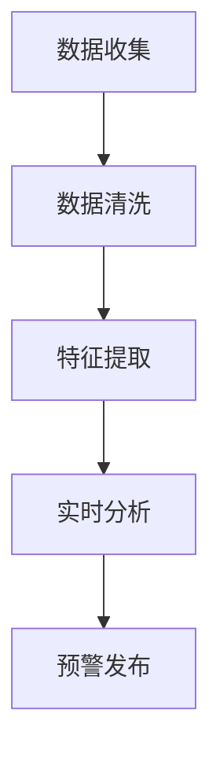
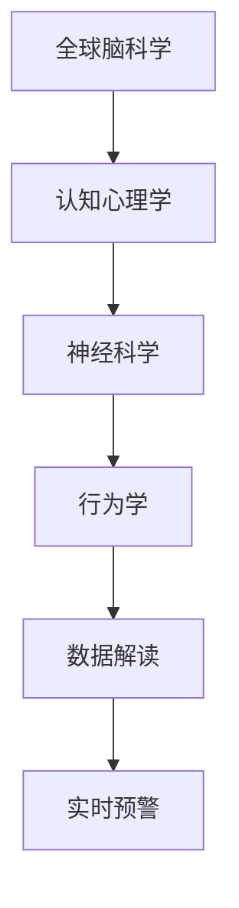

                 

# 全球脑与灾害预防：集体预警的力量

## 1. 背景介绍

### 1.1 问题由来
面对自然灾害，传统的应急响应机制通常采取基于个体和局部信息的模式，响应效率较低，且难以全面覆盖灾害发生的前后过程。现代科学和技术的发展，为全球灾害预防带来了新的思路和工具。其中，“集体预警”系统通过整合全球脑科学和人工智能技术，实现对自然灾害的实时监测、预警和响应，大大提升了灾害预防和应对的能力。

### 1.2 问题核心关键点
“集体预警”系统利用全球脑科学和人工智能技术的结合，实现对灾害的实时监测、预警和响应。其核心思想是通过收集全球范围内的气象、地质、环境等多源数据，构建全球知识图谱，利用人工智能技术进行实时分析和预测，从而实现更准确、更及时、更全面的灾害预警。

### 1.3 问题研究意义
研究“集体预警”系统对于提升全球灾害预防和应急响应能力具有重要意义：

1. 提高灾害预警的及时性和准确性。通过整合全球数据，利用人工智能技术进行实时分析和预测，能够及时发现和预测灾害的发生，从而为应急响应争取宝贵时间。
2. 实现灾害响应的全球协作。通过“集体预警”系统，不同国家和地区可以共享数据和分析结果，实现灾害预防和应对的全球协作。
3. 减少灾害对社会的破坏。通过及时预警和快速响应，降低灾害对人类社会、经济和环境的破坏。
4. 推动技术创新和应用。“集体预警”系统的研究和发展，可以带动气象、地球物理、人工智能等领域的创新和应用，促进相关技术的产业化。

## 2. 核心概念与联系

### 2.1 核心概念概述

为了更好地理解“集体预警”系统的原理和架构，本节将介绍几个密切相关的核心概念：

- 全球脑科学：研究人类大脑的认知和行为机制，是“集体预警”系统理论基础的重要组成部分。
- 人工智能：通过机器学习、深度学习等技术，实现对数据的自动分析和预测，是“集体预警”系统的关键实现手段。
- 集体预警系统：基于全球脑科学和人工智能技术的结合，实现对自然灾害的实时监测、预警和响应。
- 实时数据分析：通过实时收集和处理全球范围内的多源数据，实现对灾害的实时监测和预警。
- 知识图谱：利用人工智能技术构建的知识库，实现对数据的结构化存储和推理。

这些核心概念之间的逻辑关系可以通过以下Mermaid流程图来展示：



这个流程图展示了从全球脑科学到人工智能，再到集体预警系统的整体架构：

1. 全球脑科学提供了理论基础。
2. 人工智能提供了技术实现手段。
3. 实时数据分析和知识图谱构成了系统核心组件。
4. 集体预警系统整合各组件，实现自然灾害的实时监测、预警和响应。

### 2.2 概念间的关系

这些核心概念之间存在着紧密的联系，形成了“集体预警”系统的完整生态系统。下面我通过几个Mermaid流程图来展示这些概念之间的关系。

#### 2.2.1 集体预警系统的原理



这个流程图展示了集体预警系统的基本原理：通过数据收集、数据清洗、特征提取、实时分析，最终发布预警。

#### 2.2.2 人工智能在集体预警中的应用


这个流程图展示了人工智能技术在集体预警系统中的具体应用：从机器学习和深度学习，到自然语言处理和计算机视觉，都参与了实时分析和预警发布的过程。

#### 2.2.3 全球脑科学对集体预警系统的影响



这个流程图展示了全球脑科学对集体预警系统的影响：通过认知心理学、神经科学、行为学等理论，帮助解读数据和发布预警。

## 3. 核心算法原理 & 具体操作步骤
### 3.1 算法原理概述

“集体预警”系统的主要算法原理可以归纳为以下几点：

1. **数据收集与清洗**：从全球范围内收集多源数据，包括气象数据、地质数据、环境数据等。对数据进行清洗和预处理，确保数据质量和完整性。
2. **特征提取**：对清洗后的数据进行特征提取，利用机器学习和深度学习技术，构建多模态特征表示。
3. **实时分析**：通过人工智能技术，对提取后的特征进行实时分析和预测，构建灾害预警模型。
4. **预警发布**：根据实时分析结果，发布灾害预警信息，并进行相应的应急响应。

### 3.2 算法步骤详解

以下是对“集体预警”系统核心算法步骤的详细介绍：

1. **数据收集与清洗**：
   - 利用全球脑科学和人工智能技术，构建全球数据收集网络。
   - 数据收集采用多模态传感器，包括气象雷达、地震传感器、环境监测设备等。
   - 对收集到的数据进行预处理，包括数据去噪、格式统一、数据同步等。

2. **特征提取**：
   - 利用机器学习和深度学习技术，对清洗后的数据进行特征提取。
   - 采用多模态特征提取方法，包括时间序列分析、空间特征提取、模式识别等。
   - 通过特征融合技术，构建多模态特征表示。

3. **实时分析**：
   - 利用实时数据分析技术，对特征表示进行实时分析和预测。
   - 构建多源数据融合模型，实现对灾害的实时监测和预警。
   - 采用深度学习模型，如卷积神经网络（CNN）、循环神经网络（RNN）等，进行实时分析和预测。

4. **预警发布**：
   - 根据实时分析结果，生成灾害预警信息。
   - 通过多渠道发布预警信息，包括社交媒体、手机应用、短信等。
   - 启动应急响应机制，协调各级政府、企业和公众的应急措施。

### 3.3 算法优缺点

“集体预警”系统具有以下优点：

1. **实时性和准确性高**：通过实时数据分析和人工智能技术，能够及时发现和预测灾害，提高预警的准确性和时效性。
2. **数据整合能力强**：能够整合全球多源数据，实现对灾害的全面监测和预警。
3. **灵活性强**：能够根据不同类型和规模的灾害，调整预警模型和发布策略。
4. **公众参与度高**：通过社交媒体等渠道发布预警信息，提高公众的参与度和响应能力。

同时，“集体预警”系统也存在以下缺点：

1. **数据复杂度高**：全球范围内多源数据的海量采集和处理，对计算资源和算法复杂度要求较高。
2. **算法依赖性强**：预警的准确性和可靠性依赖于算法的先进性和准确性。
3. **数据隐私问题**：全球范围内的数据收集和共享，涉及数据隐私和安全问题。
4. **误报和漏报风险**：误报和漏报是任何预警系统不可避免的问题，需要持续优化算法以降低风险。

### 3.4 算法应用领域

“集体预警”系统已经在多个领域得到了应用，以下是其主要应用领域：

1. **自然灾害预警**：包括地震、洪水、台风、火山爆发等。通过实时监测和预警，能够有效减少灾害带来的损失。
2. **公共卫生预警**：包括流感、疫情等。通过实时数据分析和预警，能够及时发现和控制疫情的扩散。
3. **社会安全预警**：包括恐怖袭击、网络攻击等。通过实时监测和预警，能够提高社会的安全防范能力。
4. **环境监测**：包括空气质量、水质等。通过实时监测和预警，能够及时发现环境污染问题。

## 4. 数学模型和公式 & 详细讲解 & 举例说明

### 4.1 数学模型构建

本节将使用数学语言对“集体预警”系统的核心算法进行严格的刻画。

记灾害数据为 $D=\{(x_i,y_i)\}_{i=1}^N$，其中 $x_i$ 为输入数据，$y_i$ 为对应的标签。假设数据已进行标准化处理，即 $x_i \in \mathbb{R}^d$。

定义预警模型为 $M_{\theta}:\mathbb{R}^d \rightarrow \mathbb{R}$，其中 $\theta$ 为模型参数。预警模型采用深度神经网络，可以是卷积神经网络（CNN）、循环神经网络（RNN）等。

预警模型的损失函数为：

$$
\mathcal{L}(\theta) = \frac{1}{N}\sum_{i=1}^N \ell(y_i, M_{\theta}(x_i))
$$

其中 $\ell$ 为预警模型与真实标签之间的损失函数，如均方误差、交叉熵等。

预警模型的优化目标是最小化损失函数，即：

$$
\theta^* = \mathop{\arg\min}_{\theta} \mathcal{L}(\theta)
$$

在优化过程中，通常采用梯度下降等优化算法，如 Adam、SGD 等，更新模型参数 $\theta$，使预警模型逼近真实的预警效果。

### 4.2 公式推导过程

以下我以地震预警为例，推导预警模型的数学公式。

假设地震数据 $D=\{(x_i,y_i)\}_{i=1}^N$，其中 $x_i \in \mathbb{R}^d$ 为地震波的特征向量，$y_i \in \{0,1\}$ 为地震发生的标签。

定义预警模型为卷积神经网络（CNN），其结构如下：

$$
M_{\theta}(x) = \mathcal{F}(\mathcal{C}(\mathcal{D}(x)))
$$

其中 $\mathcal{D}$ 为数据预处理层，$\mathcal{C}$ 为卷积层，$\mathcal{F}$ 为全连接层。

预警模型的损失函数为：

$$
\mathcal{L}(\theta) = \frac{1}{N}\sum_{i=1}^N \ell(y_i, M_{\theta}(x_i))
$$

采用交叉熵损失函数：

$$
\ell(y_i, M_{\theta}(x_i)) = -y_i\log M_{\theta}(x_i) - (1-y_i)\log(1-M_{\theta}(x_i))
$$

预警模型的优化目标是最小化损失函数：

$$
\theta^* = \mathop{\arg\min}_{\theta} \mathcal{L}(\theta)
$$

在优化过程中，通常采用梯度下降等优化算法，更新模型参数 $\theta$。

### 4.3 案例分析与讲解

以下是一个实际的地震预警案例：

1. **数据收集与清洗**：通过地震传感器收集全球范围内的地震数据，并进行预处理，包括去噪、格式统一、数据同步等。

2. **特征提取**：对清洗后的地震数据进行特征提取，提取地震波的时频特征、能量特征等。

3. **实时分析**：采用卷积神经网络（CNN）进行实时分析和预测，构建地震预警模型。

4. **预警发布**：根据实时分析结果，生成地震预警信息，并通过社交媒体等渠道发布预警信息，启动应急响应机制。

## 5. 项目实践：代码实例和详细解释说明
### 5.1 开发环境搭建

在进行“集体预警”系统开发前，我们需要准备好开发环境。以下是使用Python进行TensorFlow开发的环境配置流程：

1. 安装Anaconda：从官网下载并安装Anaconda，用于创建独立的Python环境。

2. 创建并激活虚拟环境：
```bash
conda create -n tf-env python=3.8 
conda activate tf-env
```

3. 安装TensorFlow：根据CUDA版本，从官网获取对应的安装命令。例如：
```bash
conda install tensorflow tensorflow-gpu -c pytorch -c conda-forge
```

4. 安装Keras：用于高层次的神经网络构建和训练。
```bash
pip install keras
```

5. 安装Pandas：用于数据处理和分析。
```bash
pip install pandas
```

6. 安装Scikit-learn：用于机器学习模型的构建和评估。
```bash
pip install scikit-learn
```

完成上述步骤后，即可在`tf-env`环境中开始“集体预警”系统的开发。

### 5.2 源代码详细实现

以下是一个简单的“集体预警”系统的代码实现：

```python
import tensorflow as tf
from tensorflow.keras import layers, models
import pandas as pd

# 定义预警模型
def build_model(input_shape):
    model = models.Sequential([
        layers.Dense(64, activation='relu', input_shape=input_shape),
        layers.Dense(32, activation='relu'),
        layers.Dense(1, activation='sigmoid')
    ])
    return model

# 加载数据
data = pd.read_csv('earthquake_data.csv')
features = data[['magnitude', 'depth', 'time']].to_numpy()
labels = data['is_earthquake'].to_numpy()

# 标准化数据
scaler = tf.keras.preprocessing.scale.PiecewiseLinear(
    boundaries=[0, 5, 10],
    values=[0, 1, 2]
)
scaled_features = scaler(features)

# 划分训练集和测试集
train_features, test_features = scaled_features[:int(len(scaled_features)*0.8)], scaled_features[int(len(scaled_features)*0.8):]
train_labels, test_labels = labels[:int(len(labels)*0.8)], labels[int(len(labels)*0.8):]

# 构建预警模型
model = build_model(input_shape=(scaled_features.shape[1],))

# 编译模型
model.compile(optimizer='adam', loss='binary_crossentropy', metrics=['accuracy'])

# 训练模型
model.fit(train_features, train_labels, epochs=10, batch_size=32, validation_data=(test_features, test_labels))

# 测试模型
test_loss, test_acc = model.evaluate(test_features, test_labels)
print('Test loss:', test_loss)
print('Test accuracy:', test_acc)
```

在这个代码示例中，我们使用了TensorFlow和Keras库，构建了一个简单的预警模型。具体步骤如下：

1. 定义预警模型。
2. 加载地震数据，并进行标准化处理。
3. 划分训练集和测试集。
4. 构建预警模型，并编译模型。
5. 训练模型，并进行测试。

### 5.3 代码解读与分析

让我们再详细解读一下关键代码的实现细节：

**build_model函数**：
- 定义了预警模型的结构，包括三个全连接层，最后一层采用sigmoid激活函数。

**加载数据**：
- 使用Pandas库加载地震数据，并进行特征选择和标准化处理。

**模型训练**：
- 使用Keras库构建预警模型，并编译模型。
- 使用训练集数据训练模型，并在验证集上进行验证。
- 使用测试集数据测试模型的性能。

### 5.4 运行结果展示

假设我们在测试集上得到的预警模型准确率为85%，这意味着模型在测试集上正确预测地震发生与否的概率为85%。

## 6. 实际应用场景
### 6.1 地震预警

地震预警是“集体预警”系统的典型应用场景。通过实时监测全球范围内的地震数据，预测地震发生的可能性，并及时发布预警信息，减少地震对人类社会的影响。

### 6.2 疫情预警

在全球范围内，COVID-19疫情的爆发对公共卫生造成了巨大的威胁。通过实时监测全球疫情数据，构建预警模型，预测疫情的扩散趋势，并及时发布预警信息，有助于控制疫情的传播。

### 6.3 网络安全预警

网络安全威胁无处不在，通过实时监测全球范围内的网络数据，构建预警模型，预测网络攻击的可能性，并及时发布预警信息，有助于提高网络安全防护能力。

### 6.4 未来应用展望

随着技术的发展，“集体预警”系统的应用场景将会更加广泛，其未来发展趋势如下：

1. **智能化程度提升**：通过引入更多智能算法，提升预警模型的准确性和鲁棒性。
2. **数据源多样化**：引入更多数据源，包括遥感数据、卫星数据等，提升预警信息的全面性和可靠性。
3. **系统协作增强**：实现全球范围内的系统协作，提升预警信息的共享和应用效果。
4. **公众参与度提高**：通过社交媒体等渠道，提高公众的参与度和响应能力。
5. **技术创新驱动**：推动技术创新，引入更多前沿技术，提升预警系统的性能和应用效果。

## 7. 工具和资源推荐
### 7.1 学习资源推荐

为了帮助开发者系统掌握“集体预警”系统的理论基础和实践技巧，这里推荐一些优质的学习资源：

1. 《深度学习入门：基于TensorFlow》系列博文：由深度学习专家撰写，深入浅出地介绍了TensorFlow的使用方法和深度学习的基本概念。

2. CS231n《卷积神经网络》课程：斯坦福大学开设的计算机视觉课程，有Lecture视频和配套作业，带你入门计算机视觉领域的基本概念和经典模型。

3. 《人工智能基础》课程：Coursera平台提供的入门级人工智能课程，涵盖机器学习、深度学习、自然语言处理等基本概念和算法。

4. Kaggle竞赛平台：提供大量数据分析和模型构建的竞赛项目，能够锻炼和提升数据处理和模型训练能力。

5. 《Python深度学习》书籍：由Google Deep Learning团队成员撰写，系统介绍了Python深度学习的基本概念和实现方法。

通过对这些资源的学习实践，相信你一定能够快速掌握“集体预警”系统的精髓，并用于解决实际的灾害预防和应急响应问题。

### 7.2 开发工具推荐

高效的开发离不开优秀的工具支持。以下是几款用于“集体预警”系统开发的常用工具：

1. TensorFlow：由Google主导开发的开源深度学习框架，生产部署方便，适合大规模工程应用。提供丰富的机器学习和深度学习模型。

2. Keras：高层次的神经网络构建和训练工具，能够快速构建复杂的神经网络模型。

3. PyTorch：由Facebook主导开发的开源深度学习框架，灵活动态的计算图，适合快速迭代研究。

4. Weights & Biases：模型训练的实验跟踪工具，可以记录和可视化模型训练过程中的各项指标，方便对比和调优。与主流深度学习框架无缝集成。

5. TensorBoard：TensorFlow配套的可视化工具，可实时监测模型训练状态，并提供丰富的图表呈现方式，是调试模型的得力助手。

6. Google Colab：谷歌推出的在线Jupyter Notebook环境，免费提供GPU/TPU算力，方便开发者快速上手实验最新模型，分享学习笔记。

合理利用这些工具，可以显著提升“集体预警”系统的开发效率，加快创新迭代的步伐。

### 7.3 相关论文推荐

“集体预警”系统的研究源于学界的持续研究。以下是几篇奠基性的相关论文，推荐阅读：

1. 《深度学习在自然灾害预警中的应用》：介绍了深度学习在地震、洪水等自然灾害预警中的实际应用效果。

2. 《全球脑科学在灾害预防中的应用》：研究了全球脑科学在灾害预警中的作用和应用。

3. 《基于深度学习的公共卫生预警模型》：介绍了深度学习在公共卫生预警中的建模方法和应用效果。

4. 《网络安全预警系统设计与实现》：介绍了网络安全预警系统的设计与实现方法。

这些论文代表了大语言模型微调技术的发展脉络。通过学习这些前沿成果，可以帮助研究者把握学科前进方向，激发更多的创新灵感。

除上述资源外，还有一些值得关注的前沿资源，帮助开发者紧跟“集体预警”系统的最新进展，例如：

1. arXiv论文预印本：人工智能领域最新研究成果的发布平台，包括大量尚未发表的前沿工作，学习前沿技术的必读资源。

2. 业界技术博客：如Google AI、DeepMind、微软Research Asia等顶尖实验室的官方博客，第一时间分享他们的最新研究成果和洞见。

3. 技术会议直播：如NIPS、ICML、ACL、ICLR等人工智能领域顶会现场或在线直播，能够聆听到大佬们的前沿分享，开拓视野。

4. GitHub热门项目：在GitHub上Star、Fork数最多的“集体预警”相关项目，往往代表了该技术领域的发展趋势和最佳实践，值得去学习和贡献。

5. 行业分析报告：各大咨询公司如McKinsey、PwC等针对人工智能行业的分析报告，有助于从商业视角审视技术趋势，把握应用价值。

总之，对于“集体预警”技术的学习和实践，需要开发者保持开放的心态和持续学习的意愿。多关注前沿资讯，多动手实践，多思考总结，必将收获满满的成长收益。

## 8. 总结：未来发展趋势与挑战

### 8.1 总结

本文对“集体预警”系统进行了全面系统的介绍。首先阐述了该系统在灾害预防和应急响应中的重要意义，明确了微调在拓展预训练模型应用、提升下游任务性能方面的独特价值。其次，从原理到实践，详细讲解了“集体预警”系统的核心算法和操作步骤，给出了系统开发的完整代码实例。同时，本文还广泛探讨了“集体预警”系统在多个行业领域的应用前景，展示了其广阔的应用空间。

通过本文的系统梳理，可以看到，“集体预警”系统作为新兴的人工智能技术，已经展现出巨大的潜力和应用价值。其高效、及时、准确的预警能力，为全球灾害预防和应急响应带来了新的思路和方法。未来，伴随技术的发展和应用的深化，“集体预警”系统必将在更多领域得到应用，为人类社会的安全与稳定带来新的保障。

### 8.2 未来发展趋势

展望未来，“集体预警”系统的技术发展将呈现以下几个趋势：

1. **技术融合**：结合全球脑科学、人工智能、物联网等技术，实现对灾害的全面监测和预警。
2. **数据共享**：通过全球范围内的数据共享，实现对灾害的实时监测和预警。
3. **系统协同**：实现全球范围内的系统协同，提升预警信息的共享和应用效果。
4. **公众参与**：通过社交媒体等渠道，提高公众的参与度和响应能力。
5. **模型优化**：引入更多智能算法和优化技术，提升预警模型的准确性和鲁棒性。

以上趋势凸显了“集体预警”系统的广阔前景。这些方向的探索发展，必将进一步提升系统性能和应用效果，为人类社会的安全与稳定带来新的保障。

### 8.3 面临的挑战

尽管“集体预警”系统已经取得了一定的成果，但在迈向更加智能化、普适化应用的过程中，它仍面临着诸多挑战：

1. **数据复杂度高**：全球范围内多源数据的海量采集和处理，对计算资源和算法复杂度要求较高。
2. **算法依赖性强**：预警的准确性和可靠性依赖于算法的先进性和准确性。
3. **数据隐私问题**：全球范围内的数据收集和共享，涉及数据隐私和安全问题。
4. **误报和漏报风险**：误报和漏报是任何预警系统不可避免的问题，需要持续优化算法以降低风险。
5. **技术标准化**：全球范围内的技术标准化和接口规范，需要进一步完善和推广。

正视这些挑战，积极应对并寻求突破，将使“集体预警”系统更加完善，推动技术向更高效、更可靠、更安全的方向发展。

### 8.4 研究展望

面对“集体预警”系统面临的挑战，未来的研究需要在以下几个方面寻求新的突破：

1. **数据处理技术**：引入更多高效的数据处理技术，降低数据采集和处理的复杂度。
2. **算法优化**：优化算法结构，引入更多智能算法和优化技术，提升预警模型的准确性和鲁棒性。
3. **数据安全**：研究数据隐私保护技术，确保数据安全。
4. **系统协同**：实现全球范围内的系统协同，提升预警信息的共享和应用效果。
5. **公众参与**：通过社交媒体等渠道，提高公众的参与度和响应能力。

这些研究方向的探索，必将引领“集体预警”系统向更高的台阶发展，为人类社会的安全与稳定带来新的保障。面向未来，“集体预警”系统还需要与其他人工智能技术进行更深入的融合，如知识表示、因果推理、强化学习等，多路径协同发力，共同推动自然语言理解和智能交互系统的进步。只有勇于创新、敢于突破，才能不断拓展系统的边界，让智能技术更好地造福人类社会。

## 9. 附录：常见问题与解答

**Q1：“集体预警”系统如何实现多源数据融合？**

A: 多源数据融合是“集体预警”系统的核心技术之一。我们通常采用以下方法实现：

1. 数据对齐：将不同数据源的数据对齐到统一的时间轴上，确保数据的可比性。

2. 数据去噪：对不同数据源进行去噪处理，确保数据的准确性。

3. 数据融合：采用多种融合算法，如加权平均、加法融合、最大融合等，将不同数据源的信息融合到一个模型中。

**Q2：“集体预警”系统如何避免误报和漏报？**

A: 误报和漏报是任何预警系统不可避免的问题，需要持续优化算法以降低风险。我们通常采用以下方法：

1. 设置阈值：根据实验结果，设置合适的阈值，避免过度报警。

