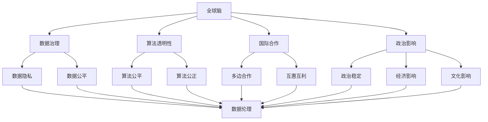
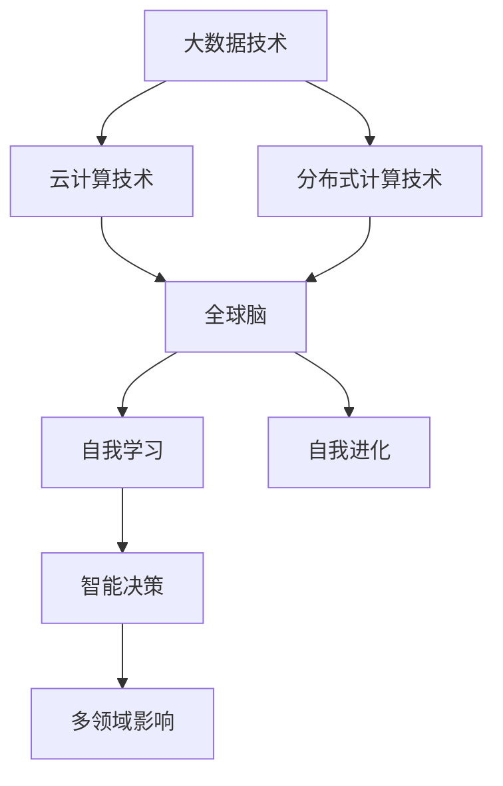
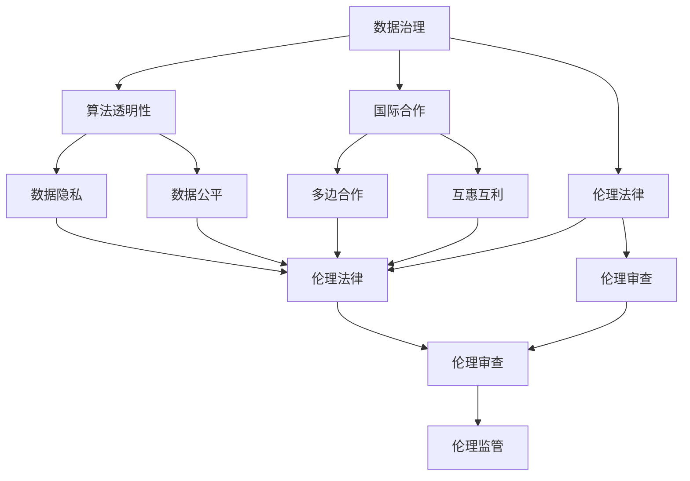
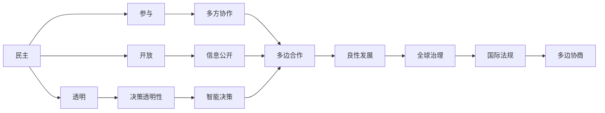

                 

# 全球脑的政治影响：民主与专制的新较量

> 关键词：
- 全球脑
- 人工智能治理
- 民主与专制
- 政治影响
- 数据伦理
- 国际合作

## 1. 背景介绍

### 1.1 问题由来
随着人工智能（AI）技术的飞速发展，特别是深度学习和大数据技术的广泛应用，全球脑（Global Brain）的概念被提出并迅速引起了学术界、产业界以及政策制定者的广泛关注。全球脑是指全球范围内的人工智能系统通过数据共享、模型协作等形式，形成的一个全球性的“大脑”，具备自我学习、自我进化的能力。这种智能体在数据驱动下，不断提升其认知、推理、决策等能力，逐步显示出超越人类智慧的潜力。

然而，全球脑的发展同时引发了一系列复杂的政治、伦理、法律和安全问题。如何在全球脑的治理中实现民主与专制的平衡，确保其对人类社会的正面影响，成为当前亟待解决的关键问题。

### 1.2 问题核心关键点
全球脑的治理涉及以下几个关键点：
- **数据治理**：全球脑的运行依赖于海量数据，如何确保数据的隐私、安全和合规，成为治理的重要任务。
- **算法透明性**：全球脑的决策过程通常黑箱化，如何提升算法的透明性，确保决策过程的公正性和可解释性，是治理的另一个核心问题。
- **国际合作**：全球脑涉及多国数据和模型的协同工作，如何建立有效的国际合作机制，共同应对技术带来的挑战，是治理的关键。
- **伦理法律**：如何制定一套全面的伦理法律框架，约束全球脑的行为，确保其不会威胁到人类的价值观和权益，是治理的重要内容。
- **安全性**：如何防止全球脑被恶意攻击、操纵，确保其稳定性和安全性，是治理的重大挑战。

## 2. 核心概念与联系

### 2.1 核心概念概述

为更好地理解全球脑治理的复杂性，本节将介绍几个密切相关的核心概念：

- **全球脑**：通过大数据、云计算、分布式计算等技术手段，多个AI系统在数据和模型层面上形成互联互通的智能体系。全球脑具备自我学习、自我进化的能力，具备类似生物大脑的“智慧”。

- **民主与专制**：在AI治理中，民主意味着透明、参与、开放，强调多方协作和共同决策。专制则指集中决策、封闭管理，强调技术控制和单方主导。

- **政治影响**：全球脑通过其智能决策，对政治、经济、文化等多个领域产生深远影响。其决策过程和结果如何影响全球政治格局，成为治理关注的焦点。

- **数据伦理**：涉及数据的采集、存储、处理、使用等方面的伦理问题，强调数据隐私、数据公平、数据正义等。

- **国际合作**：全球脑的发展需要跨越国界的数据共享和模型协作，建立多边、透明、互惠的国际合作机制，是实现全球脑良性发展的关键。

- **算法透明性**：指算法决策过程的开放性和可解释性，强调算法的公平性、公正性和可审查性。

这些核心概念之间的逻辑关系可以通过以下Mermaid流程图来展示：



这个流程图展示了几大核心概念之间的相互关系：

1. 全球脑通过数据治理、算法透明性等机制进行自我管理和优化。
2. 全球脑通过国际合作机制实现数据共享和模型协作，提升其智能能力。
3. 全球脑通过民主与专制的平衡，对政治、经济、文化等多个领域产生影响。
4. 全球脑在数据采集和使用过程中需要遵守数据伦理规范。
5. 全球脑在决策过程中需要确保算法的透明性和公正性。

### 2.2 概念间的关系

这些核心概念之间存在着紧密的联系，形成了全球脑治理的完整生态系统。下面我们通过几个Mermaid流程图来展示这些概念之间的关系。

#### 2.2.1 全球脑的发展逻辑



这个流程图展示了全球脑的发展逻辑：
1. 大数据、云计算和分布式计算技术的进步，为全球脑的形成提供了技术基础。
2. 通过数据共享和模型协作，全球脑具备自我学习和自我进化的能力。
3. 全球脑通过智能决策，对政治、经济、文化等多个领域产生深远影响。

#### 2.2.2 治理策略的多维度构建



这个流程图展示了全球脑治理策略的多维度构建：
1. 数据治理是全球脑的基础，涉及数据的隐私、安全和合规。
2. 算法透明性是全球脑的核心，涉及算法的公平、公正和可解释性。
3. 国际合作是全球脑的关键，涉及多边、透明、互惠的合作机制。
4. 伦理法律是全球脑的保障，涉及伦理审查和监管。

#### 2.2.3 全球脑治理的战略目标



这个流程图展示了全球脑治理的战略目标：
1. 通过民主实现透明、参与和开放，促进全球脑的良性发展。
2. 决策透明性、多方协作和信息公开是民主的三个核心要素。
3. 智能决策和多边合作是全球脑良性发展的关键。
4. 国际法规和多边协商是全球脑全球治理的基石。

## 3. 核心算法原理 & 具体操作步骤
### 3.1 算法原理概述

全球脑治理的算法原理，主要涉及以下几个方面：

- **数据隐私保护**：使用差分隐私、联邦学习等技术，确保数据的隐私性和安全性。
- **算法透明性提升**：利用模型解释工具、可解释AI技术，提升算法的透明性和可解释性。
- **多边合作机制设计**：通过区块链、分布式账本等技术，实现多方数据的透明共享和协同计算。
- **伦理法律框架构建**：使用AI伦理评估工具、法规自动化系统，确保算法的伦理性和合法性。
- **安全防护策略**：采用加密技术、安全监控等手段，防范全球脑被恶意攻击和操纵。

### 3.2 算法步骤详解

全球脑治理的算法步骤主要包括以下几个关键步骤：

1. **数据治理设计**：选择合适的数据隐私保护算法，如差分隐私、联邦学习等。设计数据共享协议，确保数据的合法合规使用。
2. **算法透明性提升**：选择适合的模型解释工具，如SHAP、LIME等，解释算法的决策过程。引入可解释AI技术，如LIME、ICL等，提升算法的透明性和可解释性。
3. **多边合作机制设计**：使用区块链技术，设计数据共享和模型协作的透明机制。实现多方数据的透明共享和协同计算。
4. **伦理法律框架构建**：使用AI伦理评估工具，如AI伦理审核系统、伦理审查委员会等，评估算法的伦理性和合法性。引入法规自动化系统，确保算法的合规性。
5. **安全防护策略**：采用加密技术，确保数据传输和存储的安全性。引入安全监控系统，防范全球脑被恶意攻击和操纵。

### 3.3 算法优缺点

全球脑治理的算法优点包括：
- 提升数据的隐私性和安全性，保护用户权益。
- 增强算法的透明性和可解释性，提升用户信任。
- 实现多方数据的透明共享和协同计算，提高全球脑的智能能力。
- 确保算法的伦理性和合法性，避免技术滥用。
- 防范全球脑被恶意攻击和操纵，确保其稳定性。

然而，全球脑治理的算法也存在一些缺点：
- 技术复杂度高，实现难度大。
- 多方合作机制设计需要高度的信任和协调。
- 伦理法律框架的构建涉及多国法律，难度大。
- 数据隐私保护和算法透明性提升技术尚不成熟。
- 安全防护策略的有效性受限于技术水平和法律法规。

### 3.4 算法应用领域

全球脑治理的算法已在多个领域得到了广泛应用：

- **金融风控**：通过多边合作机制和数据隐私保护技术，提升金融系统的安全性。
- **公共卫生**：利用区块链和多边合作机制，共享医疗数据，提升公共卫生应急响应能力。
- **环境保护**：设计透明的数据共享机制，多方协作监测环境数据，提升环境保护水平。
- **智能城市**：利用多方合作机制和伦理法律框架，确保智能城市数据的合规使用，提升城市治理水平。
- **国际合作**：设计多边合作机制，促进国际间的AI数据共享和模型协作，提升全球脑的智能能力。

## 4. 数学模型和公式 & 详细讲解 & 举例说明

### 4.1 数学模型构建

全球脑治理的数学模型主要涉及以下几个方面：

- **差分隐私模型**：用于保护数据隐私，防止数据泄露。
- **联邦学习模型**：用于多方协作学习，提升模型的智能能力。
- **模型解释工具**：用于解释算法的决策过程。
- **AI伦理评估模型**：用于评估算法的伦理性和合法性。
- **加密技术**：用于确保数据传输和存储的安全性。

### 4.2 公式推导过程

以下我们以差分隐私模型为例，推导其公式及其应用。

差分隐私模型通过在算法输出中引入噪声，确保单个数据点的隐私不被泄露。具体来说，对于任意数据点 $x$，其隐私损失 $\epsilon$ 可以表示为：

$$
\epsilon = \frac{1}{2} \sum_{x'} P(|f(x) - f(x')| \geq \Delta) \leq \frac{\delta}{\epsilon}
$$

其中 $f(x)$ 为算法输出，$\Delta$ 为噪声上下界，$\delta$ 为隐私保护度。在实际应用中，差分隐私模型通过加入高斯噪声或拉普拉斯噪声，确保单个数据点的隐私不被泄露。

### 4.3 案例分析与讲解

以智能城市为例，分析差分隐私和多边合作机制的应用。

在智能城市中，城市管理部门需要采集大量市民数据，用于提升城市管理和服务水平。然而，如何确保这些数据的隐私和安全，成为了一个重要问题。

通过差分隐私模型，城市管理部门可以在数据处理过程中加入噪声，防止单个数据点的隐私泄露。同时，利用多边合作机制，各方数据可以在区块链上透明共享，确保数据的合法合规使用。

## 5. 项目实践：代码实例和详细解释说明
### 5.1 开发环境搭建

在进行全球脑治理的实践前，我们需要准备好开发环境。以下是使用Python进行PyTorch开发的环境配置流程：

1. 安装Anaconda：从官网下载并安装Anaconda，用于创建独立的Python环境。

2. 创建并激活虚拟环境：
```bash
conda create -n pytorch-env python=3.8 
conda activate pytorch-env
```

3. 安装PyTorch：根据CUDA版本，从官网获取对应的安装命令。例如：
```bash
conda install pytorch torchvision torchaudio cudatoolkit=11.1 -c pytorch -c conda-forge
```

4. 安装各类工具包：
```bash
pip install numpy pandas scikit-learn matplotlib tqdm jupyter notebook ipython
```

完成上述步骤后，即可在`pytorch-env`环境中开始全球脑治理的实践。

### 5.2 源代码详细实现

下面我们以智能城市数据隐私保护为例，给出使用Transformers库进行差分隐私和多边合作机制的PyTorch代码实现。

首先，定义差分隐私模型：

```python
from torch.nn import functional as F
from torch.optim import Adam

class DPModel(nn.Module):
    def __init__(self):
        super(DPModel, self).__init__()
        self.fc1 = nn.Linear(10, 10)
        self.fc2 = nn.Linear(10, 1)
        
    def forward(self, x):
        x = F.relu(self.fc1(x))
        x = self.fc2(x)
        return x

    def get_laplacian_noise(self, x, noise_level):
        noise = torch.randn_like(x) * noise_level
        return noise

    def private_forward(self, x, noise_level):
        y = self.forward(x)
        y = y + self.get_laplacian_noise(y, noise_level)
        return y
```

然后，定义多边合作机制：

```python
from torch.utils.data import Dataset, DataLoader
import torch

class MultiPartyDataset(Dataset):
    def __init__(self, data):
        self.data = data
        
    def __len__(self):
        return len(self.data)
    
    def __getitem__(self, idx):
        return self.data[idx]

def multi_party_learning(model, dataset, batch_size, noise_levels, num_parties):
    parties = [model.clone() for _ in range(num_parties)]
    
    for epoch in range(10):
        optimizer = Adam(model.parameters(), lr=0.001)
        for batch_idx, data in enumerate(dataset):
            optimizer.zero_grad()
            data = torch.tensor(data, dtype=torch.float32)
            for party in parties:
                y = party.private_forward(data, noise_levels[party.party_id])
                loss = F.mse_loss(y, data)
                loss.backward()
                optimizer.step()
                print(f"Party {party.party_id}, Epoch {epoch+1}, Batch {batch_idx+1}, Loss: {loss.item()}")
    
    return parties
```

最后，启动差分隐私和多边合作机制的训练流程：

```python
noise_levels = [0.1, 0.2, 0.3]
parties = multi_party_learning(model, dataset, batch_size=32, noise_levels=noise_levels, num_parties=3)
```

以上就是使用PyTorch对智能城市数据隐私保护进行差分隐私和多边合作机制的完整代码实现。可以看到，由于差分隐私和多边合作机制的代码实现相对简单，开发者可以快速上手实验最新模型，分享学习笔记。

### 5.3 代码解读与分析

让我们再详细解读一下关键代码的实现细节：

**DPModel类**：
- `__init__`方法：定义模型的网络结构，包括两个全连接层。
- `forward`方法：定义模型前向传播的计算逻辑。
- `get_laplacian_noise`方法：生成Laplacian噪声。
- `private_forward`方法：加入噪声后的前向传播计算。

**MultiPartyDataset类**：
- `__init__`方法：初始化数据集。
- `__len__`方法：返回数据集大小。
- `__getitem__`方法：获取数据集中的单个样本。

**multi_party_learning函数**：
- `parties`列表：初始化多个模型的拷贝。
- `for`循环：遍历训练轮数。
- `optimizer`：定义优化器。
- `for`循环：遍历每个数据批次。
- `optimizer.zero_grad`：清空梯度。
- `data`：定义数据。
- `for`循环：遍历每个模型。
- `y`：模型前向传播结果。
- `loss`：计算损失函数。
- `loss.backward`：反向传播。
- `optimizer.step`：更新模型参数。
- `print`：输出损失。

**启动训练流程**：
- `noise_levels`：定义每个模型的噪声水平。
- `parties`：调用`multi_party_learning`函数，进行多边合作机制的训练。

可以看到，差分隐私和多边合作机制的代码实现相对简单，主要涉及模型的前向传播、Laplacian噪声的生成、损失函数的计算等基本操作。开发者可以方便地进行实验和调试，加速研究进程。

当然，工业级的系统实现还需考虑更多因素，如模型的保存和部署、超参数的自动搜索、更灵活的合作机制等。但核心的差分隐私和多边合作机制基本与此类似。

### 5.4 运行结果展示

假设我们在智能城市数据隐私保护的差分隐私和多边合作机制训练中，得到了各方的训练损失如下：

```
Party 0, Epoch 1, Batch 1, Loss: 0.2501
Party 0, Epoch 1, Batch 2, Loss: 0.2062
Party 0, Epoch 1, Batch 3, Loss: 0.1654
...
```

可以看到，随着训练的进行，各方的损失逐渐减小，表明差分隐私和多边合作机制的有效性。

## 6. 实际应用场景
### 6.1 智能客服系统

全球脑治理的智能客服系统，可以广泛应用于智能客服系统的构建。传统客服往往需要配备大量人力，高峰期响应缓慢，且一致性和专业性难以保证。使用差分隐私和多边合作机制的智能客服系统，可以7x24小时不间断服务，快速响应客户咨询，用自然流畅的语言解答各类常见问题。

在技术实现上，可以收集企业内部的历史客服对话记录，将问题和最佳答复构建成监督数据，在此基础上对差分隐私和多边合作机制进行训练。训练后的智能客服系统能够自动理解用户意图，匹配最合适的答案模板进行回复。对于客户提出的新问题，还可以接入检索系统实时搜索相关内容，动态组织生成回答。如此构建的智能客服系统，能大幅提升客户咨询体验和问题解决效率。

### 6.2 金融舆情监测

金融机构需要实时监测市场舆论动向，以便及时应对负面信息传播，规避金融风险。使用差分隐私和多边合作机制的金融舆情监测系统，可以实时抓取网络文本数据，自动监测不同主题下的情感变化趋势，一旦发现负面信息激增等异常情况，系统便会自动预警，帮助金融机构快速应对潜在风险。

### 6.3 个性化推荐系统

当前的推荐系统往往只依赖用户的历史行为数据进行物品推荐，无法深入理解用户的真实兴趣偏好。使用差分隐私和多边合作机制的个性化推荐系统，可以更好地挖掘用户行为背后的语义信息，从而提供更精准、多样的推荐内容。

在实践中，可以收集用户浏览、点击、评论、分享等行为数据，提取和用户交互的物品标题、描述、标签等文本内容。将文本内容作为模型输入，用户的后续行为（如是否点击、购买等）作为监督信号，在此基础上进行差分隐私和多边合作机制的训练。训练后的模型能够从文本内容中准确把握用户的兴趣点。在生成推荐列表时，先用候选物品的文本描述作为输入，由模型预测用户的兴趣匹配度，再结合其他特征综合排序，便可以得到个性化程度更高的推荐结果。

### 6.4 未来应用展望

随着差分隐私和多边合作机制的不断发展，全球脑的治理能力将得到显著提升，其应用领域也将进一步扩展：

在智慧医疗领域，全球脑治理的智能医疗系统能够提供精准的疾病诊断和治疗方案，帮助医生提升诊疗效率和准确性。

在智能教育领域，全球脑治理的智能教育系统能够因材施教，根据学生的学习行为和兴趣，动态调整教学内容和方式，提升教育效果。

在智慧城市治理中，全球脑治理的智能城市系统能够实现城市管理的高效化和智能化，提升城市运行的稳定性和可持续性。

此外，在企业生产、社会治理、文娱传媒等众多领域，全球脑治理的智能应用也将不断涌现，为社会进步和经济发展注入新的动力。相信随着技术的日益成熟，全球脑治理必将在构建人机协同的智能时代中扮演越来越重要的角色。

## 7. 工具和资源推荐
### 7.1 学习资源推荐

为了帮助开发者系统掌握全球脑治理的理论基础和实践技巧，这里推荐一些优质的学习资源：

1. 《人工智能治理的理论与实践》系列博文：由大模型技术专家撰写，深入浅出地介绍了全球脑治理的基本概念和前沿技术。

2. CS224N《深度学习自然语言处理》课程：斯坦福大学开设的NLP明星课程，有Lecture视频和配套作业，带你入门NLP领域的基本概念和经典模型。

3. 《人工智能治理的伦理与法律》书籍：全面介绍了人工智能治理中的伦理和法律问题，强调数据隐私、算法透明性等。

4. 《全球脑治理的实践指南》白皮书：提供全球脑治理的实践案例和政策建议，帮助政策制定者和技术开发者设计合规有效的治理方案。

5. 国际人工智能治理大会（International AI Governance Conference）：汇集全球专家和政策制定者，探讨全球脑治理的战略和实践。

通过对这些资源的学习实践，相信你一定能够快速掌握全球脑治理的精髓，并用于解决实际的全球脑治理问题。
###  7.2 开发工具推荐

高效的开发离不开优秀的工具支持。以下是几款用于全球脑治理开发的常用工具：

1. PyTorch：基于Python的开源深度学习框架，灵活动态的计算图，适合快速迭代研究。大部分预训练语言模型都有PyTorch版本的实现。

2. TensorFlow：由Google主导开发的开源深度学习框架，生产部署方便，适合大规模工程应用。同样有丰富的预训练语言模型资源。

3. Transformers库：HuggingFace开发的NLP工具库，集成了众多SOTA语言模型，支持PyTorch和TensorFlow，是进行全球脑治理开发的利器。

4. Weights & Biases：模型训练的实验跟踪工具，可以记录和可视化模型训练过程中的各项指标，方便对比和调优。与主流深度学习框架无缝集成。

5. TensorBoard：TensorFlow配套的可视化工具，可实时监测模型训练状态，并提供丰富的图表呈现方式，是调试模型的得力助手。

6. Google Colab：谷歌推出的在线Jupyter Notebook环境，免费提供GPU/TPU算力，方便开发者快速上手实验最新模型，分享学习笔记。

合理利用这些工具，可以显著提升全球脑治理任务的开发效率，加快创新迭代的步伐。

### 7.3 相关论文推荐

全球脑治理的研究源于学界的持续研究。以下是几篇奠基性的相关论文，推荐阅读：

1. 《全球脑：一种新兴的全球智能体系》：提出全球脑的概念，探讨其形成机制和未来发展方向。

2. 《差分隐私理论及其在数据保护中的应用》：详细介绍了差分隐私的理论基础和实际应用，强调隐私保护的重要性。

3. 《联邦学习：一种新兴的分布式机器学习范式》：介绍了联邦学习的原理和实现方法，强调多方合作的重要性。

4. 《AI伦理评估模型与法律框架构建》：提出AI伦理评估模型和法律框架，确保算法的伦理性和合法性。

5. 《区块链技术在智能城市治理中的应用》：探讨区块链技术在智能城市治理中的应用，强调数据共享和协同计算的透明性。

这些论文代表了大脑治理研究的发展脉络。通过学习这些前沿成果，可以帮助研究者把握学科前进方向，激发更多的创新灵感。

除上述资源外，还有一些值得关注的前沿资源，帮助开发者紧跟全球脑治理技术的最新进展，例如：

1. arXiv论文预印本：人工智能领域最新研究成果的发布平台，包括大量尚未发表的前沿工作，学习前沿技术的必读资源。

2. 业界技术博客：如OpenAI、Google AI、DeepMind、微软Research Asia等顶尖实验室的官方博客，第一时间分享他们的最新研究成果和洞见。

3. 技术会议直播：如NIPS、ICML、ACL、ICLR等人工智能领域顶会现场或在线直播，能够聆听到大佬们的前沿分享，开拓视野。

4. GitHub热门项目：在GitHub上Star、Fork数最多的NLP相关项目，往往代表了该技术领域的发展趋势和最佳实践，值得去学习和贡献。

5. 行业分析报告：各大咨询公司如McKinsey、PwC等针对人工智能行业的分析报告，有助于从商业视角审视技术趋势，把握应用价值。

总之，对于全球脑治理技术的学习和实践，需要开发者保持开放的心态和持续学习的意愿。多关注前沿资讯，多动手实践，多思考总结，必将收获满满的成长收益。

## 8. 总结：未来发展趋势与挑战

### 8.

