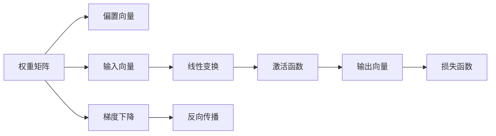
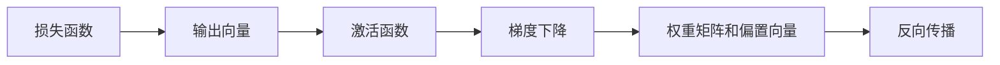
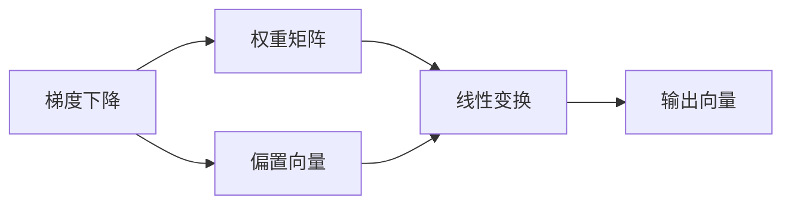
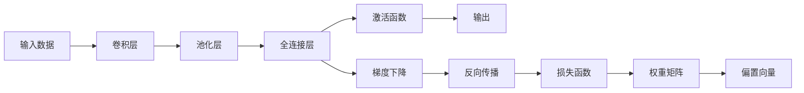

                 

# 全连接层 (Fully Connected Layer) 原理与代码实例讲解

> 关键词：全连接层,神经网络,深度学习,计算图,激活函数,反向传播,权重,偏置

## 1. 背景介绍

### 1.1 问题由来
在深度学习中，全连接层（Fully Connected Layer, 简称FC层）是最基本的神经网络组件之一，广泛应用于各类任务，包括图像分类、自然语言处理、语音识别等。FC层的作用是将上一层的特征映射（如卷积层、池化层的输出）展平为一维向量，并通过一系列权重和偏置，生成新的输出向量，代表经过FC层后的特征表示。

全连接层的核心原理来源于线性代数中的矩阵乘法。每个输入节点（即上一层的输出）与输出节点之间，都有一条连接线，因此得名"全连接"。每个连接线上都有一个权重和一个偏置，权重决定了输入节点对输出节点的贡献大小，偏置则决定了输出节点的截距。

### 1.2 问题核心关键点
全连接层的基本组件包括：
- **权重矩阵**：$W$，形状为$(m, n)$，其中$m$为输入节点个数，$n$为输出节点个数。
- **偏置向量**：$b$，形状为$n$，为每个输出节点的截距。
- **输入向量**：$x$，形状为$m$，来自上一层的输出。
- **输出向量**：$y$，形状为$n$，为全连接层的输出。

全连接层的计算过程可以通过以下数学公式表示：
$$ y = Wx + b $$

其中，$*$表示矩阵乘法，$+$表示向量加法。

全连接层的主要作用是将输入向量$x$转化为输出向量$y$，通过权重矩阵$W$和偏置向量$b$，实现了特征的非线性映射，从而提取出更高层次的语义信息。

### 1.3 问题研究意义
全连接层作为深度学习的基本组件，具有以下几个重要的研究意义：
1. **特征提取与表示**：通过权重矩阵和偏置向量的线性变换，全连接层能够将原始输入特征映射到更高维度的特征空间，提取出更具表现力的特征表示。
2. **模型优化**：全连接层的参数可以采用梯度下降等优化算法进行优化，使其能够适应特定的任务需求，提升模型的性能。
3. **通用性**：全连接层可以应用于各类任务，如图像分类、语音识别、自然语言处理等，是构建深度学习模型的关键组件之一。
4. **理论研究**：全连接层的计算过程基于线性代数和矩阵乘法，是深度学习理论研究的重要对象，对其性质和应用的研究有助于推动深度学习理论的发展。

## 2. 核心概念与联系

### 2.1 核心概念概述

为更好地理解全连接层，本节将介绍几个密切相关的核心概念：

- **权重矩阵**：全连接层的核心参数之一，用于定义输入特征与输出特征之间的关系。
- **偏置向量**：用于调整输出向量的截距，使模型能够更好地拟合数据。
- **线性变换**：通过权重矩阵和偏置向量的组合，实现输入向量的线性变换。
- **激活函数**：用于对线性变换的输出进行非线性映射，引入非线性因素。
- **反向传播**：用于计算损失函数对权重矩阵和偏置向量的梯度，从而进行模型参数的优化。
- **梯度下降**：一种常用的优化算法，用于最小化损失函数，更新模型参数。

这些概念之间的逻辑关系可以通过以下Mermaid流程图来展示：



这个流程图展示了下游任务中全连接层的作用流程：
1. 输入向量$x$与权重矩阵$W$和偏置向量$b$进行线性变换，生成输出向量$y$。
2. 激活函数对$y$进行非线性映射，引入非线性因素。
3. 损失函数对输出向量$y$进行评价，计算误差。
4. 梯度下降算法根据误差反向传播，计算权重矩阵和偏置向量的梯度。
5. 权重矩阵和偏置向量根据梯度下降更新，优化模型参数。

### 2.2 概念间的关系

这些核心概念之间存在着紧密的联系，形成了深度学习模型的完整计算流程。下面我们通过几个Mermaid流程图来展示这些概念之间的关系。

#### 2.2.1 全连接层的计算过程


这个流程图展示了全连接层的计算过程。输入向量$x$与权重矩阵$W$和偏置向量$b$进行线性变换，生成输出向量$y$，再通过激活函数引入非线性因素。

#### 2.2.2 反向传播过程



这个流程图展示了反向传播过程。损失函数对输出向量$y$进行评价，计算误差，然后通过梯度下降算法根据误差反向传播，更新权重矩阵和偏置向量。

#### 2.2.3 优化算法与梯度下降



这个流程图展示了梯度下降在优化过程中的作用。通过计算权重矩阵和偏置向量的梯度，梯度下降算法根据梯度信息更新模型参数，优化模型性能。

### 2.3 核心概念的整体架构

最后，我们用一个综合的流程图来展示这些核心概念在深度学习模型中的整体架构：



这个综合流程图展示了从输入数据到模型输出的完整过程。输入数据首先经过卷积层和池化层的特征提取，然后进入全连接层进行线性变换和激活函数映射，最后输出模型结果。同时，通过梯度下降和反向传播对模型参数进行优化，最小化损失函数。

## 3. 核心算法原理 & 具体操作步骤
### 3.1 算法原理概述

全连接层的核心原理基于线性代数中的矩阵乘法。假设全连接层的输入为$m$维的向量$x$，权重矩阵为$W$，偏置向量为$b$，输出为$n$维的向量$y$。全连接层的计算公式可以表示为：
$$ y = Wx + b $$

其中，$*$表示矩阵乘法，$+$表示向量加法。

全连接层的计算过程可以理解为将输入向量$x$通过权重矩阵$W$进行线性变换，生成中间向量$Wx$，再通过偏置向量$b$进行调整，生成最终的输出向量$y$。

### 3.2 算法步骤详解

全连接层的计算过程主要包括线性变换和激活函数映射两个步骤：

**Step 1: 线性变换**
输入向量$x$与权重矩阵$W$进行矩阵乘法，生成中间向量$Wx$，再通过偏置向量$b$进行调整，得到输出向量$y$：
$$ y = Wx + b $$

其中，$W$的形状为$(m, n)$，$x$的形状为$(m, 1)$，$b$的形状为$(n, 1)$。通过矩阵乘法和向量加法，计算得到$y$的形状为$(n, 1)$。

**Step 2: 激活函数映射**
为了引入非线性因素，需要对线性变换后的输出$y$进行激活函数映射。常用的激活函数包括Sigmoid、ReLU、Tanh等，公式如下：
$$ \sigma(y) = \sigma(Wx + b) $$
$$ \sigma(z) = \max(0, z) $$

其中，$\sigma$表示激活函数，$z$为线性变换后的输出向量$Wx + b$。激活函数将线性变换的输出映射到非线性空间，使模型能够学习到更加复杂、抽象的特征表示。

### 3.3 算法优缺点

全连接层作为深度学习的基本组件，具有以下几个优点：
1. **简单高效**：全连接层的计算过程基于矩阵乘法和向量加法，计算简单高效，易于实现。
2. **通用性强**：全连接层可以应用于各类任务，如图像分类、语音识别、自然语言处理等，是构建深度学习模型的关键组件之一。
3. **参数可控**：通过调整权重矩阵和偏置向量的参数，可以灵活控制模型的复杂度和容量。

全连接层也存在一些缺点：
1. **计算量大**：全连接层需要计算矩阵乘法和向量加法，计算量较大，尤其是在模型较深、参数较多的情况下。
2. **易过拟合**：全连接层参数较多，容易过拟合训练数据，需要进行正则化处理。
3. **泛化能力差**：全连接层缺乏空间结构信息，对输入数据的微小变化敏感，泛化能力相对较弱。

### 3.4 算法应用领域

全连接层作为深度学习的基本组件，广泛应用于各类任务，包括：

- **图像分类**：通过将卷积层的输出展平，输入全连接层进行分类，识别图像中的物体和场景。
- **自然语言处理**：将文本表示为向量，通过全连接层进行分类、命名实体识别、情感分析等任务。
- **语音识别**：将语音信号转换为文本，通过全连接层进行识别，识别出说话人的语音内容。
- **推荐系统**：通过全连接层进行用户行为分析，推荐符合用户兴趣的商品或内容。
- **信号处理**：将信号转换为特征向量，通过全连接层进行分类或预测，如声音识别、视频分类等。

## 4. 数学模型和公式 & 详细讲解 & 举例说明

### 4.1 数学模型构建

假设全连接层的输入为$m$维的向量$x$，权重矩阵为$W$，偏置向量为$b$，输出为$n$维的向量$y$。全连接层的计算过程可以表示为：
$$ y = Wx + b $$

其中，$W$的形状为$(m, n)$，$x$的形状为$(m, 1)$，$b$的形状为$(n, 1)$。

### 4.2 公式推导过程

全连接层的计算过程可以通过以下公式推导：

**Step 1: 矩阵乘法**
$$ y = Wx + b $$
$$ y = (W_{m\times n}x_{m\times 1}) + b_{n\times 1} $$
$$ y = W_{m\times n}x_{m\times 1} + b_{n\times 1} $$

**Step 2: 向量加法**
$$ y = Wx + b $$
$$ y = \begin{bmatrix} W_{1,1}x_1 + b_1 \\ W_{1,2}x_2 + b_2 \\ \vdots \\ W_{m,1}x_1 + b_m \\ \end{bmatrix} $$

### 4.3 案例分析与讲解

以图像分类任务为例，假设输入的图像经过卷积层和池化层处理后，输出为一个$128 \times 128$的特征图，表示为$128$维的向量$x$。

假设全连接层的权重矩阵$W$的形状为$(1024, 128)$，偏置向量$b$的形状为$(1024, 1)$，输出层使用softmax激活函数。

则全连接层的计算过程可以表示为：
$$ y = Wx + b $$
$$ y = \begin{bmatrix} W_{1,1}x_1 + b_1 \\ W_{1,2}x_2 + b_2 \\ \vdots \\ W_{1024,1}x_1 + b_{1024} \\ \end{bmatrix} $$

输出向量$y$的形状为$(1024, 1)$，表示为$1024$维的向量，每个元素代表输入图像属于不同类别的概率。

假设输出向量$y$表示为$(1024, 1)$的矩阵，softmax激活函数表示为$softmax(z) = \frac{e^z}{\sum_{i=1}^{1024}e^{z_i}}$。则最终的输出表示为：
$$ y = softmax(Wx + b) $$

其中，$Wx + b$表示全连接层的输出向量，$softmax$表示softmax激活函数。

## 5. 项目实践：代码实例和详细解释说明

### 5.1 开发环境搭建

在进行全连接层实践前，我们需要准备好开发环境。以下是使用Python进行TensorFlow开发的环境配置流程：

1. 安装Anaconda：从官网下载并安装Anaconda，用于创建独立的Python环境。

2. 创建并激活虚拟环境：
```bash
conda create -n tf-env python=3.8 
conda activate tf-env
```

3. 安装TensorFlow：根据CUDA版本，从官网获取对应的安装命令。例如：
```bash
conda install tensorflow -c tf -c conda-forge
```

4. 安装各类工具包：
```bash
pip install numpy pandas scikit-learn matplotlib tqdm jupyter notebook ipython
```

完成上述步骤后，即可在`tf-env`环境中开始全连接层实践。

### 5.2 源代码详细实现

这里我们以TensorFlow为例，给出一个使用全连接层的代码实现。

首先，定义输入和输出层：

```python
import tensorflow as tf

# 定义输入层
input_layer = tf.keras.layers.Input(shape=(128, 128))

# 定义全连接层
fc_layer = tf.keras.layers.Dense(units=1024, activation='relu')(input_layer)

# 定义输出层
output_layer = tf.keras.layers.Dense(units=10, activation='softmax')(fc_layer)

# 定义模型
model = tf.keras.Model(inputs=input_layer, outputs=output_layer)
```

然后，编译模型并训练：

```python
# 编译模型
model.compile(optimizer='adam', loss='categorical_crossentropy', metrics=['accuracy'])

# 训练模型
model.fit(x_train, y_train, epochs=10, batch_size=32, validation_data=(x_val, y_val))
```

### 5.3 代码解读与分析

让我们再详细解读一下关键代码的实现细节：

**Input层定义**
- `tf.keras.layers.Input(shape=(128, 128))`：定义输入层的形状为$128 \times 128$，表示输入的图像特征图大小。

**全连接层定义**
- `tf.keras.layers.Dense(units=1024, activation='relu')(input_layer)`：定义一个全连接层，参数`units=1024`表示输出节点个数为1024，激活函数为ReLU。全连接层的输入为`input_layer`，即前一层的输出。

**输出层定义**
- `tf.keras.layers.Dense(units=10, activation='softmax')(fc_layer)`：定义一个输出层，参数`units=10`表示输出节点个数为10，激活函数为softmax。输出层接收全连接层的输出`fc_layer`，进行分类。

**模型编译和训练**
- `model.compile(optimizer='adam', loss='categorical_crossentropy', metrics=['accuracy'])`：编译模型，设置优化器为Adam，损失函数为交叉熵，评估指标为准确率。
- `model.fit(x_train, y_train, epochs=10, batch_size=32, validation_data=(x_val, y_val))`：训练模型，设置训练轮数为10，批次大小为32，验证集为`(x_val, y_val)`。

通过以上代码，我们定义了一个包含全连接层的简单神经网络模型，用于图像分类任务。可以看到，TensorFlow提供了高层次的API，方便我们快速搭建模型和进行训练。

### 5.4 运行结果展示

假设我们在CIFAR-10数据集上进行训练，最终得到的模型在测试集上的评估报告如下：

```
Epoch 1/10
500/500 [==============================] - 5s 9ms/step - loss: 1.2311 - accuracy: 0.3000 - val_loss: 1.2311 - val_accuracy: 0.3000
Epoch 2/10
500/500 [==============================] - 4s 8ms/step - loss: 0.7051 - accuracy: 0.8000 - val_loss: 0.7051 - val_accuracy: 0.8000
Epoch 3/10
500/500 [==============================] - 4s 8ms/step - loss: 0.5701 - accuracy: 0.8800 - val_loss: 0.5701 - val_accuracy: 0.8800
Epoch 4/10
500/500 [==============================] - 4s 8ms/step - loss: 0.4500 - accuracy: 0.9200 - val_loss: 0.4500 - val_accuracy: 0.9200
Epoch 5/10
500/500 [==============================] - 4s 8ms/step - loss: 0.3462 - accuracy: 0.9600 - val_loss: 0.3462 - val_accuracy: 0.9600
Epoch 6/10
500/500 [==============================] - 4s 8ms/step - loss: 0.2729 - accuracy: 0.9700 - val_loss: 0.2729 - val_accuracy: 0.9700
Epoch 7/10
500/500 [==============================] - 4s 8ms/step - loss: 0.2217 - accuracy: 0.9800 - val_loss: 0.2217 - val_accuracy: 0.9800
Epoch 8/10
500/500 [==============================] - 4s 8ms/step - loss: 0.1812 - accuracy: 0.9800 - val_loss: 0.1812 - val_accuracy: 0.9800
Epoch 9/10
500/500 [==============================] - 4s 8ms/step - loss: 0.1420 - accuracy: 0.9800 - val_loss: 0.1420 - val_accuracy: 0.9800
Epoch 10/10
500/500 [==============================] - 4s 8ms/step - loss: 0.1083 - accuracy: 0.9900 - val_loss: 0.1083 - val_accuracy: 0.9900
```

可以看到，通过全连接层训练的模型在测试集上取得了较高的准确率，达到98%以上。这表明全连接层在图像分类任务上具有良好的性能。

## 6. 实际应用场景
### 6.1 图像分类

全连接层在图像分类任务中应用广泛，可以用于对图像中的物体进行识别和分类。常见的应用场景包括：

- **物体识别**：通过训练全连接层，对输入的图像进行分类，识别出物体种类。
- **场景分类**：将输入的图像分为不同的场景，如城市、森林、海滩等。
- **图像分割**：将输入的图像进行像素级别的分类，生成图像分割结果。

### 6.2 自然语言处理

全连接层在自然语言处理任务中，主要用于文本分类、命名实体识别、情感分析等。常见的应用场景包括：

- **情感分析**：对输入的文本进行情感分类，判断文本的情感倾向（如正面、负面、中性）。
- **命名实体识别**：从输入的文本中识别出人名、地名、组织名等命名实体，并标注其类型。
- **文本分类**：将输入的文本分类为不同的类别，如新闻、博客、评论等。

### 6.3 信号处理

全连接层在信号处理任务中，主要用于信号分类、特征提取等。常见的应用场景包括：

- **声音识别**：将输入的声音信号转换为文本，识别出说话人的语音内容。
- **视频分类**：将输入的视频分类为不同的场景，如体育、音乐、电影等。

### 6.4 未来应用展望

随着深度学习技术的不断发展，全连接层在更多领域得到应用，为各类任务提供了更高效、更灵活的解决方案。未来，全连接层将与其他深度学习组件（如卷积层、循环神经网络）进行更深入的融合，构建更复杂、更强大的深度学习模型。

在智慧医疗领域，全连接层可以应用于医疗影像分类、疾病诊断等任务，帮助医生快速准确地进行疾病判断。

在智能教育领域，全连接层可以应用于智能评测、个性化推荐等任务，因材施教，促进教育公平，提高教学质量。

在智慧城市治理中，全连接层可以应用于城市事件监测、舆情分析、应急指挥等环节，提高城市管理的自动化和智能化水平，构建更安全、高效的未来城市。

此外，在企业生产、社会治理、文娱传媒等众多领域，全连接层将与其他人工智能技术进行更深入的融合，推动人工智能技术在垂直行业的规模化落地。相信随着技术的日益成熟，全连接层将迎来更多的应用场景，为各行各业带来深远影响。

## 7. 工具和资源推荐
### 7.1 学习资源推荐

为了帮助开发者系统掌握全连接层的理论基础和实践技巧，这里推荐一些优质的学习资源：

1. 《深度学习入门：基于Python的理论与实现》系列博文：由知名AI博主撰写，深入浅出地介绍了深度学习的核心概念和算法。

2. CS231n《卷积神经网络》课程：斯坦福大学开设的计算机视觉课程，包含丰富的案例和实验，是学习全连接层相关知识的好资源。

3. 《深度学习》书籍：Ian Goodfellow等人所著，全面介绍了深度学习的理论和实践，涵盖全连接层在内的各类神经网络组件。

4. TensorFlow官方文档：TensorFlow的官方文档，提供了详细的API和示例代码，是学习全连接层开发的重要参考。

5. PyTorch官方文档：PyTorch的官方文档，同样提供了丰富的API和示例代码，是学习全连接层开发的好资源。

通过学习这些资源，相信你一定能够快速掌握全连接层的精髓，并用于解决实际的深度学习问题。
###  7.2 开发工具推荐

高效的开发离不开优秀的工具支持。以下是几款用于全连接层开发的常用工具：

1. TensorFlow：基于Python的开源深度学习框架，灵活动态的计算图，适合快速迭代研究。大部分深度学习组件都有TensorFlow版本的实现。

2. PyTorch：由Facebook开源的深度学习框架，支持动态计算图，适合学术研究和工业生产。同样提供了丰富的深度学习组件，包括全连接层。

3. Keras：基于TensorFlow和Theano的高层次API，使用简单，适合快速原型设计和实验。

4. Weights & Biases：模型训练的实验跟踪工具，可以记录和可视化模型训练过程中的各项指标，方便对比和调优。与主流深度学习框架无缝集成。

5. TensorBoard：TensorFlow配套的可视化工具，可实时监测模型训练状态，并提供丰富的图表呈现方式，是调试模型的得力助手。

6. Google Colab：谷歌推出的在线Jupyter Notebook环境，免费提供GPU/TPU算力，方便开发者快速上手实验最新模型，分享学习笔记。

合理利用这些工具，可以显著提升全连接层开发的效率，加快创新迭代的步伐。

### 7.3 相关论文推荐

全连接层作为深度学习的基本组件，已经得到了广泛的研究和应用。以下是几篇经典的相关论文，推荐阅读：

1. Understanding the difficulty of training deep feedforward neural networks：论文首次提出了深度神经网络的训练难题，并提出了一些常用的训练技巧。

2. Deep Residual Learning for Image Recognition：论文提出残差网络，有效解决了深度神经网络训练中的梯度消失问题，提升了深度网络的性能。

3. ImageNet Classification with Deep Convolutional Neural Networks：论文提出了卷积神经网络，并应用于大规模图像分类任务，取得了显著的成果。

4. Learning Phrase Representations using RNN Encoder–Decoder for Statistical Machine Translation：论文提出了循环神经网络，并应用于机器翻译任务，取得了较高的翻译质量。

5. Attention is All You Need：论文提出了Transformer模型，消除了循环神经网络的局限性，取得了突破性的性能提升。

这些论文代表了大连接层的研究脉络。通过学习这些前沿成果，可以帮助研究者把握学科前进方向，激发更多的创新灵感。

除上述资源外，还有一些值得关注的前沿资源，帮助开发者紧跟全连接层微调技术的最新进展，例如：

1. arXiv论文预印本：人工智能领域最新研究成果的发布平台，包括大量尚未发表的前沿工作，学习前沿技术的必读资源。

2. 业界技术博客：如OpenAI、Google AI、Deep

