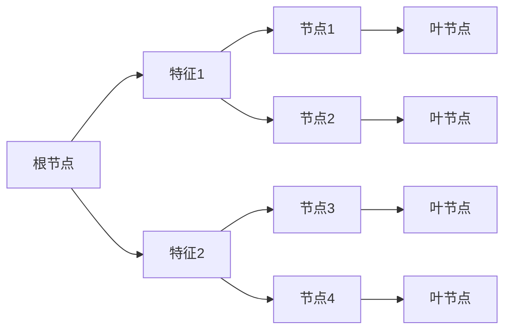

                 

# 决策树(Decision Trees) - 原理与代码实例讲解

## 1. 背景介绍

### 1.1 问题由来

决策树（Decision Trees）是机器学习中最经典的分类和回归算法之一。它基于树形结构进行决策分析，通过递归地将数据集划分到不同子集中，使得子集内部的样本具有相似的特征。决策树易于理解和解释，在处理各种数据类型时表现出色，如连续型数据、离散型数据和混合数据。决策树也被广泛应用于金融、医疗、电商等领域，是解决实际问题的有力工具。

### 1.2 问题核心关键点

决策树的核心思想是通过树形结构对数据集进行递归分割，最终得到一个能够精确分类或预测的树。决策树在建立过程中，需要选择最优的特征和分割点，以最大化信息增益或信息增益比。决策树的建立包括两个主要步骤：

1. **特征选择**：从数据集中选择最能够区分不同类别或回归目标的特征作为决策树的节点。
2. **节点划分**：根据选择的特征，将数据集划分为不同的子集，每个子集代表树的一个叶节点。

决策树的优缺点非常明显：

- **优点**：易于理解和解释，能够处理离散型和连续型数据，能够处理缺失值，可解释性强。
- **缺点**：容易过拟合，存在高方差，在处理大量特征时计算复杂度较高。

### 1.3 问题研究意义

决策树算法作为机器学习的基础算法之一，其重要性和实用性不言而喻。研究决策树算法不仅能够深入理解其工作原理和应用场景，还能为其他复杂算法提供启示和借鉴，如随机森林、梯度提升树等。

决策树的快速迭代和模型解释性使其成为实际问题解决的首选算法，能够帮助研究人员和开发者更加直观地理解数据和问题。随着计算资源的增加和算法优化技术的进步，决策树在处理大规模数据和复杂任务上的应用前景更加广阔。

## 2. 核心概念与联系

### 2.1 核心概念概述

- **决策树**：通过树形结构进行决策分析，利用信息增益等指标选择最优特征和分割点，递归地对数据集进行划分。
- **信息增益**：用于度量特征对目标分类的贡献度，选择信息增益最大的特征进行节点划分。
- **信息增益比**：在信息增益的基础上，考虑特征自身的信息熵，选择信息增益比最大的特征进行节点划分。
- **剪枝**：通过减少决策树的复杂度，避免过拟合现象，提高模型泛化能力。
- **基尼不纯度**：用于衡量分类数据的纯度，选择基尼不纯度最小的分割点进行节点划分。

### 2.2 核心概念间的联系

决策树的构建过程包括特征选择和节点划分两个核心步骤，其核心概念之间的联系可以概括为：

- **信息增益和信息增益比**：这两个指标用于度量特征对目标分类的贡献度，在特征选择中起到关键作用。信息增益越大，意味着特征对分类任务的区分能力越强；信息增益比越大，则说明特征本身的信息熵较小，在选择特征时更加可靠。
- **基尼不纯度**：用于衡量分类数据的纯度，在节点划分中起到关键作用。基尼不纯度越低，说明数据集内部的类别分布越均匀，选择基尼不纯度最小的分割点能够更好地对数据集进行划分。
- **剪枝**：通过减少决策树的复杂度，避免过拟合现象。剪枝技术包括预剪枝和后剪枝，能够在保证模型泛化能力的同时，减少计算复杂度。

这些核心概念之间相互关联，共同构成了决策树算法的完整框架。理解这些概念间的联系，能够帮助我们更好地设计和使用决策树模型。

### 2.3 核心概念的整体架构

以下是一个决策树的整体架构图：



这个架构图展示了决策树的构建过程：从根节点开始，根据特征1和特征2对数据集进行划分，形成四个子集，再对每个子集进行进一步的划分，最终得到若干叶节点，每个叶节点代表一个类别或回归目标。

## 3. 核心算法原理 & 具体操作步骤

### 3.1 算法原理概述

决策树算法的基本原理是通过树形结构对数据集进行递归分割，最终得到一个能够精确分类或预测的树。其核心思想是选择最优的特征和分割点，以最大化信息增益或信息增益比。

决策树的构建包括以下几个主要步骤：

1. **数据预处理**：对数据集进行归一化、标准化等处理，以便更好地进行特征选择。
2. **特征选择**：从数据集中选择最能够区分不同类别或回归目标的特征作为决策树的节点。
3. **节点划分**：根据选择的特征，将数据集划分为不同的子集，每个子集代表树的一个叶节点。
4. **剪枝**：通过减少决策树的复杂度，避免过拟合现象，提高模型泛化能力。

### 3.2 算法步骤详解

#### 3.2.1 数据预处理

数据预处理是决策树构建的第一步，其目的是对原始数据进行清洗和规范化，以便更好地进行特征选择和节点划分。常见的数据预处理包括：

- **缺失值处理**：对数据集中的缺失值进行处理，如删除缺失值、填充缺失值等。
- **归一化**：对数据进行标准化处理，使得所有特征的取值范围在一个特定的区间内。
- **特征选择**：选择最有区分度的特征，去除冗余和噪声特征，以提高模型效率。

#### 3.2.2 特征选择

特征选择是决策树构建的核心步骤之一，其目的是从数据集中选择最能够区分不同类别或回归目标的特征作为决策树的节点。常见的特征选择方法包括：

- **信息增益**：基于信息熵，选择信息增益最大的特征。
- **信息增益比**：在信息增益的基础上，考虑特征自身的信息熵，选择信息增益比最大的特征。
- **基尼不纯度**：用于衡量分类数据的纯度，选择基尼不纯度最小的分割点进行节点划分。

#### 3.2.3 节点划分

节点划分是将数据集划分为不同的子集，每个子集代表树的一个叶节点。其目的是根据选择的特征，将数据集划分为最能够区分不同类别的子集。

#### 3.2.4 剪枝

剪枝是决策树构建的最后一步，其目的是通过减少决策树的复杂度，避免过拟合现象，提高模型泛化能力。剪枝包括预剪枝和后剪枝两种方法：

- **预剪枝**：在决策树构建过程中，当某叶子节点的样本数小于一定阈值时，直接将其替换为叶节点，不再进行子树的扩展。
- **后剪枝**：在决策树构建完成后，通过对子树进行剪枝，去除冗余和噪声节点，提高模型泛化能力。

### 3.3 算法优缺点

决策树算法具有以下优点：

- **易于理解和解释**：决策树模型结构简单，易于解释和理解。
- **能够处理离散型和连续型数据**：决策树能够处理各种数据类型，包括离散型数据和连续型数据。
- **可解释性强**：决策树模型的每个节点和叶节点都代表了某个特征和分类结果，能够直观地展示决策过程。

决策树算法也存在以下缺点：

- **容易过拟合**：决策树模型容易过拟合，特别是在处理复杂数据时。
- **高方差**：决策树模型具有高方差，容易受到噪声数据的影响。
- **计算复杂度高**：在处理大量特征时，决策树模型的计算复杂度较高。

### 3.4 算法应用领域

决策树算法在各个领域都有广泛的应用，以下是几个典型的应用场景：

- **金融风险评估**：在金融领域，决策树可以用于评估贷款申请者的信用风险，通过分析借款人的历史数据，预测其未来的还款能力。
- **医疗诊断**：在医疗领域，决策树可以用于诊断疾病，通过分析患者的病历和检查结果，预测其是否患有某种疾病。
- **电商推荐**：在电商领域，决策树可以用于推荐系统，通过分析用户的历史购买行为和评价，推荐其可能感兴趣的商品。
- **客户细分**：在市场营销中，决策树可以用于客户细分，通过分析客户的行为数据，将客户分为不同的细分市场，制定个性化的营销策略。

## 4. 数学模型和公式 & 详细讲解 & 举例说明

### 4.1 数学模型构建

决策树的构建过程可以通过数学模型进行描述。假设有一个二分类问题，数据集为 $\{(x_1, y_1), (x_2, y_2), \ldots, (x_n, y_n)\}$，其中 $x_i$ 为特征向量，$y_i \in \{0, 1\}$ 为类别标签。决策树的构建目标是通过树形结构对数据集进行递归分割，最终得到一个能够精确分类或预测的树。

### 4.2 公式推导过程

决策树的构建过程包括特征选择和节点划分两个核心步骤。以下是信息增益和信息增益比的公式推导过程：

#### 4.2.1 信息熵

信息熵是度量数据集纯度的指标，其公式为：

$$
H(S) = -\sum_{i=1}^m p_i \log_2 p_i
$$

其中 $S$ 为数据集，$m$ 为数据集中的类别数，$p_i$ 为第 $i$ 个类别的概率。信息熵越大，说明数据集内部的类别分布越不均匀。

#### 4.2.2 信息增益

信息增益是度量特征对目标分类贡献度的指标，其公式为：

$$
IG(S, A) = H(S) - H(S|A)
$$

其中 $A$ 为特征 $A$，$H(S|A)$ 为在特征 $A$ 的条件下，数据集 $S$ 的熵。信息增益越大，说明特征 $A$ 对目标分类贡献度越高。

#### 4.2.3 信息增益比

信息增益比是信息增益和特征自身信息熵的比值，其公式为：

$$
IGR(S, A) = \frac{IG(S, A)}{H(A)}
$$

其中 $H(A)$ 为特征 $A$ 的信息熵。信息增益比越大，说明特征 $A$ 的纯度越高，在选择特征时更加可靠。

### 4.3 案例分析与讲解

以一个简单的例子来说明决策树的构建过程：

假设有一个数据集，包含两个特征 $A$ 和 $B$，两个类别 $C_1$ 和 $C_2$，每个特征的取值范围为 $\{low, mid, high\}$。

| 特征 $A$ | 特征 $B$ | 类别 $C$ | 
| --- | --- | --- | 

| low | low | $C_1$ | 
| --- | --- | --- | 

| mid | low | $C_2$ | 
| --- | --- | --- | 

| high | mid | $C_1$ | 
| --- | --- | --- | 

| low | high | $C_2$ | 
| --- | --- | --- | 

| mid | mid | $C_2$ | 
| --- | --- | --- | 

| high | high | $C_1$ | 
| --- | --- | --- | 

#### 4.3.1 特征选择

首先，根据信息增益选择最优特征 $A$。计算信息增益：

$$
IG(S, A) = H(S) - H(S|A)
$$

其中 $H(S)$ 为数据集的熵：

$$
H(S) = -\frac{1}{5} \log_2 \frac{1}{5} - \frac{2}{5} \log_2 \frac{2}{5} - \frac{1}{5} \log_2 \frac{1}{5} - \frac{1}{5} \log_2 \frac{1}{5} = 1
$$

计算条件熵 $H(S|A)$：

$$
H(S|A) = -\frac{2}{5} \log_2 \frac{1}{2} - \frac{1}{5} \log_2 \frac{1}{1} - \frac{2}{5} \log_2 \frac{1}{2} - \frac{1}{5} \log_2 \frac{1}{1} = 0.79
$$

因此，信息增益为 $1 - 0.79 = 0.21$。

#### 4.3.2 节点划分

根据信息增益选择最优特征 $A$，将数据集划分为两个子集，分别对每个子集进行进一步的划分。以 $A$ 的取值 low 和 mid 为例：

| 特征 $A$ | 特征 $B$ | 类别 $C$ | 
| --- | --- | --- | 

| low | low | $C_1$ | 
| --- | --- | --- | 

| mid | low | $C_2$ | 
| --- | --- | --- | 

| high | mid | $C_1$ | 
| --- | --- | --- | 

| low | high | $C_2$ | 
| --- | --- | --- | 

| mid | mid | $C_2$ | 
| --- | --- | --- | 

| high | high | $C_1$ | 
| --- | --- | --- | 

根据信息增益选择最优特征 $B$。计算信息增益：

$$
IG(S_1, B) = 0.77, IG(S_2, B) = 0.81
$$

因此，选择特征 $B$ 进行进一步的划分。以 $B$ 的取值 low 和 high 为例：

| 特征 $A$ | 特征 $B$ | 类别 $C$ | 
| --- | --- | --- | 

| low | low | $C_1$ | 
| --- | --- | --- | 

| mid | low | $C_2$ | 
| --- | --- | --- | 

| high | mid | $C_1$ | 
| --- | --- | --- | 

| low | high | $C_2$ | 
| --- | --- | --- | 

| mid | mid | $C_2$ | 
| --- | --- | --- | 

| high | high | $C_1$ | 
| --- | --- | --- | 

## 5. 项目实践：代码实例和详细解释说明

### 5.1 开发环境搭建

在Python中，可以使用Scikit-Learn库来实现决策树模型的构建。首先，需要安装Scikit-Learn库：

```bash
pip install scikit-learn
```

### 5.2 源代码详细实现

以下是一个简单的决策树分类模型的Python代码实现：

```python
from sklearn.tree import DecisionTreeClassifier
from sklearn.datasets import load_iris
from sklearn.model_selection import train_test_split
from sklearn.metrics import accuracy_score

# 加载Iris数据集
iris = load_iris()

# 划分训练集和测试集
X_train, X_test, y_train, y_test = train_test_split(iris.data, iris.target, test_size=0.2, random_state=42)

# 构建决策树模型
clf = DecisionTreeClassifier(criterion='gini', max_depth=3, random_state=42)

# 训练模型
clf.fit(X_train, y_train)

# 预测测试集
y_pred = clf.predict(X_test)

# 计算准确率
accuracy = accuracy_score(y_test, y_pred)
print('Accuracy:', accuracy)
```

### 5.3 代码解读与分析

以上代码中，使用了Scikit-Learn库中的DecisionTreeClassifier类来构建决策树模型。首先，加载了Iris数据集，并划分为训练集和测试集。然后，构建了一个决策树模型，并设置了信息增益准则、最大深度和随机种子。接下来，训练模型并对测试集进行预测，最后计算了模型的准确率。

## 6. 实际应用场景

### 6.1 金融风险评估

在金融领域，决策树可以用于评估贷款申请者的信用风险。通过分析借款人的历史数据，决策树模型可以预测其未来的还款能力。例如，可以通过分析借款人的收入、负债、信用历史等信息，构建一个决策树模型，对贷款申请者进行信用风险评估。

### 6.2 医疗诊断

在医疗领域，决策树可以用于诊断疾病。例如，通过分析患者的病历和检查结果，决策树模型可以预测其是否患有某种疾病。例如，可以通过分析患者的年龄、性别、病史等信息，构建一个决策树模型，对患者是否患有某种疾病进行诊断。

### 6.3 电商推荐

在电商领域，决策树可以用于推荐系统。通过分析用户的历史购买行为和评价，决策树模型可以推荐其可能感兴趣的商品。例如，可以通过分析用户的购买历史、浏览记录、评价等信息，构建一个决策树模型，对用户进行个性化推荐。

### 6.4 客户细分

在市场营销中，决策树可以用于客户细分。通过分析客户的行为数据，决策树模型可以将客户分为不同的细分市场，制定个性化的营销策略。例如，可以通过分析客户的购买历史、浏览记录、评价等信息，构建一个决策树模型，对客户进行细分，制定相应的营销策略。

## 7. 工具和资源推荐

### 7.1 学习资源推荐

为了帮助开发者系统掌握决策树算法的理论基础和实践技巧，以下是一些优质的学习资源：

1. 《机器学习》（周志华著）：机器学习领域经典教材，介绍了决策树算法的原理和应用。
2. 《Python机器学习》（Sebastian Raschka著）：介绍机器学习算法的Python实现，包括决策树算法。
3. Coursera的《机器学习》课程：由斯坦福大学Andrew Ng教授主讲，涵盖了决策树算法的理论和实践。
4. Kaggle的机器学习竞赛：Kaggle是一个数据科学竞赛平台，通过参与竞赛可以深入了解决策树算法的应用。

### 7.2 开发工具推荐

Scikit-Learn是Python中最流行的机器学习库之一，包括决策树算法的实现。使用Scikit-Learn可以快速搭建和优化决策树模型。

### 7.3 相关论文推荐

以下是几篇决策树算法的经典论文，推荐阅读：

1. "Decision Trees for Classification"（J. Ross Quinlan）：决策树算法的经典论文，详细介绍了决策树算法的原理和实现方法。
2. "C4.5: Programs for Machine Learning"（J. Ross Quinlan）：介绍了C4.5算法，是一种改进的决策树算法。
3. "Decision Trees and Linear Regression"（M. Amin Karimpour, Saeed Jalali）：介绍了决策树算法在回归任务中的应用。
4. "Random Forests"（Tibshirani, R., Hastie, T., Narasimhan, B., Guestrin, G.）：介绍了随机森林算法，是一种基于决策树的集成学习方法。

## 8. 总结：未来发展趋势与挑战

### 8.1 研究成果总结

决策树算法作为经典的机器学习算法之一，其理论基础和实践技巧已经相对成熟。在金融、医疗、电商等领域，决策树算法得到了广泛应用，并在实际问题解决中取得了显著的效果。

### 8.2 未来发展趋势

展望未来，决策树算法将呈现以下几个发展趋势：

1. **集成学习**：通过将多个决策树模型进行组合，提高模型的泛化能力和鲁棒性。常见的集成学习方法包括随机森林、Adaboost等。
2. **深度学习**：通过将决策树算法与深度学习技术进行结合，提高模型的表达能力和准确性。常见的结合方法包括深度决策树、梯度提升树等。
3. **多模态学习**：通过将决策树算法与其他模态的数据进行结合，提高模型的多模态学习能力。常见的多模态学习方法包括深度多模态决策树等。
4. **稀疏决策树**：通过将决策树算法应用于稀疏数据，提高模型的稀疏学习能力。常见的稀疏决策树算法包括稀疏决策树等。

### 8.3 面临的挑战

尽管决策树算法已经相对成熟，但在实际应用中也存在一些挑战：

1. **过拟合问题**：决策树模型容易过拟合，特别是在处理复杂数据时。需要通过剪枝等方法减少过拟合现象。
2. **高方差问题**：决策树模型具有高方差，容易受到噪声数据的影响。需要通过集成学习方法提高模型稳定性。
3. **计算复杂度**：在处理大量特征时，决策树模型的计算复杂度较高。需要通过特征选择等方法提高模型效率。

### 8.4 研究展望

面对决策树算法面临的挑战，未来的研究需要在以下几个方面寻求新的突破：

1. **剪枝优化**：研究新的剪枝方法和策略，进一步减少决策树的过拟合现象，提高模型泛化能力。
2. **集成优化**：研究新的集成学习方法，进一步提高决策树模型的表达能力和稳定性。
3. **特征选择优化**：研究新的特征选择方法和策略，进一步提高决策树模型的效率和准确性。
4. **多模态学习优化**：研究新的多模态学习方法，进一步提高决策树模型的多模态学习能力。

## 9. 附录：常见问题与解答

**Q1：决策树和随机森林有什么区别？**

A: 决策树是一种基于树形结构的分类和回归算法，通过递归地将数据集划分到不同的子集中，最终得到一个能够精确分类或预测的树。而随机森林是一种基于决策树的集成学习方法，通过组合多个决策树模型，提高模型的泛化能力和鲁棒性。随机森林在训练过程中引入随机化，能够更好地处理过拟合现象。

**Q2：决策树的剪枝方法有哪些？**

A: 决策树的剪枝方法包括预剪枝和后剪枝两种。预剪枝是在构建决策树的过程中，当某叶子节点的样本数小于一定阈值时，直接将其替换为叶节点，不再进行子树的扩展。后剪枝是在决策树构建完成后，通过对子树进行剪枝，去除冗余和噪声节点，提高模型泛化能力。常见的后剪枝方法包括最小代价剪枝、代价复杂度剪枝等。

**Q3：决策树如何处理缺失值？**

A: 决策树在处理缺失值时，通常采取以下策略：
1. 删除缺失值：直接删除包含缺失值的样本或特征。
2. 填充缺失值：使用均值、中位数等方法填充缺失值。
3. 缺失值作为新节点：将缺失值作为新节点，进行进一步的划分。

**Q4：决策树的剪枝方法如何影响模型的性能？**

A: 决策树的剪枝方法对模型的性能影响较大。预剪枝方法能够减少过拟合现象，但可能会降低模型的表达能力。后剪枝方法能够提高模型的泛化能力，但可能会增加计算复杂度。因此，需要根据具体情况选择适当的剪枝方法，以平衡模型复杂度和性能。

**Q5：决策树在处理大规模数据时，计算复杂度如何优化？**

A: 在处理大规模数据时，决策树的计算复杂度较高。可以通过以下方法进行优化：
1. 特征选择：选择最有区分度的特征，去除冗余和噪声特征，以提高模型效率。
2. 多线程并行：使用多线程并行计算，提高计算速度。
3. 模型压缩：使用模型压缩技术，减少模型大小和计算量。

**Q6：决策树的剪枝方法如何避免过拟合现象？**

A: 决策树的剪枝方法能够避免过拟合现象，具体方法包括：
1. 预剪枝：在构建决策树的过程中，当某叶子节点的样本数小于一定阈值时，直接将其替换为叶节点，不再进行子树的扩展。
2. 后剪枝：在决策树构建完成后，通过对子树进行剪枝，去除冗余和噪声节点，提高模型泛化能力。常见的后剪枝方法包括最小代价剪枝、代价复杂度剪枝等。

**Q7：决策树算法在处理连续型数据时如何进行特征选择？**

A: 决策树在处理连续型数据时，可以通过以下方法进行特征选择：
1. 离散化：将连续型数据进行离散化处理，使其转换为离散型特征。
2. 基于信息增益：选择信息增益最大的特征进行节点划分。
3. 基于信息增益比：选择信息增益比最大的特征进行节点划分。

**Q8：决策树在处理多模态数据时如何进行特征融合？**

A: 决策树在处理多模态数据时，可以通过以下方法进行特征融合：
1. 特征融合：将不同模态的数据进行融合，生成新的特征向量。
2. 多模态决策树：构建基于多模态数据的决策树模型，提高模型的多模态学习能力。

**Q9：决策树算法在处理高维数据时如何进行降维？**

A: 决策树在处理高维数据时，可以通过以下方法进行降维：
1. 特征选择：选择最有区分度的特征，去除冗余和噪声特征，以提高模型效率

