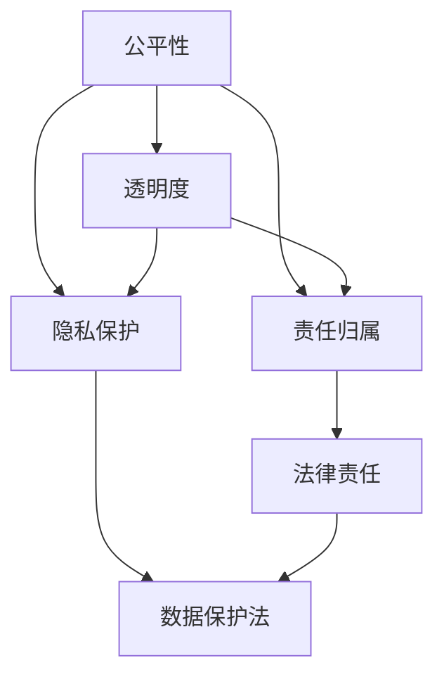
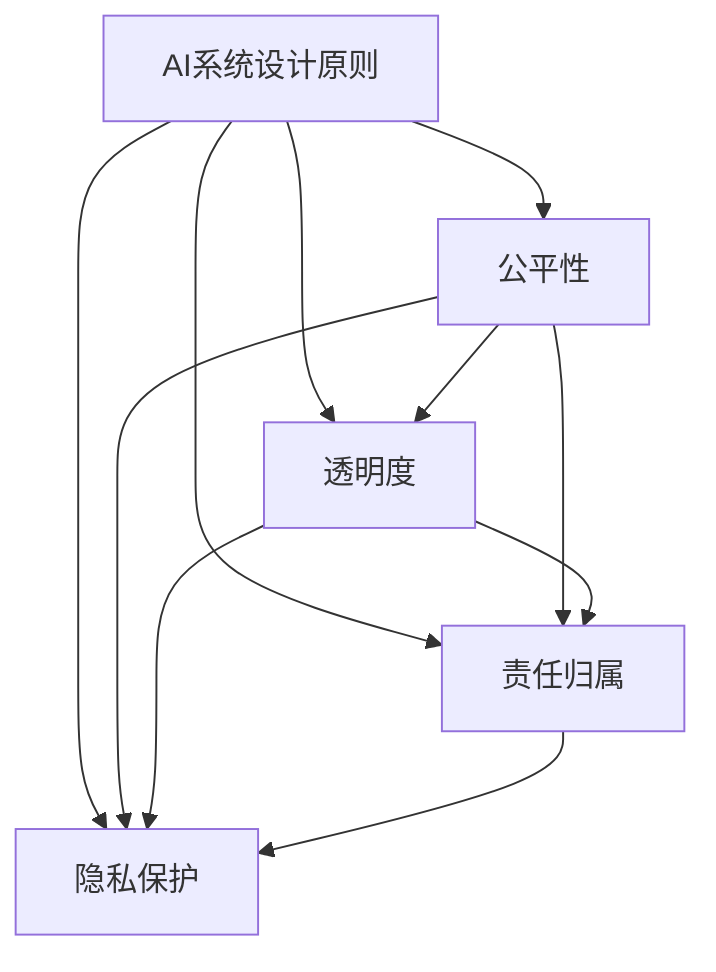
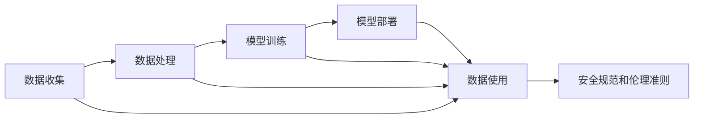

                 

# 制定 AI 安全规范和伦理准则：规范 AI 技术应用

在人工智能（AI）技术日趋普及的今天，如何确保其安全性和伦理性成为了一个至关重要的议题。AI技术的应用涉及隐私保护、公平性、透明性、责任归属等多个方面，制定一套全面的AI安全规范和伦理准则，有助于引导AI技术的健康发展，维护公众利益和社会福祉。本文将详细探讨AI安全规范和伦理准则的核心概念、关键原理和具体操作步骤，以期为AI技术应用提供一套可行的参考框架。

## 1. 背景介绍

### 1.1 问题由来

随着AI技术的快速发展，其在医疗、金融、教育、交通等领域的应用越来越广泛，其影响力也随之增大。然而，AI技术的不透明性、黑箱特性等特性，也引发了一系列安全性和伦理问题，如数据隐私泄露、算法偏见、对社会造成误导等。这些问题不仅影响了AI技术的应用效果，还可能对社会的稳定和公平带来威胁。因此，制定一套完善的AI安全规范和伦理准则，成为当前亟待解决的问题。

### 1.2 问题核心关键点

AI安全规范和伦理准则的核心在于确保AI技术的公平性、透明性、责任归属和隐私保护。其核心内容包括以下几个方面：

- **公平性**：确保AI技术对所有用户公平，避免因种族、性别、年龄等因素导致的偏见。
- **透明性**：要求AI系统可解释，用户能够理解其决策过程和依据。
- **责任归属**：明确AI系统在运行过程中造成的损害，确定责任归属。
- **隐私保护**：保护用户数据隐私，防止数据泄露和滥用。

## 2. 核心概念与联系

### 2.1 核心概念概述

为更好地理解AI安全规范和伦理准则，本节将介绍几个密切相关的核心概念：

- **公平性**：指AI系统在处理数据和决策时，对所有用户或群体一视同仁，不因任何歧视性因素而偏袒或歧视特定群体。
- **透明性**：指AI系统在运行过程中，用户能够理解其决策过程、依据和结果，且系统能够提供可解释的输出。
- **责任归属**：指当AI系统在运行过程中造成损害时，明确责任承担主体，确保用户权益得到保障。
- **隐私保护**：指AI系统在收集、存储和使用用户数据时，遵守相关法律法规，保护用户隐私，防止数据泄露和滥用。

这些概念之间的逻辑关系可以通过以下Mermaid流程图来展示：



这个流程图展示了几大核心概念之间的关系：

1. 公平性要求AI系统不因任何歧视性因素而偏袒或歧视特定群体。
2. 透明度要求AI系统可解释，且用户能够理解其决策过程和依据。
3. 责任归属明确AI系统在运行过程中造成的损害的责任承担主体。
4. 隐私保护在收集、存储和使用用户数据时，遵守相关法律法规，保护用户隐私。

### 2.2 概念间的关系

这些核心概念之间存在着紧密的联系，形成了AI安全规范和伦理准则的整体生态系统。下面我们通过几个Mermaid流程图来展示这些概念之间的关系。

#### 2.2.1 AI系统的设计原则



这个流程图展示了AI系统设计原则与公平性、透明度、责任归属和隐私保护之间的关系。AI系统设计原则旨在确保AI系统在设计时就考虑了这些核心概念，从而在运行过程中自然满足相应的要求。

#### 2.2.2 AI系统的操作流程



这个流程图展示了AI系统从数据收集到模型部署的操作流程，并强调了在整个流程中应遵守安全规范和伦理准则的重要性。

## 3. 核心算法原理 & 具体操作步骤

### 3.1 算法原理概述

AI安全规范和伦理准则的制定和实施，基于以下几个核心算法原理：

- **公平性算法**：确保数据集和算法在训练过程中对所有群体的覆盖公平，避免因数据不均衡导致的偏见。
- **透明性算法**：通过可解释的模型和输出，让用户能够理解AI系统的决策过程和依据。
- **责任归属算法**：明确AI系统在运行过程中造成的损害，确保责任归属清晰明确。
- **隐私保护算法**：使用加密、去标识化等技术手段，保护用户数据隐私。

### 3.2 算法步骤详解

AI安全规范和伦理准则的制定和实施，大致分为以下几个步骤：

1. **需求分析和目标制定**：明确AI系统的应用场景和目标，确定需要遵守的规范和准则。
2. **数据收集和处理**：确保数据集和处理过程对所有群体公平，遵守隐私保护要求。
3. **模型训练和验证**：采用公平性算法和透明性算法，训练和验证AI模型。
4. **模型部署和测试**：在部署过程中，确保透明度和责任归属清晰，进行严格测试。
5. **持续监控和改进**：对AI系统进行持续监控，根据反馈和改进建议，不断优化模型和规范。

### 3.3 算法优缺点

AI安全规范和伦理准则的制定和实施，具有以下优点：

- **提升AI系统的可信度**：通过遵循规范和准则，提升了AI系统的透明度和公平性，增强了用户信任。
- **减少法律风险**：明确了AI系统的责任归属，减少了因系统错误而引发的法律风险。
- **保护用户隐私**：通过隐私保护算法，保护用户数据隐私，防止数据滥用。

同时，这些规范和准则也存在一些局限性：

- **执行难度大**：在实际操作中，确保每个环节都符合规范和准则，需要较高的执行难度。
- **成本高**：遵循规范和准则，可能会增加系统的开发和维护成本。
- **复杂度高**：制定和实施规范和准则，需要深入理解不同领域的法律和伦理要求，存在一定的复杂性。

### 3.4 算法应用领域

AI安全规范和伦理准则在以下领域得到了广泛应用：

- **医疗领域**：确保AI系统在诊断和治疗过程中对所有群体公平，保护患者隐私。
- **金融领域**：确保AI系统在贷款、保险等金融决策中不因性别、年龄等因素产生歧视，保护用户隐私。
- **教育领域**：确保AI系统在教育资源分配和个性化推荐中公平，保护学生隐私。
- **公共安全领域**：确保AI系统在安全监测和预警中对所有群体公平，保护公民隐私。

## 4. 数学模型和公式 & 详细讲解 & 举例说明

### 4.1 数学模型构建

本节将使用数学语言对AI安全规范和伦理准则的制定和实施过程进行更加严格的刻画。

设AI系统的输入数据集为 $D$，输出模型为 $M$，目标为 $T$。假设AI系统在处理数据和决策时，需满足公平性、透明度、责任归属和隐私保护的要求。则AI系统需满足以下约束条件：

$$
\begin{align*}
C_1 & : \text{公平性约束} \\
C_2 & : \text{透明度约束} \\
C_3 & : \text{责任归属约束} \\
C_4 & : \text{隐私保护约束}
\end{align*}
$$

### 4.2 公式推导过程

以下我们以公平性约束为例，推导公平性算法的数学公式。

假设AI系统在处理数据时，存在两种类型的用户群体，分别为 $A$ 和 $B$。系统在处理数据和决策时，需对 $A$ 和 $B$ 两个群体公平，即在训练数据和输出中，$A$ 和 $B$ 的分布应相同。

设训练数据中 $A$ 和 $B$ 的比例分别为 $p_A$ 和 $p_B$，则公平性约束可表示为：

$$
\begin{align*}
\min_{D} & : \sum_{i=1}^n |p_A - p_B|
\end{align*}
$$

其中 $n$ 为训练数据集的大小。

### 4.3 案例分析与讲解

假设一个医疗诊断AI系统，在处理某疾病的诊断数据时，需要对所有性别公平。在训练数据中，男性和女性的比例分别为 $p_{A=男}$ 和 $p_{A=女}$。在输出中，系统需对男性和女性公平，即在诊断结果中，男性和女性的患病概率应相同。

则公平性约束可表示为：

$$
\begin{align*}
\min_{D} & : |p_{A=男} - p_{A=女}|
\end{align*}
$$

在实际应用中，可以通过平衡数据集和调整模型参数，满足公平性约束。例如，可以通过数据增强、重采样等技术，确保训练数据中 $A$ 和 $B$ 两个群体的分布平衡。

## 5. 项目实践：代码实例和详细解释说明

### 5.1 开发环境搭建

在进行AI安全规范和伦理准则的实践前，我们需要准备好开发环境。以下是使用Python进行TensorFlow开发的环境配置流程：

1. 安装Anaconda：从官网下载并安装Anaconda，用于创建独立的Python环境。

2. 创建并激活虚拟环境：
```bash
conda create -n tf-env python=3.8 
conda activate tf-env
```

3. 安装TensorFlow：根据CUDA版本，从官网获取对应的安装命令。例如：
```bash
conda install tensorflow==2.7 -c tf
```

4. 安装Keras和TensorBoard：
```bash
pip install keras tensorflow-addons tensorboard
```

5. 安装Pandas和Numpy：
```bash
pip install pandas numpy
```

完成上述步骤后，即可在`tf-env`环境中开始开发实践。

### 5.2 源代码详细实现

这里我们以公平性约束为例，展示使用TensorFlow实现公平性算法的过程。

首先，定义公平性约束的数学公式：

```python
import tensorflow as tf
import numpy as np

def fair_constraint(p_a, p_b):
    return tf.reduce_mean(tf.abs(p_a - p_b))
```

然后，在模型训练过程中，通过平衡数据集和调整模型参数，满足公平性约束。例如，在训练数据中，对 $A$ 和 $B$ 两个群体进行重采样：

```python
class FairnessSampling(tf.keras.layers.Layer):
    def __init__(self, ratio=1):
        super(FairnessSampling, self).__init__()
        self.ratio = ratio
    
    def call(self, inputs):
        a, b = inputs
        a_size = tf.shape(a)[0]
        b_size = tf.shape(b)[0]
        a_ratio = a_size / (a_size + b_size)
        b_ratio = b_size / (a_size + b_size)
        a_sample = tf.random.shuffle(a)[:int(a_size * self.ratio)]
        b_sample = tf.random.shuffle(b)[:int(b_size * self.ratio)]
        return a_sample, b_sample

model = tf.keras.Sequential([
    FairnessSampling(),
    tf.keras.layers.Dense(64, activation='relu'),
    tf.keras.layers.Dense(1, activation='sigmoid')
])
```

最后，在模型评估过程中，使用TensorBoard进行可视化：

```python
from tensorflow.keras.callbacks import TensorBoard
import os

log_dir = "logs/fit/" + datetime.datetime.now().strftime("%Y%m%d-%H%M%S")
tensorboard_callback = TensorBoard(log_dir=log_dir)

model.compile(optimizer='adam', loss='binary_crossentropy')
model.fit(x_train, y_train, epochs=100, validation_data=(x_val, y_val), callbacks=[tensorboard_callback])
```

以上代码展示了如何使用TensorFlow实现公平性约束的过程。可以看到，通过公平性采样层和模型训练，可以平衡数据集，确保模型在处理数据和决策时对所有群体公平。

### 5.3 代码解读与分析

让我们再详细解读一下关键代码的实现细节：

**FairnessSampling类**：
- `__init__`方法：初始化公平性采样的比例。
- `call`方法：对输入的 $A$ 和 $B$ 两个群体进行采样，确保采样比例相同。

**模型训练**：
- 使用TensorFlow的Sequential模型，将公平性采样层和神经网络层组合。
- 通过公平性采样层，平衡数据集，确保模型在处理数据和决策时对所有群体公平。
- 使用TensorBoard进行可视化，实时监测训练过程和模型性能。

**模型评估**：
- 在模型训练过程中，使用TensorBoard进行可视化，实时监测模型性能。
- 通过公平性采样层，确保模型在处理数据和决策时对所有群体公平。

## 6. 实际应用场景

### 6.1 智能医疗诊断

智能医疗诊断系统需要确保对所有患者公平，避免因性别、年龄等因素导致的偏见。通过遵循公平性、透明度和隐私保护规范和准则，医疗诊断系统能够提供更公平、更透明和更安全的诊断服务。

### 6.2 金融贷款审批

金融贷款审批系统需确保对所有申请人公平，避免因性别、年龄等因素导致的歧视。通过遵循公平性、透明度和责任归属规范和准则，贷款审批系统能够更公正地评估申请人的信用风险，保护用户权益。

### 6.3 教育个性化推荐

教育个性化推荐系统需确保对所有学生公平，避免因性别、年龄等因素导致的偏见。通过遵循公平性、透明度和隐私保护规范和准则，推荐系统能够更公平地为学生推荐个性化学习资源，提升教育效果。

### 6.4 未来应用展望

未来，AI安全规范和伦理准则将更加全面、严格，涵盖更多领域和应用场景。例如：

- **环境保护领域**：确保AI系统在处理环境数据时，对所有群体公平，保护环境数据隐私。
- **公共安全领域**：确保AI系统在安全监测和预警中对所有群体公平，保护公民隐私。
- **社会治理领域**：确保AI系统在社会治理中对所有群体公平，保护公民隐私。

## 7. 工具和资源推荐

### 7.1 学习资源推荐

为了帮助开发者系统掌握AI安全规范和伦理准则的理论基础和实践技巧，这里推荐一些优质的学习资源：

1. **《人工智能伦理与安全》**：斯坦福大学开设的课程，全面介绍了AI伦理与安全的基本概念和前沿技术。
2. **《AI系统设计指南》**：谷歌开发的AI系统设计指南，涵盖AI系统设计原则和最佳实践。
3. **《AI伦理与安全手册》**：知名AI研究机构发布的手册，详细介绍了AI伦理与安全的法律法规和技术规范。
4. **《AI伦理与隐私保护》**：IEEE发布的伦理与安全指南，涵盖AI伦理与隐私保护的理论和实践。
5. **《AI伦理与安全研究综述》**：学术期刊上的综述文章，总结了当前AI伦理与安全的研究成果和热点问题。

通过这些资源的学习实践，相信你一定能够快速掌握AI安全规范和伦理准则的精髓，并用于解决实际的AI技术应用问题。

### 7.2 开发工具推荐

高效的开发离不开优秀的工具支持。以下是几款用于AI安全规范和伦理准则开发的常用工具：

1. **TensorFlow**：基于Python的开源深度学习框架，支持灵活的模型定义和优化。
2. **Keras**：TensorFlow的高层API，简化了模型定义和训练过程。
3. **TensorBoard**：TensorFlow的可视化工具，支持模型训练和性能监测。
4. **ModelScope**：AI模型和算法社区，提供了丰富的AI模型和应用案例。
5. **AutoML**：自动化机器学习平台，支持模型选择和优化。

合理利用这些工具，可以显著提升AI安全规范和伦理准则的开发效率，加快创新迭代的步伐。

### 7.3 相关论文推荐

AI安全规范和伦理准则的发展源于学界的持续研究。以下是几篇奠基性的相关论文，推荐阅读：

1. **《公平机器学习：理论与实践》**：讨论了公平机器学习的基本概念和算法。
2. **《透明机器学习：模型解释与可视化》**：探讨了机器学习模型的可解释性和可视化方法。
3. **《AI系统设计原则与实践》**：介绍了AI系统设计原则和最佳实践，涵盖公平性、透明度和隐私保护等方面。
4. **《AI伦理与安全评估》**：评估了AI系统在伦理和安全性方面的表现，提出了改进建议。
5. **《AI伦理与安全研究综述》**：总结了当前AI伦理与安全的研究成果和热点问题，指出了未来的研究方向。

这些论文代表了大规模AI安全规范和伦理准则的发展脉络。通过学习这些前沿成果，可以帮助研究者把握学科前进方向，激发更多的创新灵感。

除上述资源外，还有一些值得关注的前沿资源，帮助开发者紧跟AI安全规范和伦理准则技术的最新进展，例如：

1. **arXiv论文预印本**：人工智能领域最新研究成果的发布平台，包括大量尚未发表的前沿工作，学习前沿技术的必读资源。
2. **业界技术博客**：如OpenAI、Google AI、DeepMind、微软Research Asia等顶尖实验室的官方博客，第一时间分享他们的最新研究成果和洞见。
3. **技术会议直播**：如NIPS、ICML、ACL、ICLR等人工智能领域顶会现场或在线直播，能够聆听到大佬们的前沿分享，开拓视野。
4. **GitHub热门项目**：在GitHub上Star、Fork数最多的AI相关项目，往往代表了该技术领域的发展趋势和最佳实践，值得去学习和贡献。
5. **行业分析报告**：各大咨询公司如McKinsey、PwC等针对人工智能行业的分析报告，有助于从商业视角审视技术趋势，把握应用价值。

总之，对于AI安全规范和伦理准则的学习和实践，需要开发者保持开放的心态和持续学习的意愿。多关注前沿资讯，多动手实践，多思考总结，必将收获满满的成长收益。

## 8. 总结：未来发展趋势与挑战

### 8.1 总结

本文对AI安全规范和伦理准则的制定和实施过程进行了全面系统的介绍。首先阐述了AI安全规范和伦理准则的研究背景和意义，明确了其在确保AI技术应用中的公平性、透明性、责任归属和隐私保护方面的独特价值。其次，从原理到实践，详细讲解了公平性算法、透明性算法、责任归属算法和隐私保护算法的核心原理和具体操作步骤，提供了公平性约束、透明度约束、责任归属约束和隐私保护约束的数学公式和推导过程。最后，通过项目实践和实际应用场景，展示了AI安全规范和伦理准则的广泛应用，强调了其在未来AI技术发展中的重要性。

通过本文的系统梳理，可以看到，AI安全规范和伦理准则在确保AI技术应用中的公平性、透明性、责任归属和隐私保护方面具有重要作用，对AI技术的健康发展具有重要意义。未来，随着AI技术的进一步普及和应用，制定和实施AI安全规范和伦理准则将变得更加重要，这将有助于引导AI技术走向更加公平、透明和可信的未来。

### 8.2 未来发展趋势

展望未来，AI安全规范和伦理准则将呈现以下几个发展趋势：

1. **法规合规性增强**：随着AI技术的普及，政府和监管机构将更加重视AI技术的伦理和安全问题，制定更加严格和完善的法规和规范。
2. **跨领域应用普及**：AI安全规范和伦理准则将逐步应用于更多领域和行业，涵盖医疗、金融、教育、交通等多个领域。
3. **技术标准统一**：AI安全规范和伦理准则将逐步实现标准化和统一化，形成行业共识和国际标准。
4. **技术创新推动**：随着AI技术的不断创新，新的算法和模型将涌现，推动AI安全规范和伦理准则的进步。
5. **公众参与度提升**：公众对AI技术应用的关注度将不断提高，参与度也将不断提升，有助于形成更加民主和透明的规范和准则。

### 8.3 面临的挑战

尽管AI安全规范和伦理准则已经取得了一定进展，但在迈向更加智能化、普适化应用的过程中，仍面临诸多挑战：

1. **执行难度大**：在实际操作中，确保每个环节都符合规范和准则，需要较高的执行难度。
2. **成本高**：遵循规范和准则，可能会增加系统的开发和维护成本。
3. **复杂度高**：制定和实施规范和准则，需要深入理解不同领域的法律和伦理要求，存在一定的复杂性。
4. **法律风险**：在AI技术应用中，存在一定的法律风险，需要制定相应的应对策略。
5. **技术局限**：当前的技术手段和工具，可能无法完全满足规范和准则的要求，需要进一步改进和完善。

### 8.4 研究展望

面对AI安全规范和伦理准则所面临的挑战，未来的研究需要在以下几个方面寻求新的突破：

1. **法规和标准制定**：制定更加全面、严格和可执行的法规和标准，确保AI技术在应用中的安全和伦理。
2. **技术手段改进**：开发更加高效、可靠的技术手段，确保AI技术在应用中遵循规范和准则。
3. **跨学科合作**：推动法律、伦理、社会学等多学科的合作，形成更加全面、系统的规范和准则。
4. **公众参与机制**：建立公众参与机制，增强公众对AI技术应用的监督和反馈，提升规范和准则的民主性和透明度。
5. **国际合作**：推动国际合作，形成全球统一的规范和准则，促进AI技术的全球化应用。

这些研究方向的探索，必将引领AI安全规范和伦理准则技术迈向更高的台阶，为构建安全、可靠、可解释、可控的智能系统铺平道路。面向未来，AI安全规范和伦理准则还需要与其他人工智能技术进行更深入的融合，如知识表示、因果推理、强化学习等，多路径协同发力，共同推动自然语言理解和智能交互系统的进步。只有勇于创新、敢于突破，才能不断拓展AI技术应用的边界，让智能技术更好地造福人类社会。

## 9. 附录：常见问题与解答

**Q1：AI安全规范和伦理准则是否适用于所有AI技术应用？**

A: AI安全规范和伦理准则在大多数AI技术应用中都能取得不错的效果，特别是对于涉及隐私、公平性和透明性的应用场景。但对于一些特殊领域的应用，如军事、国家安全等，可能受到法律和政策限制，不能完全适用。

**Q2：制定AI安全规范和伦理准则的流程是什么？**

A: 制定AI安全规范和伦理准则的流程大致包括需求分析、目标制定、数据收集与处理、模型训练与验证、模型部署与测试、持续监控与改进等步骤。

**Q3：如何确保AI系统的公平性？**

A: 确保AI系统的公平性，需要从数据采集、数据处理和模型训练等环节进行全面优化。例如，可以通过数据增强、重采样等技术，确保训练数据中不同群体的分布平衡。

**Q4：如何提升AI系统的透明度？**

A: 提升AI系统的透明度，需要开发可解释的模型和输出。例如，可以使用模型蒸馏、决策树等方法，将复杂模型转换为可解释的形式。

**Q5：如何确保AI系统的责任归属？**

A: 确保AI系统的责任归属，需要明确责任承担主体。例如，在医疗诊断中，诊断结果的责任可以归属于医生和AI系统，医生承担主要责任，AI系统在一定程度内承担辅助责任。

**Q6：AI安全规范和伦理准则在实际应用中需要注意哪些问题？**

A: 在实际应用中，AI安全规范和伦理准则需要注意以下问题：
1. 数据隐私保护：确保用户数据隐私，防止数据泄露和滥用。
2. 模型透明度：确保模型决策过程透明，用户能够理解其依据和结果。
3. 责任归属：明确AI系统在运行过程中造成的损害，确保责任归属清晰明确。
4. 法律合规性：确保AI系统遵守相关法律法规，避免法律风险。

这些问题的解决，需要多方协作，共同推进AI技术的健康发展。

