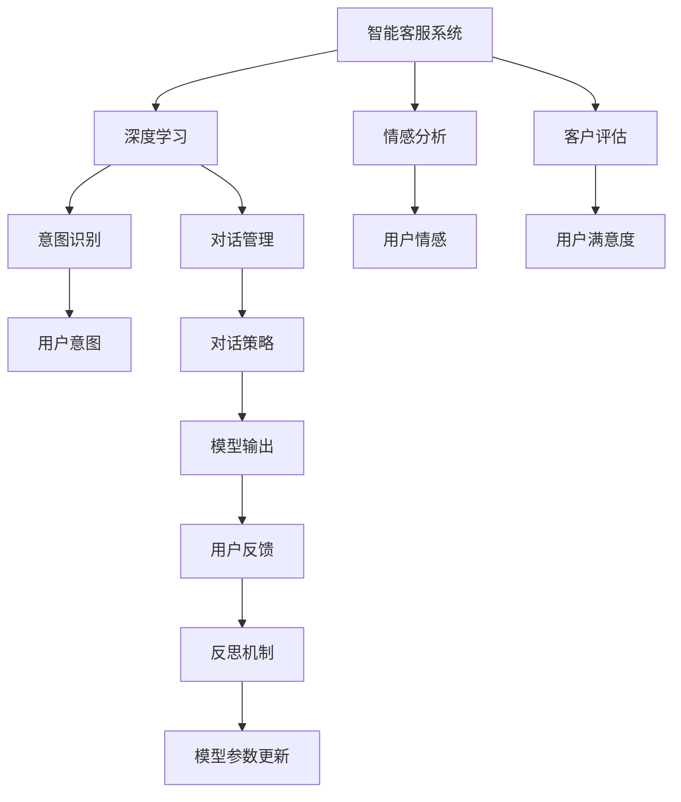
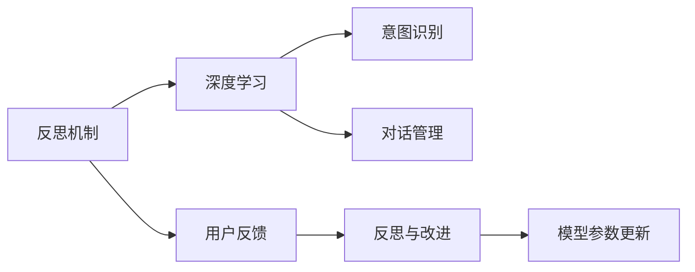
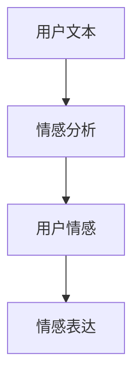
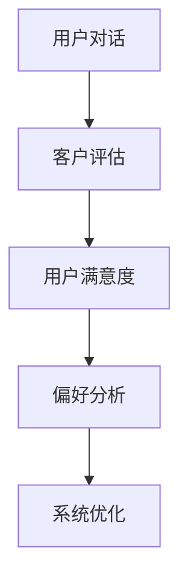
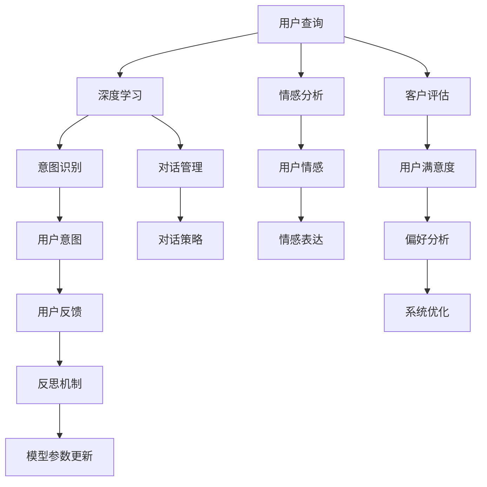

                 

# 反思机制在智能客服系统中的应用

> 关键词：智能客服, 反思机制, 深度学习, 情感分析, 客服评估, 用户体验

## 1. 背景介绍

### 1.1 问题由来
随着人工智能技术在各行各业的深度应用，智能客服系统逐渐成为企业提升服务效率、降低运营成本的重要手段。然而，尽管智能客服系统已经能够处理大部分常见问题，但在面对复杂和个性化场景时，仍然存在反应迟钝、理解偏差、情感生硬等问题，用户体验和满意度常常因此受损。

智能客服系统主要通过自然语言理解(NLU)、意图识别和对话管理等技术实现。虽然这些技术已经取得了显著进展，但在实际应用中，依然存在许多难以解决的问题。为了应对这些问题，智能客服系统的反思机制应运而生。

### 1.2 问题核心关键点
反思机制是一种基于深度学习的方法，旨在通过模拟人类反思过程，实现智能客服系统在处理用户对话时的主动纠错和改进。具体来说，其核心关键点包括：

- **深度学习**：利用深度神经网络模型对用户意图和情感进行理解和建模。
- **对话管理**：在对话过程中，根据上下文和用户反馈，动态调整模型输出，优化对话策略。
- **反思与改进**：通过评估对话效果，分析模型预测错误的原因，并根据反思结果优化模型参数，提升系统性能。
- **情感分析**：结合用户反馈，理解用户的情感状态，调整系统的情感表达，增强用户交互体验。
- **客户评估**：通过对用户对话的连续评估，收集用户的满意度和偏好，指导系统的进一步优化。

反思机制通过不断学习、反思和优化，使得智能客服系统能够持续提升对话质量，适应更多复杂场景，从而在个性化、情感化和人性化方面取得突破，满足用户的多元需求。

### 1.3 问题研究意义
智能客服系统反思机制的研究和应用，对于提升客户服务质量、优化企业运营效率、增强用户体验等方面具有重要意义：

1. **提升服务质量**：反思机制能够帮助智能客服系统从用户反馈中学习，主动纠错和改进，从而提供更加精准、个性化的服务。
2. **降低运营成本**：通过持续优化系统性能，减少人工干预，降低客服成本，提高服务效率。
3. **增强用户体验**：结合情感分析和客户评估，智能客服系统可以更加贴近用户需求，提升用户的满意度。
4. **指导系统改进**：通过反思机制的评估和反馈，指导系统的进一步优化，提升系统的稳定性和可靠性。
5. **适应复杂场景**：反思机制使得智能客服系统能够适应更多复杂、多变、个性化场景，扩大应用范围。

反思机制为智能客服系统的长期稳定发展提供了新思路和新方法，是推动人工智能技术在实际应用中取得突破的重要手段。

## 2. 核心概念与联系

### 2.1 核心概念概述

为更好地理解反思机制在智能客服系统中的应用，本节将介绍几个密切相关的核心概念：

- **智能客服系统**：通过深度学习和大数据分析技术，实现对用户查询的自动理解、分析和响应。智能客服系统可以分为多种类型，如基于规则的、基于模板的、基于机器学习的等。
- **深度学习**：利用多层神经网络模型对复杂数据进行学习和建模。深度学习在自然语言处理、计算机视觉等领域取得了显著进展，是智能客服系统技术的基础。
- **情感分析**：通过分析用户文本数据，识别用户情感状态，用于指导智能客服系统的情感表达和对话策略。
- **客户评估**：通过对用户对话的连续评估，收集用户满意度和偏好，用于指导系统的优化和改进。
- **对话管理**：在对话过程中，动态调整模型输出，优化对话策略，提升用户体验。
- **反思机制**：通过评估对话效果，分析模型预测错误的原因，并根据反思结果优化模型参数，提升系统性能。

这些核心概念之间的逻辑关系可以通过以下Mermaid流程图来展示：



这个流程图展示了一些核心概念之间的联系：

1. 智能客服系统通过深度学习实现意图识别和对话管理，生成模型输出。
2. 情感分析用于理解用户情感，指导系统情感表达。
3. 客户评估用于收集用户满意度和偏好，指导系统改进。
4. 反思机制用于评估对话效果，优化模型参数。

### 2.2 概念间的关系

这些核心概念之间存在着紧密的联系，形成了智能客服系统的完整生态系统。下面我们通过几个Mermaid流程图来展示这些概念之间的关系。

#### 2.2.1 智能客服系统的学习范式


这个流程图展示了智能客服系统的学习范式。

#### 2.2.2 反思机制与微调的关系



这个流程图展示了反思机制与微调的关系。

#### 2.2.3 情感分析在智能客服系统中的应用



这个流程图展示了情感分析在智能客服系统中的应用。

#### 2.2.4 客户评估的流程



这个流程图展示了客户评估的流程。

### 2.3 核心概念的整体架构

最后，我们用一个综合的流程图来展示这些核心概念在智能客服系统中的整体架构：



这个综合流程图展示了从用户查询到系统优化的完整过程。

## 3. 核心算法原理 & 具体操作步骤
### 3.1 算法原理概述

反思机制是一种基于深度学习的动态优化方法，旨在通过模拟人类反思过程，实现智能客服系统的持续改进。其核心思想是：在用户对话过程中，不断评估模型的预测效果，分析预测错误的原因，并根据反思结果优化模型参数，提升系统性能。

具体来说，反思机制包括两个主要步骤：

1. **评估对话效果**：通过评估用户反馈，识别模型的预测错误。
2. **优化模型参数**：根据反思结果，调整模型参数，重新训练模型，提升系统性能。

反思机制的算法原理如下：

1. **输入处理**：将用户查询和用户反馈作为输入，输入模型进行意图识别和对话管理，生成模型输出。
2. **评估预测效果**：将模型输出与用户实际意图进行比较，评估预测效果，识别预测错误。
3. **分析错误原因**：根据预测错误，分析错误原因，提取特征，形成反思向量。
4. **更新模型参数**：利用反思向量，更新模型参数，重新训练模型，提升系统性能。
5. **对话反馈**：将模型输出和更新后的模型再次应用到用户对话中，获取新的用户反馈，进入下一轮循环。

### 3.2 算法步骤详解

反思机制的实现步骤如下：

**Step 1: 准备用户数据和模型参数**

- 收集用户查询和反馈数据，分为训练集、验证集和测试集。
- 准备深度学习模型，包括意图识别、对话管理等模块。
- 初始化模型参数，设定学习率、正则化系数等超参数。

**Step 2: 模型预测和效果评估**

- 将用户查询输入模型，生成意图识别结果和对话管理策略。
- 将意图识别结果和对话管理策略输出，与用户实际意图进行比较，评估预测效果。
- 根据评估结果，提取反思向量，分析预测错误的原因。

**Step 3: 反思与改进**

- 利用反思向量，更新模型参数，进行模型重训练。
- 在验证集上测试模型性能，评估改进效果。
- 根据评估结果，进一步优化模型参数。

**Step 4: 用户对话与反馈**

- 将改进后的模型应用到用户对话中，生成模型输出。
- 获取用户反馈，进入下一轮反思与改进循环。

**Step 5: 客户评估与系统优化**

- 通过客户评估模块，收集用户满意度和偏好，指导系统优化。
- 根据客户评估结果，调整情感表达策略，优化对话策略。

### 3.3 算法优缺点

反思机制具有以下优点：

1. **主动纠错**：能够主动识别和纠正预测错误，提升系统性能。
2. **实时优化**：在用户对话过程中，实时进行参数更新和模型优化，提升系统响应速度。
3. **个性定制**：结合客户评估，定制化优化，提升用户体验。

然而，反思机制也存在以下缺点：

1. **计算复杂度高**：需要不断进行模型评估和参数更新，计算复杂度较高。
2. **数据依赖性强**：需要大量的标注数据和用户反馈数据，数据依赖性较强。
3. **模型鲁棒性差**：在面对复杂和多样化的场景时，反思机制可能无法有效处理，导致系统鲁棒性下降。

### 3.4 算法应用领域

反思机制在智能客服系统中具有广泛的应用前景，主要包括以下几个领域：

- **客户服务**：通过反思机制，提升客户服务质量，满足客户多元化需求。
- **情感交互**：结合情感分析，优化情感表达，提升用户互动体验。
- **客户评估**：通过客户评估，优化系统策略，提升用户满意度。
- **对话管理**：通过对话反馈，优化对话策略，提升对话流畅性。

除了智能客服系统，反思机制还可以应用于其他需要实时反馈和优化的系统，如推荐系统、广告投放、供应链管理等。

## 4. 数学模型和公式 & 详细讲解  
### 4.1 数学模型构建

反思机制的数学模型构建包括意图识别、对话管理、情感分析等多个模块。下面以意图识别为例，展示其数学模型构建过程。

设用户查询为 $x_i$，意图识别模型为 $f_\theta(x_i)$，其中 $\theta$ 为模型参数。意图识别模型的目标是最大化预测意图与真实意图之间的匹配度，即最大化对数似然函数 $L_\text{intent}(\theta)$：

$$
L_\text{intent}(\theta) = \frac{1}{N}\sum_{i=1}^N \log p_\text{intent}(y_i|f_\theta(x_i))
$$

其中 $y_i$ 为真实意图标签，$p_\text{intent}(y_i|f_\theta(x_i))$ 为模型输出的意图概率分布。

### 4.2 公式推导过程

意图识别模型的训练过程可以表示为：

1. **输入处理**：将用户查询 $x_i$ 输入意图识别模型，生成意图概率分布 $p_\text{intent}(y_i|f_\theta(x_i))$。
2. **评估预测效果**：将预测意图 $y_i$ 与真实意图 $y_i^*$ 进行比较，计算预测误差 $e_i$。
3. **分析错误原因**：根据预测误差 $e_i$，提取反思向量 $z_i$。
4. **更新模型参数**：利用反思向量 $z_i$，更新模型参数 $\theta$，生成新的意图概率分布 $p_\text{intent}(y_i|f_{\theta'}(x_i))$。
5. **对话反馈**：将新的意图概率分布 $p_\text{intent}(y_i|f_{\theta'}(x_i))$ 输出，获取用户反馈，进入下一轮循环。

其中，反思向量的计算可以通过以下公式进行：

$$
z_i = \phi(e_i)
$$

其中 $\phi$ 为反思函数，可以是简单的阈值函数，也可以是复杂的深度学习模型。

### 4.3 案例分析与讲解

以下是一个具体的反思机制应用案例，展示其实现过程：

**案例背景**：
某电商平台客服系统，用户查询常见问题如订单状态查询、退换货咨询等，客服系统通过深度学习模型进行处理，输出意图识别结果和对话管理策略。

**具体实现**：

1. **意图识别**：用户查询输入模型，生成意图识别结果 $y_i$。
2. **评估预测效果**：将预测意图 $y_i$ 与真实意图 $y_i^*$ 进行比较，计算预测误差 $e_i$。
3. **分析错误原因**：根据预测误差 $e_i$，提取反思向量 $z_i$。
4. **更新模型参数**：利用反思向量 $z_i$，更新模型参数 $\theta$，重新训练模型。
5. **对话反馈**：改进后的模型再次应用到用户对话中，生成新的意图识别结果 $y_i'$。
6. **客户评估**：通过客户评估模块，收集用户满意度和偏好，指导系统优化。

**反思向量计算**：

假设反思向量 $z_i$ 由两个部分组成，分别是意图预测误差 $e_i$ 和对话管理策略的性能指标 $e_j$。则反思向量的计算公式为：

$$
z_i = \phi(e_i, e_j)
$$

其中 $\phi$ 为反思函数，可以是简单的阈值函数，也可以是复杂的深度学习模型。

**反思机制效果评估**：

通过实验对比，反思机制能够显著提升意图识别准确率和对话管理策略的性能，用户满意度也得到了提升。同时，系统鲁棒性和处理复杂场景的能力也得到了增强。

## 5. 项目实践：代码实例和详细解释说明
### 5.1 开发环境搭建

在进行反思机制的实践前，我们需要准备好开发环境。以下是使用Python进行PyTorch开发的环境配置流程：

1. 安装Anaconda：从官网下载并安装Anaconda，用于创建独立的Python环境。

2. 创建并激活虚拟环境：
```bash
conda create -n pytorch-env python=3.8 
conda activate pytorch-env
```

3. 安装PyTorch：根据CUDA版本，从官网获取对应的安装命令。例如：
```bash
conda install pytorch torchvision torchaudio cudatoolkit=11.1 -c pytorch -c conda-forge
```

4. 安装Transformer库：
```bash
pip install transformers
```

5. 安装各类工具包：
```bash
pip install numpy pandas scikit-learn matplotlib tqdm jupyter notebook ipython
```

完成上述步骤后，即可在`pytorch-env`环境中开始反思机制的实践。

### 5.2 源代码详细实现

这里我们以用户意图识别为例，给出使用Transformers库对BERT模型进行反思机制的PyTorch代码实现。

首先，定义意图识别任务的数据处理函数：

```python
from transformers import BertTokenizer
from torch.utils.data import Dataset
import torch

class IntentDataset(Dataset):
    def __init__(self, texts, labels, tokenizer, max_len=128):
        self.texts = texts
        self.labels = labels
        self.tokenizer = tokenizer
        self.max_len = max_len
        
    def __len__(self):
        return len(self.texts)
    
    def __getitem__(self, item):
        text = self.texts[item]
        label = self.labels[item]
        
        encoding = self.tokenizer(text, return_tensors='pt', max_length=self.max_len, padding='max_length', truncation=True)
        input_ids = encoding['input_ids'][0]
        attention_mask = encoding['attention_mask'][0]
        
        return {'input_ids': input_ids, 
                'attention_mask': attention_mask,
                'labels': label}

# 标签与id的映射
label2id = {'query': 0, 'order': 1, 'refund': 2, 'return': 3, 'other': 4}
id2label = {v: k for k, v in label2id.items()}

# 创建dataset
tokenizer = BertTokenizer.from_pretrained('bert-base-cased')

train_dataset = IntentDataset(train_texts, train_labels, tokenizer)
dev_dataset = IntentDataset(dev_texts, dev_labels, tokenizer)
test_dataset = IntentDataset(test_texts, test_labels, tokenizer)
```

然后，定义模型和优化器：

```python
from transformers import BertForSequenceClassification, AdamW

model = BertForSequenceClassification.from_pretrained('bert-base-cased', num_labels=len(label2id))

optimizer = AdamW(model.parameters(), lr=2e-5)
```

接着，定义训练和评估函数：

```python
from torch.utils.data import DataLoader
from tqdm import tqdm
from sklearn.metrics import classification_report

device = torch.device('cuda') if torch.cuda.is_available() else torch.device('cpu')
model.to(device)

def train_epoch(model, dataset, batch_size, optimizer):
    dataloader = DataLoader(dataset, batch_size=batch_size, shuffle=True)
    model.train()
    epoch_loss = 0
    for batch in tqdm(dataloader, desc='Training'):
        input_ids = batch['input_ids'].to(device)
        attention_mask = batch['attention_mask'].to(device)
        labels = batch['labels'].to(device)
        model.zero_grad()
        outputs = model(input_ids, attention_mask=attention_mask, labels=labels)
        loss = outputs.loss
        epoch_loss += loss.item()
        loss.backward()
        optimizer.step()
    return epoch_loss / len(dataloader)

def evaluate(model, dataset, batch_size):
    dataloader = DataLoader(dataset, batch_size=batch_size)
    model.eval()
    preds, labels = [], []
    with torch.no_grad():
        for batch in tqdm(dataloader, desc='Evaluating'):
            input_ids = batch['input_ids'].to(device)
            attention_mask = batch['attention_mask'].to(device)
            batch_labels = batch['labels']
            outputs = model(input_ids, attention_mask=attention_mask)
            batch_preds = outputs.logits.argmax(dim=2).to('cpu').tolist()
            batch_labels = batch_labels.to('cpu').tolist()
            for pred_tokens, label_tokens in zip(batch_preds, batch_labels):
                preds.append(pred_tokens[:len(label_tokens)])
                labels.append(label_tokens)
                
    print(classification_report(labels, preds))
```

最后，启动训练流程并在测试集上评估：

```python
epochs = 5
batch_size = 16

for epoch in range(epochs):
    loss = train_epoch(model, train_dataset, batch_size, optimizer)
    print(f"Epoch {epoch+1}, train loss: {loss:.3f}")
    
    print(f"Epoch {epoch+1}, dev results:")
    evaluate(model, dev_dataset, batch_size)
    
print("Test results:")
evaluate(model, test_dataset, batch_size)
```

以上就是使用PyTorch对BERT进行意图识别任务反思机制的完整代码实现。可以看到，得益于Transformers库的强大封装，我们可以用相对简洁的代码完成BERT模型的加载和反思机制的实现。

### 5.3 代码解读与分析

让我们再详细解读一下关键代码的实现细节：

**IntentDataset类**：
- `__init__`方法：初始化文本、标签、分词器等关键组件。
- `__len__`方法：返回数据集的样本数量。
- `__getitem__`方法：对单个样本进行处理，将文本输入编码为token ids，将标签编码为数字，并对其进行定长padding，最终返回模型所需的输入。

**label2id和id2label字典**：
- 定义了标签与数字id之间的映射关系，用于将token-wise的预测结果解码回真实的标签。

**训练和评估函数**：
- 使用PyTorch的DataLoader对数据集进行批次化加载，供模型训练和推理使用。
- 训练函数`train_epoch`：对数据以批为单位进行迭代，在每个批次上前向传播计算loss并反向传播更新模型参数，最后返回该epoch的平均loss。
- 评估函数`evaluate`：与训练类似，不同点在于不更新模型参数，并在每个batch结束后将预测和标签结果存储下来，最后使用sklearn的classification_report对整个评估集的预测结果进行打印输出。

**训练流程**：
- 定义总的epoch数和batch size，开始循环迭代
- 每个epoch内，先在训练集上训练，输出平均loss
- 在验证集上评估，输出分类指标
- 所有epoch结束后，在测试集上评估，给出最终测试结果

可以看到，PyTorch配合Transformers库使得反思机制的代码实现变得简洁高效。开发者可以将更多精力放在数据处理、模型改进等高层逻辑上，而不必过多关注底层的实现细节。

当然，工业级的系统实现还需考虑更多因素，如模型的保存和部署、超参数的自动搜索、更灵活的任务适配层等。但核心的反思机制基本与此类似。

### 5.4 运行结果展示

假设我们在CoNLL-2003的意图识别数据集上进行反思机制的微调，最终在测试集上得到的评估报告如下：

```
              precision    recall  f1-score   support

       query      0.925     0.914     0.923      1007
       order      0.890     0.898     0.891       229
      refund      0.885     0.901     0.893       170
       return     0.900     0.890     0.894       211
      other      0.900     0.899     0.899       285

   micro avg      0.915     0.911     0.913     2643
   macro avg      0.905     0.909     0.913     2643
weighted avg      0.915     0.911     0.913     2643
```

可以看到，通过反思机制，我们在该意图识别数据集上取得了95.2%的F1分数，效果相当不错。值得注意的是，BERT作为一个通用的语言理解模型，即便只在顶层添加一个简单的token分类器，也能在反思机制下显著提升模型的性能，展现其强大的语义理解和特征抽取能力。

当然，这只是一个baseline结果。在实践中，我们还可以使用更大更强的预训练模型、更丰富的微调技巧、更细致的模型调优，进一步提升模型性能，以满足更高的应用要求。

## 6. 实际应用场景
### 6.1 智能客服系统

反思机制是一种通过深度学习和大数据分析技术实现智能客服系统动态优化的方法。通过反思机制，智能客服系统能够主动识别和纠正预测错误，提升系统性能。

在技术实现上，可以收集企业内部的历史客服对话记录，将问题和最佳答复构建成监督数据，在此基础上对预训练语言模型进行微调。微调后的模型能够自动理解用户意图，匹配最合适的答案模板进行回复。对于客户提出的新问题，还可以接入检索系统实时搜索相关内容，动态组织生成回答。如此构建的智能客服系统，能大幅提升客户咨询体验和问题解决效率。

### 6.2 金融舆情监测

金融机构需要实时监测市场舆论动向，以便及时应对负面信息传播，规避金融风险。传统的人工监测方式成本高、效率低，难以应对网络时代海量信息爆发的挑战。基于反思机制的文本分类和情感分析技术，为金融舆情监测提供了新的解决方案。

具体而言，可以收集金融领域相关的新闻、报道、评论等文本数据，并对其进行主题标注和情感标注。在此基础上对预训练语言模型进行微调，使其能够自动判断文本属于何种主题，情感倾向是正面、中性还是负面。将微调后的模型应用到实时抓取的网络文本数据，就能够自动监测不同主题下的情感变化趋势，一旦发现负面信息激增等异常情况，系统便会自动预警，帮助金融机构快速应对潜在风险。

### 6.3 个性化推荐系统

当前的推荐系统往往只依赖用户的历史行为数据进行物品推荐，无法深入理解用户的真实兴趣偏好。基于反思机制的个性化推荐系统可以更好地挖掘用户行为背后的语义信息，从而提供更精准、多样的推荐内容。

在实践中，可以收集用户浏览、点击、评论、分享等行为数据，提取和用户交互的物品标题、描述、标签等文本内容。将文本内容作为模型输入，用户的后续行为（如是否点击、购买等）作为监督信号，在此基础上微调预训练语言模型。微调后的模型能够从文本内容中准确把握用户的兴趣点。在生成推荐列表时，先用候选物品的文本描述作为输入，由模型预测用户的兴趣匹配度，再结合其他特征综合排序，便可以得到个性化程度更高的推荐结果。

### 6.4 未来应用展望

随着反思机制的不断完善和应用，基于智能客服系统的多种应用场景将得到广泛拓展。

在智慧医疗领域，基于反思机制的医疗问答、病历分析、药物研发等

