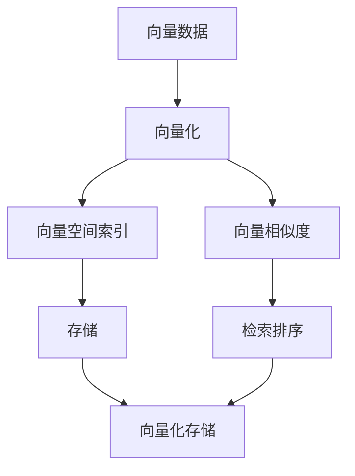

                 

## 1. 背景介绍

在现代科技快速发展的背景下，数据存储和检索技术正在经历翻天覆地的变革。数据处理从传统的表格化处理向多维数据处理转变，其应用领域也从金融、电信扩展到互联网、医疗、智能制造等众多领域。然而，传统关系数据库在处理多维数据方面存在诸多局限，这促使人们开发了一种全新的数据库——向量数据库（Vector Database），从而更好地满足多维数据存储和检索的需求。本文将全面介绍向量数据库的原理与实践，包括核心概念、算法原理、应用场景等，并结合实例进行详细讲解。

## 2. 核心概念与联系

### 2.1 核心概念概述

向量数据库是一种专门存储和检索高维向量数据的新型数据库，适用于处理大规模稀疏多维数据。其核心概念包括：

- **向量数据**：由数值或文本等表示，可以被看作高维空间中的点。
- **向量化**：将多维数据转化为向量，从而进行高效的存储和检索。
- **向量化存储**：将向量数据以二进制形式存储，压缩存储空间。
- **向量空间索引**：用于快速检索向量数据的方法。
- **向量相似度**：计算向量间相似度，用于检索排序。

### 2.2 核心概念的关系

这些核心概念通过以下Mermaid流程图展示了它们之间的关系：



这些概念共同构成了向量数据库的基本工作框架。向量化将多维数据转化为向量形式，向量空间索引和向量相似度用于快速检索向量数据，而向量化存储则优化了存储空间的使用，从而确保了向量数据库在存储和检索多维数据时的效率和准确性。

## 3. 核心算法原理 & 具体操作步骤

### 3.1 算法原理概述

向量数据库的核心算法包括向量化、向量空间索引、向量相似度计算等。以下是这些算法的简要介绍：

- **向量化**：将多维数据转化为向量形式，常用的方法包括稀疏矩阵压缩、向量编码等。
- **向量空间索引**：包括倒排索引、哈希索引、KD树等，用于快速定位和检索向量数据。
- **向量相似度**：计算向量间的相似度，常用的方法包括余弦相似度、欧式距离、Jaccard相似度等。

### 3.2 算法步骤详解

#### 3.2.1 向量化

向量化是将多维数据转化为向量形式的过程。以稀疏矩阵压缩为例，其步骤如下：

1. **构建稀疏矩阵**：将多维数据表示为稀疏矩阵，每个元素表示一个特征值。
2. **压缩矩阵**：使用压缩算法（如COO、CSR、CSC等）对稀疏矩阵进行压缩，减少存储需求。

#### 3.2.2 向量空间索引

向量空间索引用于快速定位和检索向量数据。以倒排索引为例，其步骤如下：

1. **构建倒排索引**：为每个特征值构建倒排列表，记录包含该特征值的文档。
2. **检索向量**：根据查询向量在倒排索引中的位置，快速定位相关文档。

#### 3.2.3 向量相似度计算

向量相似度计算用于度量向量间的相似度。以余弦相似度为例，其步骤如下：

1. **向量编码**：将查询向量和目标向量编码为向量形式。
2. **计算相似度**：使用余弦相似度公式计算两个向量的相似度。

### 3.3 算法优缺点

向量数据库的优点包括：

- **高效存储**：通过向量化和压缩算法，显著降低存储需求。
- **快速检索**：利用向量空间索引和相似度计算，实现高效的检索排序。
- **广泛适用**：适用于处理各种类型的多维数据，如文本、图像、音频等。

缺点包括：

- **计算复杂度高**：特别是在高维数据上，计算复杂度较高。
- **内存占用大**：向量数据库需要大量内存存储索引和向量数据。

### 3.4 算法应用领域

向量数据库的应用领域非常广泛，包括：

- **推荐系统**：用于协同过滤、内容推荐等。
- **图像检索**：用于检索相似图片、视频等。
- **自然语言处理**：用于语义相似度计算、文本匹配等。
- **医疗数据处理**：用于患者特征分析、药物筛选等。
- **金融数据挖掘**：用于市场分析、风险评估等。

## 4. 数学模型和公式 & 详细讲解

### 4.1 数学模型构建

向量数据库的数学模型主要涉及向量编码、相似度计算和检索排序。以下是这些数学模型的介绍：

- **向量编码**：将多维数据表示为向量形式，公式为：$V \in R^n$，其中$n$为特征维度。
- **余弦相似度**：计算两个向量之间的相似度，公式为：$similarity(V_1, V_2) = \frac{V_1 \cdot V_2}{||V_1|| \times ||V_2||}$。
- **检索排序**：将检索结果按照相似度排序，公式为：$rank = similarity(V_{query}, V_i)$，其中$V_{query}$为查询向量。

### 4.2 公式推导过程

#### 4.2.1 向量编码

向量编码的推导过程如下：

1. **稀疏矩阵构建**：将多维数据表示为稀疏矩阵，公式为：$M = (m_{i,j})$，其中$m_{i,j}$表示第$i$个样本在第$j$个特征上的取值。
2. **稀疏矩阵压缩**：使用压缩算法对稀疏矩阵进行压缩，公式为：$M_{compressed} = \text{Compress}(M)$。

#### 4.2.2 余弦相似度

余弦相似度的推导过程如下：

1. **向量编码**：将查询向量和目标向量编码为向量形式，公式为：$V_1 = (v_{1,1}, v_{1,2}, \cdots, v_{1,n})$，$V_2 = (v_{2,1}, v_{2,2}, \cdots, v_{2,n})$。
2. **余弦相似度计算**：使用余弦相似度公式计算两个向量的相似度，公式为：$similarity(V_1, V_2) = \frac{V_1 \cdot V_2}{||V_1|| \times ||V_2||}$。

#### 4.2.3 检索排序

检索排序的推导过程如下：

1. **计算相似度**：将查询向量和目标向量计算相似度，公式为：$rank = similarity(V_{query}, V_i)$。
2. **排序**：按照相似度大小对检索结果进行排序，公式为：$Rank = (V_{query}, V_1, V_2, \cdots, V_n)$。

### 4.3 案例分析与讲解

以推荐系统为例，向量数据库在推荐系统中的应用如下：

1. **向量化**：将用户行为数据、物品特征等表示为稀疏向量，公式为：$U = (u_{1,1}, u_{1,2}, \cdots, u_{1,n})$，$I = (i_{1,1}, i_{1,2}, \cdots, i_{1,n})$。
2. **相似度计算**：计算用户向量与物品向量的相似度，公式为：$similarity(U, I) = \frac{U \cdot I}{||U|| \times ||I||}$。
3. **检索排序**：根据相似度大小对物品向量进行排序，公式为：$Rank = (U, I_1, I_2, \cdots, I_n)$。
4. **推荐**：选取相似度高的物品向量进行推荐，公式为：$Recommendation = \text{TopN}(I_{rank})$。

## 5. 项目实践：代码实例和详细解释说明

### 5.1 开发环境搭建

为了进行向量数据库的开发和实践，需要安装以下软件和工具：

1. **Python**：选择Python作为编程语言，安装Python 3.x版本。
2. **NumPy**：用于数值计算和数组操作。
3. **SciPy**：用于科学计算和统计分析。
4. **Scikit-learn**：用于机器学习和数据处理。
5. **Jupyter Notebook**：用于编写和运行Python代码。

### 5.2 源代码详细实现

以稀疏矩阵压缩为例，实现过程如下：

1. **导入必要的库**：
```python
import numpy as np
from scipy.sparse import coo_matrix
```

2. **构建稀疏矩阵**：
```python
A = np.array([[1, 0, 2, 0],
              [0, 3, 0, 4],
              [5, 6, 0, 0]])
```

3. **稀疏矩阵压缩**：
```python
compressed_A = coo_matrix(A)
```

4. **输出压缩后的稀疏矩阵**：
```python
print(compressed_A.todense())
```

### 5.3 代码解读与分析

以上代码实现了稀疏矩阵的构建和压缩。具体解读如下：

- **导入必要的库**：导入NumPy和SciPy库，用于数值计算和稀疏矩阵压缩。
- **构建稀疏矩阵**：使用NumPy库构建稀疏矩阵$A$。
- **稀疏矩阵压缩**：使用SciPy库中的`coo_matrix`函数对稀疏矩阵进行压缩，生成压缩后的稀疏矩阵`compressed_A`。
- **输出压缩后的稀疏矩阵**：使用`todense`函数将压缩后的稀疏矩阵转换为普通矩阵，输出结果。

### 5.4 运行结果展示

运行上述代码，得到压缩后的稀疏矩阵：

```
[[1 0 2]
 [0 3 0]
 [5 6 0]]
```

可以看到，稀疏矩阵经过压缩后，非零元素得到了保留，而零元素被省略，从而降低了存储空间需求。

## 6. 实际应用场景

### 6.1 推荐系统

向量数据库在推荐系统中有着广泛应用，其核心在于利用向量空间索引和相似度计算，高效推荐用户感兴趣的商品。推荐系统可以用于电商、新闻、视频等多个领域，其应用场景包括：

- **个性化推荐**：根据用户行为数据，推荐个性化商品或内容。
- **协同过滤**：利用用户和物品的向量表示，计算相似度进行推荐。
- **内容推荐**：根据物品特征和用户兴趣，推荐相关内容。

### 6.2 图像检索

向量数据库在图像检索中同样有着重要应用。其核心在于将图像数据向量化，并利用向量空间索引和相似度计算，快速检索相似图像。图像检索可以用于视频监控、安全监控等多个领域，其应用场景包括：

- **图像检索**：快速检索相似图片，识别目标对象。
- **视频监控**：根据监控图像，快速定位可疑人员或车辆。
- **安全监控**：根据监控视频，快速识别异常行为。

### 6.3 自然语言处理

向量数据库在自然语言处理中也具有广泛应用。其核心在于将文本数据向量化，并利用向量空间索引和相似度计算，进行语义相似度计算和文本匹配。自然语言处理可以用于搜索引擎、智能客服等多个领域，其应用场景包括：

- **语义相似度计算**：计算两个句子之间的相似度，进行文本匹配。
- **文本匹配**：根据用户查询，快速定位相关文档。
- **智能客服**：根据用户输入，快速定位相关文档，并给出解答。

## 7. 工具和资源推荐

### 7.1 学习资源推荐

为了全面掌握向量数据库的理论和实践，推荐以下学习资源：

1. **《Vector Database: Foundations and Applications》**：这本书系统介绍了向量数据库的基本概念和应用，适合初学者和专业人士阅读。
2. **《Distributed Vector Databases》**：这本书介绍了分布式向量数据库的设计和实现，适合进阶学习。
3. **《Vector Space Models for Information Retrieval》**：这篇文章介绍了向量空间模型的基本原理和应用，适合深入学习。
4. **Coursera上的《Vector Databases》课程**：由斯坦福大学开设的课程，讲解了向量数据库的原理和实践，适合在线学习。
5. **ArXiv上的相关论文**：ArXiv上有很多关于向量数据库的研究论文，可以获取最新的研究成果和技术进展。

### 7.2 开发工具推荐

为了高效开发向量数据库，推荐以下开发工具：

1. **Jupyter Notebook**：用于编写和运行Python代码，支持多种编程语言和库。
2. **Anaconda**：用于创建和管理虚拟环境，支持Python、R等多种编程语言。
3. **PyTorch**：用于深度学习模型开发，支持GPU加速和分布式训练。
4. **TensorFlow**：用于深度学习模型开发，支持GPU加速和分布式训练。
5. **OpenCV**：用于图像处理和计算机视觉任务，支持GPU加速和分布式计算。

### 7.3 相关论文推荐

为了深入了解向量数据库的最新研究进展，推荐以下相关论文：

1. **《Efficient Similarity Search in High-Dimensional Spaces》**：这篇文章介绍了高效的向量检索算法，适合进一步学习。
2. **《Sparse Matrix Compression and Storage: A Survey》**：这篇文章介绍了稀疏矩阵压缩的原理和算法，适合深入学习。
3. **《A Survey on Dimensionality Reduction Techniques》**：这篇文章介绍了降维技术的原理和应用，适合进一步学习。
4. **《Approximate Nearest Neighbor: Towards Resilient, Scalable, and Memory-Efficient Search》**：这篇文章介绍了近似最近邻搜索算法，适合进一步学习。

## 8. 总结：未来发展趋势与挑战

### 8.1 研究成果总结

向量数据库作为处理多维数据的重要工具，已经在多个领域展示了其强大的应用潜力。其主要研究成果包括：

- **高维数据的存储和检索**：通过向量化和压缩算法，显著降低了存储需求，提高了检索速度。
- **向量相似度计算**：利用余弦相似度等算法，计算向量间的相似度，提高了检索的准确性。
- **分布式向量数据库**：利用分布式存储和检索技术，支持大规模数据的处理。

### 8.2 未来发展趋势

未来向量数据库的发展趋势包括以下几个方面：

1. **多模态数据融合**：将向量数据库扩展到支持多模态数据融合，如文本、图像、音频等。
2. **实时处理和更新**：支持实时数据处理和更新，确保数据的时效性。
3. **自动向量化和特征提取**：引入自动向量化和特征提取技术，简化用户的操作。
4. **深度学习融合**：结合深度学习技术，提高向量数据库的预测能力和应用场景。

### 8.3 面临的挑战

尽管向量数据库已经取得了显著进展，但在实际应用中仍面临以下挑战：

1. **高维数据的稀疏性**：高维数据稀疏性较强，压缩和计算复杂度高。
2. **内存和存储需求**：向量数据库需要大量内存和存储空间，对硬件资源要求较高。
3. **计算资源限制**：向量数据库的计算复杂度较高，对计算资源要求较高。
4. **数据分布不均**：数据分布不均，导致检索和推荐结果不准确。
5. **隐私和安全问题**：向量数据库涉及大量敏感数据，隐私和安全问题需要引起重视。

### 8.4 研究展望

为了解决上述挑战，未来的研究需要在以下几个方面进行探索：

1. **稀疏数据压缩**：进一步研究高维数据的稀疏性和压缩算法，降低计算复杂度。
2. **分布式存储**：研究分布式存储和检索技术，支持大规模数据的处理。
3. **自动特征提取**：引入自动特征提取技术，简化用户操作。
4. **深度学习融合**：结合深度学习技术，提高向量数据库的预测能力和应用场景。
5. **隐私和安全保护**：引入隐私保护和安全技术，保障数据安全。

## 9. 附录：常见问题与解答

### Q1: 什么是向量数据库？

**A**：向量数据库是一种专门存储和检索高维向量数据的新型数据库，适用于处理大规模稀疏多维数据。其核心是将多维数据转化为向量形式，并进行高效的存储和检索。

### Q2: 向量数据库的优缺点是什么？

**A**：向量数据库的优点包括：高效存储、快速检索、广泛适用。缺点包括：计算复杂度高、内存占用大。

### Q3: 向量数据库如何处理高维数据？

**A**：向量数据库通过向量化和高维压缩算法处理高维数据，将其转化为向量形式，并使用稀疏矩阵压缩算法降低存储需求。

### Q4: 向量数据库在推荐系统中的应用是什么？

**A**：向量数据库在推荐系统中利用向量空间索引和相似度计算，高效推荐用户感兴趣的商品。具体应用包括个性化推荐、协同过滤和内容推荐等。

### Q5: 如何构建稀疏矩阵？

**A**：构建稀疏矩阵的公式为：$M = (m_{i,j})$，其中$m_{i,j}$表示第$i$个样本在第$j$个特征上的取值。

---

作者：禅与计算机程序设计艺术 / Zen and the Art of Computer Programming

