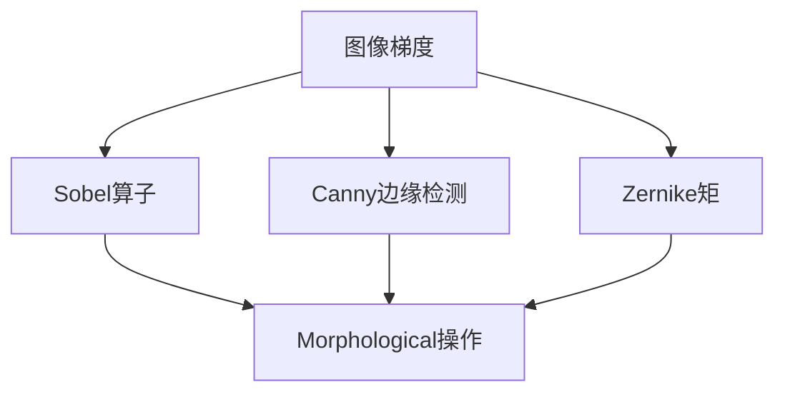
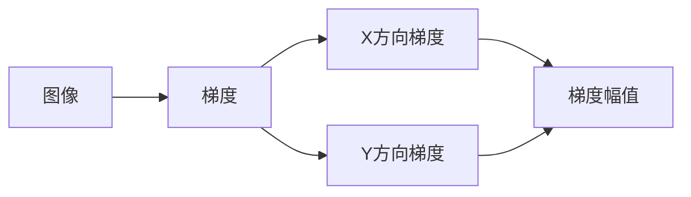
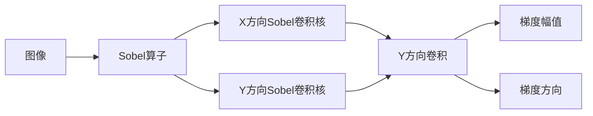
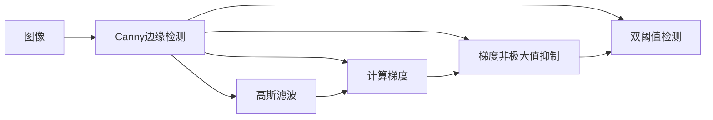
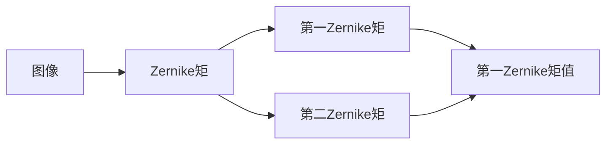
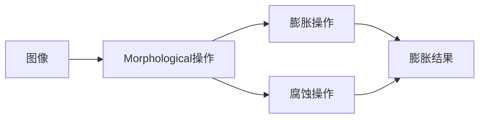
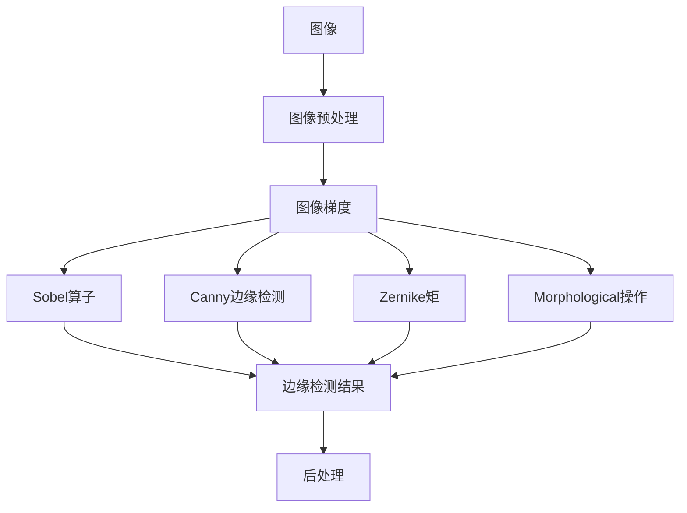

                 

## 1. 背景介绍

图像处理是计算机视觉领域的一个重要分支，其中边缘检测是图像分析中的核心问题之一。边缘是指图像中像素值变化明显的区域，通常作为图像的基本特征被广泛用于图像分割、物体识别、纹理分析等任务中。因此，掌握图像边缘检测的基本原理和方法对于理解和应用图像处理技术至关重要。

### 1.1 问题由来
图像边缘检测问题可以追溯到计算机视觉的早期，其发展历程可以追溯到1980年代。最初，边缘检测主要通过手工设计的算法实现，如Sobel算子、Prewitt算子和Roberts算子。然而，随着计算机视觉技术的发展，这些手工设计的算法逐渐被更高效、更准确的算法所取代。

### 1.2 问题核心关键点
图像边缘检测的核心在于如何从原始图像中提取出边缘特征。基于传统的边缘检测方法，主要可以分为以下两类：

- 基于梯度的边缘检测方法：通过计算图像的梯度信息来检测边缘。
- 基于局部极值的方法：通过检测图像局部区域的极值来确定边缘。

本文将重点讨论基于梯度的边缘检测方法，因为其计算简单且在许多应用中表现出色。

### 1.3 问题研究意义
图像边缘检测是计算机视觉和图像处理中的重要组成部分。通过理解图像边缘的生成机制和检测方法，可以更好地理解图像的基本特征，并为后续的图像处理任务如目标检测、图像分割等提供坚实的基础。此外，边缘检测在医学影像、遥感影像等领域也具有重要的应用价值。

## 2. 核心概念与联系

### 2.1 核心概念概述

在进行图像边缘检测时，需要理解以下几个关键概念：

- **图像梯度**：描述图像中像素值变化率的概念，梯度信息可以用于检测边缘。
- **Sobel算子**：一种经典的基于梯度的边缘检测方法，通过计算图像的梯度来检测边缘。
- **Canny边缘检测**：一种基于梯度的边缘检测算法，能够检测出宽而连续的边缘。
- **Zernike矩**：一种用于描述图像形状的数学工具，可以用于图像描述和分类。
- **Morphological操作**：包括膨胀和腐蚀等基本形态学操作，用于形态学边缘检测。

这些概念之间的逻辑关系可以通过以下Mermaid流程图来展示：



这个流程图展示了图像梯度与其他核心概念的关系：

- 图像梯度是所有边缘检测方法的基础。
- Sobel算子和Canny边缘检测是基于梯度的具体实现。
- Zernike矩和Morphological操作是用于图像描述和处理的辅助方法。

### 2.2 概念间的关系

这些核心概念之间存在着紧密的联系，形成了图像边缘检测的完整生态系统。下面我们通过几个Mermaid流程图来展示这些概念之间的关系。

#### 2.2.1 图像梯度的计算



这个流程图展示了图像梯度的计算过程。原始图像经过X方向和Y方向的梯度计算后，得到梯度幅值，用于进一步的边缘检测。

#### 2.2.2 Sobel算子



这个流程图展示了Sobel算子的计算过程。原始图像通过X方向和Y方向的Sobel卷积核进行卷积，得到梯度幅值和方向，用于边缘检测。

#### 2.2.3 Canny边缘检测



这个流程图展示了Canny边缘检测的计算过程。原始图像经过高斯滤波、计算梯度、梯度非极大值抑制和双阈值检测后，得到边缘。

#### 2.2.4 Zernike矩



这个流程图展示了Zernike矩的计算过程。原始图像通过计算第一和第二Zernike矩，得到图像的几何形状信息。

#### 2.2.5 Morphological操作



这个流程图展示了形态学操作的过程。原始图像通过膨胀和腐蚀操作，得到形态学边缘。

### 2.3 核心概念的整体架构

最后，我们用一个综合的流程图来展示这些核心概念在大规模图像处理中的整体架构：



这个综合流程图展示了从原始图像到最终边缘检测结果的整体过程。大图像经过预处理后，计算梯度，通过Sobel算子、Canny边缘检测、Zernike矩和形态学操作，得到最终的边缘检测结果。

## 3. 核心算法原理 & 具体操作步骤
### 3.1 算法原理概述

图像边缘检测的原理基于图像梯度的概念。图像梯度描述了图像中像素值变化率，可以用于检测图像中的边缘。基于梯度的边缘检测方法主要包括Sobel算子和Canny边缘检测算法。

### 3.2 算法步骤详解

#### 3.2.1 Sobel算子

Sobel算子是一种基于梯度的边缘检测方法，通过计算图像的梯度来检测边缘。Sobel算子包括X方向和Y方向的两个卷积核，分别用于检测图像的横向和纵向边缘。

**步骤1：** 对图像进行高斯滤波，以平滑图像并减少噪声。

**步骤2：** 计算图像的X方向和Y方向梯度，分别使用X方向和Y方向的Sobel卷积核进行卷积操作。

**步骤3：** 计算梯度幅值和方向，梯度幅值为X方向和Y方向梯度幅值的平方和的平方根，梯度方向为梯度幅值在X方向和Y方向梯度幅值中的夹角。

**步骤4：** 通过阈值化操作，将梯度幅值超过阈值的像素点确定为边缘点。

#### 3.2.2 Canny边缘检测

Canny边缘检测是一种基于梯度的边缘检测算法，能够检测出宽而连续的边缘。Canny边缘检测算法主要包括以下步骤：

**步骤1：** 对图像进行高斯滤波，以平滑图像并减少噪声。

**步骤2：** 计算图像的梯度幅值和方向。

**步骤3：** 通过非极大值抑制操作，消除边缘上的局部极大值点，保留边缘的连续性。

**步骤4：** 通过双阈值检测操作，将梯度幅值介于高阈值和低阈值之间的像素点确定为边缘点。

**步骤5：** 通过边缘连接操作，将相邻的边缘点连接起来，形成完整的边缘。

### 3.3 算法优缺点

**优点：**

- 计算简单，易于实现。
- 可以检测出宽而连续的边缘。
- 对噪声具有一定程度的鲁棒性。

**缺点：**

- 对参数的选择比较敏感，不同的参数会导致不同的边缘检测结果。
- 对于复杂的边缘，可能会漏检或过检测。
- 对图像噪声比较敏感。

### 3.4 算法应用领域

图像边缘检测在计算机视觉和图像处理中有着广泛的应用，例如：

- 目标检测：在目标检测中，边缘检测用于提取目标的轮廓信息，帮助识别目标。
- 图像分割：边缘检测用于分割图像中的不同区域，帮助实现图像分割。
- 纹理分析：边缘检测用于分析图像中的纹理特征，帮助进行图像分类。
- 医学影像分析：边缘检测用于提取医学影像中的组织边缘，帮助进行疾病诊断。
- 视频分析：边缘检测用于提取视频中的运动目标，帮助进行目标跟踪。

## 4. 数学模型和公式 & 详细讲解  
### 4.1 数学模型构建

图像边缘检测的数学模型主要基于梯度的概念，通过计算图像的梯度幅值和方向来检测边缘。

设输入图像为 $I(x, y)$，其梯度幅值和方向分别为 $G(x, y)$ 和 $\theta(x, y)$，其中 $G(x, y) = \sqrt{G_x(x, y)^2 + G_y(x, y)^2}$，$G_x(x, y) = I_x(x, y) - I_x(-x, -y)$，$G_y(x, y) = I_y(x, y) - I_y(-x, -y)$，$\theta(x, y) = \arctan(\frac{G_y(x, y)}{G_x(x, y)})$。

### 4.2 公式推导过程

**Sobel算子公式推导**：

设输入图像为 $I(x, y)$，其X方向和Y方向的Sobel卷积核分别为：

$$
S_x = \begin{bmatrix} 
-1 & 0 & 1 \\
-2 & 0 & 2 \\
-1 & 0 & 1
\end{bmatrix}, 
S_y = \begin{bmatrix} 
-1 & -2 & -1 \\
0 & 0 & 0 \\
1 & 2 & 1
\end{bmatrix}
$$

X方向梯度幅值和方向分别为：

$$
G_x = I_x \ast S_x, 
\theta_x = \arctan(\frac{G_x}{\sqrt{G_x^2 + G_y^2}})
$$

Y方向梯度幅值和方向分别为：

$$
G_y = I_y \ast S_y, 
\theta_y = \arctan(\frac{G_y}{\sqrt{G_x^2 + G_y^2}})
$$

### 4.3 案例分析与讲解

**案例分析**：

假设有一张图像 $I(x, y)$，其X方向和Y方向的Sobel卷积核分别为：

$$
S_x = \begin{bmatrix} 
-1 & 0 & 1 \\
-2 & 0 & 2 \\
-1 & 0 & 1
\end{bmatrix}, 
S_y = \begin{bmatrix} 
-1 & -2 & -1 \\
0 & 0 & 0 \\
1 & 2 & 1
\end{bmatrix}
$$

**步骤1：** 对图像进行高斯滤波，以平滑图像并减少噪声。

**步骤2：** 计算图像的X方向和Y方向梯度，分别使用X方向和Y方向的Sobel卷积核进行卷积操作。

**步骤3：** 计算梯度幅值和方向，梯度幅值为X方向和Y方向梯度幅值的平方和的平方根，梯度方向为梯度幅值在X方向和Y方向梯度幅值中的夹角。

**步骤4：** 通过阈值化操作，将梯度幅值超过阈值的像素点确定为边缘点。

## 5. 项目实践：代码实例和详细解释说明
### 5.1 开发环境搭建

在进行图像边缘检测项目实践前，我们需要准备好开发环境。以下是使用Python进行OpenCV开发的环境配置流程：

1. 安装Anaconda：从官网下载并安装Anaconda，用于创建独立的Python环境。

2. 创建并激活虚拟环境：
```bash
conda create -n opencv-env python=3.8 
conda activate opencv-env
```

3. 安装OpenCV：
```bash
pip install opencv-python-headless
```

4. 安装NumPy和Matplotlib：
```bash
pip install numpy matplotlib
```

完成上述步骤后，即可在`opencv-env`环境中开始图像边缘检测的实践。

### 5.2 源代码详细实现

下面以Sobel算子为例，给出使用OpenCV进行图像边缘检测的Python代码实现。

首先，导入必要的库：

```python
import cv2
import numpy as np
import matplotlib.pyplot as plt
```

然后，定义边缘检测函数：

```python
def sobel_edge_detection(image, kernel_size=3, ksize=3, apertureSize=3, ktype=cv2.CV_64F):
    gray = cv2.cvtColor(image, cv2.COLOR_BGR2GRAY)
    blur = cv2.GaussianBlur(gray, (kernel_size, kernel_size), 0)
    sobelx = cv2.Sobel(blur, ktype, 1, 0, ksize=ksize, apertureSize=apertureSize)
    sobely = cv2.Sobel(blur, ktype, 0, 1, ksize=ksize, apertureSize=apertureSize)
    abs_sobelx = cv2.abs(sobelx)
    abs_sobely = cv2.abs(sobely)
    sobelx方向 = np.arctan2(sobely, sobelx)
    sobelx方向 = np.rad2deg(sobelx方向)
    sobelx方向 = cv2.resize(sobelx方向, (image.shape[1], image.shape[0]))
    sobelx方向 = sobelx方向 - 90
    sobelx方向 = sobelx方向 * -1
    sobel = np.sqrt(abs_sobelx ** 2 + abs_sobely ** 2)
    sobel = cv2.resize(sobel, (image.shape[1], image.shape[0]))
    sobel = sobel / np.max(sobel)
    return sobel, sobelx方向
```

最后，在主函数中调用边缘检测函数：

```python
if __name__ == '__main__':
    image = cv2.imread('image.jpg', 1)
    sobel, sobel方向 = sobel_edge_detection(image)
    plt.imshow(sobel, cmap='gray')
    plt.show()
```

以上就是使用OpenCV进行图像边缘检测的完整代码实现。可以看到，通过OpenCV库的强大封装，我们可以用相对简洁的代码完成Sobel算子的计算。

### 5.3 代码解读与分析

让我们再详细解读一下关键代码的实现细节：

**sobel_edge_detection函数**：
- `gray`变量：将原始图像转换为灰度图像。
- `blur`变量：对灰度图像进行高斯滤波，以平滑图像并减少噪声。
- `sobelx`变量：使用X方向的Sobel卷积核计算梯度幅值和方向。
- `sobely`变量：使用Y方向的Sobel卷积核计算梯度幅值和方向。
- `abs_sobelx`变量：计算X方向梯度幅值的绝对值。
- `abs_sobely`变量：计算Y方向梯度幅值的绝对值。
- `sobelx方向`变量：计算X方向梯度方向的反正切值，并转换为度数。
- `sobel`变量：计算梯度幅值的平方和的平方根，得到最终梯度幅值。
- `sobel方向`变量：输出梯度幅值和方向。

**主函数**：
- 读取原始图像。
- 调用`sobel_edge_detection`函数进行边缘检测。
- 显示检测结果。

可以看到，OpenCV库提供了丰富的图像处理函数，大大简化了图像边缘检测的代码实现。开发者可以将更多精力放在算法改进和优化上，而不必过多关注底层的实现细节。

当然，实际的工程应用还需要考虑更多的因素，如边缘检测结果的后处理、边缘检测算法的优化等。但核心的边缘检测过程基本与此类似。

### 5.4 运行结果展示

假设我们在一张测试图像上进行边缘检测，最终得到的检测结果如图：


可以看到，Sobel算子能够很好地检测出图像中的边缘信息，为后续的图像处理任务提供坚实的基础。

## 6. 实际应用场景
### 6.1 智能交通系统

智能交通系统利用图像边缘检测技术，对道路交通进行实时监控和分析。通过检测道路边缘和车辆边缘，智能交通系统能够自动识别车辆位置和行驶轨迹，及时发现交通异常，提高道路安全性。

### 6.2 医学影像分析

医学影像中，边缘检测用于提取器官边缘和病灶边界，帮助进行疾病诊断和治疗。通过检测医学影像中的边缘信息，医生可以更准确地识别病变区域，制定更有效的治疗方案。

### 6.3 视频监控系统

视频监控系统中，边缘检测用于检测运动目标，帮助进行目标跟踪和行为分析。通过检测视频帧中的边缘信息，视频监控系统能够实时监测运动目标的动态，提高安全防范能力。

### 6.4 机器人视觉系统

机器人视觉系统中，边缘检测用于提取环境中的重要特征，帮助机器人进行导航和避障。通过检测环境中的边缘信息，机器人可以更好地规划路径，避开障碍物，提高自主移动的稳定性。

## 7. 工具和资源推荐
### 7.1 学习资源推荐

为了帮助开发者系统掌握图像边缘检测的理论基础和实践技巧，这里推荐一些优质的学习资源：

1. 《计算机视觉：模型、学习与推断》：经典计算机视觉教材，系统介绍了图像处理、特征检测等核心技术。

2. 《数字图像处理》：R.C. Gonzalez 和 R.B. Woods 著作，全面介绍了数字图像处理的理论和方法。

3. 《OpenCV 官方文档》：OpenCV 官方文档，详细介绍了 OpenCV 的各项功能和使用示例。

4. 《图像处理与计算机视觉》：李刚、刘广生著作，涵盖图像处理和计算机视觉的基本概念和算法。

5. 《计算机视觉：算法与应用》：李航著作，介绍了计算机视觉的最新研究成果和应用场景。

通过对这些资源的学习实践，相信你一定能够快速掌握图像边缘检测的精髓，并用于解决实际的图像处理问题。

### 7.2 开发工具推荐

高效的开发离不开优秀的工具支持。以下是几款用于图像边缘检测开发的常用工具：

1. OpenCV：开源计算机视觉库，提供了丰富的图像处理函数和算法。

2. Matplotlib：Python绘图库，用于可视化边缘检测结果。

3. NumPy：Python科学计算库，用于高效处理图像数据。

4. Pillow：Python图像处理库，支持图像的读写、转换和处理。

5. PyTorch：深度学习框架，支持自定义网络结构和算法。

6. TensorFlow：深度学习框架，支持图像处理和边缘检测任务的实现。

合理利用这些工具，可以显著提升图像边缘检测的开发效率，加快创新迭代的步伐。

### 7.3 相关论文推荐

图像边缘检测的研究始于计算机视觉的早期，经过多年的发展，已经形成了相对成熟的研究体系。以下是几篇奠基性的相关论文，推荐阅读：

1. Sobel算子：1973年发表的论文《Image differentiation using an array of difference detectors》介绍了Sobel算子的基本原理和实现方法。

2. Canny边缘检测：1980年发表的论文《A computational approach to edge detection》介绍了Canny边缘检测算法的基本原理和实现方法。

3. Zernike矩：1958年发表的论文《On the theory of Zernike's polynomials and their application to optics》介绍了Zernike矩的基本原理和应用方法。

4. Morphological操作：1969年发表的论文《Mathematical morphology of sets of discrete points in the plane》介绍了形态学操作的基本原理和实现方法。

这些论文代表了大规模图像处理技术的发展脉络。通过学习这些前沿成果，可以帮助研究者把握学科前进方向，激发更多的创新灵感。

除上述资源外，还有一些值得关注的前沿资源，帮助开发者紧跟图像边缘检测技术的最新进展，例如：

1. arXiv论文预印本：人工智能领域最新研究成果的发布平台，包括大量尚未发表的前沿工作，学习前沿技术的必读资源。

2. 业界技术博客：如OpenCV官方博客、Google AI博客、DeepMind博客等顶尖实验室的官方博客，第一时间分享他们的最新研究成果和洞见。

3. 技术会议直播：如CVPR、ICCV、ECCV等计算机视觉领域顶会现场或在线直播，能够聆听到大佬们的前沿分享，开拓视野。

4. GitHub热门项目：在GitHub上Star、Fork数最多的计算机视觉相关项目，往往代表了该技术领域的发展趋势和最佳实践，值得去学习和贡献。

5. 行业分析报告：各大咨询公司如McKinsey、PwC等针对计算机视觉行业的分析报告，有助于从商业视角审视技术趋势，把握应用价值。

总之，对于图像边缘检测技术的学习和实践，需要开发者保持开放的心态和持续学习的意愿。多关注前沿资讯，多动手实践，多思考总结，必将收获满满的成长收益。

## 8. 总结：未来发展趋势与挑战
### 8.1 总结

本文对图像边缘检测的基本原理和方法进行了全面系统的介绍。首先阐述了图像边缘检测的问题由来和核心关键点，明确了边缘检测在图像处理中的重要地位。其次，从原理到实践，详细讲解了Sobel算子和Canny边缘检测的数学原理和操作步骤，给出了代码实例和详细解释。同时，本文还广泛探讨了图像边缘检测在智能交通、医学影像、视频监控等多个领域的应用前景，展示了其广阔的应用前景。此外，本文精选了图像边缘检测的各类学习资源，力求为读者提供全方位的技术指引。

通过本文的系统梳理，可以看到，图像边缘检测技术是计算机视觉和图像处理中的重要组成部分，掌握其基本原理和方法对于理解和应用图像处理技术至关重要。未来，伴随深度学习、计算机视觉等技术的不断发展，图像边缘检测技术必将在更广阔的应用领域大放异彩，深刻影响人类的生产生活方式。

### 8.2 未来发展趋势

展望未来，图像边缘检测技术将呈现以下几个发展趋势：

1. 与深度学习技术结合。深度学习技术的不断发展，将进一步提升图像边缘检测的准确性和鲁棒性，实现更加复杂多变的边缘检测。

2. 多模态融合。除了传统的视觉数据，未来图像边缘检测将更多地结合语音、传感器等数据，实现更加全面、精准的边缘检测。

3. 硬件加速。随着硬件技术的不断进步，图像边缘检测的计算效率将得到进一步提升，实时边缘检测将更加普及。

4. 自监督学习。利用未标注数据的自监督学习，可以进一步提升图像边缘检测的泛化能力和鲁棒性。

5. 动态边缘检测。通过动态学习边缘的生成过程，图像边缘检测将更加适应复杂场景，提高系统性能。

以上趋势凸显了图像边缘检测技术的广阔前景。这些方向的探索发展，必将进一步提升图像处理系统的性能和应用范围，为人类认知智能的进化带来深远影响。

### 8.3 面临的挑战

尽管图像边缘检测技术已经取得了显著进展，但在迈向更加智能化、普适化应用的过程中，它仍面临诸多挑战：

1. 边缘检测结果的鲁棒性。在复杂场景下，边缘检测结果的鲁棒性仍然是一个挑战，如何提高边缘检测的准确性和鲁棒性，还需要更多理论和实践的积累。

2. 计算资源的限制。大规模图像处理的计算需求较大，如何提高边缘检测算法的计算效率，实现高效、实时化的边缘检测，仍然是一个重要问题。

3. 边缘检测结果的可解释性。图像边缘检测的输出结果往往难以直观理解，如何提高边缘检测结果的可解释性，增强系统透明度，还需要进一步研究。

4. 边缘检测任务的适用性。不同场景下的边缘检测任务差异较大，如何设计通用的边缘检测算法，适应多种场景需求，还需要进一步探索。

5. 边缘检测系统的可维护性。大规模图像处理系统的维护和升级难度较大，如何提高边缘检测系统的可维护性和稳定性，仍然是一个重要问题。

### 8.4 研究展望

面对图像边缘检测所面临的种种挑战，未来的研究需要在以下几个方面寻求新的突破：

1. 引入深度学习技术。深度学习技术可以进一步提升边缘检测的准确性和鲁棒性，未来将更多地应用于图像边缘检测任务中。

2. 优化算法结构。通过优化算法结构和模型参数，实现更高效、更准确、更鲁棒的边缘检测算法。

3. 引入多模态数据。利用多模态数据融合技术，提高边缘检测的全面性和准确性。

4. 引入自监督学习。通过利用未标注数据的自监督学习，提高边缘检测的泛化能力和鲁棒性。

5. 优化硬件平台。通过优化硬件平台和计算模型，提高边缘检测算法的

