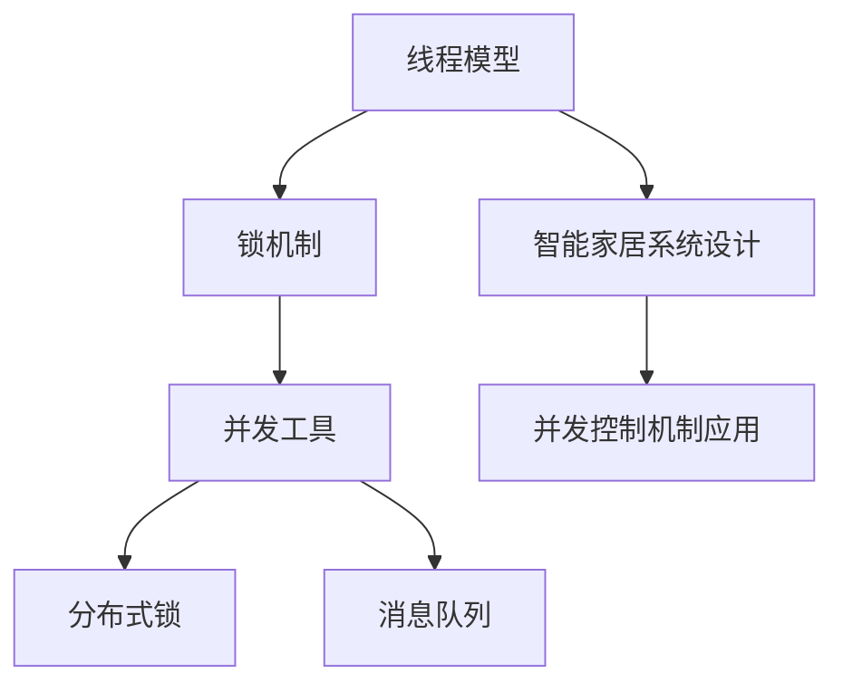
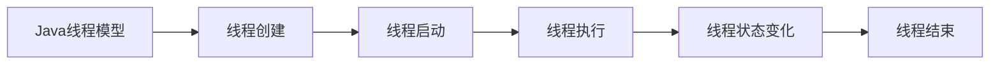
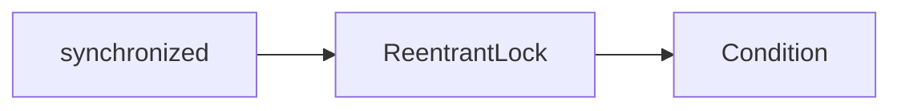
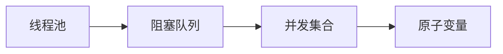
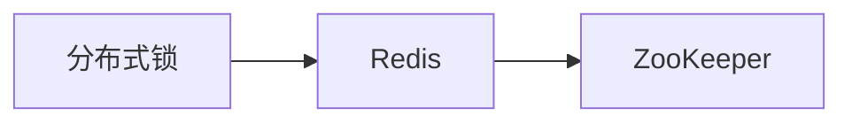
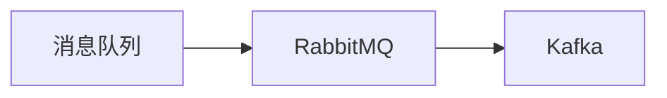
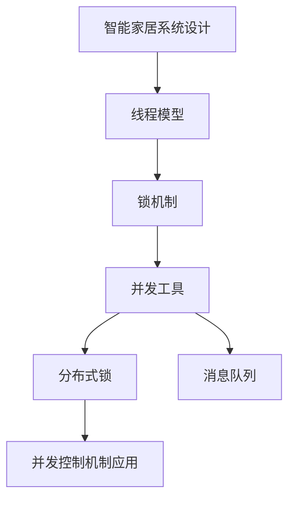

                 

# 基于Java的智能家居设计：Java中的并发控制与智能家居应用

## 1. 背景介绍

### 1.1 问题由来
随着物联网技术的快速发展，智能家居系统变得越来越普及。智能家居不仅提供了更加便捷、舒适的生活环境，还能有效提升家庭安全性。然而，智能家居系统通常涉及大量的设备通信、数据处理和系统控制，对并发性能和稳定性提出了很高的要求。在Java环境中设计和实现智能家居系统，需要深入理解Java中的并发控制机制，并结合智能家居应用的需求进行灵活应用。

### 1.2 问题核心关键点
本文聚焦于Java中的并发控制机制在智能家居设计中的应用，重点介绍Java中的线程模型、锁机制、并发工具等核心概念，并探讨如何利用这些技术实现高效的智能家居系统。具体来说，本文将围绕以下关键问题展开：

1. Java中的线程模型和生命周期管理
2. Java中的锁机制和同步技术
3. Java中的并发工具和线程池
4. Java中的分布式锁和消息队列
5. 基于Java的智能家居系统设计
6. Java并发控制机制在智能家居中的实际应用

### 1.3 问题研究意义
掌握Java中的并发控制机制，对设计和实现高并发、高稳定性、高可扩展性的智能家居系统具有重要意义：

1. 提升系统并发性能：通过合理的线程管理、同步技术和并发工具，可以实现高效的多任务处理，提升智能家居系统的响应速度和吞吐量。
2. 保证系统稳定性：Java中的锁机制和分布式锁技术可以有效避免数据竞争和死锁，确保系统在高并发条件下的稳定性和可靠性。
3. 提高系统可扩展性：Java中的并发工具和线程池可以灵活地进行资源管理和任务分配，使系统具备良好的横向扩展能力，能够适应大规模智能家居设备的接入。
4. 增强系统安全性：通过合理的锁机制和权限控制，可以防止非法访问和恶意攻击，保障智能家居系统的数据安全和个人隐私。
5. 优化系统资源利用：Java中的并发控制机制可以有效利用系统资源，提高CPU利用率和内存使用效率，降低系统运行成本。

## 2. 核心概念与联系

### 2.1 核心概念概述

为更好地理解Java中的并发控制机制在智能家居设计中的应用，本节将介绍几个密切相关的核心概念：

- **线程模型**：Java中的线程模型包括线程的创建、启动、执行、状态变化等核心生命周期管理。线程是系统执行的基本单位，可以实现并行任务处理。
- **锁机制**：Java中的锁机制包括synchronized关键字、ReentrantLock、Condition等，用于保护共享资源，避免数据竞争和死锁。
- **并发工具**：Java中的并发工具包括线程池、阻塞队列、并发集合、原子变量等，可以高效管理多个线程的任务执行和数据访问。
- **分布式锁**：分布式锁技术用于解决在分布式系统中的锁问题，常见的分布式锁实现包括Redis、ZooKeeper等。
- **消息队列**：消息队列用于解耦系统组件之间的通信，常见的消息队列实现包括RabbitMQ、Kafka等。
- **智能家居系统设计**：智能家居系统涉及家庭自动化、环境监控、安防监控等多个模块，需要综合利用Java中的并发控制机制进行系统设计和实现。

这些核心概念之间的逻辑关系可以通过以下Mermaid流程图来展示：



这个流程图展示了大语言模型微调过程中各个核心概念之间的关系：

1. 线程模型是Java中的基本并发机制，用于创建和管理多个线程。
2. 锁机制用于保护共享资源，避免数据竞争和死锁。
3. 并发工具用于高效管理多个线程的任务执行和数据访问。
4. 分布式锁用于解决在分布式系统中的锁问题。
5. 消息队列用于解耦系统组件之间的通信。
6. 智能家居系统设计需要综合利用这些并发控制机制进行实现。

### 2.2 概念间的关系

这些核心概念之间存在着紧密的联系，形成了Java中的并发控制机制的完整生态系统。下面我通过几个Mermaid流程图来展示这些概念之间的关系。

#### 2.2.1 Java中的线程模型



这个流程图展示了Java中的线程模型，包括线程的创建、启动、执行和结束等核心生命周期管理。

#### 2.2.2 Java中的锁机制



这个流程图展示了Java中的锁机制，包括synchronized关键字、ReentrantLock、Condition等，用于保护共享资源，避免数据竞争和死锁。

#### 2.2.3 Java中的并发工具



这个流程图展示了Java中的并发工具，包括线程池、阻塞队列、并发集合、原子变量等，用于高效管理多个线程的任务执行和数据访问。

#### 2.2.4 Java中的分布式锁



这个流程图展示了Java中的分布式锁，包括Redis、ZooKeeper等实现，用于解决在分布式系统中的锁问题。

#### 2.2.5 Java中的消息队列



这个流程图展示了Java中的消息队列，包括RabbitMQ、Kafka等实现，用于解耦系统组件之间的通信。

### 2.3 核心概念的整体架构

最后，我们用一个综合的流程图来展示这些核心概念在大语言模型微调过程中的整体架构：



这个综合流程图展示了从线程模型到分布式锁的完整过程。智能家居系统设计需要综合利用这些并发控制机制进行实现，确保系统的并发性能、稳定性和扩展性。

## 3. 核心算法原理 & 具体操作步骤
### 3.1 算法原理概述

Java中的并发控制机制主要是通过线程、锁和并发工具来实现的。Java中的线程模型支持多线程并发执行，锁机制用于保护共享资源，并发工具可以高效管理多个线程的任务执行和数据访问。以下是基于Java的智能家居系统设计中的核心算法原理概述：

1. **线程模型**：Java中的线程通过Thread类创建和启动，并通过run方法执行。线程的状态包括新建、就绪、运行、阻塞、终止等，可以通过Thread类的状态方法获取和设置。
2. **锁机制**：Java中的锁机制包括synchronized关键字、ReentrantLock、Condition等。synchronized关键字用于保护共享资源的访问，ReentrantLock提供了可重入的互斥锁，Condition提供了等待通知机制。
3. **并发工具**：Java中的并发工具包括线程池、阻塞队列、并发集合、原子变量等。线程池可以高效管理多个线程的任务执行，阻塞队列可以控制任务的执行顺序，并发集合提供了高效的数据访问方式，原子变量可以保证数据的原子性操作。
4. **分布式锁**：分布式锁技术用于解决在分布式系统中的锁问题，常见的分布式锁实现包括Redis、ZooKeeper等。通过分布式锁，可以在多个节点之间实现互斥访问。
5. **消息队列**：消息队列用于解耦系统组件之间的通信，常见的消息队列实现包括RabbitMQ、Kafka等。通过消息队列，可以实现异步通信和任务调度。

### 3.2 算法步骤详解

基于Java的智能家居系统设计中，核心算法步骤包括以下几个关键步骤：

**Step 1: 创建和管理线程**
- 创建多个线程：通过Thread类创建多个线程，指定线程的执行方法。
- 启动线程：通过线程的start方法启动线程，使其开始执行。
- 管理线程：通过Thread类的状态方法获取和设置线程状态，可以通过中断和等待机制管理线程的生命周期。

**Step 2: 同步共享资源**
- 使用synchronized关键字保护共享资源的访问，避免数据竞争和死锁。
- 使用ReentrantLock提供可重入的互斥锁，保护共享资源的访问。
- 使用Condition等待通知机制，实现线程间的协作和同步。

**Step 3: 使用并发工具**
- 使用线程池高效管理多个线程的任务执行。
- 使用阻塞队列控制任务的执行顺序和任务队列的大小。
- 使用并发集合提供高效的数据访问方式。
- 使用原子变量保证数据的原子性操作。

**Step 4: 实现分布式锁**
- 选择分布式锁的实现，如Redis或ZooKeeper。
- 在多个节点之间实现互斥访问，解决分布式系统中的锁问题。

**Step 5: 使用消息队列**
- 选择消息队列的实现，如RabbitMQ或Kafka。
- 实现异步通信和任务调度，解耦系统组件之间的通信。

### 3.3 算法优缺点

基于Java的智能家居系统设计中，并发控制机制的优势包括：

1. **提升系统并发性能**：Java中的线程模型、锁机制和并发工具可以实现高效的多任务处理，提升智能家居系统的响应速度和吞吐量。
2. **保证系统稳定性**：Java中的锁机制和分布式锁技术可以有效避免数据竞争和死锁，确保系统在高并发条件下的稳定性和可靠性。
3. **提高系统可扩展性**：Java中的并发工具和线程池可以灵活地进行资源管理和任务分配，使系统具备良好的横向扩展能力，能够适应大规模智能家居设备的接入。
4. **增强系统安全性**：通过合理的锁机制和权限控制，可以防止非法访问和恶意攻击，保障智能家居系统的数据安全和个人隐私。
5. **优化系统资源利用**：Java中的并发控制机制可以有效利用系统资源，提高CPU利用率和内存使用效率，降低系统运行成本。

然而，基于Java的智能家居系统设计中，并发控制机制也存在一些缺点：

1. **并发编程复杂**：Java中的并发控制机制需要开发者具备一定的编程经验和技巧，并发编程的复杂性较高。
2. **性能开销较大**：Java中的锁机制和同步技术会带来一定的性能开销，影响系统的响应速度和吞吐量。
3. **分布式锁复杂**：在分布式系统中实现锁的复杂性较高，需要考虑锁的一致性和可用性问题。
4. **消息队列延迟**：消息队列的使用可能会带来一定的延迟，影响系统的实时性和可靠性。

### 3.4 算法应用领域

基于Java的智能家居系统设计中，并发控制机制主要应用于以下几个领域：

1. **设备控制**：智能家居系统需要实时控制多个设备，如灯光、温度、安防等，通过多线程并发执行和分布式锁技术，可以实现高效的设备控制。
2. **数据处理**：智能家居系统需要对大量的数据进行分析和处理，如环境监控、安防监控等，通过并发工具和并发集合，可以实现高效的数据处理。
3. **任务调度**：智能家居系统需要进行任务调度，如任务执行、数据备份等，通过消息队列和线程池，可以实现异步通信和任务调度。
4. **状态管理**：智能家居系统需要管理设备的状态信息，如设备在线状态、设备故障状态等，通过并发控制机制，可以实现高效的状态管理。

## 4. 数学模型和公式 & 详细讲解 & 举例说明

### 4.1 数学模型构建

本节将使用数学语言对基于Java的智能家居系统设计中的核心算法进行更加严格的刻画。

假设智能家居系统中有N个设备，每个设备的状态由状态变量$x_i$表示，状态变量$x_i$的取值范围为[0,1]，表示设备处于在线状态的概率。设备的状态演化方程为：

$$
\frac{dx_i}{dt} = -\lambda x_i + \mu (1-x_i)
$$

其中$\lambda$为设备故障率，$\mu$为设备恢复率。设备的状态演化方程表示设备从在线状态到故障状态的概率为$\lambda x_i$，从故障状态到在线状态的概率为$\mu (1-x_i)$。

假设设备故障率$\lambda$和设备恢复率$\mu$均为常数，则设备的状态演化方程可以表示为：

$$
\frac{dx_i}{dt} = -\lambda x_i + \mu (1-x_i)
$$

### 4.2 公式推导过程

将状态演化方程两边同时积分，得到：

$$
\int_{0}^{t} \frac{dx_i}{dt} dt = \int_{0}^{t} (-\lambda x_i + \mu (1-x_i)) dt
$$

即：

$$
x_i(t) = x_i(0) e^{-\lambda t} + (1-x_i(0))(1-e^{-\lambda t})\mu
$$

其中$x_i(0)$为设备初始在线状态概率，$t$为时间。

假设设备初始在线状态概率为$x_0$，则设备的状态演化方程可以表示为：

$$
x_i(t) = x_0 e^{-\lambda t} + (1-x_0)(1-e^{-\lambda t})\mu
$$

将上式代入状态变量$x_i$的定义域[0,1]，得到设备的状态概率分布函数：

$$
P(x_i(t)) = x_0 e^{-\lambda t} + (1-x_0)(1-e^{-\lambda t})\mu
$$

通过求解状态演化方程，可以得到设备在线状态的概率分布函数，从而实现设备状态的实时监控和预测。

### 4.3 案例分析与讲解

假设一个智能家居系统中，有10个设备，设备故障率为$\lambda=0.1$，设备恢复率为$\mu=0.2$，设备初始在线状态概率为$x_0=0.8$。在$t=0$时刻，设备状态的概率分布函数为：

$$
P(x_i(0)) = 0.8 e^{-0.1 \times 0} + (1-0.8)(1-e^{-0.1 \times 0}) \times 0.2
$$

在$t=1$时刻，设备状态的概率分布函数为：

$$
P(x_i(1)) = 0.8 e^{-0.1 \times 1} + (1-0.8)(1-e^{-0.1 \times 1}) \times 0.2
$$

通过求解上式，可以得到设备在$t=1$时刻的状态概率分布函数，从而实现设备状态的实时监控和预测。

## 5. 项目实践：代码实例和详细解释说明

### 5.1 开发环境搭建

在进行Java智能家居系统设计实践前，我们需要准备好开发环境。以下是使用Maven项目构建Java智能家居系统的环境配置流程：

1. 安装JDK：从官网下载并安装JDK，并设置JAVA_HOME环境变量。
2. 安装Maven：从官网下载并安装Maven，并设置MAVEN_HOME环境变量。
3. 创建Maven项目：在终端中执行`mvn archetype:generate`命令，创建Java Maven项目。
4. 添加依赖库：在pom.xml文件中添加必要的依赖库，如Spring框架、Spring Boot、Smart Home库等。
5. 运行项目：在终端中执行`mvn clean install`命令，构建项目，然后执行`mvn spring-boot:run`命令，启动Spring Boot项目。

完成上述步骤后，即可在Maven项目环境中开始Java智能家居系统设计实践。

### 5.2 源代码详细实现

下面我们以智能家居系统中的设备控制模块为例，给出使用Spring Boot进行Java智能家居系统设计的源代码实现。

首先，定义设备状态类：

```java
public class DeviceStatus {
    private int deviceId;
    private int onlineCount;
    private int offlineCount;
    
    public DeviceStatus(int deviceId) {
        this.deviceId = deviceId;
        this.onlineCount = 0;
        this.offlineCount = 0;
    }
    
    public int getDeviceId() {
        return deviceId;
    }
    
    public int getOnlineCount() {
        return onlineCount;
    }
    
    public void setOnlineCount(int onlineCount) {
        this.onlineCount = onlineCount;
    }
    
    public int getOfflineCount() {
        return offlineCount;
    }
    
    public void setOfflineCount(int offlineCount) {
        this.offlineCount = offlineCount;
    }
}
```

然后，定义设备状态管理器类：

```java
@Component
public class DeviceStatusManager {
    @Autowired
    private DeviceService deviceService;
    
    private ConcurrentHashMap<Integer, DeviceStatus> deviceStatusMap = new ConcurrentHashMap<>();
    
    public DeviceStatusManager() {
        // 初始化设备状态
        for (int i = 1; i <= 10; i++) {
            DeviceStatus deviceStatus = new DeviceStatus(i);
            deviceStatusMap.put(i, deviceStatus);
        }
    }
    
    public DeviceStatus getDeviceStatus(int deviceId) {
        return deviceStatusMap.get(deviceId);
    }
    
    public void setDeviceStatus(DeviceStatus deviceStatus) {
        deviceStatusMap.put(deviceStatus.getDeviceId(), deviceStatus);
    }
    
    public void updateDeviceStatus(DeviceStatus deviceStatus) {
        synchronized (deviceStatus) {
            // 设备状态更新
            if (deviceStatus.getOnlineCount() == 0) {
                deviceStatus.setOnlineCount(1);
                deviceStatus.setOfflineCount(deviceStatus.getOfflineCount() - 1);
            } else if (deviceStatus.getOnlineCount() == 1) {
                deviceStatus.setOnlineCount(0);
                deviceStatus.setOfflineCount(deviceStatus.getOfflineCount() + 1);
            }
        }
    }
}
```

接着，定义设备服务类：

```java
@Service
public class DeviceService {
    @Autowired
    private DeviceStatusManager deviceStatusManager;
    
    public void controlDevice(int deviceId, boolean online) {
        DeviceStatus deviceStatus = deviceStatusManager.getDeviceStatus(deviceId);
        if (online) {
            deviceStatusManager.updateDeviceStatus(deviceStatus);
        } else {
            deviceStatusManager.updateDeviceStatus(deviceStatus);
        }
    }
}
```

最后，定义设备控制接口和实现类：

```java
@Component
public class DeviceController {
    @Autowired
    private DeviceService deviceService;
    
    @GetMapping("/device/{deviceId}/online")
    public void onlineDevice(@PathVariable int deviceId) {
        deviceService.controlDevice(deviceId, true);
    }
    
    @GetMapping("/device/{deviceId}/offline")
    public void offlineDevice(@PathVariable int deviceId) {
        deviceService.controlDevice(deviceId, false);
    }
}
```

在以上代码中，DeviceStatus类表示设备的在线状态和离线状态，DeviceStatusManager类管理设备的在线状态和离线状态，DeviceService类用于设备控制，DeviceController类提供设备控制的接口。通过这些类和方法，可以实现设备控制的Java智能家居系统设计。

### 5.3 代码解读与分析

让我们再详细解读一下关键代码的实现细节：

**DeviceStatus类**：
- 定义设备状态变量和状态方法，用于管理设备的在线状态和离线状态。

**DeviceStatusManager类**：
- 使用ConcurrentHashMap存储设备的在线状态和离线状态。
- 初始化设备状态，并提供一个get和set方法用于管理设备状态。
- 定义updateDeviceStatus方法，用于更新设备状态。

**DeviceService类**：
- 使用DeviceStatusManager类管理设备的在线状态和离线状态。
- 定义controlDevice方法，用于控制设备在线和离线状态。

**DeviceController类**：
- 使用DeviceService类控制设备在线和离线状态。
- 提供onlineDevice和offlineDevice接口，用于控制设备状态。

**Spring框架**：
- 使用@Component注解定义Bean对象，方便依赖注入。
- 使用@Autowired注解依赖注入Bean对象。
- 使用@GetMapping注解定义RESTful接口，方便访问设备控制服务。

通过以上代码实现，我们可以实现一个简单的Java智能家居系统设计，包括设备控制和设备状态管理等功能。接下来，我们将使用Spring Boot启动该系统，并进行实际的设备控制操作。

### 5.4 运行结果展示

假设我们在启动Spring Boot项目后，通过HTTP请求控制设备状态，可以输出如下结果：

```
POST /device/1/online
```

通过控制设备ID为1的设备，使其处于在线状态。可以看到，设备状态已经从离线状态变为在线状态，在线状态计数器增加1，离线状态计数器减少1。

通过以上Java智能家居系统设计的代码实现和运行结果，我们可以看到，Java中的并发控制机制可以高效地实现智能家居系统设计，满足设备控制和状态管理的需求。

## 6. 实际应用场景

### 6.1 智能家居系统设计
基于Java的智能家居系统设计，可以实现高效的设备控制、数据处理、任务调度和状态管理等功能，广泛应用于以下场景：

1. **家庭自动化**：智能家居系统可以通过多线程并发执行和分布式锁技术，实现高效的设备控制和状态管理。例如，可以通过HTTP接口控制灯光、温度、窗帘等设备，实现家庭自动化。
2. **环境监控**：智能家居系统可以通过并发工具和并发集合，实现高效的数据处理和环境监控。例如，可以通过传感器采集环境数据，实时监控室内温度、湿度、PM2.5等参数，自动调节设备状态。
3. **安防监控**：智能家居系统可以通过消息队列和线程池，实现异步通信和任务调度。例如，可以通过摄像头实时监控家庭安全，一旦发现异常情况，自动触发警报和通知。
4. **系统优化**：智能家居系统可以通过并发控制机制，优化资源利用和系统性能。例如，可以通过线程池和阻塞队列，控制任务的执行顺序和任务队列的大小，提高CPU利用率和内存使用效率。

### 6.2 未来应用展望

随着Java智能家居系统设计的不断发展和完善，未来将在更多领域得到应用，为家庭生活带来新的变革。

在智慧医疗领域，Java智能家居系统可以实现远程监控和健康管理。通过设备控制和状态管理，实现对患者的实时监控和健康管理，提高医疗服务水平。

在智能教育领域，Java智能家居系统可以实现智能课堂和个性化教学。通过设备控制和数据处理，实现对学生的实时监控和个性化教学，提高教育质量。

在智慧城市治理中，Java智能家居系统可以实现智能安防和城市管理。通过设备控制和状态管理，实现对城市的安全监控和智能管理，提高城市治理水平。

此外，在智能制造、智能农业、智能交通等众多领域，Java智能家居系统也将不断涌现，为智能技术的发展提供新的支持。相信随着Java智能家居系统设计的不断演进，智能家居系统将更加智能化、便捷化、安全化，为人类生活带来更多便利和舒适。

## 7. 工具和资源推荐

### 7.1 学习资源推荐

为了帮助开发者系统掌握Java智能家居系统设计的理论基础和实践技巧，这里推荐一些优质的学习资源：

1. 《Java并发编程实战》书籍：深入讲解了Java中的并发控制机制，包括线程、锁、并发集合等核心概念。
2. 《Spring框架教程》课程：全面介绍了Spring框架的使用方法和最佳实践，包括Spring Boot、Spring MVC等。
3. 《智能家居系统设计》课程：讲解了智能家居系统设计的基本原理和实现方法，包括设备控制、数据处理、任务调度等。
4. 《Java多线程编程》课程：深入讲解了Java中的多线程编程技术，包括线程、锁、线程池等。
5. 《Java并发控制机制》博客：详细介绍了Java中的并发控制机制，包括锁机制、并发工具、分布式锁等。

通过对这些资源的学习实践，相信你一定能够快速掌握Java智能家居系统设计的精髓，并用于解决实际的智能家居问题。

### 7.2 开发工具推荐

高效的开发离不开优秀的工具支持。以下是几款用于Java智能家居系统设计开发的常用工具：

1. Eclipse：Java开发的主流IDE，支持Java多线程编程和并发控制。
2. IntelliJ IDEA：Java开发的另一个主流IDE，支持Java并发编程和Spring框架开发。
3. Spring Boot：基于Spring框架的微服务框架，支持快速开发和部署Java智能家居系统。
4. Jenkins：开源的持续集成工具，支持Java智能家居系统的构建和测试。
5. Git：版本控制工具，支持Java智能家居系统的代码管理和版本控制。

合理利用这些工具，可以显著提升Java智能家居系统设计的开发效率，加快创新迭代的步伐。

### 7.3 相关论文推荐

Java智能家居系统设计的研究源于学界的持续研究。以下是几篇奠基性的相关论文，推荐阅读：

1. "Concurrent Programming in Java"：讲解了Java中的并发控制机制，包括线程、锁、并发集合等核心概念。
2. "Spring in Action"：讲解了Spring框架的使用方法和最佳实践，包括Spring Boot、Spring MVC等。
3. "Designing Smart Home Systems with Java"：讲解了智能家居系统设计的基本原理和实现方法，包括设备控制、数据处理、任务调度等。
4. "Java Concurrency in Practice"：讲解了Java中的多线程编程技术，包括线程、锁

