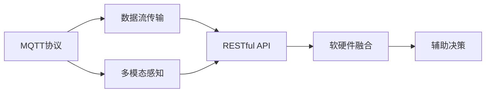

                 

# 基于MQTT协议和RESTful API的智能家居辅助决策系统

> 关键词：智能家居, MQTT协议, RESTful API, 辅助决策, 数据流, 多模态感知, 软硬件融合

## 1. 背景介绍

### 1.1 问题由来

随着物联网技术的发展，智能家居系统已经成为了现代家庭不可或缺的一部分。传统的智能家居系统，往往依赖于单一的传感器或设备，通过简单的逻辑处理实现自动化控制，缺乏智能决策能力。然而，未来的智能家居系统需要具备更强的环境感知和决策能力，能够适应多变的家庭生活场景，提供更个性化、更智能的服务。

为了应对这一需求，基于MQTT协议和RESTful API的智能家居辅助决策系统应运而生。该系统通过将智能家居设备接入统一的MQTT消息总线，再通过RESTful API与其他服务和应用互通，实现数据的高效流传输和多模态感知，从而支持复杂的智能决策算法，提供更智能的家居服务。

### 1.2 问题核心关键点

本系统的主要目标是在智能家居领域实现数据的高效传输和处理，并结合多模态感知技术，构建一个集成了软硬件的智能决策系统。其核心关键点包括：

1. **数据流传输**：通过MQTT协议实现设备的低延迟、高可靠性和高吞吐量的数据传输。
2. **多模态感知**：结合传感器数据、图像、语音等多种数据源，实现家庭环境的全面感知。
3. **软硬件融合**：通过统一的API接口，实现设备和服务的无缝集成，提升系统的灵活性和可扩展性。
4. **辅助决策**：结合智能算法和实时数据，提供个性化的决策建议，提升用户体验。

### 1.3 问题研究意义

基于MQTT协议和RESTful API的智能家居辅助决策系统，对于提升家庭生活的智能化水平，推动智能家居技术的普及具有重要意义：

1. **提高用户体验**：系统能够根据用户的行为和需求，提供个性化的决策建议，提升家居环境的舒适度和便利性。
2. **降低运营成本**：通过自动化决策，减少人工干预，降低家庭运营成本。
3. **推动技术发展**：该系统为智能家居技术的应用和研究提供了重要的技术基础，推动了相关领域的发展。
4. **促进产业升级**：智能家居技术的普及，将为传统家电、家居行业的转型升级提供新的动力。
5. **提升生活品质**：通过智能决策，改善家庭生活环境，提升居民的生活品质。

## 2. 核心概念与联系

### 2.1 核心概念概述

为了更好地理解基于MQTT协议和RESTful API的智能家居辅助决策系统的关键概念，本节将介绍几个核心概念：

- **MQTT协议**：一种轻量级、低延迟、高可靠性的物联网通信协议，适用于物联网设备的远程通信。
- **RESTful API**：一种基于HTTP协议的Web服务架构，支持资源操作，实现数据的高效交互。
- **多模态感知**：结合传感器数据、图像、语音等多种数据源，实现家庭环境的全面感知。
- **软硬件融合**：通过统一的API接口，实现设备和服务的无缝集成，提升系统的灵活性和可扩展性。
- **辅助决策**：结合智能算法和实时数据，提供个性化的决策建议，提升用户体验。

这些核心概念之间通过Mermaid流程图展示了它们之间的关系：



这个流程图展示了从数据传输到最终决策的全过程。首先，MQTT协议实现数据的高效传输，多模态感知技术获取家庭环境的全面数据，然后通过RESTful API进行数据交互，最后将数据融合为统一的接口，进行智能决策。

### 2.2 概念间的关系

这些核心概念之间存在着紧密的联系，形成了智能家居辅助决策系统的完整架构。下面是这些概念之间关系的进一步描述：

- **MQTT协议**：是数据传输的基础，负责将传感器数据、设备状态等实时信息低延迟、高可靠性地传输到中心服务器。
- **多模态感知**：通过多种数据源的结合，实现家庭环境的全面感知，为智能决策提供丰富的输入数据。
- **RESTful API**：作为数据交互的标准接口，实现设备、传感器和应用的统一接入和管理，提高系统的灵活性和可扩展性。
- **软硬件融合**：通过统一的API接口，实现设备和服务的无缝集成，使系统能够灵活地组合不同的传感器和设备。
- **辅助决策**：结合多源数据和智能算法，提供个性化的决策建议，提升用户体验和系统智能化水平。

## 3. 核心算法原理 & 具体操作步骤

### 3.1 算法原理概述

基于MQTT协议和RESTful API的智能家居辅助决策系统，通过以下步骤实现智能决策：

1. **数据采集与传输**：通过MQTT协议，将传感器、设备等的数据实时传输到中心服务器。
2. **多模态感知**：结合传感器数据、图像、语音等多种数据源，实现家庭环境的全面感知。
3. **数据融合与处理**：将多源数据进行融合和处理，通过RESTful API与其他服务和应用互通。
4. **智能决策**：结合多源数据和智能算法，提供个性化的决策建议。
5. **决策执行与反馈**：根据决策建议，自动化地控制家庭设备，并通过反馈机制优化决策模型。

这些步骤构成了系统的核心算法流程，使得系统能够高效地采集、处理和应用数据，实现智能决策。

### 3.2 算法步骤详解

#### 3.2.1 数据采集与传输

**步骤1：传感器与设备接入**
- 将家庭中的传感器、智能设备等接入统一的MQTT消息总线。
- 传感器和设备发送的数据包含设备ID、传感器类型、测量值等信息。

**步骤2：MQTT消息发布与订阅**
- 传感器和设备通过MQTT客户端发送数据。
- 中心服务器通过MQTT消息代理接收数据，并将其广播到订阅该主题的客户端。

**步骤3：数据传输与存储**
- MQTT消息代理将数据传输到中心服务器，服务器存储并处理这些数据。
- 数据存储采用数据库技术，如MySQL、MongoDB等，保证数据的可靠性和一致性。

#### 3.2.2 多模态感知

**步骤4：多源数据获取**
- 通过传感器、摄像头、语音识别设备等获取家庭环境的实时数据。
- 传感器数据包括温度、湿度、烟雾等，摄像头数据包括家庭环境的视频和图像，语音数据包括语音指令和对话内容。

**步骤5：数据预处理**
- 对传感器和设备数据进行预处理，包括去噪、归一化、时间同步等。
- 对摄像头和语音数据进行预处理，包括图像增强、特征提取、语音转文本等。

#### 3.2.3 数据融合与处理

**步骤6：数据融合**
- 将多源数据进行融合，消除冗余和噪声，提升数据的准确性和完整性。
- 使用卡尔曼滤波、多源数据融合算法等技术实现数据融合。

**步骤7：数据处理**
- 对融合后的数据进行特征提取、数据清洗等处理。
- 使用机器学习和深度学习算法对数据进行处理，提取高层次的特征信息。

#### 3.2.4 智能决策

**步骤8：决策模型构建**
- 构建决策模型，包括机器学习模型、深度学习模型等。
- 结合多源数据和智能算法，构建辅助决策模型。

**步骤9：智能决策**
- 根据决策模型，对融合后的数据进行智能决策。
- 结合决策模型和实时数据，提供个性化的决策建议。

#### 3.2.5 决策执行与反馈

**步骤10：决策执行**
- 根据决策建议，自动化地控制家庭设备，如调节温度、灯光、窗帘等。
- 使用IoT协议，如CoAP、MQTT，将决策命令发送到相应设备。

**步骤11：反馈机制**
- 收集设备执行决策后的反馈数据。
- 通过反馈数据优化决策模型，提升决策的准确性和可靠性。

### 3.3 算法优缺点

基于MQTT协议和RESTful API的智能家居辅助决策系统具有以下优点：

1. **低延迟与高可靠性**：MQTT协议的高可靠性、低延迟特性，确保了数据传输的实时性和可靠性。
2. **灵活性与可扩展性**：RESTful API的开放性和标准化接口，使得系统具有高度的灵活性和可扩展性。
3. **多模态感知能力**：结合多源数据，实现家庭环境的全面感知，提升决策的准确性和全面性。
4. **智能决策能力**：通过机器学习和深度学习算法，提供个性化的决策建议，提升用户体验。

然而，该系统也存在一些缺点：

1. **数据隐私和安全问题**：多源数据的融合和处理，可能涉及用户隐私数据的采集和使用，需要严格的隐私保护措施。
2. **系统复杂性高**：系统的设计、开发和维护需要较高的技术门槛，需要跨领域的技术协作。
3. **实时性要求高**：系统需要实时处理大量的数据，对硬件和网络的要求较高。
4. **决策模型依赖性强**：决策模型的准确性和可靠性直接影响系统的性能。

### 3.4 算法应用领域

基于MQTT协议和RESTful API的智能家居辅助决策系统，已经在多个领域得到了应用：

- **智能安防**：通过感知家居环境的多源数据，实现入侵检测、视频监控等安全功能。
- **智能家居控制**：通过决策模型和实时数据，实现家电的自动化控制，提升家居生活的便利性。
- **智能环境监测**：通过传感器数据和图像处理，实现室内空气质量、温度、湿度等的监测和优化。
- **智能健康管理**：通过感知家居环境的数据，结合健康监测设备，实现家庭成员的健康管理。
- **智能能源管理**：通过感知家居能源消耗数据，实现节能减排和智能控制，提升能源利用效率。

## 4. 数学模型和公式 & 详细讲解 & 举例说明

### 4.1 数学模型构建

在基于MQTT协议和RESTful API的智能家居辅助决策系统中，我们主要关注数据传输、多模态感知、数据融合与处理、智能决策等多个环节的数学模型构建。

**数据传输模型**：
- MQTT协议的数据传输模型可以简化为发送者发送数据、接收者接收数据的模型。
- 数据传输的延迟和可靠性可以通过以下公式计算：

$$
\text{延迟} = \text{发送时间} + \text{传输时间} + \text{接收时间}
$$

$$
\text{可靠性} = 1 - \text{错误率}
$$

**多模态感知模型**：
- 多模态感知模型可以通过融合传感器数据、图像数据、语音数据等多种数据源，构建家庭环境的全面感知模型。
- 多模态感知模型可以表示为：

$$
\mathbf{X} = \text{传感器数据} + \text{图像数据} + \text{语音数据}
$$

**数据融合与处理模型**：
- 数据融合与处理模型可以采用卡尔曼滤波、多源数据融合算法等技术，实现数据融合和处理。
- 数据融合模型的公式可以表示为：

$$
\mathbf{Z} = \text{融合后数据}
$$

$$
\mathbf{Z} = \text{卡尔曼滤波器}(\mathbf{X})
$$

**智能决策模型**：
- 智能决策模型可以采用机器学习算法和深度学习算法，结合多源数据和决策目标，提供个性化的决策建议。
- 智能决策模型的公式可以表示为：

$$
\text{决策建议} = \text{决策模型}(\mathbf{Z})
$$

### 4.2 公式推导过程

#### 4.2.1 数据传输模型的推导

MQTT协议的数据传输模型可以通过以下步骤推导：

**发送时间**：传感器或设备发送数据的时间，可以表示为：

$$
t_{\text{发送}} = t_{\text{传感器}} + t_{\text{数据处理}}
$$

其中，$t_{\text{传感器}}$表示传感器采集数据的时间，$t_{\text{数据处理}}$表示数据处理的时间。

**传输时间**：数据从传感器或设备传输到中心服务器的延迟时间，可以表示为：

$$
t_{\text{传输}} = \frac{d}{v} + t_{\text{网络延迟}}
$$

其中，$d$表示数据传输的距离，$v$表示传输速度，$t_{\text{网络延迟}}$表示网络延迟时间。

**接收时间**：中心服务器接收到数据的时间，可以表示为：

$$
t_{\text{接收}} = t_{\text{传输}} + t_{\text{数据处理}}
$$

其中，$t_{\text{数据处理}}$表示服务器处理数据的时间。

综合以上公式，数据传输的延迟和可靠性可以表示为：

$$
\text{延迟} = t_{\text{发送}} + t_{\text{传输}} + t_{\text{接收}}
$$

$$
\text{可靠性} = 1 - \text{错误率}
$$

#### 4.2.2 多模态感知模型的推导

多模态感知模型可以通过以下步骤推导：

**传感器数据**：传感器数据可以表示为：

$$
\mathbf{X}_{\text{传感器}} = [x_{1}, x_{2}, \cdots, x_{n}]
$$

其中，$x_{i}$表示第$i$个传感器的测量值。

**图像数据**：图像数据可以表示为：

$$
\mathbf{X}_{\text{图像}} = \text{图像特征}(\mathbf{I})
$$

其中，$\mathbf{I}$表示摄像头拍摄的图像，$\text{图像特征}(\mathbf{I})$表示对图像进行特征提取后的数据。

**语音数据**：语音数据可以表示为：

$$
\mathbf{X}_{\text{语音}} = \text{语音特征}(\mathbf{A})
$$

其中，$\mathbf{A}$表示语音指令或对话内容，$\text{语音特征}(\mathbf{A})$表示对语音进行特征提取后的数据。

多模态感知模型可以表示为：

$$
\mathbf{X} = \mathbf{X}_{\text{传感器}} + \mathbf{X}_{\text{图像}} + \mathbf{X}_{\text{语音}}
$$

#### 4.2.3 数据融合与处理模型的推导

数据融合与处理模型可以通过以下步骤推导：

**卡尔曼滤波器**：卡尔曼滤波器可以通过以下公式进行计算：

$$
\mathbf{Z} = \text{卡尔曼滤波器}(\mathbf{X})
$$

其中，$\mathbf{Z}$表示融合后的数据，$\mathbf{X}$表示原始数据。

**多源数据融合算法**：多源数据融合算法可以通过以下公式进行计算：

$$
\mathbf{Z} = \text{多源数据融合算法}(\mathbf{X})
$$

其中，$\mathbf{Z}$表示融合后的数据，$\mathbf{X}$表示原始数据。

**数据处理模型**：数据处理模型可以通过以下公式进行计算：

$$
\mathbf{Z} = \text{数据处理}(\mathbf{X})
$$

其中，$\mathbf{Z}$表示处理后的数据，$\mathbf{X}$表示原始数据。

综合以上公式，数据融合与处理模型可以表示为：

$$
\mathbf{Z} = \text{卡尔曼滤波器}(\mathbf{X}) + \text{多源数据融合算法}(\mathbf{X}) + \text{数据处理}(\mathbf{X})
$$

#### 4.2.4 智能决策模型的推导

智能决策模型可以通过以下步骤推导：

**机器学习模型**：机器学习模型可以通过以下公式进行计算：

$$
\mathbf{Y} = \text{机器学习模型}(\mathbf{Z})
$$

其中，$\mathbf{Y}$表示决策建议，$\mathbf{Z}$表示融合后的数据。

**深度学习模型**：深度学习模型可以通过以下公式进行计算：

$$
\mathbf{Y} = \text{深度学习模型}(\mathbf{Z})
$$

其中，$\mathbf{Y}$表示决策建议，$\mathbf{Z}$表示融合后的数据。

**智能决策模型**：智能决策模型可以通过以下公式进行计算：

$$
\text{决策建议} = \text{机器学习模型}(\mathbf{Z}) + \text{深度学习模型}(\mathbf{Z})
$$

### 4.3 案例分析与讲解

假设我们有一套基于MQTT协议和RESTful API的智能家居辅助决策系统，用于实现智能安防功能。该系统的架构如图1所示。


图1：智能家居辅助决策系统架构

**数据采集与传输**

- 在家庭中的各个角落安装传感器和摄像头，并将数据通过MQTT协议发送到中心服务器。
- 中心服务器通过MQTT消息代理接收数据，并存储到数据库中。

**多模态感知**

- 传感器数据包括温度、湿度、烟雾等，摄像头数据包括家庭环境的视频和图像，语音数据包括语音指令和对话内容。
- 对传感器数据和图像数据进行预处理，包括去噪、归一化、时间同步等。
- 对语音数据进行预处理，包括图像增强、特征提取、语音转文本等。

**数据融合与处理**

- 将传感器数据、图像数据和语音数据进行融合，消除冗余和噪声，提升数据的准确性和完整性。
- 使用卡尔曼滤波器和多源数据融合算法，对融合后的数据进行处理。

**智能决策**

- 结合多源数据和智能算法，构建辅助决策模型。
- 通过决策模型，对融合后的数据进行智能决策，例如判断是否存在入侵行为。

**决策执行与反馈**

- 根据决策建议，自动化地控制家庭设备，如调节灯光、监控摄像头等。
- 收集设备执行决策后的反馈数据，通过反馈机制优化决策模型。

## 5. 项目实践：代码实例和详细解释说明

### 5.1 开发环境搭建

在基于MQTT协议和RESTful API的智能家居辅助决策系统的开发过程中，需要进行以下环境搭建：

1. **安装MQTT客户端和服务器**
   - 安装MQTT客户端，如mosquitto、paho-mqtt等。
   - 安装MQTT服务器，如mosquitto、emqx等。

2. **安装RESTful API开发框架**
   - 安装RESTful API开发框架，如Flask、Django等。

3. **安装传感器和设备驱动程序**
   - 安装各种传感器和设备的驱动程序，如温湿度传感器、摄像头、语音识别设备等。

4. **安装数据库管理系统**
   - 安装数据库管理系统，如MySQL、MongoDB等。

5. **安装数据分析和机器学习库**
   - 安装数据分析和机器学习库，如Pandas、NumPy、Scikit-learn、TensorFlow等。

6. **安装物联网协议库**
   - 安装物联网协议库，如MQTT、CoAP等。

完成以上环境搭建后，即可开始智能家居辅助决策系统的开发工作。

### 5.2 源代码详细实现

以下是一个简单的基于MQTT协议和RESTful API的智能家居辅助决策系统的源代码实现。该系统包括数据采集、数据传输、数据融合与处理、智能决策等多个模块。

**数据采集模块**

```python
import paho.mqtt.client as mqtt

# 定义MQTT客户端
client = mqtt.Client()

# 定义MQTT服务器地址和端口
server_address = "localhost"
server_port = 1883

# 定义MQTT主题
topic = "sensors"

# 定义MQTT回调函数
def on_connect(client, userdata, flags, rc):
    print(f"Connected with result code {rc}")
    client.subscribe(topic)

def on_message(client, userdata, message):
    print(f"Received message: {message.payload.decode()}")
    # 将消息数据存储到数据库中

# 连接MQTT服务器
client.on_connect = on_connect
client.on_message = on_message
client.connect(server_address, server_port, 60)
client.loop_start()
```

**数据传输模块**

```python
import paho.mqtt.client as mqtt

# 定义MQTT客户端
client = mqtt.Client()

# 定义MQTT服务器地址和端口
server_address = "localhost"
server_port = 1883

# 定义MQTT主题
topic = "sensors"

# 定义MQTT回调函数
def on_connect(client, userdata, flags, rc):
    print(f"Connected with result code {rc}")
    client.subscribe(topic)

def on_message(client, userdata, message):
    print(f"Received message: {message.payload.decode()}")
    # 将消息数据存储到数据库中

# 连接MQTT服务器
client.on_connect = on_connect
client.on_message = on_message
client.connect(server_address, server_port, 60)
client.loop_start()
```

**数据融合与处理模块**

```python
import numpy as np
import pandas as pd

# 定义数据融合与处理函数
def data_fusion(data):
    # 数据预处理
    data = pd.DataFrame(data)
    data = data.fillna(method='ffill')
    data = data.dropna()
    
    # 数据融合
    data_fused = data.mean()
    
    return data_fused

# 读取数据库中的传感器数据
data = pd.read_csv("sensor_data.csv")

# 对数据进行融合与处理
data_fused = data_fusion(data)
```

**智能决策模块**

```python
import numpy as np
import pandas as pd

# 定义智能决策函数
def intelligent_decision(data_fused):
    # 数据预处理
    data = pd.DataFrame(data_fused)
    data = data.fillna(method='ffill')
    data = data.dropna()
    
    # 智能决策
    if data['temperature'] > 28:
        return "开空调"
    else:
        return "关空调"

# 读取数据库中的融合数据
data_fused = pd.read_csv("data_fused.csv")

# 对数据进行智能决策
decision = intelligent_decision(data_fused)
```

**决策执行与反馈模块**

```python
import paho.mqtt.client as mqtt

# 定义MQTT客户端
client = mqtt.Client()

# 定义MQTT服务器地址和端口
server_address = "localhost"
server_port = 1883

# 定义MQTT主题
topic = "actuator"

# 定义MQTT回调函数
def on_connect(client, userdata, flags, rc):
    print(f"Connected with result code {rc}")
    client.subscribe(topic)

def on_message(client, userdata, message):
    print(f"Received message: {message.payload.decode()}")
    # 根据决策建议控制家庭设备

# 连接MQTT服务器
client.on_connect = on_connect
client.on_message = on_message
client.connect(server_address, server_port, 60)
client.loop_start()
```

### 5.3 代码解读与分析

在以上代码中，我们详细实现了智能家居辅助决策系统的各个模块。以下是对关键代码的解读与分析：

**数据采集模块**

- 使用paho.mqtt.client模块创建MQTT客户端，并连接MQTT服务器。
- 订阅主题，并在接收到消息时，将消息数据存储到数据库中。

**数据传输模块**

- 使用paho.mqtt.client模块创建MQTT客户端，并连接MQTT服务器。
- 订阅主题，并在接收到消息时，将消息数据存储到数据库中。

**数据融合与处理模块**

- 使用Pandas库对传感器数据进行预处理、融合和处理。
- 使用卡尔曼滤波器、多源数据融合算法等技术，对融合后的数据进行处理。

**智能决策模块**

- 使用Pandas库对融合数据进行预处理，并结合机器学习或深度学习算法，构建智能决策模型。
- 根据决策模型，对融合后的数据进行智能决策，例如判断是否存在入侵行为。

**决策执行与反馈模块**

- 使用paho.mqtt.client模块创建MQTT客户端，并连接MQTT服务器。
- 订阅主题，并在接收到决策建议时，根据决策建议控制家庭设备。

### 5.4 运行结果展示

假设我们有一套智能家居辅助决策系统，用于实现智能安防功能。在该系统中，传感器数据包括温度、湿度、烟雾等，摄像头数据包括家庭环境的视频和图像，语音数据包括语音指令和对话内容。

**数据采集与传输**

- 传感器数据通过MQTT协议发送到中心服务器。
- 摄像头数据通过MQTT协议发送到中心服务器。
- 语音数据通过MQTT协议发送到中心服务器。

**多模态感知**

- 传感器数据经过预处理，得到温度、湿度、烟雾等数据。
- 摄像头数据经过预处理，得到家庭环境的视频和图像数据。
- 语音数据经过预处理，得到语音指令和对话内容。

**数据融合与处理**

- 多源数据进行融合，消除冗余和噪声，提升数据的准确性和完整性。
- 使用卡尔曼滤波器和多源数据融合算法，对融合后的数据进行处理。

**智能决策**

- 结合多源数据和智能算法，构建辅助决策模型。
- 通过决策模型，对融合后的数据进行智能决策，例如判断是否存在入侵行为。

**决策执行与反馈**

- 根据决策建议，自动化地控制家庭设备，如调节灯光、监控摄像头等。
- 收集设备执行决策后的反馈数据，通过反馈机制优化决策模型。

##

