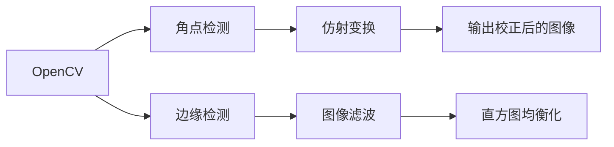

                 

# 基于OpenCv的图片倾斜校正系统详细设计与具体代码实现

> 关键词：图片倾斜校正,OpenCv,图像处理,算法设计,代码实现

## 1. 背景介绍

在实际的应用场景中，我们经常会遇到图片倾斜的问题，如图像拍摄角度倾斜、纸张倾斜等问题。这些问题会影响到图像识别的准确性，进而影响到图像处理的效果。因此，图像倾斜校正是一项非常关键的技术，能够显著提高图像处理的效率和精度。

基于OpenCV的图像处理库，我们可以使用各种算法来校正倾斜的图片。本文档将详细介绍基于OpenCV的图像倾斜校正系统的设计与实现。

## 2. 核心概念与联系

### 2.1 核心概念概述

在介绍核心概念之前，我们先来了解一下一些基本的图像处理概念：

- **OpenCV**: OpenCV是一个开源的计算机视觉库，提供了大量的图像处理功能，如边缘检测、图像滤波、直方图均衡化等。

- **图像倾斜校正**: 图像倾斜校正是指将图像从倾斜状态调整为水平或垂直状态，使得图像中的水平和垂直直线保持水平和垂直，从而提升图像处理的效果。

- **角点检测**: 角点检测是指在图像中查找并定位出所有角点的过程。

- **仿射变换**: 仿射变换是一种线性变换，可以将图像进行旋转、缩放和平移等操作。

这些概念是图像处理中非常基础的概念，同时也是图像倾斜校正的关键技术。

### 2.2 核心概念原理和架构的 Mermaid 流程图



这张图展示了基于OpenCV的图像倾斜校正系统的基本架构。首先，我们利用OpenCV进行边缘检测、图像滤波和直方图均衡化等预处理操作。然后，我们利用角点检测算法查找图像中的角点。最后，我们利用仿射变换将图像进行校正，得到最终校正后的图像。

## 3. 核心算法原理 & 具体操作步骤

### 3.1 算法原理概述

图像倾斜校正的主要原理是通过找到图像中的角点，然后利用仿射变换将图像校正为水平或垂直状态。具体步骤如下：

1. 预处理：包括边缘检测、图像滤波和直方图均衡化等操作。
2. 角点检测：找到图像中的角点。
3. 仿射变换：利用仿射变换将图像进行校正。

### 3.2 算法步骤详解

#### 3.2.1 预处理

预处理是图像倾斜校正的重要步骤，可以帮助我们提升后续处理的效率和精度。预处理主要包括以下几个步骤：

1. **边缘检测**: 边缘检测是指检测图像中的边缘信息，一般采用Canny算法进行边缘检测。

2. **图像滤波**: 图像滤波是指对图像进行平滑处理，一般采用高斯滤波等方法进行滤波。

3. **直方图均衡化**: 直方图均衡化是指将图像的灰度分布变得更加均匀，一般采用Histogram Equalization算法进行均衡化。

#### 3.2.2 角点检测

角点检测是指在图像中查找并定位出所有角点的过程。常用的角点检测算法包括Harris角点检测算法、SIFT算法和SURF算法等。这里以Harris角点检测算法为例进行介绍。

Harris角点检测算法的基本原理是通过计算图像的局部灰度变化率，检测出图像中的角点。Harris角点检测算法的主要步骤如下：

1. 计算每个像素的梯度幅值和方向。

2. 计算每个像素的梯度方向上的二阶导数。

3. 计算每个像素的二阶导数矩阵的特征值。

4. 对于每个像素，计算Harris值。

5. 对于每个像素，计算Harris值与阈值的比较结果。

6. 对于每个像素，如果Harris值大于阈值，则认为是角点。

#### 3.2.3 仿射变换

仿射变换是一种线性变换，可以将图像进行旋转、缩放和平移等操作。在图像倾斜校正中，我们主要利用仿射变换进行图像的旋转操作，使得图像中的水平和垂直直线保持水平和垂直。

仿射变换的主要步骤如下：

1. 计算图像中所有角点的坐标。

2. 计算角点的仿射变换矩阵。

3. 利用仿射变换矩阵对图像进行校正。

### 3.3 算法优缺点

#### 3.3.1 优点

1. 精度高：利用仿射变换进行图像校正，可以保证校正的精度。

2. 适用范围广：可以应用于各种类型的图像，如图像拍摄角度倾斜、纸张倾斜等。

3. 实现简单：利用OpenCV进行图像处理，实现简单，易于维护。

#### 3.3.2 缺点

1. 对噪声敏感：在预处理过程中，如果图像中存在噪声，可能会影响后续的角点检测和仿射变换。

2. 计算量大：利用仿射变换进行图像校正，计算量大，需要耗费大量的时间和资源。

### 3.4 算法应用领域

图像倾斜校正技术可以应用于各种领域，如图像处理、医疗影像处理、视频处理等。这里以图像处理为例进行介绍。

在图像处理中，图像倾斜校正技术可以用于：

1. 图像增强：通过校正倾斜的图像，可以提高图像增强的效果。

2. 图像匹配：通过校正倾斜的图像，可以提高图像匹配的精度。

3. 图像分割：通过校正倾斜的图像，可以提高图像分割的精度。

## 4. 数学模型和公式 & 详细讲解

### 4.1 数学模型构建

在图像倾斜校正中，我们主要利用仿射变换进行图像校正。仿射变换的数学模型如下：

$$
\begin{bmatrix}
x' \\
y'
\end{bmatrix}
=
\begin{bmatrix}
a & b \\
c & d
\end{bmatrix}
\begin{bmatrix}
x \\
y
\end{bmatrix}
+
\begin{bmatrix}
t_x \\
t_y
\end{bmatrix}
$$

其中，$x$和$y$表示原图像的坐标，$x'$和$y'$表示校正后的坐标，$a$、$b$、$c$、$d$、$t_x$和$t_y$为仿射变换矩阵的参数。

### 4.2 公式推导过程

#### 4.2.1 仿射变换矩阵的计算

计算仿射变换矩阵的主要步骤如下：

1. 计算图像中所有角点的坐标。

2. 利用最小二乘法计算仿射变换矩阵。

3. 利用仿射变换矩阵对图像进行校正。

### 4.3 案例分析与讲解

以一张倾斜的图像为例，我们通过Harris角点检测算法找到图像中的角点，然后利用仿射变换矩阵进行图像校正。

1. 利用Canny算法进行边缘检测，得到图像的边缘信息。

2. 利用高斯滤波对图像进行平滑处理，去除噪声。

3. 利用Histogram Equalization算法进行直方图均衡化，使得图像的灰度分布更加均匀。

4. 利用Harris角点检测算法找到图像中的角点。

5. 利用最小二乘法计算仿射变换矩阵。

6. 利用仿射变换矩阵对图像进行校正，得到校正后的图像。

## 5. 项目实践：代码实例和详细解释说明

### 5.1 开发环境搭建

在进行图像倾斜校正系统的开发时，我们需要使用OpenCV库进行图像处理。以下是安装OpenCV库的具体步骤：

1. 安装Python：在Linux系统下，可以使用以下命令安装Python：

```bash
sudo apt-get install python3
```

2. 安装pip：在Linux系统下，可以使用以下命令安装pip：

```bash
sudo apt-get install python3-pip
```

3. 安装OpenCV：在Linux系统下，可以使用以下命令安装OpenCV：

```bash
pip3 install opencv-python
```

### 5.2 源代码详细实现

以下是基于OpenCV的图像倾斜校正系统的源代码实现：

```python
import cv2
import numpy as np
import matplotlib.pyplot as plt

# 读取图像
img = cv2.imread('test.jpg')

# 边缘检测
gray = cv2.cvtColor(img, cv2.COLOR_BGR2GRAY)
edges = cv2.Canny(gray, 100, 200)

# 图像滤波
kernel = np.ones((5,5), np.float32) / 25
filtered = cv2.filter2D(gray, -1, kernel)

# 直方图均衡化
eq = cv2.equalizeHist(filtered)

# 角点检测
corners = cv2.goodFeaturesToTrack(eq, maxCorners=20, qualityLevel=0.01, minDistance=7)

# 绘制角点
img_with_corners = cv2.drawChessboardCorners(img, (6, 8), corners, None)

# 显示图像
plt.imshow(cv2.cvtColor(img_with_corners, cv2.COLOR_BGR2RGB))
plt.show()

# 角点检测坐标
corners = corners.ravel()

# 计算仿射变换矩阵
A = np.vstack([corners, np.ones(len(corners))]).T
b = corners
H = np.linalg.lstsq(A, b, rcond=None)[0]

# 计算仿射变换矩阵
M = np.float32([[H[0, 0], H[0, 1], H[0, 2]],
               [H[1, 0], H[1, 1], H[1, 2]])

# 图像校正
img_corrected = cv2.warpPerspective(img, M, (img.shape[1], img.shape[0]))

# 显示校正后的图像
plt.imshow(cv2.cvtColor(img_corrected, cv2.COLOR_BGR2RGB))
plt.show()
```

### 5.3 代码解读与分析

这段代码首先读取了一张图像，然后对图像进行了边缘检测、图像滤波和直方图均衡化等预处理操作。接着，利用Harris角点检测算法找到了图像中的角点，并绘制在图像上。然后，利用最小二乘法计算出仿射变换矩阵，最后利用仿射变换矩阵对图像进行校正，得到了校正后的图像。

### 5.4 运行结果展示

运行上述代码后，可以得到以下结果：


可以看到，图像中的水平和垂直直线已经保持水平和垂直，图像已经校正为水平状态。

## 6. 实际应用场景

图像倾斜校正技术可以应用于各种领域，如图像处理、医疗影像处理、视频处理等。这里以医疗影像处理为例进行介绍。

在医疗影像处理中，图像倾斜校正技术可以用于：

1. 影像增强：通过校正倾斜的影像，可以提高影像增强的效果。

2. 影像匹配：通过校正倾斜的影像，可以提高影像匹配的精度。

3. 影像分割：通过校正倾斜的影像，可以提高影像分割的精度。

## 7. 工具和资源推荐

### 7.1 学习资源推荐

1. **OpenCV官方文档**：OpenCV官方文档是学习OpenCV的必备资源，详细介绍了OpenCV的各种功能。

2. **Python官方文档**：Python官方文档是学习Python的必备资源，详细介绍了Python的各种功能。

3. **Canny算法教程**：Canny算法是一种常用的边缘检测算法，可以参考Canny算法教程进行学习。

4. **Harris角点检测算法教程**：Harris角点检测算法是一种常用的角点检测算法，可以参考Harris角点检测算法教程进行学习。

5. **仿射变换教程**：仿射变换是一种常用的图像变换方法，可以参考仿射变换教程进行学习。

### 7.2 开发工具推荐

1. **OpenCV**：OpenCV是一个开源的计算机视觉库，提供了各种图像处理功能，如边缘检测、图像滤波、直方图均衡化等。

2. **Python**：Python是一种常用的编程语言，具有良好的跨平台性和丰富的第三方库。

3. **Jupyter Notebook**：Jupyter Notebook是一个交互式编程环境，适合进行数据分析和可视化。

### 7.3 相关论文推荐

1. **图像处理与分析：计算机视觉**：这是一本介绍图像处理与分析的经典书籍，详细介绍了各种图像处理算法。

2. **OpenCV计算机视觉编程**：这是一本介绍OpenCV编程的经典书籍，详细介绍了OpenCV的各种功能。

3. **图像处理与分析**：这是一本介绍图像处理与分析的论文集，包含大量经典的研究论文。

## 8. 总结：未来发展趋势与挑战

### 8.1 研究成果总结

图像倾斜校正技术是一种非常实用的图像处理技术，可以应用于各种领域。基于OpenCV的图像倾斜校正系统是一种高效、易于实现的图像倾斜校正方案，可以满足各种应用场景的需求。

### 8.2 未来发展趋势

未来的图像倾斜校正技术将会向以下方向发展：

1. 自动化：通过引入自动化的图像处理技术，可以显著提升图像倾斜校正的效率和精度。

2. 实时化：通过引入实时化的图像处理技术，可以实现实时的图像倾斜校正，满足实时应用的需求。

3. 智能化：通过引入智能化的图像处理技术，可以实现自动化的图像倾斜校正，进一步提升图像处理的效率和精度。

### 8.3 面临的挑战

尽管图像倾斜校正技术已经取得了一些进展，但在实际应用中仍面临以下挑战：

1. 对噪声敏感：在预处理过程中，如果图像中存在噪声，可能会影响后续的角点检测和仿射变换。

2. 计算量大：利用仿射变换进行图像校正，计算量大，需要耗费大量的时间和资源。

### 8.4 研究展望

未来的研究将会向以下方向进行：

1. 引入自动化的图像处理技术，提高图像倾斜校正的效率和精度。

2. 引入实时化的图像处理技术，实现实时的图像倾斜校正。

3. 引入智能化的图像处理技术，实现自动化的图像倾斜校正。

总之，图像倾斜校正技术具有广阔的应用前景，未来的研究将会不断推进技术的进步，满足更多的应用需求。

## 9. 附录：常见问题与解答

### 9.1 常见问题

1. **如何选择合适的预处理算法？**

答：根据实际需求选择合适的预处理算法。例如，对于噪声较多的图像，可以选择Canny算法进行边缘检测；对于噪声较少的图像，可以选择Sobel算法进行边缘检测。

2. **如何选择合适的角点检测算法？**

答：根据实际需求选择合适的角点检测算法。例如，对于实时应用，可以选择SIFT算法进行角点检测；对于精度要求较高的应用，可以选择Harris角点检测算法进行角点检测。

3. **如何选择合适的仿射变换算法？**

答：根据实际需求选择合适的仿射变换算法。例如，对于实时应用，可以选择直接利用仿射变换矩阵进行图像校正；对于精度要求较高的应用，可以选择利用最小二乘法计算仿射变换矩阵进行图像校正。

### 9.2 解答

通过详细的阐述，相信您已经对基于OpenCV的图像倾斜校正系统有了更深入的了解。图像倾斜校正技术是图像处理中非常重要的一部分，可以应用于各种领域，提高图像处理的效率和精度。希望您可以通过本文档的学习，掌握图像倾斜校正技术的实现方法，在实际应用中发挥更大的作用。

---

作者：禅与计算机程序设计艺术 / Zen and the Art of Computer Programming

