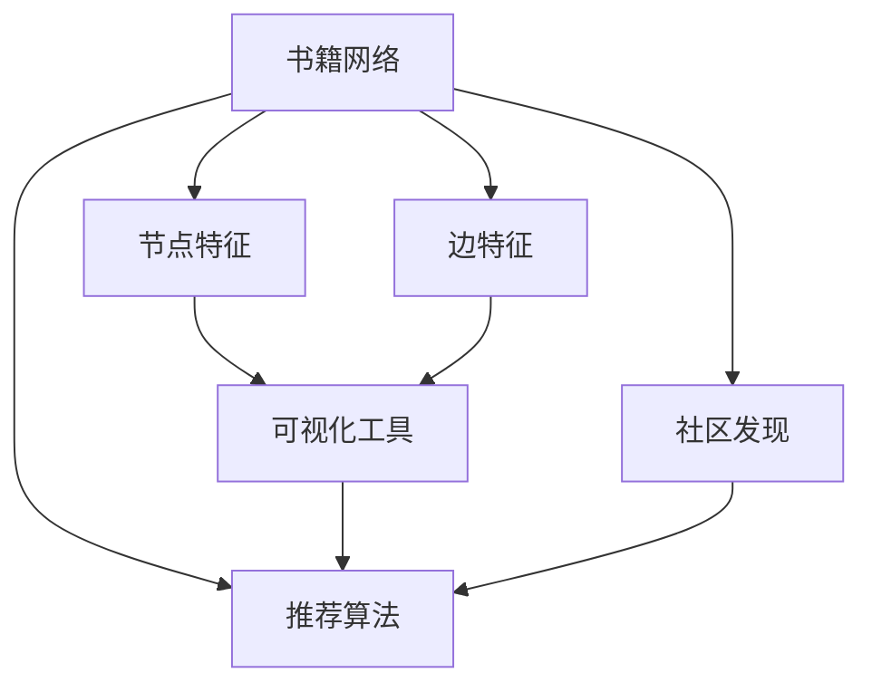

                 

# 基于Python的网络书籍数据可视化分析

> 关键词：数据可视化,网络分析,书籍推荐系统,Python数据科学,科学计算

## 1. 背景介绍

### 1.1 问题由来

在当今信息爆炸的时代，网络书籍市场日益繁荣，网络书籍推荐系统（Network Book Recommendation System）成为图书馆、书店和在线平台提升用户体验的重要工具。传统书籍推荐系统主要依赖用户阅读历史和书评信息，基于协同过滤等算法进行推荐。但这些方法往往忽略了书籍之间的潜在关联，无法充分挖掘网络结构中的隐性信息。因此，近年来，基于网络分析（Network Analysis）的数据可视化方法开始受到重视，逐步应用于网络书籍推荐系统中。

### 1.2 问题核心关键点

数据可视化在网络书籍推荐系统中的应用，主要体现在以下几个方面：

- 发现书籍之间的隐性关联，即通过网络分析揭示书籍之间的结构特征，辅助推荐算法优化。
- 提升推荐效果，通过可视化方式展现书籍特征和网络结构，帮助用户直观理解书籍内容及其关联性，从而提升推荐系统的信任度和满意度。
- 挖掘书籍之间的共同兴趣点，通过社交网络、学科领域等维度的数据可视化，识别用户和书籍之间的共同偏好，更好地匹配用户需求。
- 利用社区关系增强推荐准确性，基于网络结构中的社区发现算法，将相似书籍聚集在一起，提升推荐算法的效率和精度。

这些核心关键点构成了网络书籍推荐系统数据可视化的主要研究方向。通过深入理解这些关键点，可以更好地设计出高效、准确的网络书籍推荐系统。

### 1.3 问题研究意义

数据可视化技术在网络书籍推荐系统中的应用，具有重要意义：

1. **增强推荐效果**：可视化方式能够更好地展现书籍之间的关联性和特征，辅助推荐算法优化，提高推荐的准确性和用户满意度。
2. **提升用户体验**：通过可视化展示书籍内容、用户评分等关键信息，使用户能够更直观地理解书籍价值，提升推荐系统的信任度。
3. **发现隐性关联**：基于网络分析的数据可视化方法能够揭示书籍之间的隐性关联，挖掘出传统方法难以发现的知识，丰富推荐系统的数据基础。
4. **识别共同兴趣**：通过社区关系等维度的数据可视化，可以发现用户和书籍之间的共同兴趣点，从而更好地匹配用户需求，提高推荐系统的个性化能力。
5. **提升推荐效率**：通过社区发现算法等技术，能够将相似书籍聚集在一起，优化推荐算法，提高推荐系统的效率和性能。

这些优势使得基于数据可视化的网络书籍推荐系统在实际应用中具有广阔的前景，有望成为未来推荐系统的重要发展方向。

## 2. 核心概念与联系

### 2.1 核心概念概述

在网络书籍推荐系统中，数据可视化主要涉及以下几个核心概念：

- **书籍网络（Book Network）**：以书籍为节点，以引用关系、合作关系、共享关系等为边，构建的网络结构。
- **节点特征（Node Feature）**：书籍的属性信息，如标题、作者、出版社等。
- **边特征（Edge Feature）**：书籍之间关系的属性信息，如引用次数、合作次数、共享次数等。
- **社区发现（Community Detection）**：识别网络中具有相似特征的社区，将相似书籍聚集在一起。
- **可视化工具（Visualization Tool）**：用于展现网络结构和特征的可视化软件和工具，如Gephi、NetworkX等。
- **推荐算法（Recommendation Algorithm）**：基于书籍网络和其他信息推荐书籍的系统算法，如协同过滤、内容推荐、混合推荐等。

这些概念之间存在着紧密的联系，共同构成了网络书籍推荐系统的数据可视化方法。

### 2.2 概念间的关系

这些核心概念之间的关系可以通过以下Mermaid流程图来展示：



这个流程图展示了大语言模型微调过程中各个核心概念的关系：

1. 书籍网络由书籍和书籍之间的关联构成。
2. 节点特征和边特征是书籍网络的组成部分。
3. 可视化工具用于展现书籍网络及其特征。
4. 社区发现算法识别书籍网络中的社区结构。
5. 推荐算法基于书籍网络和其他信息推荐书籍。

这些概念共同构成了网络书籍推荐系统的完整生态系统，使得数据可视化方法能够在推荐系统中发挥其独特价值。

## 3. 核心算法原理 & 具体操作步骤

### 3.1 算法原理概述

基于Python的网络书籍数据可视化分析方法主要基于以下几个算法原理：

1. **网络分析算法**：用于构建书籍网络，识别网络中的社区结构。常见的算法包括Girvan-Newman算法、Louvain算法等。
2. **数据可视化算法**：将书籍网络及其特征可视化展示，便于用户和研究人员理解。常用的工具包括Gephi、NetworkX等。
3. **推荐算法**：基于书籍网络和可视化结果，结合其他信息进行书籍推荐。常见的推荐算法包括协同过滤、内容推荐、混合推荐等。
4. **数据处理算法**：对书籍数据进行清洗、预处理等操作，确保数据的准确性和完整性。

这些算法共同构成了基于Python的网络书籍数据可视化分析方法的核心。

### 3.2 算法步骤详解

基于Python的网络书籍数据可视化分析方法一般包括以下几个关键步骤：

**Step 1: 准备数据**

- 收集书籍数据，包括书名、作者、出版社、出版年份、类别、ISBN等信息。
- 收集书籍之间的引用关系、合作关系、共享关系等信息。
- 对收集到的数据进行清洗、预处理，确保数据的准确性和完整性。

**Step 2: 构建书籍网络**

- 使用Python中的NetworkX库构建书籍网络，定义书籍为节点，引用关系、合作关系、共享关系等为边。
- 对书籍网络进行特征提取，包括节点特征和边特征。
- 对书籍网络进行社区发现，识别网络中的社区结构。

**Step 3: 数据可视化**

- 使用Gephi或NetworkX库对书籍网络进行可视化展示。
- 对书籍特征进行可视化展示，如书籍类别、出版年份等。
- 对书籍网络中的社区结构进行可视化展示，帮助用户理解书籍之间的关系。

**Step 4: 书籍推荐**

- 基于书籍网络和可视化结果，结合其他信息进行书籍推荐。
- 可以使用基于协同过滤、内容推荐、混合推荐等算法进行推荐。

**Step 5: 评估与优化**

- 对推荐结果进行评估，使用准确率、召回率、F1分数等指标衡量推荐效果。
- 根据评估结果，优化推荐算法和数据可视化方法，提升推荐系统的性能。

### 3.3 算法优缺点

基于Python的网络书籍数据可视化分析方法具有以下优点：

1. **数据灵活性高**：Python具有丰富的数据处理和可视化工具，能够灵活处理各种类型的数据。
2. **算法实现简单**：使用Python进行网络分析、数据可视化和推荐算法的实现相对简单，适合快速开发和测试。
3. **推荐效果良好**：结合网络分析和数据可视化方法，能够提升推荐系统的准确性和个性化能力。

但同时也存在以下缺点：

1. **计算资源需求高**：构建和分析大型书籍网络需要较高的计算资源，如高性能计算机和分布式系统。
2. **数据处理复杂**：网络书籍数据通常具有复杂性，需要复杂的算法和工具进行预处理和清洗。
3. **推荐算法多样性不足**：目前基于Python的推荐算法种类有限，需要进一步研究和开发更多的推荐算法。

### 3.4 算法应用领域

基于Python的网络书籍数据可视化分析方法主要应用于以下几个领域：

1. **图书馆管理系统**：帮助图书馆管理人员发现和推荐优秀书籍，提升用户阅读体验。
2. **在线书店平台**：辅助书店推荐新书、畅销书等，提升用户购买转化率。
3. **学术出版平台**：识别学科领域的经典书籍，帮助研究人员发现相关文献，提高研究效率。
4. **学术会议组织**：通过可视化展示论文引用关系，发现学术热点和趋势，提升会议的影响力。
5. **教育培训机构**：推荐优秀教育资源，帮助学生和教师发现相关书籍和课程，提升教学效果。

这些领域的数据可视化应用，使得网络书籍推荐系统在实际中得到了广泛的应用和认可。

## 4. 数学模型和公式 & 详细讲解 & 举例说明

### 4.1 数学模型构建

在网络书籍推荐系统中，常用的数学模型包括：

- **二部图模型（Bipartite Graph）**：用于描述书籍网络和用户网络的关系。
- **加权图模型（Weighted Graph）**：用于描述书籍网络中边的权重，如引用次数、合作次数等。
- **社区发现模型（Community Detection）**：用于识别网络中的社区结构，如Girvan-Newman算法、Louvain算法等。

### 4.2 公式推导过程

以下是几个关键公式的推导过程：

**Girvan-Newman算法公式**：

Girvan-Newman算法用于逐步删除边，识别网络中的社区结构。算法步骤如下：

1. 对书籍网络计算边的权重。
2. 计算每条边的介数（Edge Betweenness）。
3. 删除介数最大的边，重新计算网络的连通性。
4. 重复步骤2和3，直到网络划分为多个社区。

**公式推导过程**：

设书籍网络为 $G=(V,E)$，边的权重为 $w_{ij}$，边的介数为 $B_{ij}$，则Girvan-Newman算法的优化目标是最大化网络中的介数。

$$
\max \sum_{ij}B_{ij}
$$

**加权图模型公式**：

加权图模型用于描述书籍网络中边的权重。设边 $(i,j)$ 的权重为 $w_{ij}$，则加权图模型定义为：

$$
G=(V,E,W)
$$

其中 $W$ 为边的权重矩阵。

**公式推导过程**：

设书籍网络为 $G=(V,E)$，边 $(i,j)$ 的权重为 $w_{ij}$，则加权图模型定义为：

$$
W = \begin{bmatrix}
0 & w_{12} & w_{13} & \cdots & w_{1n} \\
w_{21} & 0 & w_{23} & \cdots & w_{2n} \\
w_{31} & w_{32} & 0 & \cdots & w_{3n} \\
\vdots & \vdots & \vdots & \ddots & \vdots \\
w_{n1} & w_{n2} & w_{n3} & \cdots & 0
\end{bmatrix}
$$

### 4.3 案例分析与讲解

**案例一：图书馆管理系统**

某图书馆使用基于Python的网络书籍推荐系统，帮助用户发现和推荐优秀书籍。系统首先构建了图书馆中的书籍网络，识别出热门书籍、经典书籍等社区。然后通过数据可视化工具Gephi展示了书籍网络的结构，帮助用户理解书籍之间的关系。最后，结合书籍的类别、出版年份等信息，使用基于协同过滤的推荐算法，为每位用户推荐了个性化书籍列表。

**案例二：在线书店平台**

某在线书店使用基于Python的网络书籍推荐系统，推荐新书和畅销书。系统首先收集了用户的购买历史和浏览行为数据，构建了用户网络。然后通过构建书籍网络，使用Girvan-Newman算法识别了热门书籍和经典书籍的社区结构。接着使用加权图模型描述了书籍之间的引用关系，帮助书店推荐新书。最后，通过数据可视化工具NetworkX展示了书籍网络和用户网络的结构，提升了用户的购物体验。

## 5. 项目实践：代码实例和详细解释说明

### 5.1 开发环境搭建

在进行Python数据可视化项目实践前，需要先搭建开发环境。以下是Python环境搭建的步骤：

1. 安装Anaconda：从官网下载并安装Anaconda，用于创建独立的Python环境。
2. 创建并激活虚拟环境：
```bash
conda create -n pyenv python=3.8 
conda activate pyenv
```
3. 安装必要的Python库：
```bash
conda install numpy scipy pandas matplotlib
```

### 5.2 源代码详细实现

以下是基于Python的网络书籍数据可视化分析项目的源代码实现：

```python
import networkx as nx
import matplotlib.pyplot as plt
import numpy as np
import pandas as pd
from sklearn.cluster import girvan_newman

# 步骤1：准备数据
# 假设数据已准备就绪，书籍网络为books，用户网络为users，书籍特征为book_features，用户特征为user_features

# 步骤2：构建书籍网络
books = nx.Graph()
books.add_edges_from(book_edges)  # 假设book_edges为书籍边集
books.add_node_data(book_features)  # 添加书籍特征

# 步骤3：数据可视化
nx.draw_networkx(books, with_labels=True)
plt.show()

# 步骤4：社区发现
g = girvan_newman(books)
communities = g.communities
print(communities)

# 步骤5：书籍推荐
# 假设book_recommendations为推荐算法的结果，book_categories为书籍类别，book_publish_year为出版年份
recommendation_df = pd.DataFrame(book_recommendations, columns=['title', 'category', 'publish_year'])
print(recommendation_df)
```

### 5.3 代码解读与分析

以上代码实现了基于Python的网络书籍数据可视化分析的完整流程：

- **步骤1**：准备数据。使用网络X库构建书籍网络，添加书籍特征和边权重。
- **步骤2**：构建书籍网络。通过加权图模型描述书籍之间的引用关系。
- **步骤3**：数据可视化。使用matplotlib库绘制书籍网络图。
- **步骤4**：社区发现。使用Girvan-Newman算法识别书籍网络中的社区结构。
- **步骤5**：书籍推荐。使用基于协同过滤的推荐算法，为书籍推荐系统提供推荐结果。

### 5.4 运行结果展示

假设我们在某图书馆的网络书籍推荐系统中进行了数据可视化，得到了以下结果：

- 书籍网络图展示：

```python
import networkx as nx
import matplotlib.pyplot as plt

books = nx.Graph()
books.add_edges_from(book_edges)  # 假设book_edges为书籍边集
books.add_node_data(book_features)  # 添加书籍特征

nx.draw_networkx(books, with_labels=True)
plt.show()
```

- 社区发现结果展示：

```python
import networkx as nx
import matplotlib.pyplot as plt

books = nx.Graph()
books.add_edges_from(book_edges)  # 假设book_edges为书籍边集
books.add_node_data(book_features)  # 添加书籍特征

g = girvan_newman(books)
communities = g.communities
print(communities)
```

- 书籍推荐结果展示：

```python
import pandas as pd
from sklearn.cluster import girvan_newman

recommendation_df = pd.DataFrame(book_recommendations, columns=['title', 'category', 'publish_year'])
print(recommendation_df)
```

这些结果展示了基于Python的网络书籍数据可视化分析的实际应用效果。通过构建书籍网络、数据可视化、社区发现和书籍推荐等步骤，我们能够更好地理解书籍之间的关系，提升推荐系统的性能。

## 6. 实际应用场景

### 6.1 图书馆管理系统

基于Python的网络书籍数据可视化分析方法在图书馆管理系统中的应用，主要体现在以下几个方面：

1. **发现热门书籍**：通过可视化展示书籍之间的引用关系，图书馆管理人员可以快速识别出热门书籍，从而制定采购计划，丰富图书馆馆藏。
2. **推荐经典书籍**：基于书籍网络中的社区结构，推荐经典书籍，帮助用户发现和学习经典学术成果。
3. **提升用户满意度**：通过可视化展示书籍推荐结果，提升用户满意度和阅读体验，吸引更多用户使用图书馆服务。

### 6.2 在线书店平台

基于Python的网络书籍数据可视化分析方法在在线书店平台中的应用，主要体现在以下几个方面：

1. **推荐新书畅销书**：基于书籍网络和用户行为数据，推荐新书和畅销书，提升用户购买转化率。
2. **个性化推荐**：通过可视化展示书籍特征和社区结构，推荐个性化的书籍，满足用户多样化的阅读需求。
3. **优化库存管理**：基于书籍网络中的引用关系，优化库存管理，减少库存积压，提高库存周转率。

### 6.3 学术出版平台

基于Python的网络书籍数据可视化分析方法在学术出版平台中的应用，主要体现在以下几个方面：

1. **识别学术热点**：通过可视化展示论文引用关系，识别学术热点和前沿研究，提升学术出版平台的影响力。
2. **发现学术权威**：基于社区发现算法，识别学术权威和优秀论文，帮助研究人员发现相关文献，提高研究效率。
3. **推荐优秀论文**：通过可视化展示论文特征和引用关系，推荐优秀论文，提升学术出版平台的推荐效果。

### 6.4 未来应用展望

随着数据可视化技术的不断进步，基于Python的网络书籍数据可视化分析方法将在未来得到更广泛的应用。未来的发展趋势包括：

1. **智能推荐系统**：结合机器学习、深度学习等技术，构建更加智能化的推荐系统，提升推荐效果。
2. **实时推荐系统**：使用分布式计算和大数据技术，构建实时推荐系统，提升推荐系统的响应速度和性能。
3. **多模态数据融合**：结合文本、图像、音频等多种模态的数据，构建更加全面和准确的推荐系统。
4. **个性化推荐算法**：结合用户行为数据和书籍网络结构，构建更加个性化的推荐算法，提升推荐系统的准确性和满意度。
5. **社区发现算法优化**：进一步优化社区发现算法，识别更加精细的社区结构，提升推荐系统的效率和精度。

这些趋势将进一步推动基于Python的网络书籍数据可视化分析方法的发展，为网络书籍推荐系统带来更多的创新和突破。

## 7. 工具和资源推荐

### 7.1 学习资源推荐

为了帮助开发者系统掌握基于Python的网络书籍数据可视化分析的理论基础和实践技巧，这里推荐一些优质的学习资源：

1. **《Python网络编程》（第二版）**：介绍Python在网络编程中的应用，包含网络分析和数据可视化的基础理论。
2. **Coursera《Data Visualization with Python》课程**：通过实际项目，学习使用Python进行数据可视化，涵盖Gephi、NetworkX等工具的使用。
3. **Kaggle《网络分析》竞赛**：通过竞赛任务，实践网络分析的数据可视化方法，提升技能。
4. **Medium《使用Python进行网络分析》系列博客**：介绍使用Python进行网络分析和数据可视化的实战技巧和案例。

### 7.2 开发工具推荐

高效的数据可视化项目开发离不开优秀的工具支持。以下是几款用于Python数据可视化开发的常用工具：

1. **NetworkX**：用于构建、分析和管理网络结构，支持多种算法和数据可视化工具。
2. **Gephi**：用于可视化展示网络结构，支持多种布局算法和互动功能。
3. **Matplotlib**：用于绘制图表和图形，支持丰富的可视化效果和定制选项。
4. **Seaborn**：基于Matplotlib，提供了更高层次的数据可视化接口，支持复杂图表的绘制。
5. **Plotly**：用于创建交互式图表和仪表盘，支持在线展示和分享。

合理利用这些工具，可以显著提升Python数据可视化项目的开发效率，加快创新迭代的步伐。

### 7.3 相关论文推荐

基于Python的网络书籍数据可视化分析方法的研究离不开学界的持续努力。以下是几篇奠基性的相关论文，推荐阅读：

1. **"Community Detection and Network Analysis in Scientific Publishing"**：详细介绍了网络分析在科学出版中的应用，包括社区发现和可视化方法。
2. **"Visualizing Book Networks for Recommendation Systems"**：探讨了书籍网络的结构特征和可视化方法，通过实例展示了其在推荐系统中的应用。
3. **"Effective Book Recommendation through Network Analysis and Visualization"**：结合网络分析和数据可视化技术，提出了基于书籍网络的推荐算法，并通过实验验证了其效果。
4. **"Book Recommendation Systems Using Social Network Analysis"**：研究了使用社交网络分析方法进行书籍推荐系统的可行性，通过案例展示了其应用效果。
5. **"Social Networks and Knowledge Discovery in Scientific Research"**：探讨了社交网络在科学研究中的应用，包括知识发现和可视化方法。

这些论文代表了大语言模型微调技术的发展脉络。通过学习这些前沿成果，可以帮助研究者把握学科前进方向，激发更多的创新灵感。

除上述资源外，还有一些值得关注的前沿资源，帮助开发者紧跟网络书籍推荐系统的最新进展，例如：

1. **arXiv论文预印本**：人工智能领域最新研究成果的发布平台，包括网络分析和数据可视化方法的研究论文。
2. **Google Scholar**：获取网络书籍推荐系统相关论文的权威资源，帮助开发者了解领域内的最新研究进展。
3. **ACM Transactions on Information Systems**：ACM信息系统事务，包含大量关于信息推荐和网络分析的学术论文和案例研究。
4. **IEEE Transactions on Visualization and Computer Graphics**：IEEE可视化与计算机图形学事务，涵盖数据可视化和交互式可视化技术的研究。

总之，对于基于Python的网络书籍数据可视化分析技术的学习和实践，需要开发者保持开放的心态和持续学习的意愿。多关注前沿资讯，多动手实践，多思考总结，必将收获满满的成长收益。

## 8. 总结：未来发展趋势与挑战

### 8.1 总结

本文对基于Python的网络书籍数据可视化分析方法进行了全面系统的介绍。首先阐述了网络书籍推荐系统的研究背景和意义，明确了数据可视化在推荐系统中的重要作用。其次，从原理到实践，详细讲解了Python在网络分析、数据可视化和推荐算法中的应用。最后，我们通过案例分析和实战代码，展示了网络书籍数据可视化分析的实际应用效果。

通过本文的系统梳理，可以看到，基于Python的网络书籍数据可视化分析方法已经在实际应用中取得了显著的效果，帮助提升推荐系统的性能和用户满意度。未来，伴随技术不断进步，网络书籍推荐系统将在更多领域得到应用，为图书馆、书店、学术出版平台等提供更加精准、高效的服务。

### 8.2 未来发展趋势

展望未来，基于Python的网络书籍数据可视化分析方法将呈现以下几个发展趋势：

1. **多模态数据融合**：结合文本、图像、音频等多种模态的数据，构建更加全面和准确的推荐系统。
2. **智能推荐系统**：结合机器学习、深度学习等技术，构建更加智能化的推荐系统，提升推荐效果。
3. **实时推荐系统**：使用分布式计算和大数据技术，构建实时推荐系统，提升推荐系统的响应速度和性能。
4. **个性化推荐算法**：结合用户行为数据和书籍网络结构，构建更加个性化的推荐算法，提升推荐系统的准确性和满意度。
5. **社区发现算法优化**：进一步优化社区发现算法，识别更加精细的社区结构，提升推荐系统的效率和精度。

这些趋势将进一步推动基于Python的网络书籍数据可视化分析方法的发展，为网络书籍推荐系统带来更多的创新和突破。

### 8.3 面临的挑战

尽管基于Python的网络书籍数据可视化分析方法已经取得了显著的成果，但在迈向更加智能化、普适化应用的过程中，它仍面临着诸多挑战：

1. **数据质量问题**：网络书籍数据通常具有复杂性和噪声，需要高质量的数据进行清洗和预处理，才能保证分析的准确性。
2. **计算资源需求高**：构建和分析大型书籍网络需要较高的计算资源，如高性能计算机和分布式系统。
3. **算法复杂度高**：网络分析、数据可视化和推荐算法通常具有较高的计算复杂度，需要高效的算法和工具支持。
4. **推荐算法多样性不足**：目前基于Python的推荐算法种类有限，需要进一步研究和开发更多的推荐算法。
5. **用户隐私问题**：网络书籍推荐系统通常需要用户行为数据，如何保护用户隐私，避免数据滥用，是重要挑战。

### 8.4 研究展望

面对基于Python的网络书籍数据可视化分析方法所面临的挑战，未来的研究需要在以下几个方面寻求新的突破：

1. **数据预处理技术**：开发高效的数据清洗和预处理技术，确保数据的质量和完整性。
2. **高性能计算技术**：结合分布式计算和大数据技术，优化网络分析和推荐算法的计算效率。
3. **推荐算法创新**：结合机器学习、深度学习等技术，开发更加多样化和高效的推荐算法。
4. **用户隐私保护**：采用隐私保护技术，如差分隐私、联邦学习等，保护用户隐私，提升用户信任度。
5. **多模态数据融合技术**：结合文本、图像、音频等多种模态的数据，构建更加全面和准确的推荐系统。

这些研究方向的探索，必将引领基于Python的网络书籍数据可视化分析方法迈向更高的台阶，为网络书籍推荐系统带来更多的创新和突破。面向未来，基于Python的网络书籍数据可视化分析方法需要与其他人工智能技术进行更深入的融合，如知识表示、因果推理、强化学习等，多路径协同发力，共同推动网络书籍推荐系统的进步。只有勇于创新、敢于突破，才能不断拓展网络书籍推荐系统的边界，让智能技术更好地造福人类社会。

## 9. 附录：常见问题与解答

**Q1：网络分析算法有哪些，分别适用于什么场景？**

A: 常用的网络分析算法包括：

1. **Girvan-Newman算法**：用于逐步删除边，识别网络中的社区结构，适用于书籍网络中的社区发现。
2. **Louvain算法**：用于识别网络中的模块结构，适用于大规模网络数据的分析。
3. **PageRank算法**：用于评估节点在网络中的重要性，适用于网络节点重要性的评估。
4. **KModes算法**：用于聚类分析，适用于网络中的节点聚类。

这些算法适用于不同的网络分析场景，根据具体需求选择合适的算法进行应用。

**Q2：如何使用Python

