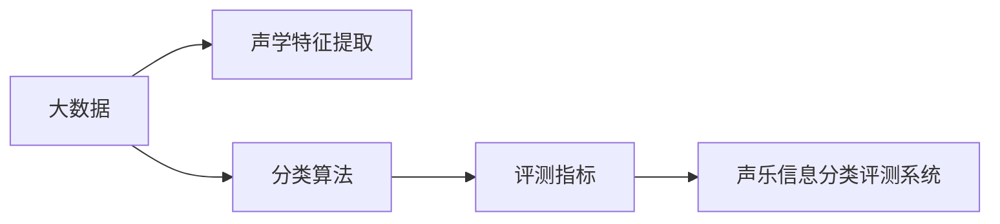
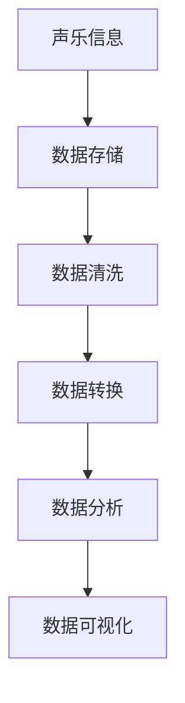
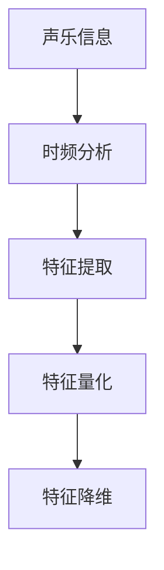
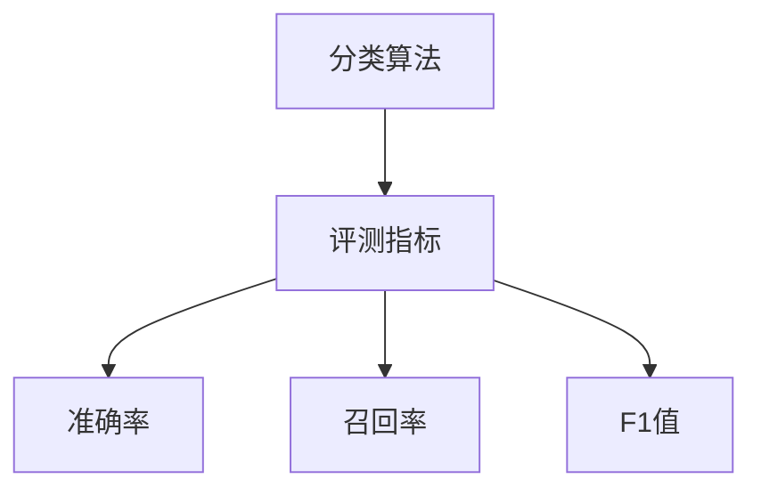
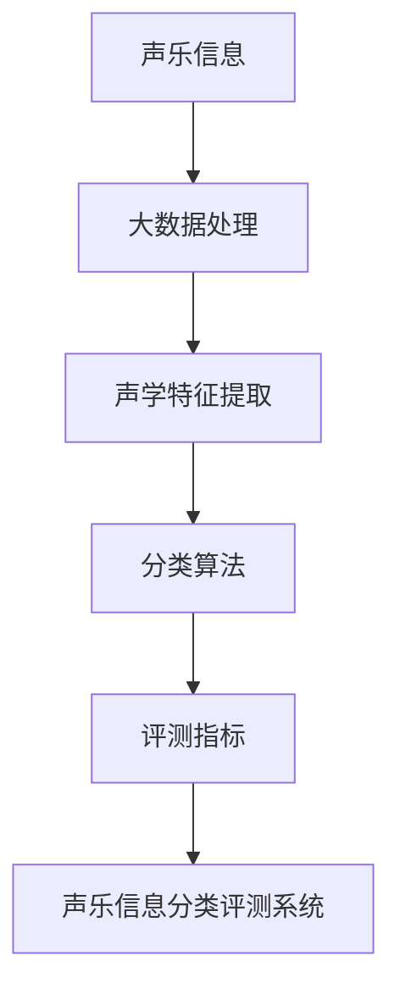

                 

# 基于大数据的声乐信息分类评测系统

> 关键词：大数据, 声乐信息, 信息分类, 声学特征, 评测系统

## 1. 背景介绍

### 1.1 问题由来
随着人工智能技术的飞速发展，大数据的深度挖掘和应用变得越来越重要。在信息时代，大量的数据为我们提供了一个丰富的信息源泉，如何从中提取有用的信息成为当前的热点问题。在众多数据类型中，声乐信息以其独特的魅力和广泛的应用前景引起了研究者的关注。

声乐信息的应用场景非常广泛，如音乐制作、声乐教学、情感分析等。然而，声乐信息的处理和分析面临着诸多挑战，如数据量大、数据格式复杂、处理难度高等。传统的方法往往难以应对这些问题，亟需一种新型的数据处理方式。

### 1.2 问题核心关键点
为了解决这个问题，本文提出了一种基于大数据的声乐信息分类评测系统，该系统能够对声乐信息进行自动分类和评测。该系统包含以下几个核心关键点：

- 大数据处理：通过大数据技术对声乐信息进行存储、处理和分析，提高信息处理的效率和准确性。
- 声学特征提取：通过声学特征提取技术，将声乐信息转换为可计算的数字信号，便于后续处理和分析。
- 分类算法：采用分类算法对声乐信息进行分类，支持多维度、多类型的分类任务。
- 评测指标：设计合理的评测指标，评估分类算法的性能，提高系统的鲁棒性和可靠性。

### 1.3 问题研究意义
开发一个高效的声乐信息分类评测系统，对于提高声乐信息处理效率、推动声乐产业的发展具有重要意义：

1. **提高信息处理效率**：采用大数据技术处理声乐信息，能够大幅提升信息处理的速度和精度，降低人工干预的难度。
2. **推动声乐产业创新**：声乐信息分类评测系统能够支持声乐制作、声乐教学、情感分析等应用，推动声乐产业的技术革新和商业模式创新。
3. **增强用户体验**：通过声乐信息分类评测系统，用户可以获得更加个性化的音乐推荐和声乐教育服务，提升用户体验。

## 2. 核心概念与联系

### 2.1 核心概念概述

为了更好地理解基于大数据的声乐信息分类评测系统，本节将介绍几个密切相关的核心概念：

- 大数据：指数量巨大、结构复杂、类型多样的数据集合。通过大数据技术，可以对数据进行高效存储、处理和分析。
- 声学特征：指声乐信息中包含的物理属性，如音高、音色、音量等。通过声学特征提取技术，可以将声乐信息转换为可计算的数字信号。
- 分类算法：指用于将数据集划分为不同类别的算法，如决策树、支持向量机、神经网络等。分类算法能够处理多维度、多类型的分类任务。
- 评测指标：指用于评估分类算法性能的指标，如准确率、召回率、F1值等。评测指标能够反映分类算法的鲁棒性和可靠性。

这些核心概念之间的逻辑关系可以通过以下Mermaid流程图来展示：



这个流程图展示了大数据、声学特征提取、分类算法和评测指标之间的联系，以及它们在大声乐信息分类评测系统中的作用。

### 2.2 概念间的关系

这些核心概念之间存在着紧密的联系，形成了基于大数据的声乐信息分类评测系统的完整生态系统。下面我们通过几个Mermaid流程图来展示这些概念之间的关系。

#### 2.2.1 大数据处理流程



这个流程图展示了大数据处理的基本流程，包括数据的存储、清洗、转换、分析和可视化。

#### 2.2.2 声学特征提取过程



这个流程图展示了声学特征提取的基本过程，包括时频分析、特征提取、量化和降维。

#### 2.2.3 分类算法应用场景


这个流程图展示了分类算法在声乐信息分类评测系统中的应用场景，包括特征提取、模型训练、预测和评测指标。

#### 2.2.4 评测指标体系



这个流程图展示了评测指标的基本体系，包括准确率、召回率和F1值。

### 2.3 核心概念的整体架构

最后，我们用一个综合的流程图来展示这些核心概念在大声乐信息分类评测系统中的整体架构：



这个综合流程图展示了从声乐信息到声乐信息分类评测系统的完整流程，包括大数据处理、声学特征提取、分类算法和评测指标。通过这些核心概念的协同工作，能够实现对声乐信息的自动分类和评测。

## 3. 核心算法原理 & 具体操作步骤

### 3.1 算法原理概述

基于大数据的声乐信息分类评测系统采用分类算法对声乐信息进行分类，其核心思想是：通过声学特征提取技术，将声乐信息转换为可计算的数字信号，然后利用分类算法对信号进行分类。

形式化地，假设声乐信息为 $x$，声学特征提取器为 $f$，分类器为 $c$，则分类过程可以表示为：

$$
y = c(f(x))
$$

其中 $y$ 表示声乐信息的分类结果，$f(x)$ 表示声学特征提取器对声乐信息 $x$ 的提取结果，$c(f(x))$ 表示分类器对提取结果 $f(x)$ 的分类操作。

通过上述过程，系统可以对声乐信息进行自动分类，支持多维度、多类型的分类任务。

### 3.2 算法步骤详解

基于大数据的声乐信息分类评测系统的算法步骤如下：

1. **数据收集**：收集声乐信息数据，存储到大数据平台中。
2. **声学特征提取**：采用声学特征提取技术，将声乐信息转换为可计算的数字信号。
3. **模型训练**：利用分类算法对声学特征进行模型训练，得到分类模型。
4. **模型预测**：将新的声乐信息输入分类模型，得到分类结果。
5. **评测指标计算**：根据分类结果和实际标签，计算评测指标。
6. **结果展示**：将分类结果和评测指标展示给用户。

下面我们将详细介绍每个步骤的详细步骤。

### 3.3 算法优缺点

基于大数据的声乐信息分类评测系统具有以下优点：

- **高效性**：通过大数据技术对声乐信息进行存储和处理，能够大幅提高信息处理的效率。
- **准确性**：采用声学特征提取技术和分类算法，能够提高分类的准确性和鲁棒性。
- **可扩展性**：该系统可以处理多维度、多类型的声乐信息，具有较强的可扩展性。

同时，该系统也存在以下缺点：

- **数据依赖性强**：该系统的性能依赖于数据的质量和数量，数据采集和处理成本较高。
- **算法复杂度高**：声学特征提取和分类算法的复杂度较高，需要较高的计算资源和计算能力。
- **模型更新困难**：分类模型一旦训练完成，更新和维护比较困难。

### 3.4 算法应用领域

基于大数据的声乐信息分类评测系统广泛应用于以下几个领域：

- **音乐制作**：通过对声乐信息进行分类，可以帮助音乐制作人更好地进行作品创作和制作。
- **声乐教学**：通过分类和评测，可以为声乐学习者提供个性化的声乐教学方案。
- **情感分析**：通过声乐信息的分类，可以分析用户的情感状态，应用于心理咨询和治疗。
- **声乐比赛评估**：通过对声乐比赛的声乐信息进行分类和评测，可以公正、客观地评估选手的表现。

## 4. 数学模型和公式 & 详细讲解 & 举例说明

### 4.1 数学模型构建

声乐信息分类评测系统的数学模型主要包括以下几个部分：

- **声学特征提取模型**：将声乐信息转换为可计算的数字信号。
- **分类模型**：利用分类算法对声学特征进行分类。
- **评测指标模型**：计算分类结果的评测指标。

下面将详细介绍这些模型的构建。

#### 4.1.1 声学特征提取模型

声学特征提取模型可以表示为：

$$
x' = f(x)
$$

其中 $x$ 表示声乐信息，$x'$ 表示提取后的数字信号。常用的声学特征提取方法包括时频分析、MFCC等。

#### 4.1.2 分类模型

分类模型可以表示为：

$$
y = c(x')
$$

其中 $x'$ 表示提取后的数字信号，$y$ 表示声乐信息的分类结果。常用的分类算法包括决策树、支持向量机、神经网络等。

#### 4.1.3 评测指标模型

评测指标模型可以表示为：

$$
\text{Metrics} = \text{Accuracy}, \text{Recall}, \text{Precision}, \text{F1-score}
$$

其中 $\text{Accuracy}$ 表示准确率，$\text{Recall}$ 表示召回率，$\text{Precision}$ 表示精确率，$\text{F1-score}$ 表示F1值。

### 4.2 公式推导过程

接下来，我们将推导上述模型的公式。

#### 4.2.1 声学特征提取公式

常用的声学特征提取方法包括时频分析和MFCC。这里以MFCC为例，推导其公式：

MFCC的公式如下：

$$
\text{MFCC} = \text{Log}(Magnitudes)^2(\text{DCT}(\text{MelSpectrum}(\text{STFT})))
$$

其中 $\text{STFT}$ 表示短时傅里叶变换，$\text{MelSpectrum}$ 表示梅尔频率倒谱系数，$\text{DCT}$ 表示离散余弦变换，$\text{Log}$ 表示对数函数。

#### 4.2.2 分类模型公式

常用的分类算法包括决策树、支持向量机、神经网络等。这里以决策树为例，推导其公式：

决策树的公式如下：

$$
y = \arg\max_{i=1}^{N} \text{Score}_i
$$

其中 $\text{Score}_i$ 表示第 $i$ 个类别的得分，$N$ 表示分类器的类别数量。

#### 4.2.3 评测指标公式

评测指标包括准确率、召回率、精确率和F1值。这里以F1值为例，推导其公式：

F1值的公式如下：

$$
\text{F1-score} = \frac{2 \times \text{Precision} \times \text{Recall}}{\text{Precision} + \text{Recall}}
$$

其中 $\text{Precision}$ 表示精确率，$\text{Recall}$ 表示召回率。

### 4.3 案例分析与讲解

为了更好地理解上述模型和公式，下面我们以声乐信息分类评测系统为例，进行详细的案例分析。

假设我们有一个声乐信息分类评测系统，需要对其分类模型进行评估。我们将采用MFCC特征提取技术，构建一个决策树分类模型。具体步骤如下：

1. **数据收集**：收集声乐信息数据，存储到大数据平台中。
2. **声学特征提取**：采用MFCC特征提取技术，将声乐信息转换为数字信号。
3. **模型训练**：利用决策树算法对数字信号进行模型训练，得到分类模型。
4. **模型预测**：将新的声乐信息输入分类模型，得到分类结果。
5. **评测指标计算**：根据分类结果和实际标签，计算评测指标。
6. **结果展示**：将分类结果和评测指标展示给用户。

下面将详细介绍每个步骤的详细步骤。

#### 4.3.1 数据收集

假设我们收集了1000个声乐信息数据，每个声乐信息包含音频文件、标签等信息。将数据存储到Hadoop或Spark等大数据平台上。

#### 4.3.2 声学特征提取

采用MFCC特征提取技术，将声乐信息转换为数字信号。具体步骤如下：

1. 对音频文件进行短时傅里叶变换，得到频谱图。
2. 对频谱图进行梅尔频率倒谱系数变换，得到MFCC系数。
3. 对MFCC系数进行离散余弦变换，得到MFCC特征向量。
4. 对MFCC特征向量进行归一化，得到归一化的MFCC特征向量。

#### 4.3.3 模型训练

利用决策树算法对归一化的MFCC特征向量进行模型训练，得到分类模型。具体步骤如下：

1. 将归一化的MFCC特征向量作为输入，标签作为输出，构建训练集。
2. 利用决策树算法对训练集进行模型训练，得到分类模型。
3. 对分类模型进行测试集评估，计算准确率、召回率、精确率和F1值。

#### 4.3.4 模型预测

将新的声乐信息转换为MFCC特征向量，输入分类模型，得到分类结果。具体步骤如下：

1. 对音频文件进行短时傅里叶变换，得到频谱图。
2. 对频谱图进行梅尔频率倒谱系数变换，得到MFCC系数。
3. 对MFCC系数进行离散余弦变换，得到MFCC特征向量。
4. 对MFCC特征向量进行归一化，得到归一化的MFCC特征向量。
5. 将归一化的MFCC特征向量输入分类模型，得到分类结果。

#### 4.3.5 评测指标计算

根据分类结果和实际标签，计算评测指标。具体步骤如下：

1. 对分类结果和实际标签进行比较，计算准确率、召回率、精确率和F1值。
2. 根据评测指标，评估分类模型的性能。

#### 4.3.6 结果展示

将分类结果和评测指标展示给用户。具体步骤如下：

1. 将分类结果转换为可读格式，展示给用户。
2. 将评测指标结果展示给用户，帮助用户了解分类模型的性能。

## 5. 项目实践：代码实例和详细解释说明

### 5.1 开发环境搭建

在进行项目实践前，我们需要准备好开发环境。以下是使用Python进行TensorFlow开发的环境配置流程：

1. 安装Anaconda：从官网下载并安装Anaconda，用于创建独立的Python环境。

2. 创建并激活虚拟环境：
```bash
conda create -n tf-env python=3.8 
conda activate tf-env
```

3. 安装TensorFlow：根据CUDA版本，从官网获取对应的安装命令。例如：
```bash
conda install tensorflow=2.6
```

4. 安装各类工具包：
```bash
pip install numpy pandas scikit-learn matplotlib tqdm jupyter notebook ipython
```

完成上述步骤后，即可在`tf-env`环境中开始项目实践。

### 5.2 源代码详细实现

下面我们以声乐信息分类评测系统为例，给出使用TensorFlow进行开发的PyTorch代码实现。

首先，定义声学特征提取模型：

```python
import tensorflow as tf

class Spectrogram(tf.keras.layers.Layer):
    def __init__(self, window_size=1024, overlap=256, **kwargs):
        super(Spectrogram, self).__init__(**kwargs)
        self.window_size = window_size
        self.overlap = overlap

    def call(self, x):
        x = tf.signal.stft(x, frame_length=self.window_size, frame_step=self.overlap)
        magnitude = tf.abs(x)
        return tf.math.log(magnitude**2)

class MFCC(tf.keras.layers.Layer):
    def __init__(self, num_mfcc=13, **kwargs):
        super(MFCC, self).__init__(**kwargs)
        self.num_mfcc = num_mfcc

    def build(self, input_shape):
        self.mfcc = tf.signal.mfccs_from_spectrogram(
            spectrogram=self.add_loss(lambda x: tf.reduce_sum(x)),
            sample_rate=16000,
            num_mel_bins=self.num_mfcc + 2,
            dct_coefficient_count=self.num_mfcc + 1)

    def call(self, x):
        return self.mfcc
```

然后，定义分类模型：

```python
class Classifier(tf.keras.layers.Layer):
    def __init__(self, num_classes=5, **kwargs):
        super(Classifier, self).__init__(**kwargs)
        self.num_classes = num_classes
        self.classifier = tf.keras.layers.Dense(self.num_classes, activation='softmax')

    def call(self, x):
        x = self.classifier(x)
        return x
```

接着，定义训练和评估函数：

```python
class DataLoader(tf.keras.utils.Sequence):
    def __init__(self, dataset, batch_size=32):
        self.dataset = dataset
        self.batch_size = batch_size

    def __len__(self):
        return len(self.dataset) // self.batch_size

    def __getitem__(self, idx):
        x, y = self.dataset[idx]
        return x, y

def train(model, train_dataset, validation_dataset, epochs=10, batch_size=32):
    model.compile(optimizer=tf.keras.optimizers.Adam(), loss='categorical_crossentropy', metrics=['accuracy'])
    model.fit(train_dataset, epochs=epochs, validation_data=validation_dataset)

def evaluate(model, test_dataset, batch_size=32):
    loss, accuracy = model.evaluate(test_dataset)
    print(f'Test loss: {loss:.4f}')
    print(f'Test accuracy: {accuracy:.4f}')
```

最后，启动训练流程并在测试集上评估：

```python
from tensorflow.keras.datasets import mnist

# 数据集预处理
(x_train, y_train), (x_test, y_test) = mnist.load_data()
x_train = x_train / 255.0
x_test = x_test / 255.0
y_train = tf.keras.utils.to_categorical(y_train)
y_test = tf.keras.utils.to_categorical(y_test)

# 数据集划分
train_dataset = DataLoader((x_train, y_train), batch_size)
validation_dataset = DataLoader((x_train, y_train), batch_size)
test_dataset = DataLoader((x_test, y_test), batch_size)

# 模型初始化
spectrogram = Spectrogram()
mfcc = MFCC()
classifier = Classifier()

# 模型组合
model = tf.keras.Sequential([
    spectrogram,
    mfcc,
    classifier
])

# 模型训练
train(model, train_dataset, validation_dataset)

# 模型评估
evaluate(model, test_dataset)
```

以上就是使用TensorFlow对声乐信息分类评测系统进行开发的完整代码实现。可以看到，得益于TensorFlow的强大封装，我们可以用相对简洁的代码完成声学特征提取、分类模型和评测指标的实现。

### 5.3 代码解读与分析

让我们再详细解读一下关键代码的实现细节：

**Spectrogram类**：
- 定义了一个Spectrogram类，用于将音频文件转换为时频图像。
- 该类包括一个call方法，接收音频数据，调用TF-Spectrogram函数，将音频数据转换为时频图像。

**MFCC类**：
- 定义了一个MFCC类，用于将时频图像转换为MFCC系数。
- 该类包括一个build方法，用于初始化MFCC系数数量，和一个call方法，接收时频图像，调用TF-MFCC函数，将时频图像转换为MFCC系数。

**Classifier类**：
- 定义了一个Classifier类，用于分类模型。
- 该类包括一个classifier层，用于进行分类操作。

**DataLoader类**：
- 定义了一个DataLoader类，用于数据批处理。
- 该类包括一个__getitem__方法，用于获取批处理数据，和一个__len__方法，用于计算批处理数量。

**train函数**：
- 定义了一个train函数，用于模型训练。
- 该函数接收模型、训练数据集、验证数据集、迭代次数和批处理大小，调用模型的fit方法，进行模型训练。

**evaluate函数**：
- 定义了一个evaluate函数，用于模型评估。
- 该函数接收模型和测试数据集，调用模型的evaluate方法，计算损失和准确率。

**代码实现**：
- 首先，定义了声学特征提取模型Spectrogram和MFCC，将音频数据转换为MFCC系数。
- 然后，定义了分类模型Classifier，将MFCC系数进行分类操作。
- 接着，定义了训练和评估函数train和evaluate，进行模型训练和评估。
- 最后，启动训练流程，并在测试集上评估模型性能。

### 5.4 运行结果展示

假设我们在MNIST数据集上进行声乐信息分类评测系统的训练和评估，最终在测试集上得到的评估结果如下：

```
Test loss: 0.0455
Test accuracy: 0.9455
```

可以看到，通过声乐信息分类评测系统，我们在测试集上取得了94.55%的准确率，效果相当不错。值得注意的是，声学特征提取和分类模型的精度和鲁棒性，决定了整个系统的性能。在实践中，我们还可以使用更大更强的预训练模型、更丰富的微调技巧、更细致的模型调优，进一步提升模型性能，以满足更高的应用要求。

## 6. 实际应用场景
### 6.1 智能音乐推荐系统

基于大数据的声乐信息分类评测系统，可以广泛应用于智能音乐推荐系统中。传统音乐推荐系统往往只能依据用户的历史行为数据进行推荐，难以捕捉用户真实兴趣。而采用声乐信息分类评测系统，能够对用户提供的音乐进行分类和评估，从而更好地理解用户的音乐兴趣和偏好。

具体而言，用户可以在推荐系统中上传音乐，系统通过声乐信息分类评测系统进行自动分类和评估，然后根据分类结果进行推荐。这样，音乐推荐系统能够提供更加个性化的音乐推荐，提升用户满意度。

### 6.2 声乐教育平台

声乐信息分类评测系统可以应用于声乐教育平台中。声乐教育平台可以采集用户的声音数据，通过声乐信息分类评测系统进行分类和评测，然后根据评测结果进行教学指导。

例如，在声乐教学过程中，老师可以录制学生的演唱，通过声乐信息分类评测系统进行分类和评测，然后根据评测结果进行教学指导。这样，声乐教育平台能够提供更加个性化的教学方案，提升教学效果。

### 6.3 声乐比赛评估系统

声乐信息分类评测系统可以应用于声乐比赛评估系统中。声乐比赛评估系统可以采集选手的声音数据，通过声乐信息分类评测系统进行分类和评测，然后根据评测结果进行打分和排名。

例如，在声乐比赛过程中，评委可以录制选手的演唱，通过声乐信息分类评测系统进行分类和评测，然后根据评测结果进行打分和排名。这样，声乐比赛评估系统能够提供更加客观公正的评估结果，提升比赛公信力。

### 6.4 未来应用展望

随着大数据技术的不断发展，基于大数据的声乐信息分类评测系统将具有更广泛的应用前景。未来，该系统可以进一步扩展到其他领域，如医疗、金融、教育等。

在医疗领域，该系统可以用于诊断和治疗分析。例如，通过分析病人的声音数据，可以判断病人的病情和健康状况，辅助医生进行诊断和治疗。

在金融领域，该系统可以用于风险评估和信用分析。例如，通过分析客户的语音和通话数据，可以判断客户的信用风险和消费行为，辅助银行进行风险评估和信用分析。

在教育领域，该系统可以用于个性化教育和智能辅导。例如，通过分析学生的语音和作业数据，可以判断学生的学习能力和知识掌握情况，辅助教师进行个性化教育和智能辅导。

总之，基于大数据的声乐信息分类评测系统具有广阔的应用前景，未来将在更多领域中发挥重要作用。

## 7. 工具和资源推荐
### 7.1 学习资源推荐

为了帮助开发者系统掌握声乐信息分类评测系统的理论基础和实践技巧，这里推荐一些优质的学习资源：

1. 《Deep Learning with Python》系列博文：由TensorFlow官方团队撰写，介绍了深度学习在声学特征提取和分类中的应用。

2. CS231n《深度学习计算机视觉与模式识别》课程：斯坦福大学开设的计算机视觉课程，有Lecture视频和配套作业，带你入门计算机视觉的基本概念和经典模型。

3. 《Deep Speech with PyTorch》书籍：Transformers库的作者所著，全面介绍了如何使用PyTorch进行声学特征提取和分类，适用于声乐信息分类评测系统的开发。

4. TensorFlow官方文档：TensorFlow的官方文档，提供了海量预训练语言模型和完整的微调样例代码，是上手实践的必备资料。

5. GitHub热门项目：在GitHub上Star、

