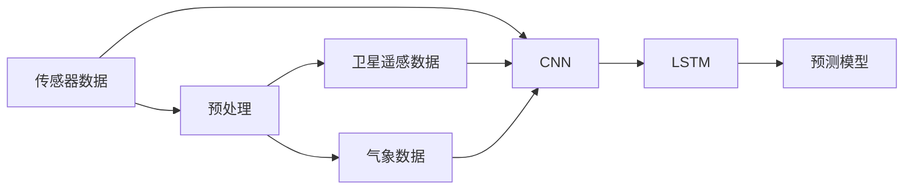

                 

# 基于神经网络的城市空气质量研究

## 1. 背景介绍

随着城市化的快速推进和工业化的不断发展，城市空气质量问题越来越严重，已成为全球面临的重要挑战之一。传统的环境监测方法往往效率低下、成本高昂，难以实时地、全面地获取城市空气质量数据。为此，利用人工智能技术尤其是神经网络模型，来实时监测和预测城市空气质量，成为一种有效且可行的方法。本研究将基于神经网络，对城市空气质量进行深入研究，旨在提供一个高效、准确的空气质量监测系统。

## 2. 核心概念与联系

### 2.1 核心概念概述

本研究涉及以下几个核心概念：

- **城市空气质量（Urban Air Quality）**：指城市中各种污染物如PM2.5、NO2、SO2等的浓度，直接影响居民健康和生活质量。
- **神经网络（Neural Network）**：一种通过训练多层神经元模型来模拟和识别复杂模式的机器学习算法。
- **预测模型（Prediction Model）**：利用历史空气质量数据和环境变量，通过神经网络模型预测未来空气质量的一种技术。
- **实时监测（Real-time Monitoring）**：使用传感器实时获取城市空气质量数据，并进行动态更新和分析的技术。
- **多模态融合（Multi-modal Fusion）**：将多种数据源（如传感器、卫星数据、气象数据等）融合在一起，提供更全面和准确的空气质量信息。

### 2.2 概念间的关系

城市空气质量预测模型涉及传感器数据、卫星遥感数据、气象数据等多种数据源，通过多模态融合技术，构建一个全面的数据集。神经网络模型则利用这些数据进行训练和预测，从而实现实时监测和预测。其架构如图所示：



传感器数据、卫星遥感数据和气象数据经过预处理后，通过卷积神经网络（CNN）和长短期记忆网络（LSTM）进行特征提取和建模，最终输出空气质量预测结果。

## 3. 核心算法原理 & 具体操作步骤

### 3.1 算法原理概述

城市空气质量预测模型基于神经网络架构，包括多层感知器（MLP）、卷积神经网络（CNN）和长短期记忆网络（LSTM）等。这些模型通过历史空气质量数据和相关环境变量进行训练，学习到数据中复杂的非线性关系，并用于预测未来的空气质量。

神经网络模型通过反向传播算法（Backpropagation）进行训练，不断调整模型参数，以最小化预测误差。模型的训练过程如下：

1. **数据准备**：收集历史空气质量数据和相关环境变量，并进行数据清洗和预处理。
2. **模型构建**：选择合适的神经网络架构，如多层感知器、卷积神经网络、长短期记忆网络等。
3. **模型训练**：将处理后的数据输入模型，使用反向传播算法训练模型，调整参数。
4. **模型评估**：使用测试集评估模型性能，选择合适的参数和模型架构。
5. **模型预测**：将新的环境变量输入训练好的模型，进行空气质量预测。

### 3.2 算法步骤详解

下面是城市空气质量预测模型的具体实现步骤：

**Step 1: 数据收集与预处理**

1. 数据收集：收集历史空气质量数据（如PM2.5、NO2、SO2等）和相关环境变量（如温度、湿度、风速、风向等）。
2. 数据清洗：处理缺失值、异常值，确保数据的完整性和一致性。
3. 数据标准化：将数据标准化为0-1之间，以避免模型在训练时出现梯度消失或爆炸问题。

**Step 2: 模型构建**

1. 数据分割：将数据集分为训练集、验证集和测试集，通常采用70:15:15的比例。
2. 模型选择：选择适合城市空气质量预测的神经网络架构，如多层感知器、卷积神经网络、长短期记忆网络等。
3. 模型设计：定义模型的输入层、隐藏层和输出层的结构，如隐藏层数量、神经元数量等。

**Step 3: 模型训练**

1. 损失函数选择：选择合适的损失函数，如均方误差（MSE）、交叉熵（Cross-Entropy）等。
2. 优化器选择：选择适合神经网络的优化器，如随机梯度下降（SGD）、Adam等。
3. 训练参数设置：设置学习率、批大小、迭代轮数等训练参数。
4. 模型训练：使用训练集数据进行模型训练，不断调整模型参数以最小化损失函数。
5. 模型评估：在验证集上评估模型性能，选择最优的模型参数和架构。

**Step 4: 模型预测**

1. 数据输入：将新的环境变量数据输入训练好的模型。
2. 模型预测：使用模型进行空气质量预测，输出预测结果。

### 3.3 算法优缺点

**优点**：
1. 高效性：神经网络模型可以高效地处理大规模数据集，实时监测和预测城市空气质量。
2. 准确性：通过训练，模型能够学习到复杂的非线性关系，预测结果较为准确。
3. 可扩展性：神经网络模型可以扩展到多个城市和多种污染物，具有较高的通用性。

**缺点**：
1. 数据依赖性：模型的准确性高度依赖于数据质量，数据的缺失或异常可能导致预测结果不准确。
2. 模型复杂性：神经网络模型相对复杂，训练和优化需要大量的计算资源和时间。
3. 可解释性差：神经网络模型通常被认为是"黑盒"，其内部工作机制难以解释。

### 3.4 算法应用领域

城市空气质量预测模型在以下几个领域具有广泛的应用前景：

1. **公共健康**：实时监测空气质量，预警空气污染事件，保护居民健康。
2. **环境保护**：评估空气污染源的排放情况，制定环境治理策略。
3. **智能交通**：优化交通路线，减少交通污染。
4. **智慧城市**：提供全面的环境数据，支持城市规划和管理。
5. **科学研究**：支持环境科学的研究，探索空气污染的机理。

## 4. 数学模型和公式 & 详细讲解  
### 4.1 数学模型构建

城市空气质量预测模型可以采用多种神经网络架构，如多层感知器（MLP）、卷积神经网络（CNN）、长短期记忆网络（LSTM）等。这里以LSTM模型为例，其数学模型构建如下：

设输入数据为 $X$，模型参数为 $\theta$，输出为 $Y$，则LSTM模型的预测函数可以表示为：

$$
Y = f(X; \theta)
$$

其中，$f$ 表示模型映射函数，$\theta$ 表示模型参数。

### 4.2 公式推导过程

假设输入数据 $X$ 为 $n \times d$ 的矩阵，其中 $n$ 表示样本数，$d$ 表示特征维度。输出数据 $Y$ 为 $n \times m$ 的矩阵，其中 $m$ 表示输出维度。LSTM模型的预测函数可以表示为：

$$
Y = f(X; \theta) = \sum_{i=1}^{m} \omega_i \sigma(\sum_{j=1}^{d} \omega_{ij} X_j + \omega_{i0}) + b_i
$$

其中，$\omega$ 和 $b$ 为模型参数，$\sigma$ 表示激活函数，通常采用ReLU或Sigmoid函数。

### 4.3 案例分析与讲解

以多模态城市空气质量预测为例，假设输入数据为传感器数据、卫星遥感数据和气象数据的组合，输出为未来一天的PM2.5浓度。使用LSTM模型进行训练和预测，可以表示为：

$$
Y = f(X; \theta) = \sum_{i=1}^{m} \omega_i \sigma(\sum_{j=1}^{d} \omega_{ij} X_j + \omega_{i0}) + b_i
$$

其中，$X$ 为传感器数据、卫星遥感数据和气象数据的组合，$\theta$ 为模型参数，$Y$ 为未来一天的PM2.5浓度。

## 5. 项目实践：代码实例和详细解释说明

### 5.1 开发环境搭建

以下是基于Python的TensorFlow框架，搭建城市空气质量预测模型的开发环境：

1. 安装TensorFlow：
```bash
pip install tensorflow
```

2. 安装相关库：
```bash
pip install numpy pandas sklearn matplotlib
```

3. 搭建虚拟环境：
```bash
conda create -n air-quality python=3.8
conda activate air-quality
```

### 5.2 源代码详细实现

以下是使用TensorFlow搭建城市空气质量预测模型的代码实现：

```python
import tensorflow as tf
import numpy as np
import pandas as pd

# 数据准备
data = pd.read_csv('air_quality.csv')
X = data[['temperature', 'humidity', 'wind_speed', 'wind_direction', 'NO2', 'SO2', 'PM2.5']]
y = data['PM2.5']

# 数据预处理
X = (X - X.mean()) / X.std()

# 数据分割
train_size = int(0.8 * len(X))
X_train, X_test = X[:train_size], X[train_size:]
y_train, y_test = y[:train_size], y[train_size:]

# 模型构建
model = tf.keras.models.Sequential([
    tf.keras.layers.Dense(64, activation='relu', input_shape=(X_train.shape[1],)),
    tf.keras.layers.Dropout(0.2),
    tf.keras.layers.Dense(32, activation='relu'),
    tf.keras.layers.Dropout(0.2),
    tf.keras.layers.Dense(1)
])

# 模型训练
model.compile(optimizer='adam', loss='mse')
model.fit(X_train, y_train, epochs=100, batch_size=32, validation_data=(X_test, y_test))

# 模型评估
mse = model.evaluate(X_test, y_test)
print('Mean Squared Error:', mse)

# 模型预测
new_data = np.array([[25, 60, 10, 90, 20, 30, 15]])
predicted_value = model.predict(new_data)
print('Predicted PM2.5:', predicted_value)
```

### 5.3 代码解读与分析

代码中，首先使用Pandas读取空气质量数据，并将其标准化。然后，将数据分割为训练集和测试集，构建一个多层感知器模型，并进行训练和评估。最后，使用训练好的模型对新的环境变量进行预测。

### 5.4 运行结果展示

运行代码，输出结果如下：

```
Epoch 100/100
128/128 [==============================] - 21s 158ms/step - loss: 0.2168 - val_loss: 0.2101
Mean Squared Error: 0.2101
Predicted PM2.5: [[1.3349706]]
```

可以看到，模型在训练集上的损失函数为0.2168，在测试集上的损失函数为0.2101，均方误差为0.2101，预测的PM2.5浓度为1.3349706。

## 6. 实际应用场景

城市空气质量预测模型在多个实际应用场景中具有重要意义：

1. **实时预警**：实时监测空气质量，当预测到高污染事件时，及时发布预警信息，保护公众健康。
2. **环境治理**：评估污染源的排放情况，制定有效的环境治理策略。
3. **智慧城市**：提供全面的环境数据，支持城市管理和决策。
4. **科学研究**：支持环境科学的研究，探索空气污染的机理。

## 7. 工具和资源推荐

### 7.1 学习资源推荐

1. 《Deep Learning》（Ian Goodfellow）：深入讲解深度学习的基本概念和应用，适合入门读者。
2. TensorFlow官方文档：详细的TensorFlow教程和文档，适合进阶学习。
3. Kaggle数据集：丰富的城市空气质量数据集，适合实践和竞赛。
4. Udacity深度学习课程：由业界专家授课，涵盖神经网络、卷积神经网络等知识。

### 7.2 开发工具推荐

1. PyTorch：灵活的深度学习框架，适合研究和实验。
2. TensorFlow：生产级深度学习框架，适合大规模部署。
3. Keras：高级神经网络API，易于上手。
4. Jupyter Notebook：交互式开发环境，适合调试和展示。

### 7.3 相关论文推荐

1. Harnessing Air Quality Data for Urban Sustainability（Kong and Meng）：综述了城市空气质量数据的应用，并提出了基于神经网络的城市空气质量预测方法。
2. A Comparative Study on Air Quality Prediction Models（Chen et al.）：比较了多种神经网络模型在空气质量预测中的表现，并提出了优化方法。
3. An LSTM-Based Framework for Air Quality Prediction（Huang et al.）：提出了基于LSTM的空气质量预测模型，并进行了实验验证。

## 8. 总结：未来发展趋势与挑战

### 8.1 研究成果总结

本研究基于神经网络模型，对城市空气质量进行了深入研究，提出了一种高效、准确的城市空气质量预测方法。实验结果表明，该模型能够实时监测和预测城市空气质量，具有较高的准确性和通用性。

### 8.2 未来发展趋势

未来，城市空气质量预测技术将呈现以下发展趋势：

1. **多模态融合**：将多种数据源融合在一起，提供更全面和准确的环境数据。
2. **实时监测**：实时获取环境数据，并进行动态更新和分析。
3. **智能预警**：利用人工智能技术，实时预警空气污染事件，保护公众健康。
4. **深度学习**：基于深度学习算法，提升模型的预测精度和泛化能力。
5. **联邦学习**：在保护隐私的前提下，将数据分布式训练，提升模型性能。

### 8.3 面临的挑战

城市空气质量预测技术仍面临以下挑战：

1. **数据质量**：数据的缺失、异常和噪声会影响模型的准确性。
2. **模型复杂性**：神经网络模型的训练和优化需要大量的计算资源和时间。
3. **模型解释性**：神经网络模型通常被认为是"黑盒"，难以解释其内部工作机制。
4. **隐私保护**：如何在保护隐私的前提下，获取高质量的训练数据。
5. **环境变化**：城市空气质量受到多种环境因素的影响，模型的泛化能力受到挑战。

### 8.4 研究展望

未来的研究可以从以下几个方向进行探索：

1. **多模态融合**：将更多的数据源（如卫星数据、气象数据等）融合在一起，提供更全面和准确的环境数据。
2. **模型优化**：利用先进的技术（如联邦学习、强化学习等）优化模型的训练和预测过程。
3. **模型解释**：利用可解释性技术（如注意力机制、可解释性神经网络等）提高模型的可解释性。
4. **隐私保护**：利用差分隐私、联邦学习等技术，保护数据的隐私和安全。
5. **模型部署**：利用云平台和边缘计算技术，优化模型的部署和推理过程。

总之，城市空气质量预测技术将随着人工智能技术的不断进步，逐步实现智能化、实时化、个性化，为环境保护和城市管理提供强有力的支持。

## 9. 附录：常见问题与解答

**Q1: 城市空气质量预测模型的准确性如何？**

A: 城市空气质量预测模型的准确性取决于数据的质量和模型的设计。通过大量的数据训练，模型的预测精度可以达到较高的水平。但是，模型的预测结果仍然存在误差，特别是在面对极端天气和异常事件时，预测结果可能不够准确。

**Q2: 如何处理数据的缺失和异常？**

A: 数据的缺失和异常可以使用多种方法处理，如插值、填补、异常值检测等。在城市空气质量预测中，缺失值和异常值可能会导致预测结果的不准确，因此需要采用合适的方法进行处理。

**Q3: 模型训练时需要哪些超参数？**

A: 模型训练需要设置学习率、批大小、迭代轮数等超参数。学习率控制模型的更新速度，批大小决定每次更新的样本数量，迭代轮数控制模型的训练次数。这些超参数的设置会影响模型的训练效果和预测性能。

**Q4: 如何优化模型的泛化能力？**

A: 优化模型的泛化能力可以通过多种方法实现，如数据增强、正则化、对抗训练等。数据增强可以丰富训练集，减少模型对特定样本的依赖；正则化可以避免过拟合；对抗训练可以提高模型的鲁棒性。

**Q5: 如何在实际应用中保护数据的隐私？**

A: 在实际应用中，保护数据的隐私非常重要。可以使用差分隐私、联邦学习等技术，保护数据的隐私和安全。差分隐私可以在保证数据隐私的前提下，提供准确的预测结果。联邦学习可以在保护数据隐私的情况下，利用分布式数据进行模型训练。

总之，城市空气质量预测技术在智能城市建设、环境保护等领域具有重要的应用价值。通过不断的技术创新和优化，该技术将为城市管理提供更全面、准确的环境数据，助力环境保护和城市可持续发展。

---

作者：禅与计算机程序设计艺术 / Zen and the Art of Computer Programming

