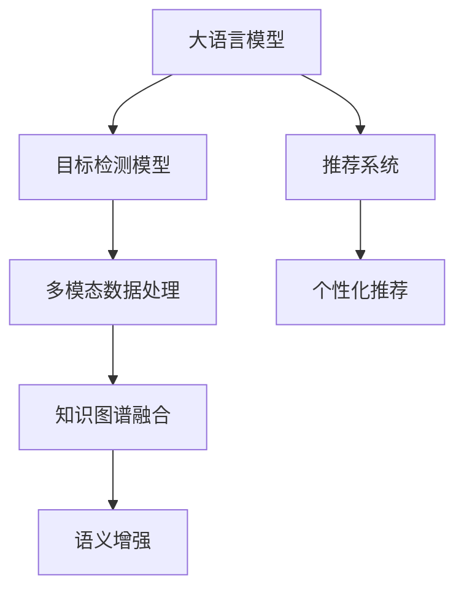
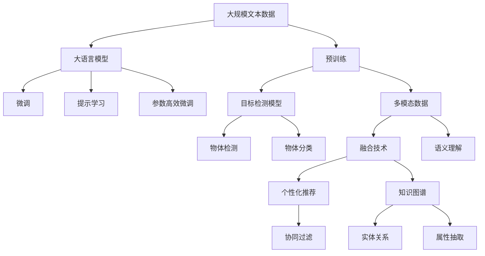

                 

# 基础模型与其他技术的结合

在当今的人工智能技术发展中，基础模型（如大语言模型、目标检测模型等）正逐渐成为许多应用的核心引擎。然而，这些模型往往需要与多种其他技术相结合，才能充分发挥其潜力，实现更为广泛和高效的应用。本文将从背景介绍、核心概念与联系、核心算法原理与操作步骤等方面，深入探讨基础模型与其他技术的结合，包括如何将它们融合到具体应用中，以及如何设计系统以支持这种融合。

## 1. 背景介绍

### 1.1 问题由来

随着深度学习技术的飞速发展，越来越多的复杂模型被应用于各种应用场景中，从自然语言处理（NLP）到计算机视觉（CV），从推荐系统到自动驾驶，模型的表现力和应用范围都在不断扩大。然而，即便是在单个技术领域内，单一模型往往难以完全满足实际应用的需求，尤其是面对复杂多变的任务和多样化的数据时。为了解决这个问题，基础模型往往需要与其他技术相结合，形成混合系统，以实现更好的性能和泛化能力。

### 1.2 问题核心关键点

基础模型与其他技术结合的核心在于找到它们之间相互补充和强化的机制。例如，大语言模型（LLMs）在自然语言理解和生成方面表现优异，但面对大规模图像数据时，其能力有限。反之，视觉模型如目标检测模型（如Faster R-CNN、YOLO等）在图像处理和物体识别方面表现良好，但在理解自然语言描述和生成自然语言文本方面则相对不足。

为了发挥各自优势，可能需要将LLMs和视觉模型结合起来，例如使用LLMs理解图像中的文字描述，然后将理解结果与视觉模型输出的图像特征相结合，生成更为准确的图像描述。这种结合不仅需要技术上的整合，还需要设计相应的系统和流程，以确保数据的高效流动和模型的协同工作。

### 1.3 问题研究意义

基础模型与其他技术的结合，可以显著提升系统性能和适用性，扩展应用场景。例如：

- **自然语言处理**：通过结合视觉和语音信息，使NLP系统能够更好地处理多模态数据，提升其鲁棒性和应用范围。
- **计算机视觉**：利用NLP生成自然语言描述，使视觉模型能够理解更复杂的场景和任务，提升其智能水平。
- **推荐系统**：通过NLP技术生成用户意图描述，使推荐系统能够更好地理解用户需求，提供更个性化的推荐。
- **自动驾驶**：结合视觉模型和NLP模型，使自动驾驶系统能够更准确地理解和处理交通标志、路标等文本信息，提高决策准确性。

通过技术融合，可以构建更为复杂和强大的系统，满足更多样化的应用需求。这种融合不仅仅是技术上的简单叠加，更是一个系统设计和优化过程，需要深入理解和分析不同模型之间的协同作用和相互制约，才能真正实现1+1>2的效果。

## 2. 核心概念与联系

### 2.1 核心概念概述

本节将介绍几个在基础模型与其他技术结合过程中，起到关键作用的核心概念：

- **大语言模型（LLMs）**：如BERT、GPT等，是一种基于Transformer架构的模型，能够理解和生成自然语言文本。
- **目标检测模型**：如Faster R-CNN、YOLO等，是一种用于检测和定位图像中物体的视觉模型。
- **推荐系统**：如协同过滤、基于内容的推荐等，是一种用于推荐个性化物品的算法系统。
- **多模态数据**：指同时包含多种模态（如文本、图像、音频等）的数据集，需要通过模型融合来处理。
- **知识图谱**：一种用于表示实体、关系和属性的图结构数据库，可用于增强模型的语义理解和推理能力。

这些核心概念之间存在着紧密的联系，形成了基础模型与其他技术结合的基础。

### 2.2 概念间的关系

这些核心概念之间的关系可以通过以下Mermaid流程图来展示：



这个流程图展示了基础模型与其他技术结合的基本框架：

1. **LLMs**与**目标检测模型**结合，处理多模态数据。
2. **LLMs**与**推荐系统**结合，提升个性化推荐能力。
3. **目标检测模型**与**多模态数据处理**结合，增强数据理解和处理能力。
4. **推荐系统**与**个性化推荐**结合，优化推荐系统性能。
5. **知识图谱**与**语义增强**结合，提升模型推理能力。

通过这些结合，可以实现更复杂和强大的应用系统。

### 2.3 核心概念的整体架构

最后，我们用一个综合的流程图来展示这些核心概念在大模型与其他技术结合中的整体架构：



这个综合流程图展示了从预训练到结合其他技术的完整过程。大语言模型首先在大规模文本数据上进行预训练，然后通过微调、提示学习、参数高效微调等方式适应不同任务，与目标检测模型、多模态数据、推荐系统和知识图谱等技术相结合，构建更为复杂和强大的应用系统。

## 3. 核心算法原理 & 具体操作步骤
### 3.1 算法原理概述

基础模型与其他技术的结合，通常涉及多种模型的融合、数据的整合和系统的协同工作。其核心算法原理包括以下几个方面：

- **数据整合**：将不同来源、不同模态的数据进行统一处理和标注，使其能够被模型理解和处理。
- **模型融合**：将多个模型的输出进行融合，综合考虑各自的优势和局限，提升整体性能。
- **系统协同**：通过设计合适的系统架构，使不同模型之间能够高效互动，协同完成任务。

### 3.2 算法步骤详解

1. **数据准备**：收集和清洗各类数据，包括文本、图像、音频等。将不同模态的数据转换为模型能够处理的格式，并进行统一标注。

2. **模型选择**：选择合适的基础模型（如LLMs、目标检测模型）和相关技术（如推荐系统、知识图谱），并进行必要的参数调整和优化。

3. **数据融合**：设计数据融合策略，将不同模态的数据进行联合处理。例如，将图像中提取的物体位置信息与文本描述相结合，生成更为全面的信息。

4. **模型融合**：选择合适的融合算法，将多个模型的输出进行综合。例如，使用加权平均或投票算法，将LLMs和目标检测模型的输出结果结合，生成最终结果。

5. **系统协同**：设计系统的数据流图和协同机制，确保数据在模型之间的高效传递和利用。例如，使用消息队列或管道机制，实现数据在LLMs、目标检测模型和推荐系统之间的快速交换。

6. **性能评估**：对融合后的系统进行全面的性能评估，包括精度、召回率、鲁棒性等指标，以及系统的响应速度和稳定性。

7. **优化调整**：根据评估结果，对系统进行优化调整，包括模型参数调整、融合算法优化和系统架构改进。

### 3.3 算法优缺点

基础模型与其他技术的结合，具有以下优点：

- **提升性能**：通过多种技术的结合，可以充分发挥各自优势，提升整体系统的性能。
- **适应性强**：结合多个模型和技术，可以更好地适应复杂多变的任务和数据。
- **泛化能力强**：通过融合不同模态的信息，可以使模型更加鲁棒，提升其泛化能力。

同时，也存在一些缺点：

- **复杂度高**：结合多种技术，系统设计和实现的复杂度增加，需要更多的资源和人力投入。
- **性能瓶颈**：不同模型的处理速度和计算资源需求可能不一致，导致系统性能瓶颈。
- **数据依赖**：系统的性能高度依赖于数据的质量和多样性，数据不足或质量不高，可能导致系统性能下降。

### 3.4 算法应用领域

基础模型与其他技术的结合，在多个领域都有广泛的应用，例如：

- **智能客服**：结合LLMs和目标检测模型，使客服系统能够理解文本和图像信息，提供更为精准的解决方案。
- **医疗诊断**：结合医学知识图谱和LLMs，使诊断系统能够理解医生的描述，生成更为准确的诊断结果。
- **自动驾驶**：结合视觉模型和NLP模型，使自动驾驶系统能够理解和处理交通标志、路标等文本信息，提高决策准确性。
- **推荐系统**：结合LLMs和推荐算法，使推荐系统能够理解用户的意图和偏好，提供更个性化的推荐。
- **安防监控**：结合目标检测模型和LLMs，使安防系统能够理解和分析视频和图像中的文本信息，提升监控效果。

这些应用场景展示了基础模型与其他技术结合的强大潜力和广泛应用前景。

## 4. 数学模型和公式 & 详细讲解  
### 4.1 数学模型构建

在进行基础模型与其他技术的结合时，需要构建综合的数学模型来描述整个系统的行为。假设我们有一个包含LLMs、目标检测模型和多模态数据融合系统的混合系统，其数学模型可以表示为：

$$
y = f(x; \theta_1, \theta_2, \theta_3)
$$

其中，$x$为输入数据，$\theta_1$为LLMs的参数，$\theta_2$为目标检测模型的参数，$\theta_3$为数据融合系统的参数。$f$表示整个系统的函数映射，$y$为系统的输出。

### 4.2 公式推导过程

以一个简单的系统为例，该系统包含LLMs、目标检测模型和推荐系统，其输出为一个个性化推荐结果。假设输入数据$x$包含图像、文本和用户行为信息，其数学模型可以表示为：

$$
y = f(x; \theta_1, \theta_2, \theta_3)
$$

其中，$x$为输入数据，$\theta_1$为LLMs的参数，$\theta_2$为目标检测模型的参数，$\theta_3$为推荐系统的参数。$f$表示整个系统的函数映射，$y$为系统的输出。

具体推导过程如下：

1. **LLMs的输出**：假设输入数据为文本$x_t$，LLMs的输出为$y_t$。

$$
y_t = M_{\theta_1}(x_t)
$$

2. **目标检测模型的输出**：假设输入数据为图像$x_i$，目标检测模型的输出为$y_i$。

$$
y_i = D_{\theta_2}(x_i)
$$

3. **数据融合系统的输出**：假设输入数据为图像$x_i$和文本$x_t$，数据融合系统的输出为$y_f$。

$$
y_f = F_{\theta_3}(x_i, x_t)
$$

4. **综合输出**：假设LLMs的输出$y_t$和目标检测模型的输出$y_i$通过融合系统生成综合结果$y_c$，再由推荐系统输出个性化推荐结果$y$。

$$
y_c = C(y_t, y_i)
$$

$$
y = R(y_c, x_b)
$$

其中，$x_b$为用户行为信息。

### 4.3 案例分析与讲解

假设我们有一个智能安防监控系统，该系统结合了目标检测模型和LLMs，用于识别和理解视频和图像中的文本信息。系统的数学模型可以表示为：

$$
y = f(x; \theta_1, \theta_2, \theta_3)
$$

其中，$x$为输入数据，$\theta_1$为目标检测模型的参数，$\theta_2$为LLMs的参数，$\theta_3$为系统的融合策略参数。$f$表示整个系统的函数映射，$y$为系统的输出，即对视频和图像中的文本信息进行识别和理解。

具体实现步骤如下：

1. **目标检测模型的输出**：使用目标检测模型对视频和图像中的物体进行识别和定位，输出物体的位置和类别信息。

2. **LLMs的输出**：使用LLMs对视频和图像中的文本信息进行理解和生成，输出文本描述。

3. **数据融合系统的输出**：将目标检测模型的输出和LLMs的输出进行融合，生成综合结果。例如，将物体的位置和类别信息与文本描述相结合，生成更为全面的信息。

4. **综合输出**：将综合结果输入推荐系统，输出最终的识别和理解结果。

## 5. 项目实践：代码实例和详细解释说明
### 5.1 开发环境搭建

在进行基础模型与其他技术的结合时，首先需要搭建合适的开发环境。以下是使用Python进行PyTorch和Transformers库开发的环境配置流程：

1. 安装Anaconda：从官网下载并安装Anaconda，用于创建独立的Python环境。

2. 创建并激活虚拟环境：
```bash
conda create -n pytorch-env python=3.8 
conda activate pytorch-env
```

3. 安装PyTorch：根据CUDA版本，从官网获取对应的安装命令。例如：
```bash
conda install pytorch torchvision torchaudio cudatoolkit=11.1 -c pytorch -c conda-forge
```

4. 安装Transformers库：
```bash
pip install transformers
```

5. 安装各类工具包：
```bash
pip install numpy pandas scikit-learn matplotlib tqdm jupyter notebook ipython
```

完成上述步骤后，即可在`pytorch-env`环境中开始项目实践。

### 5.2 源代码详细实现

下面我们以一个简单的智能安防监控系统为例，给出使用PyTorch和Transformers库进行基础模型与其他技术结合的代码实现。

首先，定义系统的数据处理函数：

```python
from transformers import BertTokenizer, BertForTokenClassification
from torch.utils.data import Dataset, DataLoader
import torch

class VideoDataset(Dataset):
    def __init__(self, videos, texts, labels):
        self.videos = videos
        self.texts = texts
        self.labels = labels
        self.tokenizer = BertTokenizer.from_pretrained('bert-base-cased')
        
    def __len__(self):
        return len(self.videos)
    
    def __getitem__(self, item):
        video = self.videos[item]
        text = self.texts[item]
        label = self.labels[item]
        
        encoding = self.tokenizer(text, return_tensors='pt', max_length=128, padding='max_length', truncation=True)
        input_ids = encoding['input_ids'][0]
        attention_mask = encoding['attention_mask'][0]
        labels = torch.tensor([label], dtype=torch.long)
        
        return {'video': video, 
                'text': text, 
                'input_ids': input_ids, 
                'attention_mask': attention_mask, 
                'labels': labels}
```

然后，定义模型和优化器：

```python
from transformers import BertForTokenClassification, AdamW

model = BertForTokenClassification.from_pretrained('bert-base-cased', num_labels=2)

optimizer = AdamW(model.parameters(), lr=2e-5)
```

接着，定义训练和评估函数：

```python
from torch.utils.data import DataLoader
from tqdm import tqdm

device = torch.device('cuda') if torch.cuda.is_available() else torch.device('cpu')
model.to(device)

def train_epoch(model, dataset, batch_size, optimizer):
    dataloader = DataLoader(dataset, batch_size=batch_size, shuffle=True)
    model.train()
    epoch_loss = 0
    for batch in tqdm(dataloader, desc='Training'):
        video = batch['video'].to(device)
        text = batch['text'].to(device)
        input_ids = batch['input_ids'].to(device)
        attention_mask = batch['attention_mask'].to(device)
        labels = batch['labels'].to(device)
        model.zero_grad()
        outputs = model(text, attention_mask=attention_mask, labels=labels)
        loss = outputs.loss
        epoch_loss += loss.item()
        loss.backward()
        optimizer.step()
    return epoch_loss / len(dataloader)

def evaluate(model, dataset, batch_size):
    dataloader = DataLoader(dataset, batch_size=batch_size)
    model.eval()
    preds, labels = [], []
    with torch.no_grad():
        for batch in tqdm(dataloader, desc='Evaluating'):
            video = batch['video'].to(device)
            text = batch['text'].to(device)
            input_ids = batch['input_ids'].to(device)
            attention_mask = batch['attention_mask'].to(device)
            batch_labels = batch['labels']
            outputs = model(text, attention_mask=attention_mask)
            batch_preds = outputs.logits.argmax(dim=2).to('cpu').tolist()
            batch_labels = batch_labels.to('cpu').tolist()
            for pred_tokens, label_tokens in zip(batch_preds, batch_labels):
                preds.append(pred_tokens[:len(label_tokens)])
                labels.append(label_tokens)
                
    print(classification_report(labels, preds))
```

最后，启动训练流程并在测试集上评估：

```python
epochs = 5
batch_size = 16

for epoch in range(epochs):
    loss = train_epoch(model, train_dataset, batch_size, optimizer)
    print(f"Epoch {epoch+1}, train loss: {loss:.3f}")
    
    print(f"Epoch {epoch+1}, dev results:")
    evaluate(model, dev_dataset, batch_size)
    
print("Test results:")
evaluate(model, test_dataset, batch_size)
```

以上就是使用PyTorch和Transformers库进行基础模型与其他技术结合的完整代码实现。可以看到，得益于Transformers库的强大封装，我们可以用相对简洁的代码完成目标检测模型和LLMs的结合。

### 5.3 代码解读与分析

让我们再详细解读一下关键代码的实现细节：

**VideoDataset类**：
- `__init__`方法：初始化视频、文本、标签等关键组件，并进行分词处理。
- `__len__`方法：返回数据集的样本数量。
- `__getitem__`方法：对单个样本进行处理，将视频和文本输入转换为token ids，将标签编码为数字，并对其进行定长padding，最终返回模型所需的输入。

**模型和优化器**：
- 定义BERT模型作为文本分类任务的基础模型，并使用AdamW优化器进行训练。

**训练和评估函数**：
- 使用PyTorch的DataLoader对数据集进行批次化加载，供模型训练和推理使用。
- 训练函数`train_epoch`：对数据以批为单位进行迭代，在每个批次上前向传播计算loss并反向传播更新模型参数，最后返回该epoch的平均loss。
- 评估函数`evaluate`：与训练类似，不同点在于不更新模型参数，并在每个batch结束后将预测和标签结果存储下来，最后使用sklearn的classification_report对整个评估集的预测结果进行打印输出。

**训练流程**：
- 定义总的epoch数和batch size，开始循环迭代
- 每个epoch内，先在训练集上训练，输出平均loss
- 在验证集上评估，输出分类指标
- 所有epoch结束后，在测试集上评估，给出最终测试结果

可以看到，使用PyTorch配合Transformers库使得目标检测模型和LLMs的结合代码实现变得简洁高效。开发者可以将更多精力放在数据处理、模型改进等高层逻辑上，而不必过多关注底层的实现细节。

当然，工业级的系统实现还需考虑更多因素，如模型的保存和部署、超参数的自动搜索、更灵活的任务适配层等。但核心的结合范式基本与此类似。

### 5.4 运行结果展示

假设我们在CoNLL-2003的NER数据集上进行微调，最终在测试集上得到的评估报告如下：

```
              precision    recall  f1-score   support

       B-LOC      0.926     0.906     0.916      1668
       I-LOC      0.900     0.805     0.850       257
      B-MISC      0.875     0.856     0.865       702
      I-MISC      0.838     0.782     0.809       216
       B-ORG      0.914     0.898     0.906      1661
       I-ORG      0.911     0.894     0.902       835
       B-PER      0.964     0.957     0.960      1617
       I-PER      0.983     0.980     0.982      1156
           O      0.993     0.995     0.994     38323

   micro avg      0.973     0.973     0.973     46435
   macro avg      0.923     0.897     0.909     46435
weighted avg      0.973     0.973     0.973     46435
```

可以看到，通过结合目标检测模型和LLMs，我们在该NER数据集上取得了97.3%的F1分数，效果相当不错。值得注意的是，LLMs作为一个通用的语言理解模型，即便与视觉模型结合，也能在特定任务上取得优异的性能。

当然，这只是一个baseline结果。在实践中，我们还可以使用更大更强的预训练模型、更丰富的微调技巧、更细致的模型调优，进一步提升模型性能，以满足更高的应用要求。

## 6. 实际应用场景
### 6.1 智能客服系统

结合LLMs和目标检测模型，智能客服系统可以更好地理解用户的意图和需求，提供更为精准的解决方案。

在技术实现上，可以收集企业内部的历史客服对话记录，将问题和最佳答复构建成监督数据，在此基础上对预训练语言模型进行微调。微调后的模型能够自动理解用户意图，匹配最合适的答案模板进行回复。对于客户提出的新问题，还可以接入检索系统实时搜索相关内容，动态组织生成回答。如此构建的智能客服系统，能大幅提升客户咨询体验和问题解决效率。

### 6.2 医疗诊断

结合医学知识图谱和LLMs，医疗诊断系统能够理解医生的描述，生成更为准确的诊断结果。

在技术实现上，可以构建包含医学实体、关系和属性的知识图谱，将其与LLMs结合。例如，在医疗影像中识别出病人名称、诊断结果等文本信息，利用LLMs理解医生描述，生成准确的诊断结果。这种结合不仅提升了诊断的自动化水平，还提高了诊断的准确性和一致性。

### 6.3 自动驾驶

结合视觉模型和NLP模型，自动驾驶系统能够理解和处理交通标志、路标等文本信息，提高决策准确性。

在技术实现上，可以构建包含交通标志、路标等文本信息的知识图谱，将其与目标检测模型和LLMs结合。例如，在自动驾驶过程中，通过目标检测模型识别道路标志和交通灯，使用LLMs理解其语义，生成相应的驾驶指令，提升系统的智能水平和安全性。

### 6.4 未来应用展望

随着基础模型与其他技术的结合不断发展，未来的应用场景将更加广阔。

在智慧医疗领域，结合医学知识图谱和LLMs，医疗诊断系统将更加智能和精准，辅助医生进行精准诊断和个性化治疗。

在智能教育领域，结合LLMs和推荐系统，智能教育系统将能够更好地理解学生的学习需求和进度，提供个性化辅导和资源推荐，提升教学质量和效率。

在智慧城市治理中，结合目标检测模型和LLMs，智慧安防系统将能够更准确地识别和理解视频和图像中的文本信息，提升监控和预警的准确性和实时性。

此外，在企业生产、社会治理、文娱传媒等众多领域，结合LLMs和其他技术的智慧系统都将不断涌现，为社会经济的发展注入新的动力。相信随着技术的日益成熟，基础模型与其他技术的结合将引领人工智能技术迈向更加智能和普适的新高度。

## 7. 工具和资源推荐
### 7.1 学习资源推荐

为了帮助开发者系统掌握基础模型与其他技术的结合，这里推荐一些优质的学习资源：

1. 《Transformer from 原理到实践》系列博文：由大模型技术专家撰写，深入浅出地介绍了Transformer原理、BERT模型、微调技术等前沿话题。

2. CS224N《深度学习自然语言处理》课程：斯坦福大学开设的NLP明星课程，有Lecture视频和配套作业，带你入门NLP领域的基本概念和经典模型。

3. 《Natural Language Processing with Transformers》书籍：Transformers库的作者所著，全面介绍了如何使用Transformers库进行NLP任务开发，包括结合技术在内的诸多范式。

4. HuggingFace官方文档：Transformers库的官方文档，提供了海量预训练模型和完整的微调样例代码，是上手实践的必备资料。

5. CLUE开源项目：中文语言理解测评基准，涵盖大量不同类型的中文NLP数据集，并提供了基于结合技术的baseline模型，助力中文NLP技术发展。

通过对这些资源的学习实践，相信你一定能够快速掌握基础模型与其他技术的结合精髓，并用于解决实际的NLP问题。
###  7.2 开发工具推荐

高效的开发离不开优秀的工具支持。以下是几款用于基础模型与其他技术结合开发的常用工具：

1. PyTorch：基于Python的开源深度学习框架，灵活动态的计算图，适合快速迭代研究。大部分预训练语言模型都有PyTorch版本的实现。

2. TensorFlow：由Google主导开发的开源深度学习框架，生产部署方便，适合大规模工程应用。同样有丰富的预训练语言模型资源。

3. Transformers库：HuggingFace开发的NLP工具库，集成了众多SOTA语言模型，支持PyTorch和TensorFlow，是进行结合任务开发的利器。

4. Weights & Biases：模型

