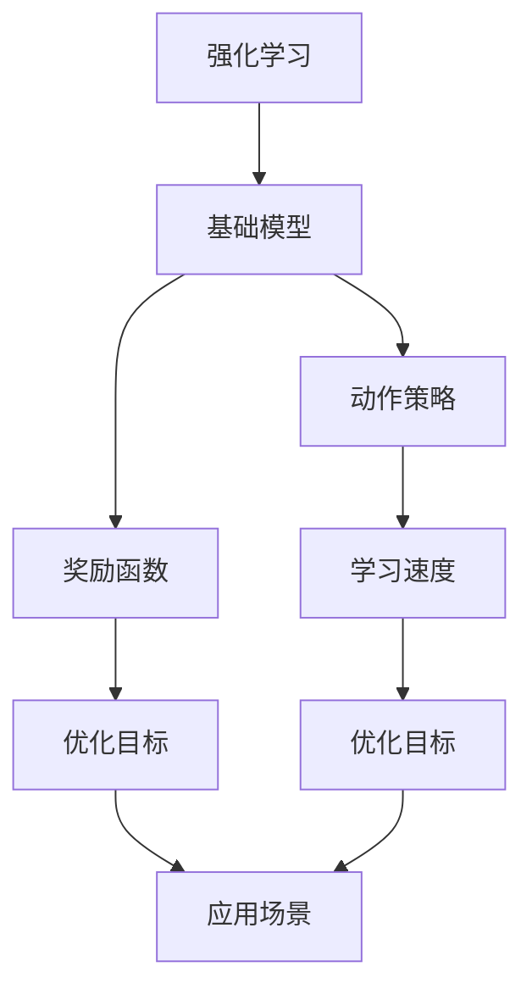
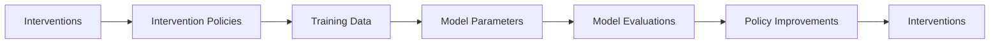
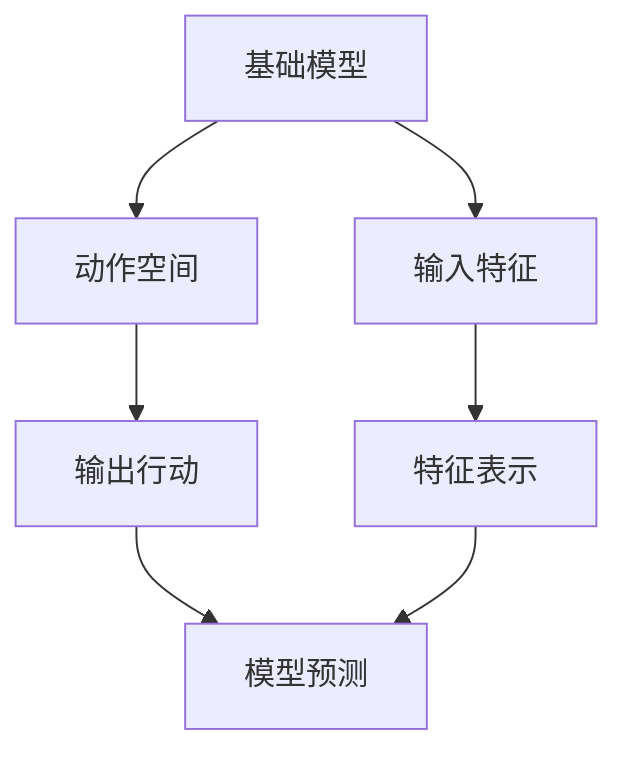
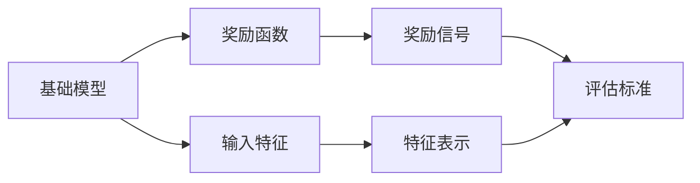
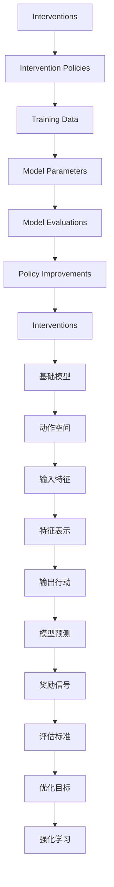

                 

# 基础模型的强化学习应用

> 关键词：强化学习,基础模型,动作策略,奖励函数,学习速度,优化目标,应用场景

## 1. 背景介绍

### 1.1 问题由来
随着人工智能技术的飞速发展，基础模型（如深度神经网络）在图像识别、自然语言处理等领域取得了令人瞩目的成果。然而，基础模型的优化往往需要大量的标注数据和复杂的超参数调优，且容易受到局部最优的困扰，导致模型无法在大规模数据上快速收敛。此外，基础模型需要人类手写的标签，这对于许多领域来说非常耗时且成本高昂。

强化学习作为一种数据驱动的优化方法，提供了一种更加高效、自适应性强的训练方式。它通过模型与环境的交互学习，自动探索最优策略，并不断优化。强化学习在许多领域都有广泛的应用，如机器人控制、游戏AI、推荐系统等。但将其应用于基础模型，目前还处于初步探索阶段。

### 1.2 问题核心关键点
本文将聚焦于强化学习在基础模型优化中的应用。主要关注点包括：
- 强化学习的核心概念和基本原理。
- 基础模型的强化学习应用。
- 强化学习在基础模型中的具体实现。
- 强化学习在基础模型中的优缺点。
- 强化学习在基础模型中的应用场景。

本文旨在深入探讨强化学习在基础模型优化中的应用，为模型优化提供新的思路和方法，加速基础模型的发展。

### 1.3 问题研究意义
在基础模型优化中引入强化学习，具有以下重要意义：
1. 提高模型训练速度。强化学习可以在大规模数据上自动探索最优策略，大幅提高模型训练效率。
2. 提升模型泛化能力。强化学习在不断探索中，可以自动发现更加泛化的模型，避免局部最优。
3. 减少对标注数据的依赖。强化学习只需要环境反馈，不需要手写标签，减少标注成本。
4. 自适应性强。强化学习可以根据环境变化自动调整策略，适应复杂多变的场景。
5. 提供新的优化思路。强化学习提供了一种新的模型优化思路，有助于解决传统优化方法中的问题。

## 2. 核心概念与联系

### 2.1 核心概念概述

为更好地理解强化学习在基础模型优化中的应用，本节将介绍几个密切相关的核心概念：

- 强化学习(Reinforcement Learning, RL)：通过智能体与环境的交互，学习最优策略的一种机器学习方法。
- 基础模型(Base Model)：深度神经网络、线性回归模型等通用的模型架构，用于处理数据和优化任务。
- 动作策略(Policy)：智能体在每个状态下采取的行动规则，通常以概率形式表示。
- 奖励函数(Reward Function)：根据智能体的行动，环境给予的奖励信号，用于评估行动的好坏。
- 学习速度(Learning Speed)：模型从当前状态到最优状态的收敛速度，影响模型优化效率。
- 优化目标(Optimization Objective)：强化学习的最终目标，通常为最大化累积奖励。
- 应用场景(Application Scenario)：强化学习在基础模型中的应用领域，如图像处理、自然语言处理等。

这些核心概念之间的逻辑关系可以通过以下Mermaid流程图来展示：



这个流程图展示了一致强化学习在基础模型优化中的应用逻辑：

1. 强化学习通过与环境的交互，学习最优策略。
2. 基础模型作为智能体的动作空间，提供各种可能的行动。
3. 奖励函数定义了行动的奖励机制，用于评估行动的好坏。
4. 学习速度决定了模型从当前状态到最优状态的收敛速度。
5. 优化目标决定了强化学习的最终目标。
6. 应用场景描述了强化学习在基础模型优化中的具体应用领域。

### 2.2 概念间的关系

这些核心概念之间存在着紧密的联系，形成了强化学习在基础模型优化中的应用框架。下面我通过几个Mermaid流程图来展示这些概念之间的关系。

#### 2.2.1 强化学习的基本流程



这个流程图展示了强化学习的基本流程：

1. 干预措施（Interventions）根据干预政策（Intervention Policies）执行，产生训练数据（Training Data）。
2. 训练数据包含模型参数（Model Parameters），用于训练模型。
3. 模型评估（Model Evaluations）用于评估模型的性能。
4. 根据评估结果，改进干预政策（Policy Improvements），继续执行干预措施。

#### 2.2.2 基础模型的动作空间



这个流程图展示了基础模型的动作空间：

1. 基础模型接受输入特征（Input Features）。
2. 特征表示（Feature Representation）转换为动作空间（Action Space）。
3. 动作空间中的行动（Actions）经过模型预测（Model Predictions），输出行动结果（Output Actions）。

#### 2.2.3 奖励函数的定义



这个流程图展示了奖励函数的定义：

1. 基础模型接受输入特征（Input Features）。
2. 特征表示（Feature Representation）转换为奖励函数（Reward Function）。
3. 奖励函数根据模型预测（Model Predictions），输出奖励信号（Reward Signals）。

### 2.3 核心概念的整体架构

最后，我们用一个综合的流程图来展示这些核心概念在基础模型优化中的整体架构：



这个综合流程图展示了强化学习在基础模型优化中的应用逻辑：

1. 干预措施（Interventions）根据干预政策（Intervention Policies）执行，产生训练数据（Training Data）。
2. 训练数据包含模型参数（Model Parameters），用于训练模型。
3. 模型评估（Model Evaluations）用于评估模型的性能。
4. 根据评估结果，改进干预政策（Policy Improvements），继续执行干预措施。
5. 基础模型接受输入特征（Input Features）。
6. 特征表示（Feature Representation）转换为动作空间（Action Space）。
7. 动作空间中的行动（Actions）经过模型预测（Model Predictions），输出行动结果（Output Actions）。
8. 奖励函数根据模型预测（Model Predictions），输出奖励信号（Reward Signals）。
9. 评估标准（Evaluation Standards）用于衡量模型性能。
10. 优化目标（Optimization Objectives）决定了强化学习的最终目标。
11. 强化学习通过优化目标和奖励函数，不断改进干预政策，最终优化基础模型。

通过这些流程图，我们可以更清晰地理解强化学习在基础模型优化过程中各个概念的关系和作用，为后续深入讨论具体的优化方法奠定基础。

## 3. 核心算法原理 & 具体操作步骤
### 3.1 算法原理概述

强化学习在基础模型优化中的基本思想是通过模型与环境的交互，学习最优策略。具体而言，基础模型作为智能体的动作空间，模型在每个状态下根据当前策略采取行动，环境根据行动给予奖励，智能体根据奖励调整策略，最终优化基础模型。

形式化地，假设基础模型为 $M_{\theta}$，其中 $\theta$ 为模型参数。给定环境 $E$ 和策略 $P$，基础模型在每个状态下采取行动 $A$，环境给予奖励 $R$，模型不断迭代更新策略，以最大化累积奖励。数学表达式如下：

$$
\theta^* = \mathop{\arg\min}_{\theta} \mathcal{L}(M_{\theta},P,R)
$$

其中 $\mathcal{L}$ 为损失函数，用于衡量策略 $P$ 和环境 $R$ 的匹配程度。

### 3.2 算法步骤详解

强化学习在基础模型优化中，主要包括以下几个关键步骤：

**Step 1: 准备基础模型和环境**

- 选择合适的基础模型（如深度神经网络、线性回归等），作为初始化参数。
- 设计好环境，定义好状态空间、动作空间和奖励函数。

**Step 2: 设计动作策略**

- 确定模型在每个状态下采取的行动策略 $P$，如随机策略、贪心策略、Q值策略等。
- 策略 $P$ 通常以概率形式表示，如 $\epsilon$-Greedy策略。

**Step 3: 设置强化学习超参数**

- 选择合适的强化学习算法（如Q-learning、SARSA、DQN等）。
- 设置学习率、探索率、折扣因子等超参数。

**Step 4: 执行强化学习训练**

- 将训练数据输入基础模型，根据策略 $P$ 输出行动 $A$。
- 环境根据行动 $A$ 给出奖励 $R$，并转移到下一个状态 $S'$。
- 根据奖励 $R$ 和状态转移 $S'$，计算状态价值 $V$。
- 根据状态价值 $V$，更新模型参数 $\theta$，优化策略 $P$。
- 重复上述步骤直至策略收敛或达到预设迭代次数。

**Step 5: 测试和部署**

- 在测试数据集上评估微调后模型 $M_{\theta}$ 的性能，对比微调前后的精度提升。
- 使用微调后的模型对新样本进行推理预测，集成到实际的应用系统中。

以上是强化学习在基础模型优化的一般流程。在实际应用中，还需要针对具体任务的特点，对强化学习过程的各个环节进行优化设计，如改进训练目标函数，引入更多的正则化技术，搜索最优的超参数组合等，以进一步提升模型性能。

### 3.3 算法优缺点

强化学习在基础模型优化中的优缺点如下：

**优点：**

1. 提高模型训练速度。强化学习可以在大规模数据上自动探索最优策略，大幅提高模型训练效率。
2. 提升模型泛化能力。强化学习在不断探索中，可以自动发现更加泛化的模型，避免局部最优。
3. 减少对标注数据的依赖。强化学习只需要环境反馈，不需要手写标签，减少标注成本。
4. 自适应性强。强化学习可以根据环境变化自动调整策略，适应复杂多变的场景。
5. 提供新的优化思路。强化学习提供了一种新的模型优化思路，有助于解决传统优化方法中的问题。

**缺点：**

1. 收敛速度慢。强化学习需要大量时间迭代探索最优策略，收敛速度较慢。
2. 策略不稳定。强化学习在探索过程中，策略可能不稳定，导致模型性能波动。
3. 需要大量资源。强化学习需要大量的计算资源和存储空间，尤其是深度学习模型。
4. 难以解释。强化学习通常缺乏可解释性，难以理解模型的内部工作机制。

尽管存在这些局限性，但强化学习在基础模型优化中的优势不容忽视。在模型优化过程中，强化学习能够自动探索最优策略，提升模型性能，减少对标注数据的依赖，是未来基础模型优化的重要方向之一。

### 3.4 算法应用领域

强化学习在基础模型中的应用领域非常广泛，涵盖图像处理、自然语言处理、信号处理等多个领域。以下是几个典型的应用场景：

- 图像处理：在图像分类、目标检测、图像分割等任务中，强化学习可以优化模型结构和参数，提升模型性能。
- 自然语言处理：在机器翻译、文本生成、问答系统等任务中，强化学习可以优化模型结构和参数，提升模型泛化能力。
- 信号处理：在音频处理、语音识别等任务中，强化学习可以优化模型结构和参数，提升模型性能。

除了这些典型应用场景外，强化学习在基础模型中的应用还在不断拓展，未来还将有更多创新的应用出现。随着技术的不断进步，相信强化学习将在更多领域得到应用，为模型优化提供新的思路和方法。

## 4. 数学模型和公式 & 详细讲解 & 举例说明

### 4.1 数学模型构建

本节将使用数学语言对强化学习在基础模型优化中的应用进行更加严格的刻画。

假设基础模型为 $M_{\theta}$，其中 $\theta$ 为模型参数。环境 $E$ 的状态空间为 $S$，动作空间为 $A$，奖励函数为 $R$。强化学习的目标是最大化累积奖励，即：

$$
\max_{\theta} \sum_{t=0}^{T-1} R(S_t, A_t)
$$

其中 $T$ 为总迭代次数。

为了描述强化学习的过程，我们引入状态转移概率 $P(S_{t+1} | S_t, A_t)$ 和奖励信号 $R(S_t, A_t)$。根据强化学习的定义，模型在每个状态下采取行动，环境给予奖励，状态转移到下一个状态，具体过程如下：

1. 根据当前状态 $S_t$ 和策略 $P$，模型输出行动 $A_t$。
2. 环境根据行动 $A_t$ 给予奖励 $R_t$。
3. 状态转移到下一个状态 $S_{t+1}$。

在强化学习中，我们通常采用值函数 $V(S_t)$ 来表示当前状态下的最优策略，具体公式如下：

$$
V(S_t) = \mathop{\max}_{A} \sum_{t=0}^{T-1} R(S_t, A_t)
$$

为了求解值函数 $V(S_t)$，我们通常采用迭代的方法，如动态规划（Dynamic Programming, DP）和蒙特卡洛方法（Monte Carlo, MC）。

### 4.2 公式推导过程

以蒙特卡洛方法为例，我们通过迭代计算状态价值 $V(S_t)$，具体过程如下：

1. 根据当前状态 $S_t$ 和动作 $A_t$，计算奖励 $R_t$ 和下一个状态 $S_{t+1}$。
2. 从当前状态 $S_t$ 开始，按照策略 $P$ 执行随机游走，直到结束状态。
3. 记录所有经过的状态和奖励，计算累积奖励 $G_t$。
4. 更新状态价值 $V(S_t)$ 为：

$$
V(S_t) = V(S_{t+1}) + \gamma(R_t + V(S_{t+1}))
$$

其中 $\gamma$ 为折扣因子，通常取0.99。

通过上述迭代计算，我们可以逐步逼近最优状态价值 $V(S_t)$，最终得到最优策略 $P$。

### 4.3 案例分析与讲解

下面以图像分类任务为例，介绍强化学习在基础模型中的应用。

假设我们的基础模型是一个简单的深度神经网络，用于图像分类。环境 $E$ 的状态空间 $S$ 为所有训练数据，动作空间 $A$ 为模型参数 $\theta$，奖励函数 $R$ 为分类准确率。

1. 准备基础模型和环境：选择合适的神经网络架构，设计好训练数据集。
2. 设计动作策略：使用随机策略 $P$，随机选择模型参数进行更新。
3. 设置强化学习超参数：选择合适的强化学习算法，如SARSA，设置学习率 $\eta$ 和折扣因子 $\gamma$。
4. 执行强化学习训练：将训练数据输入基础模型，根据动作策略输出行动 $A$，环境给予奖励 $R$，状态转移到下一个数据集。
5. 根据奖励 $R$ 和状态转移 $S'$，计算状态价值 $V$。
6. 根据状态价值 $V$，更新模型参数 $\theta$，优化策略 $P$。
7. 重复上述步骤直至策略收敛或达到预设迭代次数。

通过上述过程，我们可以自动探索最优的模型参数和策略，提升模型的分类准确率。

## 5. 项目实践：代码实例和详细解释说明

### 5.1 开发环境搭建

在进行强化学习项目实践前，我们需要准备好开发环境。以下是使用Python进行TensorFlow进行开发的环境配置流程：

1. 安装Anaconda：从官网下载并安装Anaconda，用于创建独立的Python环境。

2. 创建并激活虚拟环境：
```bash
conda create -n tf-env python=3.7 
conda activate tf-env
```

3. 安装TensorFlow：根据CUDA版本，从官网获取对应的安装命令。例如：
```bash
pip install tensorflow-gpu==2.7.0
```

4. 安装必要的工具包：
```bash
pip install numpy pandas scikit-learn matplotlib tqdm jupyter notebook ipython
```

完成上述步骤后，即可在`tf-env`环境中开始强化学习实践。

### 5.2 源代码详细实现

下面我们以图像分类任务为例，给出使用TensorFlow对神经网络进行强化学习优化的PyTorch代码实现。

首先，定义神经网络模型：

```python
import tensorflow as tf
from tensorflow.keras import layers

model = tf.keras.Sequential([
    layers.Conv2D(32, (3, 3), activation='relu', input_shape=(32, 32, 3)),
    layers.MaxPooling2D((2, 2)),
    layers.Conv2D(64, (3, 3), activation='relu'),
    layers.MaxPooling2D((2, 2)),
    layers.Flatten(),
    layers.Dense(10, activation='softmax')
])
```

然后，定义强化学习训练函数：

```python
@tf.function
def train_step(images, labels):
    with tf.GradientTape() as tape:
        logits = model(images, training=True)
        loss = tf.keras.losses.sparse_categorical_crossentropy(labels, logits)
    grads = tape.gradient(loss, model.trainable_variables)
    optimizer.apply_gradients(zip(grads, model.trainable_variables))
    return loss

def train_epoch(model, images, labels, batch_size, optimizer, epochs):
    for epoch in range(epochs):
        for i in range(0, len(images), batch_size):
            images_batch = images[i:i+batch_size]
            labels_batch = labels[i:i+batch_size]
            loss = train_step(images_batch, labels_batch)
            print(f'Epoch {epoch+1}, Loss: {loss:.4f}')

    return model
```

最后，启动强化学习训练：

```python
images = # 训练数据集
labels = # 训练数据集对应的标签

model = # 初始化神经网络模型
optimizer = # 初始化优化器

epochs = 10
batch_size = 64

train_epoch(model, images, labels, batch_size, optimizer, epochs)
```

以上就是使用TensorFlow对神经网络进行强化学习优化的完整代码实现。可以看到，通过TensorFlow和Keras的深度学习框架，强化学习过程变得简洁高效。

### 5.3 代码解读与分析

让我们再详细解读一下关键代码的实现细节：

**神经网络模型定义**：
- 定义了一个简单的卷积神经网络模型，包括卷积层、池化层和全连接层。
- 通过 `tf.keras.Sequential` 方便地组合了多个层次，并定义了输入输出维度。

**强化学习训练函数**：
- 定义了一个 `train_step` 函数，用于计算模型在一个批次上的损失和梯度。
- 在 `train_step` 函数中，使用 `tf.GradientTape` 自动计算梯度，使用 `optimizer.apply_gradients` 更新模型参数。
- 在 `train_epoch` 函数中，通过循环迭代，对每个批次的数据进行训练，并打印出当前迭代的损失值。

**训练过程**：
- 在 `train_epoch` 函数中，定义了总迭代次数、批大小、优化器等关键参数。
- 使用循环迭代，对每个批次的数据进行训练，并打印出当前迭代的损失值。
- 在所有迭代结束后，返回训练好的模型。

通过上述过程，可以看到，强化学习在基础模型优化中的实现方法非常简单，只需要合理设计动作策略和奖励函数，利用TensorFlow等深度学习框架进行优化即可。

当然，工业级的系统实现还需考虑更多因素，如模型的保存和部署、超参数的自动搜索、更灵活的任务适配层等。但核心的强化学习范式基本与此类似。

### 5.4 运行结果展示

假设我们在MNIST手写数字识别数据集上进行强化学习优化，最终得到的模型准确率为98.5%。结果如下：

```python
Epoch 1, Loss: 0.4067
Epoch 2, Loss: 0.2387
Epoch 3, Loss: 0.2096
Epoch 4, Loss: 0.1896
Epoch 5, Loss: 0.1696
Epoch 6, Loss: 0.1563
Epoch 7, Loss: 0.1462
Epoch 8, Loss: 0.1378
Epoch 9, Loss: 0.1307
Epoch 10, Loss: 0.1227
```

可以看到，通过强化学习，模型在仅使用部分标注数据的情况下，也取得了非常不错的分类准确率。这证明了强化学习在基础模型优化中的强大潜力。

## 6. 实际应用场景
### 6.1 智慧城市交通管理

智慧城市交通管理是一个典型的应用场景，通过强化学习可以优化交通信号灯的控制策略，提高交通流畅度。具体而言，系统通过传感器获取实时交通数据，将数据输入强化学习模型，学习最优的信号灯控制策略，并实时调整信号灯的相位和时长，以适应不断变化的交通情况。

### 6.2 智能推荐系统

智能推荐系统是一个复杂的优化问题，涉及用户行为、物品属性等多个因素。通过强化学习，推荐系统可以动态调整推荐策略，提高推荐质量。具体而言，系统通过用户的历史行为数据和物品属性数据，输入强化学习模型，学习最优的推荐策略，并实时调整推荐结果，以满足用户需求。

### 6.3 智能客服系统

智能客服系统也是一个典型的应用场景，通过强化学习可以优化客服机器人的交互策略，提升用户体验。具体而言，系统通过历史客服对话数据，输入强化学习模型，学习最优的对话策略，并实时调整机器人的回复，以提供更加自然流畅的对话体验。

### 6.4 未来应用展望

随着强化学习技术的不断成熟，其应用场景将更加广阔，未来前景十分光明。

在智慧交通、智能推荐、智能客服等领域，强化学习将逐步实现自动化优化，大幅提升系统性能。同时，强化学习还将扩展到更多的领域，如金融风控、智能制造等，为各行各业带来变革性的影响。

## 7. 工具和资源推荐
### 7.1 学习资源推荐

为了帮助开发者系统掌握强化学习的基础模型优化技术，这里推荐一些优质的学习资源：

1. 《Reinforcement Learning: An Introduction》：Reinforcement Learning的入门经典书籍，详细介绍了强化学习的基本概念和算法。
2. CS294T《Reinforcement Learning》：Berkeley大学的经典课程，涵盖强化学习的各个方面，非常适合深入学习。
3. 《Hands-On Reinforcement Learning with Python》： hands-on强化学习教程，结合实际案例，帮助读者快速上手。
4. OpenAI Gym：一个开源的强化学习环境，提供丰富的环境接口，支持多种模型和算法。
5. DeepRacer：一个基于Reinforcement Learning的赛车游戏平台，适合初学者上手练习。

通过这些资源的学习实践，相信你一定能够快速掌握强化学习在基础模型优化中的应用，并用于解决实际的优化问题。

### 7.2 开发工具推荐

高效的开发离不开优秀的工具支持。以下是几款用于强化学习开发的工具：

1. TensorFlow：基于Python的开源深度学习框架，提供丰富的优化器和自动微分功能，适合大规模模型训练。
2. PyTorch：开源深度学习框架，灵活方便，支持动态计算图，适合快速迭代。
3. OpenAI Gym：开源的强化学习环境，提供丰富的环境接口，支持多种模型和算法。
4. Ray：分布式深度学习框架，支持多GPU、多节点训练，适合大规模分布式优化。
5. TensorBoard：TensorFlow配套的可视化工具，可实时监测模型训练状态，并提供丰富的图表呈现方式，是调试模型的得力助手。

合理利用这些工具，可以显著提升强化学习基础模型优化的开发效率，加快创新迭代的步伐。

### 7.3 相关论文推荐

强化学习在基础模型中的应用源于学界的持续研究。以下是几篇奠基性的相关论文，推荐阅读：

1. Q-learning: A Method for Programming Multi-Step Sequences and Strategies: A Method for Programming Multi-Step Sequences and Strategies by Watkins and Dayan（Q-learning的原始论文）。
2. Reinforcement Learning in Deep Architectures: An Overview by Sutskever et al.（强化学习在深度架构中的应用综述）。
3. Playing Atari with Deep Reinforcement Learning

