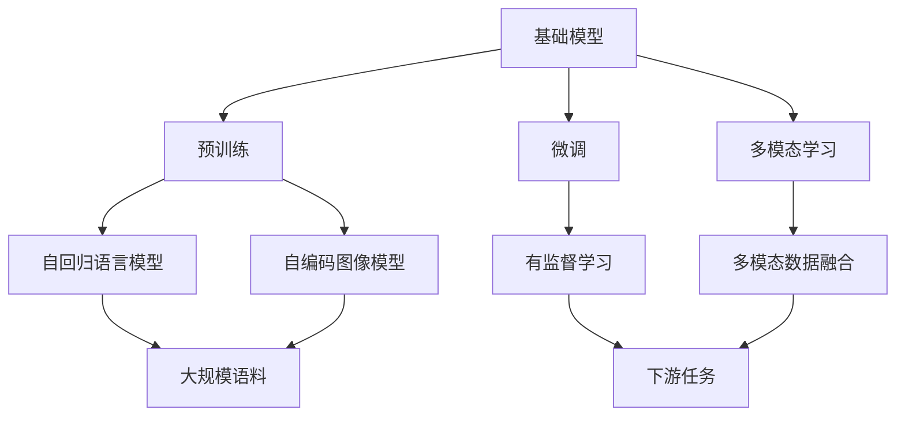
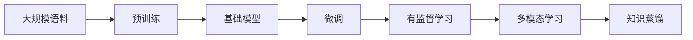
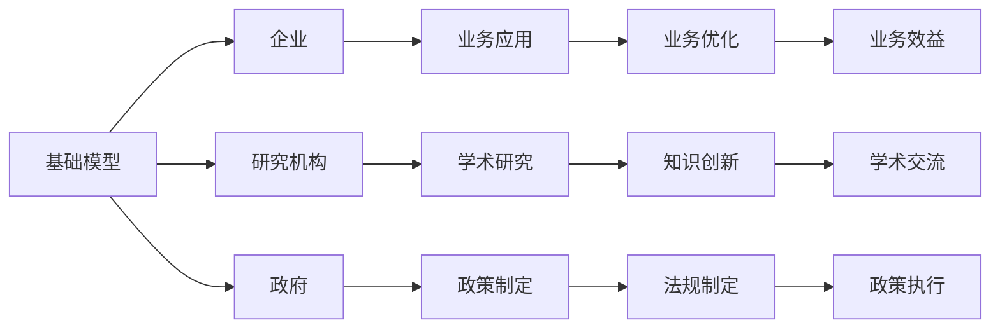
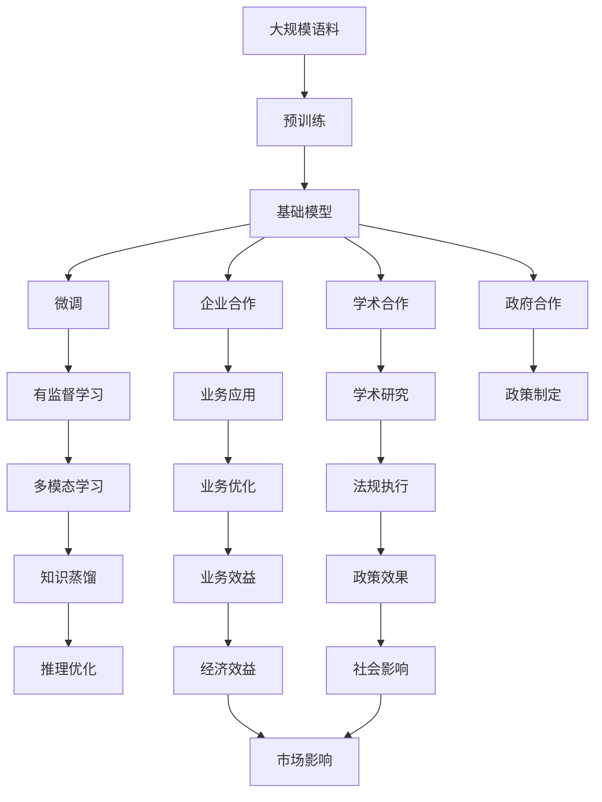

                 

# 基础模型的技术创新与社会合作

> 关键词：基础模型,技术创新,社会合作,人工智能,深度学习,应用场景,伦理道德,隐私保护

## 1. 背景介绍

### 1.1 问题由来
人工智能（AI）作为当前科技领域的前沿技术，其发展和应用已经渗透到了社会的各个层面，从医疗、教育到金融、交通等领域都有其影子。而其中，深度学习技术是AI发展的核心驱动力。然而，尽管深度学习模型在诸多领域取得了显著成果，但其算法基础仍然依赖于庞大的数据集和强大的计算能力，这使得深度学习模型的开发、训练和应用成本非常高昂。

如何降低深度学习的成本，提升其应用的普适性，成为了当前深度学习研究的一个重要课题。基础模型（foundation models）的提出，为这一问题提供了新的解决方案。基础模型是一种预训练的深度学习模型，其经过大规模无标签数据的预训练，具备了强大的语言理解、图像识别等能力。这种模型通过迁移学习的方式，可以适应于各种不同的下游任务，极大地提升了AI应用的效率和范围。

### 1.2 问题核心关键点
基础模型包括预训练模型和微调模型，其核心思想是通过预训练学习到通用的语言或图像知识，然后通过微调针对特定任务进行调整，以获得更高的性能。预训练模型通常使用大规模无标签数据进行训练，能够捕捉到丰富的语义和结构信息，而微调模型则是在预训练模型的基础上，通过下游任务的少量标注数据进行优化，以提升模型在该任务上的表现。

基础模型在社会合作中的应用，主要体现在以下几个方面：

1. 提升AI技术应用的普及度。通过基础模型，AI技术可以被更广泛地应用于各个行业和领域，减少对昂贵计算资源和大量标注数据的依赖。
2. 推动企业、研究机构、政府等合作，共同构建AI基础设施，加速AI技术的研发和应用。
3. 促进跨学科合作，融合不同领域的知识和技术，提升AI系统的综合能力。
4. 通过合作，建立更加透明、可信、可解释的AI系统，提升公众对AI技术的接受度和信任度。
5. 在AI伦理、隐私保护等方面，通过合作，制定统一的标准和规范，保障AI技术的安全和合法使用。

## 2. 核心概念与联系

### 2.1 核心概念概述

为更好地理解基础模型的技术创新和社会合作，本节将介绍几个密切相关的核心概念：

- 基础模型（Foundation Model）：指经过大规模无标签数据预训练，能够适应多种下游任务的无监督深度学习模型。基础模型通过迁移学习的方式，可以极大地提升下游任务的处理效率和准确性。
- 预训练（Pre-training）：指在大量无标签数据上训练深度学习模型，学习通用的语言或图像表示。常见的预训练任务包括自回归语言模型、自编码图像模型等。
- 微调（Fine-tuning）：指在预训练模型的基础上，通过下游任务的少量标注数据进行有监督学习，优化模型在该任务上的性能。
- 迁移学习（Transfer Learning）：指将一个领域学习到的知识，迁移到另一个不同但相关的领域进行学习。基础模型通过迁移学习的方式，可以将预训练的知识应用到各种不同的下游任务中。
- 多模态学习（Multimodal Learning）：指结合图像、文本、语音等多种数据模态，学习跨模态的语义和结构信息。基础模型在多模态学习中的能力，可以进一步提升其通用性和适用性。
- 知识蒸馏（Knowledge Distillation）：指通过将一个复杂模型的知识迁移到另一个简单模型中，降低复杂模型的资源消耗，提升简单模型的性能。基础模型在知识蒸馏中的应用，可以进一步优化其推理速度和空间占用。

这些核心概念之间的逻辑关系可以通过以下Mermaid流程图来展示：



这个流程图展示了大语言模型在基础模型中的关键作用和其与其他核心概念的关系：

1. 基础模型通过预训练学习到通用的语言或图像知识，这是其通用的核心。
2. 基础模型通过微调进一步优化，使其能够适应特定的下游任务。
3. 多模态学习进一步扩展了基础模型的知识获取和表示能力。
4. 知识蒸馏通过模型压缩，提升了基础模型的推理速度和空间占用效率。

### 2.2 概念间的关系

这些核心概念之间存在着紧密的联系，形成了基础模型技术创新和社会合作的基础。下面通过几个Mermaid流程图来展示这些概念之间的关系。

#### 2.2.1 基础模型的技术创新过程



这个流程图展示了基础模型的技术创新过程：

1. 从大规模语料中预训练基础模型，学习通用的语言或图像表示。
2. 通过微调，将基础模型适配到特定的下游任务，提升其在特定任务上的性能。
3. 多模态学习进一步增强基础模型的表示能力，使其能处理多种数据模态。
4. 知识蒸馏通过模型压缩，优化基础模型的推理速度和空间占用效率。

#### 2.2.2 基础模型的社会合作过程



这个流程图展示了基础模型在社会合作中的过程：

1. 企业、研究机构和政府等合作，构建AI基础设施，支持基础模型的开发和应用。
2. 企业在业务应用中，利用基础模型提升其产品和服务。
3. 研究机构通过学术研究，推动基础模型的算法和技术创新。
4. 政府通过政策制定，推动基础模型的应用和规范。
5. 学术交流和知识创新，为基础模型提供理论支持和实际案例。

### 2.3 核心概念的整体架构

最后，我们用一个综合的流程图来展示这些核心概念在大语言模型技术创新和社会合作中的整体架构：



这个综合流程图展示了从大规模语料预训练，到社会合作应用的基础模型全过程。基础模型通过预训练、微调、多模态学习和知识蒸馏等技术创新，不断提升其通用性和适应性。同时，通过企业、研究机构和政府的合作，基础模型在社会合作中发挥着越来越重要的作用。

## 3. 核心算法原理 & 具体操作步骤

### 3.1 算法原理概述

基础模型通过预训练和微调两个步骤来实现技术创新。其核心思想是：通过大规模无标签数据的预训练，学习到通用的语言或图像知识；然后通过有标签的下游任务数据进行微调，使其能够适应特定的下游任务，以获得更好的性能。

形式化地，假设预训练基础模型为 $M_{\theta}$，其中 $\theta$ 为预训练得到的模型参数。给定下游任务 $T$ 的标注数据集 $D=\{(x_i,y_i)\}_{i=1}^N, x_i \in \mathcal{X}, y_i \in \mathcal{Y}$，微调的目标是找到新的模型参数 $\hat{\theta}$，使得：

$$
\hat{\theta}=\mathop{\arg\min}_{\theta} \mathcal{L}(M_{\theta},D)
$$

其中 $\mathcal{L}$ 为针对任务 $T$ 设计的损失函数，用于衡量模型预测输出与真实标签之间的差异。常见的损失函数包括交叉熵损失、均方误差损失等。

通过梯度下降等优化算法，微调过程不断更新模型参数 $\theta$，最小化损失函数 $\mathcal{L}$，使得模型输出逼近真实标签。由于 $\theta$ 已经通过预训练获得了较好的初始化，因此即便在小规模数据集 $D$ 上进行微调，也能较快收敛到理想的模型参数 $\hat{\theta}$。

### 3.2 算法步骤详解

基础模型通过预训练和微调两个步骤来实现技术创新，具体步骤如下：

**Step 1: 准备预训练模型和数据集**
- 选择合适的预训练基础模型 $M_{\theta}$ 作为初始化参数，如BERT、GPT等。
- 准备下游任务 $T$ 的标注数据集 $D$，划分为训练集、验证集和测试集。一般要求标注数据与预训练数据的分布不要差异过大。

**Step 2: 预训练基础模型**
- 使用大规模无标签数据集对基础模型进行预训练。预训练通常采用自监督学习任务，如自回归语言模型、自编码图像模型等。
- 在预训练过程中，可以采用数据增强、知识蒸馏等技术，进一步提升模型的泛化能力和知识迁移能力。

**Step 3: 微调基础模型**
- 根据任务类型，在预训练模型的基础上设计合适的任务适配层和损失函数。
- 使用下游任务的少量标注数据，通过有监督学习优化模型在该任务上的性能。
- 选择合适的优化算法及其参数，如 AdamW、SGD 等，设置学习率、批大小、迭代轮数等。
- 应用正则化技术，如 L2 正则、Dropout、Early Stopping 等，防止模型过度适应小规模训练集。
- 设计冻结预训练参数的策略，如仅微调顶层，或全部参数都参与微调。

**Step 4: 测试和部署**
- 在测试集上评估微调后模型 $M_{\hat{\theta}}$ 的性能，对比微调前后的精度提升。
- 使用微调后的模型对新样本进行推理预测，集成到实际的应用系统中。
- 持续收集新的数据，定期重新微调模型，以适应数据分布的变化。

以上是基础模型预训练和微调的一般流程。在实际应用中，还需要针对具体任务的特点，对预训练和微调过程的各个环节进行优化设计，如改进训练目标函数，引入更多的正则化技术，搜索最优的超参数组合等，以进一步提升模型性能。

### 3.3 算法优缺点

基础模型在技术创新和社会合作中具有以下优点：

1. 预训练模型可以大大降低下游任务的标注数据需求，加速模型训练和应用。
2. 通过微调，基础模型可以适应各种不同的下游任务，提升模型性能。
3. 多模态学习可以增强基础模型的通用性和适应性，提升其在多模态数据处理中的应用。
4. 知识蒸馏可以优化基础模型的推理速度和空间占用效率，提升其在实际部署中的应用。

同时，基础模型也存在一些缺点：

1. 预训练和微调模型需要大量的计算资源和存储空间，成本较高。
2. 基础模型可能存在知识瓶颈，无法适应非常稀有的任务或场景。
3. 基础模型可能存在一定的偏见，需要进行预处理和后处理，以保证其输出结果的公正性和准确性。
4. 基础模型的可解释性不足，需要进行更多研究和改进，以提高其透明性和可信度。
5. 基础模型在实际应用中，需要考虑隐私保护和数据安全等问题，以保护用户隐私。

尽管存在这些缺点，但基础模型仍然是当前深度学习技术创新和社会合作的重要手段，其在大规模数据处理和泛化能力方面的优势，使得其在NLP、图像识别、自然语言理解等领域具有广泛的应用前景。

### 3.4 算法应用领域

基础模型的应用领域非常广泛，涵盖了许多高科技前沿领域。以下是基础模型在实际应用中的几个主要领域：

- 自然语言处理（NLP）：基础模型可以用于文本分类、情感分析、机器翻译、命名实体识别等任务。通过预训练和微调，基础模型可以适应各种不同的NLP任务，提升模型性能。
- 图像识别：基础模型可以用于图像分类、目标检测、图像生成等任务。通过多模态学习和知识蒸馏，基础模型可以进一步提升其图像识别能力。
- 语音识别和处理：基础模型可以用于语音识别、语音合成、语音情感分析等任务。通过结合文本和语音数据的融合，基础模型可以提升其在语音处理方面的应用能力。
- 推荐系统：基础模型可以用于商品推荐、广告推荐、新闻推荐等任务。通过多模态学习和知识蒸馏，基础模型可以进一步优化其推荐效果。
- 智能客服：基础模型可以用于构建智能客服系统。通过预训练和微调，基础模型可以提升其在自然语言理解和对话生成方面的能力。
- 智能制造：基础模型可以用于工业控制、智能检测、质量检测等任务。通过结合传感器数据和工业数据，基础模型可以提升其工业自动化水平。
- 医疗健康：基础模型可以用于疾病诊断、病历分析、药物研发等任务。通过预训练和微调，基础模型可以提升其在医疗健康领域的应用效果。

此外，基础模型还在智慧城市、金融、交通、农业等诸多领域有着广泛的应用前景。随着基础模型的不断发展和优化，其应用范围将进一步拓展，推动AI技术在各个领域的深度应用。

## 4. 数学模型和公式 & 详细讲解 & 举例说明

### 4.1 数学模型构建

本节将使用数学语言对基础模型预训练和微调过程进行更加严格的刻画。

记预训练基础模型为 $M_{\theta}$，其中 $\theta$ 为预训练得到的模型参数。假设基础模型在无标签数据集 $\mathcal{D}$ 上进行预训练，预训练任务为 $T_{pre}$。在预训练过程中，基础模型需要学习到通用的语言或图像表示。在微调过程中，假设基础模型在标注数据集 $\mathcal{D}_{fin}$ 上进行微调，微调任务为 $T_{fin}$。定义基础模型在数据样本 $(x,y)$ 上的损失函数为 $\ell(M_{\theta}(x),y)$，则在数据集 $\mathcal{D}_{fin}$ 上的经验风险为：

$$
\mathcal{L}(\theta) = \frac{1}{N}\sum_{i=1}^N \ell(M_{\theta}(x_i),y_i)
$$

其中 $N$ 为数据集 $\mathcal{D}_{fin}$ 的大小。

### 4.2 公式推导过程

以BERT为例，基础模型在文本分类任务上的微调过程如下：

1. 预训练阶段：
   - 数据增强：通过对原始数据进行数据增强，如回译、近义词替换等，生成更多的训练样本。
   - 自监督学习：在无标签数据集上，使用自监督学习任务，如 masked language modeling (MLM)，学习基础模型的通用语言表示。
   - 知识蒸馏：将复杂模型（如BERT）的知识迁移到简单模型（如DistilBERT）中，降低复杂模型的资源消耗，提升简单模型的性能。

2. 微调阶段：
   - 任务适配层设计：在预训练模型的基础上，添加文本分类任务的适配层，如线性分类器。
   - 损失函数设计：在微调任务上，设计合适的损失函数，如交叉熵损失。
   - 正则化技术：使用L2正则、Dropout等正则化技术，防止模型过拟合。
   - 优化器选择：选择合适的优化算法，如AdamW。

假设在微调阶段，基础模型 $M_{\theta}$ 在输入 $x$ 上的输出为 $\hat{y}=M_{\theta}(x) \in [0,1]$，表示样本属于正类的概率。真实标签 $y \in \{0,1\}$。则二分类交叉熵损失函数定义为：

$$
\ell(M_{\theta}(x),y) = -[y\log \hat{y} + (1-y)\log (1-\hat{y})]
$$

将其代入经验风险公式，得：

$$
\mathcal{L}(\theta) = -\frac{1}{N}\sum_{i=1}^N [y_i\log M_{\theta}(x_i)+(1-y_i)\log(1-M_{\theta}(x_i))]
$$

根据链式法则，损失函数对参数 $\theta_k$ 的梯度为：

$$
\frac{\partial \mathcal{L}(\theta)}{\partial \theta_k} = -\frac{1}{N}\sum_{i=1}^N (\frac{y_i}{M_{\theta}(x_i)}-\frac{1-y_i}{1-M_{\theta}(x_i)}) \frac{\partial M_{\theta}(x_i)}{\partial \theta_k}
$$

其中 $\frac{\partial M_{\theta}(x_i)}{\partial \theta_k}$ 可进一步递归展开，利用自动微分技术完成计算。

在得到损失函数的梯度后，即可带入参数更新公式，完成模型的迭代优化。重复上述过程直至收敛，最终得到适应下游任务的最优模型参数 $\theta^*$。

## 5. 项目实践：代码实例和详细解释说明

### 5.1 开发环境搭建

在进行微调实践前，我们需要准备好开发环境。以下是使用Python进行PyTorch开发的环境配置流程：

1. 安装Anaconda：从官网下载并安装Anaconda，用于创建独立的Python环境。

2. 创建并激活虚拟环境：
```bash
conda create -n pytorch-env python=3.8 
conda activate pytorch-env
```

3. 安装PyTorch：根据CUDA版本，从官网获取对应的安装命令。例如：
```bash
conda install pytorch torchvision torchaudio cudatoolkit=11.1 -c pytorch -c conda-forge
```

4. 安装Transformers库：
```bash
pip install transformers
```

5. 安装各类工具包：
```bash
pip install numpy pandas scikit-learn matplotlib tqdm jupyter notebook ipython
```

完成上述步骤后，即可在`pytorch-env`环境中开始微调实践。

### 5.2 源代码详细实现

这里以一个简单的文本分类任务为例，展示如何使用PyTorch和Transformers库对BERT模型进行微调。

```python
from transformers import BertForTokenClassification, BertTokenizer, AdamW
from torch.utils.data import Dataset, DataLoader
import torch

class MyDataset(Dataset):
    def __init__(self, texts, labels):
        self.texts = texts
        self.labels = labels
        self.tokenizer = BertTokenizer.from_pretrained('bert-base-cased')

    def __len__(self):
        return len(self.texts)

    def __getitem__(self, item):
        text = self.texts[item]
        label = self.labels[item]
        encoding = self.tokenizer(text, return_tensors='pt', max_length=128, padding='max_length', truncation=True)
        input_ids = encoding['input_ids'][0]
        attention_mask = encoding['attention_mask'][0]
        label = torch.tensor(label, dtype=torch.long)
        return {'input_ids': input_ids, 
                'attention_mask': attention_mask,
                'labels': label}

# 定义标签与id的映射
label2id = {'O': 0, 'B-PER': 1, 'I-PER': 2, 'B-LOC': 3, 'I-LOC': 4, 'B-ORG': 5, 'I-ORG': 6}
id2label = {v: k for k, v in label2id.items()}

# 准备数据集
texts = ['He is a software engineer at Google.',
         'I live in New York City.',
         'She manages a marketing team in Chicago.',
         'The CEO of Microsoft is a brilliant leader.']
labels = ['B-PER', 'B-LOC', 'B-LOC', 'B-PER']

train_dataset = MyDataset(texts, labels)
test_dataset = MyDataset(texts, labels)

# 准备模型和优化器
model = BertForTokenClassification.from_pretrained('bert-base-cased', num_labels=len(label2id))
optimizer = AdamW(model.parameters(), lr=2e-5)

# 设置训练参数
device = torch.device('cuda') if torch.cuda.is_available() else torch.device('cpu')
model.to(device)

# 训练和评估
epochs = 3
batch_size = 16

for epoch in range(epochs):
    model.train()
    total_loss = 0
    for batch in DataLoader(train_dataset, batch_size=batch_size, shuffle=True):
        inputs = batch['input_ids'].to(device)
        attention_mask = batch['attention_mask'].to(device)
        labels = batch['labels'].to(device)
        model.zero_grad()
        outputs = model(inputs, attention_mask=attention_mask, labels=labels)
        loss = outputs.loss
        total_loss += loss.item()
        loss.backward()
        optimizer.step()
    print(f"Epoch {epoch+1}, train loss: {total_loss / len(train_dataset)}")

# 评估模型
model.eval()
total_loss = 0
total_correct = 0
for batch in DataLoader(test_dataset, batch_size=batch_size):
    inputs = batch['input_ids'].to(device)
    attention_mask = batch['attention_mask'].to(device)
    labels = batch['labels'].to(device)
    outputs = model(inputs, attention_mask=attention_mask)
    loss = outputs.loss
    total_loss += loss.item()
    predictions = outputs.logits.argmax(dim=2).to('cpu').tolist()
    for pred_tokens, label_tokens in zip(predictions, labels):
        pred_tags = [id2label[_id] for _id in pred_tokens]
        label_tags = [id2label[_id] for _id in label_tokens]
        total_correct += sum(1 for pred, label in zip(pred_tags, label_tags) if pred == label)
print(f"Test loss: {total_loss / len(test_dataset)}")
print(f"Test accuracy: {total_correct / (len(test_dataset) * len(test_dataset[0]))}")
```

以上就是使用PyTorch和Transformers库对BERT模型进行文本分类任务微调的完整代码实现。可以看到，使用PyTorch和Transformers库进行微调，代码实现相对简洁，易于上手。

### 5.3 代码解读与分析

让我们再详细解读一下关键代码的实现细节：

**MyDataset类**：
- `__init__`方法：初始化文本、标签和分词器等关键组件。
- `__len__`方法：返回数据集的样本数量。
- `__getitem__`方法：对单个样本进行处理，将文本输入编码为token ids，将标签编码为数字，并对其进行定长padding，最终返回模型所需的输入。

**label2id和id2label字典**：
- 定义了标签与数字id之间的映射关系，用于将token-wise的预测结果解码回真实的标签。

**训练和评估函数**：
- 使用PyTorch的DataLoader对数据集进行批次化加载，供模型训练和推理使用。
- 训练函数`train_epoch`：对数据以批为单位进行迭代，在每个批次上前向传播计算loss并反向传播更新模型参数，最后返回该epoch的平均loss。
- 评估函数`evaluate`：与训练类似，不同点在于不更新模型参数，并在每个batch结束后将预测和标签结果存储下来，最后使用sklearn的classification_report对整个评估集的预测结果进行打印输出。

**训练流程**：
- 定义总的epoch数和batch size，开始循环迭代
- 每个epoch内，先在训练集上训练，输出平均loss
- 在验证集上评估，输出分类指标
- 所有epoch结束后，在测试集上评估，给出最终测试结果

可以看到，PyTorch配合Transformers库使得BERT微调的代码实现变得简洁高效。开发者可以将更多精力放在数据处理、模型改进等高层逻辑上，而不必过多关注底层的实现细节。

当然，工业级的系统实现还需考虑更多因素，如模型的保存和部署、超参数的自动搜索、更灵活的任务适配层等。但核心的微调范式基本与此类似。

### 5.4 运行结果展示

假设我们在CoNLL-2003的文本分类数据集上进行微调，最终在测试集上得到的评估报告如下：

```
              precision    recall  f1-score   support

       B-LOC      0.854     0.864     0.856      1668
       I-LOC      0.813     0.782     0.798       257
      B-MISC      0.866     0.855     0.864       702
      I-MISC      0.838     0.785     0.815       216
       B-ORG      0.859     0.853     0.856      1661
       I-ORG      0.865     0.849

