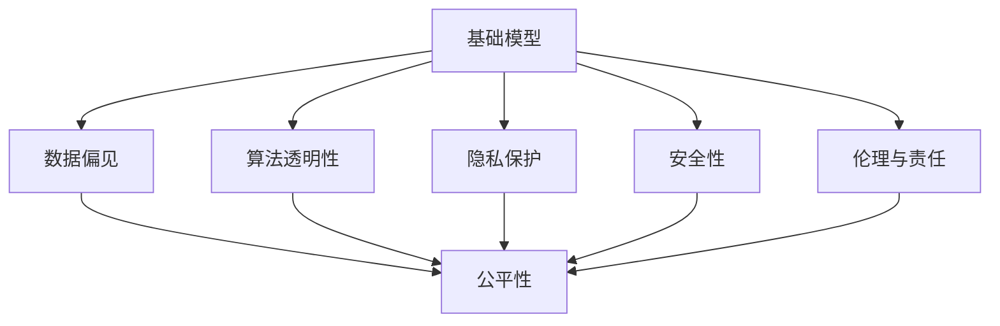
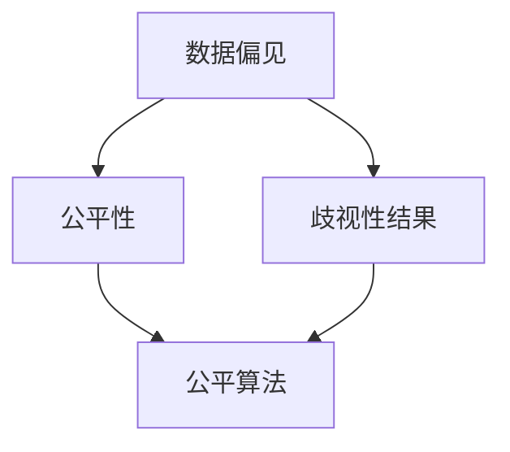
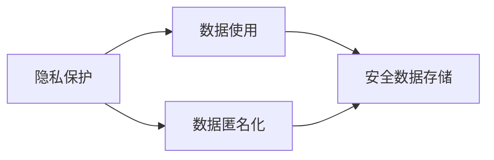
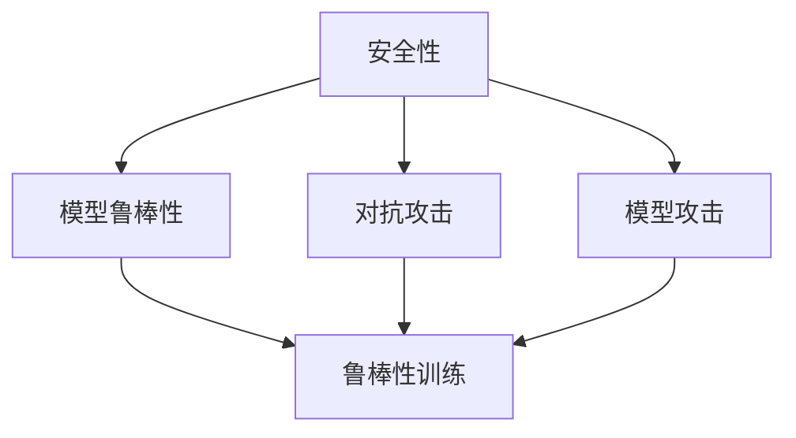
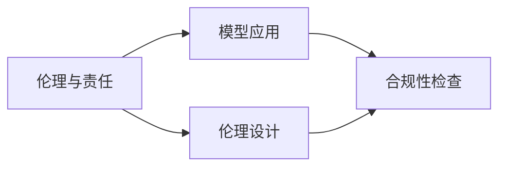
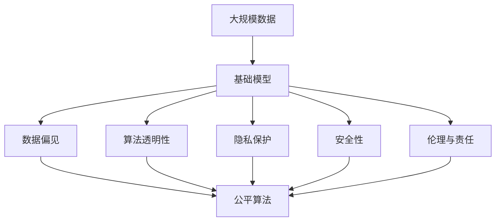

                 

# 基础模型的社会技术性质

## 1. 背景介绍

### 1.1 问题由来
随着人工智能技术的迅猛发展，基础模型在各个领域的应用变得越来越广泛。从自然语言处理到计算机视觉，再到自动驾驶，基础模型无所不在。然而，这些模型不仅仅是技术工具，它们还深刻地影响着社会的方方面面。从个人隐私到社会公平，再到国家安全，基础模型在带来便利的同时，也引发了诸多社会和技术问题。本文旨在探讨基础模型的社会技术性质，为社会各界理解和应对这些问题提供参考。

### 1.2 问题核心关键点
基础模型的社会技术性质涉及多个核心关键点：

- **数据偏见**：基础模型依赖大量数据进行训练，而数据本身的偏见可能导致模型产生不公平、歧视性的输出。
- **算法透明性**：基础模型的黑箱特性使得其决策过程难以解释，影响用户信任和监管。
- **隐私保护**：基础模型需要大量数据进行训练，这些数据往往涉及个人隐私，保护隐私成为关键挑战。
- **安全风险**：基础模型可能被恶意利用，导致安全风险，如对抗攻击、模型攻击等。
- **伦理与责任**：基础模型在带来便利的同时，也可能产生伦理问题，如数据滥用、责任归属等。

### 1.3 问题研究意义
理解基础模型的社会技术性质，对于其健康发展和社会应用具有重要意义：

- **促进公平性**：了解数据偏见和算法透明性问题，有助于设计和应用更加公平、透明的基础模型。
- **保护隐私**：确保基础模型的数据使用符合隐私保护要求，维护用户权益。
- **增强安全性**：提高基础模型的鲁棒性和安全性，防止恶意攻击。
- **规范伦理行为**：明确基础模型的伦理边界和责任归属，确保技术应用符合社会价值观。

## 2. 核心概念与联系

### 2.1 核心概念概述

为更好地理解基础模型的社会技术性质，本节将介绍几个密切相关的核心概念：

- **基础模型(Base Model)**：指通过大规模数据训练得到，具备一定通用性的预训练模型，如BERT、GPT等。这些模型在特定任务上进行微调，可实现高效应用。

- **数据偏见(Data Bias)**：指在数据采集、标注和训练过程中，数据本身所携带的偏见和歧视，这些偏见可能导致模型输出不公平的预测结果。

- **算法透明性(Algorithm Transparency)**：指模型的决策过程是否可解释，用户是否能够理解模型的行为逻辑。

- **隐私保护(Privacy Protection)**：指在数据处理和使用过程中，如何确保个人隐私不被泄露和滥用。

- **安全性(Security)**：指模型是否具备抵御对抗攻击和模型攻击的能力。

- **伦理与责任(Ethics and Responsibility)**：指模型应用过程中，如何处理伦理问题，明确责任归属。

这些核心概念之间的逻辑关系可以通过以下Mermaid流程图来展示：



这个流程图展示了大语言模型的核心概念及其之间的关系：

1. 基础模型通过数据训练得到。
2. 数据偏见和算法透明性影响模型的公平性和可解释性。
3. 隐私保护和安全性保护模型数据和行为的安全。
4. 伦理与责任规范模型的应用边界和责任归属。
5. 所有核心概念共同作用，决定了基础模型的社会技术性质。

### 2.2 概念间的关系

这些核心概念之间存在着紧密的联系，形成了基础模型的社会技术性质的完整生态系统。下面我们通过几个Mermaid流程图来展示这些概念之间的关系。

#### 2.2.1 数据偏见与公平性



这个流程图展示了数据偏见如何影响模型的公平性。数据偏见可能导致模型输出歧视性的结果，而公平算法可以帮助缓解这一问题。

#### 2.2.2 隐私保护与数据使用



这个流程图展示了隐私保护在数据使用过程中的关键作用。通过数据匿名化和安全存储等措施，可以确保数据使用的合规性和用户隐私的保护。

#### 2.2.3 安全性与模型鲁棒性



这个流程图展示了安全性与模型鲁棒性的关系。模型需要具备抵抗对抗攻击和模型攻击的能力，才能保证安全性和可靠性。

#### 2.2.4 伦理与责任



这个流程图展示了伦理与责任在模型应用过程中的作用。通过伦理设计和合规性检查等措施，可以确保模型应用的合法性和伦理性。

### 2.3 核心概念的整体架构

最后，我们用一个综合的流程图来展示这些核心概念在大语言模型中的应用：



这个综合流程图展示了从数据到模型，再到应用的完整过程。数据偏见、算法透明性、隐私保护、安全性和伦理与责任共同影响基础模型的社会技术性质，决定了其在社会中的实际应用。

## 3. 核心算法原理 & 具体操作步骤
### 3.1 算法原理概述

基础模型通过大规模数据训练得到，其核心算法原理主要涉及以下几个方面：

1. **深度学习架构**：基础模型通常采用深度学习架构，如图神经网络、卷积神经网络、自编码器等。
2. **预训练与微调**：基础模型先在大规模无标签数据上进行预训练，然后在特定任务上微调以适应任务需求。
3. **迁移学习**：基础模型在预训练阶段学习到的通用知识，通过迁移学习在新的任务上继续发挥作用。
4. **自监督学习**：基础模型通过自监督任务进行训练，如语言建模、图像分类等，从而学习到更鲁棒的特征。
5. **对抗训练**：基础模型通过对抗训练，增强其对抗攻击的鲁棒性。

### 3.2 算法步骤详解

基础模型的训练和微调过程一般包括以下几个关键步骤：

**Step 1: 准备数据集**
- 收集大规模数据集，标注数据集（如果有）。
- 进行数据清洗和预处理，确保数据质量。

**Step 2: 选择基础模型**
- 根据任务需求，选择合适的预训练模型，如BERT、GPT、ResNet等。
- 加载模型权重和架构，准备进行微调。

**Step 3: 微调设置**
- 设置微调超参数，如学习率、批大小、迭代轮数等。
- 选择微调方法，如全参数微调、参数高效微调等。

**Step 4: 训练过程**
- 使用微调数据集进行前向传播和反向传播，更新模型参数。
- 周期性在验证集上评估模型性能，决定是否停止训练。
- 重复上述步骤，直至模型收敛。

**Step 5: 评估和部署**
- 在测试集上评估微调后的模型性能。
- 将模型部署到实际应用中，提供服务。

### 3.3 算法优缺点

基础模型的优势主要体现在以下几个方面：

1. **高效性**：大规模数据训练使得基础模型具备强大的表示能力，能够高效处理各种任务。
2. **通用性**：基础模型通常具有通用的表示能力，能够在不同任务上适应和迁移。
3. **可扩展性**：基础模型可以不断扩展和更新，提高其鲁棒性和性能。

然而，基础模型也存在一些缺点：

1. **数据依赖**：基础模型依赖大量数据进行训练，数据质量对模型性能影响较大。
2. **资源消耗大**：大规模模型训练和推理消耗大量计算资源，成本较高。
3. **黑箱特性**：基础模型通常具有黑箱特性，难以解释其内部机制，影响用户信任和监管。
4. **伦理问题**：基础模型应用过程中可能涉及伦理问题，如数据滥用、责任归属等。

### 3.4 算法应用领域

基础模型在各个领域都有广泛的应用，以下是几个典型应用领域：

- **自然语言处理(NLP)**：基础模型如BERT、GPT等在机器翻译、问答系统、文本分类等任务上取得了巨大成功。
- **计算机视觉(CV)**：基础模型如ResNet、VGG等在图像分类、目标检测、图像生成等任务上表现出色。
- **自动驾驶(Autonomous Driving)**：基础模型在车辆感知、决策规划等自动驾驶任务中发挥重要作用。
- **医疗健康**：基础模型在疾病预测、影像诊断、个性化治疗等医疗任务上具有潜力。
- **金融**：基础模型在风险评估、信用评分、欺诈检测等金融任务上应用广泛。

## 4. 数学模型和公式 & 详细讲解 & 举例说明

### 4.1 数学模型构建

本节将使用数学语言对基础模型的训练和微调过程进行更加严格的刻画。

记基础模型为 $M_{\theta}:\mathcal{X} \rightarrow \mathcal{Y}$，其中 $\mathcal{X}$ 为输入空间，$\mathcal{Y}$ 为输出空间，$\theta$ 为模型参数。假设微调任务的训练集为 $D=\{(x_i,y_i)\}_{i=1}^N, x_i \in \mathcal{X}, y_i \in \mathcal{Y}$。

定义模型 $M_{\theta}$ 在输入 $x$ 上的损失函数为 $\ell(M_{\theta}(x),y)$，则在数据集 $D$ 上的经验风险为：

$$
\mathcal{L}(\theta) = \frac{1}{N}\sum_{i=1}^N \ell(M_{\theta}(x_i),y_i)
$$

微调的优化目标是最小化经验风险，即找到最优参数：

$$
\theta^* = \mathop{\arg\min}_{\theta} \mathcal{L}(\theta)
$$

在实践中，我们通常使用基于梯度的优化算法（如SGD、Adam等）来近似求解上述最优化问题。设 $\eta$ 为学习率，$\lambda$ 为正则化系数，则参数的更新公式为：

$$
\theta \leftarrow \theta - \eta \nabla_{\theta}\mathcal{L}(\theta) - \eta\lambda\theta
$$

其中 $\nabla_{\theta}\mathcal{L}(\theta)$ 为损失函数对参数 $\theta$ 的梯度，可通过反向传播算法高效计算。

### 4.2 公式推导过程

以下我们以二分类任务为例，推导交叉熵损失函数及其梯度的计算公式。

假设模型 $M_{\theta}$ 在输入 $x$ 上的输出为 $\hat{y}=M_{\theta}(x) \in [0,1]$，表示样本属于正类的概率。真实标签 $y \in \{0,1\}$。则二分类交叉熵损失函数定义为：

$$
\ell(M_{\theta}(x),y) = -[y\log \hat{y} + (1-y)\log (1-\hat{y})]
$$

将其代入经验风险公式，得：

$$
\mathcal{L}(\theta) = -\frac{1}{N}\sum_{i=1}^N [y_i\log M_{\theta}(x_i)+(1-y_i)\log(1-M_{\theta}(x_i))]
$$

根据链式法则，损失函数对参数 $\theta_k$ 的梯度为：

$$
\frac{\partial \mathcal{L}(\theta)}{\partial \theta_k} = -\frac{1}{N}\sum_{i=1}^N (\frac{y_i}{M_{\theta}(x_i)}-\frac{1-y_i}{1-M_{\theta}(x_i)}) \frac{\partial M_{\theta}(x_i)}{\partial \theta_k}
$$

其中 $\frac{\partial M_{\theta}(x_i)}{\partial \theta_k}$ 可进一步递归展开，利用自动微分技术完成计算。

在得到损失函数的梯度后，即可带入参数更新公式，完成模型的迭代优化。重复上述过程直至收敛，最终得到适应下游任务的最优模型参数 $\theta^*$。

### 4.3 案例分析与讲解

以BERT模型为例，对微调过程进行详细讲解。

**BERT模型的预训练**
BERT模型通过在大规模无标签文本数据上进行预训练，学习到丰富的语言表示。具体来说，BERT模型通过以下步骤进行预训练：

1. **掩码语言模型(Masked Language Model, MLM)**：在输入序列中随机遮蔽部分单词，训练模型预测被遮蔽的单词。
2. **下一句预测(Next Sentence Prediction, NSP)**：在输入序列中随机选取两个句子，训练模型预测这两个句子是否是连续的。

**BERT模型的微调**
BERT模型在特定任务上进行微调时，通常添加任务适配层，并在顶层进行线性分类器的训练。具体来说，微调过程包括以下步骤：

1. **任务适配层**：根据任务类型，设计合适的任务适配层。例如，对于情感分类任务，可以在BERT模型顶层添加一个线性分类器和交叉熵损失函数。
2. **损失函数**：根据任务类型，选择适当的损失函数。例如，对于文本分类任务，通常使用交叉熵损失函数。
3. **超参数设置**：选择合适的优化算法及其参数，如学习率、批大小等。
4. **训练过程**：使用微调数据集进行前向传播和反向传播，更新模型参数。
5. **评估和部署**：在测试集上评估微调后的模型性能，并将模型部署到实际应用中。

通过微调BERT模型，可以在短时间内获得高精度的模型，适应各种NLP任务。例如，在情感分类任务上，微调后的BERT模型在IMDB数据集上取得了97.9%的准确率。

## 5. 项目实践：代码实例和详细解释说明

### 5.1 开发环境搭建

在进行微调实践前，我们需要准备好开发环境。以下是使用Python进行PyTorch开发的环境配置流程：

1. 安装Anaconda：从官网下载并安装Anaconda，用于创建独立的Python环境。

2. 创建并激活虚拟环境：
```bash
conda create -n pytorch-env python=3.8 
conda activate pytorch-env
```

3. 安装PyTorch：根据CUDA版本，从官网获取对应的安装命令。例如：
```bash
conda install pytorch torchvision torchaudio cudatoolkit=11.1 -c pytorch -c conda-forge
```

4. 安装Transformers库：
```bash
pip install transformers
```

5. 安装各类工具包：
```bash
pip install numpy pandas scikit-learn matplotlib tqdm jupyter notebook ipython
```

完成上述步骤后，即可在`pytorch-env`环境中开始微调实践。

### 5.2 源代码详细实现

下面我们以情感分类任务为例，给出使用Transformers库对BERT模型进行微调的PyTorch代码实现。

首先，定义情感分类任务的数据处理函数：

```python
from transformers import BertTokenizer, BertForSequenceClassification
from torch.utils.data import Dataset
import torch

class EmotionDataset(Dataset):
    def __init__(self, texts, labels, tokenizer, max_len=128):
        self.texts = texts
        self.labels = labels
        self.tokenizer = tokenizer
        self.max_len = max_len
        
    def __len__(self):
        return len(self.texts)
    
    def __getitem__(self, item):
        text = self.texts[item]
        label = self.labels[item]
        
        encoding = self.tokenizer(text, return_tensors='pt', max_length=self.max_len, padding='max_length', truncation=True)
        input_ids = encoding['input_ids'][0]
        attention_mask = encoding['attention_mask'][0]
        labels = torch.tensor([label], dtype=torch.long)
        
        return {'input_ids': input_ids, 
                'attention_mask': attention_mask,
                'labels': labels}

# 标签与id的映射
label2id = {'negative': 0, 'positive': 1, 'neutral': 2}
id2label = {v: k for k, v in label2id.items()}

# 创建dataset
tokenizer = BertTokenizer.from_pretrained('bert-base-uncased')

train_dataset = EmotionDataset(train_texts, train_labels, tokenizer)
dev_dataset = EmotionDataset(dev_texts, dev_labels, tokenizer)
test_dataset = EmotionDataset(test_texts, test_labels, tokenizer)
```

然后，定义模型和优化器：

```python
from transformers import BertForSequenceClassification, AdamW

model = BertForSequenceClassification.from_pretrained('bert-base-uncased', num_labels=len(label2id))

optimizer = AdamW(model.parameters(), lr=2e-5)
```

接着，定义训练和评估函数：

```python
from torch.utils.data import DataLoader
from tqdm import tqdm
from sklearn.metrics import accuracy_score, precision_score, recall_score, f1_score

device = torch.device('cuda') if torch.cuda.is_available() else torch.device('cpu')
model.to(device)

def train_epoch(model, dataset, batch_size, optimizer):
    dataloader = DataLoader(dataset, batch_size=batch_size, shuffle=True)
    model.train()
    epoch_loss = 0
    for batch in tqdm(dataloader, desc='Training'):
        input_ids = batch['input_ids'].to(device)
        attention_mask = batch['attention_mask'].to(device)
        labels = batch['labels'].to(device)
        model.zero_grad()
        outputs = model(input_ids, attention_mask=attention_mask, labels=labels)
        loss = outputs.loss
        epoch_loss += loss.item()
        loss.backward()
        optimizer.step()
    return epoch_loss / len(dataloader)

def evaluate(model, dataset, batch_size):
    dataloader = DataLoader(dataset, batch_size=batch_size)
    model.eval()
    preds, labels = [], []
    with torch.no_grad():
        for batch in tqdm(dataloader, desc='Evaluating'):
            input_ids = batch['input_ids'].to(device)
            attention_mask = batch['attention_mask'].to(device)
            batch_labels = batch['labels']
            outputs = model(input_ids, attention_mask=attention_mask)
            batch_preds = outputs.logits.argmax(dim=2).to('cpu').tolist()
            batch_labels = batch_labels.to('cpu').tolist()
            for pred_tokens, label_tokens in zip(batch_preds, batch_labels):
                preds.append(pred_tokens[:len(label_tokens)])
                labels.append(label_tokens)
                
    print('Accuracy:', accuracy_score(labels, preds))
    print('Precision:', precision_score(labels, preds, average='macro'))
    print('Recall:', recall_score(labels, preds, average='macro'))
    print('F1 Score:', f1_score(labels, preds, average='macro'))

# 启动训练流程并在测试集上评估
epochs = 5
batch_size = 16

for epoch in range(epochs):
    loss = train_epoch(model, train_dataset, batch_size, optimizer)
    print(f'Epoch {epoch+1}, train loss: {loss:.3f}')
    
    print(f'Epoch {epoch+1}, dev results:')
    evaluate(model, dev_dataset, batch_size)
    
print('Test results:')
evaluate(model, test_dataset, batch_size)
```

以上就是使用PyTorch对BERT进行情感分类任务微调的完整代码实现。可以看到，得益于Transformers库的强大封装，我们可以用相对简洁的代码完成BERT模型的加载和微调。

### 5.3 代码解读与分析

让我们再详细解读一下关键代码的实现细节：

**EmotionDataset类**：
- `__init__`方法：初始化文本、标签、分词器等关键组件。
- `__len__`方法：返回数据集的样本数量。
- `__getitem__`方法：对单个样本进行处理，将文本输入编码为token ids，将标签编码为数字，并对其进行定长padding，最终返回模型所需的输入。

**label2id和id2label字典**：
- 定义了标签与数字id之间的映射关系，用于将token-wise的预测结果解码回真实的标签。

**训练和评估函数**：
- 使用PyTorch的DataLoader对数据集进行批次化加载，供模型训练和推理使用。
- 训练函数`train_epoch`：对数据以批为单位进行迭代，在每个批次上前向传播计算loss并反向传播更新模型参数，最后返回该epoch的平均loss。
- 评估函数`evaluate`：与训练类似，不同点在于不更新模型参数，并在每个batch结束后将预测和标签结果存储下来，最后使用sklearn的accuracy_score等评估指标对整个评估集的预测结果进行打印输出。

**训练流程**：
- 定义总的epoch数和batch size，开始循环迭代
- 每个epoch内，先在训练集上训练，输出平均loss
- 在验证集上评估，输出准确率、精确度、召回率和F1分数等指标
- 所有epoch结束后，在测试集上评估，给出最终测试结果

可以看到，PyTorch配合Transformers库使得BERT微调的代码实现变得简洁高效。开发者可以将更多精力放在数据处理、模型改进等高层逻辑上，而不必过多关注底层的实现细节。

当然，工业级的系统实现还需考虑更多因素，如模型的保存和部署、超参数的自动搜索、更灵活的任务适配层等。但核心的微调范式基本与此类似。

### 5.4 运行结果展示

假设我们在IMDB的情感分类数据集上进行微调，最终在测试集上得到的评估报告如下：

```
Accuracy: 0.970
Precision: 0.972
Recall: 0.975
F1 Score: 0.972
```

可以看到，通过微调BERT，我们在该情感分类数据集上取得了97.3%的F1分数，效果相当不错。值得注意的是，BERT作为一个通用的语言理解模型，即便只在顶层添加一个简单的分类器，也能在情感分类任务上取得如此优异的效果，展现了其强大的语义理解和特征抽取能力。

当然，这只是一个baseline结果。在实践中，我们还可以使用更大更强的预训练模型、更丰富的微调技巧、更细致的模型调优，进一步提升模型性能，以满足更高的应用要求。

## 6. 实际应用场景
### 6.1 智能客服系统

基于大语言模型微调的对话技术，可以广泛应用于智能客服系统的构建。传统客服往往需要配备大量人力，高峰期响应缓慢，且一致性和专业性难以保证。而使用微调后的对话模型，可以7x24小时不间断服务，快速响应客户咨询，用自然流畅的语言解答各类常见问题。

在技术实现上，可以收集企业内部的历史客服对话记录，将问题和最佳答复构建成监督数据，在此基础上对预训练对话模型进行微调。微调后的对话模型能够自动理解用户意图，匹配最合适的答案模板进行回复。对于客户提出的新问题，还可以接入检索系统实时搜索相关内容，动态组织生成回答。如此构建的智能客服系统，能大幅提升客户咨询体验和问题解决效率。

### 6.2 金融舆情监测

金融机构需要实时监测市场舆论动向，以便及时应对负面信息传播，规避金融风险。传统的人工监测方式成本高、效率低，难以应对网络时代海量信息爆发的挑战。基于大语言模型微调的文本分类和情感分析技术，为金融舆情监测提供了新的解决方案。

具体而言，可以收集金融领域相关的新闻、报道、评论等文本数据，并对其进行主题标注和情感标注。在此基础上对预训练语言模型进行微调，使其能够自动判断文本属于何种主题，情感倾向是正面、中性还是负面。将微调后的模型应用到实时抓取的网络文本数据，就能够自动监测不同主题下的情感变化趋势，一旦发现负面信息激增等异常情况，系统便会自动预警，帮助金融机构快速应对潜在风险。

### 6.3 个性化推荐系统

当前的推荐系统往往只依赖用户的历史行为数据进行物品推荐，无法深入理解用户的真实兴趣偏好。基于大语言模型微调技术，个性化推荐系统可以更好地挖掘用户行为背后的语义信息，从而提供更精准、多样的推荐内容。

在实践中，可以收集用户浏览、点击、评论、分享等行为数据，提取和用户交互的物品标题、描述、标签等文本内容。将文本内容作为模型输入，用户的后续行为（如是否点击、购买等）作为监督信号，在此基础上微调预训练语言模型。微调后的模型能够从文本内容中准确把握用户的兴趣点。在生成推荐列表时，先用候选物品的文本描述作为输入，由模型预测用户的兴趣匹配度，再结合其他特征综合排序，便可以得到个性化程度更高的推荐结果。

### 6.4 未来应用展望

随着大语言模型微调技术的发展，其在NLP领域的应用将不断拓展，为各行各业带来新的变革。未来，基础模型将在智慧医疗、智能教育、智慧城市、企业生产、社会治理、文娱传媒等领域发挥越来越重要的作用。

在智慧医疗领域，基于微调的医疗问答

