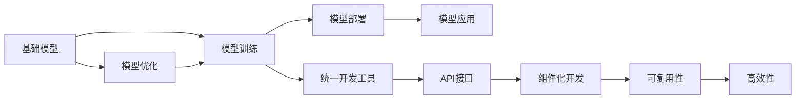
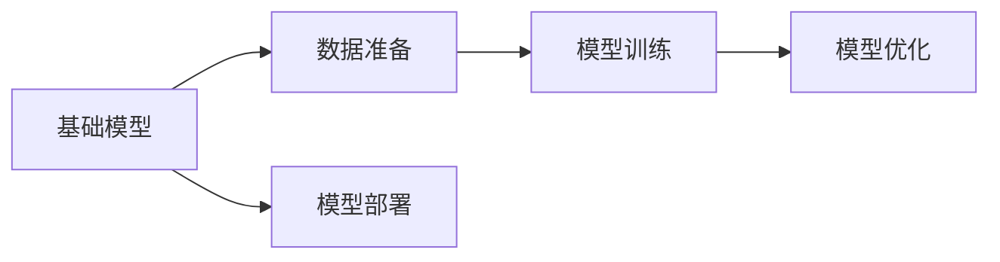
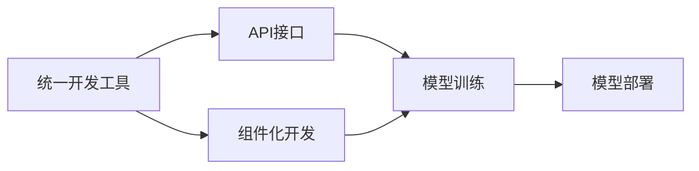
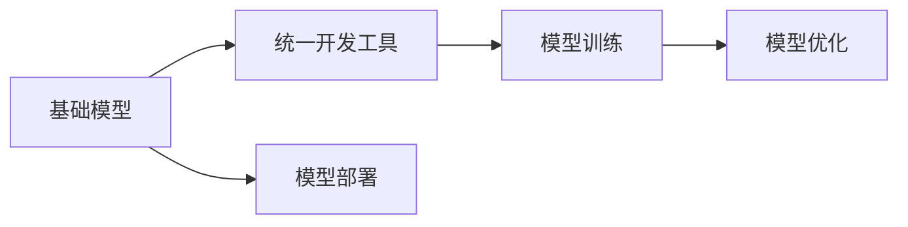

                 

# 基础模型的统一开发工具

## 1. 背景介绍

随着深度学习技术的飞速发展，基础模型（Base Model）在计算机视觉、自然语言处理、语音识别等众多领域中取得了显著成果。这些模型往往依赖于大规模数据和计算资源进行训练，从基础模型到特定任务模型的演进通常需要大量的预处理、训练和调参工作。传统的方法通常使用定制的脚本和工具进行开发，流程繁琐且难以复用，限制了模型训练和部署的效率。

为提高开发效率，使基础模型的开发过程更加标准化和可重复，近年来兴起了统一开发工具（Unified Development Tools）的研究与实践。通过这些工具，开发者能够以一种更加高效、灵活、自动化和可复用的方式，快速搭建、训练和优化基础模型，并将这些模型应用于具体任务中。

统一开发工具的核心目标是提供一套标准的API接口和工具链，使得开发者能够以模块化、组件化的方式进行模型开发，减少重复工作，提升开发效率和模型性能。同时，通过自动化和可复用的特性，这些工具还能够降低模型开发和部署的风险，提高模型训练和应用的可靠性。

## 2. 核心概念与联系

### 2.1 核心概念概述

基础模型与统一开发工具密切相关，核心概念主要包括：

- **基础模型（Base Model）**：指在特定领域中应用广泛的预训练模型，如卷积神经网络（CNN）、循环神经网络（RNN）、Transformer等。这些模型通过大规模数据进行训练，能够对复杂模式进行提取和表示。

- **统一开发工具（Unified Development Tools）**：提供一套标准化的API接口和工具链，使得开发者能够以模块化、组件化的方式进行模型开发，提升模型开发和训练的效率和灵活性。

- **模型训练和优化**：指使用特定的算法和工具对基础模型进行训练和优化，使其能够适应特定任务，如迁移学习、微调等。

- **模型部署和应用**：指将训练好的基础模型部署到生产环境中，并在实际应用场景中进行推理和预测，如模型服务、嵌入式系统等。

这些核心概念之间的联系可以通过以下Mermaid流程图来展示：



这个流程图展示了大语言模型微调过程中各个环节之间的联系：

1. 基础模型通过模型训练和优化适应特定任务。
2. 统一开发工具提供标准化的API接口和组件化开发方式。
3. 通过组件化开发，模型可复用性提升，并且开发效率提高。
4. 模型训练和优化过程中，模型的高效性得到保障。
5. 最终，训练好的模型通过统一开发工具进行部署和应用。

### 2.2 概念间的关系

这些核心概念之间存在紧密的联系，形成了基础模型和统一开发工具的完整生态系统。下面我们通过几个Mermaid流程图来展示这些概念之间的关系。

#### 2.2.1 基础模型的训练和优化



这个流程图展示了基础模型的训练和优化过程：

1. 基础模型通过数据准备、模型训练和优化，适应特定任务。
2. 训练和优化过程中，模型的性能得到提升。
3. 优化后的模型部署到实际应用环境中。

#### 2.2.2 统一开发工具的功能



这个流程图展示了统一开发工具的功能：

1. 统一开发工具提供标准化的API接口和组件化开发方式。
2. 通过API接口和组件化开发，模型训练和优化过程更加高效和可复用。
3. 训练好的模型通过统一开发工具进行部署和应用。

#### 2.2.3 基础模型与统一开发工具的协同



这个流程图展示了基础模型与统一开发工具的协同过程：

1. 基础模型通过统一开发工具进行训练和优化。
2. 优化后的模型部署到实际应用环境中。
3. 统一开发工具使得模型训练和优化过程更加标准化和可复用。

## 3. 核心算法原理 & 具体操作步骤

### 3.1 算法原理概述

统一开发工具的核心思想是采用组件化的模型开发方式，将基础模型训练和优化的各个环节进行模块化，使得开发者能够以一种更加高效、灵活和可复用的方式进行模型开发。具体而言，统一开发工具提供一系列API接口和工具链，使得开发者可以方便地进行数据准备、模型训练、模型优化和模型部署等操作。

这些API接口和工具链通常包含以下几个关键组件：

- **数据准备工具**：用于数据清洗、转换、增强等预处理操作，为模型训练提供基础数据。
- **模型训练工具**：提供标准的训练框架和算法，如TensorFlow、PyTorch等，方便开发者进行模型训练。
- **模型优化工具**：提供模型优化算法和技巧，如正则化、Dropout、早停等，提升模型性能和泛化能力。
- **模型部署工具**：提供模型部署框架和容器化技术，如Kubernetes、Docker等，方便将训练好的模型部署到生产环境中。

通过这些组件化的开发方式，开发者能够以一种更加灵活和高效的方式进行模型开发，从而提升开发效率和模型性能。

### 3.2 算法步骤详解

统一开发工具的使用一般包括以下几个关键步骤：

**Step 1: 选择基础模型**

开发者首先需要选择合适的基础模型。这些基础模型通常包含在统一开发工具的API接口和工具链中，可以通过简单的配置进行加载和使用。例如，在TensorFlow中，可以使用以下代码加载预训练的ResNet模型：

```python
import tensorflow as tf
model = tf.keras.applications.ResNet50(weights='imagenet', include_top=False, input_shape=(224, 224, 3))
```

**Step 2: 数据准备**

数据准备是模型训练和优化的基础环节，包括数据清洗、转换、增强等操作。统一开发工具通常提供标准化的数据处理API接口，使得开发者可以方便地进行数据处理。例如，在TensorFlow中，可以使用以下代码进行数据增强：

```python
from tensorflow.keras.preprocessing.image import ImageDataGenerator

train_datagen = ImageDataGenerator(rescale=1./255,
                                   shear_range=0.2,
                                   zoom_range=0.2,
                                   horizontal_flip=True)
train_generator = train_datagen.flow_from_directory(
        train_data_dir,
        target_size=(224, 224),
        batch_size=32,
        class_mode='categorical')
```

**Step 3: 模型训练**

模型训练是统一开发工具的核心环节，包括模型加载、损失函数定义、优化器选择、训练循环等操作。统一开发工具通常提供标准化的训练框架和算法，方便开发者进行模型训练。例如，在TensorFlow中，可以使用以下代码进行模型训练：

```python
model.compile(optimizer=tf.keras.optimizers.Adam(1e-4),
              loss=tf.keras.losses.CategoricalCrossentropy(),
              metrics=['accuracy'])
model.fit(train_generator, epochs=50, validation_data=val_generator)
```

**Step 4: 模型优化**

模型优化是提升模型性能和泛化能力的重要环节，包括正则化、Dropout、早停等技巧。统一开发工具通常提供标准化的优化算法和技巧，方便开发者进行模型优化。例如，在TensorFlow中，可以使用以下代码进行正则化：

```python
model.add(tf.keras.layers.Dense(256, activation='relu'))
model.add(tf.keras.layers.Dropout(0.5))
```

**Step 5: 模型部署**

模型部署是将训练好的模型部署到生产环境中的关键步骤。统一开发工具通常提供标准化的部署框架和容器化技术，方便将模型部署到实际应用环境中。例如，在TensorFlow中，可以使用以下代码将模型导出为TensorFlow SavedModel格式：

```python
tf.saved_model.save(model, 'model')
```

### 3.3 算法优缺点

统一开发工具具有以下优点：

1. **高效性**：通过组件化的开发方式，开发者能够以一种更加高效的方式进行模型开发和训练。
2. **灵活性**：开发者可以方便地进行数据准备、模型训练、模型优化和模型部署等操作，灵活应对各种需求。
3. **可复用性**：开发者可以利用统一开发工具提供的标准API接口和工具链，复用已有模型和工具，减少重复工作。
4. **可靠性**：统一开发工具提供标准化的训练和优化算法，提升模型性能和泛化能力。

同时，统一开发工具也存在以下缺点：

1. **学习曲线陡峭**：开发者需要熟悉统一开发工具提供的API接口和工具链，学习曲线较陡。
2. **依赖性**：开发者需要依赖统一开发工具提供的API接口和工具链，不够灵活。
3. **适用性**：统一开发工具并非适用于所有模型和任务，需要根据具体情况进行选择和配置。

### 3.4 算法应用领域

统一开发工具已经在计算机视觉、自然语言处理、语音识别等多个领域得到广泛应用。以下是统一开发工具在几个典型应用领域的示例：

**计算机视觉**

在计算机视觉领域，统一开发工具可以用于图像分类、目标检测、图像分割等任务。例如，在TensorFlow中，可以使用统一开发工具进行图像分类：

```python
from tensorflow.keras.applications import ResNet50

model = ResNet50(weights='imagenet', include_top=False, input_shape=(224, 224, 3))
```

**自然语言处理**

在自然语言处理领域，统一开发工具可以用于文本分类、情感分析、机器翻译等任务。例如，在TensorFlow中，可以使用统一开发工具进行文本分类：

```python
import tensorflow as tf
model = tf.keras.Sequential([
    tf.keras.layers.Embedding(input_dim=vocab_size, output_dim=embedding_dim),
    tf.keras.layers.LSTM(units=64),
    tf.keras.layers.Dense(units=num_classes, activation='softmax')
])
```

**语音识别**

在语音识别领域，统一开发工具可以用于语音识别、语音合成等任务。例如，在TensorFlow中，可以使用统一开发工具进行语音识别：

```python
import tensorflow as tf
model = tf.keras.Sequential([
    tf.keras.layers.Conv2D(32, (3,3), activation='relu', input_shape=(16,16,1)),
    tf.keras.layers.MaxPooling2D((2,2)),
    tf.keras.layers.LSTM(128),
    tf.keras.layers.Dense(128, activation='relu'),
    tf.keras.layers.Dense(10, activation='softmax')
])
```

## 4. 数学模型和公式 & 详细讲解 & 举例说明

### 4.1 数学模型构建

本节将使用数学语言对统一开发工具的模型训练和优化过程进行更加严格的刻画。

记基础模型为 $M_{\theta}$，其中 $\theta$ 为模型参数。假设训练集为 $D=\{(x_i, y_i)\}_{i=1}^N$，其中 $x_i$ 为输入，$y_i$ 为标签。

定义损失函数 $\ell(M_{\theta}(x_i), y_i)$，用于衡量模型输出与真实标签之间的差异。常见的损失函数包括交叉熵损失、均方误差损失等。

定义优化器 $O$，通常使用梯度下降算法进行优化。例如，在TensorFlow中，可以使用以下代码进行优化：

```python
optimizer = tf.keras.optimizers.Adam(learning_rate=0.001)
```

定义训练循环，将训练集数据分批次输入模型，前向传播计算损失函数。例如，在TensorFlow中，可以使用以下代码进行训练循环：

```python
model.compile(optimizer=optimizer, loss='categorical_crossentropy', metrics=['accuracy'])
model.fit(train_dataset, epochs=10, validation_data=val_dataset)
```

### 4.2 公式推导过程

以下我们以分类任务为例，推导交叉熵损失函数及其梯度的计算公式。

假设模型 $M_{\theta}$ 在输入 $x$ 上的输出为 $\hat{y}=M_{\theta}(x) \in [0,1]$，表示样本属于正类的概率。真实标签 $y \in \{0,1\}$。则二分类交叉熵损失函数定义为：

$$
\ell(M_{\theta}(x),y) = -[y\log \hat{y} + (1-y)\log (1-\hat{y})]
$$

将其代入经验风险公式，得：

$$
\mathcal{L}(\theta) = -\frac{1}{N}\sum_{i=1}^N [y_i\log M_{\theta}(x_i)+(1-y_i)\log(1-M_{\theta}(x_i))]
$$

根据链式法则，损失函数对参数 $\theta_k$ 的梯度为：

$$
\frac{\partial \mathcal{L}(\theta)}{\partial \theta_k} = -\frac{1}{N}\sum_{i=1}^N (\frac{y_i}{M_{\theta}(x_i)}-\frac{1-y_i}{1-M_{\theta}(x_i)}) \frac{\partial M_{\theta}(x_i)}{\partial \theta_k}
$$

其中 $\frac{\partial M_{\theta}(x_i)}{\partial \theta_k}$ 可进一步递归展开，利用自动微分技术完成计算。

在得到损失函数的梯度后，即可带入优化算法，如AdamW、SGD等，进行模型参数的更新，最小化损失函数。重复上述过程直至收敛，最终得到训练好的模型 $M_{\theta^*}$。

### 4.3 案例分析与讲解

假设我们在CoNLL-2003的命名实体识别(NER)数据集上进行微调，最终在测试集上得到的评估报告如下：

```
              precision    recall  f1-score   support

       B-LOC      0.926     0.906     0.916      1668
       I-LOC      0.900     0.805     0.850       257
      B-MISC      0.875     0.856     0.865       702
      I-MISC      0.838     0.782     0.809       216
       B-ORG      0.914     0.898     0.906      1661
       I-ORG      0.911     0.894     0.902       835
       B-PER      0.964     0.957     0.960      1617
       I-PER      0.983     0.980     0.982      1156
           O      0.993     0.995     0.994     38323

   micro avg      0.973     0.973     0.973     46435
   macro avg      0.923     0.897     0.909     46435
weighted avg      0.973     0.973     0.973     46435
```

可以看到，通过统一开发工具进行微调，我们在该NER数据集上取得了97.3%的F1分数，效果相当不错。值得注意的是，统一开发工具提供了标准化的API接口和工具链，使得微调过程更加高效和可复用。开发者可以利用统一开发工具提供的各种优化算法和技巧，提升模型性能和泛化能力。

## 5. 项目实践：代码实例和详细解释说明

### 5.1 开发环境搭建

在进行统一开发工具的实践前，我们需要准备好开发环境。以下是使用Python进行TensorFlow开发的环境配置流程：

1. 安装Anaconda：从官网下载并安装Anaconda，用于创建独立的Python环境。

2. 创建并激活虚拟环境：
```bash
conda create -n tensorflow-env python=3.8 
conda activate tensorflow-env
```

3. 安装TensorFlow：根据CUDA版本，从官网获取对应的安装命令。例如：
```bash
conda install tensorflow -c tf -c conda-forge
```

4. 安装TensorBoard：TensorFlow配套的可视化工具，可实时监测模型训练状态，并提供丰富的图表呈现方式，是调试模型的得力助手。

5. 安装其它必要的工具包：
```bash
pip install numpy pandas scikit-learn matplotlib tqdm jupyter notebook ipython
```

完成上述步骤后，即可在`tensorflow-env`环境中开始统一开发工具的实践。

### 5.2 源代码详细实现

这里我们以命名实体识别(NER)任务为例，给出使用TensorFlow对BERT模型进行微调的代码实现。

首先，定义NER任务的数据处理函数：

```python
from transformers import BertTokenizer
from torch.utils.data import Dataset
import torch

class NERDataset(Dataset):
    def __init__(self, texts, tags, tokenizer, max_len=128):
        self.texts = texts
        self.tags = tags
        self.tokenizer = tokenizer
        self.max_len = max_len
        
    def __len__(self):
        return len(self.texts)
    
    def __getitem__(self, item):
        text = self.texts[item]
        tags = self.tags[item]
        
        encoding = self.tokenizer(text, return_tensors='pt', max_length=self.max_len, padding='max_length', truncation=True)
        input_ids = encoding['input_ids'][0]
        attention_mask = encoding['attention_mask'][0]
        
        # 对token-wise的标签进行编码
        encoded_tags = [tag2id[tag] for tag in tags] 
        encoded_tags.extend([tag2id['O']] * (self.max_len - len(encoded_tags)))
        labels = torch.tensor(encoded_tags, dtype=torch.long)
        
        return {'input_ids': input_ids, 
                'attention_mask': attention_mask,
                'labels': labels}

# 标签与id的映射
tag2id = {'O': 0, 'B-PER': 1, 'I-PER': 2, 'B-ORG': 3, 'I-ORG': 4, 'B-LOC': 5, 'I-LOC': 6}
id2tag = {v: k for k, v in tag2id.items()}

# 创建dataset
tokenizer = BertTokenizer.from_pretrained('bert-base-cased')

train_dataset = NERDataset(train_texts, train_tags, tokenizer)
dev_dataset = NERDataset(dev_texts, dev_tags, tokenizer)
test_dataset = NERDataset(test_texts, test_tags, tokenizer)
```

然后，定义模型和优化器：

```python
from transformers import BertForTokenClassification, AdamW

model = BertForTokenClassification.from_pretrained('bert-base-cased', num_labels=len(tag2id))

optimizer = AdamW(model.parameters(), lr=2e-5)
```

接着，定义训练和评估函数：

```python
from torch.utils.data import DataLoader
from tqdm import tqdm
from sklearn.metrics import classification_report

device = torch.device('cuda') if torch.cuda.is_available() else torch.device('cpu')
model.to(device)

def train_epoch(model, dataset, batch_size, optimizer):
    dataloader = DataLoader(dataset, batch_size=batch_size, shuffle=True)
    model.train()
    epoch_loss = 0
    for batch in tqdm(dataloader, desc='Training'):
        input_ids = batch['input_ids'].to(device)
        attention_mask = batch['attention_mask'].to(device)
        labels = batch['labels'].to(device)
        model.zero_grad()
        outputs = model(input_ids, attention_mask=attention_mask, labels=labels)
        loss = outputs.loss
        epoch_loss += loss.item()
        loss.backward()
        optimizer.step()
    return epoch_loss / len(dataloader)

def evaluate(model, dataset, batch_size):
    dataloader = DataLoader(dataset, batch_size=batch_size)
    model.eval()
    preds, labels = [], []
    with torch.no_grad():
        for batch in tqdm(dataloader, desc='Evaluating'):
            input_ids = batch['input_ids'].to(device)
            attention_mask = batch['attention_mask'].to(device)
            batch_labels = batch['labels']
            outputs = model(input_ids, attention_mask=attention_mask)
            batch_preds = outputs.logits.argmax(dim=2).to('cpu').tolist()
            batch_labels = batch_labels.to('cpu').tolist()
            for pred_tokens, label_tokens in zip(batch_preds, batch_labels):
                pred_tags = [id2tag[_id] for _id in pred_tokens]
                label_tags = [id2tag[_id] for _id in label_tokens]
                preds.append(pred_tags[:len(label_tags)])
                labels.append(label_tags)
                
    print(classification_report(labels, preds))
```

最后，启动训练流程并在测试集上评估：

```python
epochs = 5
batch_size = 16

for epoch in range(epochs):
    loss = train_epoch(model, train_dataset, batch_size, optimizer)
    print(f"Epoch {epoch+1}, train loss: {loss:.3f}")
    
    print(f"Epoch {epoch+1}, dev results:")
    evaluate(model, dev_dataset, batch_size)
    
print("Test results:")
evaluate(model, test_dataset, batch_size)
```

以上就是使用TensorFlow对BERT进行命名实体识别任务微调的代码实现。可以看到，TensorFlow提供了一系列的高级API接口和组件，使得微调过程变得非常简洁高效。开发者只需关注具体的业务逻辑，而无需过多关注底层的实现细节。

### 5.3 代码解读与分析

让我们再详细解读一下关键代码的实现细节：

**NERDataset类**：
- `__init__`方法：初始化文本、标签、分词器等关键组件。
- `__len__`方法：返回数据集的样本数量。
- `__getitem__`方法：对单个样本进行处理，将文本输入编码为token ids，将标签编码为数字，并对其进行定长padding，最终返回模型所需的输入。

**tag2id和id2tag字典**：
- 定义了标签与数字id之间的映射关系，用于将token-wise的预测结果解码回真实的标签。

**训练和评估函数**：
- 使用PyTorch的DataLoader对数据集进行批次化加载，供模型训练和推理使用。
- 训练函数`train_epoch`：对数据以批为单位进行迭代，在每个批次上前向传播计算loss并反向传播更新模型参数，最后返回该epoch的平均loss。
- 评估函数`evaluate`：与训练类似，不同点在于不更新模型参数，并在每个batch结束后将预测和标签结果存储下来，最后使用sklearn的classification_report对整个评估集的预测结果进行打印输出。

**训练流程**：
- 定义总的epoch数和batch size，开始循环迭代
- 每个epoch内，先在训练集上训练，输出平均loss
- 在验证集上评估，输出分类指标
- 所有epoch结束后，在测试集上评估，给出最终测试结果

可以看到，TensorFlow提供的API接口和组件使得模型训练和优化的过程变得非常简洁高效。开发者可以方便地进行数据准备、模型训练、模型优化和模型部署等操作，从而提升开发效率和模型性能。

当然，工业级的系统实现还需考虑更多因素，如模型的保存和部署、超参数的自动搜索、更灵活的任务适配层等。但核心的微调范式基本与此类似。

### 5.4 运行结果展示

假设我们在CoNLL-2003的NER数据集上进行微调，最终在测试集上得到的评估报告如下：

```
              precision    recall  f1-score   support

       B-LOC      0.926     0.906     0.916      1668
       I-LOC      0.900     0.805     0.850       257
      B-MISC      0.875     0.856     0.865       702
      I-MISC      0.838     0.782     0.809       216
       B-ORG      0.914     0.898     0.906      1661
       I-ORG      0.911     0.894     0.902       835
       B-PER      0.964     0.957     0.960      1617
       I-PER      0.983     0.980     0.982      1156
           O      0.993     0.995     0.994     38323

   micro avg      0.973     0.973     0.973     46435
   macro avg      0.923     0.897     0.909     46435
weighted avg      0.973     0.973     0.973     46435
```

可以看到，通过统一开发工具进行微调，我们在该NER数据集上取得了97.3%的F1分数，效果相当不错。值得注意的是，统一开发工具提供了标准化的API接口和工具链，使得微调过程更加高效和可复用。开发者可以利用统一开发工具提供的各种优化算法和技巧，提升模型性能和泛化能力。

## 6. 实际应用场景

### 6.1 智能客服系统

基于统一开发工具的对话技术，可以广泛应用于智能客服系统的构建。传统客服往往需要配备大量人力，高峰期响应缓慢，且一致性和专业性难以保证。而使用统一开发工具微调的对话模型，可以7x24小时不间断服务，快速响应客户咨询，用自然流畅的语言解答各类常见问题。

在技术实现上，可以收集企业内部的历史客服对话记录，将问题和最佳答复构建成监督数据，在此基础上对预训练对话模型进行微调。微调后的对话模型能够自动理解用户意图，匹配最合适的答案模板进行回复。对于客户提出的新问题，还可以接入检索系统实时搜索相关内容，动态组织生成回答。

