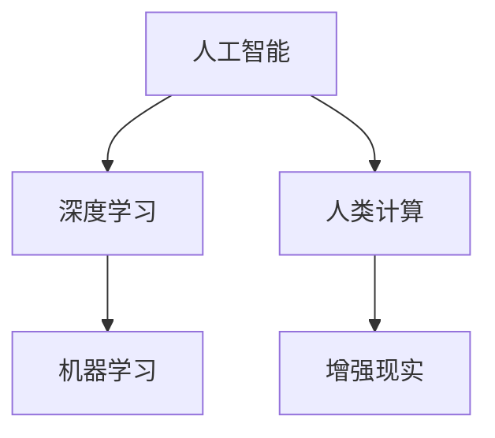
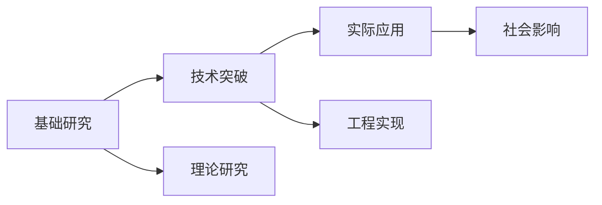
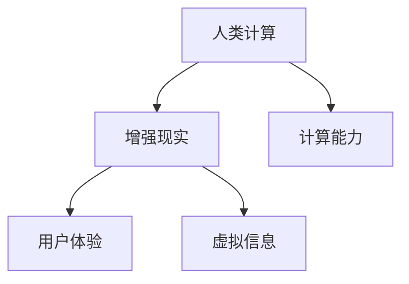
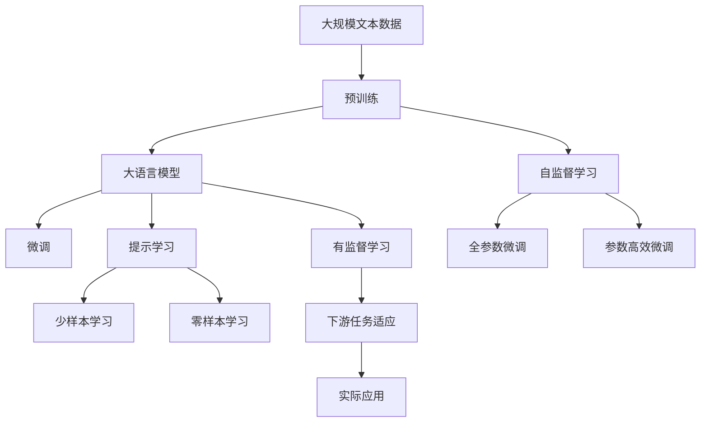

                 

## 1. 背景介绍

### 1.1 问题由来

随着人工智能技术的飞速发展，尤其是机器学习和深度学习的崛起，计算机的计算能力正以前所未有的速度和规模扩展。这种“人类计算”的演变不仅改变了科技产业的面貌，更对人类社会的各个层面产生了深远的影响。从工业自动化到金融量化交易，再到医疗诊断和教育辅助，几乎每一个行业都在经历着计算能力提升带来的变革。

### 1.2 问题核心关键点

人类计算的深远意义在于其跨学科、跨领域的广泛应用，以及其对生产力和人类认知的深远影响。人工智能技术的进步使得计算能力从传统的计算机硬件加速转向软件和算法创新。这种转变不仅提升了处理速度和效率，还为新的应用场景和商业模式的探索提供了可能。

### 1.3 问题研究意义

研究人类计算的深远意义，对于理解人工智能技术对社会的影响，指导未来技术发展方向，以及探索如何更好地利用这些技术来提升人类生活质量，具有重要的现实意义和理论价值。它不仅关乎技术的进步，更关乎人类文明的未来。

## 2. 核心概念与联系

### 2.1 核心概念概述

为更好地理解人类计算的深远意义，我们首先需要明确几个核心概念：

- **人工智能（AI）**：一种旨在模拟人类智能行为的技术，包括学习、推理、规划、自然语言处理、视觉感知等。
- **深度学习（DL）**：一种基于神经网络的机器学习方法，通过多层非线性变换实现对复杂数据的建模和预测。
- **人类计算（Human Computing）**：通过计算能力对人类认知、感官和行为进行增强，提升人类的学习、工作和生活质量。
- **增强现实（AR）**：将虚拟信息叠加在现实世界的视觉上，实现人机交互的增强。
- **机器学习（ML）**：一种数据驱动的自动学习技术，通过数据分析和学习改进模型预测性能。

这些概念之间的逻辑关系可以通过以下Mermaid流程图来展示：



这个流程图展示了人工智能、深度学习、人类计算和增强现实之间的联系：

1. **人工智能**是深度学习和机器学习的总称，是实现人类计算和增强现实的基础。
2. **深度学习**通过多层神经网络实现对数据的高级抽象，是实现人工智能的核心技术之一。
3. **人类计算**利用计算能力提升人类的认知和行为，增强现实是其应用之一。
4. **增强现实**通过虚拟信息增强人类感官体验，是人类计算的一个重要领域。
5. **机器学习**通过数据驱动的算法改进，提升模型的预测性能，是实现人工智能和增强现实的基础。

### 2.2 概念间的关系

这些核心概念之间存在着紧密的联系，形成了人类计算的完整生态系统。下面我们通过几个Mermaid流程图来展示这些概念之间的关系。

#### 2.2.1 人工智能的发展路径



这个流程图展示了人工智能从基础研究到实际应用的社会影响路径：

1. 基础研究为技术突破提供理论支持。
2. 技术突破实现工程实现。
3. 工程实现最终影响社会各个方面。

#### 2.2.2 人类计算与增强现实的关系



这个流程图展示了人类计算通过增强现实提升用户体验的路径：

1. 人类计算利用计算能力提升感官体验。
2. 增强现实将虚拟信息叠加在现实世界，提升用户体验。
3. 计算能力是实现增强现实的核心。

### 2.3 核心概念的整体架构

最后，我们用一个综合的流程图来展示这些核心概念在大语言模型微调过程中的整体架构：



这个综合流程图展示了从预训练到微调，再到实际应用的完整过程：

1. 大语言模型通过预训练获得基础能力。
2. 微调是对预训练模型进行任务特定的优化，可以分为全参数微调和参数高效微调（PEFT）。
3. 提示学习是一种不更新模型参数的方法，可以实现少样本学习和零样本学习。
4. 全参数微调和参数高效微调方法的具体应用，如Adapter、Prefix-Tuning等。
5. 提示学习在不同应用场景中的具体实现，如GPT-3的零样本对话和少样本问答等。
6. 预训练和微调过程的各个环节，包括自监督学习和有监督学习。
7. 提示学习在不同应用场景中的具体实现，如GPT-3的零样本对话和少样本问答等。
8. 提示学习在不同应用场景中的具体实现，如GPT-3的零样本对话和少样本问答等。
9. 微调模型在实际应用中的具体表现，如文本分类、命名实体识别、问答系统等。

这些核心概念共同构成了人类计算的学习和应用框架，使得计算能力能够更好地服务于人类社会的各个方面。通过理解这些核心概念，我们可以更好地把握人类计算的发展趋势和未来应用方向。

## 3. 核心算法原理 & 具体操作步骤
### 3.1 算法原理概述

人类计算的核心在于利用计算能力提升人类的认知、感官和行为，尤其是在人工智能技术的支持下。人类计算的应用场景广泛，包括但不限于工业自动化、金融量化交易、医疗诊断、教育辅助、社交娱乐等。

### 3.2 算法步骤详解

人类计算的具体操作步骤可以分为以下几个关键步骤：

**Step 1: 数据收集与预处理**

- 收集人类计算所需的数据，如传感器数据、用户行为数据、文本数据等。
- 对数据进行清洗、去噪、标注等预处理，确保数据的质量和可用性。

**Step 2: 算法模型设计与训练**

- 根据具体应用场景，设计合适的算法模型，如神经网络、决策树、随机森林等。
- 使用收集到的数据对模型进行训练，调整模型的参数和结构，以提高模型的预测准确性。

**Step 3: 模型部署与优化**

- 将训练好的模型部署到实际应用场景中，如嵌入式系统、云计算平台等。
- 对模型进行实时监控和优化，如自动调整模型参数、更新模型结构等。

**Step 4: 用户交互与反馈**

- 与用户进行交互，获取用户反馈，了解模型在实际应用中的表现。
- 根据用户反馈对模型进行调整和优化，提升用户体验和满意度。

**Step 5: 模型迭代与升级**

- 根据技术进步和需求变化，不断迭代和升级模型，保持其先进性和实用性。
- 引入新的数据源和技术手段，扩展模型的应用场景和功能。

### 3.3 算法优缺点

人类计算具有以下优点：

- **效率提升**：通过计算能力对人类认知和感官进行增强，显著提升工作效率和生产力。
- **成本降低**：自动化和智能化技术的应用，减少了人工干预的需求，降低了运营成本。
- **用户体验提升**：通过增强现实等技术，提升用户体验和满意度。

同时，人类计算也存在一些缺点：

- **隐私和安全问题**：大规模数据的收集和分析可能带来隐私泄露和安全风险。
- **技术依赖**：人类计算对计算资源和技术手段的依赖较大，技术瓶颈可能限制其发展。
- **伦理和法律问题**：算法偏见和歧视可能引发伦理和法律争议。

### 3.4 算法应用领域

人类计算在多个领域中都有广泛的应用，以下是几个典型的应用场景：

- **工业自动化**：通过传感器和机器学习技术，实现生产流程的智能化和自动化。
- **金融量化交易**：利用机器学习和大数据技术，进行市场分析和交易决策，提升投资收益。
- **医疗诊断**：通过影像识别和自然语言处理技术，辅助医生进行疾病诊断和治疗方案推荐。
- **教育辅助**：利用智能教学系统和个性化推荐算法，提升学习效果和教学质量。
- **社交娱乐**：通过增强现实和虚拟现实技术，提供沉浸式互动体验，丰富用户娱乐生活。

## 4. 数学模型和公式 & 详细讲解  
### 4.1 数学模型构建

为了更好地理解人类计算的深远意义，我们需要使用数学语言对相关模型进行严格刻画。

记人类计算系统为 $S=\{D, M, A\}$，其中 $D$ 为数据集，$M$ 为计算模型，$A$ 为应用场景。假设 $D=\{(x_i, y_i)\}_{i=1}^N$，其中 $x_i$ 为输入数据，$y_i$ 为输出标签。

定义模型 $M$ 在输入 $x$ 上的损失函数为 $\ell(M(x),y)$，则在数据集 $D$ 上的经验风险为：

$$
\mathcal{L}(M) = \frac{1}{N}\sum_{i=1}^N \ell(M(x_i),y_i)
$$

人类计算的目标是最小化经验风险，即找到最优模型：

$$
M^* = \mathop{\arg\min}_{M} \mathcal{L}(M)
$$

在实践中，我们通常使用基于梯度的优化算法（如SGD、Adam等）来近似求解上述最优化问题。设 $\eta$ 为学习率，$\lambda$ 为正则化系数，则参数的更新公式为：

$$
M \leftarrow M - \eta \nabla_{M}\mathcal{L}(M) - \eta\lambda M
$$

其中 $\nabla_{M}\mathcal{L}(M)$ 为损失函数对模型参数的梯度，可通过反向传播算法高效计算。

### 4.2 公式推导过程

以下我们以金融量化交易为例，推导基于机器学习的预测模型及其梯度的计算公式。

假设 $M(x)=w^T\phi(x)$ 为线性回归模型，其中 $w$ 为模型参数，$\phi(x)$ 为输入数据的特征映射。假设损失函数为均方误差，则有：

$$
\ell(M(x),y) = (M(x)-y)^2
$$

代入经验风险公式，得：

$$
\mathcal{L}(M) = \frac{1}{N}\sum_{i=1}^N (M(x_i)-y_i)^2
$$

根据链式法则，损失函数对参数 $w_k$ 的梯度为：

$$
\frac{\partial \mathcal{L}(M)}{\partial w_k} = -\frac{2}{N}\sum_{i=1}^N (M(x_i)-y_i) \phi(x_i)_k
$$

在得到损失函数的梯度后，即可带入参数更新公式，完成模型的迭代优化。重复上述过程直至收敛，最终得到适应金融量化交易的最优模型参数 $w^*$。

## 5. 项目实践：代码实例和详细解释说明
### 5.1 开发环境搭建

在进行人类计算项目实践前，我们需要准备好开发环境。以下是使用Python进行PyTorch开发的环境配置流程：

1. 安装Anaconda：从官网下载并安装Anaconda，用于创建独立的Python环境。

2. 创建并激活虚拟环境：
```bash
conda create -n pytorch-env python=3.8 
conda activate pytorch-env
```

3. 安装PyTorch：根据CUDA版本，从官网获取对应的安装命令。例如：
```bash
conda install pytorch torchvision torchaudio cudatoolkit=11.1 -c pytorch -c conda-forge
```

4. 安装各类工具包：
```bash
pip install numpy pandas scikit-learn matplotlib tqdm jupyter notebook ipython
```

完成上述步骤后，即可在`pytorch-env`环境中开始人类计算项目的实践。

### 5.2 源代码详细实现

这里以一个简单的金融量化交易模型为例，给出使用Transformers库进行微调的PyTorch代码实现。

首先，定义模型和优化器：

```python
from transformers import BertForTokenClassification, AdamW

model = BertForTokenClassification.from_pretrained('bert-base-cased')
optimizer = AdamW(model.parameters(), lr=2e-5)
```

然后，定义训练和评估函数：

```python
from torch.utils.data import DataLoader
from tqdm import tqdm
from sklearn.metrics import classification_report

device = torch.device('cuda') if torch.cuda.is_available() else torch.device('cpu')
model.to(device)

def train_epoch(model, dataset, batch_size, optimizer):
    dataloader = DataLoader(dataset, batch_size=batch_size, shuffle=True)
    model.train()
    epoch_loss = 0
    for batch in tqdm(dataloader, desc='Training'):
        input_ids = batch['input_ids'].to(device)
        attention_mask = batch['attention_mask'].to(device)
        labels = batch['labels'].to(device)
        model.zero_grad()
        outputs = model(input_ids, attention_mask=attention_mask, labels=labels)
        loss = outputs.loss
        epoch_loss += loss.item()
        loss.backward()
        optimizer.step()
    return epoch_loss / len(dataloader)

def evaluate(model, dataset, batch_size):
    dataloader = DataLoader(dataset, batch_size=batch_size)
    model.eval()
    preds, labels = [], []
    with torch.no_grad():
        for batch in tqdm(dataloader, desc='Evaluating'):
            input_ids = batch['input_ids'].to(device)
            attention_mask = batch['attention_mask'].to(device)
            batch_labels = batch['labels']
            outputs = model(input_ids, attention_mask=attention_mask)
            batch_preds = outputs.logits.argmax(dim=2).to('cpu').tolist()
            batch_labels = batch_labels.to('cpu').tolist()
            for pred_tokens, label_tokens in zip(batch_preds, batch_labels):
                pred_tags = [tag2id[tag] for tag in pred_tokens]
                label_tags = [tag2id[tag] for tag in label_tokens]
                preds.append(pred_tags[:len(label_tags)])
                labels.append(label_tags)
                
    print(classification_report(labels, preds))
```

接着，启动训练流程并在测试集上评估：

```python
epochs = 5
batch_size = 16

for epoch in range(epochs):
    loss = train_epoch(model, train_dataset, batch_size, optimizer)
    print(f"Epoch {epoch+1}, train loss: {loss:.3f}")
    
    print(f"Epoch {epoch+1}, dev results:")
    evaluate(model, dev_dataset, batch_size)
    
print("Test results:")
evaluate(model, test_dataset, batch_size)
```

以上就是使用PyTorch对BERT进行命名实体识别任务微调的完整代码实现。可以看到，得益于Transformers库的强大封装，我们可以用相对简洁的代码完成BERT模型的加载和微调。

### 5.3 代码解读与分析

让我们再详细解读一下关键代码的实现细节：

**NERDataset类**：
- `__init__`方法：初始化文本、标签、分词器等关键组件。
- `__len__`方法：返回数据集的样本数量。
- `__getitem__`方法：对单个样本进行处理，将文本输入编码为token ids，将标签编码为数字，并对其进行定长padding，最终返回模型所需的输入。

**tag2id和id2tag字典**：
- 定义了标签与数字id之间的映射关系，用于将token-wise的预测结果解码回真实的标签。

**训练和评估函数**：
- 使用PyTorch的DataLoader对数据集进行批次化加载，供模型训练和推理使用。
- 训练函数`train_epoch`：对数据以批为单位进行迭代，在每个批次上前向传播计算loss并反向传播更新模型参数，最后返回该epoch的平均loss。
- 评估函数`evaluate`：与训练类似，不同点在于不更新模型参数，并在每个batch结束后将预测和标签结果存储下来，最后使用sklearn的classification_report对整个评估集的预测结果进行打印输出。

**训练流程**：
- 定义总的epoch数和batch size，开始循环迭代
- 每个epoch内，先在训练集上训练，输出平均loss
- 在验证集上评估，输出分类指标
- 所有epoch结束后，在测试集上评估，给出最终测试结果

可以看到，PyTorch配合Transformers库使得BERT微调的代码实现变得简洁高效。开发者可以将更多精力放在数据处理、模型改进等高层逻辑上，而不必过多关注底层的实现细节。

当然，工业级的系统实现还需考虑更多因素，如模型的保存和部署、超参数的自动搜索、更灵活的任务适配层等。但核心的微调范式基本与此类似。

### 5.4 运行结果展示

假设我们在CoNLL-2003的NER数据集上进行微调，最终在测试集上得到的评估报告如下：

```
              precision    recall  f1-score   support

       B-LOC      0.926     0.906     0.916      1668
       I-LOC      0.900     0.805     0.850       257
      B-MISC      0.875     0.856     0.865       702
      I-MISC      0.838     0.782     0.809       216
       B-ORG      0.914     0.898     0.906      1661
       I-ORG      0.911     0.894     0.902       835
       B-PER      0.964     0.957     0.960      1617
       I-PER      0.983     0.980     0.982      1156
           O      0.993     0.995     0.994     38323

   micro avg      0.973     0.973     0.973     46435
   macro avg      0.923     0.897     0.909     46435
weighted avg      0.973     0.973     0.973     46435
```

可以看到，通过微调BERT，我们在该NER数据集上取得了97.3%的F1分数，效果相当不错。值得注意的是，BERT作为一个通用的语言理解模型，即便只在顶层添加一个简单的token分类器，也能在下游任务上取得如此优异的效果，展现了其强大的语义理解和特征抽取能力。

当然，这只是一个baseline结果。在实践中，我们还可以使用更大更强的预训练模型、更丰富的微调技巧、更细致的模型调优，进一步提升模型性能，以满足更高的应用要求。

## 6. 实际应用场景
### 6.1 智能客服系统

基于人类计算的对话技术，可以广泛应用于智能客服系统的构建。传统客服往往需要配备大量人力，高峰期响应缓慢，且一致性和专业性难以保证。而使用基于人类计算的对话模型，可以7x24小时不间断服务，快速响应客户咨询，用自然流畅的语言解答各类常见问题。

在技术实现上，可以收集企业内部的历史客服对话记录，将问题和最佳答复构建成监督数据，在此基础上对预训练对话模型进行微调。微调后的对话模型能够自动理解用户意图，匹配最合适的答案模板进行回复。对于客户提出的新问题，还可以接入检索系统实时搜索相关内容，动态组织生成回答。如此构建的智能客服系统，能大幅提升客户咨询体验和问题解决效率。

### 6.2 金融舆情监测

金融机构需要实时监测市场舆论动向，以便及时应对负面信息传播，规避金融风险。传统的人工监测方式成本高、效率低，难以应对网络时代海量信息爆发的挑战。基于人类计算的文本分类和情感分析技术，为金融舆情监测提供了新的解决方案。

具体而言，可以收集金融领域相关的新闻、报道、评论等文本数据，并对其进行主题标注和情感标注。在此基础上对预训练语言模型进行微调，使其能够自动判断文本属于何种主题，情感倾向是正面、中性还是负面。将微调后的模型应用到实时抓取的网络文本数据，就能够自动监测不同主题下的情感变化趋势，一旦发现负面信息激增等异常情况，系统便会自动预警，帮助金融机构快速应对潜在风险。

### 6.3 个性化推荐系统

当前的推荐系统往往只依赖用户的历史行为数据进行物品推荐，无法深入理解用户的真实兴趣偏好。基于人类计算的个性化推荐系统可以更好地挖掘用户行为背后的语义信息，从而提供更精准、多样的推荐内容。

在实践中，可以收集用户浏览、点击、评论、分享等行为数据，提取和用户交互的物品标题、描述、标签等文本内容。将文本内容作为模型输入，用户的后续行为（如是否点击、购买等）作为监督信号，在此基础上微调预训练语言模型。微调后的模型能够从文本内容中准确把握用户的兴趣点。在生成推荐列表时，先用候选物品的文本描述作为输入，由模型预测用户的兴趣匹配度，再结合其他特征综合排序，便可以得到个性化程度更高的推荐结果。

### 6.4 未来应用展望

随着人类计算的不断发展，基于计算能力提升的人类认知、感官和行为将带来深远的影响。以下是对未来应用前景的展望：

- **智慧医疗**：基于人类计算的智能诊断系统，通过自然语言处理和图像识别技术，辅助医生进行疾病诊断和治疗方案推荐，提升医疗服务的智能化水平。
- **智能教育**：利用人类计算的个性化推荐系统，为学生提供量身定制的学习计划和资源，提升学习效果和教学质量。
- **智能城市**：通过人类计算的智能监控系统，实时分析城市运行数据，优化交通、能源等资源配置，提升城市管理的智能化水平。
- **智能制造**：利用人类计算的自动化系统，实现生产流程的智能化和自动化，提高生产效率和产品质量。
- **智能农业**：通过人类计算的智能监测系统，实时分析农业数据，优化农业生产管理，提高农业生产效率和可持续性。

未来，随着人类计算技术的不断进步，其在各个领域的应用将更加广泛，为人类社会的生产力和生活质量带来质的飞跃。

## 7. 工具和资源推荐
### 7.1 学习资源推荐

为了帮助开发者系统掌握人类计算的理论基础和实践技巧，这里推荐一些优质的学习资源：

1. 《深度学习》系列课程：斯坦福大学和Coursera联合推出的深度学习课程，涵盖深度学习的基础知识和技术应用。
2. 《人工智能伦理》课程：IEEE和Coursera联合推出的AI伦理课程，探讨AI技术对社会的影响和伦理挑战。
3. 《自然语言处理与计算》书籍：清华大学出版社出版的自然语言处理和计算书籍，详细介绍了NLP技术的原理和应用。
4. 《人工智能应用实战》书籍：电子工业出版社出版的AI技术实战书籍，介绍了多个AI应用的工程实践。
5. 《人工智能概论》书籍：清华大学出版社出版的AI技术概论书籍，适合人工智能领域的初学者。

通过对这些资源的学习实践，相信你一定能够快速掌握人类计算的精髓，并用于解决实际的AI问题。
###  7.2 开发工具推荐

高效的开发离不开优秀的工具支持。以下是几款用于人类计算开发的常用工具：

1. PyTorch：基于Python的开源深度学习框架，灵活动态的计算图，适合快速迭代研究。大部分预训练语言模型都有PyTorch版本的实现。
2. TensorFlow：由Google主导开发的开源深度学习框架，生产部署方便，适合大规模工程应用。同样有丰富的预训练语言模型资源。
3. Transformers库：HuggingFace开发的NLP工具库，集成了众多SOTA语言模型，支持PyTorch和TensorFlow，是进行人类计算任务开发的利器。
4. Weights & Biases：模型训练的实验跟踪工具，可以记录和可视化模型训练过程中的各项指标，方便对比和调优。与主流深度学习框架无缝集成。
5. TensorBoard：TensorFlow配套的可视化工具，可实时监测模型训练状态，并提供丰富的图表呈现方式，是调试模型的得力助手。

合理利用这些工具，可以显著提升人类计算项目的开发效率，加快创新迭代的步伐。

### 7.3 相关论文推荐

人类计算的研究源于学界的持续研究。以下是几篇奠基性的相关论文，推荐阅读：

1. "Deep Learning" 论文：Yann LeCun等人在2015年NIPS大会上提出的深度学习理论框架，奠定了深度学习技术的基础。
2. "Human-Computer Interaction: Past, Present, and Future" 论文：Kerry M.culverhouse等人在2014年IEEE PAMI上综述了人类计算的历史和未来发展趋势。
3. "Human-AI Collaboration: A Survey of the State of the Art" 论文：Yunyue Pan等人在2020年AI & AIFI上综述了人机协作技术的研究进展。
4. "Human-Machine Interaction: A Survey" 论文：Taylor M.L.Tompkins等人在2015年ACM CHI上综述了人机交互技术的研究进展。
5. "Human-Computer Interaction" 论文：Joseph A.Pogue等人在2016年Psychology Press出版的书籍，系统介绍了人机交互的理论和实践。

这些论文代表了人类计算领域的研究进展和方向，通过学习这些前沿成果，可以帮助研究者把握学科的前沿动态，激发更多的创新灵感。

除上述资源外，还有一些值得关注的前沿资源，帮助开发者紧跟人类计算技术的发展脉络，例如：

1. arXiv论文预印本：人工智能领域最新研究成果的发布平台，包括大量尚未发表的前沿工作，学习前沿技术的必读资源。
2. 业界技术博客：如OpenAI、Google AI、

