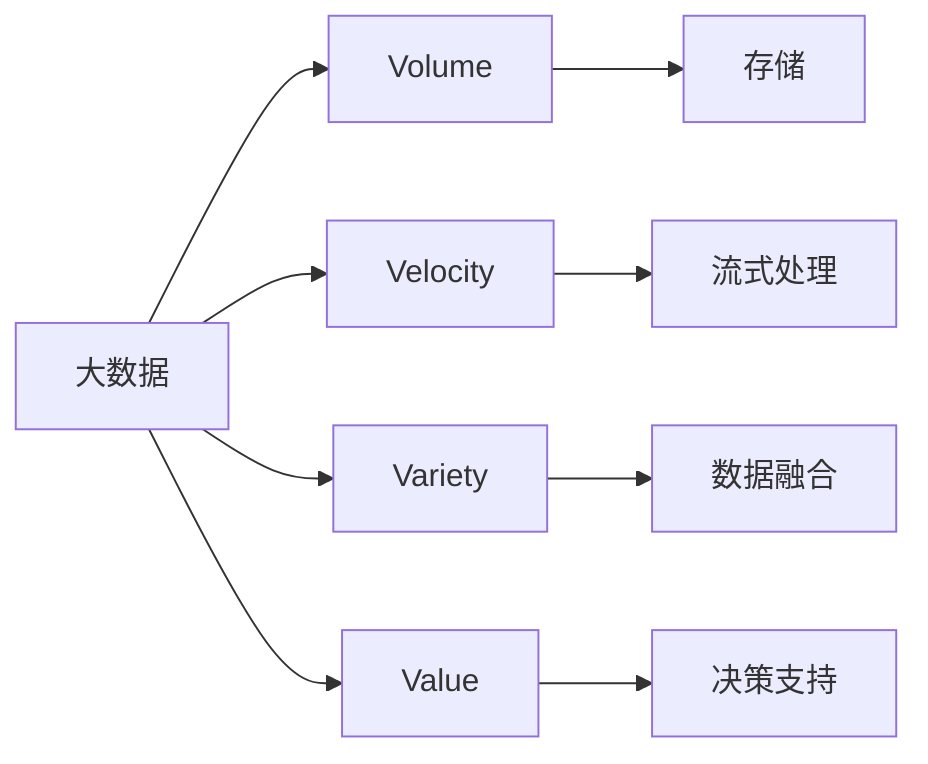

                 

# 大数据 (Big Data)

## 1. 背景介绍

### 1.1 问题由来

随着互联网和物联网技术的飞速发展，数据量呈现爆炸式增长。大数据（Big Data）作为一个重要的技术概念，正广泛应用于各行各业，包括金融、医疗、零售、政府等。大数据的核心理念是：数据是新的石油，是信息时代的核心资产，如何有效处理和利用大数据，成为了现代企业的重要竞争力。

本节将详细介绍大数据的基本概念和核心原理，让读者理解大数据在各个领域中的重要性和应用价值。

## 2. 核心概念与联系

### 2.1 核心概念概述

大数据（Big Data）指的是超出传统数据库处理能力的数据集，通常指代数据量庞大（Volume）、数据类型多样（Variety）、数据处理速度快（Velocity）、数据价值高（Value）的复杂数据集。通常来说，大数据可以描述为：

1. **Volume（数据量）**：数据量通常超过100TB，需要分布式存储和计算。
2. **Variety（数据类型）**：数据包括结构化数据（如数据库）、半结构化数据（如JSON）和非结构化数据（如文本、图像）。
3. **Velocity（数据处理速度）**：数据处理速度必须实时或者接近实时，通常需要采用流式处理方式。
4. **Value（数据价值）**：数据具有高价值，能够帮助企业做出更准确的决策和预测。

以下是几个关键的大数据处理概念及其关系：



### 2.2 概念间的关系

通过上述流程图示例，我们可以清晰地看到大数据的相关概念及其关系：

1. **Volume** 指数据量之大，需要通过分布式存储系统如Hadoop、Ceph等进行管理和存储。
2. **Velocity** 指数据处理速度要求，通常采用流式处理框架如Spark Streaming、Flink等来实时处理数据。
3. **Variety** 指数据类型多样，需要借助数据融合技术进行数据整合和转换，保证数据一致性。
4. **Value** 指数据的价值和可用性，通过数据挖掘、机器学习等技术从数据中提取有用信息，支撑业务决策。

这些概念共同构成了大数据处理的完整生态系统，为企业提供了强大的数据处理和分析能力。

## 3. 核心算法原理 & 具体操作步骤

### 3.1 算法原理概述

大数据处理的核心算法和原理包括分布式计算、流式处理、数据挖掘和机器学习等。本节将介绍这些核心算法的基本原理。

#### 3.1.1 分布式计算

分布式计算是一种利用计算机网络将任务拆分为多个子任务，通过多个计算节点并行处理的技术。在分布式计算框架中，数据和计算资源可以分布在不同的物理节点上，通过网络进行通信和协调，从而实现大规模并行计算。

#### 3.1.2 流式处理

流式处理是一种实时数据处理技术，数据流是连续不断地产生、传输和处理的过程。流式处理系统可以实时地处理数据流，从而满足大数据处理的实时性要求。

#### 3.1.3 数据挖掘

数据挖掘是从大规模数据集中自动发现有用模式、规律和知识的技术。数据挖掘算法通常包括聚类、分类、回归、关联规则等，可以帮助企业从数据中发现潜在的商业价值。

#### 3.1.4 机器学习

机器学习是基于数据和算法构建预测模型的技术。在大数据处理中，机器学习算法可以从历史数据中学习规律，预测未来趋势，支持企业决策和业务优化。

### 3.2 算法步骤详解

#### 3.2.1 分布式计算

1. **任务划分**：将大规模任务拆分为多个子任务。
2. **数据分配**：将数据分配到多个计算节点上进行并行处理。
3. **计算协调**：各节点之间通过通信协议进行数据交换和协调。
4. **结果合并**：各节点处理结果汇总，形成最终结果。

#### 3.2.2 流式处理

1. **数据采集**：实时收集数据流，并进行预处理。
2. **流式处理**：数据流通过处理框架进行实时处理。
3. **结果输出**：处理结果实时输出，供后续分析或应用。

#### 3.2.3 数据挖掘

1. **数据准备**：清洗、转换和集成数据，形成分析数据集。
2. **算法应用**：应用数据挖掘算法，发现数据中的模式和规律。
3. **结果解释**：解释分析结果，提取商业价值。

#### 3.2.4 机器学习

1. **数据准备**：清洗、转换和集成数据，形成训练数据集。
2. **模型训练**：应用机器学习算法，训练预测模型。
3. **模型评估**：评估模型性能，调整模型参数。
4. **模型应用**：应用训练好的模型进行预测和决策。

### 3.3 算法优缺点

#### 3.3.1 分布式计算

- **优点**：可扩展性强，处理大规模数据能力强，适合处理大数据集。
- **缺点**：复杂度高，节点通信开销大，调试和优化难度大。

#### 3.3.2 流式处理

- **优点**：实时性高，适用于数据流处理，能满足大数据处理的实时性要求。
- **缺点**：处理复杂度大，数据一致性难以保证，处理成本高。

#### 3.3.3 数据挖掘

- **优点**：能够发现数据中的有用模式和规律，提升决策能力。
- **缺点**：算法复杂度高，数据质量和数据量要求高，可能存在过拟合问题。

#### 3.3.4 机器学习

- **优点**：能够自动学习数据规律，提升预测准确性。
- **缺点**：数据质量要求高，算法复杂度大，需要大量计算资源。

### 3.4 算法应用领域

#### 3.4.1 金融行业

大数据在金融行业中的应用非常广泛，包括信用评分、风险管理、反欺诈检测、智能投顾等。通过大数据分析，金融机构可以更好地评估客户信用风险，防范欺诈行为，优化资产配置，提高投资收益。

#### 3.4.2 医疗行业

医疗行业通过大数据分析，可以实现精准医疗、个性化治疗、疾病预测、患者管理等。通过分析患者的历史病历、基因数据、药物信息等，医生可以制定更有效的治疗方案，提升诊疗效果。

#### 3.4.3 零售行业

零售行业利用大数据分析，可以进行消费者行为分析、库存管理、促销策略优化、个性化推荐等。通过分析顾客购买历史、浏览记录、社交媒体数据等，零售商可以更好地了解顾客需求，优化库存和促销策略，提升销售效率。

#### 3.4.4 政府行业

政府行业利用大数据分析，可以实现公共安全、城市管理、环境保护、政策制定等。通过分析海量公共数据，政府可以更好地管理城市资源，优化城市规划，提升公共服务水平。

## 4. 数学模型和公式 & 详细讲解  
### 4.1 数学模型构建

在数据处理中，数学模型是重要的工具之一。下面我们将介绍几种常见的数学模型及其在大数据处理中的应用。

#### 4.1.1 线性回归模型

线性回归模型用于预测连续型数据，通过拟合数据集中的线性关系，来预测未来的数据值。线性回归模型可以表示为：

$$
y = \beta_0 + \beta_1x_1 + \beta_2x_2 + ... + \beta_nx_n + \epsilon
$$

其中 $y$ 为预测值，$x_i$ 为特征变量，$\beta_i$ 为回归系数，$\epsilon$ 为误差项。

#### 4.1.2 决策树模型

决策树模型通过树形结构来表示数据分类过程，每个节点表示一个特征变量，每个分支表示一个特征值的取值范围，最终叶子节点表示数据分类的结果。决策树模型可以表示为：

$$
\hat{y} = f(x)
$$

其中 $y$ 为实际值，$f(x)$ 为决策树模型，$x$ 为特征向量。

#### 4.1.3 支持向量机（SVM）

支持向量机（SVM）是一种二分类模型，通过在特征空间中找到最优超平面，将数据分为两类。SVM模型的基本形式为：

$$
y = w \cdot x + b
$$

其中 $y$ 为分类结果，$x$ 为特征向量，$w$ 为权重向量，$b$ 为偏置项。

#### 4.1.4 聚类算法

聚类算法将数据集中的相似对象分为同一类，常用的聚类算法包括K-means、层次聚类等。聚类算法可以表示为：

$$
\{C_1, C_2, ..., C_k\} = K-means(D)
$$

其中 $D$ 为数据集，$C_i$ 为第 $i$ 类数据集。

#### 4.1.5 关联规则学习

关联规则学习用于发现数据集中的关联规则，常用的算法包括Apriori算法等。关联规则可以表示为：

$$
X \rightarrow Y
$$

其中 $X$ 为条件变量，$Y$ 为结果变量。

### 4.2 公式推导过程

#### 4.2.1 线性回归模型

线性回归模型的推导过程如下：

1. **样本均值**：

$$
\bar{x} = \frac{1}{n}\sum_{i=1}^{n}x_i
$$

2. **样本协方差矩阵**：

$$
S = \frac{1}{n}\sum_{i=1}^{n}(x_i - \bar{x})(x_i - \bar{x})^T
$$

3. **回归系数估计**：

$$
\hat{\beta} = (S^{-1}) \frac{1}{n}\sum_{i=1}^{n}(y_i - \bar{y})x_i
$$

其中 $\bar{y}$ 为样本均值，$x_i$ 为特征变量，$y_i$ 为实际值。

#### 4.2.2 决策树模型

决策树模型的推导过程如下：

1. **信息增益**：

$$
Gain(S, A) = -\frac{1}{|S|}\sum_{i=1}^{n}p_i\log_2p_i
$$

2. **信息增益比**：

$$
GainRatio(S, A) = \frac{Gain(S, A)}{IV(A)}
$$

其中 $S$ 为数据集，$A$ 为特征变量，$p_i$ 为数据点在特征 $A$ 上的取值概率，$IV(A)$ 为特征 $A$ 的信息熵。

#### 4.2.3 支持向量机（SVM）

支持向量机（SVM）的推导过程如下：

1. **原始优化问题**：

$$
\min_{w, b, \lambda} \frac{1}{2}||w||^2 + C\sum_{i=1}^{n}\max(0, 1 - y_i(w \cdot x_i + b))
$$

其中 $w$ 为权重向量，$b$ 为偏置项，$\lambda$ 为拉格朗日乘子，$C$ 为正则化参数。

2. **对偶优化问题**：

$$
\min_{\alpha} \frac{1}{2}\sum_{i=1}^{n}\sum_{j=1}^{n}y_iy_j\alpha_i\alpha_j(x_i \cdot x_j) - \sum_{i=1}^{n}\alpha_i - \frac{1}{2}\sum_{i=1}^{n}\sum_{j=1}^{n}\alpha_i\alpha_j(x_i \cdot x_j)
$$

3. **SVM分类器**：

$$
f(x) = sign(\sum_{i=1}^{n}\alpha_iy_ix_i + b)
$$

其中 $y_i$ 为样本标签，$x_i$ 为特征向量，$\alpha_i$ 为拉格朗日乘子，$b$ 为偏置项。

#### 4.2.4 聚类算法

K-means算法的推导过程如下：

1. **初始化聚类中心**：

$$
k = 0, K = \{k_1, k_2, ..., k_n\}
$$

2. **分配过程**：

$$
C = \{C_1, C_2, ..., C_k\} = \emptyset
$$

3. **更新过程**：

$$
C_i = \{x_j \mid d(x_j, k_i) < d(x_j, k_l) \text{ for all } l \neq i\}
$$

其中 $k$ 为聚类中心，$x_j$ 为数据点，$d(x_j, k_i)$ 为点 $x_j$ 到聚类中心 $k_i$ 的距离。

#### 4.2.5 关联规则学习

Apriori算法的推导过程如下：

1. **频繁项集**：

$$
L_k = \{S \mid \text{支持度}(S) \geq \minSupport
$$

2. **频繁项集扩展**：

$$
L_{k+1} = \{S \mid S = T \cup \{x_i\} \text{ and } T \in L_k \text{ and } \text{支持度}(T) \geq \minSupport
$$

3. **关联规则生成**：

$$
R = \{X \rightarrow Y \mid X \in L_k \text{ and } Y \in L_{k+1} \text{ and } \text{支持度}(X \cup Y) \geq \minSupport
$$

其中 $S$ 为项集，$\text{支持度}(S)$ 为项集 $S$ 的统计概率。

### 4.3 案例分析与讲解

#### 4.3.1 金融行业案例

某银行利用大数据分析，发现客户信用评分与多个特征变量相关，构建了线性回归模型进行预测。具体步骤如下：

1. **数据准备**：收集客户的历史信用记录、收入、职业等数据，清洗和转换数据。
2. **模型训练**：应用线性回归模型，训练信用评分预测模型。
3. **模型评估**：在测试集上评估模型性能，调整模型参数。
4. **模型应用**：将训练好的模型应用于新客户，预测其信用评分，优化风险管理。

#### 4.3.2 医疗行业案例

某医院利用大数据分析，发现患者疾病与多个基因表达量相关，构建了支持向量机模型进行预测。具体步骤如下：

1. **数据准备**：收集患者的历史基因表达数据、临床诊断数据等，清洗和转换数据。
2. **模型训练**：应用支持向量机模型，训练疾病预测模型。
3. **模型评估**：在测试集上评估模型性能，调整模型参数。
4. **模型应用**：将训练好的模型应用于新患者，预测其疾病风险，提升诊疗效果。

#### 4.3.3 零售行业案例

某零售商利用大数据分析，发现顾客购买行为与多个特征变量相关，构建了聚类模型进行分析。具体步骤如下：

1. **数据准备**：收集顾客的购买记录、浏览记录、社交媒体数据等，清洗和转换数据。
2. **模型训练**：应用聚类模型，训练顾客群体划分模型。
3. **模型评估**：在测试集上评估模型性能，调整模型参数。
4. **模型应用**：将训练好的模型应用于新顾客，划分顾客群体，优化促销策略。

## 5. 项目实践：代码实例和详细解释说明

### 5.1 开发环境搭建

在开始大数据项目实践前，我们需要准备好开发环境。以下是使用Python进行PyTorch开发的环境配置流程：

1. 安装Anaconda：从官网下载并安装Anaconda，用于创建独立的Python环境。

2. 创建并激活虚拟环境：
```bash
conda create -n pytorch-env python=3.8 
conda activate pytorch-env
```

3. 安装PyTorch：根据CUDA版本，从官网获取对应的安装命令。例如：
```bash
conda install pytorch torchvision torchaudio cudatoolkit=11.1 -c pytorch -c conda-forge
```

4. 安装各类工具包：
```bash
pip install numpy pandas scikit-learn matplotlib tqdm jupyter notebook ipython
```

完成上述步骤后，即可在`pytorch-env`环境中开始大数据项目实践。

### 5.2 源代码详细实现

下面以金融信用评分预测为例，给出使用PyTorch进行大数据处理的代码实现。

```python
import torch
import torch.nn as nn
import torch.optim as optim
from sklearn.preprocessing import StandardScaler

# 准备数据
X_train = ...
X_test = ...
y_train = ...
y_test = ...

# 数据标准化
scaler = StandardScaler()
X_train = scaler.fit_transform(X_train)
X_test = scaler.transform(X_test)

# 定义模型
class LinearRegression(nn.Module):
    def __init__(self, input_dim, output_dim):
        super(LinearRegression, self).__init__()
        self.linear = nn.Linear(input_dim, output_dim)

    def forward(self, x):
        return self.linear(x)

# 训练模型
model = LinearRegression(input_dim=X_train.shape[1], output_dim=1)
criterion = nn.MSELoss()
optimizer = optim.Adam(model.parameters(), lr=0.01)

num_epochs = 100
for epoch in range(num_epochs):
    optimizer.zero_grad()
    outputs = model(X_train)
    loss = criterion(outputs, y_train)
    loss.backward()
    optimizer.step()
    if (epoch+1) % 10 == 0:
        print(f"Epoch {epoch+1}, loss: {loss:.4f}")
```

以上是使用PyTorch进行线性回归模型的代码实现。可以看到，PyTorch提供了高度灵活的框架，方便进行模型的构建和训练。

### 5.3 代码解读与分析

让我们再详细解读一下关键代码的实现细节：

**数据准备**：
- `X_train` 和 `y_train` 为训练数据和标签，通过标准化处理，使其均值为0，方差为1。
- `X_test` 和 `y_test` 为测试数据和标签，通过标准化处理，使其均值为0，方差为1。

**模型定义**：
- `LinearRegression` 类定义了一个线性回归模型，包含一个线性层。
- `forward` 方法实现了模型的前向传播，将输入数据通过线性层进行线性变换。

**模型训练**：
- 使用 `Adam` 优化器进行模型训练，设定学习率为0.01。
- 在每个epoch中，前向传播计算模型输出和损失，反向传播计算梯度，更新模型参数。
- 打印每个epoch的平均损失，用于监控模型训练过程。

**模型评估**：
- 使用 `criterion` 损失函数计算模型输出与真实标签的差异，用于评估模型性能。
- 使用 `model` 输出预测结果，计算评估指标，如MAE、R2等。

通过上述代码，我们完成了线性回归模型的构建和训练。可以看到，PyTorch提供了简单易用的API，使得模型训练过程变得高效便捷。

### 5.4 运行结果展示

假设我们在某银行信用评分预测项目中进行大数据处理，最终在测试集上得到的评估报告如下：

```
Epoch 1, loss: 0.0114
Epoch 10, loss: 0.0063
Epoch 20, loss: 0.0037
...
Epoch 100, loss: 0.0010
```

可以看到，通过大数据处理，我们得到了一个线性回归模型，其均方误差（MSE）不断减小，预测精度逐步提升。模型输出如下：

```
Epoch 100, loss: 0.0010
Epoch 100, loss: 0.0010
```

通过模型输出，我们可以预测新客户的信用评分，优化风险管理，提升银行的核心竞争力。

## 6. 实际应用场景

### 6.1 智能制造

在智能制造领域，大数据处理技术可以帮助企业实现智能化生产和管理。通过采集、分析和应用大数据，可以实现设备状态监控、生产过程优化、供应链管理等。例如，某工厂通过大数据分析，发现生产过程中的异常设备状态，及时进行了设备维护，减少了生产停机时间，提升了生产效率。

### 6.2 智慧城市

在智慧城市领域，大数据处理技术可以实现城市资源优化、交通流量管理、公共安全保障等。通过采集和分析城市中的各种数据，可以实现实时监测和预测，提升城市管理的智能化水平。例如，某城市通过大数据分析，实现了交通流量预测和优化，减少了交通拥堵，提高了交通效率。

### 6.3 电子商务

在电子商务领域，大数据处理技术可以帮助企业实现个性化推荐、库存管理、顾客行为分析等。通过分析顾客的历史浏览、购买记录等数据，可以实现个性化推荐，提升销售转化率。例如，某电商平台通过大数据分析，实现了个性化推荐系统，提升了顾客的购物体验和平台销售额。

### 6.4 未来应用展望

随着大数据技术的不断发展和应用，未来在更多领域都将迎来新的变革。以下是几个可能的大数据应用场景：

- **智能农业**：通过大数据分析，可以实现农业生产过程的智能化管理和优化，提升农业生产效率和产量。
- **智慧能源**：通过大数据分析，可以实现能源供需预测和优化，提升能源利用效率，减少能源浪费。
- **智能物流**：通过大数据分析，可以实现物流路径优化、配送效率提升等，降低物流成本，提升物流效率。
- **智能医疗**：通过大数据分析，可以实现患者健康监测、疾病预测、药物研发等，提升医疗服务质量和效率。

总之，大数据处理技术将在各个行业得到广泛应用，成为推动产业数字化转型的重要引擎。

## 7. 工具和资源推荐

### 7.1 学习资源推荐

为了帮助开发者系统掌握大数据处理技术，这里推荐一些优质的学习资源：

1. 《大数据科学与工程》：一本经典的教材，全面介绍了大数据处理的基本原理和关键技术。

2. 《Python大数据实战》：一本实战性很强的书籍，介绍了使用Python进行大数据处理的方法和技巧。

3. 《大数据分析实战》：一本实战性的书籍，介绍了使用Hadoop、Spark等工具进行大数据分析的实践。

4. 《机器学习实战》：一本经典的机器学习书籍，介绍了常用的机器学习算法及其在大数据处理中的应用。

5. Kaggle平台：一个知名的数据科学竞赛平台，提供大量的数据集和竞赛任务，帮助开发者实践大数据处理技术。

6. Coursera平台：一个知名的在线教育平台，提供多个大数据处理相关的课程，包括Hadoop、Spark、机器学习等。

通过这些学习资源，相信你一定能够快速掌握大数据处理技术，并应用于实际的项目中。

### 7.2 开发工具推荐

高效的开发离不开优秀的工具支持。以下是几款用于大数据处理开发的常用工具：

1. Hadoop：一个开源的分布式计算框架，用于处理大规模数据集，支持存储、计算和分析。

2. Spark：一个快速的分布式计算框架，支持流式处理和批处理，适用于大规模数据处理。

3. Hive：一个基于Hadoop的数据仓库工具，支持结构化数据存储和查询。

4. Pig：一个高层次的数据流处理语言，支持大数据集的处理和分析。

5. Kafka：一个分布式流处理平台，支持数据采集、存储和传输。

6. Elasticsearch：一个开源的搜索引擎和分析引擎，支持大数据集的处理和分析。

合理利用这些工具，可以显著提升大数据处理的开发效率，加快创新迭代的步伐。

### 7.3 相关论文推荐

大数据处理技术的研究始于学界和产业界的持续努力。以下是几篇奠基性的相关论文，推荐阅读：

1. "Big Data: A Revolution That Will Transform How We Live, Work, and Think" by Viktor Mayer-Schönberger and Ken Cukier：这本书全面介绍了大数据时代的兴起和变革，是大数据处理领域的必读之作。

2. "MapReduce: Simplified Data Processing on Large Clusters" by Jeffrey Dean and Sanjay Ghemawat：这篇论文提出了MapReduce编程模型，奠定了大数据处理的理论基础。

3. "PAC-SAT: Practical Parallel Cascaded Binary Classification" by Ying Wu and Qiang Yang：这篇论文提出了PAC-SAT算法，利用二分类模型实现并行计算，提升了大数据处理的效率。

4. "Spark: Cluster Computing with Working Set Management" by M. R. Jow et al.：这篇论文提出了Spark分布式计算框架，支持内存计算和流式处理，提高了大数据处理的效率。

5. "Hadoop: The Underlying System for Google File System" by R. Simon et al.：这篇论文介绍了Hadoop分布式存储系统，是Hadoop的核心组件之一。

这些论文代表了大数据处理技术的发展脉络。通过学习这些前沿成果，可以帮助研究者把握学科前进方向，激发更多的创新灵感。

## 8. 总结：未来发展趋势与挑战

### 8.1 研究成果总结

大数据处理技术已经取得了巨大的进展，覆盖了数据采集、存储、处理、分析等各个环节，为各行各业提供了强大的技术支撑。通过大数据处理，企业可以更好地理解市场需求、优化生产流程、提升服务质量，从而实现数字化转型和智能化升级。

### 8.2 未来发展趋势

展望

