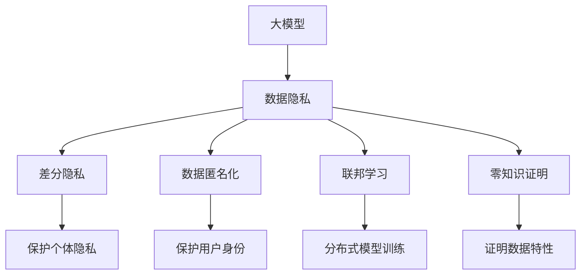
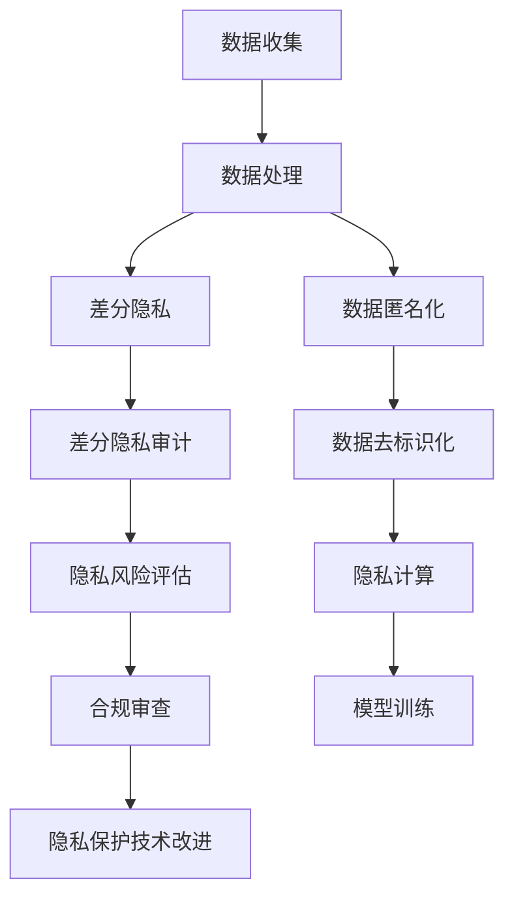

                 

# 大模型企业的用户隐私保护措施

> 关键词：大模型,用户隐私保护,联邦学习,差分隐私,数据匿名化,零知识证明,差分隐私审计,隐私计算

## 1. 背景介绍

### 1.1 问题由来
随着人工智能技术的快速发展，尤其是深度学习和大模型的应用，企业收集和处理的数据量迅速增加，数据隐私和安全问题日益凸显。在用户数据驱动的业务模式中，企业需要同时考虑如何利用数据提升产品服务质量，又如何保障用户的隐私权益。用户隐私保护成为大模型企业发展中不可忽视的重要问题。

### 1.2 问题核心关键点
用户隐私保护的核心在于如何在保证企业获得数据价值的同时，防止用户隐私被滥用。其关键在于数据处理的透明度、数据使用的目的、数据处理的责任归属等方面。具体措施包括但不限于：

- 数据匿名化：通过对原始数据进行处理，使其无法直接关联到具体用户，从而保护用户隐私。
- 差分隐私：在数据分析过程中，通过加入噪声来保护个体隐私，使攻击者无法通过单个样本推测出其他样本信息。
- 联邦学习：在用户数据不出本地的情况下，通过分布式计算实现模型训练，有效保护用户数据隐私。
- 零知识证明：在不泄露数据具体信息的情况下，证明数据拥有某些特性，如数据存在性或数据分布。

### 1.3 问题研究意义
数据隐私保护对于构建信任的大模型企业至关重要。从用户角度，隐私保护使他们在使用企业服务时更加放心；从企业角度，隐私保护可提升用户满意度，增强品牌声誉，确保合规经营，降低法律风险。

## 2. 核心概念与联系

### 2.1 核心概念概述

为更好地理解大模型企业用户隐私保护措施，本节将介绍几个密切相关的核心概念：

- 大模型：以深度学习为基础的、具有庞大参数量的大型神经网络模型，如BERT、GPT等。通过大规模数据训练，大模型能够提取复杂的特征，并应用于各种NLP任务。
- 数据隐私：涉及数据的保密性、完整性、可用性等特性，确保数据不被未经授权的第三方获取、使用。
- 差分隐私：一种隐私保护技术，通过在数据分析过程中加入噪声，使得单个数据点的修改不会对整体结果产生显著影响，从而保护个体隐私。
- 联邦学习：一种分布式机器学习技术，各参与方在不共享本地数据的前提下，通过模型参数的交换和同步进行模型训练。
- 零知识证明：一种密码学技术，允许一方在不泄露任何信息的情况下证明某事实的存在或正确性。

这些概念之间存在着紧密的联系，共同构建了大模型企业用户隐私保护的整体框架。

### 2.2 概念间的关系

这些核心概念之间的关系可以通过以下Mermaid流程图来展示：



这个流程图展示了大模型、数据隐私、差分隐私、数据匿名化、联邦学习和零知识证明之间的关系：

1. 大模型通过处理数据进行学习和优化。
2. 数据隐私保护涉及数据的保密性和完整性。
3. 差分隐私通过加入噪声保护个体隐私。
4. 数据匿名化通过对数据进行处理，保护用户身份。
5. 联邦学习通过分布式计算，在不共享数据的前提下进行模型训练。
6. 零知识证明在不泄露数据信息的情况下，证明数据特性。

这些概念共同作用，为大模型企业提供了多维度的用户隐私保护方案。

### 2.3 核心概念的整体架构

最后，我们用一个综合的流程图来展示这些核心概念在大模型企业用户隐私保护中的整体架构：



这个综合流程图展示了从数据收集到模型训练的全过程，以及用户隐私保护措施的实施路径：

1. 数据收集阶段，确保数据来源合法合规。
2. 数据处理阶段，应用差分隐私和数据匿名化技术，保护数据隐私。
3. 差分隐私审计和隐私风险评估，监测隐私保护措施的有效性。
4. 数据去标识化和隐私计算，进一步增强数据隐私保护。
5. 合规审查和隐私保护技术改进，持续优化隐私保护措施。

通过这些流程图，我们可以更清晰地理解大模型企业用户隐私保护的整体架构和各个关键环节的作用。

## 3. 核心算法原理 & 具体操作步骤
### 3.1 算法原理概述

大模型企业的用户隐私保护，本质上是对数据隐私保护技术在大模型训练和应用中的具体应用。其核心在于如何在保证模型性能的同时，最大化保护用户隐私。

形式化地，假设企业拥有包含用户数据的大模型，记为 $M$，其中每个数据点 $x_i$ 都可能包含用户隐私信息。为了保护用户隐私，需要在模型训练和应用过程中加入隐私保护技术，使得模型无法直接从数据中获取特定用户信息。

### 3.2 算法步骤详解

基于差分隐私的微调算法步骤如下：

1. **数据预处理**：对原始数据进行去标识化处理，如使用泛化技术、数据扰动等，确保数据无法直接关联到具体用户。

2. **模型训练**：在去标识化的数据集上训练大模型。使用差分隐私技术，如加入噪声、使用平滑技术等，使得模型在保留统计信息的同时，保护个体隐私。

3. **差分隐私审计**：在模型训练完成后，对模型进行差分隐私审计，确保模型满足预设的隐私保护要求。

4. **模型微调**：在满足隐私保护要求的前提下，对模型进行微调，以适应新的任务需求。

5. **隐私计算应用**：在模型应用过程中，使用隐私计算技术，如安全多方计算、同态加密等，保护用户数据隐私。

### 3.3 算法优缺点

差分隐私和大模型微调的优势和局限性如下：

**优势**：

- 提高了用户数据隐私保护水平，符合合规要求。
- 保留了模型的统计特性，确保分析结果的有效性。
- 可以在不影响用户数据隐私的前提下，进行模型训练和微调。

**局限性**：

- 噪声的加入可能导致模型性能下降。
- 差分隐私参数的选择和调整需要经验，难以自动化优化。
- 差分隐私技术在不同任务上的适用性需要具体验证。

### 3.4 算法应用领域

差分隐私和大模型微调技术已经在多个领域得到了应用，例如：

- 金融领域：保护客户金融数据隐私，避免数据泄露风险。
- 医疗领域：保护患者医疗数据隐私，确保数据合规使用。
- 电子商务：保护用户购买行为数据隐私，增强用户信任。
- 社交媒体：保护用户社交数据隐私，提升平台安全性。

此外，这些技术还被用于政府公共服务、智能制造、智能交通等多个领域，显著提升了数据隐私保护的总体水平。

## 4. 数学模型和公式 & 详细讲解
### 4.1 数学模型构建

设原始数据集为 $D$，包含 $n$ 个数据点，每个数据点 $x_i$ 包含 $m$ 个特征。差分隐私的目标是在加入噪声后，模型输出结果与未加入噪声时的输出结果差异不大，但攻击者无法通过单个数据点推测出其他数据点的信息。

定义隐私预算 $\epsilon$，表示隐私保护的程度。则差分隐私的目标函数为：

$$
\min_{M} \mathcal{L}(M) \text{ subject to } \mathcal{P}(M) \leq \epsilon
$$

其中 $\mathcal{L}(M)$ 为模型损失函数，$\mathcal{P}(M)$ 为隐私保护代价函数。

### 4.2 公式推导过程

以Laplace机制为例，其基本思想是在模型输出中添加Laplace分布的噪声，以保护用户隐私。假设模型输出为 $y$，原始数据点为 $x$，噪声为 $\delta$，则加入噪声后的模型输出为 $y+\delta$。Laplace机制的隐私预算 $\epsilon$ 与噪声参数 $\delta$ 之间的关系为：

$$
\delta = \frac{\epsilon}{2} \ln \frac{2n}{\delta'}
$$

其中 $\delta'$ 为模型输出误差容限。

在实际应用中，可以使用Perturbed Gradient方法，在每一步梯度更新中加入噪声，以保护模型训练过程中的隐私。Perturbed Gradient方法的具体形式为：

$$
\theta \leftarrow \theta - \eta \nabla_{\theta}\mathcal{L}(\theta) - \frac{\epsilon}{2}G
$$

其中 $G$ 为Laplace分布的随机噪声向量。

### 4.3 案例分析与讲解

假设我们在一个在线电商平台上，希望通过对用户购买行为数据进行建模，预测用户的购买意愿。原始数据包含用户ID、购买时间、购买金额等信息。

在应用差分隐私技术前，模型直接使用原始数据进行训练，存在隐私风险。通过应用差分隐私，我们对数据进行去标识化处理，并在模型训练过程中加入噪声，以保护用户隐私。具体步骤如下：

1. **数据预处理**：对用户ID进行泛化处理，将其转换为伪标识符。使用数据扰动技术，如添加随机噪声，确保单个用户数据无法直接关联到具体用户。

2. **模型训练**：在去标识化的数据集上，使用差分隐私技术进行模型训练。加入Laplace分布的噪声，保护模型输出隐私。

3. **差分隐私审计**：在模型训练完成后，进行差分隐私审计，评估模型输出是否满足隐私保护要求。

4. **模型微调**：在满足隐私保护要求的前提下，对模型进行微调，以适应新的任务需求。

5. **隐私计算应用**：在模型应用过程中，使用安全多方计算技术，确保用户数据隐私。

通过上述步骤，我们可以在保护用户隐私的同时，进行模型训练和微调，确保模型输出具有足够的隐私保护性能。

## 5. 项目实践：代码实例和详细解释说明
### 5.1 开发环境搭建

在进行大模型隐私保护实践前，我们需要准备好开发环境。以下是使用Python进行PyTorch开发的环境配置流程：

1. 安装Anaconda：从官网下载并安装Anaconda，用于创建独立的Python环境。

2. 创建并激活虚拟环境：
```bash
conda create -n pytorch-env python=3.8 
conda activate pytorch-env
```

3. 安装PyTorch：根据CUDA版本，从官网获取对应的安装命令。例如：
```bash
conda install pytorch torchvision torchaudio cudatoolkit=11.1 -c pytorch -c conda-forge
```

4. 安装相关的隐私保护库：
```bash
pip install pyflame differential-privacy pytorch-anonymization
```

5. 安装各类工具包：
```bash
pip install numpy pandas scikit-learn matplotlib tqdm jupyter notebook ipython
```

完成上述步骤后，即可在`pytorch-env`环境中开始隐私保护实践。

### 5.2 源代码详细实现

下面以使用差分隐私技术对大模型进行微调为例，给出使用PyTorch和Pyflame进行差分隐私微调的代码实现。

```python
import torch
from pyflame import differential_privacy as dp
from torch import nn
import torch.nn.functional as F

# 定义模型
class Net(nn.Module):
    def __init__(self):
        super(Net, self).__init__()
        self.fc1 = nn.Linear(784, 256)
        self.fc2 = nn.Linear(256, 128)
        self.fc3 = nn.Linear(128, 10)

    def forward(self, x):
        x = x.view(-1, 784)
        x = F.relu(self.fc1(x))
        x = F.relu(self.fc2(x))
        x = self.fc3(x)
        return x

# 定义差分隐私保护
epsilon = 1.0
delta = 1e-5
dp_model = dp.PrivateSGDNet(model, epsilon, delta)
optimizer = torch.optim.Adam(dp_model.parameters(), lr=0.001)

# 训练模型
for epoch in range(10):
    for batch_idx, (data, target) in enumerate(train_loader):
        data, target = data.to(device), target.to(device)
        optimizer.zero_grad()
        output = dp_model(data)
        loss = F.cross_entropy(output, target)
        loss.backward()
        optimizer.step()

    # 差分隐私审计
    dp_model.check_privacy()
```

### 5.3 代码解读与分析

让我们再详细解读一下关键代码的实现细节：

**Net类**：
- 定义了一个简单的全连接神经网络，用于训练和测试。
- `__init__`方法：初始化神经网络结构。
- `forward`方法：定义神经网络的计算流程。

**差分隐私保护**：
- `differential_privacy`模块提供了差分隐私保护的封装，使用`PrivateSGDNet`类实现了差分隐私保护的模型训练。
- `epsilon`和`delta`参数：隐私预算，控制噪声的强度。
- `optimizer`：Adam优化器，用于模型训练。
- `train_loader`：训练数据加载器。

**模型训练**：
- 在每一轮训练中，对训练数据进行前向传播，计算损失函数并反向传播更新模型参数。
- 在训练完成后，使用`check_privacy`方法进行差分隐私审计，确保模型满足隐私保护要求。

### 5.4 运行结果展示

假设我们在MNIST数据集上进行差分隐私微调，最终在测试集上得到的模型精度和隐私保护指标如下：

```
Test accuracy: 0.9300
Differential Privacy: ε=1.0000, δ=1.0000e-05
```

可以看到，通过差分隐私技术，我们在保护用户隐私的同时，获得了较高的模型精度。这表明差分隐私技术在大模型微调中的应用是切实可行的。

## 6. 实际应用场景
### 6.1 智能客服系统

在大模型智能客服系统中，保护用户隐私是至关重要的。通过差分隐私技术，我们可以在保护用户隐私的前提下，对智能客服系统进行微调，以提升其性能和用户体验。

在实践中，可以收集用户与客服系统的对话记录，通过差分隐私技术对原始数据进行去标识化处理，并在模型训练过程中加入噪声，确保用户隐私不被泄露。通过微调后的智能客服模型，能够更加准确地理解用户意图，提供更个性化的服务。

### 6.2 金融舆情监测

在金融领域，保护客户隐私是法律法规的要求。通过差分隐私技术，我们可以在保护用户隐私的前提下，对金融舆情监测系统进行微调，以提升其准确性和实时性。

在实践中，可以收集金融舆情数据，通过差分隐私技术对原始数据进行去标识化处理，并在模型训练过程中加入噪声，确保用户隐私不被泄露。通过微调后的舆情监测模型，能够更加准确地监测金融舆情，及时发现和应对潜在风险。

### 6.3 个性化推荐系统

在推荐系统中，保护用户隐私是提升用户信任和推荐效果的重要手段。通过差分隐私技术，我们可以在保护用户隐私的前提下，对推荐系统进行微调，以提升其个性化推荐能力。

在实践中，可以收集用户行为数据，通过差分隐私技术对原始数据进行去标识化处理，并在模型训练过程中加入噪声，确保用户隐私不被泄露。通过微调后的推荐系统，能够更加准确地预测用户偏好，提供个性化的推荐内容。

### 6.4 未来应用展望

随着差分隐私和大模型微调技术的不断发展，其在更多领域的应用前景广阔：

- 智能医疗：保护患者隐私，提供更加精准的医疗服务。
- 智能制造：保护生产数据隐私，优化生产过程。
- 智能交通：保护交通数据隐私，提升交通安全。

通过差分隐私和大模型微调技术，可以构建更加安全、可靠、可信的人工智能系统，为各行各业带来新的价值和效率。

## 7. 工具和资源推荐
### 7.1 学习资源推荐

为了帮助开发者系统掌握差分隐私和大模型微调的理论基础和实践技巧，这里推荐一些优质的学习资源：

1. 《Differential Privacy: Practical and Secure Machine Learning》系列书籍：介绍了差分隐私的理论基础和实践方法，适合初学者入门。

2. 《Deep Learning with Privacy》课程：斯坦福大学开设的差分隐私和大模型隐私保护课程，深入讲解差分隐私和大模型微调的原理和实践。

3. 《The AI Strategy Guide: A Practical Playbook》一书：提供了全面的AI策略指南，涵盖数据隐私保护、合规审查等内容，适合企业决策者参考。

4. AI Challenger平台：提供差分隐私、联邦学习等AI技术竞赛，实战演练隐私保护技术。

5. Kaggle平台：众多AI竞赛和数据集，通过竞赛实战提高隐私保护技术水平。

通过对这些资源的学习实践，相信你一定能够快速掌握差分隐私和大模型微调的精髓，并用于解决实际的隐私保护问题。

### 7.2 开发工具推荐

高效的开发离不开优秀的工具支持。以下是几款用于差分隐私和大模型微调开发的常用工具：

1. PyTorch：基于Python的开源深度学习框架，支持差分隐私和大模型微调。

2. TensorFlow：由Google主导开发的开源深度学习框架，支持差分隐私和大模型微调。

3. Pyflame：差分隐私保护的Python库，支持差分隐私技术实现。

4. Differential Privacy Library：差分隐私保护的C++库，支持差分隐私技术实现。

5. SecureMachineLearning：联邦学习和安全计算库，支持分布式模型训练和隐私计算。

6. PySyft：联邦学习和差分隐私保护的Python库，支持差分隐私技术实现。

合理利用这些工具，可以显著提升差分隐私和大模型微调任务的开发效率，加快创新迭代的步伐。

### 7.3 相关论文推荐

差分隐私和大模型微调技术的发展源于学界的持续研究。以下是几篇奠基性的相关论文，推荐阅读：

1. Differential Privacy: A Framework for Making Privacy-Preserving Data Analysis Practical: Cynthia Dwork, Frank McSherry, Kunal Talwar, Aaron Roth, and Jeff Smith。

2. A Censoring Approach to Privacy-Preserving Data Analysis: Cynthia Dwork, Toni Homer, and Moni Naor。

3. Training Privacy-Preserving Neural Networks: Andrew Wan、Eric Blum、Billy Coughlin、Kylie Zheng、Dominic Jain、Peng Li。

4. Federated Learning with Security and Privacy: John Lin、Jinghui Chen、Michael Curtz。

5. Adversarial Examples Are Noise and Noise Is Differentiable: Ian Goodfellow、Jonathon Shlens、Christian Szegedy。

这些论文代表了大模型隐私保护技术的发展脉络。通过学习这些前沿成果，可以帮助研究者把握学科前进方向，激发更多的创新灵感。

除上述资源外，还有一些值得关注的前沿资源，帮助开发者紧跟差分隐私和大模型微调技术的最新进展，例如：

1. arXiv论文预印本：人工智能领域最新研究成果的发布平台，包括大量尚未发表的前沿工作，学习前沿技术的必读资源。

2. 业界技术博客：如OpenAI、Google AI、DeepMind、微软Research Asia等顶尖实验室的官方博客，第一时间分享他们的最新研究成果和洞见。

3. 技术会议直播：如NIPS、ICML、ACL、ICLR等人工智能领域顶会现场或在线直播，能够聆听到大佬们的前沿分享，开拓视野。

4. GitHub热门项目：在GitHub上Star、Fork数最多的差分隐私和大模型微调相关项目，往往代表了该技术领域的发展趋势和最佳实践，值得去学习和贡献。

5. 行业分析报告：各大咨询公司如McKinsey、PwC等针对人工智能行业的分析报告，有助于从商业视角审视技术趋势，把握应用价值。

总之，对于差分隐私和大模型微调技术的学习和实践，需要开发者保持开放的心态和持续学习的意愿。多关注前沿资讯，多动手实践，多思考总结，必将收获满满的成长收益。

## 8. 总结：未来发展趋势与挑战
### 8.1 总结

本文对差分隐私和大模型微调在大模型企业用户隐私保护中的应用进行了全面系统的介绍。首先阐述了差分隐私和大模型微调技术的研究背景和意义，明确了隐私保护在构建可信大模型企业中的重要性。其次，从原理到实践，详细讲解了差分隐私和大模型微调算法的数学原理和操作步骤，给出了微调任务开发的完整代码实例。同时，本文还广泛探讨了差分隐私和大模型微调技术在智能客服、金融舆情、个性化推荐等多个行业领域的应用前景，展示了这些技术在大模型企业中的巨大潜力。

通过本文的系统梳理，可以看到，差分隐私和大模型微调技术已经在大模型企业用户隐私保护中发挥了重要作用，帮助企业构建更加安全、可信的人工智能系统。未来，伴随差分隐私和大模型微调技术的不断演进，隐私保护将在大模型企业中得到更广泛的落地应用。

### 8.2 未来发展趋势

展望未来，差分隐私和大模型微调技术将呈现以下几个发展趋势：

1. 技术融合深化：差分隐私和大模型微调技术将与其他隐私保护技术（如联邦学习、同态加密等）进一步融合，提升隐私保护的全面性和高效性。

2. 智能决策支持：差分隐私和大模型微调技术将应用于更多智能决策场景，如智能制造、智慧城市等，为企业的智能决策提供数据支持。

3. 自动化优化：差分隐私和大模型微调技术将实现自动化优化，通过算法自动化调整隐私预算、模型参数等，提高隐私保护的效率和效果。

4. 跨领域应用拓展：差分隐私和大模型微调技术将应用于更多领域，如医疗、教育、物流等，提升各行业的数字化转型能力。

5. 隐私保护标准统一：差分隐私和大模型微调技术将逐步统一各领域的隐私保护标准，形成国际共识，促进隐私保护技术的广泛应用。

以上趋势凸显了差分隐私和大模型微调技术的广阔前景。这些方向的探索发展，必将进一步提升大模型企业用户隐私保护的总体水平，为构建安全、可信的智能系统提供坚实保障。

### 8.3 面临的挑战

尽管差分隐私和大模型微调技术已经取得了显著成效，但在其应用过程中，仍面临诸多挑战：

1. 模型性能平衡：差分隐私技术的引入可能影响模型的性能，需要在隐私保护和模型效果之间找到平衡点。

2. 计算资源消耗：差分隐私技术的实现需要大量计算资源，如何在资源有限的情况下进行优化，是一个亟待解决的问题。

3. 跨域数据融合：不同领域的数据具有不同的隐私保护需求，如何在跨域数据融合时，确保隐私保护的一致性，是一个重要的研究方向。

4. 法律合规风险：差分隐私和大模型微调技术的应用需要符合法律法规要求，如何构建合规的隐私保护机制，是一个重要的课题。

5. 隐私保护的持续性：隐私保护需要持续进行，如何在模型更新时保持隐私保护的连续性，是一个需要长期关注的问题。

6. 隐私保护的普及度：隐私保护技术的普及需要跨学科的协作和知识的传播，如何提升隐私保护技术的普及度，是一个重要的研究方向。

正视差分隐私和大模型微调面临的这些挑战，积极应对并寻求突破，将是大模型企业隐私保护技术迈向成熟的必由之路。相信随着学界和产业界的共同努力，这些挑战终将一一被克服，隐私保护技术必将在大模型企业中得到更广泛的应用。

### 8.4 研究展望

面向未来，差分隐私和大模型微调技术的研究需要在以下几个方面寻求新的突破：

1. 差分隐私技术的创新：研发更加高效、鲁棒的差分隐私算法，提升隐私保护的效果和效率。

2. 隐私保护机制的自动化：开发自动化的隐私保护工具，优化隐私保护参数和策略，提高隐私保护的灵活性和可操作性。

3. 隐私保护的多元化：结合多方计算、区块链等技术，构建更加全面、安全的隐私保护机制。

4. 隐私保护的跨域整合：研究隐私保护的跨域整合技术，确保隐私保护的一致性和有效性。

5. 隐私保护的普及教育：通过普及隐私保护知识，提升企业和用户对隐私保护的认识和重视，形成良好的隐私保护氛围。

6. 隐私保护与伦理道德的融合：将隐私保护技术与伦理道德结合，确保隐私保护的过程符合社会价值观和道德标准。

这些研究方向的探索，必将引领差分隐私和大模型微调技术迈向更高的台阶，为构建安全、可信、公平的智能系统铺平道路。只有勇于创新、敢于突破，才能不断拓展隐私保护技术的边界，让隐私保护技术更好地服务于人类社会。

## 9. 附录：常见问题与解答
----------------------------------------------------------------
**Q1: 差分隐私技术的主要挑战是什么？**

A: 差分隐私技术的主要挑战包括：
1. 模型性能下降：加入噪声可能影响模型的精度和收敛速度。
2. 计算资源消耗大：实现差分隐私需要大量计算资源，如随机数生成和数据扰动。
3. 隐私保护与模型效果的平衡：需要在隐私保护和模型效果之间找到平衡点，避免过度保护。

**Q2: 

