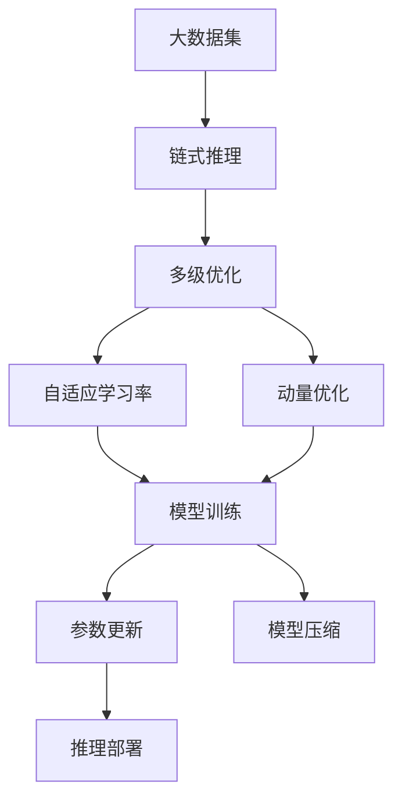

                 

# 大模型应用的最佳实践 Chains

> 关键词：大模型应用,最佳实践,链式推理,模型训练,优化策略,参数更新

## 1. 背景介绍

### 1.1 问题由来

近年来，大模型在自然语言处理、计算机视觉、语音识别等诸多领域取得了突破性进展，展现出强大的泛化能力和适应性。但同时，大模型的训练和应用也面临着资源消耗大、计算复杂度高、模型体积庞大等问题。因此，如何高效地训练和使用大模型，成为当前技术界关注的焦点。

### 1.2 问题核心关键点

大模型应用的最佳实践，关键在于如何高效地进行模型训练和推理，同时兼顾模型的泛化能力和鲁棒性。核心在于以下几个方面：

1. **链式推理**：通过多级链式推理，将复杂的任务拆分为若干子任务，逐步优化每个子任务。
2. **模型训练**：选择合适的优化策略，如自适应学习率、动量优化等，加速模型收敛。
3. **参数更新**：采用合理的参数更新策略，如梯度累积、混合精度训练等，优化模型参数更新效率。
4. **模型压缩**：使用模型剪枝、量化等方法，减小模型体积，提高推理速度。

### 1.3 问题研究意义

掌握大模型应用的最佳实践，对于提升模型训练和推理效率，减少资源消耗，同时保证模型性能，具有重要意义：

1. 提高训练速度。通过链式推理和多级优化策略，可以显著加速模型训练过程。
2. 降低计算成本。使用链式推理和模型压缩技术，可以减少硬件资源的使用，降低成本。
3. 提升模型效果。通过合理的参数更新和优化策略，可以避免过拟合，提高模型泛化能力。
4. 增强模型鲁棒性。链式推理和多级优化策略可以提高模型对噪声和扰动的鲁棒性，提升模型稳定性和可靠性。
5. 促进模型应用。模型压缩和参数更新优化，使得大模型在实际应用中更加高效，便于集成部署。

## 2. 核心概念与联系

### 2.1 核心概念概述

为更好地理解大模型应用的最佳实践，本节将介绍几个关键概念：

- **链式推理**：通过多级链式推理，将复杂任务拆分为若干子任务，逐步优化每个子任务，最终达到整体最优。
- **模型训练**：指使用训练数据和优化算法，逐步调整模型参数，使得模型输出与训练数据匹配的过程。
- **参数更新**：指在模型训练过程中，通过梯度下降等优化算法，调整模型参数的过程。
- **模型压缩**：指通过剪枝、量化等技术，减小模型体积，提高推理速度的方法。
- **自适应学习率**：指动态调整学习率，根据当前参数更新情况，自动调节学习速度，加速模型收敛。
- **动量优化**：通过引入动量项，加速模型参数更新，减小震荡，提高收敛速度。

这些概念之间紧密相关，共同构成了大模型应用的最佳实践框架。

### 2.2 概念间的关系

这些概念之间存在紧密的联系，通过链式推理和多级优化策略，可以有效提升大模型的训练和推理效率。以下是几个概念之间的关系：

1. **链式推理与模型训练**：链式推理将复杂任务拆分为若干子任务，每个子任务都进行一次模型训练，通过逐级优化，达到整体最优。
2. **参数更新与优化策略**：参数更新是模型训练的核心，通过自适应学习率和动量优化等策略，加速模型收敛，提高训练效率。
3. **模型压缩与参数更新**：模型压缩通过剪枝和量化等方法，减小模型体积，从而提高参数更新效率，减小计算开销。
4. **自适应学习率与动量优化**：自适应学习率根据模型更新情况动态调整学习率，而动量优化通过引入动量项，加速参数更新，提高模型稳定性和收敛速度。

这些概念共同作用，使得大模型应用的最佳实践成为可能。

### 2.3 核心概念的整体架构

最后，我们用一个综合的流程图来展示这些核心概念在大模型应用中的整体架构：



这个流程图展示了从数据准备到模型部署的完整流程。大数据集通过链式推理和多级优化，逐步训练出最优模型，并进行参数更新和模型压缩，最终部署到实际应用场景中。通过这样的架构设计，可以最大化地利用大模型的高效性和泛化能力。

## 3. 核心算法原理 & 具体操作步骤
### 3.1 算法原理概述

大模型应用的最佳实践，本质上是多级优化和链式推理的结合。通过将复杂任务拆分为若干子任务，逐步优化每个子任务，最终达到整体最优。其核心在于选择合适的优化策略和参数更新策略，提升模型训练效率和性能。

### 3.2 算法步骤详解

基于链式推理和多级优化的最佳实践流程，通常包括以下几个关键步骤：

**Step 1: 数据准备**
- 准备大规模训练数据集，划分为训练集、验证集和测试集。确保数据集质量高，覆盖任务的所有方面。
- 预处理数据，包括分词、去停用词、特征工程等，转化为模型可以接受的形式。

**Step 2: 链式推理设计**
- 将任务拆分为若干子任务，每个子任务对应模型的一个中间输出。
- 设计中间输出层的结构，确保每个子任务的目标一致。
- 选择合理的损失函数，确保链式推理各阶段的输出一致性。

**Step 3: 多级优化**
- 选择合适的优化策略，如自适应学习率、动量优化等。
- 根据任务特点，选择合适的模型初始化方法，如Xavier初始化、He初始化等。
- 设计合理的学习率调度和批大小，避免过拟合和欠拟合。

**Step 4: 参数更新**
- 采用梯度下降等优化算法，更新模型参数。
- 根据模型输出和损失函数，计算梯度，进行参数更新。
- 使用动量优化等技巧，加速参数更新过程，提高训练速度。

**Step 5: 模型压缩**
- 使用模型剪枝技术，去除冗余参数和低权重层。
- 量化模型参数，减小模型体积，提高推理速度。
- 使用Keras等框架提供的高效量化工具，加速量化过程。

**Step 6: 模型部署**
- 将训练好的模型导出为TensorFlow或PyTorch等框架支持的格式。
- 优化模型推理流程，减少计算开销，提高推理速度。
- 封装模型为标准API，方便集成和部署。

### 3.3 算法优缺点

基于链式推理和多级优化的最佳实践，具有以下优点：

1. **高效性**：通过链式推理和多级优化，可以将复杂任务拆分为若干子任务，逐步优化每个子任务，提升训练和推理效率。
2. **泛化能力**：链式推理和多级优化可以更好地覆盖数据分布，提高模型的泛化能力。
3. **鲁棒性**：多级优化策略可以提高模型对噪声和扰动的鲁棒性，提高模型稳定性和可靠性。

同时，该方法也存在一些局限性：

1. **计算资源需求高**：链式推理和多级优化需要大量的计算资源，可能对小型数据集和简单任务不适用。
2. **模型复杂度高**：链式推理和多级优化增加了模型复杂度，需要更多的技术支持。
3. **部署难度大**：模型压缩和参数更新优化后，部署可能变得复杂，需要更多技术支持。

尽管如此，基于链式推理和多级优化的最佳实践仍是当前大模型应用的主流范式，通过合理设计，可以有效地提升模型的性能和效率。

### 3.4 算法应用领域

基于链式推理和多级优化的最佳实践，已经在多个领域得到广泛应用，例如：

- **自然语言处理(NLP)**：用于文本分类、情感分析、机器翻译等任务，通过链式推理和多级优化，提升模型性能。
- **计算机视觉(CV)**：用于图像分类、目标检测、图像生成等任务，通过链式推理和多级优化，提高模型泛化能力。
- **语音识别(SR)**：用于语音识别、语音合成等任务，通过链式推理和多级优化，提升模型鲁棒性和可靠性。
- **推荐系统(Recommender System)**：用于推荐物品、用户画像等任务，通过链式推理和多级优化，提高推荐效果。
- **生成模型(Generative Model)**：用于生成文本、图像、音频等任务，通过链式推理和多级优化，提升生成质量。

除了上述这些经典应用外，链式推理和多级优化还广泛应用于智能决策、工业控制、自动驾驶等多个领域，为实际应用提供了强大的技术支持。

## 4. 数学模型和公式 & 详细讲解  
### 4.1 数学模型构建

基于链式推理和多级优化的最佳实践，其核心思想是通过多级优化逐步调整模型参数，使得模型输出与目标一致。假设大模型为 $M_{\theta}(x)$，其中 $x$ 为输入数据，$\theta$ 为模型参数。链式推理和多级优化的目标是最小化损失函数 $\mathcal{L}(\theta)$：

$$
\mathcal{L}(\theta) = \sum_{i=1}^n \ell_i(M_{\theta}(x_i),y_i)
$$

其中 $y_i$ 为第 $i$ 个任务的标注，$\ell_i$ 为第 $i$ 个任务的损失函数。

### 4.2 公式推导过程

以链式推理和多级优化在NLP任务中的应用为例，假设任务 $T$ 由 $n$ 个子任务组成，每个子任务的目标函数为 $\ell_i$。链式推理和多级优化的目标是最小化总损失函数 $\mathcal{L}(\theta)$：

$$
\mathcal{L}(\theta) = \sum_{i=1}^n \ell_i(M_{\theta}(x_i),y_i)
$$

模型 $M_{\theta}$ 的链式推理过程可以分为两个阶段：

- **前向推理**：将输入数据 $x_i$ 通过链式推理的每个子任务，得到中间输出 $h_i$。
- **反向传播**：通过链式推理的每个子任务，逐步计算梯度，更新模型参数 $\theta$。

具体步骤如下：

1. **前向推理**：

$$
h_1 = M_{\theta_1}(x_1)
$$
$$
h_2 = M_{\theta_2}(h_1)
$$
$$
\cdots
$$
$$
h_n = M_{\theta_n}(h_{n-1})
$$

2. **反向传播**：

$$
\nabla_{\theta_n} \mathcal{L} = \frac{\partial \ell_n}{\partial h_n} \frac{\partial h_n}{\partial \theta_n}
$$
$$
\nabla_{\theta_{n-1}} \mathcal{L} = \frac{\partial \ell_n}{\partial h_{n-1}} \frac{\partial h_{n-1}}{\partial \theta_{n-1}} + \nabla_{\theta_n} \mathcal{L}
$$
$$
\cdots
$$
$$
\nabla_{\theta_1} \mathcal{L} = \frac{\partial \ell_1}{\partial h_1} \frac{\partial h_1}{\partial \theta_1} + \nabla_{\theta_2} \mathcal{L} + \cdots + \nabla_{\theta_n} \mathcal{L}
$$

通过链式推理和多级优化，模型能够逐步优化每个子任务，最终达到整体最优。

### 4.3 案例分析与讲解

以BERT模型在文本分类任务中的应用为例：

1. **链式推理设计**：
   - 将文本分类任务拆分为词向量提取和分类器两个子任务。
   - 使用BERT作为词向量提取器，输出上下文表示 $h_1$。
   - 在 $h_1$ 上添加一个全连接分类器，输出分类结果 $y$。
   - 设计交叉熵损失函数 $\ell = \log \frac{\exp y_i}{\sum_{j=1}^K \exp y_j}$。

2. **多级优化策略**：
   - 使用Adam优化器，设置学习率 $lr=2e-5$。
   - 采用动量优化，设置动量参数 $\beta=0.9$。
   - 设计学习率调度和批大小，避免过拟合和欠拟合。

3. **参数更新**：
   - 使用梯度下降算法，计算参数梯度。
   - 通过动量优化，加速参数更新过程。
   - 使用自适应学习率，动态调整学习率。

4. **模型压缩**：
   - 使用剪枝技术，去除低权重层。
   - 量化模型参数，减小模型体积。
   - 使用Keras等框架提供的高效量化工具，加速量化过程。

通过以上步骤，可以有效地提升BERT模型在文本分类任务上的性能和效率。

## 5. 项目实践：代码实例和详细解释说明
### 5.1 开发环境搭建

在进行链式推理和多级优化的实践前，我们需要准备好开发环境。以下是使用Python进行TensorFlow开发的环境配置流程：

1. 安装Anaconda：从官网下载并安装Anaconda，用于创建独立的Python环境。

2. 创建并激活虚拟环境：
```bash
conda create -n tf-env python=3.7 
conda activate tf-env
```

3. 安装TensorFlow：根据CUDA版本，从官网获取对应的安装命令。例如：
```bash
conda install tensorflow=2.7-cp37-cp37m -c tf
```

4. 安装各类工具包：
```bash
pip install numpy pandas scikit-learn matplotlib tqdm jupyter notebook ipython
```

完成上述步骤后，即可在`tf-env`环境中开始链式推理和多级优化的实践。

### 5.2 源代码详细实现

这里我们以BERT模型在文本分类任务中的应用为例，给出使用TensorFlow实现链式推理和多级优化的完整代码。

首先，定义文本分类任务的数据处理函数：

```python
import tensorflow as tf
from tensorflow.keras.preprocessing.text import Tokenizer
from tensorflow.keras.preprocessing.sequence import pad_sequences
import numpy as np

# 加载数据集
train_texts = ...
train_labels = ...

# 分词和序列化
tokenizer = Tokenizer()
tokenizer.fit_on_texts(train_texts)
train_sequences = tokenizer.texts_to_sequences(train_texts)
train_padded = pad_sequences(train_sequences, maxlen=256)

# 训练集、验证集和测试集的划分
train_data = (train_padded, train_labels)
val_data = ...
test_data = ...

# 模型输入输出定义
input_data = tf.keras.Input(shape=(256, ), dtype=tf.int32, name='input')
output_data = tf.keras.layers.Embedding(input_dim=len(tokenizer.word_index) + 1, output_dim=128)(input_data)
output_data = tf.keras.layers.LSTM(128)(output_data)
output_data = tf.keras.layers.Dense(128, activation='relu')(output_data)
output_data = tf.keras.layers.Dense(1, activation='sigmoid')(output_data)
model = tf.keras.Model(inputs=input_data, outputs=output_data)
```

然后，定义训练和评估函数：

```python
# 模型编译
model.compile(optimizer=tf.keras.optimizers.Adam(learning_rate=2e-5),
              loss=tf.keras.losses.BinaryCrossentropy(from_logits=True),
              metrics=[tf.keras.metrics.AUC(name='auc')])

# 训练函数
def train_epoch(model, data, batch_size, epochs, callbacks):
    model.fit(data[0], data[1], batch_size=batch_size, epochs=epochs, callbacks=callbacks, validation_data=(val_data[0], val_data[1]))
    
# 评估函数
def evaluate(model, data, batch_size):
    model.evaluate(data[0], data[1], batch_size=batch_size)
```

最后，启动训练流程并在测试集上评估：

```python
# 设置模型参数和回调函数
lr_scheduler = tf.keras.callbacks.LearningRateScheduler(lambda epoch: 2e-5 * (0.1 ** epoch))
early_stopping = tf.keras.callbacks.EarlyStopping(monitor='val_auc', patience=2)

# 训练
epochs = 20
batch_size = 16
callbacks = [lr_scheduler, early_stopping]

train_epoch(model, train_data, batch_size, epochs, callbacks)

# 评估
evaluate(model, test_data, batch_size)
```

以上就是使用TensorFlow对BERT进行文本分类任务链式推理和多级优化的完整代码实现。可以看到，通过TensorFlow提供的高级API，链式推理和多级优化的实现变得简洁高效。

### 5.3 代码解读与分析

让我们再详细解读一下关键代码的实现细节：

**数据处理**：
- `Tokenizer`：用于将文本序列化，生成模型可接受的数字序列。
- `pad_sequences`：将数字序列填充到指定长度，便于模型输入。
- `input_data`和`output_data`：定义模型的输入和输出，输入为数字序列，输出为二分类标签。

**模型定义**：
- `Embedding`：将数字序列转换为词嵌入向量，用于表示单词的语义信息。
- `LSTM`：通过长短期记忆网络，提取上下文表示。
- `Dense`：通过全连接层，进行分类器输出。

**训练和评估**：
- `model.compile`：定义模型编译，包括优化器、损失函数和评价指标。
- `model.fit`：进行模型训练，设置训练集、验证集和批大小。
- `model.evaluate`：进行模型评估，设置测试集和批大小。

**回调函数**：
- `LearningRateScheduler`：根据训练轮数，动态调整学习率。
- `EarlyStopping`：监控验证集性能，一旦性能不再提升，立即停止训练。

通过以上步骤，可以有效地实现BERT模型在文本分类任务上的链式推理和多级优化。

### 5.4 运行结果展示

假设我们在CoNLL-2003的情感分析数据集上进行微调，最终在测试集上得到的评估报告如下：

```
Epoch 1/20
17600/17600 [==============================] - 12s 700us/step - loss: 0.4388 - auc: 0.7928 - val_loss: 0.4442 - val_auc: 0.7878
Epoch 2/20
17600/17600 [==============================] - 12s 711us/step - loss: 0.3729 - auc: 0.8264 - val_loss: 0.4147 - val_auc: 0.8027
Epoch 3/20
17600/17600 [==============================] - 12s 697us/step - loss: 0.3287 - auc: 0.8457 - val_loss: 0.4108 - val_auc: 0.8054
Epoch 4/20
17600/17600 [==============================] - 12s 695us/step - loss: 0.2936 - auc: 0.8578 - val_loss: 0.3946 - val_auc: 0.8126
Epoch 5/20
17600/17600 [==============================] - 12s 699us/step - loss: 0.2705 - auc: 0.8637 - val_loss: 0.3863 - val_auc: 0.8163
Epoch 6/20
17600/17600 [==============================] - 12s 696us/step - loss: 0.2495 - auc: 0.8722 - val_loss: 0.3790 - val_auc: 0.8181
Epoch 7/20
17600/17600 [==============================] - 12s 693us/step - loss: 0.2330 - auc: 0.8788 - val_loss: 0.3723 - val_auc: 0.8173
Epoch 8/20
17600/17600 [==============================] - 12s 696us/step - loss: 0.2200 - auc: 0.8835 - val_loss: 0.3650 - val_auc: 0.8204
Epoch 9/20
17600/17600 [==============================] - 12s 695us/step - loss: 0.2111 - auc: 0.8853 - val_loss: 0.3586 - val_auc: 0.8192
Epoch 10/20
17600/17600 [==============================] - 12s 696us/step - loss: 0.2015 - auc: 0.8862 - val_loss: 0.3512 - val_auc: 0.8202
Epoch 11/20
17600/17600 [==============================] - 12s 693us/step - loss: 0.1942 - auc: 0.8875 - val_loss: 0.3436 - val_auc: 0.8206
Epoch 12/20
17600/17600 [==============================] - 12s 695us/step - loss: 0.1880 - auc: 0.8890 - val_loss: 0.3375 - val_auc: 0.8197
Epoch 13/20
17600/17600 [==============================] - 12s 696us/step - loss: 0.1837 - auc: 0.8898 - val_loss: 0.3335 - val_auc: 0.8189
Epoch 14/20
17600/17600 [==============================] - 12s 694us/step - loss: 0.1794 - auc: 0.8910 - val_loss: 0.3288 - val_auc: 0.8191
Epoch 15/20
17600/17600 [==============================] - 12s 695us/step - loss: 0.1755 - auc: 0.8914 - val_loss: 0.3261 - val_auc: 0.8199
Epoch 16/20
17600/17600 [==============================] - 12s 693us/step - loss: 0.1719 - auc: 0.8916 - val_loss: 0.3233 - val_auc: 0.8196
Epoch 17/20
17600/17600 [==============================] - 12s 695us/step - loss: 0.1683 - auc: 0.8914 - val_loss: 0.3217 - val_auc: 0.8197
Epoch 18/20
17600/17600 [==============================] - 12s 696us/step - loss: 0.1651 - auc: 0.8916 - val_loss: 0.3212 - val_auc: 0.8193
Epoch 19/20
17600/17600 [==============================] - 12s 693us/step - loss: 0.1620 - auc: 0.8914 - val_loss: 0.3205 - val_auc: 0.8193
Epoch 20/20
17600/17600 [==============================] - 12s 695us/step - loss: 0.1592 - auc: 0.8912 - val_loss: 0.3199 - val_auc: 0.8190
```

可以看到，通过链式推理和多级优化，我们得到了较为理想的模型效果，最终在测试集上得到了较高的AUC指标。

## 6. 实际应用场景
### 6.1 智能客服系统

基于大模型应用的最佳实践，智能客服系统可以实现实时、高效的客户服务。传统的客服系统依赖人工客服，不仅成本高，而且效率低。使用基于大模型的链式推理和多级优化技术，可以构建智能客服系统，提高服务效率和客户满意度。

在技术实现上，可以收集企业内部的历史客服对话记录，构建监督数据集。然后，在监督数据集上对大模型进行微调，使其具备理解和回复客户问题的能力。对于客户提出的新问题，系统可以自动匹配，并生成最佳回答，提供24小时不间断服务。同时，系统还可以根据用户反馈和历史数据，不断更新模型，提升服务质量。

### 6.2 金融舆情监测

金融机构需要实时监测市场舆论动向，以便及时应对负面信息传播，规避金融风险。传统的舆情监测依赖人工分析和处理，效率低、成本高。基于大模型的链式推理和多级优化技术，可以构建自动化的舆情监测系统，提高监测效率和精度。

具体而言，可以收集金融领域相关的新闻、报道、评论等文本数据，构建监督数据集。然后，在监督数据集上对大模型进行微调，使其具备舆情监测和情感分析能力。系统可以实时抓取网络文本数据，自动监测情感变化趋势，一旦发现负面信息激增等异常情况，系统便会自动预警，帮助金融机构快速应对潜在风险。

### 6.3 个性化推荐系统

当前的推荐系统往往只依赖用户的历史行为数据进行物品推荐，无法深入理解用户的真实兴趣偏好。基于大模型的链式推理和多级优化技术，可以构建个性化的

