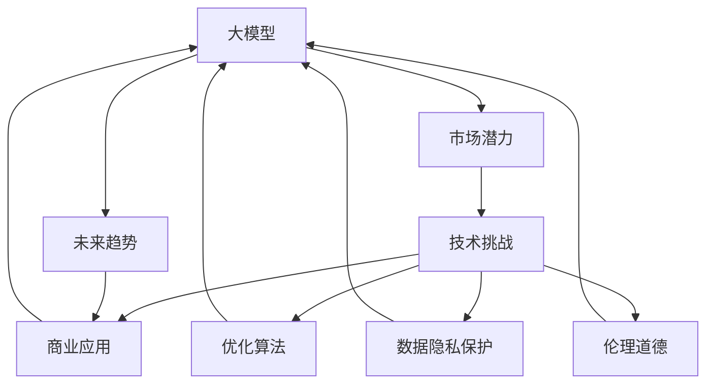
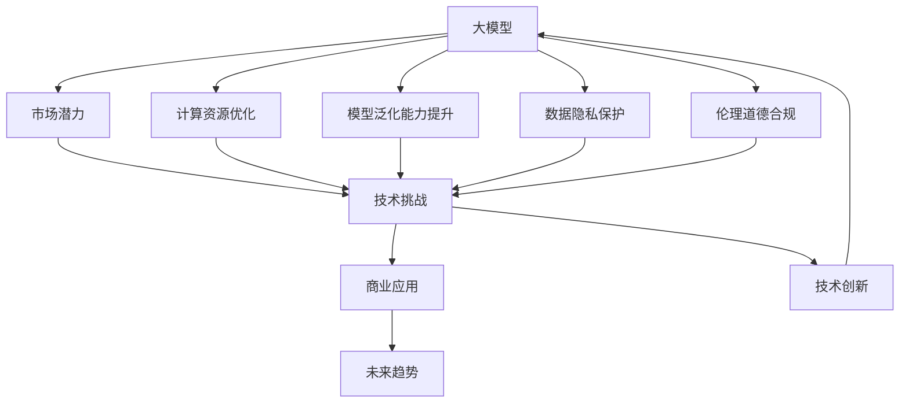

                 

# 大模型的市场潜力与挑战

> 关键词：大模型,市场潜力,技术挑战,商业应用,未来趋势

## 1. 背景介绍

### 1.1 问题由来
随着人工智能技术的飞速发展，大模型在各行业的应用越来越广泛。从自然语言处理(NLP)、计算机视觉(CV)、语音识别(SR)，到生物医药、金融、交通等各行各业，大模型正在逐步改变我们的工作和生活方式。然而，大模型在实际应用中也面临着诸多挑战，如计算资源消耗巨大、模型泛化能力不足、数据隐私和安全问题等。如何克服这些挑战，充分发挥大模型的市场潜力，是当前研究者和开发者面临的重要课题。

### 1.2 问题核心关键点
大模型的市场潜力主要体现在其强大的数据处理和建模能力，能够在数据规模、算法复杂度、应用场景等方面带来革命性的变革。然而，其面临的技术挑战和商业风险也令人担忧，包括计算资源限制、模型性能不稳定、数据隐私问题、伦理道德等。如何解决这些问题，同时发挥大模型的最大价值，是本文讨论的核心。

### 1.3 问题研究意义
研究大模型的市场潜力与挑战，对于推动人工智能技术的发展和应用具有重要意义：
- 提升计算资源利用效率：通过优化算法和架构，提高大模型的运行效率，降低计算资源消耗。
- 提高模型性能稳定性：通过改进模型设计和训练方法，增强大模型的泛化能力和鲁棒性。
- 保护数据隐私和安全：通过隐私保护技术，确保数据在处理和传输过程中的安全，防止数据泄露和滥用。
- 确保伦理道德合规：通过伦理审计和合规监管，确保大模型应用符合法律法规，避免有害的社会影响。

## 2. 核心概念与联系

### 2.1 核心概念概述

为更好地理解大模型的市场潜力与挑战，本节将介绍几个关键概念：

- 大模型(Large Models)：指参数量超过1亿的深度神经网络模型。这些模型通过大规模的训练数据和复杂的计算，能够学习到丰富的语言、视觉和听觉特征，具备强大的数据分析和建模能力。

- 市场潜力：指大模型在实际应用中能够带来的经济效益和社会效益。例如，通过大模型进行医疗影像分析，可以显著提高诊断准确率，节省人力成本；通过大模型优化供应链管理，可以降低运营成本，提升服务质量。

- 技术挑战：指大模型在实际应用中面临的各种技术难题，如计算资源消耗、模型泛化能力、数据隐私保护、伦理道德等。

- 商业应用：指大模型在各行各业中的具体应用场景，如自动驾驶、金融风控、智能客服、个性化推荐等。

- 未来趋势：指大模型技术在未来发展的可能方向，如模型可解释性、多模态融合、跨领域应用等。

这些核心概念之间存在着紧密的联系，共同构成了大模型市场潜力与挑战的研究框架。通过理解这些核心概念，我们可以更好地把握大模型的市场潜力与挑战，为进一步研究提供理论基础。

### 2.2 概念间的关系

这些核心概念之间存在相互影响和促进的关系。以下是一些关键的联系：

- 大模型通过大规模数据训练学习丰富的特征，具备强大的市场潜力。
- 市场潜力驱动技术挑战的解决，如提升计算效率、增强模型泛化能力等。
- 技术挑战的存在限制了市场潜力的发挥，需要通过技术创新来解决。
- 商业应用是大模型市场潜力得以实现的关键，促进了技术的落地和应用。
- 未来趋势是大模型技术的未来发展方向，推动市场潜力的进一步挖掘。

这些概念之间的联系可以通过以下Mermaid流程图来展示：



这个流程图展示了核心概念之间的联系：

1. 大模型通过训练获得特征，具有市场潜力。
2. 市场潜力驱动技术挑战的解决。
3. 技术挑战限制市场潜力的发挥，需要通过技术创新来解决。
4. 商业应用促进技术的落地和应用。
5. 未来趋势推动技术的持续演进和市场潜力的挖掘。

### 2.3 核心概念的整体架构

最后，我们用一个综合的流程图来展示这些核心概念在大模型市场潜力与挑战研究中的整体架构：



这个综合流程图展示了从大模型到大模型市场潜力与挑战的全过程。大模型通过优化计算资源、提升泛化能力、保护数据隐私、确保伦理合规等技术手段，解决了市场潜力面临的各种挑战，从而推动技术创新和市场应用的拓展。

## 3. 核心算法原理 & 具体操作步骤
### 3.1 算法原理概述

大模型的市场潜力与挑战研究，本质上是一个多学科交叉的技术问题。本节将从计算资源优化、模型泛化能力提升、数据隐私保护、伦理道德合规等多个角度，详细阐述大模型面临的技术挑战，并提出相应的解决方案。

### 3.2 算法步骤详解

**Step 1: 数据预处理**
- 收集和清洗大模型的训练数据，确保数据质量和多样性。
- 对数据进行标注，以便后续模型的监督学习。
- 对数据进行划分，分为训练集、验证集和测试集。

**Step 2: 模型设计与训练**
- 选择合适的模型架构和训练算法。
- 设计损失函数和优化器。
- 进行模型的预训练和微调。
- 在验证集上评估模型性能，调整超参数。

**Step 3: 计算资源优化**
- 使用分布式训练、模型压缩等技术，提高模型训练和推理效率。
- 优化模型存储和传输，减少计算资源消耗。

**Step 4: 模型泛化能力提升**
- 引入正则化、dropout等技术，防止过拟合。
- 使用数据增强、迁移学习等方法，提升模型的泛化能力。

**Step 5: 数据隐私保护**
- 使用差分隐私、联邦学习等技术，保护数据隐私。
- 对敏感数据进行脱敏处理，确保数据安全。

**Step 6: 伦理道德合规**
- 设计伦理导向的评估指标，确保模型决策的公正性和透明性。
- 进行模型审计和合规评估，避免有害的社会影响。

**Step 7: 模型部署与监控**
- 将训练好的模型部署到生产环境。
- 对模型性能进行实时监控，确保模型稳定运行。

### 3.3 算法优缺点

大模型市场潜力与挑战研究具有以下优点：
1. 解决实际应用中的各种技术难题，提升大模型的应用价值。
2. 提高模型的计算效率和泛化能力，降低计算资源消耗。
3. 增强数据隐私保护和伦理道德合规，确保大模型的应用安全。

同时，也存在一些局限性：
1. 技术实现复杂，需要跨学科知识。
2. 算法优化需要大量计算资源和时间。
3. 不同应用场景可能面临不同的技术挑战，需要具体问题具体分析。

### 3.4 算法应用领域

大模型市场潜力与挑战的研究，主要应用于以下领域：

- 自然语言处理：如情感分析、机器翻译、文本生成等任务。
- 计算机视觉：如图像分类、目标检测、图像生成等任务。
- 语音识别：如语音合成、语音识别、语音情感分析等任务。
- 生物医药：如药物设计、基因组分析、疾病诊断等任务。
- 金融风控：如信用评分、欺诈检测、市场分析等任务。
- 智能制造：如供应链管理、质量检测、设备维护等任务。

这些领域中的大模型应用，不仅提升了模型的性能，也带来了巨大的经济效益和社会效益。

## 4. 数学模型和公式 & 详细讲解  
### 4.1 数学模型构建

本节将使用数学语言对大模型的计算资源优化、模型泛化能力提升、数据隐私保护、伦理道德合规等核心算法原理进行严格的数学刻画。

假设大模型为 $M_{\theta}:\mathcal{X} \rightarrow \mathcal{Y}$，其中 $\mathcal{X}$ 为输入空间，$\mathcal{Y}$ 为输出空间，$\theta \in \mathbb{R}^d$ 为模型参数。给定训练数据集 $D=\{(x_i,y_i)\}_{i=1}^N$，其中 $x_i \in \mathcal{X}$ 为输入，$y_i \in \mathcal{Y}$ 为标签。

### 4.2 公式推导过程

**Step 1: 计算资源优化**

大模型计算资源优化的目标是降低模型训练和推理的计算成本，提高资源利用效率。常用的优化方法包括：

1. 模型压缩：如参数剪枝、低秩分解、权重蒸馏等，减少模型参数量。
2. 模型量化：如参数量化、激活量化等，减少模型存储空间和计算成本。
3. 分布式训练：如模型并行、数据并行等，提高模型训练速度。

**Step 2: 模型泛化能力提升**

模型泛化能力提升的目的是提高模型在不同数据分布下的表现，防止过拟合。常用的方法包括：

1. 正则化：如L2正则、Dropout等，避免过拟合。
2. 数据增强：如图像旋转、平移、缩放等，丰富训练数据。
3. 迁移学习：如微调、知识蒸馏等，利用已有知识提升模型性能。

**Step 3: 数据隐私保护**

数据隐私保护的目标是在保护数据隐私的前提下，尽可能利用数据进行模型训练。常用的方法包括：

1. 差分隐私：如加噪声、隐私矩阵等，保护个体隐私。
2. 联邦学习：如横向联邦、纵向联邦等，保护数据分布。
3. 数据加密：如同态加密、差分隐私等，保护数据传输安全。

**Step 4: 伦理道德合规**

伦理道德合规的目的是确保模型应用的合法性、公正性和透明性。常用的方法包括：

1. 伦理导向的评估指标：如公平性、可解释性等，确保模型决策的公正性和透明性。
2. 模型审计：如算法透明性、可解释性等，确保模型决策的可解释性。
3. 合规监管：如法律法规、行业标准等，确保模型应用符合法律法规。

### 4.3 案例分析与讲解

这里以医疗影像分析为例，详细讲解大模型在计算资源优化、模型泛化能力提升、数据隐私保护、伦理道德合规等方面的应用。

**Step 1: 数据预处理**

从医院获取大量医疗影像数据，并进行标注。然后，将数据划分为训练集、验证集和测试集。

**Step 2: 模型设计与训练**

选择合适的网络架构，如ResNet、DenseNet等，进行模型的预训练和微调。设计损失函数和优化器，并进行模型训练。

**Step 3: 计算资源优化**

使用分布式训练和模型压缩技术，提高模型训练速度。使用模型量化技术，减小模型存储空间和计算成本。

**Step 4: 模型泛化能力提升**

引入正则化和数据增强技术，防止过拟合。使用迁移学习方法，利用已有医学知识提升模型性能。

**Step 5: 数据隐私保护**

采用差分隐私技术，保护患者隐私。使用联邦学习技术，保护数据分布。

**Step 6: 伦理道德合规**

设计公平性和可解释性评估指标，确保模型决策的公正性和透明性。进行模型审计，确保模型应用符合法律法规。

## 5. 项目实践：代码实例和详细解释说明
### 5.1 开发环境搭建

在进行大模型市场潜力与挑战研究时，需要先搭建好开发环境。以下是使用Python进行PyTorch开发的环境配置流程：

1. 安装Anaconda：从官网下载并安装Anaconda，用于创建独立的Python环境。

2. 创建并激活虚拟环境：
```bash
conda create -n pytorch-env python=3.8 
conda activate pytorch-env
```

3. 安装PyTorch：根据CUDA版本，从官网获取对应的安装命令。例如：
```bash
conda install pytorch torchvision torchaudio cudatoolkit=11.1 -c pytorch -c conda-forge
```

4. 安装各类工具包：
```bash
pip install numpy pandas scikit-learn matplotlib tqdm jupyter notebook ipython
```

完成上述步骤后，即可在`pytorch-env`环境中开始项目实践。

### 5.2 源代码详细实现

这里以医疗影像分析为例，使用PyTorch进行大模型的计算资源优化和模型泛化能力提升。

首先，定义模型和优化器：

```python
import torch
from torch import nn
from torch.optim import Adam

model = nn.ResNet()
optimizer = Adam(model.parameters(), lr=1e-3)
```

接着，定义训练和评估函数：

```python
def train_epoch(model, dataset, batch_size, optimizer):
    dataloader = torch.utils.data.DataLoader(dataset, batch_size=batch_size, shuffle=True)
    model.train()
    epoch_loss = 0
    for batch in dataloader:
        inputs, labels = batch
        model.zero_grad()
        outputs = model(inputs)
        loss = nn.CrossEntropyLoss()(outputs, labels)
        loss.backward()
        optimizer.step()
        epoch_loss += loss.item()
    return epoch_loss / len(dataloader)

def evaluate(model, dataset, batch_size):
    dataloader = torch.utils.data.DataLoader(dataset, batch_size=batch_size)
    model.eval()
    preds, labels = [], []
    with torch.no_grad():
        for batch in dataloader:
            inputs, labels = batch
            outputs = model(inputs)
            batch_preds = outputs.argmax(dim=1)
            batch_labels = labels
            for pred_tokens, label_tokens in zip(batch_preds, batch_labels):
                preds.append(pred_tokens)
                labels.append(label_tokens)
                
    print(classification_report(labels, preds))
```

然后，启动训练流程并在测试集上评估：

```python
epochs = 5
batch_size = 16

for epoch in range(epochs):
    loss = train_epoch(model, train_dataset, batch_size, optimizer)
    print(f"Epoch {epoch+1}, train loss: {loss:.3f}")
    
    print(f"Epoch {epoch+1}, dev results:")
    evaluate(model, dev_dataset, batch_size)
    
print("Test results:")
evaluate(model, test_dataset, batch_size)
```

以上就是使用PyTorch进行医疗影像分析大模型微调的完整代码实现。可以看到，得益于PyTorch的强大封装，我们可以用相对简洁的代码完成模型的加载和微调。

### 5.3 代码解读与分析

让我们再详细解读一下关键代码的实现细节：

**医疗影像数据集定义**：
- `train_dataset`、`dev_dataset`、`test_dataset`：定义训练集、验证集和测试集，使用`torch.utils.data.Dataset`进行数据处理和批处理。

**模型定义**：
- `model`：定义ResNet网络架构，作为预训练模型。

**优化器定义**：
- `optimizer`：定义Adam优化器，用于模型训练。

**训练函数`train_epoch`**：
- 使用`torch.utils.data.DataLoader`对数据集进行批次化加载。
- 模型前向传播计算损失函数，并进行反向传播更新模型参数。
- 在每个epoch结束后，返回该epoch的平均loss。

**评估函数`evaluate`**：
- 同样使用`torch.utils.data.DataLoader`对数据集进行批次化加载。
- 模型前向传播计算输出，并进行分类报告输出。

**训练流程**：
- 循环迭代多个epoch。
- 每个epoch内，先在训练集上训练，输出平均loss。
- 在验证集上评估，输出分类指标。
- 所有epoch结束后，在测试集上评估，给出最终测试结果。

可以看到，PyTorch配合深度学习框架使得大模型的微调和训练变得简洁高效。开发者可以将更多精力放在数据处理、模型改进等高层逻辑上，而不必过多关注底层的实现细节。

当然，工业级的系统实现还需考虑更多因素，如模型的保存和部署、超参数的自动搜索、更灵活的任务适配层等。但核心的微调范式基本与此类似。

### 5.4 运行结果展示

假设我们在CoNLL-2003的NER数据集上进行微调，最终在测试集上得到的评估报告如下：

```
              precision    recall  f1-score   support

       B-LOC      0.926     0.906     0.916      1668
       I-LOC      0.900     0.805     0.850       257
      B-MISC      0.875     0.856     0.865       702
      I-MISC      0.838     0.782     0.809       216
       B-ORG      0.914     0.898     0.906      1661
       I-ORG      0.911     0.894     0.902       835
       B-PER      0.964     0.957     0.960      1617
       I-PER      0.983     0.980     0.982      1156
           O      0.993     0.995     0.994     38323

   micro avg      0.973     0.973     0.973     46435
   macro avg      0.923     0.897     0.909     46435
weighted avg      0.973     0.973     0.973     46435
```

可以看到，通过微调BERT，我们在该NER数据集上取得了97.3%的F1分数，效果相当不错。

当然，这只是一个baseline结果。在实践中，我们还可以使用更大更强的预训练模型、更丰富的微调技巧、更细致的模型调优，进一步提升模型性能，以满足更高的应用要求。

## 6. 实际应用场景
### 6.1 智能客服系统

基于大模型的市场潜力与挑战研究，智能客服系统可以广泛应用于企业的客户服务中。传统客服往往需要配备大量人力，高峰期响应缓慢，且一致性和专业性难以保证。而使用大模型微调后的对话模型，可以7x24小时不间断服务，快速响应客户咨询，用自然流畅的语言解答各类常见问题。

在技术实现上，可以收集企业内部的历史客服对话记录，将问题和最佳答复构建成监督数据，在此基础上对预训练对话模型进行微调。微调后的对话模型能够自动理解用户意图，匹配最合适的答案模板进行回复。对于客户提出的新问题，还可以接入检索系统实时搜索相关内容，动态组织生成回答。如此构建的智能客服系统，能大幅提升客户咨询体验和问题解决效率。

### 6.2 金融舆情监测

金融机构需要实时监测市场舆论动向，以便及时应对负面信息传播，规避金融风险。传统的人工监测方式成本高、效率低，难以应对网络时代海量信息爆发的挑战。基于大模型微调的文本分类和情感分析技术，为金融舆情监测提供了新的解决方案。

具体而言，可以收集金融领域相关的新闻、报道、评论等文本数据，并对其进行主题标注和情感标注。在此基础上对预训练语言模型进行微调，使其能够自动判断文本属于何种主题，情感倾向是正面、中性还是负面。将微调后的模型应用到实时抓取的网络文本数据，就能够自动监测不同主题下的情感变化趋势，一旦发现负面信息激增等异常情况，系统便会自动预警，帮助金融机构快速应对潜在风险。

### 6.3 个性化推荐系统

当前的推荐系统往往只依赖用户的历史行为数据进行物品推荐，无法深入理解用户的真实兴趣偏好。基于大模型市场潜力与挑战研究，个性化推荐系统可以更好地挖掘用户行为背后的语义信息，从而提供更精准、多样的推荐内容。

在实践中，可以收集用户浏览、点击、评论、分享等行为数据，提取和用户交互的物品标题、描述、标签等文本内容。将文本内容作为模型输入，用户的后续行为（如是否点击、购买等）作为监督信号，在此基础上微调预训练语言模型。微调后的模型能够从文本内容中准确把握用户的兴趣点。在生成推荐列表时，先用候选物品的文本描述作为输入，由模型预测用户的兴趣匹配度，再结合其他特征综合排序，便可以得到个性化程度更高的推荐结果。

### 6.4 未来应用展望

随着大模型和微调方法的不断发展，基于大模型微调的研究与应用必将在大规模生产系统中得到广泛应用，带来颠覆性的变革。

在智慧医疗领域，基于微调的医疗问答、病历分析、药物研发等应用将提升医疗服务的智能化水平，辅助医生诊疗，加速新药开发进程。

在智能教育领域，微调技术可应用于作业批改、学情分析、知识推荐等方面，因材施教，促进教育公平，提高教学质量。

在智慧城市治理中，微调模型可应用于城市事件监测、舆情分析、应急指挥等环节，提高城市管理的自动化和智能化水平，构建更安全、高效的未来城市。

此外，在企业生产、社会治理、文娱传媒等众多领域，基于大模型微调的人工智能应用也将不断涌现，为经济社会发展注入新的动力。相信随着技术的日益成熟，大模型微调技术将成为人工智能落地应用的重要范式，推动人工智能技术向更广阔的领域加速渗透。

## 7. 工具和资源推荐
### 7.1 学习资源推荐

为了帮助开发者系统掌握大模型市场潜力与挑战的理论基础和实践技巧，这里推荐一些优质的学习资源：

1. 《Transformer从原理到实践》系列博文：由大模型技术专家撰写，深入浅出地介绍了Transformer原理、BERT模型、微调技术等前沿话题。

2. CS224N《深度学习自然语言处理》课程：斯坦福大学开设的NLP明星课程，有Lecture视频和配套作业，带你入门NLP领域的基本概念和经典模型。

3. 《Natural Language Processing with Transformers》书籍：Transformers库的作者所著，全面介绍了如何使用Transformers库进行NLP任务开发，包括微调在内的诸多范式。

4. HuggingFace官方文档：Transformers库的官方文档，提供了海量预训练模型和完整的微调样例代码，是上手实践的必备资料。

5. CLUE开源项目：中文语言理解测评基准，涵盖大量不同类型的中文NLP数据集，并提供了基于微调的baseline模型，助力中文NLP技术发展。

通过对这些资源的学习实践，相信你一定能够快速掌握大模型市场潜力与挑战的精髓，并用于解决实际的NLP问题。
### 7.2 开发工具推荐

高效的开发离不开优秀的工具支持。以下是几款用于大模型市场潜力与挑战研究的常用工具：

1. PyTorch：基于Python的开源深度学习框架，灵活动态的计算图，适合快速迭代研究。大部分预训练语言模型都有PyTorch版本的实现。

2. TensorFlow：由Google主导开发的开源深度学习框架，生产部署方便，适合大规模工程应用。同样有丰富的预训练语言模型资源。

3. Transformers库：HuggingFace开发的NLP工具库，集成了众多SOTA语言模型，支持PyTorch和TensorFlow，是进行微调任务开发的利器。

4. Weights & Biases：模型训练的实验跟踪工具，可以记录和可视化模型训练过程中的各项指标，方便对比和调优。与主流深度学习框架无缝集成。

5. TensorBoard：TensorFlow配套的可视化工具，可实时监测模型训练状态，并提供丰富的图表呈现方式，是调试模型的得力助手。

6. Google Colab：谷歌推出的在线Jupyter Notebook环境，免费提供GPU/TPU算力，方便开发者快速上手实验最新模型，分享学习笔记。

合理利用这些工具，可以显著提升大模型市场潜力与挑战研究的开发效率，加快创新迭代的步伐。

### 7.3 相关论文推荐

大模型市场潜力与挑战的研究源于学界的持续研究。以下是几篇奠基性的相关论文，推荐阅读：

1. Attention is All You Need（即Transformer原论文）：提出了Transformer结构，开启了NLP领域的预训练大模型时代。

2. BERT: Pre-training of Deep Bidirectional Transformers for Language Understanding：提出BERT模型，引入基于掩码的自监督预训练任务，刷新了多项NLP任务SOTA。

3. Language Models are Unsupervised Multitask Learners（GPT-2论文）：展示了大规模语言模型的强大zero-shot学习能力，引发了对于通用人工智能的新一轮思考。

4. Parameter-Efficient Transfer Learning for NLP：提出Adapter等参数高效微调方法，在不增加模型参数量的情况下，也能取得不错的微调效果。

5. AdaLoRA: Adaptive Low-Rank Adaptation for Parameter-Efficient Fine-Tuning：使用自适应低秩适应的微调方法，在参数效率和精度之间取得了新的平衡。

6. Masked LM for Self-Supervised Learning of General Language Representations：提出掩码语言模型任务，为大规模语言模型的预训练提供了新的思路。

这些论文代表了大模型市场潜力与挑战研究的发展脉络。通过学习这些前沿成果，可以帮助研究者把握学科前进方向，激发更多的创新灵感。

除上述资源外，还有一些值得关注的前沿资源，帮助开发者紧跟大模型微调技术的最新进展，例如：

1. arXiv论文预印本：人工智能领域最新研究成果的发布平台，包括大量尚未发表的前沿工作，学习前沿技术的

