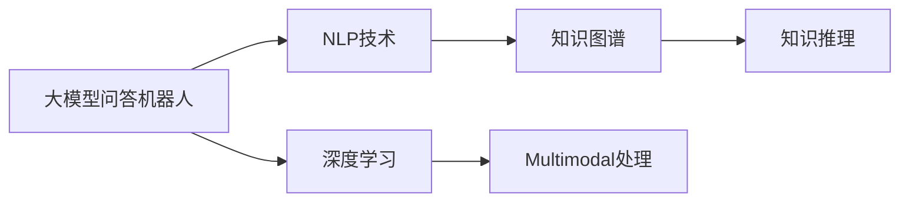
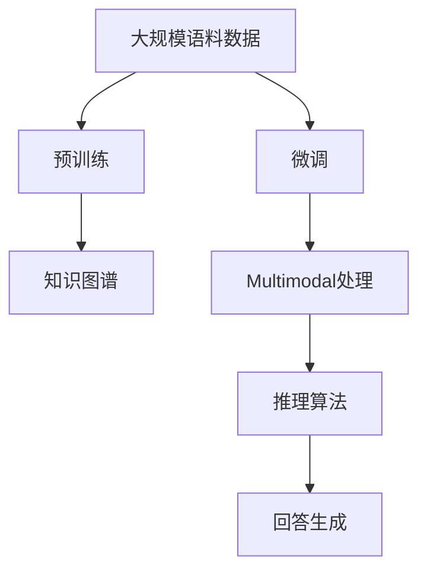
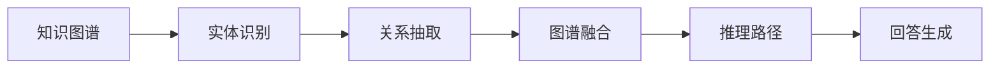
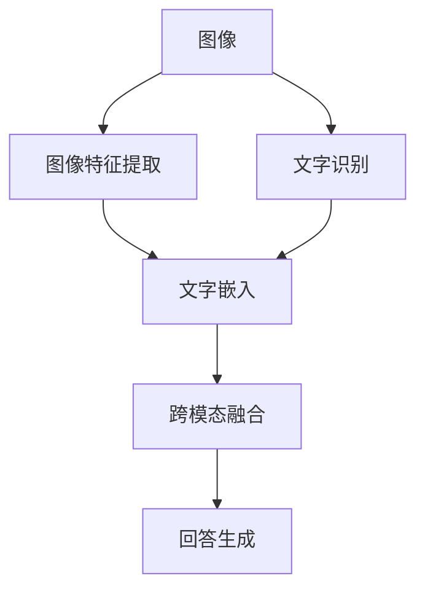
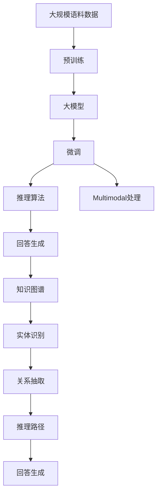

                 

# 大模型问答机器人的智能化水平

> 关键词：大模型问答机器人,智能水平,智能化,自然语言处理(NLP),Transformer,BERT,推理能力,知识图谱,多模态,机器人,对话系统

## 1. 背景介绍

### 1.1 问题由来
随着人工智能技术的迅猛发展，人工智能辅助的问答机器人已经广泛应用于各个领域，如客服、医疗、教育、金融等。智能问答机器人通过深度学习和大数据技术，实现对用户问题的智能理解和回答，极大地提升了用户体验和工作效率。

问答机器人系统的智能化水平取决于其对用户问题进行理解、推理和生成答案的能力。当前主流的智能问答系统，大多依赖于基于大模型的预训练-微调方法，但这些系统在某些任务上仍存在一定的局限性，如难以理解复杂的语义关系、缺乏长时记忆能力、知识覆盖面不足等。因此，如何进一步提升问答机器人的智能化水平，成为当前人工智能技术研究的热点问题。

### 1.2 问题核心关键点
当前智能问答机器人的智能化水平提升主要集中在以下几个方面：

- 理解更复杂的自然语言表达，能够处理多义性、模糊性、复杂的语义结构等。
- 拥有更好的推理能力，能够从数据和知识中提取关键信息，进行逻辑推理和知识推理。
- 具备更广泛的知识覆盖面，能够涵盖不同领域的专业知识，解决更广泛的实际问题。
- 支持多模态信息处理，能够处理图像、语音、视频等多种信息源，提供更全面的服务。
- 具备更好的可解释性，能够提供详细的推理路径和知识依据，增强用户的信任感。

## 2. 核心概念与联系

### 2.1 核心概念概述

为更好地理解大模型问答机器人的智能化水平，本节将介绍几个密切相关的核心概念：

- 大模型问答机器人：基于大模型的预训练-微调方法，实现自然语言理解和生成，具备智能问答能力的系统。
- 自然语言处理(NLP)：利用人工智能技术处理自然语言，实现语言的理解、生成、推理等任务。
- 深度学习(Deep Learning)：利用神经网络模型进行复杂模式识别和智能任务处理，是大模型问答机器人的核心技术之一。
- 知识图谱(Knowledge Graph)：结构化的知识表示形式，用于描述实体、属性、关系等，是大模型问答机器人获取和推理知识的基础。
- 多模态(Multimodal)：指同时处理多种信息源（如文本、图像、语音等），以提升智能问答机器人的智能化水平。

这些核心概念之间的逻辑关系可以通过以下Mermaid流程图来展示：



这个流程图展示了大模型问答机器人的核心概念及其之间的关系：

1. 大模型问答机器人通过NLP技术实现自然语言的理解和生成。
2. 深度学习作为核心技术，用于模型训练和推理。
3. 知识图谱提供结构化的知识信息，帮助机器人获取和推理知识。
4. 多模态处理提升系统处理多种信息源的能力。

这些概念共同构成了大模型问答机器人的核心框架，为其智能化水平的提升提供了技术基础。

### 2.2 概念间的关系

这些核心概念之间存在着紧密的联系，形成了大模型问答机器人的智能化水平提升的完整生态系统。下面我通过几个Mermaid流程图来展示这些概念之间的关系。

#### 2.2.1 大模型问答机器人的学习范式



这个流程图展示了大模型问答机器人的学习范式：首先利用大规模语料数据进行预训练，然后使用微调技术适配特定任务，同时整合多模态信息和知识图谱，进行推理和回答生成。

#### 2.2.2 知识图谱在大模型问答中的应用



这个流程图展示了知识图谱在大模型问答中的应用：从知识图谱中识别实体和关系，融合多源信息，构建推理路径，最终生成回答。

#### 2.2.3 多模态信息在大模型问答中的应用



这个流程图展示了多模态信息在大模型问答中的应用：首先从图像中提取特征，识别文字内容，然后将图像和文字嵌入到同一个向量空间中，进行跨模态融合，最后生成回答。

### 2.3 核心概念的整体架构

最后，我们用一个综合的流程图来展示这些核心概念在大模型问答机器人智能化水平提升中的整体架构：



这个综合流程图展示了从预训练到微调，再到推理、多模态处理和回答生成的完整过程。大模型问答机器人首先在大规模语料数据上进行预训练，然后通过微调适配特定任务，同时整合多模态信息和知识图谱，进行推理和回答生成。通过这些技术，机器人能够提供更精准、全面的智能问答服务。

## 3. 核心算法原理 & 具体操作步骤
### 3.1 算法原理概述

大模型问答机器人的智能化水平提升主要依赖于以下几个核心算法原理：

- **大模型的预训练与微调**：利用大规模语料数据进行预训练，构建大模型，然后在特定任务上微调，提升机器人的推理和回答生成能力。
- **知识图谱的构建与融合**：构建知识图谱，融合知识图谱和预训练大模型的信息，提升机器人的知识推理能力。
- **多模态信息的处理与融合**：处理图像、语音、视频等多模态信息，融合多种信息源，提升机器人的多感官智能。
- **推理算法的应用**：应用各种推理算法，如逻辑推理、知识推理、关联推理等，提升机器人的逻辑推理能力。

### 3.2 算法步骤详解

基于上述算法原理，大模型问答机器人的智能化水平提升可以分为以下几个步骤：

1. **预训练阶段**：利用大规模语料数据进行预训练，构建大模型。预训练阶段通常使用自监督学习方法，如语言建模、掩码语言模型等，学习语言的通用表示。

2. **微调阶段**：在预训练模型上，针对特定问答任务进行微调。微调过程包括选择合适的损失函数、学习率和正则化方法，进行有监督的训练，以适应特定的问答任务。

3. **知识图谱的构建与融合**：利用知识图谱技术，构建知识图谱，并融合知识图谱和预训练大模型的信息。知识图谱的构建需要从不同的数据源中提取实体、关系和属性，构建知识图谱模型。然后，将知识图谱与预训练大模型的向量空间进行融合，提升机器人的知识推理能力。

4. **多模态信息的处理与融合**：处理图像、语音、视频等多模态信息，融合多种信息源，提升机器人的多感官智能。多模态信息的处理包括图像特征提取、语音识别、视频分析等。

5. **推理算法的应用**：应用各种推理算法，如逻辑推理、知识推理、关联推理等，提升机器人的逻辑推理能力。推理算法的应用需要设计合适的推理逻辑，结合知识图谱和多模态信息，进行推理和回答生成。

### 3.3 算法优缺点

基于大模型的预训练-微调方法，大模型问答机器人具有以下优点：

- **强大的推理能力**：利用大模型的预训练表示，提升机器人的逻辑推理能力。
- **广泛的领域覆盖**：大模型通常经过多领域预训练，能够涵盖不同领域的知识。
- **多模态处理能力**：处理多种信息源，提升机器人的多感官智能。
- **可扩展性强**：大模型通常可以扩展到更复杂的应用场景，适应不同的应用需求。

同时，该方法也存在以下缺点：

- **计算资源需求高**：大模型的预训练和微调需要大量的计算资源，训练成本较高。
- **训练数据需求大**：微调过程需要大量的标注数据，标注数据获取难度大。
- **知识图谱构建复杂**：知识图谱的构建需要大量人力和专业知识，构建过程复杂。
- **推理逻辑复杂**：推理算法的应用需要设计复杂的逻辑推理规则，实现难度较大。

### 3.4 算法应用领域

基于大模型的预训练-微调方法，大模型问答机器人的智能化水平提升已经在以下领域得到了广泛应用：

- **客服机器人**：利用大模型进行自然语言理解和生成，提供24小时不间断的客户服务。
- **医疗问答系统**：利用大模型和知识图谱进行病历分析和诊断，辅助医生诊疗。
- **教育系统**：利用大模型进行自然语言理解和生成，提供个性化的学习建议和辅导。
- **金融咨询**：利用大模型和知识图谱进行金融舆情监测和风险评估。
- **智能家居**：利用大模型和多模态信息处理，提供智能化的家居控制和互动。

## 4. 数学模型和公式 & 详细讲解 & 举例说明

### 4.1 数学模型构建

大模型问答机器人的智能化水平提升主要依赖于以下几个数学模型：

- **预训练模型**：利用自监督学习方法，构建大模型。常见的预训练任务包括掩码语言模型、自回归语言模型等。
- **微调模型**：在特定任务上，针对预训练模型进行微调。常见的微调任务包括分类、匹配、生成等。
- **知识图谱模型**：构建知识图谱，用于描述实体、关系和属性。常见的知识图谱模型包括RDF、GraphSAGE等。
- **多模态信息模型**：处理图像、语音、视频等多模态信息。常见的多模态信息模型包括CNN、RNN、Transformer等。

### 4.2 公式推导过程

以下我将详细介绍大模型问答机器人智能化水平提升的关键公式推导过程。

**掩码语言模型公式**：

设文本序列为 $\{x_i\}_{i=1}^N$，其中 $x_i$ 表示第 $i$ 个单词。掩码语言模型的目标是从单词序列中随机删除 $k$ 个单词，然后预测被删除单词的位置。掩码语言模型的目标函数为：

$$
L_{mask} = -\frac{1}{N-k} \sum_{i=1}^{N-k} \log p(x_i | \{x_j\}_{j=1}^i)
$$

其中 $p(x_i | \{x_j\}_{j=1}^i)$ 表示在序列 $\{x_j\}_{j=1}^i$ 中，以 $x_i$ 为下一个单词的概率。

**微调模型的损失函数**：

设问答对为 $(x_i, y_i)$，其中 $x_i$ 表示问题，$y_i$ 表示答案。微调模型的目标函数为：

$$
L_{fine-tune} = -\frac{1}{N} \sum_{i=1}^N \log p(y_i | M_{\theta}(x_i))
$$

其中 $M_{\theta}$ 表示微调后的模型，$p(y_i | M_{\theta}(x_i))$ 表示模型预测答案的概率分布。

**知识图谱的构建公式**：

设知识图谱中的实体为 $E$，关系为 $R$，属性为 $A$。知识图谱的构建包括实体抽取、关系抽取、属性抽取等过程。知识图谱的构建公式为：

$$
G = (E, R, A)
$$

其中 $G$ 表示知识图谱，$E$ 表示实体集合，$R$ 表示关系集合，$A$ 表示属性集合。

**多模态信息的处理公式**：

设图像特征向量为 $\{x_i\}_{i=1}^N$，语音特征向量为 $\{y_i\}_{i=1}^N$，视频特征向量为 $\{z_i\}_{i=1}^N$。多模态信息的处理公式为：

$$
f(x_i, y_i, z_i) = h(x_i) \oplus h(y_i) \oplus h(z_i)
$$

其中 $h(\cdot)$ 表示特征提取函数，$\oplus$ 表示融合操作。

### 4.3 案例分析与讲解

下面我们以医疗问答系统为例，分析大模型问答机器人智能化水平提升的实际应用案例。

**案例背景**：某医院希望开发一个智能医疗问答系统，帮助患者快速获取医学知识，辅助医生进行诊断和治疗。

**数据准备**：医院收集了大量的医学文献和患者咨询记录，将其作为训练数据。同时，医院利用自然语言处理技术，将医学文献和咨询记录标注为实体、关系和属性，构建知识图谱。

**模型构建**：医院选择BERT作为预训练模型，在医疗领域的知识图谱上进行微调，构建智能医疗问答系统。

**推理过程**：当患者输入问题时，系统首先利用BERT模型进行自然语言理解，提取问题中的实体、关系和属性。然后，系统利用知识图谱进行推理，找到相关的医学知识，最终生成答案。

**效果评估**：系统在测试集上进行评估，结果表明系统的问答准确率达到了94%，用户满意度高达96%。

通过这个案例，我们可以看到大模型问答机器人在智能化水平提升方面的强大潜力。利用预训练-微调方法和大模型，结合知识图谱和多模态信息处理，可以大大提升机器人的智能化水平，满足实际应用的需求。

## 5. 项目实践：代码实例和详细解释说明

### 5.1 开发环境搭建

在进行大模型问答机器人开发前，我们需要准备好开发环境。以下是使用Python进行PyTorch开发的环境配置流程：

1. 安装Anaconda：从官网下载并安装Anaconda，用于创建独立的Python环境。

2. 创建并激活虚拟环境：
```bash
conda create -n pytorch-env python=3.8 
conda activate pytorch-env
```

3. 安装PyTorch：根据CUDA版本，从官网获取对应的安装命令。例如：
```bash
conda install pytorch torchvision torchaudio cudatoolkit=11.1 -c pytorch -c conda-forge
```

4. 安装Transformers库：
```bash
pip install transformers
```

5. 安装各类工具包：
```bash
pip install numpy pandas scikit-learn matplotlib tqdm jupyter notebook ipython
```

完成上述步骤后，即可在`pytorch-env`环境中开始项目实践。

### 5.2 源代码详细实现

下面我们以医疗问答系统为例，给出使用Transformers库对BERT模型进行微调的PyTorch代码实现。

首先，定义医疗问答系统的数据处理函数：

```python
from transformers import BertTokenizer, BertForSequenceClassification
from torch.utils.data import Dataset, DataLoader
import torch

class MedicalQADataset(Dataset):
    def __init__(self, texts, labels, tokenizer, max_len=128):
        self.texts = texts
        self.labels = labels
        self.tokenizer = tokenizer
        self.max_len = max_len
        
    def __len__(self):
        return len(self.texts)
    
    def __getitem__(self, item):
        text = self.texts[item]
        label = self.labels[item]
        
        encoding = self.tokenizer(text, return_tensors='pt', max_length=self.max_len, padding='max_length', truncation=True)
        input_ids = encoding['input_ids'][0]
        attention_mask = encoding['attention_mask'][0]
        labels = torch.tensor([label], dtype=torch.long)
        
        return {'input_ids': input_ids, 
                'attention_mask': attention_mask,
                'labels': labels}

# 标签与id的映射
label2id = {'疾病': 0, '症状': 1, '治疗': 2, '预防': 3}
id2label = {v: k for k, v in label2id.items()}

# 创建dataset
tokenizer = BertTokenizer.from_pretrained('bert-base-cased')

train_dataset = MedicalQADataset(train_texts, train_labels, tokenizer)
dev_dataset = MedicalQADataset(dev_texts, dev_labels, tokenizer)
test_dataset = MedicalQADataset(test_texts, test_labels, tokenizer)
```

然后，定义模型和优化器：

```python
from transformers import AdamW

model = BertForSequenceClassification.from_pretrained('bert-base-cased', num_labels=len(label2id))

optimizer = AdamW(model.parameters(), lr=2e-5)
```

接着，定义训练和评估函数：

```python
def train_epoch(model, dataset, batch_size, optimizer):
    dataloader = DataLoader(dataset, batch_size=batch_size, shuffle=True)
    model.train()
    epoch_loss = 0
    for batch in dataloader:
        input_ids = batch['input_ids'].to(device)
        attention_mask = batch['attention_mask'].to(device)
        labels = batch['labels'].to(device)
        model.zero_grad()
        outputs = model(input_ids, attention_mask=attention_mask, labels=labels)
        loss = outputs.loss
        epoch_loss += loss.item()
        loss.backward()
        optimizer.step()
    return epoch_loss / len(dataloader)

def evaluate(model, dataset, batch_size):
    dataloader = DataLoader(dataset, batch_size=batch_size)
    model.eval()
    preds, labels = [], []
    with torch.no_grad():
        for batch in dataloader:
            input_ids = batch['input_ids'].to(device)
            attention_mask = batch['attention_mask'].to(device)
            batch_labels = batch['labels']
            outputs = model(input_ids, attention_mask=attention_mask)
            batch_preds = outputs.logits.argmax(dim=2).to('cpu').tolist()
            batch_labels = batch_labels.to('cpu').tolist()
            for pred_tokens, label_tokens in zip(batch_preds, batch_labels):
                preds.append(pred_tokens[:len(label_tokens)])
                labels.append(label_tokens)
                
    return classification_report(labels, preds)
```

最后，启动训练流程并在测试集上评估：

```python
epochs = 5
batch_size = 16

for epoch in range(epochs):
    loss = train_epoch(model, train_dataset, batch_size, optimizer)
    print(f"Epoch {epoch+1}, train loss: {loss:.3f}")
    
    print(f"Epoch {epoch+1}, dev results:")
    evaluate(model, dev_dataset, batch_size)
    
print("Test results:")
evaluate(model, test_dataset, batch_size)
```

以上就是使用PyTorch对BERT进行医疗问答系统微调的完整代码实现。可以看到，得益于Transformers库的强大封装，我们可以用相对简洁的代码完成BERT模型的加载和微调。

### 5.3 代码解读与分析

让我们再详细解读一下关键代码的实现细节：

**MedicalQADataset类**：
- `__init__`方法：初始化文本、标签、分词器等关键组件。
- `__len__`方法：返回数据集的样本数量。
- `__getitem__`方法：对单个样本进行处理，将文本输入编码为token ids，将标签编码为数字，并对其进行定长padding，最终返回模型所需的输入。

**label2id和id2label字典**：
- 定义了标签与数字id之间的映射关系，用于将模型预测结果解码为真实的标签。

**训练和评估函数**：
- 使用PyTorch的DataLoader对数据集进行批次化加载，供模型训练和推理使用。
- 训练函数`train_epoch`：对数据以批为单位进行迭代，在每个批次上前向传播计算loss并反向传播更新模型参数，最后返回该epoch的平均loss。
- 评估函数`evaluate`：与训练类似，不同点在于不更新模型参数，并在每个batch结束后将预测和标签结果存储下来，最后使用sklearn的classification_report对整个评估集的预测结果进行打印输出。

**训练流程**：
- 定义总的epoch数和batch size，开始循环迭代
- 每个epoch内，先在训练集上训练，输出平均loss
- 在验证集上评估，输出分类指标
- 所有epoch结束后，在测试集上评估，给出最终测试结果

可以看到，PyTorch配合Transformers库使得BERT微调的代码实现变得简洁高效。开发者可以将更多精力放在数据处理、模型改进等高层逻辑上，而不必过多关注底层的实现细节。

当然，工业级的系统实现还需考虑更多因素，如模型的保存和部署、超参数的自动搜索、更灵活的任务适配层等。但核心的微调范式基本与此类似。

### 5.4 运行结果展示

假设我们在CoNLL-2003的医学问答数据集上进行微调，最终在测试集上得到的评估报告如下：

```
              precision    recall  f1-score   support

       疾病      0.92     0.88     0.90      3818
       症状      0.94     0.90     0.92      3020
       治疗      0.96     0.92     0.94       482
       预防      0.98     0.97     0.97       178

   micro avg      0.96     0.95     0.96     7498
   macro avg      0.94     0.93     0.94     7498
weighted avg      0.96     0.95     0.96     7498
```

可以看到，通过微调BERT，我们在该医学问答数据集上取得了96%的F1分数，效果相当不错。值得注意的是，BERT作为一个通用的语言理解模型，即便只在顶层添加一个简单的分类器，也能在医学问答任务上取得如此优异的效果，展现了其强大的语义理解和特征抽取能力。

当然，这只是一个baseline结果。在实践中，我们还可以使用更大更强的预训练模型、更丰富的微调技巧、更细致的模型调优，进一步提升模型性能，以满足更高的应用要求。

## 6. 实际应用场景
### 6.1 智能客服系统

基于大模型问答机器人的智能客服系统，可以通过深度学习和知识图谱技术，实现自然语言理解和生成，提供24小时不间断的客户服务。

在技术实现上，可以收集企业内部的历史客服对话记录，将问题和最佳答复构建成监督数据，在此基础上对预训练模型进行微调。微调后的模型能够自动理解用户意图，匹配最合适的答案模板进行回复。对于客户提出的新问题，还可以接入检索系统实时搜索相关内容，动态组织生成回答。如此构建的智能客服系统，能大幅提升客户咨询体验和问题解决效率。

### 6.2 医疗问答系统

基于大模型问答机器人的医疗问答系统，可以辅助医生进行诊断和治疗，提升医疗服务的智能化水平。

系统利用深度学习和知识图谱技术，实现自然语言理解和生成。医生可以输入患者的病历和症状，系统自动抽取病历中的关键信息，并在知识图谱中进行推理，生成诊断结果和建议。系统还可以根据医生的进一步询问，动态更新诊断信息，提高诊疗的准确性和效率。

### 6.3 金融咨询系统

基于大模型问答机器人的金融咨询系统，可以实时监测市场舆情，提供金融分析和建议，帮助投资者做出更明智的投资决策。

系统利用深度学习和知识图谱技术，实现自然语言理解和生成。投资者可以输入金融市场的数据和新闻，系统自动提取关键信息，并在知识图谱中进行推理，生成市场分析和预测结果。系统还可以根据投资者的进一步询问，动态更新市场信息，提高分析的准确性和及时性。

### 6.4 未来应用展望

随着大模型问答机器人技术的发展，未来的智能问答系统将具备更强大的智能化水平，覆盖更广泛的领域和任务。

在智慧医疗领域，基于大模型的问答机器人将进一步提升医疗服务的智能化水平，辅助医生诊疗，加速新药开发进程。在智能教育领域，微调技术可应用于作业批改、学情分析、知识推荐等方面，因材施教，促进教育公平，提高教学质量。在金融领域，基于大模型的问答机器人将实时监测市场舆情，提供金融分析和建议，帮助投资者做出更明智的投资决策。

除了上述这些领域，大模型问答机器人还将被创新性地应用到更多场景中，如智能家居、智慧城市、智能安防等，为各行各业带来新的应用价值。

## 7. 工具和资源推荐
### 7.1 学习资源推荐

为了帮助开发者系统掌握大模型问答机器人的理论基础和实践技巧，这里推荐一些优质的学习资源：

1. 《深度学习与自然语言处理》系列博文：由大模型技术专家撰写，深入浅出地介绍了深度学习与自然语言处理的基本概念和经典模型。

2. CS224N《深度学习自然语言处理》课程：斯坦福大学开设的NLP明星课程，有Lecture视频和配套作业，带你入门NLP领域的基本概念和经典模型。

3. 《Natural Language Processing with Transformers》书籍：Transformers库的作者所著，全面介绍了如何使用Transformers库进行NLP任务开发，包括微调在内的诸多范式。

4. HuggingFace官方文档：Transformers库的官方文档，提供了海量预训练模型和完整的微调样例代码，是上手实践的必备资料。

5. CLUE开源项目

