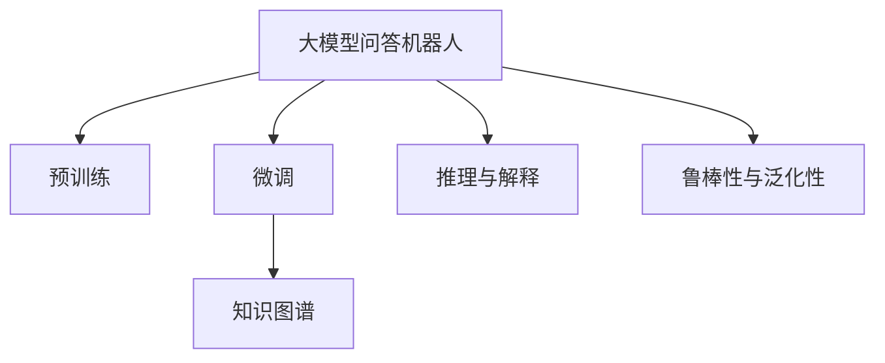
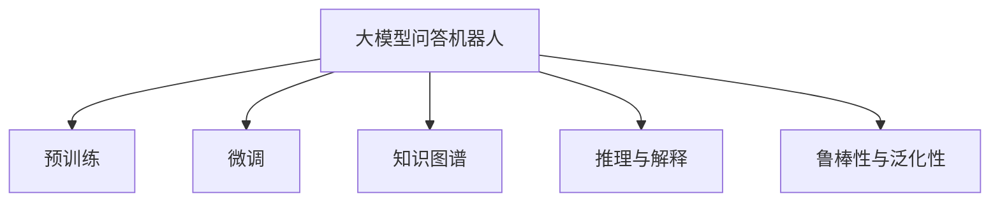
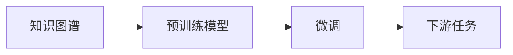
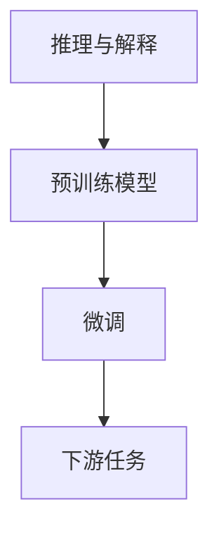
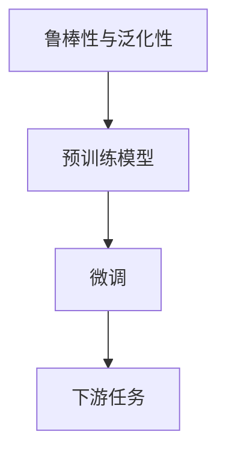
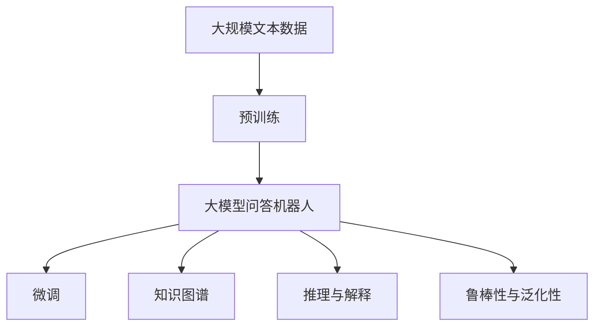

                 

## 1. 背景介绍

在人工智能领域，自然语言处理（Natural Language Processing, NLP）是一项基础且关键的技术，广泛应用于聊天机器人、智能客服、语音助手等场景。随着预训练语言模型（Pre-trained Language Model, PLM）和大规模预训练技术的兴起，问答机器人（Question Answering, QA）逐渐成为NLP研究的新热点。其核心在于如何利用预训练模型高效地理解和回答用户提出的自然语言问题。

### 1.1 问题由来

在传统的QA系统中，通常采用基于模板或规则的问答系统。这类系统依赖于预设的模板和规则库，难以应对非结构化自然语言问题。而基于大模型（如GPT-3、BERT等）的QA系统，则能通过预训练学习到丰富的语言表示，在少量标注数据下就能进行高精度的问答任务。大模型已经展现出强大的语义理解能力，但实际应用中仍面临不少挑战，如背景知识缺乏、模型鲁棒性不足、推理路径复杂等问题。

### 1.2 问题核心关键点

大模型问答机器人的语义理解能力主要涉及以下几个关键点：
- **预训练与微调**：如何在大规模无标签语料上进行预训练，并利用下游任务的少量标注数据进行微调，以提升模型在特定问答任务上的性能。
- **知识图谱**：如何将外部知识库与预训练模型结合，构建综合的知识图谱，增强模型对复杂问答任务的推理能力。
- **推理与解释**：如何对模型的推理路径进行解释，以提高用户对输出结果的可解释性和信任度。
- **鲁棒性与泛化性**：如何增强模型的鲁棒性，使其在各种不同来源的问题上都能表现出良好的泛化能力。

这些关键点共同构成了大模型问答机器人的核心能力，对提升系统性能和用户体验至关重要。

### 1.3 问题研究意义

研究大模型问答机器人的语义理解能力，对于拓展大模型的应用范围，提升问答系统的性能，加速NLP技术的产业化进程，具有重要意义：

1. **降低开发成本**：基于大模型进行问答任务开发，可以显著减少从头开发所需的数据、计算和人力等成本投入。
2. **提升系统效果**：微调使得通用大模型更好地适应特定问答任务，在应用场景中取得更优表现。
3. **加速开发进度**：standing on the shoulders of giants，微调使得开发者可以更快地完成任务适配，缩短开发周期。
4. **带来技术创新**：微调范式促进了对预训练-微调的深入研究，催生了知识图谱、推理路径解释、鲁棒性提升等新的研究方向。
5. **赋能产业升级**：微调使得NLP技术更容易被各行各业所采用，为传统行业数字化转型升级提供新的技术路径。

## 2. 核心概念与联系

### 2.1 核心概念概述

为更好地理解大模型问答机器人的语义理解能力，本节将介绍几个密切相关的核心概念：

- **大模型问答机器人**：以自回归(如GPT)或自编码(如BERT)模型为代表的大规模预训练语言模型，用于处理自然语言问答任务。
- **预训练与微调**：在大规模无标签文本语料上进行预训练，然后通过少量标注数据进行微调，提升模型在特定问答任务上的性能。
- **知识图谱**：基于实体和关系的事实图谱，用于增强模型的背景知识，支持更复杂的推理和生成任务。
- **推理与解释**：对模型的推理路径进行解释，提高用户对输出结果的可解释性和信任度。
- **鲁棒性与泛化性**：模型的鲁棒性指在不同输入数据下的稳定性，泛化性指模型在不同数据集上的通用性。

这些核心概念之间的逻辑关系可以通过以下Mermaid流程图来展示：



这个流程图展示了大模型问答机器人的核心概念及其之间的关系：

1. 大模型问答机器人通过预训练获得基础能力。
2. 微调是对预训练模型进行任务特定的优化，以提升模型在特定问答任务上的性能。
3. 知识图谱为模型提供了丰富的背景知识，支持复杂的推理和生成任务。
4. 推理与解释方法使得模型输出的结果更具有可解释性。
5. 鲁棒性与泛化性保证了模型在不同输入数据下的稳定性和通用性。

这些概念共同构成了大模型问答机器人的完整生态系统，使其能够在各种问答场景下发挥强大的语义理解能力。通过理解这些核心概念，我们可以更好地把握大模型问答机器人的工作原理和优化方向。

### 2.2 概念间的关系

这些核心概念之间存在着紧密的联系，形成了大模型问答机器人的完整系统。下面我们通过几个Mermaid流程图来展示这些概念之间的关系。

#### 2.2.1 大模型问答机器人的学习范式



这个流程图展示了大模型问答机器人的主要学习范式，即预训练-微调过程。预训练通过大规模无标签语料学习通用语言表示，微调则利用下游任务的少量标注数据进行特定优化。

#### 2.2.2 知识图谱与微调的关系



这个流程图展示了知识图谱在预训练-微调中的作用。知识图谱与预训练模型结合，提高了模型的背景知识储备，使得微调后的模型能够更好地处理复杂的问答任务。

#### 2.2.3 推理与解释在大模型问答机器人中的应用



这个流程图展示了推理与解释在大模型问答机器人中的应用。推理与解释方法，使得模型输出的结果更加可解释，提高了用户的信任度和满意度。

#### 2.2.4 鲁棒性与泛化性在大模型问答机器人中的应用



这个流程图展示了鲁棒性与泛化性在大模型问答机器人中的应用。通过增强模型的鲁棒性和泛化性，可以提高模型在不同场景下的稳定性和适应能力。

### 2.3 核心概念的整体架构

最后，我们用一个综合的流程图来展示这些核心概念在大模型问答机器人微调过程中的整体架构：



这个综合流程图展示了从预训练到微调，再到知识图谱、推理与解释、鲁棒性与泛化性的完整过程。大模型问答机器人首先在大规模文本数据上进行预训练，然后通过微调适应特定问答任务。知识图谱和推理与解释方法进一步提升模型的语义理解能力，鲁棒性与泛化性则确保模型在不同场景下的稳定性。通过这些概念的有机结合，大模型问答机器人能够高效地处理自然语言问答任务，为用户提供高质量的服务。

## 3. 核心算法原理 & 具体操作步骤
### 3.1 算法原理概述

大模型问答机器人的语义理解能力主要基于预训练-微调框架，具体流程如下：

1. **预训练**：在大规模无标签语料上，通过自监督学习任务（如掩码语言模型、下一句预测等）训练通用语言模型。
2. **微调**：在预训练模型的基础上，利用下游任务的少量标注数据进行有监督学习，优化模型在特定问答任务上的性能。

### 3.2 算法步骤详解

#### 3.2.1 预训练

预训练主要通过自监督学习任务，在大规模无标签语料上训练通用语言模型。以BERT为例，其预训练过程主要包括掩码语言模型和下一句预测两个任务：

1. 掩码语言模型：在输入文本中随机遮盖部分单词，让模型预测被遮盖的单词。
2. 下一句预测：随机将两个句子接在一起，让模型预测第二个句子是否是下一个句子。

预训练模型的结构通常为Transformer编码器，包含多头自注意力机制和层归一化，可以有效地捕捉语言中的长期依赖关系。

#### 3.2.2 微调

微调过程通过有监督学习，对预训练模型进行特定优化，以提升模型在问答任务上的性能。具体步骤如下：

1. **任务适配层设计**：根据问答任务类型，在预训练模型顶层设计合适的输出层和损失函数。
2. **微调超参数设置**：选择合适的优化算法及其参数，如AdamW、SGD等，设置学习率、批大小、迭代轮数等。
3. **正则化技术应用**：使用L2正则、Dropout、Early Stopping等，防止模型过度适应小规模训练集。
4. **训练过程执行**：将训练集数据分批次输入模型，前向传播计算损失函数，反向传播计算参数梯度，根据设定的优化算法和学习率更新模型参数。
5. **验证集评估**：周期性在验证集上评估模型性能，根据性能指标决定是否触发Early Stopping。
6. **测试集测试**：在测试集上评估微调后模型，对比微调前后的性能提升。

#### 3.2.3 知识图谱融合

知识图谱可以为问答机器人提供丰富的背景知识，提升模型的推理能力。知识图谱通常由实体、关系和事实构成，例如：

- 实体：如人名、地名、机构名等。
- 关系：如“出生地”、“工作地点”等。
- 事实：如“特定实体具有特定属性”。

知识图谱与预训练模型的融合方式主要有以下几种：

1. **预训练时融合**：在预训练过程中，将知识图谱中的事实和关系作为额外的训练信号，提高模型的语义表示能力。
2. **微调时融合**：在微调过程中，将知识图谱中的实体和关系嵌入到模型的语义表示中，增强模型的推理能力。
3. **推理时融合**：在推理过程中，利用知识图谱中的关系图和实体属性，进行多跳推理，生成更加准确的答案。

#### 3.2.4 推理与解释

推理与解释方法使得模型输出的结果更具有可解释性。常见的方法包括：

1. **基于规则的解释**：利用专家定义的规则和模板，对模型的推理路径进行解释。
2. **基于图神经网络的解释**：利用图神经网络，对知识图谱中的实体和关系进行推理，生成解释性更强的答案。
3. **基于可解释模型的解释**：使用可解释性更强的模型（如决策树、线性回归等），生成易于理解的结果。

### 3.3 算法优缺点

大模型问答机器人的语义理解能力具有以下优点：

1. **高效性**：通过预训练-微调框架，能够在大量无标签数据上进行高效训练，快速适应特定问答任务。
2. **通用性**：能够处理各种类型的问答任务，只需简单调整任务适配层即可实现微调。
3. **适应性强**：能够处理不同领域、不同类型的问题，适用范围广泛。
4. **可解释性**：通过推理与解释方法，模型的输出结果更具有可解释性，提高了用户的信任度。

同时，也存在以下缺点：

1. **数据依赖**：微调效果很大程度上取决于标注数据的质量和数量，获取高质量标注数据的成本较高。
2. **模型复杂度**：大规模预训练模型和微调过程复杂，计算资源和存储空间需求较大。
3. **知识图谱构建**：知识图谱的构建和维护需要大量人工干预，成本较高。
4. **推理路径复杂**：多跳推理和高阶推理任务，推理路径较为复杂，难以解释。

尽管存在这些局限性，但就目前而言，基于预训练-微调的问答机器人仍然是最为主流和有效的解决方案。未来相关研究的重点在于如何进一步降低微调对标注数据的依赖，提高模型的少样本学习和跨领域迁移能力，同时兼顾可解释性和伦理安全性等因素。

### 3.4 算法应用领域

大模型问答机器人的语义理解能力已经广泛应用于以下几个领域：

1. **智能客服**：通过问答机器人，智能客服系统能够快速响应用户咨询，提供高效、一致的服务。
2. **医疗咨询**：通过问答机器人，医疗咨询系统能够辅助医生诊断，提供个性化医疗建议。
3. **金融咨询**：通过问答机器人，金融咨询系统能够提供股票市场分析、投资策略建议等服务。
4. **教育辅导**：通过问答机器人，教育辅导系统能够回答学生问题，提供个性化学习建议。
5. **智能家居**：通过问答机器人，智能家居系统能够回答用户问题，提供语音控制、智能推荐等服务。
6. **科学研究**：通过问答机器人，科学研究系统能够辅助科学家进行文献检索、实验设计等工作。

除了上述这些经典应用外，大模型问答机器人还在更多领域得到了创新性应用，如智能助理、在线翻译、法律咨询等，为各行各业带来了新的变革。

## 4. 数学模型和公式 & 详细讲解  
### 4.1 数学模型构建

假设预训练语言模型为 $M_{\theta}$，其中 $\theta$ 为预训练得到的模型参数。给定问答任务 $T$ 的训练集 $D=\{(x_i, q_i, a_i)\}_{i=1}^N$，其中 $x_i$ 为输入文本，$q_i$ 为问题，$a_i$ 为答案。微调的目标是找到新的模型参数 $\hat{\theta}$，使得：

$$
\hat{\theta}=\mathop{\arg\min}_{\theta} \mathcal{L}(M_{\theta},D)
$$

其中 $\mathcal{L}$ 为针对问答任务设计的损失函数，用于衡量模型输出与真实答案之间的差异。常见的损失函数包括交叉熵损失、均方误差损失等。

通过梯度下降等优化算法，微调过程不断更新模型参数 $\theta$，最小化损失函数 $\mathcal{L}$，使得模型输出逼近真实答案。由于 $\theta$ 已经通过预训练获得了较好的初始化，因此即便在少量标注数据上微调，也能较快收敛到理想的模型参数 $\hat{\theta}$。

### 4.2 公式推导过程

以下我们以二分类任务为例，推导交叉熵损失函数及其梯度的计算公式。

假设模型 $M_{\theta}$ 在输入 $(x,q)$ 上的输出为 $\hat{a}=M_{\theta}(x,q) \in [0,1]$，表示问题对应的答案概率。真实答案 $a \in \{0,1\}$。则二分类交叉熵损失函数定义为：

$$
\ell(M_{\theta}(x,q),a) = -[a\log \hat{a} + (1-a)\log (1-\hat{a})]
$$

将其代入经验风险公式，得：

$$
\mathcal{L}(\theta) = -\frac{1}{N}\sum_{i=1}^N [a_i\log M_{\theta}(x_i,q_i)+(1-a_i)\log(1-M_{\theta}(x_i,q_i))]
$$

根据链式法则，损失函数对参数 $\theta_k$ 的梯度为：

$$
\frac{\partial \mathcal{L}(\theta)}{\partial \theta_k} = -\frac{1}{N}\sum_{i=1}^N (\frac{a_i}{M_{\theta}(x_i,q_i)}-\frac{1-a_i}{1-M_{\theta}(x_i,q_i)}) \frac{\partial M_{\theta}(x_i,q_i)}{\partial \theta_k}
$$

其中 $\frac{\partial M_{\theta}(x_i,q_i)}{\partial \theta_k}$ 可进一步递归展开，利用自动微分技术完成计算。

在得到损失函数的梯度后，即可带入参数更新公式，完成模型的迭代优化。重复上述过程直至收敛，最终得到适应问答任务的最优模型参数 $\hat{\theta}$。

### 4.3 案例分析与讲解

以命名实体识别（Named Entity Recognition, NER）为例，分析大模型问答机器人的语义理解能力。

假设模型 $M_{\theta}$ 在输入 $(x,q)$ 上的输出为 $\hat{a}=M_{\theta}(x,q)$，其中 $\hat{a} \in \{B-PER, I-PER, B-LOC, I-LOC, B-MISC, I-MISC, O\}$。真实答案 $a \in \{B-PER, I-PER, B-LOC, I-LOC, B-MISC, I-MISC, O\}$。则二分类交叉熵损失函数为：

$$
\ell(M_{\theta}(x,q),a) = -[a\log \hat{a} + (1-a)\log (1-\hat{a})]
$$

将其代入经验风险公式，得：

$$
\mathcal{L}(\theta) = -\frac{1}{N}\sum_{i=1}^N [a_i\log M_{\theta}(x_i,q_i)+(1-a_i)\log(1-M_{\theta}(x_i,q_i))]
$$

根据链式法则，损失函数对参数 $\theta_k$ 的梯度为：

$$
\frac{\partial \mathcal{L}(\theta)}{\partial \theta_k} = -\frac{1}{N}\sum_{i=1}^N (\frac{a_i}{M_{\theta}(x_i,q_i)}-\frac{1-a_i}{1-M_{\theta}(x_i,q_i)}) \frac{\partial M_{\theta}(x_i,q_i)}{\partial \theta_k}
$$

在得到损失函数的梯度后，即可带入参数更新公式，完成模型的迭代优化。重复上述过程直至收敛，最终得到适应问答任务的最优模型参数 $\hat{\theta}$。

## 5. 项目实践：代码实例和详细解释说明
### 5.1 开发环境搭建

在进行微调实践前，我们需要准备好开发环境。以下是使用Python进行PyTorch开发的环境配置流程：

1. 安装Anaconda：从官网下载并安装Anaconda，用于创建独立的Python环境。

2. 创建并激活虚拟环境：
```bash
conda create -n pytorch-env python=3.8 
conda activate pytorch-env
```

3. 安装PyTorch：根据CUDA版本，从官网获取对应的安装命令。例如：
```bash
conda install pytorch torchvision torchaudio cudatoolkit=11.1 -c pytorch -c conda-forge
```

4. 安装Transformers库：
```bash
pip install transformers
```

5. 安装各类工具包：
```bash
pip install numpy pandas scikit-learn matplotlib tqdm jupyter notebook ipython
```

完成上述步骤后，即可在`pytorch-env`环境中开始微调实践。

### 5.2 源代码详细实现

下面我们以命名实体识别(NER)任务为例，给出使用Transformers库对BERT模型进行微调的PyTorch代码实现。

首先，定义NER任务的数据处理函数：

```python
from transformers import BertTokenizer
from torch.utils.data import Dataset
import torch

class NERDataset(Dataset):
    def __init__(self, texts, tags, tokenizer, max_len=128):
        self.texts = texts
        self.tags = tags
        self.tokenizer = tokenizer
        self.max_len = max_len
        
    def __len__(self):
        return len(self.texts)
    
    def __getitem__(self, item):
        text = self.texts[item]
        tags = self.tags[item]
        
        encoding = self.tokenizer(text, return_tensors='pt', max_length=self.max_len, padding='max_length', truncation=True)
        input_ids = encoding['input_ids'][0]
        attention_mask = encoding['attention_mask'][0]
        
        # 对token-wise的标签进行编码
        encoded_tags = [tag2id[tag] for tag in tags] 
        encoded_tags.extend([tag2id['O']] * (self.max_len - len(encoded_tags)))
        labels = torch.tensor(encoded_tags, dtype=torch.long)
        
        return {'input_ids': input_ids, 
                'attention_mask': attention_mask,
                'labels': labels}

# 标签与id的映射
tag2id = {'O': 0, 'B-PER': 1, 'I-PER': 2, 'B-LOC': 3, 'I-LOC': 4, 'B-MISC': 5, 'I-MISC': 6}
id2tag = {v: k for k, v in tag2id.items()}

# 创建dataset
tokenizer = BertTokenizer.from_pretrained('bert-base-cased')

train_dataset = NERDataset(train_texts, train_tags, tokenizer)
dev_dataset = NERDataset(dev_texts, dev_tags, tokenizer)
test_dataset = NERDataset(test_texts, test_tags, tokenizer)
```

然后，定义模型和优化器：

```python
from transformers import BertForTokenClassification, AdamW

model = BertForTokenClassification.from_pretrained('bert-base-cased', num_labels=len(tag2id))

optimizer = AdamW(model.parameters(), lr=2e-5)
```

接着，定义训练和评估函数：

```python
from torch.utils.data import DataLoader
from tqdm import tqdm
from sklearn.metrics import classification_report

device = torch.device('cuda') if torch.cuda.is_available() else torch.device('cpu')
model.to(device)

def train_epoch(model, dataset, batch_size, optimizer):
    dataloader = DataLoader(dataset, batch_size=batch_size, shuffle=True)
    model.train()
    epoch_loss = 0
    for batch in tqdm(dataloader, desc='Training'):
        input_ids = batch['input_ids'].to(device)
        attention_mask = batch['attention_mask'].to(device)
        labels = batch['labels'].to(device)
        model.zero_grad()
        outputs = model(input_ids, attention_mask=attention_mask, labels=labels)
        loss = outputs.loss
        epoch_loss += loss.item()
        loss.backward()
        optimizer.step()
    return epoch_loss / len(dataloader)

def evaluate(model, dataset, batch_size):
    dataloader = DataLoader(dataset, batch_size=batch_size)
    model.eval()
    preds, labels = [], []
    with torch.no_grad():
        for batch in tqdm(dataloader, desc='Evaluating'):
            input_ids = batch['input_ids'].to(device)
            attention_mask = batch['attention_mask'].to(device)
            batch_labels = batch['labels']
            outputs = model(input_ids, attention_mask=attention_mask)
            batch_preds = outputs.logits.argmax(dim=2).to('cpu').tolist()
            batch_labels = batch_labels.to('cpu').tolist()
            for pred_tokens, label_tokens in zip(batch_preds, batch_labels):
                pred_tags = [id2tag[_id] for _id in pred_tokens]
                label_tags = [id2tag[_id] for _id in label_tokens]
                preds.append(pred_tags[:len(label_tags)])
                labels.append(label_tags)
                
    print(classification_report(labels, preds))
```

最后，启动训练流程并在测试集上评估：

```python
epochs = 5
batch_size = 16

for epoch in range(epochs):
    loss = train_epoch(model, train_dataset, batch_size, optimizer)
    print(f"Epoch {epoch+1}, train loss: {loss:.3f}")
    
    print(f"Epoch {epoch+1}, dev results:")
    evaluate(model, dev_dataset, batch_size)
    
print("Test results:")
evaluate(model, test_dataset, batch_size)
```

以上就是使用PyTorch对BERT进行命名实体识别任务微调的完整代码实现。可以看到，得益于Transformers库的强大封装，我们可以用相对简洁的代码完成BERT模型的加载和微调。

### 5.3 代码解读与分析

让我们再详细解读一下关键代码的实现细节：

**NERDataset类**：
- `__init__`方法：初始化文本、标签、分词器等关键组件。
- `__len__`方法：返回数据集的样本数量。
- `__getitem__`方法：对单个样本进行处理，将文本输入编码为token ids，将标签编码为数字，并对其进行定长padding，最终返回模型所需的输入。

**tag2id和id2tag字典**：
- 定义了标签与数字id之间的映射关系，用于将token-wise的预测结果解码回真实的标签。

**训练和评估函数**：
- 使用PyTorch的DataLoader对数据集进行批次化加载，供模型训练和推理使用。
- 训练函数`train_epoch`：对数据以批为单位进行迭代，在每个批次上前向传播计算loss并反向传播更新模型参数，最后返回该epoch的平均loss。
- 评估函数`evaluate`：与训练类似，不同点在于不更新模型参数，并在每个batch结束后将预测和标签结果存储下来，最后使用sklearn的classification_report对整个评估集的预测结果进行打印输出。

**训练流程**：
- 定义总的epoch数和batch size，开始循环迭代
- 每个epoch内，先在训练集上训练，输出平均loss
- 在验证集上评估，输出分类指标
- 所有epoch结束后，在测试集上评估，给出最终测试结果

可以看到，PyTorch配合Transformers

