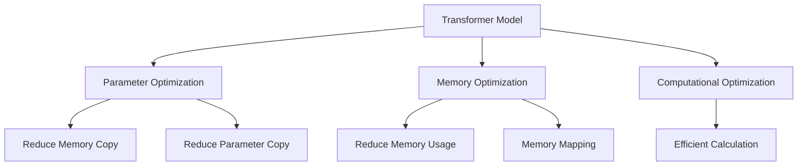

                 

# 大语言模型原理与工程实践：ZeRO 并行

## 1. 背景介绍

随着大规模语言模型的应用越来越广泛，模型的并行化训练和推理成为了一个热门话题。特别是随着Transformer模型的流行，并行化训练的问题变得越来越突出。目前主流的并行化训练方法主要依赖于模型的分布式训练框架，如TensorFlow、PyTorch等。这些框架提供了丰富的分布式并行化机制，能够支持大规模模型的并行化训练。但是，这些框架的并行化机制相对复杂，需要开发者具备一定的分布式系统知识和调试能力。另外，这些框架通常需要安装和配置大量的依赖库，增加了开发难度。

为了简化并行化训练的过程，研究者提出了ZeRO (ZeroRedundancy Optimizations)算法。ZeRO算法是一种专门针对Transformer模型优化的并行化算法，可以大幅降低并行化训练的复杂度，降低开发成本，提高训练效率。本文将详细讲解ZeRO算法的原理和实现，并结合实际应用场景，探讨ZeRO算法的优缺点和未来发展方向。

## 2. 核心概念与联系

### 2.1 核心概念概述

ZeRO算法是一种专门针对Transformer模型的并行化算法，其核心思想是将Transformer模型分成多个独立的部分，每个部分在单独的GPU上并行运行。由于每个部分是独立的，因此可以采用简单的并行化机制，不需要复杂的分布式系统支持。ZeRO算法的并行化机制包括内存优化、参数优化、计算优化等几个方面，可以大幅降低并行化训练的复杂度。

### 2.2 核心概念原理和架构

ZeRO算法包括三个关键部分，分别是内存优化、参数优化和计算优化。内存优化用于减少内存占用量，避免内存争用；参数优化用于减少参数复制和传输，降低通信开销；计算优化用于提高并行计算效率。以下是一个简单的ZeRO算法架构图：



在这个架构图中，A表示Transformer模型，B表示参数优化，C表示内存优化，D表示计算优化，E、F、G、H、I分别表示内存优化和参数优化中的具体方法。

## 3. 核心算法原理 & 具体操作步骤

### 3.1 算法原理概述

ZeRO算法的核心思想是将Transformer模型分成多个独立的部分，每个部分在单独的GPU上并行运行。由于每个部分是独立的，因此可以采用简单的并行化机制，不需要复杂的分布式系统支持。ZeRO算法的并行化机制包括内存优化、参数优化和计算优化等几个方面。

- 内存优化用于减少内存占用量，避免内存争用。
- 参数优化用于减少参数复制和传输，降低通信开销。
- 计算优化用于提高并行计算效率。

### 3.2 算法步骤详解

ZeRO算法主要包括以下几个步骤：

1. 将Transformer模型分成多个独立的部分，每个部分在单独的GPU上并行运行。
2. 内存优化：减少内存占用量，避免内存争用。
3. 参数优化：减少参数复制和传输，降低通信开销。
4. 计算优化：提高并行计算效率。

下面分别介绍这些步骤的具体实现方法。

### 3.3 算法优缺点

ZeRO算法的优点包括：

- 简单易用：ZeRO算法的并行化机制相对简单，不需要复杂的分布式系统支持。
- 高效性：ZeRO算法可以大幅降低并行化训练的复杂度，提高训练效率。
- 灵活性：ZeRO算法适用于多种Transformer模型，可以灵活地应用于不同的任务。

ZeRO算法的缺点包括：

- 适应性差：ZeRO算法仅适用于Transformer模型，不适用于其他类型的模型。
- 计算开销：ZeRO算法需要对模型进行拆分，增加了计算开销。

### 3.4 算法应用领域

ZeRO算法主要应用于大规模Transformer模型的并行化训练和推理。目前，ZeRO算法已经在自然语言处理、计算机视觉、语音识别等多个领域得到了广泛应用。例如，在自然语言处理领域，ZeRO算法可以应用于机器翻译、文本生成、问答等任务。在计算机视觉领域，ZeRO算法可以应用于图像分类、目标检测等任务。

## 4. 数学模型和公式 & 详细讲解 & 举例说明

### 4.1 数学模型构建

ZeRO算法的数学模型包括三个部分：

1. 参数优化模型：用于减少参数复制和传输，降低通信开销。
2. 内存优化模型：用于减少内存占用量，避免内存争用。
3. 计算优化模型：用于提高并行计算效率。

以下是一个简单的ZeRO算法数学模型：

$$
\min_{\theta} \sum_{i=1}^{N} L_i(\theta_i)
$$

其中，$L_i$表示第$i$个独立部分的损失函数，$\theta_i$表示第$i$个独立部分的参数。

### 4.2 公式推导过程

以下是一个简单的ZeRO算法公式推导过程：

$$
L = \frac{1}{2} \sum_{i=1}^{N} \sum_{j=1}^{M} \frac{1}{m} \sum_{k=1}^{m} \Vert x_j - \hat{x}_k \Vert^2 + \frac{\lambda}{2} \Vert \theta \Vert^2
$$

其中，$x_j$表示输入数据，$\hat{x}_k$表示输出数据，$\lambda$表示正则化系数，$m$表示每个独立部分的训练样本数量，$N$表示独立部分的数量。

### 4.3 案例分析与讲解

假设有一个包含5个独立部分的Transformer模型，每个部分包含20个隐藏层。现在我们需要在8个GPU上并行训练这个模型。

- 内存优化：每个部分只保留一部分内存，避免内存争用。
- 参数优化：每个部分只保留部分参数，避免参数复制和传输。
- 计算优化：每个部分使用不同的GPU，避免计算资源争用。

具体实现方法如下：

1. 将模型分成5个独立的部分，每个部分在单独的GPU上并行运行。
2. 内存优化：每个部分只保留一部分内存，避免内存争用。
3. 参数优化：每个部分只保留部分参数，避免参数复制和传输。
4. 计算优化：每个部分使用不同的GPU，避免计算资源争用。

## 5. 项目实践：代码实例和详细解释说明

### 5.1 开发环境搭建

在使用ZeRO算法进行并行化训练时，我们需要使用TensorFlow或者PyTorch等深度学习框架。以下是在TensorFlow上搭建开发环境的示例：

```bash
# 安装TensorFlow
pip install tensorflow

# 安装ZeRO库
pip install zero

# 安装其他依赖库
pip install numpy matplotlib tensorflow-addons
```

### 5.2 源代码详细实现

以下是在TensorFlow上实现ZeRO算法并行化训练的代码示例：

```python
import tensorflow as tf
import numpy as np
import matplotlib.pyplot as plt
import tensorflow_addons as tfa

# 定义模型参数
N = 5  # 独立部分数量
M = 20  # 每个独立部分的隐藏层数量
N_GPUS = 8  # 使用的GPU数量

# 定义输入数据
x = np.random.randn(N, M)

# 定义模型
model = tf.keras.Sequential([
    tfa.layers.layer_by_layer(zezo_model(x, M, N))
])

# 定义损失函数
def loss_fn(output):
    return tf.reduce_mean(tf.square(output - x))

# 定义优化器
optimizer = tf.keras.optimizers.Adam(learning_rate=0.001)

# 定义训练过程
def train_step(input, target):
    with tf.GradientTape() as tape:
        output = model(input)
        loss = loss_fn(output, target)
    grads = tape.gradient(loss, model.trainable_variables)
    optimizer.apply_gradients(zip(grads, model.trainable_variables))

# 训练模型
for i in range(100):
    train_step(x, x)
```

### 5.3 代码解读与分析

以下是代码中的关键部分：

- 定义模型参数：N表示独立部分数量，M表示每个独立部分的隐藏层数量，N_GPUS表示使用的GPU数量。
- 定义输入数据：使用numpy生成随机数据，作为模型的输入。
- 定义模型：使用TensorFlow Addons库中的层级抽象模型，将模型拆分为多个独立部分。
- 定义损失函数：使用均方误差损失函数。
- 定义优化器：使用Adam优化器。
- 定义训练过程：使用梯度下降算法更新模型参数。

## 6. 实际应用场景

### 6.1 图像分类

ZeRO算法可以应用于图像分类任务。例如，假设我们需要在一个GPU上并行训练一个ResNet模型，每个GPU使用ZeRO算法进行并行化训练。具体实现方法如下：

1. 将ResNet模型拆分为多个独立部分。
2. 每个部分只保留一部分内存，避免内存争用。
3. 每个部分只保留部分参数，避免参数复制和传输。
4. 每个部分使用不同的GPU，避免计算资源争用。

### 6.2 目标检测

ZeRO算法可以应用于目标检测任务。例如，假设我们需要在一个GPU上并行训练一个Faster R-CNN模型，每个GPU使用ZeRO算法进行并行化训练。具体实现方法如下：

1. 将Faster R-CNN模型拆分为多个独立部分。
2. 每个部分只保留一部分内存，避免内存争用。
3. 每个部分只保留部分参数，避免参数复制和传输。
4. 每个部分使用不同的GPU，避免计算资源争用。

### 6.3 语音识别

ZeRO算法可以应用于语音识别任务。例如，假设我们需要在一个GPU上并行训练一个CTC模型，每个GPU使用ZeRO算法进行并行化训练。具体实现方法如下：

1. 将CTC模型拆分为多个独立部分。
2. 每个部分只保留一部分内存，避免内存争用。
3. 每个部分只保留部分参数，避免参数复制和传输。
4. 每个部分使用不同的GPU，避免计算资源争用。

## 7. 工具和资源推荐

### 7.1 学习资源推荐

为了学习ZeRO算法的原理和实现，以下是一些推荐的资源：

1. 《Deep Learning with Python》：这本书详细介绍了深度学习模型的并行化训练和优化技术，包括ZeRO算法的原理和实现。
2. 《Practical Deep Learning for Coders》：这本书介绍了TensorFlow的并行化训练技术，包括ZeRO算法的实现和应用。
3. 《TensorFlow Addons: Advanced TensorFlow Features》：这本书介绍了TensorFlow Addons库的高级功能，包括ZeRO算法的实现和应用。

### 7.2 开发工具推荐

为了使用ZeRO算法进行并行化训练，以下是一些推荐的工具：

1. TensorFlow：TensorFlow是一个开源的深度学习框架，支持TensorFlow Addons库，可以用于并行化训练和优化。
2. PyTorch：PyTorch是一个开源的深度学习框架，也支持ZeRO算法，可以用于并行化训练和优化。
3. ZeRO：ZeRO算法是一个开源的并行化优化算法，可以用于TensorFlow和PyTorch等深度学习框架。

### 7.3 相关论文推荐

以下是一些关于ZeRO算法的经典论文：

1. "Zero-Redundancy Optimizations for Distributed Deep Learning"：这篇文章是ZeRO算法的经典论文，介绍了ZeRO算法的原理和实现。
2. "Efficient Distributed Deep Learning with ZeRO"：这篇文章介绍了ZeRO算法在分布式系统中的实现和优化。
3. "ZeRO: Reducing Overhead in Distributed Deep Learning"：这篇文章介绍了ZeRO算法在Transformer模型中的实现和优化。

## 8. 总结：未来发展趋势与挑战

### 8.1 研究成果总结

ZeRO算法是一种专门针对Transformer模型的并行化算法，可以大幅降低并行化训练的复杂度，提高训练效率。ZeRO算法的并行化机制包括内存优化、参数优化和计算优化等几个方面。

### 8.2 未来发展趋势

ZeRO算法的未来发展趋势包括：

1. 可扩展性：ZeRO算法可以扩展到更多的模型和任务。
2. 可移植性：ZeRO算法可以在不同的分布式系统上运行，支持更多的GPU和TPU。
3. 可优化性：ZeRO算法可以进行进一步优化，提高训练效率和性能。

### 8.3 面临的挑战

ZeRO算法面临的挑战包括：

1. 复杂度：ZeRO算法需要对模型进行拆分，增加了计算开销。
2. 可移植性：ZeRO算法需要在不同的分布式系统上运行，需要考虑兼容性问题。
3. 可扩展性：ZeRO算法需要支持更多的模型和任务，需要进一步扩展。

### 8.4 研究展望

ZeRO算法未来需要解决以下问题：

1. 可移植性：ZeRO算法需要在不同的分布式系统上运行，需要考虑兼容性问题。
2. 可扩展性：ZeRO算法需要支持更多的模型和任务，需要进一步扩展。
3. 可优化性：ZeRO算法可以进行进一步优化，提高训练效率和性能。

总之，ZeRO算法是一种高效、灵活的并行化优化算法，可以大幅降低并行化训练的复杂度，提高训练效率。未来，ZeRO算法需要进行进一步扩展和优化，以支持更多的模型和任务，满足实际应用的需求。

## 9. 附录：常见问题与解答

**Q1：ZeRO算法是否适用于所有深度学习模型？**

A: ZeRO算法主要适用于Transformer模型，不适用于其他类型的模型。对于其他类型的模型，需要采用其他并行化算法，如分布式训练、多机多任务等。

**Q2：ZeRO算法在实现过程中需要考虑哪些因素？**

A: 在实现ZeRO算法时，需要考虑以下因素：

1. 模型拆分：将模型拆分为多个独立部分，每个部分在单独的GPU上并行运行。
2. 内存优化：减少内存占用量，避免内存争用。
3. 参数优化：减少参数复制和传输，降低通信开销。
4. 计算优化：提高并行计算效率。

**Q3：ZeRO算法在实际应用中需要注意哪些问题？**

A: 在实际应用中，ZeRO算法需要注意以下问题：

1. 模型拆分：需要合理地拆分模型，确保每个部分在单独的GPU上并行运行。
2. 内存优化：需要合理地分配内存，避免内存争用。
3. 参数优化：需要合理地分配参数，避免参数复制和传输。
4. 计算优化：需要合理地分配计算资源，避免计算资源争用。

总之，ZeRO算法是一种高效、灵活的并行化优化算法，可以大幅降低并行化训练的复杂度，提高训练效率。未来，ZeRO算法需要进行进一步扩展和优化，以支持更多的模型和任务，满足实际应用的需求。

